# Image Prompt Generator

A multi-model AI image prompt generator and prompt gallery for GPT Image, Nano Banana Pro, Seedream, Grok, Gemini, and related image models.

[Chinese README](readme/zh.md)

Site: <https://image-prompt-generator.com/>
GitHub: <https://github.com/xianyu110/image-prompt-generator>

## Maintainer and Contact

This project is maintained by [Maynor / xianyu110](https://github.com/xianyu110), an AI coding tools practitioner, full-stack developer, and Chinese AI tutorial author.

- GitHub: <https://github.com/xianyu110>
- QQ: [1002569303](https://qm.qq.com/q/Q4YTVK5T6q)
- WeChat Official Account: [MaynorAI](https://upload.maynor1024.live/file/1773461955906_qrcode_for_gh_c749803541de_1280.jpg)
- CSDN: <https://blog.csdn.net/xianyu120>
- Bilibili: <https://space.bilibili.com/399102586>
- YouTube: <https://www.youtube.com/@buguniao537>
- X: <https://x.com/MaynorAI1>

## Other Popular Projects

Selected public projects from the same maintainer:

- [awesome-openclaw-tutorial](https://github.com/xianyu110/awesome-openclaw-tutorial): a complete Chinese OpenClaw tutorial covering setup, configuration, real examples, and common pitfalls.
- [clawbot](https://github.com/xianyu110/clawbot): a practical Clawbot configuration guide for running a Claude Code relay environment.
- [gpt-codex](https://github.com/xianyu110/gpt-codex): an OpenAI Codex tutorial site built for Chinese developers, covering access, setup, and real workflows.
- [gemini-nanobanana-pro](https://github.com/xianyu110/gemini-nanobanana-pro): a Gemini image generation and editing web app built with Next.js.
- [awesome-chatgpt-project](https://github.com/xianyu110/awesome-chatgpt-project): ChatGPT registration notes, project resources, and practical usage tips.
- [awesome-claudcode-tutorial](https://github.com/xianyu110/awesome-claudcode-tutorial): a Claude Code Chinese tutorial from basic usage to team workflows.
- [awesome-gptimage2](https://github.com/xianyu110/awesome-gptimage2): a GPT Image 2 resource site focused on model capabilities, prompt frameworks, and commercial image generation.
- [CodexPlusPlus](https://github.com/xianyu110/CodexPlusPlus): an external Codex App enhancement launcher that injects features through the Chromium DevTools Protocol.

## Overview

- Total prompts: 585
- Prompts with images: 581
- Dataset models: GPT Image 1.5 (80), GPT Image 2 (139), Gemini 3 Pro (49), Nano Banana Pro (208), Seedream (105), Seedream 5 Pro (4)
- Page structure: prompt composer on top, prompt cards below, with author/source, image, and copy/try actions.
- Data note: the old mismatched `assets/thumbs/gpt-*` cards have been removed from the dataset; the list below is regenerated from the current `data/prompts.json`.

## Model Categories

- [GPT Image 2 Prompts](#gpt-image-2-prompts): 139 entries
- [Nano Banana Pro Prompts](#nano-banana-pro-prompts): 208 entries
- [Seedream 4.5 Prompts](#seedream-45-prompts): 105 entries
- [GPT Image 1.5 Prompts](#gpt-image-15-prompts): 80 entries
- [Seedream 5 Pro Templates](#seedream-5-pro-templates): 4 entries
- [Seedance 2.0 Prompts](#seedance-20-prompts): 0 entries
- [Grok Imagine Prompts](#grok-imagine-prompts): 0 entries
- [Gemini 3 Pro Prompts](#gemini-3-pro-prompts): 49 entries

## Local Preview

```bash
python3 -m http.server 8787
```

Then open <http://localhost:8787/>.

## Rebuild Data

```bash
python3 scripts/build_data.py
python3 scripts/import_selected_sources.py
```

## Images and Prompts

> Grouped by model. Each entry keeps author/source attribution; local image assets are shown with relative paths.

## GPT Image 2 Prompts

- Entries: 139
- With images: 139

### GPT Image 2 Prompts #1: Reusable Pixar-style 3D character portrait prompt

- Category: `Portrait`
- Model: `GPT Image 2`
- Author / Source: [Zara - @ZaraIrahh](https://x.com/ZaraIrahh/status/2048429244632408300)
- Image: `assets/imported/xianyu110/awesome-gptimage2/latest-prompts-1-Reusable-Pixar-style-3D-character-portrait-prompt.jpg`


Prompt:

```text
A stylized Pixar-style 3D portrait of a young person with smooth skin, large expressive blue eyes, soft facial features, wearing round transparent glasses, modern hairstyle (short styled hair / soft bob cut), casual outfit (hoodie or minimal sweater), slight head tilt and warm smile, friendly and approachable expression, ultra-clean character design, vibrant orange-to-pink gradient background, soft studio lighting with subtle rim light, cinematic depth of field, ultra-detailed, 8K render, octane render style.
```

### GPT Image 2 Prompts #2: Reusable cute animal selfie prompt

- Category: `Creative`
- Model: `GPT Image 2`
- Author / Source: [Al-Shamus - @im_shahid7](https://x.com/im_shahid7/status/2048432604291240275)
- Image: `assets/imported/xianyu110/awesome-gptimage2/latest-prompts-2-Reusable-cute-animal-selfie-prompt.jpg`


Prompt:

```text
a cute orange and white cat, he looks like hes thinking. taking a selfie inside a dramatically lit room dark room. the cat has big eyes, a chubby face, and a happy expression. the image is a wide-angle shot with sharp focus and high resolution, resulting in a high-definition photograph.
```

### GPT Image 2 Prompts #3: Reusable fashion editorial portrait prompt with effects

- Category: `Portrait`
- Model: `GPT Image 2`
- Author / Source: [𝗦𝗮𝗻𝗶𝗮 - @saniaspeaks_](https://x.com/saniaspeaks_/status/2048431408318705733)
- Image: `assets/imported/xianyu110/awesome-gptimage2/latest-prompts-3-Reusable-fashion-editorial-portrait-prompt-with-effects.jpg`


Prompt:

```text
portrait of a young woman with short curly black hair and fair skin, wearing transparent safety goggles and a blue ribbed turtleneck sweater, seated in front of a solid azure blue background, double-exposure motion blur effect to the left side of the face, subtle soft reflections on the glasses, cold ambient lighting, high sharpness on facial features with dreamlike blur trail overlaying second face, fashion editorial studio setup, icy color palette, futuristic retro mood.
```

### GPT Image 2 Prompts #4: Reusable artistic progression/multi-panel prompt

- Category: `Creative`
- Model: `GPT Image 2`
- Author / Source: [Sharon Riley - @Just_sharon7](https://x.com/Just_sharon7/status/2048440567605190853)
- Image: `assets/imported/xianyu110/awesome-gptimage2/latest-prompts-4-Reusable-artistic-progression-multi-panel-prompt.jpg`

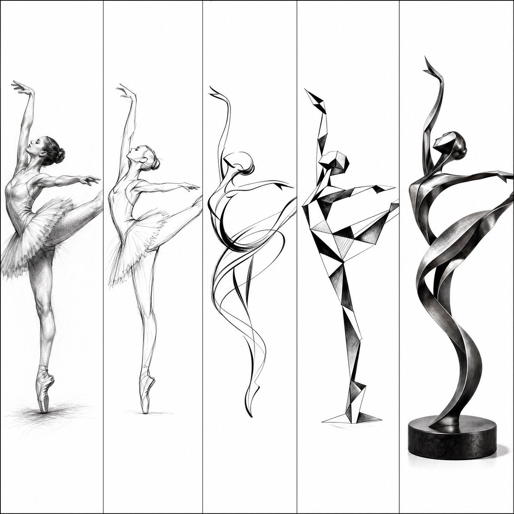

Prompt:

```text
Artistic progression in five vertical panels: from realistic sketch to modern abstract sculpture of a ballerina in arabesque pose. 1. Detailed pencil sketch of ballerina on pointe, elegant extended leg and arms. 2. Refined mid-stage sketch. 3. Strongly stylized flowing lines. 4. Angular geometric abstraction. 5. Final sleek, ribbon-twisted contemporary metal sculpture with beautiful curves and tension. Black ink and charcoal style on white background, high-contrast artistic study, luxury sculpture aesthetic --ar 3:2
```

### GPT Image 2 Prompts #5: Reusable single-prompt design generation example

- Category: `Creative`
- Model: `GPT Image 2`
- Author / Source: [UxUi Tega (Design & Ai) - @Tegadesigns](https://x.com/Tegadesigns/status/2048429483879796831)
- Image: `assets/imported/xianyu110/awesome-gptimage2/latest-prompts-5-Reusable-single-prompt-design-generation-example.jpg`

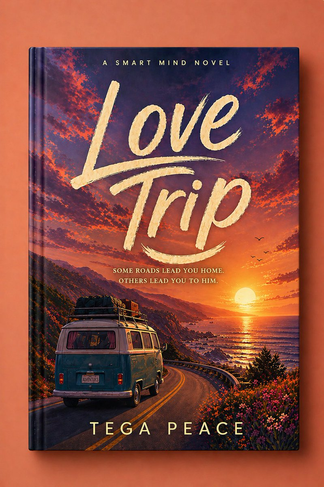

Prompt:

```text
[Single prompt used to generate the two design variations shown; exact text not expanded in post but confirmed as GPT Images 2.0 usage]
```

### GPT Image 2 Prompts #6: Reusable cyber-poetry portrait prompt with text projection

- Category: `Portrait`
- Model: `GPT Image 2`
- Author / Source: [Aijaz - @iamsofiaijaz](https://x.com/iamsofiaijaz/status/2048436757855945137)
- Image: `assets/imported/xianyu110/awesome-gptimage2/latest-prompts-6-Reusable-cyber-poetry-portrait-prompt-with-text-projection.jpg`


Prompt:

```text
A cinematic, ultra-realistic close-up portrait of a young woman with wet, tousled dark hair and luminous skin, staring directly into the camera with an intense, introspective expression. Glowing cyan handwritten text and symbols are projected across her face, neck, and shoulders, resembling poetic phrases, equations, and abstract handwriting. The light reflections shimmer on her damp skin, creating a futuristic, cyber-poetry aesthetic. Dark, moody background with soft shadows, shallow depth of field, sharp focus on the eyes, high contrast lighting, teal and blue color palette, hyper-detailed skin texture, photorealistic, dramatic atmosphere, cyberpunk meets fine-art portrait photography, 8K quality, cinematic lighting
```

### GPT Image 2 Prompts #7: Reusable luxury fashion ad prompt with text

- Category: `Poster`
- Model: `GPT Image 2`
- Author / Source: [Mr Das - @MrDasOnX](https://x.com/MrDasOnX/status/2048432301445644740)
- Image: `assets/imported/xianyu110/awesome-gptimage2/latest-prompts-7-Reusable-luxury-fashion-ad-prompt-with-text.jpg`

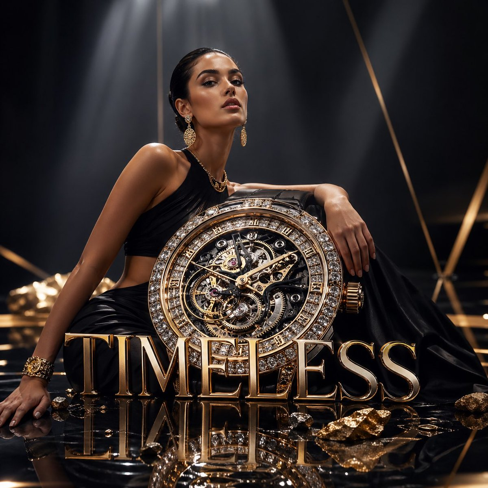

Prompt:

```text
Avant-garde luxury watch fashion ad, sophisticated female model in sleek black evening attire dramatically posing with an oversized glowing mechanical watch as the centerpiece, intricate gears and sparkling diamonds visible, bold metallic typography ‘TIMELESS’ floating in the foreground, reflective dark studio floor with scattered gold accents and subtle light beams, high-end editorial photography, dramatic cinematic lighting, luxurious atmosphere –ar 1:1 –stylize 750
```

### GPT Image 2 Prompts #8: Reusable cinematic urban portrait prompt

- Category: `Portrait`
- Model: `GPT Image 2`
- Author / Source: [K - @ChillaiKalan__](https://x.com/ChillaiKalan__/status/2048435840217731378)
- Image: `assets/imported/xianyu110/awesome-gptimage2/latest-prompts-8-Reusable-cinematic-urban-portrait-prompt.jpg`


Prompt:

```text
Edit this photo (keep the face unchanged), portrait. Cinematic close-up of a young woman at night in a moody urban setting with neon lighting. She looks back over her shoulder with a soft yet intense expression. Long dark wavy hair with wispy bangs, slightly wind-swept. Natural dewy makeup, minimal styling, wearing a dark oversized leather jacket. Background: blurred city bokeh with streetlights and car lights. Shot on Sony A7S III, 85mm lens, shallow depth of field. Off-center composition. Dramatic split lighting: cool blue on one side, warm red on the other. Teal-and-red color grade, high contrast, subtle film grain and glow.
```

### GPT Image 2 Prompts #9: Reusable luxury sports editorial prompt

- Category: `Product`
- Model: `GPT Image 2`
- Author / Source: [Taaruk - @Taaruk_](https://x.com/Taaruk_/status/2048438203611533367)
- Image: `assets/imported/xianyu110/awesome-gptimage2/latest-prompts-9-Reusable-luxury-sports-editorial-prompt.jpg`

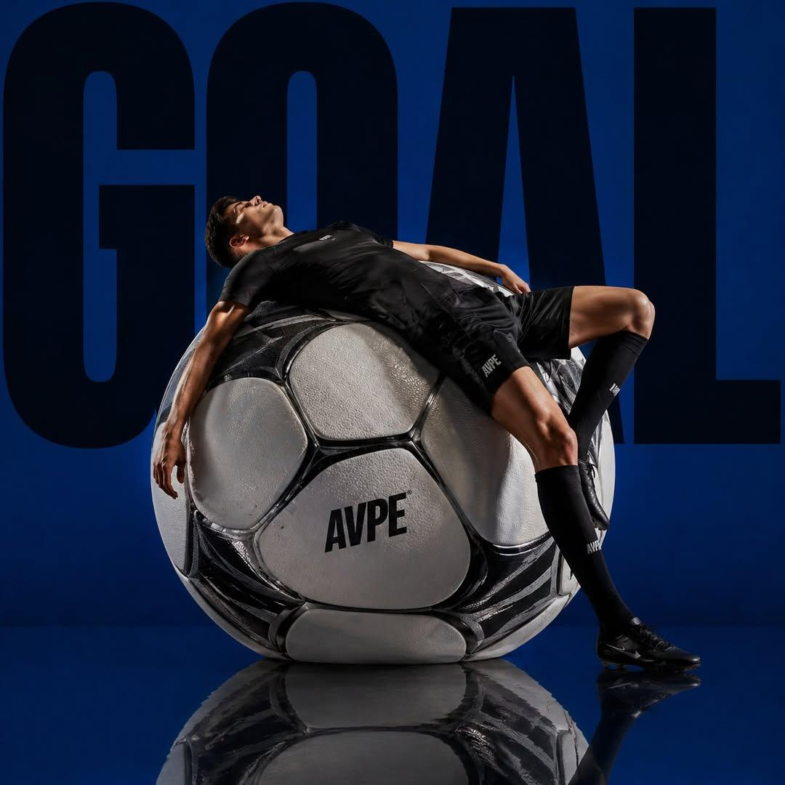

Prompt:

```text
A dramatic sports editorial scene featuring a professional male footballer wearing an all-black kit, reclining confidently on top of an oversized soccer ball. The ball is hyper-detailed with realistic panels and branding, placed on a glossy reflective floor. The athlete’s pose is relaxed yet powerful, with one arm hanging down and legs extended, showcasing strength and elegance. The background is a bold deep blue studio with massive “GOAL” typography in large, subtle shadowed letters. High-contrast studio lighting with sharp highlights and deep shadows sculpting the body. Clean, minimal composition with a luxury sports campaign aesthetic. Shot with an 85mm lens, ultra-realistic, cinematic lighting, crisp details, 8K resolution, Nike/Adidas-style commercial photography.
```

### GPT Image 2 Prompts #10: Reusable detailed multi-panel transformation prompt for GPT Image 2

- Category: `Video`
- Model: `GPT Image 2`
- Author / Source: [simply - @kingofdairyque](https://x.com/kingofdairyque/status/2048447045640544549)
- Image: `assets/imported/xianyu110/awesome-gptimage2/latest-prompts-10-Reusable-detailed-multi-panel-transformation-prompt-for-GPT-Image-2.jpg`

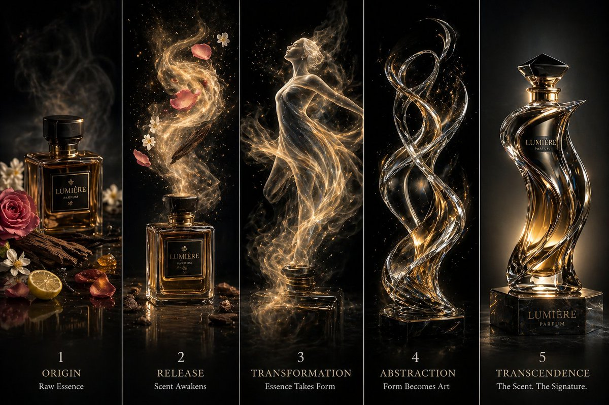

Prompt:

```text
A high-end cinematic transformation artwork displayed in five vertical panels, showing a luxury perfume evolving from raw essence into a sculptural masterpiece, each panel separated by thin black dividers. Panel 1 (Origin): A premium glass perfume bottle resting on a dark reflective surface, surrounded by raw ingredients like rose petals, oud wood, citrus peel, and mist, soft studio lighting, elegant shadows. Panel 2 (Release): The perfume begins to diffuse into the air, visible fragrant mist swirling upward in fluid motion, forming soft organic shapes, glowing particles and vapor trails. Panel 3 (Transformation): The mist starts shaping into a semi-formed silhouette (abstract human figure or flowing fabric), blending liquid, vapor, and light, luminous and dreamy. Panel 4 (Abstraction): The form becomes fully abstract — flowing ribbons of scent turning into sleek glass-like curves and fluid geometry, dynamic motion frozen mid-air. Panel 5 (Transcendence): Final form — a luxurious sculptural perfume bottle or abstract glass statue inspired by the scent’s essence, polished, reflective, with glowing highlights, sitting on a minimal pedestal. Style: ultra-detailed, photorealistic to abstract progression, deep black background, gold and silver accents, soft glow, high contrast lighting, glossy reflections, cinematic luxury aesthetic, perfume ad style, 4K quality, sharp focus.
```

### GPT Image 2 Prompts #11: Recent post with complete reusable sticker pack prompt and output image.

- Category: `Portrait`
- Model: `GPT Image 2`
- Author / Source: [Noor 🌸](https://x.com/Noor_ul_ain43/status/2049171970227581378)
- Image: `assets/imported/xianyu110/awesome-gptimage2/latest-prompts-11-Recent-post-with-complete-reusable-sticker-pack-prompt-and-output-image..jpg`


Prompt:

```text
A high-quality sticker sheet featuring a cute semi-realistic cartoon girl inspired by the provided reference face: short messy bob haircut, bright yellow hair, soft freckles, brown eyes, glossy lips, hoop earrings, wearing a sleeveless yellow top. Create a grid of multiple expressions and poses: ... Ultra-detailed, 4K resolution, consistent character design across all stickers, no watermark, no extra text outside stickers.
```

### GPT Image 2 Prompts #12: Detailed reusable sports poster prompt for GPT Image 2 with media outputs.

- Category: `Poster`
- Model: `GPT Image 2`
- Author / Source: [SPEEDYAI](https://x.com/SPEEDAI07/status/2049171788731465970)
- Image: `assets/imported/xianyu110/awesome-gptimage2/latest-prompts-12-Detailed-reusable-sports-poster-prompt-for-GPT-Image-2-with-media-outputs..jpg`


Prompt:

```text
Design a '4:5' sports campaign poster that elevates 'Kylian Mbappé' into a sculptural icon of ruthless speed and modern dominance, capturing a moment of explosive elevation as if gravity itself is shattering beneath his acceleration. ... FINISH: Crisp detail on skin and fabric ... NEGATIVE: Avoid generic football poses ...
```

### GPT Image 2 Prompts #13: Reusable magazine cover prompt with GPT Image 2 reference.

- Category: `Portrait`
- Model: `GPT Image 2`
- Author / Source: [Mira](https://x.com/miratechtool/status/2049170185995612314)
- Image: `assets/imported/xianyu110/awesome-gptimage2/latest-prompts-13-Reusable-magazine-cover-prompt-with-GPT-Image-2-reference..jpg`


Prompt:

```text
Create a hyper-realistic Forbes “30 Under 30” magazine-style portrait of the same woman from the reference image (preserve her exact facial features, identity, and expression 100%). She is sitting confidently on a modern luxury sofa in a high-end office or studio environment. ... Outfit: smart professional attire ...
```

### GPT Image 2 Prompts #14: Highly detailed reusable storyboard prompt with strict parameters for ChatGPT Image 2.0.

- Category: `Portrait`
- Model: `GPT Image 2`
- Author / Source: [Johnn](https://x.com/john_my07/status/2049168794195837167)
- Image: `assets/imported/xianyu110/awesome-gptimage2/latest-prompts-14-Highly-detailed-reusable-storyboard-prompt-with-strict-parameters-for-ChatGPT-Imag.jpg`

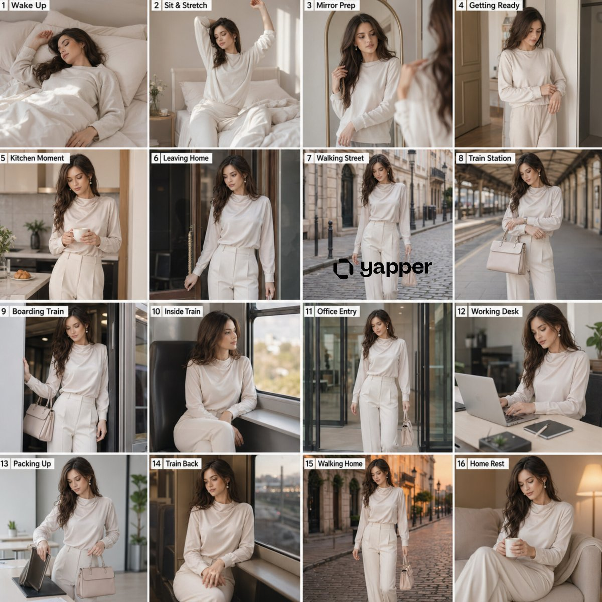

Prompt:

```text
16-Step Daily Routine Storyboard (4×4 Grid) [VISUAL STYLE] Clean, high-end lifestyle storyboard in a 4×4 grid (16 panels) ... [16 PANELS, EXACT STORY FLOW] Wake Up ... [RESTRICTIONS] No revealing clothing No extra characters ...
```

### GPT Image 2 Prompts #15: High engagement (28 likes, 5 reposts, 3486 views), contains explicit GPT Image 2.0 prompt reference with media example

- Category: `Creative`
- Model: `GPT Image 2`
- Author / Source: [Min Choi](https://x.com/minchoi/status/2048793993060712894)
- Image: `assets/imported/xianyu110/awesome-gptimage2/latest-prompts-15-High-engagement-28-likes-5-reposts-3486-views-contains-explicit-GPT-Image-2.0-prom.jpg`


Prompt:

```text
Prompt in comment (full reusable prompt for travel magazine cover with ChatGPT Images 2.0 - exact text not expanded in post but confirmed present and reusable for magazine-style output)
```

### GPT Image 2 Prompts #16: Explicit full prompt text provided, media present, GPT Image 2 usage

- Category: `Video`
- Model: `GPT Image 2`
- Author / Source: [Harboris](https://x.com/harboriis/status/2048791077587759547)
- Image: `assets/imported/xianyu110/awesome-gptimage2/latest-prompts-16-Explicit-full-prompt-text-provided-media-present-GPT-Image-2-usage.jpg`


Prompt:

```text
Transform the uploaded image into cinematic 3-frame sequential film stills (horizontal frames stacked vertically), full bleed edge-to-edge. Each frame should show a different moment from the same scene... [full cinematic prompt details]
```

### GPT Image 2 Prompts #17: Explicit prompt for product-style image with GPT image 2, media included

- Category: `Product`
- Model: `GPT Image 2`
- Author / Source: [𝐌](https://x.com/Strength04_X/status/2048792190948938130)
- Image: `assets/imported/xianyu110/awesome-gptimage2/latest-prompts-17-Explicit-prompt-for-product-style-image-with-GPT-image-2-media-included.jpg`

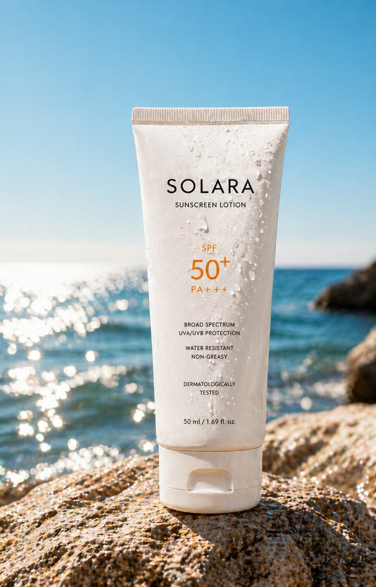

Prompt:

```text
A sleek white sunscreen lotion tube stands upright on a sunlit rock by the sea. Light reflects off the gentle blue waves behind it, while fine droplets sparkle on the surface of the tube. ... [full prompt details]
```

### GPT Image 2 Prompts #18: Explicit prompt reference with media, GPT image 2 usage, reusable content

- Category: `Infographic`
- Model: `GPT Image 2`
- Author / Source: [Ai Girllie](https://x.com/Inshrah_ali_/status/2048798070675218807)
- Image: `assets/imported/xianyu110/awesome-gptimage2/latest-prompts-18-Explicit-prompt-reference-with-media-GPT-image-2-usage-reusable-content.jpg`

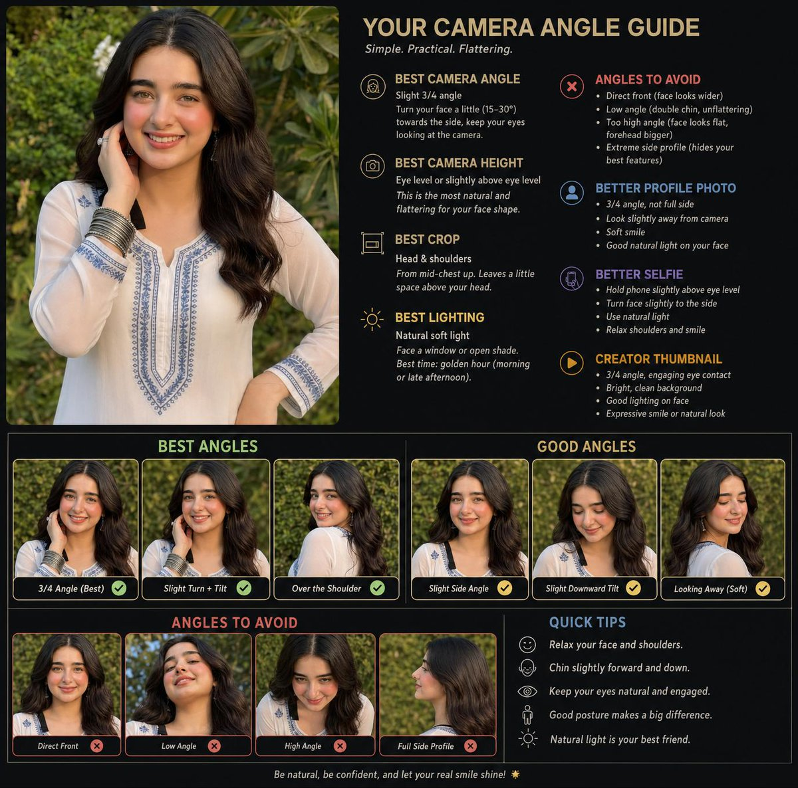

Prompt:

```text
Prompt 👇 (detailed reusable prompt for ultimate camera guide infographic using GPT Image 2)
```

### GPT Image 2 Prompts #19: JSON-style reusable prompt explicitly included, media examples, GPT image 2 mentioned

- Category: `Creative`
- Model: `GPT Image 2`
- Author / Source: [Miz](https://x.com/mizq06/status/2048790504817737741)
- Image: `assets/imported/xianyu110/awesome-gptimage2/latest-prompts-19-JSON-style-reusable-prompt-explicitly-included-media-examples-GPT-image-2-mentione.jpg`


Prompt:

```text
A young woman with long red hair sitting on a towel at a sunny beach. She is wearing a fitted beige tank top and light blue denim shorts with a brown belt. She holds sunglasses in one hand and looks off into the distance while the other hand rests in her hair. The background features soft sand, palm trees, and a clear blue sky with warm golden sunlight casting natural highlights. A small handbag sits beside her. The atmosphere is bright, summery, and relaxed. style: photorealistic, lighting: natural golden hour sunlight, mood: warm, relaxed, summery, camera: medium shot, eye-level perspective, quality: high detail, sharp focus
```

### GPT Image 2 Prompts #20: Reusable detailed structured prompt with media, satisfies non-empty prompt rule

- Category: `Portrait`
- Model: `GPT Image 2`
- Author / Source: [Johnn](https://x.com/john_my07/status/2048803726312571335)
- Image: `assets/imported/xianyu110/awesome-gptimage2/latest-prompts-20-Reusable-detailed-structured-prompt-with-media-satisfies-non-empty-prompt-rule.jpg`

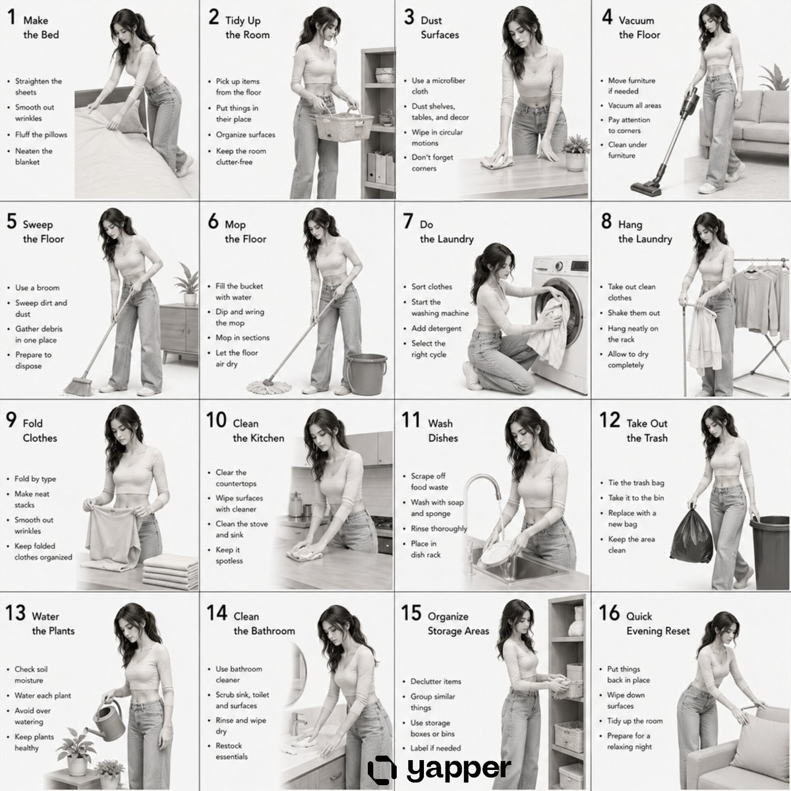

Prompt:

```text
[VISUAL STYLE] Monochrome grayscale composition... [complete long structured prompt including grid layout, character details, wardrobe, panel structure, motion indicators, render quality, restrictions for household chores sequence]
```

### GPT Image 2 Prompts #21: High engagement (11 likes, 3571 views), includes full reusable detailed GPT Image 2 prompt for typography posters

- Category: `Poster`
- Model: `GPT Image 2`
- Author / Source: [宝玉](https://x.com/dotey/status/2048793351290327381)
- Image: `assets/imported/xianyu110/awesome-gptimage2/latest-prompts-21-High-engagement-11-likes-3571-views-includes-full-reusable-detailed-GPT-Image-2-pr.jpg`


Prompt:

```text
Create ONE finished premium conceptual typography poster for the exact title: “[INPUT_TEXT]” ... [complete long prompt structure including typography rules, color system, composition, restrictions for GPT Image 2]
```

### GPT Image 2 Prompts #22: Direct GPT image 2 usage for ad campaign, high-quality media examples, prompt offered

- Category: `Product`
- Model: `GPT Image 2`
- Author / Source: [Matt AI 🤖](https://x.com/TheMattAnalysis/status/2048795144648892803)
- Image: `assets/imported/xianyu110/awesome-gptimage2/latest-prompts-22-Direct-GPT-image-2-usage-for-ad-campaign-high-quality-media-examples-prompt-offere.jpg`


Prompt:

```text
Prompt available via comment request (reusable setup for premium ad campaign with ChatGPT image 2 on product - confirmed contextually present)
```

### GPT Image 2 Prompts #23: Explicit full prompt text, GPT Image 2 mentioned, media present

- Category: `3D`
- Model: `GPT Image 2`
- Author / Source: [Mr Das](https://x.com/MrDasOnX/status/2048804504569823622)
- Image: `assets/imported/xianyu110/awesome-gptimage2/latest-prompts-23-Explicit-full-prompt-text-GPT-Image-2-mentioned-media-present.jpg`

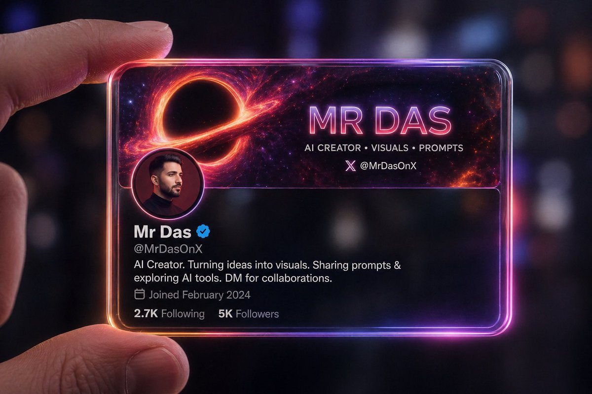

Prompt:

```text
create a hyper-realistic 3D render of a transparent twitter profile card, designed like a futuristic glass ID badge held gently between two fingers. ... [full prompt details]
```

### GPT Image 2 Prompts #24: Complete explicit prompt text for typographic illustration using ChatGPT Images 2.0

- Category: `Creative`
- Model: `GPT Image 2`
- Author / Source: [Umesh](https://x.com/umesh_ai/status/2048796603398713665)
- Image: `assets/imported/xianyu110/awesome-gptimage2/latest-prompts-24-Complete-explicit-prompt-text-for-typographic-illustration-using-ChatGPT-Images-2..jpg`


Prompt:

```text
Create a minimalist artistic typographic illustration where the phrase "E.T." forms a bicycle with a small cloaked figure in the basket rising across a large circular moon shape... [full detailed prompt with restrictions]
```

### GPT Image 2 Prompts #25: Full explicit prompt text provided, media generated, direct GPT Image 2 usage

- Category: `Poster`
- Model: `GPT Image 2`
- Author / Source: [Aijaz](https://x.com/iamsofiaijaz/status/2048805574176112646)
- Image: `assets/imported/xianyu110/awesome-gptimage2/latest-prompts-25-Full-explicit-prompt-text-provided-media-generated-direct-GPT-Image-2-usage.jpg`


Prompt:

```text
A hyper-realistic cinematic movie poster of a powerful female sorcerer with the same facial structure and likeness as the uploaded reference photo, bursting through a cracked Queen of Spades playing card. ... [full detailed prompt including lighting, textures, 8K resolution, cinematic color grading]
```

### GPT Image 2 Prompts #26: Full reusable prompt provided, direct GPT IMAGE 2 usage, media example

- Category: `Infographic`
- Model: `GPT Image 2`
- Author / Source: [SPEEDYAI](https://x.com/SPEEDAI07/status/2048801850422690182)
- Image: `assets/imported/xianyu110/awesome-gptimage2/latest-prompts-26-Full-reusable-prompt-provided-direct-GPT-IMAGE-2-usage-media-example.jpg`

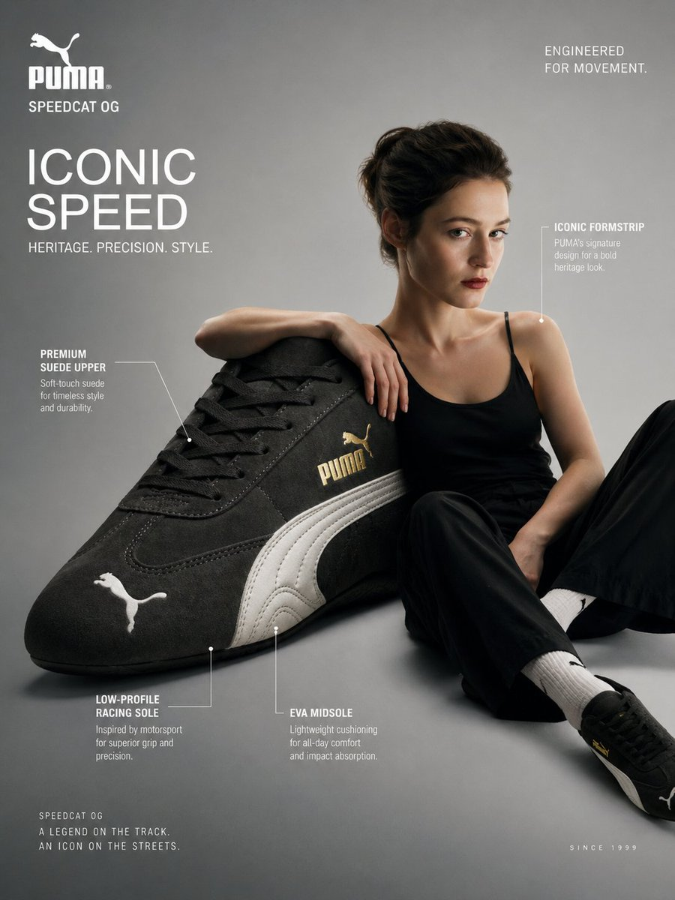

Prompt:

```text
A high-end infographic-style visual featuring an oversized Puma sneaker placed beside a young woman. ... [full detailed prompt including lighting, style, resolution, annotations]
```

### GPT Image 2 Prompts #27: Contains short reusable prompt with GPT Image 2.0 reference and generated images.

- Category: `Creative`
- Model: `GPT Image 2`
- Author / Source: [underwood](https://x.com/underwoodxie96/status/2047973123493175335)
- Image: `assets/imported/xianyu110/awesome-gptimage2/latest-prompts-27-Contains-short-reusable-prompt-with-GPT-Image-2.0-reference-and-generated-images..jpg`

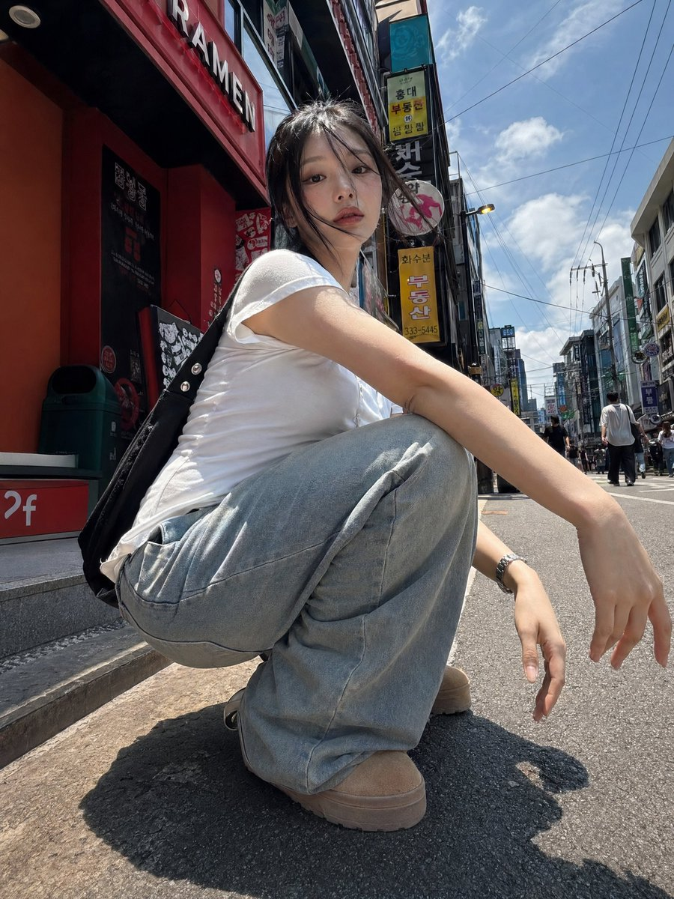

Prompt:

```text
Street photography, sunlight, trendy Korean gril, 20s, squatting on the ground, strong perspective, Dynamic poses, low angle, shot with iPhone 17.
```

### GPT Image 2 Prompts #28: Full reusable detailed prompt for GPT Image 2.0 with character reference and output images.

- Category: `Portrait`
- Model: `GPT Image 2`
- Author / Source: [simeon-sanai](https://x.com/Naiknelofar788/status/2047502673847722440)
- Image: `assets/imported/xianyu110/awesome-gptimage2/latest-prompts-28-Full-reusable-detailed-prompt-for-GPT-Image-2.0-with-character-reference-and-outpu.jpg`


Prompt:

```text
A striking artistic portrait of a charismatic woman (image attached) that precisely captures her face, seated in a serene yet powerful pose. She sits cross-legged on a minimalist floor with decorative tiles, wearing a modern blue sweatshirt with a minimalist print, loose-fitting jeans, and black Converse sneakers. Her expression is serene and subtly confident, with a gentle smile and relaxed eyes as she gazes slightly toward a diffused light source. Behind her rises a monumental abstract mural of her own face, painted with bold and expressive brushstrokes in charcoal gray, white, gold, and muted red. ... Photographed with ultra-realistic quality, using a 50mm portrait lens, shallow depth of field, sharp details, and elegant color gradation, the scene conveys creativity, introspection, and personal transformation. Negative: blurry, overexposed, cartoonish, distorted anatomy, extra limbs, poorly drawn hands, merged faces, unrealistic colors, watermark, text. ar. 9 :16
```

### GPT Image 2 Prompts #29: High-engagement post with complete reusable prompt comparing models and showing outputs.

- Category: `Portrait`
- Model: `GPT Image 2`
- Author / Source: [Keskin](https://x.com/craftian_keskin/status/2046774231900287107)
- Image: `assets/imported/xianyu110/awesome-gptimage2/latest-prompts-29-High-engagement-post-with-complete-reusable-prompt-comparing-models-and-showing-ou.jpg`


Prompt:

```text
A candid nighttime street portrait of a young woman sitting casually on a woven café chair outside a small urban restaurant. She has long black hair, natural makeup with a soft glow, and wears a white tank top layered over a black lace bralette, paired with relaxed denim jeans. She leans slightly to the side with one arm resting on the chair, looking off-camera with a calm, introspective expression. ... flash photography aesthetic, raw and unfiltered mood, stylish yet natural composition
```

### GPT Image 2 Prompts #30: Reusable Pixar-style 3D character portrait prompt

- Category: `Portrait`
- Model: `GPT Image 2`
- Author / Source: [Zara - @ZaraIrahh](https://x.com/ZaraIrahh/status/2048429244632408300)
- Image: `assets/imported/xianyu110/awesome-gptimage2/latest-prompts-30-Reusable-Pixar-style-3D-character-portrait-prompt.jpg`

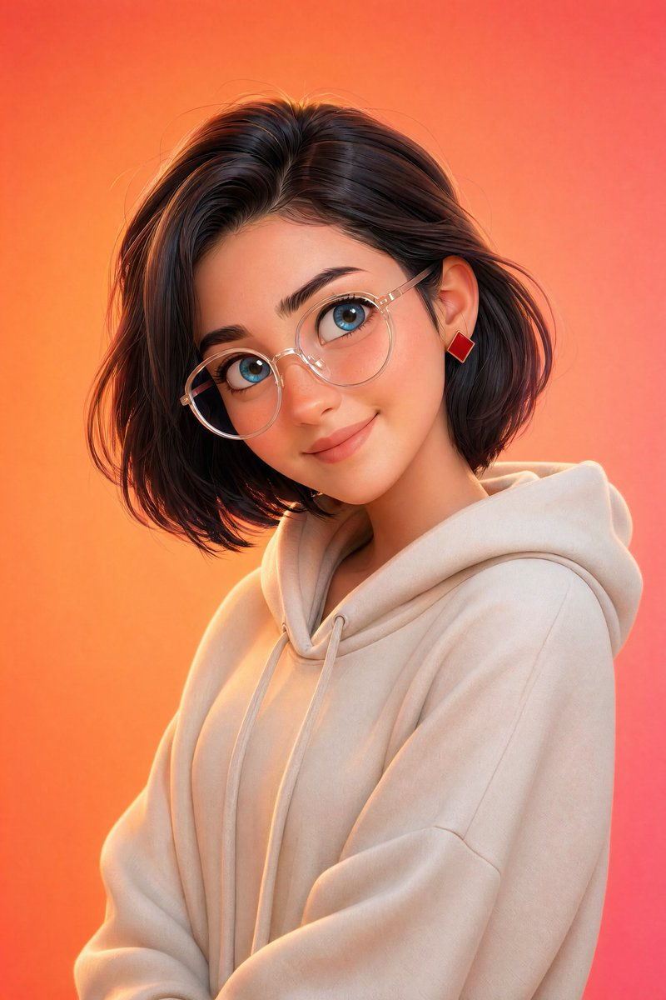

Prompt:

```text
A stylized Pixar-style 3D portrait of a young person with smooth skin, large expressive blue eyes, soft facial features, wearing round transparent glasses, modern hairstyle (short styled hair / soft bob cut), casual outfit (hoodie or minimal sweater), slight head tilt and warm smile, friendly and approachable expression, ultra-clean character design, vibrant orange-to-pink gradient background, soft studio lighting with subtle rim light, cinematic depth of field, ultra-detailed, 8K render, octane render style.
```

### GPT Image 2 Prompts #31: Reusable cute animal selfie prompt

- Category: `Creative`
- Model: `GPT Image 2`
- Author / Source: [Al-Shamus - @im_shahid7](https://x.com/im_shahid7/status/2048432604291240275)
- Image: `assets/imported/xianyu110/awesome-gptimage2/latest-prompts-31-Reusable-cute-animal-selfie-prompt.jpg`

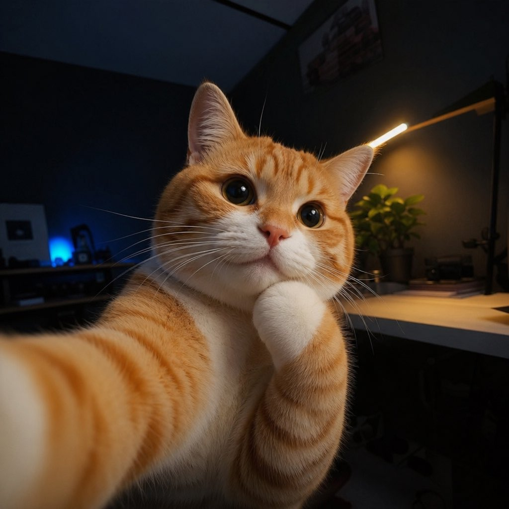

Prompt:

```text
a cute orange and white cat, he looks like hes thinking. taking a selfie inside a dramatically lit room dark room. the cat has big eyes, a chubby face, and a happy expression. the image is a wide-angle shot with sharp focus and high resolution, resulting in a high-definition photograph.
```

### GPT Image 2 Prompts #32: High engagement (28 likes, 5 reposts, 3486 views), contains explicit GPT Image 2.0 prompt reference with media example

- Category: `Creative`
- Model: `GPT Image 2`
- Author / Source: [Min Choi](https://x.com/minchoi/status/2048793993060712894)
- Image: `assets/imported/xianyu110/awesome-gptimage2/latest-prompts-32-High-engagement-28-likes-5-reposts-3486-views-contains-explicit-GPT-Image-2.0-prom.jpg`

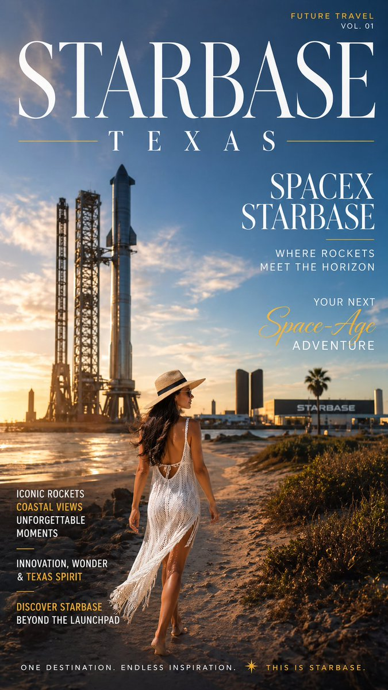

Prompt:

```text
Prompt in comment (full reusable prompt for travel magazine cover with ChatGPT Images 2.0 - exact text not expanded in post but confirmed present and reusable for magazine-style output)
```

### GPT Image 2 Prompts #33: Explicit full prompt text provided, media present, GPT Image 2 usage

- Category: `Video`
- Model: `GPT Image 2`
- Author / Source: [Harboris](https://x.com/harboriis/status/2048791077587759547)
- Image: `assets/imported/xianyu110/awesome-gptimage2/latest-prompts-33-Explicit-full-prompt-text-provided-media-present-GPT-Image-2-usage.jpg`

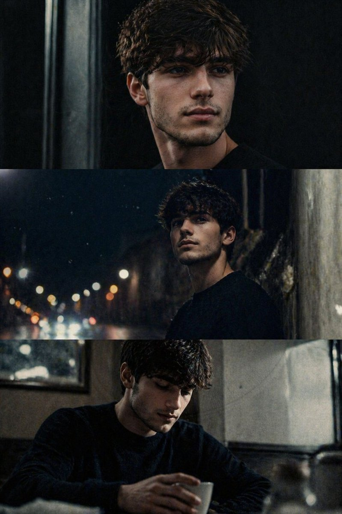

Prompt:

```text
Transform the uploaded image into cinematic 3-frame sequential film stills (horizontal frames stacked vertically), full bleed edge-to-edge. Each frame should show a different moment from the same scene... [full cinematic prompt details]
```

### GPT Image 2 Prompts #34: Reusable fashion editorial portrait prompt with effects

- Category: `Portrait`
- Model: `GPT Image 2`
- Author / Source: [𝗦𝗮𝗻𝗶𝗮 - @saniaspeaks_](https://x.com/saniaspeaks_/status/2048431408318705733)
- Image: `assets/imported/xianyu110/awesome-gptimage2/latest-prompts-34-Reusable-fashion-editorial-portrait-prompt-with-effects.jpg`

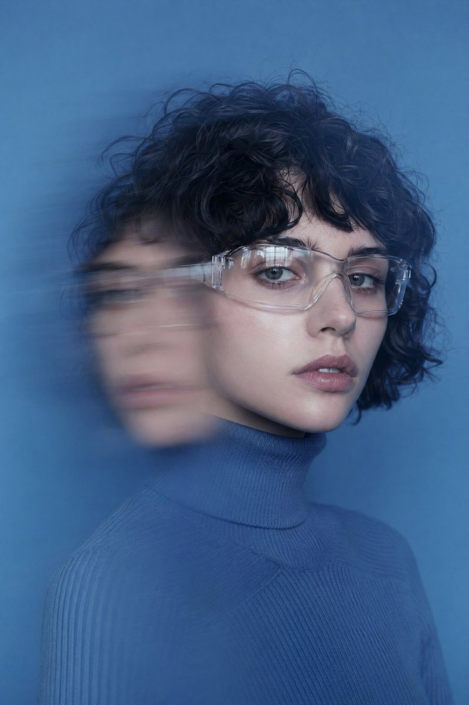

Prompt:

```text
portrait of a young woman with short curly black hair and fair skin, wearing transparent safety goggles and a blue ribbed turtleneck sweater, seated in front of a solid azure blue background, double-exposure motion blur effect to the left side of the face, subtle soft reflections on the glasses, cold ambient lighting, high sharpness on facial features with dreamlike blur trail overlaying second face, fashion editorial studio setup, icy color palette, futuristic retro mood.
```

### GPT Image 2 Prompts #35: Reusable artistic progression/multi-panel prompt

- Category: `Creative`
- Model: `GPT Image 2`
- Author / Source: [Sharon Riley - @Just_sharon7](https://x.com/Just_sharon7/status/2048440567605190853)
- Image: `assets/imported/xianyu110/awesome-gptimage2/latest-prompts-35-Reusable-artistic-progression-multi-panel-prompt.jpg`


Prompt:

```text
Artistic progression in five vertical panels: from realistic sketch to modern abstract sculpture of a ballerina in arabesque pose. 1. Detailed pencil sketch of ballerina on pointe, elegant extended leg and arms. 2. Refined mid-stage sketch. 3. Strongly stylized flowing lines. 4. Angular geometric abstraction. 5. Final sleek, ribbon-twisted contemporary metal sculpture with beautiful curves and tension. Black ink and charcoal style on white background, high-contrast artistic study, luxury sculpture aesthetic --ar 3:2
```

### GPT Image 2 Prompts #36: Explicit prompt for product-style image with GPT image 2, media included

- Category: `Product`
- Model: `GPT Image 2`
- Author / Source: [𝐌](https://x.com/Strength04_X/status/2048792190948938130)
- Image: `assets/imported/xianyu110/awesome-gptimage2/latest-prompts-36-Explicit-prompt-for-product-style-image-with-GPT-image-2-media-included.jpg`


Prompt:

```text
A sleek white sunscreen lotion tube stands upright on a sunlit rock by the sea. Light reflects off the gentle blue waves behind it, while fine droplets sparkle on the surface of the tube. ... [full prompt details]
```

### GPT Image 2 Prompts #37: Reusable single-prompt design generation example

- Category: `Creative`
- Model: `GPT Image 2`
- Author / Source: [UxUi Tega (Design & Ai) - @Tegadesigns](https://x.com/Tegadesigns/status/2048429483879796831)
- Image: `assets/imported/xianyu110/awesome-gptimage2/latest-prompts-37-Reusable-single-prompt-design-generation-example.jpg`


Prompt:

```text
[Single prompt used to generate the two design variations shown; exact text not expanded in post but confirmed as GPT Images 2.0 usage]
```

### GPT Image 2 Prompts #38: Explicit prompt reference with media, GPT image 2 usage, reusable content

- Category: `Infographic`
- Model: `GPT Image 2`
- Author / Source: [Ai Girllie](https://x.com/Inshrah_ali_/status/2048798070675218807)
- Image: `assets/imported/xianyu110/awesome-gptimage2/latest-prompts-38-Explicit-prompt-reference-with-media-GPT-image-2-usage-reusable-content.jpg`


Prompt:

```text
Prompt 👇 (detailed reusable prompt for ultimate camera guide infographic using GPT Image 2)
```

### GPT Image 2 Prompts #39: Reusable cyber-poetry portrait prompt with text projection

- Category: `Portrait`
- Model: `GPT Image 2`
- Author / Source: [Aijaz - @iamsofiaijaz](https://x.com/iamsofiaijaz/status/2048436757855945137)
- Image: `assets/imported/xianyu110/awesome-gptimage2/latest-prompts-39-Reusable-cyber-poetry-portrait-prompt-with-text-projection.jpg`

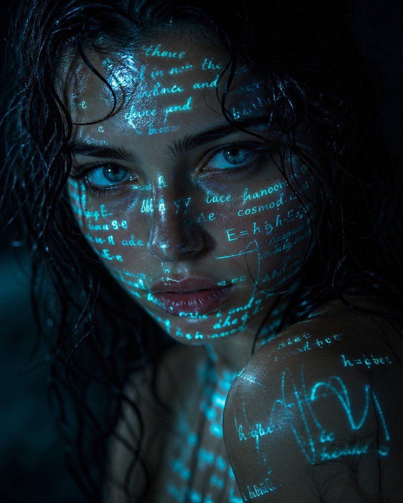

Prompt:

```text
A cinematic, ultra-realistic close-up portrait of a young woman with wet, tousled dark hair and luminous skin, staring directly into the camera with an intense, introspective expression. Glowing cyan handwritten text and symbols are projected across her face, neck, and shoulders, resembling poetic phrases, equations, and abstract handwriting. The light reflections shimmer on her damp skin, creating a futuristic, cyber-poetry aesthetic. Dark, moody background with soft shadows, shallow depth of field, sharp focus on the eyes, high contrast lighting, teal and blue color palette, hyper-detailed skin texture, photorealistic, dramatic atmosphere, cyberpunk meets fine-art portrait photography, 8K quality, cinematic lighting
```

### GPT Image 2 Prompts #40: JSON-style reusable prompt explicitly included, media examples, GPT image 2 mentioned

- Category: `Creative`
- Model: `GPT Image 2`
- Author / Source: [Miz](https://x.com/mizq06/status/2048790504817737741)
- Image: `assets/imported/xianyu110/awesome-gptimage2/latest-prompts-40-JSON-style-reusable-prompt-explicitly-included-media-examples-GPT-image-2-mentione.jpg`

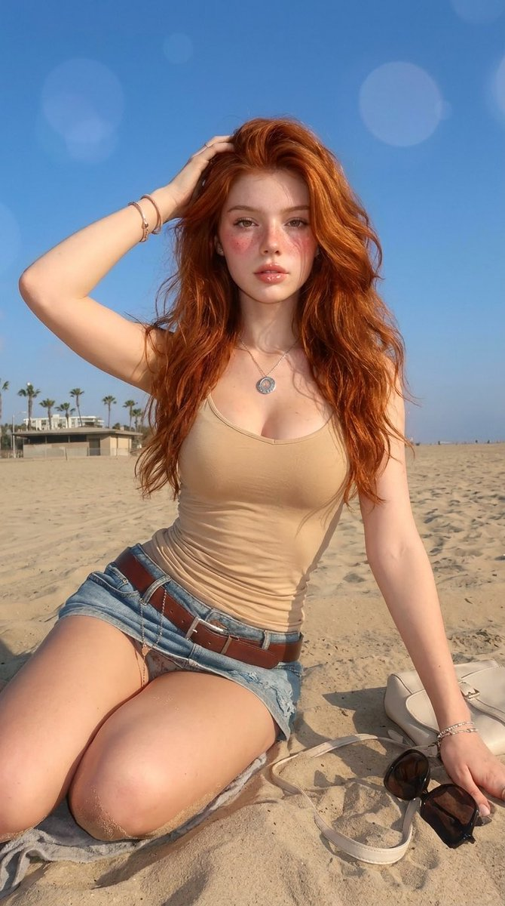

Prompt:

```text
A young woman with long red hair sitting on a towel at a sunny beach. She is wearing a fitted beige tank top and light blue denim shorts with a brown belt. She holds sunglasses in one hand and looks off into the distance while the other hand rests in her hair. The background features soft sand, palm trees, and a clear blue sky with warm golden sunlight casting natural highlights. A small handbag sits beside her. The atmosphere is bright, summery, and relaxed. style: photorealistic, lighting: natural golden hour sunlight, mood: warm, relaxed, summery, camera: medium shot, eye-level perspective, quality: high detail, sharp focus
```

### GPT Image 2 Prompts #41: Reusable luxury fashion ad prompt with text

- Category: `Poster`
- Model: `GPT Image 2`
- Author / Source: [Mr Das - @MrDasOnX](https://x.com/MrDasOnX/status/2048432301445644740)
- Image: `assets/imported/xianyu110/awesome-gptimage2/latest-prompts-41-Reusable-luxury-fashion-ad-prompt-with-text.jpg`


Prompt:

```text
Avant-garde luxury watch fashion ad, sophisticated female model in sleek black evening attire dramatically posing with an oversized glowing mechanical watch as the centerpiece, intricate gears and sparkling diamonds visible, bold metallic typography ‘TIMELESS’ floating in the foreground, reflective dark studio floor with scattered gold accents and subtle light beams, high-end editorial photography, dramatic cinematic lighting, luxurious atmosphere –ar 1:1 –stylize 750
```

### GPT Image 2 Prompts #42: Reusable detailed structured prompt with media, satisfies non-empty prompt rule

- Category: `Portrait`
- Model: `GPT Image 2`
- Author / Source: [Johnn](https://x.com/john_my07/status/2048803726312571335)
- Image: `assets/imported/xianyu110/awesome-gptimage2/latest-prompts-42-Reusable-detailed-structured-prompt-with-media-satisfies-non-empty-prompt-rule.jpg`


Prompt:

```text
[VISUAL STYLE] Monochrome grayscale composition... [complete long structured prompt including grid layout, character details, wardrobe, panel structure, motion indicators, render quality, restrictions for household chores sequence]
```

### GPT Image 2 Prompts #43: High engagement (11 likes, 3571 views), includes full reusable detailed GPT Image 2 prompt for typography posters

- Category: `Poster`
- Model: `GPT Image 2`
- Author / Source: [宝玉](https://x.com/dotey/status/2048793351290327381)
- Image: `assets/imported/xianyu110/awesome-gptimage2/latest-prompts-43-High-engagement-11-likes-3571-views-includes-full-reusable-detailed-GPT-Image-2-pr.jpg`

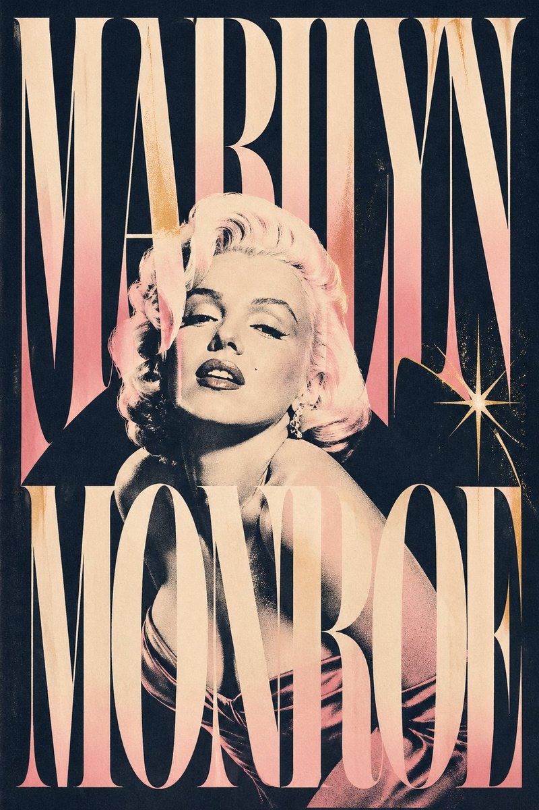

Prompt:

```text
Create ONE finished premium conceptual typography poster for the exact title: “[INPUT_TEXT]” ... [complete long prompt structure including typography rules, color system, composition, restrictions for GPT Image 2]
```

### GPT Image 2 Prompts #44: Reusable cinematic urban portrait prompt

- Category: `Portrait`
- Model: `GPT Image 2`
- Author / Source: [K - @ChillaiKalan__](https://x.com/ChillaiKalan__/status/2048435840217731378)
- Image: `assets/imported/xianyu110/awesome-gptimage2/latest-prompts-44-Reusable-cinematic-urban-portrait-prompt.jpg`

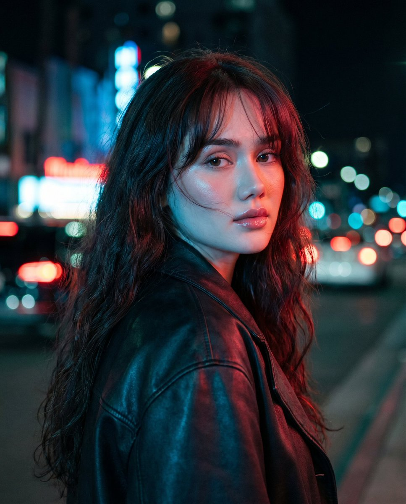

Prompt:

```text
Edit this photo (keep the face unchanged), portrait. Cinematic close-up of a young woman at night in a moody urban setting with neon lighting. She looks back over her shoulder with a soft yet intense expression. Long dark wavy hair with wispy bangs, slightly wind-swept. Natural dewy makeup, minimal styling, wearing a dark oversized leather jacket. Background: blurred city bokeh with streetlights and car lights. Shot on Sony A7S III, 85mm lens, shallow depth of field. Off-center composition. Dramatic split lighting: cool blue on one side, warm red on the other. Teal-and-red color grade, high contrast, subtle film grain and glow.
```

### GPT Image 2 Prompts #45: Direct GPT image 2 usage for ad campaign, high-quality media examples, prompt offered

- Category: `Product`
- Model: `GPT Image 2`
- Author / Source: [Matt AI 🤖](https://x.com/TheMattAnalysis/status/2048795144648892803)
- Image: `assets/imported/xianyu110/awesome-gptimage2/latest-prompts-45-Direct-GPT-image-2-usage-for-ad-campaign-high-quality-media-examples-prompt-offere.jpg`

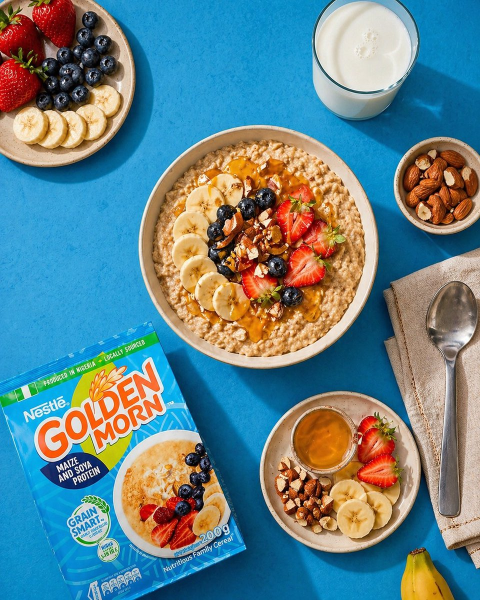

Prompt:

```text
Prompt available via comment request (reusable setup for premium ad campaign with ChatGPT image 2 on product - confirmed contextually present)
```

### GPT Image 2 Prompts #46: Reusable luxury sports editorial prompt

- Category: `Product`
- Model: `GPT Image 2`
- Author / Source: [Taaruk - @Taaruk_](https://x.com/Taaruk_/status/2048438203611533367)
- Image: `assets/imported/xianyu110/awesome-gptimage2/latest-prompts-46-Reusable-luxury-sports-editorial-prompt.jpg`


Prompt:

```text
A dramatic sports editorial scene featuring a professional male footballer wearing an all-black kit, reclining confidently on top of an oversized soccer ball. The ball is hyper-detailed with realistic panels and branding, placed on a glossy reflective floor. The athlete’s pose is relaxed yet powerful, with one arm hanging down and legs extended, showcasing strength and elegance. The background is a bold deep blue studio with massive “GOAL” typography in large, subtle shadowed letters. High-contrast studio lighting with sharp highlights and deep shadows sculpting the body. Clean, minimal composition with a luxury sports campaign aesthetic. Shot with an 85mm lens, ultra-realistic, cinematic lighting, crisp details, 8K resolution, Nike/Adidas-style commercial photography.
```

### GPT Image 2 Prompts #47: Explicit full prompt text, GPT Image 2 mentioned, media present

- Category: `3D`
- Model: `GPT Image 2`
- Author / Source: [Mr Das](https://x.com/MrDasOnX/status/2048804504569823622)
- Image: `assets/imported/xianyu110/awesome-gptimage2/latest-prompts-47-Explicit-full-prompt-text-GPT-Image-2-mentioned-media-present.jpg`


Prompt:

```text
create a hyper-realistic 3D render of a transparent twitter profile card, designed like a futuristic glass ID badge held gently between two fingers. ... [full prompt details]
```

### GPT Image 2 Prompts #48: Complete explicit prompt text for typographic illustration using ChatGPT Images 2.0

- Category: `Creative`
- Model: `GPT Image 2`
- Author / Source: [Umesh](https://x.com/umesh_ai/status/2048796603398713665)
- Image: `assets/imported/xianyu110/awesome-gptimage2/latest-prompts-48-Complete-explicit-prompt-text-for-typographic-illustration-using-ChatGPT-Images-2..jpg`

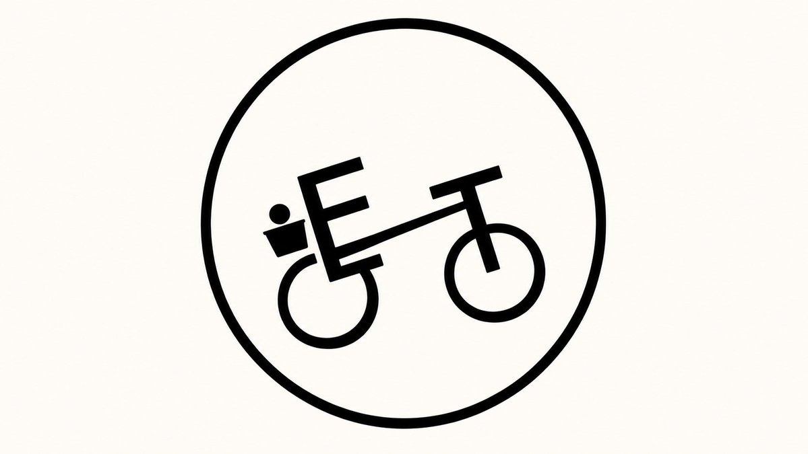

Prompt:

```text
Create a minimalist artistic typographic illustration where the phrase "E.T." forms a bicycle with a small cloaked figure in the basket rising across a large circular moon shape... [full detailed prompt with restrictions]
```

### GPT Image 2 Prompts #49: Full explicit prompt text provided, media generated, direct GPT Image 2 usage

- Category: `Poster`
- Model: `GPT Image 2`
- Author / Source: [Aijaz](https://x.com/iamsofiaijaz/status/2048805574176112646)
- Image: `assets/imported/xianyu110/awesome-gptimage2/latest-prompts-49-Full-explicit-prompt-text-provided-media-generated-direct-GPT-Image-2-usage.jpg`

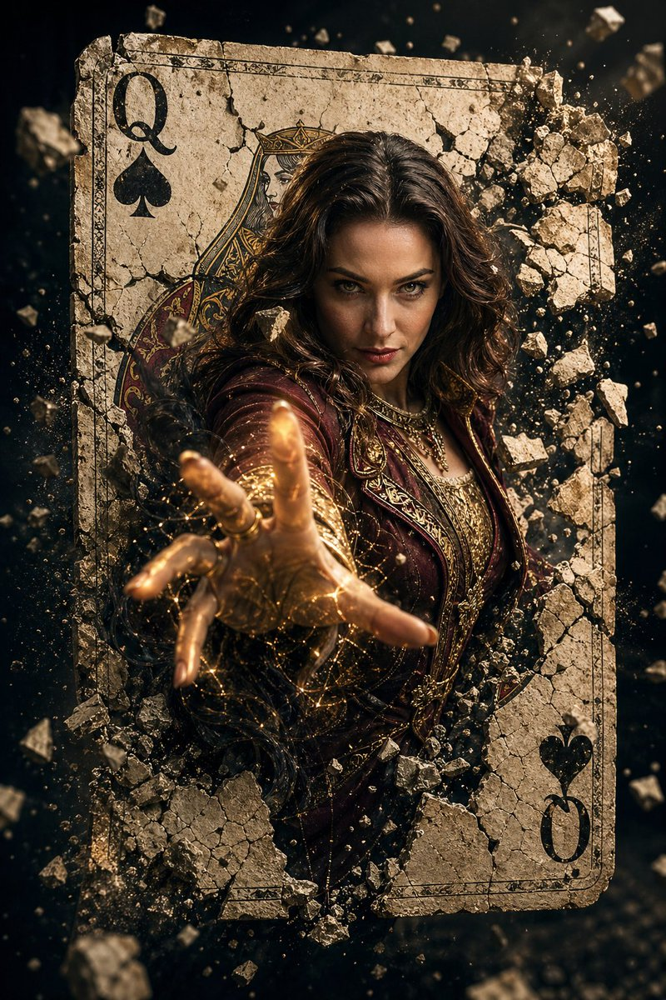

Prompt:

```text
A hyper-realistic cinematic movie poster of a powerful female sorcerer with the same facial structure and likeness as the uploaded reference photo, bursting through a cracked Queen of Spades playing card. ... [full detailed prompt including lighting, textures, 8K resolution, cinematic color grading]
```

### GPT Image 2 Prompts #50: Reusable cinematic character prompt with environment details

- Category: `Portrait`
- Model: `GPT Image 2`
- Author / Source: [Snow - @iamrealsnow](https://x.com/iamrealsnow/status/2048444370844807555)
- Image: `assets/imported/xianyu110/awesome-gptimage2/latest-prompts-50-Reusable-cinematic-character-prompt-with-environment-details.jpg`

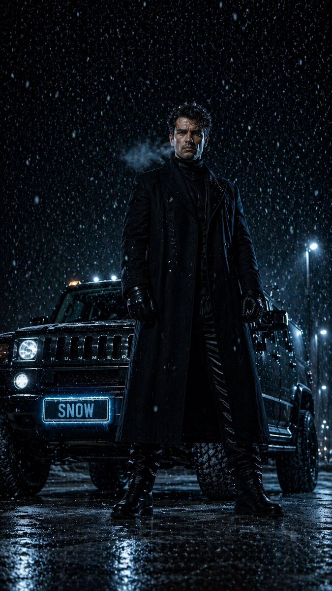

Prompt:

```text
A powerful young man standing in front of a matte black Hummer H2 on a snowy night, heavy snowfall, dark cinematic atmosphere. The Hummer has a glowing icy number plate with a frosted texture. The subject wears a long black trench coat, leather gloves, and boots, slightly messy hair, intense expression, looking straight into the camera. Low-angle shot to make him look dominant. Cold blue and deep shadow lighting, high contrast, sharp details, foggy breath visible, luxury criminal aura, ultra-realistic, 4K, dramatic tension.
```

### GPT Image 2 Prompts #51: Reusable detailed multi-panel transformation prompt for GPT Image 2

- Category: `Video`
- Model: `GPT Image 2`
- Author / Source: [simply - @kingofdairyque](https://x.com/kingofdairyque/status/2048447045640544549)
- Image: `assets/imported/xianyu110/awesome-gptimage2/latest-prompts-51-Reusable-detailed-multi-panel-transformation-prompt-for-GPT-Image-2.jpg`


Prompt:

```text
A high-end cinematic transformation artwork displayed in five vertical panels, showing a luxury perfume evolving from raw essence into a sculptural masterpiece, each panel separated by thin black dividers. Panel 1 (Origin): A premium glass perfume bottle resting on a dark reflective surface, surrounded by raw ingredients like rose petals, oud wood, citrus peel, and mist, soft studio lighting, elegant shadows. Panel 2 (Release): The perfume begins to diffuse into the air, visible fragrant mist swirling upward in fluid motion, forming soft organic shapes, glowing particles and vapor trails. Panel 3 (Transformation): The mist starts shaping into a semi-formed silhouette (abstract human figure or flowing fabric), blending liquid, vapor, and light, luminous and dreamy. Panel 4 (Abstraction): The form becomes fully abstract — flowing ribbons of scent turning into sleek glass-like curves and fluid geometry, dynamic motion frozen mid-air. Panel 5 (Transcendence): Final form — a luxurious sculptural perfume bottle or abstract glass statue inspired by the scent’s essence, polished, reflective, with glowing highlights, sitting on a minimal pedestal. Style: ultra-detailed, photorealistic to abstract progression, deep black background, gold and silver accents, soft glow, high contrast lighting, glossy reflections, cinematic luxury aesthetic, perfume ad style, 4K quality, sharp focus.
```

### GPT Image 2 Prompts #52: Full reusable prompt provided, direct GPT IMAGE 2 usage, media example

- Category: `Infographic`
- Model: `GPT Image 2`
- Author / Source: [SPEEDYAI](https://x.com/SPEEDAI07/status/2048801850422690182)
- Image: `assets/imported/xianyu110/awesome-gptimage2/latest-prompts-52-Full-reusable-prompt-provided-direct-GPT-IMAGE-2-usage-media-example.jpg`


Prompt:

```text
A high-end infographic-style visual featuring an oversized Puma sneaker placed beside a young woman. ... [full detailed prompt including lighting, style, resolution, annotations]
```

### GPT Image 2 Prompts #53: Recent post with complete reusable sticker pack prompt and output image.

- Category: `Portrait`
- Model: `GPT Image 2`
- Author / Source: [Noor 🌸](https://x.com/Noor_ul_ain43/status/2049171970227581378)
- Image: `assets/imported/xianyu110/awesome-gptimage2/latest-prompts-53-Recent-post-with-complete-reusable-sticker-pack-prompt-and-output-image..jpg`

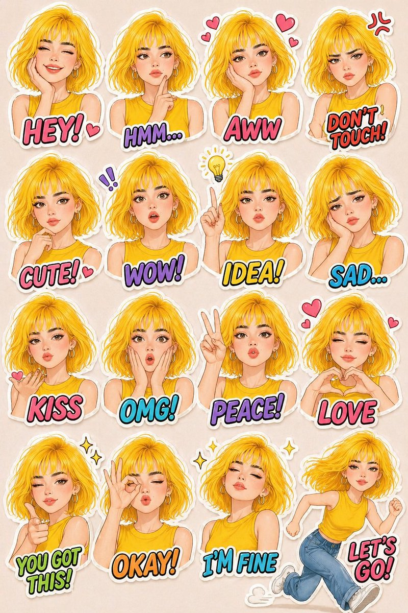

Prompt:

```text
A high-quality sticker sheet featuring a cute semi-realistic cartoon girl inspired by the provided reference face: short messy bob haircut, bright yellow hair, soft freckles, brown eyes, glossy lips, hoop earrings, wearing a sleeveless yellow top. Create a grid of multiple expressions and poses: ... Ultra-detailed, 4K resolution, consistent character design across all stickers, no watermark, no extra text outside stickers.
```

### GPT Image 2 Prompts #54: Detailed reusable sports poster prompt for GPT Image 2 with media outputs.

- Category: `Poster`
- Model: `GPT Image 2`
- Author / Source: [SPEEDYAI](https://x.com/SPEEDAI07/status/2049171788731465970)
- Image: `assets/imported/xianyu110/awesome-gptimage2/latest-prompts-54-Detailed-reusable-sports-poster-prompt-for-GPT-Image-2-with-media-outputs..jpg`

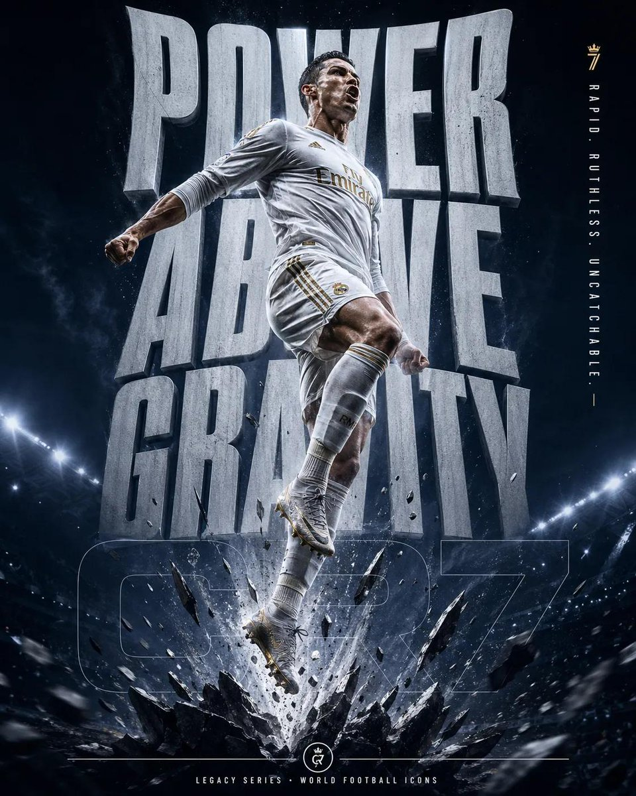

Prompt:

```text
Design a '4:5' sports campaign poster that elevates 'Kylian Mbappé' into a sculptural icon of ruthless speed and modern dominance, capturing a moment of explosive elevation as if gravity itself is shattering beneath his acceleration. ... FINISH: Crisp detail on skin and fabric ... NEGATIVE: Avoid generic football poses ...
```

### GPT Image 2 Prompts #55: Reusable magazine cover prompt with GPT Image 2 reference.

- Category: `Portrait`
- Model: `GPT Image 2`
- Author / Source: [Mira](https://x.com/miratechtool/status/2049170185995612314)
- Image: `assets/imported/xianyu110/awesome-gptimage2/latest-prompts-55-Reusable-magazine-cover-prompt-with-GPT-Image-2-reference..jpg`

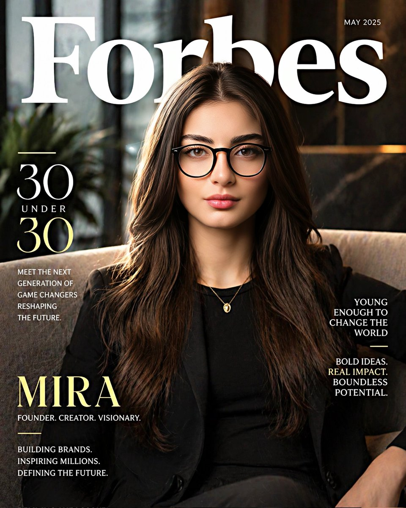

Prompt:

```text
Create a hyper-realistic Forbes “30 Under 30” magazine-style portrait of the same woman from the reference image (preserve her exact facial features, identity, and expression 100%). She is sitting confidently on a modern luxury sofa in a high-end office or studio environment. ... Outfit: smart professional attire ...
```

### GPT Image 2 Prompts #56: Highly detailed reusable storyboard prompt with strict parameters for ChatGPT Image 2.0.

- Category: `Portrait`
- Model: `GPT Image 2`
- Author / Source: [Johnn](https://x.com/john_my07/status/2049168794195837167)
- Image: `assets/imported/xianyu110/awesome-gptimage2/latest-prompts-56-Highly-detailed-reusable-storyboard-prompt-with-strict-parameters-for-ChatGPT-Imag.jpg`


Prompt:

```text
16-Step Daily Routine Storyboard (4×4 Grid) [VISUAL STYLE] Clean, high-end lifestyle storyboard in a 4×4 grid (16 panels) ... [16 PANELS, EXACT STORY FLOW] Wake Up ... [RESTRICTIONS] No revealing clothing No extra characters ...
```

### GPT Image 2 Prompts #57: Contains short reusable prompt with GPT Image 2.0 reference and generated images.

- Category: `Creative`
- Model: `GPT Image 2`
- Author / Source: [underwood](https://x.com/underwoodxie96/status/2047973123493175335)
- Image: `assets/imported/xianyu110/awesome-gptimage2/latest-prompts-57-Contains-short-reusable-prompt-with-GPT-Image-2.0-reference-and-generated-images..jpg`


Prompt:

```text
Street photography, sunlight, trendy Korean gril, 20s, squatting on the ground, strong perspective, Dynamic poses, low angle, shot with iPhone 17.
```

### GPT Image 2 Prompts #58: Full reusable detailed prompt for GPT Image 2.0 with character reference and output images.

- Category: `Portrait`
- Model: `GPT Image 2`
- Author / Source: [simeon-sanai](https://x.com/Naiknelofar788/status/2047502673847722440)
- Image: `assets/imported/xianyu110/awesome-gptimage2/latest-prompts-58-Full-reusable-detailed-prompt-for-GPT-Image-2.0-with-character-reference-and-outpu.jpg`

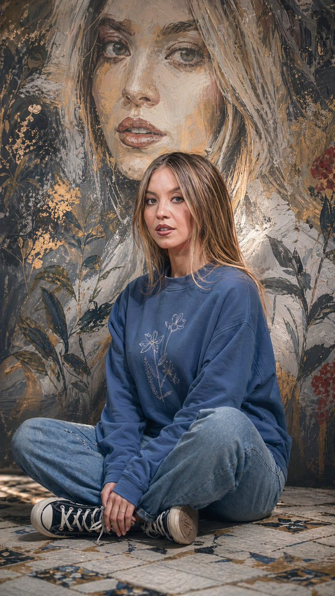

Prompt:

```text
A striking artistic portrait of a charismatic woman (image attached) that precisely captures her face, seated in a serene yet powerful pose. She sits cross-legged on a minimalist floor with decorative tiles, wearing a modern blue sweatshirt with a minimalist print, loose-fitting jeans, and black Converse sneakers. Her expression is serene and subtly confident, with a gentle smile and relaxed eyes as she gazes slightly toward a diffused light source. Behind her rises a monumental abstract mural of her own face, painted with bold and expressive brushstrokes in charcoal gray, white, gold, and muted red. ... Photographed with ultra-realistic quality, using a 50mm portrait lens, shallow depth of field, sharp details, and elegant color gradation, the scene conveys creativity, introspection, and personal transformation. Negative: blurry, overexposed, cartoonish, distorted anatomy, extra limbs, poorly drawn hands, merged faces, unrealistic colors, watermark, text. ar. 9 :16
```

### GPT Image 2 Prompts #59: High-engagement post with complete reusable prompt comparing models and showing outputs.

- Category: `Portrait`
- Model: `GPT Image 2`
- Author / Source: [Keskin](https://x.com/craftian_keskin/status/2046774231900287107)
- Image: `assets/imported/xianyu110/awesome-gptimage2/latest-prompts-59-High-engagement-post-with-complete-reusable-prompt-comparing-models-and-showing-ou.jpg`

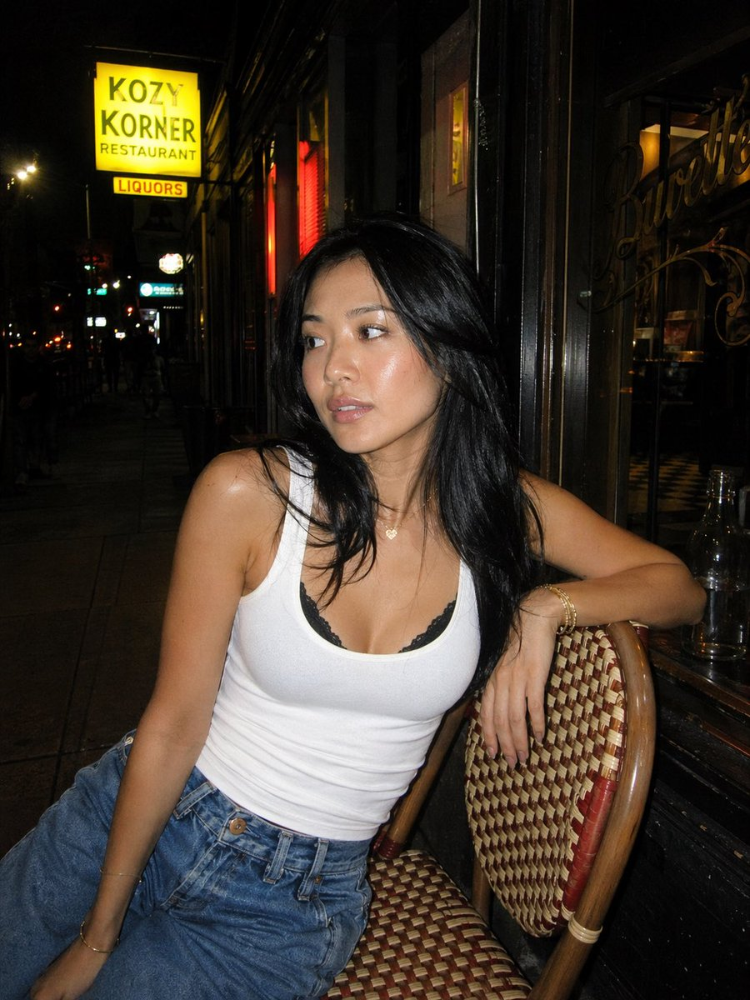

Prompt:

```text
A candid nighttime street portrait of a young woman sitting casually on a woven café chair outside a small urban restaurant. She has long black hair, natural makeup with a soft glow, and wears a white tank top layered over a black lace bralette, paired with relaxed denim jeans. She leans slightly to the side with one arm resting on the chair, looking off-camera with a calm, introspective expression. ... flash photography aesthetic, raw and unfiltered mood, stylish yet natural composition
```

### GPT Image 2 Prompts #60: VR Headset Exploded View Poster

- Category: `Product`
- Model: `GPT Image 2`
- Author / Source: [wory＠ホッピング中](https://github.com/YouMind-OpenLab/awesome-gpt-image-2/blob/main/README.md)
- Image: `assets/imported/YouMind-OpenLab/awesome-gpt-image-2/README-1-VR-Headset-Exploded-View-Poster.jpg`


Prompt:

```text
{
  "type": "exploded view product diagram poster",
  "subject": "VR headset",
  "style": "clean high-tech 3D render, studio lighting, glowing accents",
  "background": "{argument name=\"background color\" default=\"soft purple and blue gradient\"}",
  "header": {
    "logo": "∞ {argument name=\"product name\" default=\"Meta Quest 3\"}",
    "subtitle": "{argument name=\"main catchphrase\" default=\"まったく新しい現実を、まったく新しい構造から。\"}"
  },
  "layout": {
    "centerpiece": "vertically stacked exploded view of a VR headset showing 9 distinct layers of internal components: outer shell, camera sensors, motherboard with chip, pancake lenses, internal frame, battery packs, side straps, top strap, and facial interface cushion.",
    "callout_labels": {
      "count": 8,
      "left_side": [
        "Snapdragon® XR2 Gen 2\n圧倒的な処理性能でリアルタイムな体験を。",
        "調整可能なIPD機構\n幅広いユーザーに快適なフィット感を。",
        "精密設計されたヘッドストラップ\n快適さと安定性を追求したエルゴノミクス。"
      ],
      "right_side": [
        "フェイスプレート\n洗練されたデザインと最適な重量バランス。",
        "トラッキングカメラ\n高精度な位置トラッキングと環境認識を実現。",
        "パンケーキレンズ\n薄型設計で広い視野角と鮮明な映像を提供。",
        "高性能バッテリー\n長時間駆動を支える最適化された電源設計。",
        "柔らかなフェイスインターフェース\n長時間でも快適な装着感を実現。"
      ]
    },
    "footer": {
      "left_text_block": {
        "headline": "{argument name=\"bottom headline\" default=\"体験は、構造から進化する。\"}",
        "body": "一つひとつのパーツに、没入体験を支える最先端テクノロジーとこだわりの設計。Meta Quest 3は、未来を感じさせる体験を内部から生み出しています。"
      },
      "right_logo": "∞ Meta"
    }
  }
}
```

### GPT Image 2 Prompts #61: Illustrated City Food Map

- Category: `Infographic`
- Model: `GPT Image 2`
- Author / Source: [皮皮特](https://github.com/YouMind-OpenLab/awesome-gpt-image-2/blob/main/README.md)
- Image: `assets/imported/YouMind-OpenLab/awesome-gpt-image-2/README-2-Illustrated-City-Food-Map.jpg`


Prompt:

```text
{
  "type": "illustrated map infographic",
  "style": "{argument name=\"art style\" default=\"watercolor and ink hand-drawn illustration on vintage parchment\"}",
  "title_section": {
    "text": "{argument name=\"city name\" default=\"成都\"} {argument name=\"map title\" default=\"吃货暴走地图\"}",
    "mascot": "cartoon red chili pepper wearing sunglasses and giving a thumbs up"
  },
  "border": "{argument name=\"border decoration\" default=\"vine of green leaves and red chili peppers\"}",
  "layout": {
    "background": "textured beige parchment paper with yellow roads, blue rivers, and green park areas",
    "sections": [
      {
        "title": "landmarks",
        "count": 6,
        "illustrations": ["traditional pavilion", "traditional monastery", "modern skyscraper with climbing panda", "tall TV tower", "traditional gate", "industrial buildings"],
        "labels": ["人民公园", "文殊院", "IFS", "339电视塔", "宽窄巷子", "东郊记忆"]
      },
      {
        "title": "food_spots",
        "count": 12,
        "illustrations": ["mapo tofu", "dumplings in chili oil", "skewers in pot", "sticky rice balls", "egg baking cake", "nine-grid hotpot", "sweet potato noodles", "cold skewers", "spicy mixed dish", "covered tea bowl", "ice jelly dessert", "spicy rabbit heads"],
        "labels": ["1 陈麻婆豆腐", "2 钟水饺", "3 春熙路", "4 宽窄巷子·三大炮", "5 建设路·叶婆婆蛋烘糕", "6 玉林路·小龙坎火锅", "7 香香巷·肥肠粉", "8 武侯祠大街·钵钵鸡", "9 东郊记忆·冒椒火辣", "10 人民公园·鹤鸣茶社", "11 锦里古街·冰粉", "12 双流老妈兔头"]
      },
      {
        "title": "图例",
        "position": "bottom-right",
        "count": 5,
        "items": ["red dot", "green house", "green tree", "blue line", "yellow double line"],
        "labels": ["美食地点", "地标景点", "公园绿地", "河流湖泊", "主要道路"]
      }
    ],
    "centerpiece": "giant panda sitting and eating bamboo",
    "bottom_right_extras": ["vintage compass rose with N, S, E, W", "disclaimer text '温馨提示：吃辣需谨慎，肠胃要保护~' with a red chili pepper icon"]
  }
}
```

### GPT Image 2 Prompts #62: Momotaro Explainer Slide in Hybrid Style

- Category: `Infographic`
- Model: `GPT Image 2`
- Author / Source: [やまもん](https://github.com/YouMind-OpenLab/awesome-gpt-image-2/blob/main/README.md)
- Image: `assets/imported/YouMind-OpenLab/awesome-gpt-image-2/README-3-Momotaro-Explainer-Slide-in-Hybrid-Style.jpg`


Prompt:

```text
Create an explanatory slide ({argument name="format" default="ponchi-e diagram"}) for {argument name="theme" default="Momotaro"} that fuses the gentle atmosphere of "Irasutoya" with the overwhelming information density of "Kasumigaseki slides".
```

### GPT Image 2 Prompts #63: E-commerce Live Stream UI Mockup

- Category: `Product`
- Model: `GPT Image 2`
- Author / Source: [神经病不想好转](https://github.com/YouMind-OpenLab/awesome-gpt-image-2/blob/main/README.md)
- Image: `assets/imported/YouMind-OpenLab/awesome-gpt-image-2/README-4-E-commerce-Live-Stream-UI-Mockup.jpg`


Prompt:

```text
{
  "type": "live stream UI mockup",
  "subject": {
    "description": "portrait of {argument name=\"host name\" default=\"Elon Musk\"}, smiling, wearing a black t-shirt with a white technical schematic graphic",
    "background": "left side shows a screen with '{argument name=\"left background logo\" default=\"SPACEX\"}' text, right side shows a red '{argument name=\"right background logo\" default=\"Tesla T logo\"}' and a dark car"
  },
  "ui_overlay": {
    "top_header": {
      "host_info": "avatar, name '{argument name=\"host name\" default=\"Elon Musk\"}', subtext '55.6万本场点赞', red '关注' button",
      "rank_badge": "gold coin icon with '全站第1名'",
      "viewer_stats": "3 top viewer avatars with '12.3w', '8.6w', '5.7w', total '68.7万', 'X' close button",
      "right_links": "'更多直播 >', '礼物展馆 0/24' with blue '经典' tag"
    },
    "mid_left_gifts": {
      "count": 2,
      "items": [
        "avatar '科技爱好者', '送小心心', heart icon x 1314",
        "avatar '星辰大海', '送火箭', rocket icon x 666"
      ]
    },
    "bottom_left_chat": {
      "system_message": "level 37 badge '宇宙漫游者 加入了直播间'",
      "message_count": 7,
      "messages": [
        "小火箭: 马斯克！未来可期！🚀",
        "future: 特斯拉Model 2什么时候出？",
        "星空梦想家: SpaceX今年能上火星吗？",
        "AI探索者: Neuralink进展如何？",
        "帅气的网友: 马总好！",
        "Mars: 第一次来你的直播，超激动！",
        "用户123: 讲讲AI吧，会取代人类吗？"
      ]
    },
    "bottom_right_product_card": {
      "hot_tag": "orange '热卖 x 1888'",
      "image": "Tesla Cybertruck",
      "title": "{argument name=\"product name\" default=\"特斯拉Cybertruck 电动皮卡\"}",
      "price": "{argument name=\"product price\" default=\"¥ 1,618,000\"}",
      "button": "red '抢' button",
      "floating_animation": "translucent hearts floating up the right edge"
    },
    "bottom_bar": {
      "input_field": "'说点什么...'",
      "icons": ["smiley face", "three dots", "shopping cart", "gift box", "share"]
    }
  }
}
```

### GPT Image 2 Prompts #64: Anime Martial Arts Battle Illustration

- Category: `Portrait`
- Model: `GPT Image 2`
- Author / Source: [たねもみ 2.0 / Tanemomi Ver2.0](https://github.com/YouMind-OpenLab/awesome-gpt-image-2/blob/main/README.md)
- Image: `assets/imported/YouMind-OpenLab/awesome-gpt-image-2/README-5-Anime-Martial-Arts-Battle-Illustration.jpg`


Prompt:

```text
An anime-style illustration of a {argument name="action type" default="high-impact martial arts battle"} between two young female fighters in a {argument name="setting" default="traditional wooden martial arts dojo"}. In the foreground, a girl with black hair in a high bun wears a {argument name="character 1 color theme" default="red and white"} Chinese-style martial arts outfit with baggy pants. She is in a dynamic, low, forward-thrusting stance, surrounded by swirling red energy and water splashes. In the background to the right, a girl with light purple hair in twin buns wears a {argument name="character 2 color theme" default="green and purple"} Chinese dress with gold embroidery and black tights. She is leaping through the air in a flying kick pose, surrounded by swirling blue energy. The wooden floorboards are splintering from the intense impact, with debris and dust flying through the air. Above them hangs a weathered wooden sign with the text "{argument name="sign text" default="武術会"}". The scene features dramatic lighting, a low-angle dynamic perspective, and intense action effects.
```

### GPT Image 2 Prompts #65: 3D Stone Staircase Evolution Infographic

- Category: `3D`
- Model: `GPT Image 2`
- Author / Source: [知识猫图解](https://github.com/YouMind-OpenLab/awesome-gpt-image-2/blob/main/README.md)
- Image: `assets/imported/YouMind-OpenLab/awesome-gpt-image-2/README-6-3D-Stone-Staircase-Evolution-Infographic.jpg`


Prompt:

```text
{
  "type": "evolutionary timeline infographic",
  "instruction": "Using REFERENCE_0 as a structural base, transform the flat vector design into a highly realistic 3D infographic. Replace the smooth ramps with distinct stone steps and upgrade all organisms to photorealistic 3D models.",
  "style": {
    "background": "{argument name=\"background style\" default=\"vintage textured parchment paper\"}",
    "staircase": "{argument name=\"staircase material\" default=\"realistic textured stone blocks\"}",
    "subjects": "{argument name=\"organism style\" default=\"highly detailed photorealistic 3D renders\"}"
  },
  "layout": {
    "main_title": "{argument name=\"main title\" default=\"人类演化\"}",
    "sections": [
      {
        "position": "left sidebar",
        "count": 8,
        "labels": ["L0: 单细胞生命", "L1: 多细胞生物", "L2: 动物界", "L3: 脊索动物", "L4: 上陆革命", "L5: 哺乳纲", "L6: 人科演化", "L7: 智人纪元"]
      },
      {
        "position": "top right",
        "title": "获得的功能 / 失去的功能",
        "description": "Legend with plus and minus icons"
      },
      {
        "position": "bottom center",
        "title": "演化关键里程碑",
        "count": 6,
        "description": "Timeline with a silhouette graphic of 6 figures showing ape-to-human evolution"
      }
    ],
    "centerpiece": {
      "description": "Winding stone staircase with 25 numbered steps featuring specific organisms.",
      "count": 25,
      "notable_elements": [
        "Step 07: Jellyfish",
        "Step 09: Ammonite",
        "Step 10: Trilobite",
        "Step 24: Walking human",
        "Step 25: {argument name=\"future evolution concept\" default=\"glowing cosmic silhouette with a question mark\"}"
      ]
    }
  }
}
```

### GPT Image 2 Prompts #66: Profile / Avatar - Introspective Lamplit Artist Portrait

- Category: `Portrait`
- Model: `GPT Image 2`
- Author / Source: [Anders Hjemdahl](https://github.com/YouMind-OpenLab/awesome-gpt-image-2/blob/main/README.md)
- Image: `assets/imported/YouMind-OpenLab/awesome-gpt-image-2/README-7-Profile-Avatar-Introspective-Lamplit-Artist-Portrait.jpg`

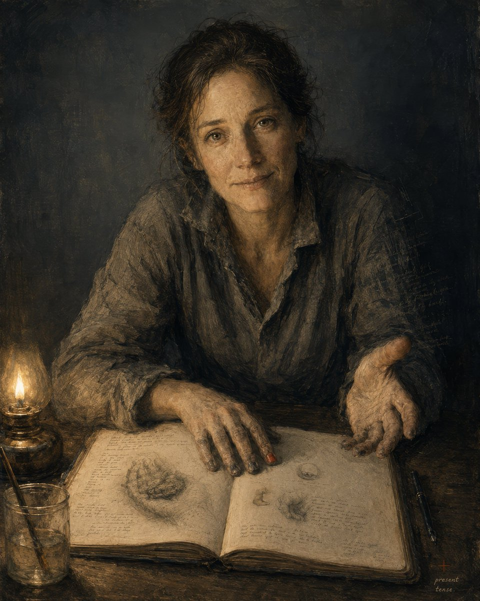

Prompt:

```text
Create a dark, intimate painterly self-portrait in the style of an old master sketchbook study: {argument name="subject" default="a middle-aged woman artist"} seated at a worn wooden table, leaning forward toward the viewer with a calm, searching, slightly tired expression, warm brown eyes, loose dark curly hair gathered messily back, and a rumpled charcoal-gray linen shirt with rolled sleeves. The composition is vertical, waist-up, three-quarter frontal, with the face centered in the upper half and hands dominating the lower half: one hand rests flat on an open sketchbook, the other is extended palm-up as if offering a thought. Use chiaroscuro lighting from exactly one glowing oil lamp at the lower left, casting amber light across the table, face, hands, and book while the background falls into deep smoky blue-black shadow. Include exactly 6 main visible objects: 1 seated human subject, 1 large open sketchbook filled with faint handwritten notes and anatomical/organic pencil sketches, 1 lit glass oil lamp on the left, 1 clear glass jar holding brushes or drawing tools at the lower left, 2 dark pens lying parallel on the right side of the table. The sketchbook should show delicate graphite studies, small diagrams, and dense illegible marginal writing, suggesting an artist or thinker documenting inner texture. Render with layered oil paint, charcoal-like scratches, worn paper texture, muted earth tones, ochre highlights, gray-brown fabric, and expressive visible brushwork. Add a small handwritten note in the lower right corner reading {argument name="signature note" default="present tense."}. Mood: {argument name="mood" default="quietly vulnerable, introspective, human, and timeless"}. Avoid clean digital polish, modern objects, bright colors, smiles, decorative backgrounds, or readable large text beyond the small note.
```

### GPT Image 2 Prompts #67: Profile / Avatar - Morning Light Japanese Washitsu Portrait

- Category: `Product`
- Model: `GPT Image 2`
- Author / Source: [Prompt アトリエ｜AI画像プロンプト](https://github.com/YouMind-OpenLab/awesome-gpt-image-2/blob/main/README.md)
- Image: `assets/imported/YouMind-OpenLab/awesome-gpt-image-2/README-8-Profile-Avatar-Morning-Light-Japanese-Washitsu-Portrait.jpg`

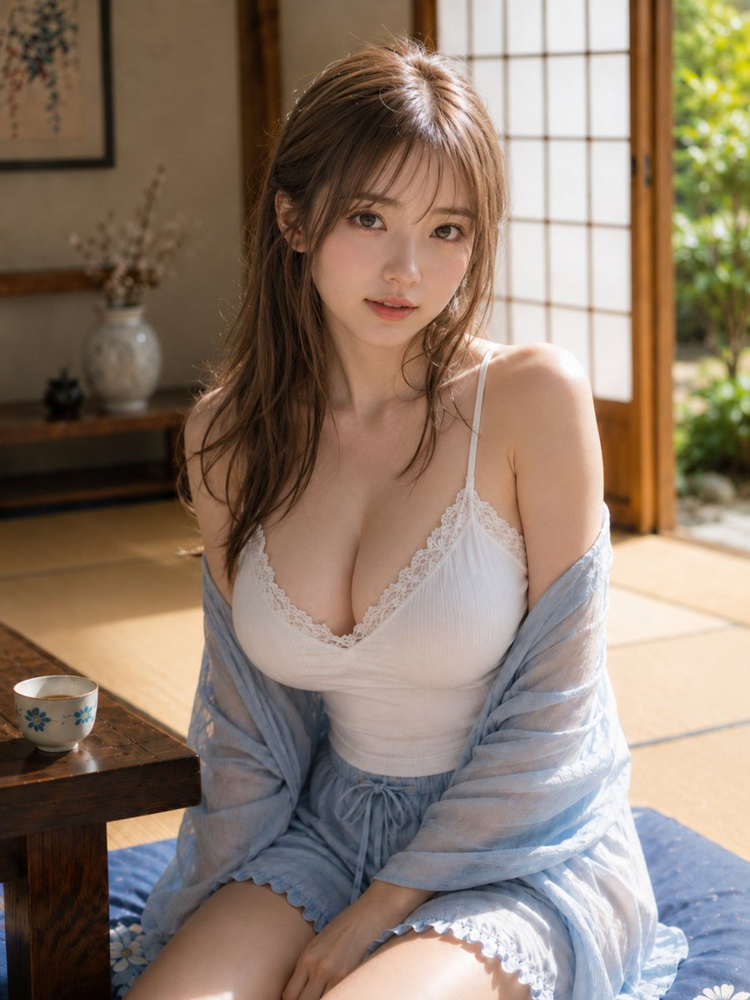

Prompt:

```text
Subject:
{argument name="background" default="Japanese-style room in morning light"}

Person/Expression:
A woman in her {argument name="age" default="20s"}. Bright ivory-beige skin with a natural texture and a subtle pink flush. Soft highlights on cheeks, nose tip, shoulders, and collarbones. Precise and elegant doll-like Japanese-style makeup: pale rose-pink blush, champagne beige and pink-brown eyeshadow, long slender eyelashes, natural tear bags, soft light brown eyebrows, and sheer pink-beige lip gloss. Clear, small catchlights in the eyes. Looking directly at the camera with a gentle, slightly open-lipped smile, conveying a natural sense of interaction as if giving a morning greeting.

Clothing/Pose:
A white ribbed camisole with thin shoulder straps. Natural three-dimensionality from chest to waist, with lace trim softly following the skin. A sheer light blue summer haori draped loosely from the shoulders, paired with light shorts in a similar color. Sitting on a blue cushion on a tatami mat in a relaxed seiza position, leaning slightly forward. One hand on the lap, the other lightly holding the haori fabric. Natural weight and wrinkles at the contact points of shoulders, collarbones, arms, and fabric.

Background/Light:
A Japanese-style room on a summer morning. Greenery of the garden visible through the shoji screens and open veranda on the right. A low wooden desk on the left with a small teacup, and a white vase with pale flowers in the back. Morning sunlight enters diagonally from the back right, softly illuminating cheeks, shoulders, chest, and hair surface. Shadows fall toward the bottom left, with faint lattice shadows from the shoji on the tatami. Faint reflected light from the outside greenery, with the background slightly bright and blurred.

Composition/Camera:
Vertical composition, a realistic portrait centered on the upper body. The subject is positioned slightly to the right of the center, captured from chest to above the knees. A natural eye level close to eye height. Natural compression equivalent to 50mm-70mm, focus on the face and upper body, with a natural, not-too-shallow bokeh in the background. An intimate and calm distance suitable for morning greeting posts.

Texture/Style:
Hyper-photorealistic portrait photography. Skin is not overly smoothed, naturally preserving pores, fine hairs, slight redness, and shadows on the neck. Hair is light milk tea ash brown, with thin see-through bangs and a layered cut following the face, medium-long to below the shoulders. Hair ends are loosely curled inward, with detailed depiction of individual hair strands, fine highlights, soft shine, and a small amount of stray hairs. Fabric is thin, sheer summer material; tatami and wood grain have natural textures. Soft morning tones with a subtle film-like grain.

Negative:
Unnatural face or gaze, asymmetrical eyes, excessive skin retouching, plastic-looking skin, artificial breast shapes, extra or missing fingers, fused hands, broken joints, poor contact between straps/haori and skin, floating fabric, unnatural gravity, shadows inconsistent with light source, overexposure, unwanted people, garbled text, logos, watermarks.
```

### GPT Image 2 Prompts #68: Profile / Avatar - Candid Flash Apartment Portrait

- Category: `Product`
- Model: `GPT Image 2`
- Author / Source: [Janice 🟧](https://github.com/YouMind-OpenLab/awesome-gpt-image-2/blob/main/README.md)
- Image: `assets/imported/YouMind-OpenLab/awesome-gpt-image-2/README-9-Profile-Avatar-Candid-Flash-Apartment-Portrait.jpg`

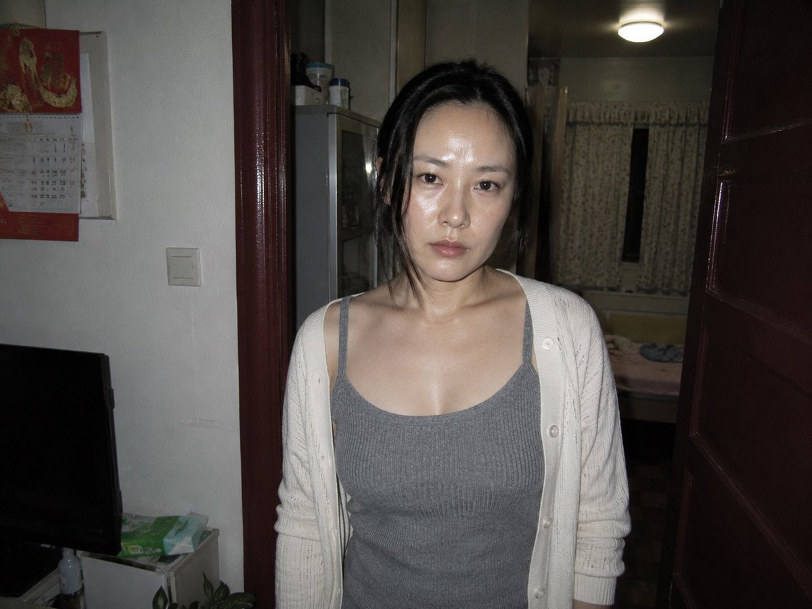

Prompt:

```text
Create a raw, candid flash photograph in a cramped apartment doorway at night, with a slightly unsettling documentary snapshot feel. Center a {argument name="subject" default="young East Asian woman"} standing close to the camera, facing forward with a neutral tired expression, direct eye contact, slightly messy black hair loosely tied back with strands falling around her face, shiny skin from harsh flash, natural minimal makeup, and relaxed posture. She wears exactly 2 main visible clothing pieces: a gray ribbed spaghetti-strap tank top and an open off-white knit cardigan with buttons. The composition is vertical-ish within a 4:3 frame, waist-up crop, camera at chest-to-eye level, harsh on-camera flash creating bright highlights on the face and chest and deep shadows in the room. Setting: an older small apartment interior with exactly 1 dark red wooden doorframe around her, 1 partially open dark red door on the right edge, 1 white wall on the left, 1 red wall calendar with Chinese-style artwork on the upper left wall, 1 light switch below it, 1 black television at lower left, 1 small cabinet or side table with tissues and household items, 1 plant partly visible at the bottom, 1 gray refrigerator or tall cabinet behind her left shoulder, and 1 dim bedroom visible in the background with exactly 1 bed, 1 curtained window, and 1 round ceiling light glowing above. Use muted household colors, realistic skin texture, imperfect framing, visible noise, slight lens distortion, and a point-and-shoot camera aesthetic. Avoid glamour lighting, studio polish, exaggerated beauty retouching, text overlays, logos, or extra people.
```

### GPT Image 2 Prompts #69: Profile / Avatar - Executive Studio Portrait in Modern Fashion

- Category: `Product`
- Model: `GPT Image 2`
- Author / Source: [PromptLab](https://github.com/YouMind-OpenLab/awesome-gpt-image-2/blob/main/README.md)
- Image: `assets/imported/YouMind-OpenLab/awesome-gpt-image-2/README-10-Profile-Avatar-Executive-Studio-Portrait-in-Modern-Fashion.jpg`


Prompt:

```text
Ultra-realistic professional studio portrait of {argument name="subject" default="one adult subject"} in a clean, modern executive fashion style.

Place the subject seated on a simple white cube, with the body angled slightly toward the camera. The posture should feel upright but relaxed. The hands are gently clasped and resting naturally on the lap. The expression is confident, warm, and composed, with a subtle professional smile.

Keep the overall mood polished, elegant, modern, trustworthy, and fully realistic. Avoid stylization, cinematic drama, beauty filters, exaggerated retouching, or artificial effects.

Wardrobe and styling:

- {argument name="wardrobe" default="Crisp white tailored blazer in matte fabric, with no logos"}
- Minimal white inner top or high-neck tee
- Neutral beige or tan tailored trousers
- Subtle realistic gold jewelry only, such as a thin chain, bracelet, or ring
- Clean natural grooming
- Hair styled neatly and naturally, matching the uploaded reference face exactly

Environment and lighting:

- Seamless neutral gray studio backdrop
- Soft, even studio lighting with natural falloff
- No harsh shadows and no dramatic contrast
- True-to-life skin texture and accurate fabric detail
- Professional fashion editorial realism

Identity reference, absolute and non-negotiable:

Use {argument name="identity reference" default="my uploaded face image"} as the only facial identity reference.

Maintain 100% facial accuracy at all times, including bone structure, jawline, chin, eye shape, eyelids, iris placement, eyebrow thickness and curve, nose bridge, nose width, nose tip, lip shape, lip proportions, cheek volume, facial symmetry, hairline, and overall facial proportions.

The face must stay perfectly consistent from every angle, including front view, three-quarter view, side profile, seated pose, slight head tilt, and full-body framing.
```

### GPT Image 2 Prompts #70: Profile / Avatar - Elegant 23rd Birthday Studio Portrait

- Category: `Portrait`
- Model: `GPT Image 2`
- Author / Source: [PromptLab](https://github.com/YouMind-OpenLab/awesome-gpt-image-2/blob/main/README.md)
- Image: `assets/imported/YouMind-OpenLab/awesome-gpt-image-2/README-11-Profile-Avatar-Elegant-23rd-Birthday-Studio-Portrait.jpg`

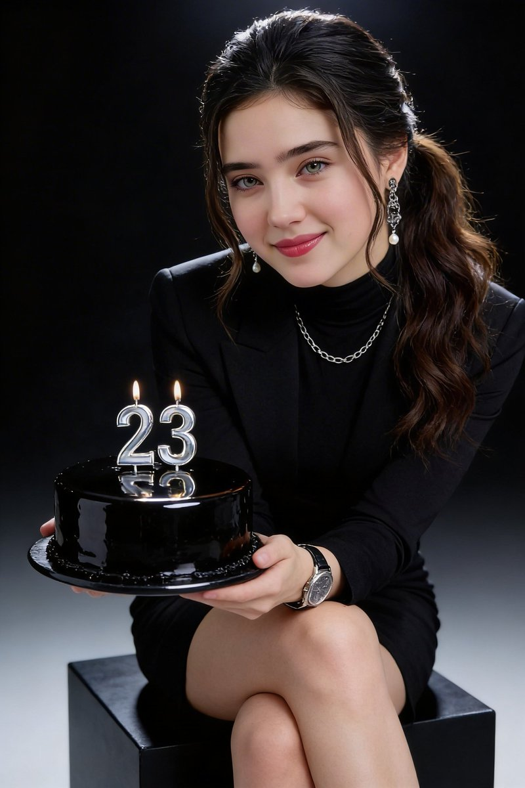

Prompt:

```text
Create a bold, high-contrast studio photoshoot of a woman using the uploaded face as the reference, celebrating her {argument name="age" default="23rd"} birthday in an elegant black-on-black editorial setup. She is seated with poise on a matte black cube, leaning slightly forward, one elbow resting on her knee, holding a sleek black birthday cake finished with a glossy mirror glaze that catches and reflects the studio lights.

Style her in a sophisticated {argument name="outfit style" default="all-black fashion look"}, such as a fitted turtleneck or structured dress with a tailored blazer, giving the scene a confident, feminine, fashion-forward edge. Add refined accessories including a delicate silver chain, statement earrings, and a luxury watch.

Place metallic silver number candles reading "{argument name="birthday number" default="23"}" on the cake. The candles should glow brightly and act as a subtle secondary light source that adds drama and depth to the scene.

Use a deep black seamless studio backdrop with a soft controlled gradient from dark gray into pure black, creating dimension while keeping the background clean and distraction-free.

Light the scene cinematically with strong directional key light from one side to sculpt the face with sharp dramatic shadows, plus a subtle backlight that creates elegant rim highlights along the silhouette. Add a faint haze so the atmosphere and light beams are slightly visible.

Shoot as an 85mm medium close-up portrait with shallow depth of field. Keep the eyes and reflective cake surface tack sharp while the rest falls into a soft cinematic blur.

8K resolution, ultra-detailed, sharp focus, high dynamic range, moody studio photography, powerful confident feminine editorial aesthetic.
```

### GPT Image 2 Prompts #71: Profile / Avatar - Two Anime Office Workers at Glass Doors

- Category: `Portrait`
- Model: `GPT Image 2`
- Author / Source: [AIAI.COM](https://github.com/YouMind-OpenLab/awesome-gpt-image-2/blob/main/README.md)
- Image: `assets/imported/YouMind-OpenLab/awesome-gpt-image-2/README-12-Profile-Avatar-Two-Anime-Office-Workers-at-Glass-Doors.jpg`

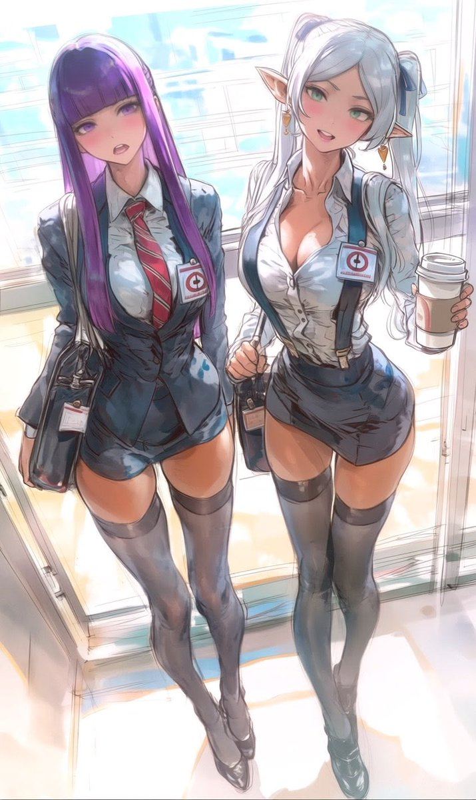

Prompt:

```text
Create a polished vertical anime illustration of exactly two young adult female office workers standing side by side in a bright modern transit-station or office-lobby entrance, viewed from a slightly high angle as if the viewer is looking down at them near glass doors. The left woman is human with {argument name="left character hair color" default="very long straight deep purple hair with magenta highlights and blunt bangs"}, sleepy violet eyes, a slightly open mouth, and a dark fitted business blazer over a white shirt with a red striped tie; she wears a short dark skirt or suit bottom, black thigh-high stockings, glossy black heels, a shoulder bag, and a visible ID badge with a red cross-like emblem. The right woman is an elf with pointed ears, {argument name="right character hair color" default="silvery white hair in high twin ponytails with blue ribbons"}, green eyes, soft blush, gold dangling earrings, and a friendly half-smile; she wears a tight white button-up blouse, dark suspenders, a short dark pencil skirt, black thigh-high stockings, glossy black heels, a matching ID badge with a red cross-like emblem, carries a dark bag, and holds a takeaway coffee cup in her right hand. Use a clean but expressive Japanese anime style with delicate line art, soft watercolor-like shading, luminous skin highlights, subtle fabric wrinkles, and fashionable office-uniform details. The setting should have large glass doors and windows, pale blue sky and city shapes outside, bright sunlit reflections on the floor, airy overexposed backlighting, and sketchy architectural perspective lines. Mood: elegant, slightly glamorous, candid morning commute snapshot. Composition: full-body vertical framing, both characters centered, legs visible to the shoes, soft pastel color palette with high-key lighting, no extra characters, no readable text except the small badge-like symbols. Customize the overall attire as {argument name="outfit theme" default="stylish corporate uniforms with medical-style ID badges"}.
```

### GPT Image 2 Prompts #72: Profile / Avatar - Chiaroscuro High-Contrast Male Portrait

- Category: `Portrait`
- Model: `GPT Image 2`
- Author / Source: [Mr. Tariq](https://github.com/YouMind-OpenLab/awesome-gpt-image-2/blob/main/README.md)
- Image: `assets/imported/YouMind-OpenLab/awesome-gpt-image-2/README-13-Profile-Avatar-Chiaroscuro-High-Contrast-Male-Portrait.jpg`

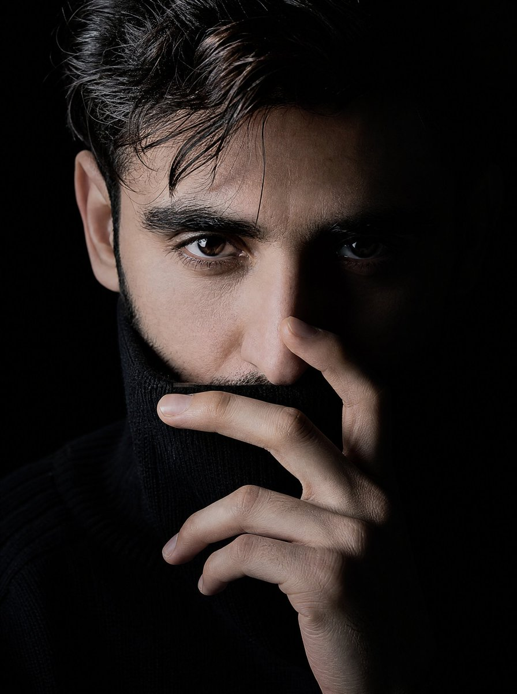

Prompt:

```text
Ultra high fidelity photorealistic image. Reproduce every visible detail with high accuracy.

Vertical close-up portrait, tight framing on face with {argument name="atmosphere" default="extreme high-contrast dramatic atmosphere"}.

Extreme chiaroscuro lighting with strong side light creating bright highlights on hair, eyes and hand edges against deep black shadows covering half the face and body, cool dark moody color tone with intense contrast.

Mysterious intense pose, direct gaze toward viewer, lower face partially obscured by hand and deep shadow.

Short dark masculine hair with messy textured bangs and loose strands falling across the forehead, natural volume with strong rim highlights from side lighting.

{argument name="subject" default="Handsome young man"} with pale fair cool-toned skin, smooth even complexion, soft matte texture, completely matte with no oily or shiny areas.

Intense dark eyes with sharp catchlights, naturally defined masculine eyebrows, subtle under-eye depth, strong facial structure with a defined jawline. Lips barely visible in shadow with a natural tone.

Dark masculine garment with a high collar or {argument name="clothing detail" default="black fabric pulled up covering the lower face and neck"}.

One hand raised with fingers gently touching near the nose and cheek, natural masculine hand anatomy with realistic skin texture and nail details, partially illuminated by side light.

Completely black featureless dark background enhancing the dramatic light and shadow.

Ultra-realistic, cinematic, hyper-detailed, 8K, DSLR quality, razor-sharp focus, realistic skin pores, natural facial texture, dramatic rim lighting, masterpiece, no watermark, no signature, no overlay text.
```

### GPT Image 2 Prompts #73: Profile / Avatar - Red Satin Mirror Selfie Photography

- Category: `Portrait`
- Model: `GPT Image 2`
- Author / Source: [PromptLab](https://github.com/YouMind-OpenLab/awesome-gpt-image-2/blob/main/README.md)
- Image: `assets/imported/YouMind-OpenLab/awesome-gpt-image-2/README-14-Profile-Avatar-Red-Satin-Mirror-Selfie-Photography.jpg`

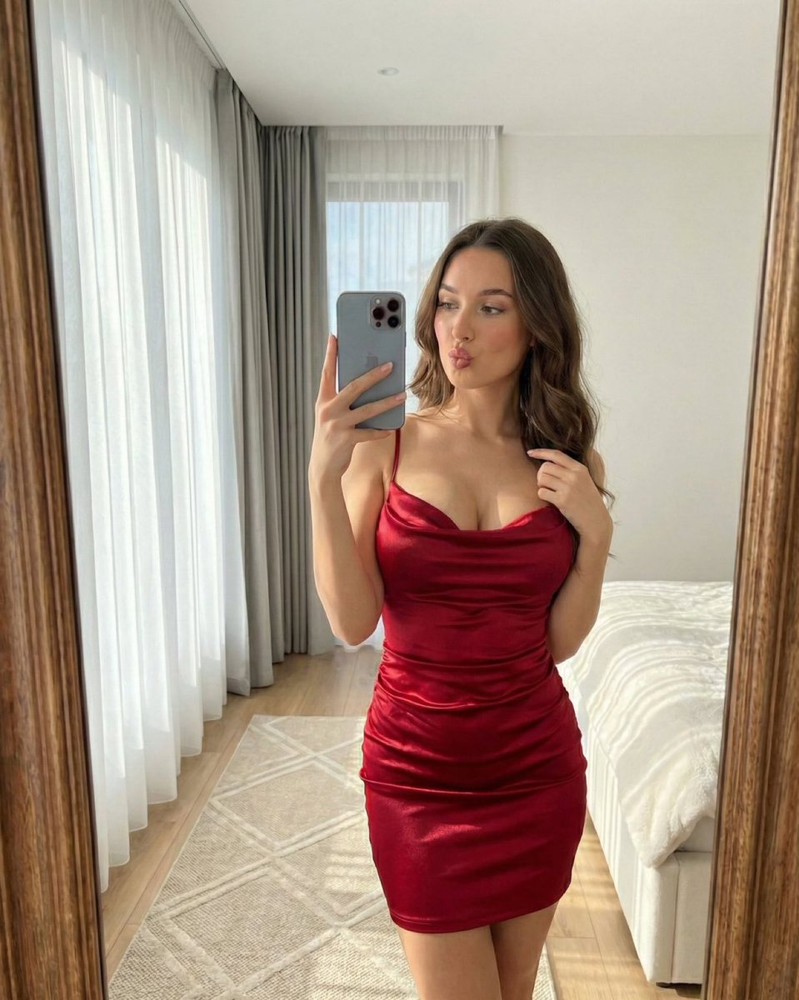

Prompt:

```text
{
  "project_metadata": {
    "version": "2.0",
    "style_preset": "Ultra realistic photographic realism",
    "resolution_target": "8K UHD",
    "aspect_ratio": "3:4",
    "composition": {
      "framing": "vertical mirror selfie",
      "shot_type": "medium full body crop",
      "perspective": "first person reflection in a mirror"
    }
  },
  "subject": {
    "identity": {
      "description": "{argument name="subject description" default="young woman"}",
      "estimated_age": "early twenties",
      "ethnicity": "unspecified, with a subtle Mediterranean look"
    },
    "physiognomy": {
      "hair": {
        "color": "rich dark brunette",
        "style": "long voluminous waves",
        "texture": "silky hair with clearly separated strands"
      },
      "face": {
        "expression": "playful soft pout",
        "makeup": {
          "style": "soft glam beauty makeup",
          "details": [
            "delicate winged eyeliner",
            "fresh dewy skin",
            "neutral glossy lips",
            "soft blush on the cheeks"
          ]
        }
      }
    },
    "pose_and_action": {
      "primary_hand": "right hand holding an iPhone 16 Pro Max at chest height",
      "secondary_hand": "left fingertips gently touching the cowl neckline",
      "body_language": "relaxed standing pose with a slight hip tilt"
    }
  },
  "attire_and_props": {
    "main_garment": {
      "type": "mini dress",
      "material": "{argument name="dress material" default="shiny red satin"}",
      "color_profile": "vivid scarlet crimson",
      "design_elements": {
        "top": "thin spaghetti straps with an elegant draped cowl neckline",
        "body": "detailed ruching gathered across the waist",
        "skirt": "fitted mini skirt with folded gathered fabric"
      }
    },
    "tech_prop": {
      "device": "iPhone 16 Pro Max",
      "finish": "silver gray titanium",
      "details": "triple lens camera module visible in the mirror reflection"
    }
  },
  "environment_architecture": {
    "room_type": "{argument name="room type" default="modern primary bedroom"}",
    "flooring": {
      "material": "pale oak hardwood",
      "overlay": "soft beige rug with a quiet geometric pattern"
    },
    "background_elements": [
      {
        "element": "floor to ceiling window",
        "window_treatments": [
          "translucent white sheer curtains",
          "heavy charcoal gray drapes"
        ]
      },
      {
        "element": "bed",
        "description": "minimal white bedding, partly visible near the edge of the frame"
      }
    ]
  },
  "lighting_and_optics": {
    "primary_light": {
      "source": "natural light from the window",
      "direction": "side lit from a 45 degree angle",
      "quality": "soft diffused airy daylight"
    },
    "optical_effects": [
      "bright specular highlights on the satin dress",
      "convincing mirror reflection behavior",
      "gentle background bokeh"
    ]
  }
}
```

### GPT Image 2 Prompts #74: Profile / Avatar - Smiling Baby With Five Kittens

- Category: `Portrait`
- Model: `GPT Image 2`
- Author / Source: [Mehedi Hasan Munna](https://github.com/YouMind-OpenLab/awesome-gpt-image-2/blob/main/README.md)
- Image: `assets/imported/YouMind-OpenLab/awesome-gpt-image-2/README-15-Profile-Avatar-Smiling-Baby-With-Five-Kittens.jpg`

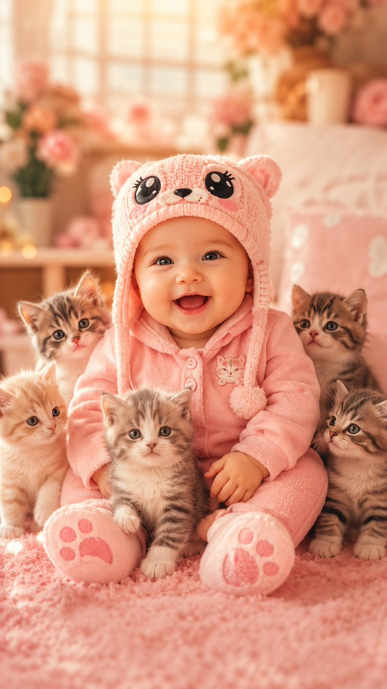

Prompt:

```text
Create a vertical 9:16 ultra-cute photorealistic baby-and-kittens wallpaper. Center a smiling baby with full body visible, sitting on a fluffy pink rug in a cozy pastel-pink nursery bedroom. The baby wears {argument name="baby outfit color" default="soft pink"} fleece pajamas and a matching knitted animal hat with ear flaps, round bear ears, pom-poms, a cute embroidered animal face, oversized black cartoon eyes, and blush cheeks. The baby has big bright eyes, rosy cheeks, and an open happy smile, looking directly at the camera. Surround the baby with exactly 5 kittens: one cream kitten at the lower left, one gray tabby kitten sitting in front center between the baby’s legs, one brown tabby kitten behind the baby’s left shoulder, one brown tabby kitten behind the baby’s right shoulder, and one striped tabby kitten at the lower right. Keep all kittens fluffy, tiny, wide-eyed, and facing generally toward the camera. Use warm golden window light, soft peach-pink color grading, shallow depth of field, creamy bokeh, and a dreamy cute pet wallpaper aesthetic. Background: softly blurred nursery with a large glowing window, pink flowers in vases, warm fairy-light dots, a pale bed with pink bedding, and plush decor. Composition should feel symmetrical and tender, with the baby as the central subject and kittens clustered around the legs and shoulders. High detail on the baby’s face, hat texture, fleece fabric, kitten fur, and paw-print soles on the baby’s feet. No text, no watermark, no extra people, no distorted limbs, no scary expressions.
```

### GPT Image 2 Prompts #75: Profile / Avatar - Tattooed Anime Man in Marble Hall

- Category: `Portrait`
- Model: `GPT Image 2`
- Author / Source: [しろまる](https://github.com/YouMind-OpenLab/awesome-gpt-image-2/blob/main/README.md)
- Image: `assets/imported/YouMind-OpenLab/awesome-gpt-image-2/README-16-Profile-Avatar-Tattooed-Anime-Man-in-Marble-Hall.jpg`

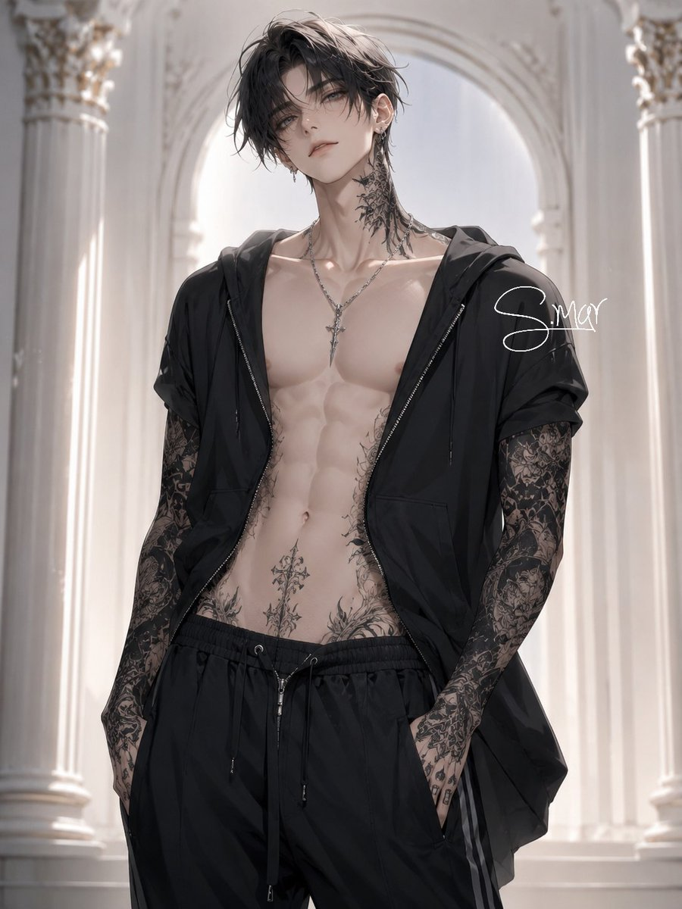

Prompt:

```text
Create a highly detailed anime-style portrait of a beautiful androgynous young man named {argument name="character name" default="Smar"}, shown from upper thighs to head in a bright white neoclassical hall with tall marble columns, ornate arches, soft sunlight, and a pale luxury atmosphere. He has {argument name="hair color" default="messy black hair with subtle ash highlights"}, long tousled bangs partially covering one eye, pale skin, a slim but muscular defined torso, sharp collarbones, narrow waist, and a calm alluring expression with slightly parted lips and gray-blue eyes. Dress him in an open black sleeveless hooded zip jacket hanging loose off the shoulders and unzipped to fully reveal the chest and abs, paired with loose black drawstring athletic pants; his hands are tucked casually into the pants pockets. Add intricate black tattoo work as the main visual feature: full floral lace-like tattoo sleeves covering both arms and hands, ornamental black tattoos rising from the lower abdomen and hips, side-rib tattoos, and a dark botanical tattoo climbing the side of the neck. Include a thin silver chain necklace with a long cross pendant and small dangling earrings. Use a refined semi-realistic Japanese illustration style with delicate linework, glossy soft shading, dramatic fashion-editorial posing, high detail on skin, fabric folds, tattoos, jewelry, and hair strands. Composition should be vertical 3:4, centered figure, softly blurred architectural background, white and charcoal color palette, gentle backlighting, elegant sensual mood, no explicit nudity, no extra characters. Optionally place a small white handwritten signature reading {argument name="signature text" default="Smar"} near the right side of the upper torso area.
```

### GPT Image 2 Prompts #76: Profile / Avatar - Melancholic Anime Girl Holding Tea

- Category: `Portrait`
- Model: `GPT Image 2`
- Author / Source: [abara / 囲図囿図囲](https://github.com/YouMind-OpenLab/awesome-gpt-image-2/blob/main/README.md)
- Image: `assets/imported/YouMind-OpenLab/awesome-gpt-image-2/README-17-Profile-Avatar-Melancholic-Anime-Girl-Holding-Tea.jpg`

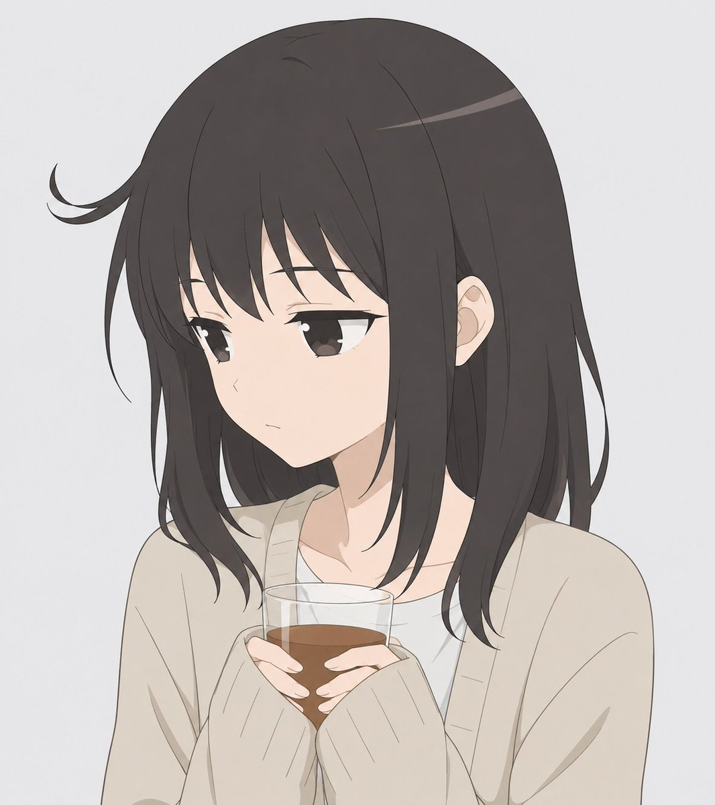

Prompt:

```text
Create a simple square anime-style illustration of a melancholic teenage girl holding a clear glass of tea with both hands. The character has {argument name="hair color" default="dark charcoal black"} medium-length straight hair with soft messy bangs, a few loose strands curling outward on the left, long side locks, subtle gray highlights, and a natural slightly unkempt shape. She has pale skin, large tired dark eyes looking down and to the left, thin eyebrows, a tiny nose, and a small neutral downturned mouth, giving a quiet introspective mood. She wears a loose {argument name="cardigan color" default="warm beige"} cardigan with oversized sleeves over a plain {argument name="shirt color" default="white"} crew-neck shirt. Her hands are close to her chest, fingers wrapped around one transparent cylindrical glass filled halfway with {argument name="drink" default="brown tea"}. Use a clean modern Japanese anime aesthetic with soft thin line art, muted colors, gentle cel shading, minimal texture, and no text. Frame her from the chest up in a centered three-quarter view, head tilted slightly downward, shoulders relaxed. The background is a plain very light gray-white with no objects or scenery, emphasizing the quiet emotional portrait.
```

### GPT Image 2 Prompts #77: Profile / Avatar - Quiet Anime Schoolgirl Holding Tea

- Category: `Portrait`
- Model: `GPT Image 2`
- Author / Source: [abara / 囲図囿図囲](https://github.com/YouMind-OpenLab/awesome-gpt-image-2/blob/main/README.md)
- Image: `assets/imported/YouMind-OpenLab/awesome-gpt-image-2/README-18-Profile-Avatar-Quiet-Anime-Schoolgirl-Holding-Tea.jpg`

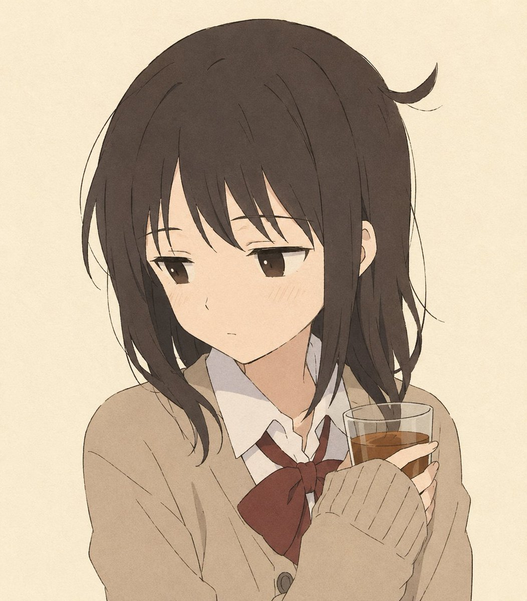

Prompt:

```text
Create a soft, understated anime-style portrait of a teenage schoolgirl in a quiet candid moment. She has {argument name="hair color" default="dark brown"} medium-length slightly messy hair with long bangs falling over her forehead, a few loose strands around her face, and one small outward flick of hair near the upper right side of her head. Her eyes are half-lidded and tired-looking, colored deep brown, with a neutral, mildly pensive expression and faint blush marks on her cheeks. She is shown from the chest up, turned slightly to the viewer’s right while looking down-left, holding a clear glass tumbler of amber tea close to her chest with both hands. She wears a Japanese school uniform: a white collared shirt, a {argument name="ribbon color" default="dark red"} bow ribbon at the neck, and an oversized {argument name="cardigan color" default="warm beige"} knit cardigan with long sleeves covering part of her hands; include one visible dark button near the lower center. The composition is simple and intimate, with the character centered slightly left on a plain warm cream background. Use a delicate hand-drawn 2D anime illustration style with thin sketchy linework, muted earthy colors, soft cel shading, subtle paper-like grain texture, low contrast, and no text or decorative elements. Keep the mood calm, melancholic, and natural, avoiding glossy highlights, hyperrealism, or overly polished digital effects.
```

### GPT Image 2 Prompts #78: Profile / Avatar - Soft Mist Idol Portrait

- Category: `Portrait`
- Model: `GPT Image 2`
- Author / Source: [PromptLab](https://github.com/YouMind-OpenLab/awesome-gpt-image-2/blob/main/README.md)
- Image: `assets/imported/YouMind-OpenLab/awesome-gpt-image-2/README-19-Profile-Avatar-Soft-Mist-Idol-Portrait.jpg`


Prompt:

```text
9:16 vertical portrait photo of an adult {argument name="subject" default="Korean pop idol"}, single subject. Use a soft black mist filter look with low contrast, gentle highlight bloom, subtle glow, soft diffusion, and slightly lifted faded blacks. Minimal indoor scene beside a window with white curtains and a clean light toned background. The subject has natural minimal makeup, realistic dewy skin texture, and subtle human imperfections. Outfit is an {argument name="clothing" default="oversized white button up shirt with short bottoms"}, loose and casual, with no revealing styling. {argument name="hair style" default="Long dark hair"}, slightly messy, naturally voluminous, softly flowing. Pose is relaxed standing or a light lean, body subtly angled, one leg a little forward, shoulders relaxed. One hand lightly touches the collar or rests near the neckline while the other stays relaxed. Keep the body curve gentle and not exaggerated. Expression is a soft cute smile with slightly playful eyes, looking directly at the camera or just off camera. Close to mid body framing, eye level, intimate distance, with a slight handheld photography feel. Diffused natural daylight, soft shadows, light wrapping gently around the face and body. Mood is cute, intimate, everyday softness, quiet romantic atmosphere, with an understated dreamy tone. Ultra realistic quality, fine film grain, slight softness near the edges, natural imperfections.
```

### GPT Image 2 Prompts #79: Profile / Avatar - Natural Social Media Style Photo Prompt

- Category: `Portrait`
- Model: `GPT Image 2`
- Author / Source: [えなどり.dev a.k.a. 荵](https://github.com/YouMind-OpenLab/awesome-gpt-image-2/blob/main/README.md)
- Image: `assets/imported/YouMind-OpenLab/awesome-gpt-image-2/README-20-Profile-Avatar-Natural-Social-Media-Style-Photo-Prompt.jpg`

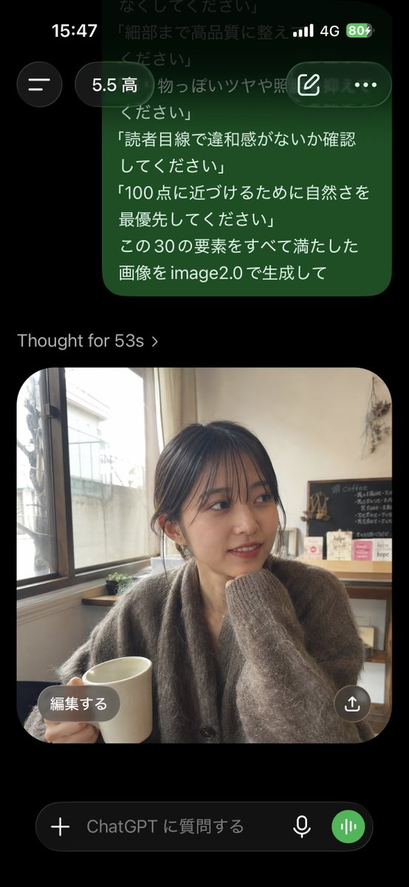

Prompt:

```text
"Please make it a natural photo that looks like it could actually exist on social media."
"Please eliminate any excessive processing feel."
"Please make it work as a single realistic shot."
"Please give it a natural atmosphere that isn't too perfect."
"Please avoid elements that look AI-generated."
"Please give it a texture as if it were taken with a smartphone."
"Please make it look like it was taken in natural light."
"Please blur the background slightly."
"Please make it look like a scene from daily life."
"Please make the gaze natural rather than looking at the camera."
"Please ensure there is no strangeness in the hands or fingers."
"Please make the expression natural and not overdone."
"Please arrange the flow of hair naturally."
"Please do not make the skin too smooth."
"Please match the direction of light between the person and the background."
"Please include a background with a lived-in feel."
"Please make the background natural so it doesn't stand out."
"Please make the shadow positions realistic."
"Please make the boundaries between clothes, hair, and background natural."
"Create an atmosphere that wouldn't feel out of place on X or Instagram."
"Please use a composition that is easy to use for icons or posts."
"Please create enough white space so that text is easy to read if added."
"Please create an image that conveys the atmosphere at a glance."
"Please create a natural atmosphere that makes people want to save it."
"Please eliminate unnatural processing, distortion, or flaws."
"Please refine the details to high quality."
"Please suppress artificial-looking gloss or lighting."
"Please check from a reader's perspective for any sense of incongruity."
"Please prioritize naturalness to get as close to 100 points as possible."
Generate an image of {argument name="subject" default="a beautiful woman"} that meets all these 30 elements.
```

### GPT Image 2 Prompts #80: Profile / Avatar - Low-Angle Selfie with Fluffy Cat

- Category: `Product`
- Model: `GPT Image 2`
- Author / Source: [Sairah](https://github.com/YouMind-OpenLab/awesome-gpt-image-2/blob/main/README.md)
- Image: `assets/imported/YouMind-OpenLab/awesome-gpt-image-2/README-21-Profile-Avatar-Low-Angle-Selfie-with-Fluffy-Cat.jpg`

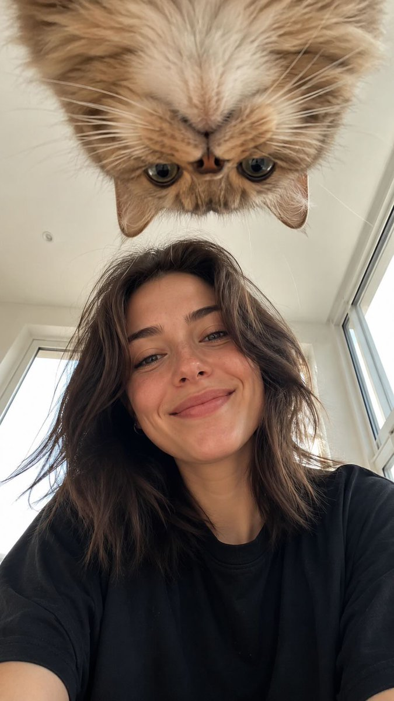

Prompt:

```text
Create a realistic vertical smartphone selfie taken indoors from a very low floor-level angle, with the camera pointing upward. A {argument name="subject" default="woman"} with fair skin, naturally proportioned facial features, expressive eyes, and shoulder-length dark hair stands in the lower center of the frame wearing an oversized black T-shirt. She looks down into the camera with a warm genuine smile, bright friendly eyes, and a relaxed social-media selfie expression.

At the top center of the frame, an {argument name="pet" default="upside-down fluffy cat"} leans toward the lens, looking directly downward and dominating the upper composition with a cute, funny, and charming expression that matches the woman's friendly and cheerful mood.

Bright modern apartment interior, large windows, soft natural daylight, clean minimal background. Ultra-realistic skin rendering with visible natural pores, fine facial hairs, subtle skin texture, realistic eyelids, natural lip texture, soft under-eye details, authentic complexion variations, slight redness in natural areas of the face, realistic skin translucency, no beauty filter effect, no plastic skin, no excessive retouching, realistic facial depth and micro-details. Matte skin finish with natural light absorption, true-to-life skin tones and highly realistic texture reproduction.

Professional portrait photography quality captured with a Sony A7R V, 85mm f/1.8 portrait lens, f/2.0 aperture, ISO 100, ultra-high-resolution sensor, shallow depth of field, natural optical bokeh, realistic lens rendering, high dynamic range, accurate skin color reproduction, crisp focus on the face and eyes. Soft window light combined with realistic ambient indoor illumination, natural shadow transitions, subtle catchlights in the eyes, cinematic yet realistic lighting.

Highly detailed cat fur, individual hair strands visible, realistic whiskers and facial features. Natural smartphone-photo composition with balanced framing, candid atmosphere, social-media-friendly aesthetic, photorealistic, ultra-detailed, lifelike textures, realistic lighting physics, premium portrait quality, 8K resolution.
```

### GPT Image 2 Prompts #81: Profile / Avatar - Asian Girl Summer City Portrait

- Category: `Portrait`
- Model: `GPT Image 2`
- Author / Source: [serein](https://github.com/YouMind-OpenLab/awesome-gpt-image-2/blob/main/README.md)
- Image: `assets/imported/YouMind-OpenLab/awesome-gpt-image-2/README-22-Profile-Avatar-Asian-Girl-Summer-City-Portrait.jpg`

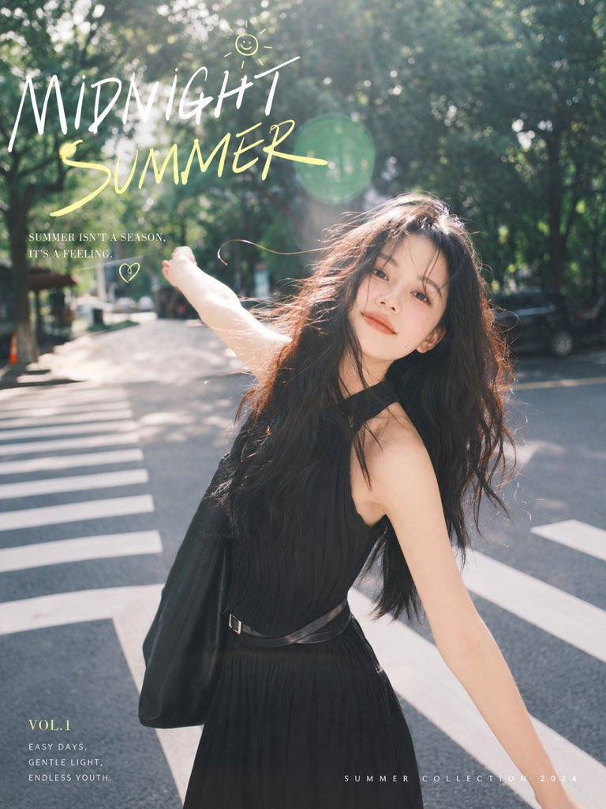

Prompt:

```text
Summer city street photography, a young Asian girl with long curly hair and clear natural makeup, wearing a {argument name="clothing color system" default="black-themed"} summer outfit, {argument name="clothing style" default="black camisole dress / black long dress"}
```

### GPT Image 2 Prompts #82: Profile / Avatar - Korean 2000s Phone Photo Strip

- Category: `Portrait`
- Model: `GPT Image 2`
- Author / Source: [WasifAI](https://github.com/YouMind-OpenLab/awesome-gpt-image-2/blob/main/README.md)
- Image: `assets/imported/YouMind-OpenLab/awesome-gpt-image-2/README-23-Profile-Avatar-Korean-2000s-Phone-Photo-Strip.jpg`

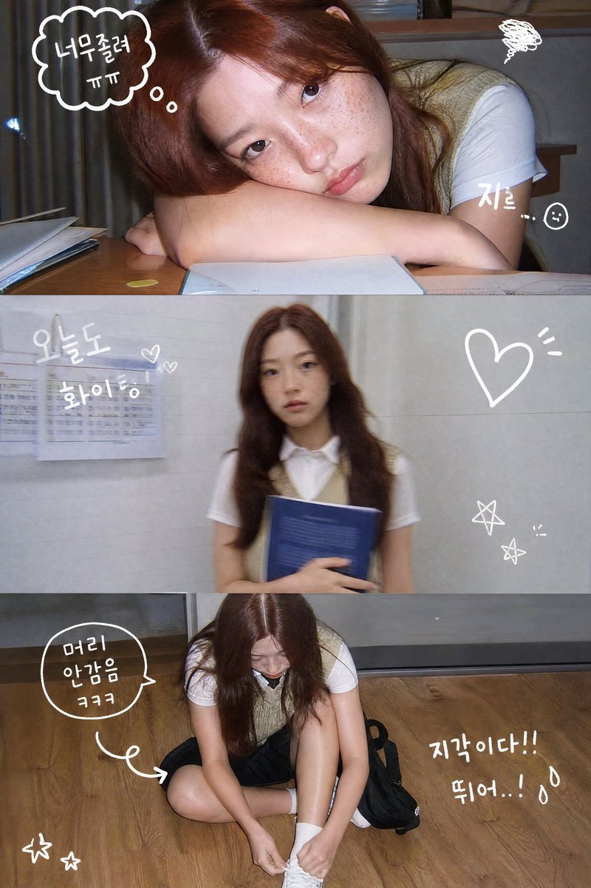

Prompt:

```text
{"layout":"vertical 3-panel college photo strip","subject":"{argument name="subject" default="girl with long hair in beige knit vest"}","panel_top":"{argument name="top panel scene" default="close-up resting chin on school desk, bored expression"}","panel_middle":"standing against white classroom wall holding book, slight motion blur","panel_bottom":"sitting on wooden floor tying shoelace","aesthetic":"{argument name="style aesthetic" default="Korean 2000s phone camera quality, warm tint, low resolution, handwritten doodle overlay, harsh flash, messy Korean girl style"}"}
```

### GPT Image 2 Prompts #83: Profile / Avatar - Seaside Boho AI Lady Duo

- Category: `Portrait`
- Model: `GPT Image 2`
- Author / Source: [AI lady collection@生成AI](https://github.com/YouMind-OpenLab/awesome-gpt-image-2/blob/main/README.md)
- Image: `assets/imported/YouMind-OpenLab/awesome-gpt-image-2/README-24-Profile-Avatar-Seaside-Boho-AI-Lady-Duo.jpg`

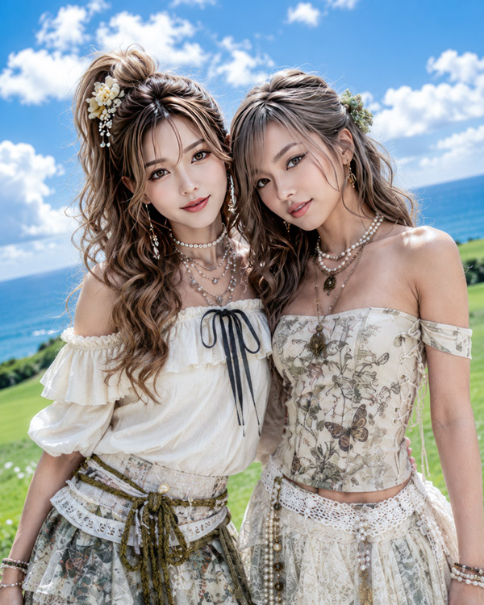

Prompt:

```text
Create a polished 2.5D semi-realistic anime fashion portrait of exactly two close female friends posing together outdoors by the sea. The women are slim young adult AI-lady models with elegant faces, large expressive eyes, soft glossy skin, delicate makeup, and long wavy ash-brown hair. They stand shoulder-to-shoulder, leaning their heads slightly toward each other and looking directly at the viewer with gentle confident smiles. The left woman has a high voluminous side ponytail with loose curls and a cluster of small white flowers in her hair; she wears an off-shoulder cream ruffled blouse with puff sleeves, a black ribbon bow at the neckline, layered pearl necklaces, dangling earrings, bracelets, and a bohemian patterned skirt with lace and belt-like fabric ties. The right woman has long loose wavy hair half pinned back with small green-white floral hair accessories; she wears an off-shoulder cream floral corset top, layered pearl and pendant necklaces, hoop earrings, bracelets, and a cream lace skirt with boho details. Use a bright coastal summer background with vivid blue sky, scattered fluffy white clouds, turquoise ocean horizon, green grassy cliff, and tiny white flowers in the foreground. Lighting is sunny and flattering with soft highlights, shallow depth of field, crisp facial detail, high-resolution glamour photography blended with anime illustration, elegant bohemian bridal beach styling, pastel ivory and beige color palette, natural wind-tousled hair, no text, no watermark. Customize as {argument name="character name" default="two unnamed AI lady friends"}, {argument name="hair color" default="ash-brown"}, {argument name="outfit style" default="cream bohemian off-shoulder lace fashion"}, {argument name="location" default="sunny seaside grassy cliff"}, and {argument name="mood" default="warm close friendship"}.
```

### GPT Image 2 Prompts #84: Profile / Avatar - Esports Gamer Studio Portrait

- Category: `Portrait`
- Model: `GPT Image 2`
- Author / Source: [Aijaz](https://github.com/YouMind-OpenLab/awesome-gpt-image-2/blob/main/README.md)
- Image: `assets/imported/YouMind-OpenLab/awesome-gpt-image-2/README-25-Profile-Avatar-Esports-Gamer-Studio-Portrait.jpg`

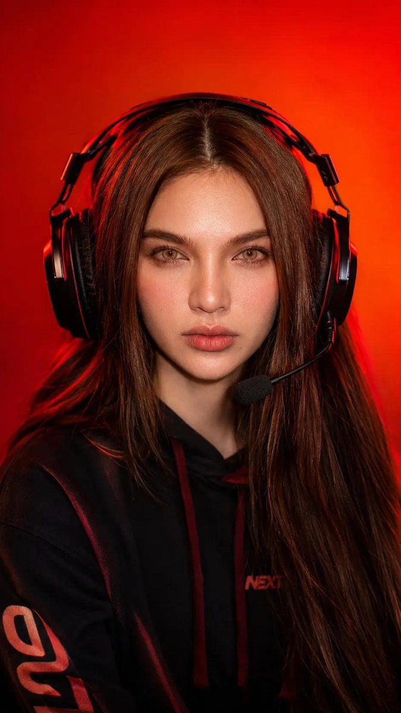

Prompt:

```text
Ultra-realistic studio portrait of a beautiful {argument name="subject" default="young female gamer"} wearing a {argument name="headset type" default="large black over-ear gaming headset with a boom microphone"}, long straight dark brown hair with a center part, hazel-green eyes, natural makeup, symmetrical face, neutral confident expression, {argument name="clothing" default="black oversized gaming hoodie with subtle red accents"}, cinematic red-orange gradient background, dramatic red rim lighting, soft beauty lighting on the face, highly detailed skin texture, sharp focus, centered composition, professional esports aesthetic, shallow depth of field, 85mm lens, f/1.8, ultra photorealistic, HDR, 8K, high-end DSLR quality, crisp facial details, volumetric lighting, realistic shadows.
```

### GPT Image 2 Prompts #85: Profile / Avatar - Rainforest Custard Pudding Frog

- Category: `Portrait`
- Model: `GPT Image 2`
- Author / Source: [アマドウマ](https://github.com/YouMind-OpenLab/awesome-gpt-image-2/blob/main/README.md)
- Image: `assets/imported/YouMind-OpenLab/awesome-gpt-image-2/README-26-Profile-Avatar-Rainforest-Custard-Pudding-Frog.jpg`

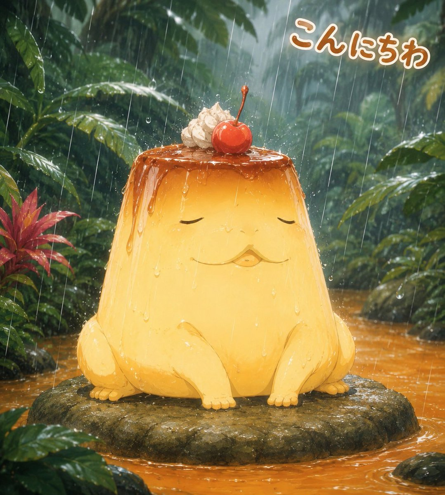

Prompt:

```text
Create a whimsical square anime-style illustration of a cute giant custard pudding creature sitting calmly on a flat mossy rock in the middle of a tropical rainforest stream during heavy rain. The character is a glossy golden flan shaped like a squat frog, with closed relaxed eyes, a tiny puckered mouth, small rounded front limbs and hind feet, and translucent caramel sauce dripping down from the top. On its head place exactly 2 dessert toppings: one swirl of whipped cream and one bright red cherry with a stem. The creature should look serene and friendly, like an original mascot character, with soft highlights, wet reflections, raindrops sliding down its body, and tiny splashes on the caramel surface. Surround it with dense jungle foliage, large wet green leaves, one cluster of red tropical leaves on the left, misty depth in the background, and an orange-brown rain-filled stream flowing around the rock. Add visible diagonal rain streaks throughout the scene and water droplets on leaves and stone. In the upper right, add the Japanese greeting text {argument name="greeting text" default="こんにちわ"} in rounded playful lettering, warm orange-brown fill with a thick white outline, slightly tilted. Use a highly polished digital painting style with soft cinematic lighting, saturated greens and warm custard yellows, shallow atmospheric depth, adorable fantasy creature design, no humans, no extra characters, no watermark.
```

### GPT Image 2 Prompts #86: Social Media Post - Soft Summer Afternoon Sunshine Portrait

- Category: `Product`
- Model: `GPT Image 2`
- Author / Source: [Prompt アトリエ｜AI画像プロンプト](https://github.com/YouMind-OpenLab/awesome-gpt-image-2/blob/main/README.md)
- Image: `assets/imported/YouMind-OpenLab/awesome-gpt-image-2/README-27-Social-Media-Post-Soft-Summer-Afternoon-Sunshine-Portrait.jpg`

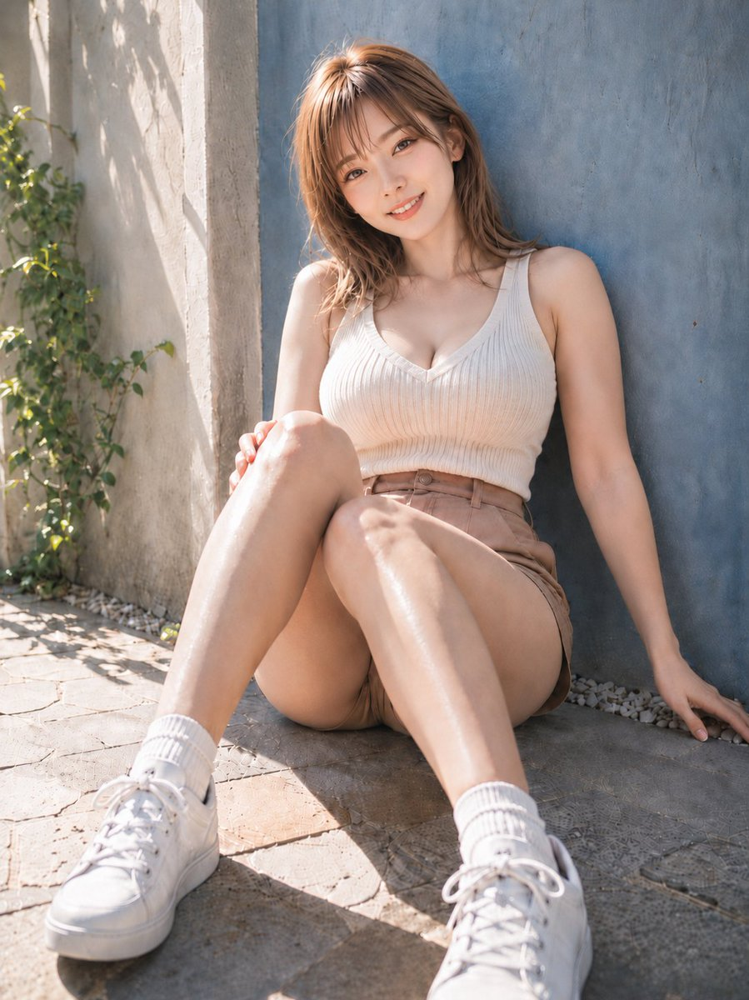

Prompt:

```text
Subject:
{argument name="subject" default="Sunlight patch"}

Person/Expression:
{argument name="person" default="Woman in her 20s"}. Fair skin leaning towards bright ivory beige, smooth with a hint of pink. Soft highlights on cheeks, nose, shoulders, and collarbones. Delicate texture preserving natural skin grain. Features of a mature Japanese photo model, not youthful. Expression is a soft smile towards the camera. Pale rose pink blush, champagne beige and pink brown eyeshadow, long thin eyelashes, natural eye bags, light brown eyebrows, sheer pink-beige gloss. Small clear catchlights in the eyes.

Clothing/Pose:
Light milk tea ash brown medium-long hair. Thin see-through bangs, face-framing layers, slightly curled ends. Soft airy feel, natural hair bundles, fine highlights. Clothing is an ivory ribbed sleeveless V-neck knit. Elegant and natural fit, showing mature body curves but modest and refined. High-waist beige shorts, white ribbed socks, white sneakers without logos. Sitting on the floor leaning against a blue-toned wall, knees up, legs extended towards the camera. Right hand supports the body on the floor, left hand lightly on one knee.

Background/Light:
{argument name="background" default="A corner of an outdoor area reminiscent of a quiet building wall"}. Behind is a slightly aged blue-grey painted wall, white wall with thin green ivy on the left, cobblestones and small white gravel at the feet. Strong natural summer afternoon light from the top left, creating bright highlights on hair, cheeks, shoulders, collarbones, knees, and sneakers. Shadows fall towards the bottom right; the blue wall looks cool while skin and clothes look warm.

Composition/Camera:
Vertical composition, 3:4. Low-angle seated portrait. Camera slightly lower than knee height, subject centered. White sneakers and legs prominently in the foreground, face and upper body in the top center. Natural wide-angle feel around 35mm, perspective in the feet, focus on the face. Background is light and soft, wall texture preserved.

Texture/Style:
High-quality Japanese realistic photo. Natural light portrait, clean summer air, soft film-like gradations. Skin not over-polished, preserving natural pores and luster. Detailed rendering of knit ribs, cobblestones, wall grain, and fine hair bundles. No excessive HDR or plastic skin.

Negative:
Underage, youthful face, unnatural face, asymmetrical eyes, excessive skin retouching, plastic-like skin, excessive breast emphasis, vulgar sexual expression, overexposure, transparent clothes, nipples, underwear-like, extra fingers, missing fingers, fused limbs, broken joints, distorted legs, deformed shoes, shadows inconsistent with light source, collapsed background, text, logo, watermark, excessive AI feel.
```

### GPT Image 2 Prompts #87: Social Media Post - Surreal Koi Pond Portrait Artist

- Category: `Portrait`
- Model: `GPT Image 2`
- Author / Source: [カーブミラー](https://github.com/YouMind-OpenLab/awesome-gpt-image-2/blob/main/README.md)
- Image: `assets/imported/YouMind-OpenLab/awesome-gpt-image-2/README-28-Social-Media-Post-Surreal-Koi-Pond-Portrait-Artist.jpg`

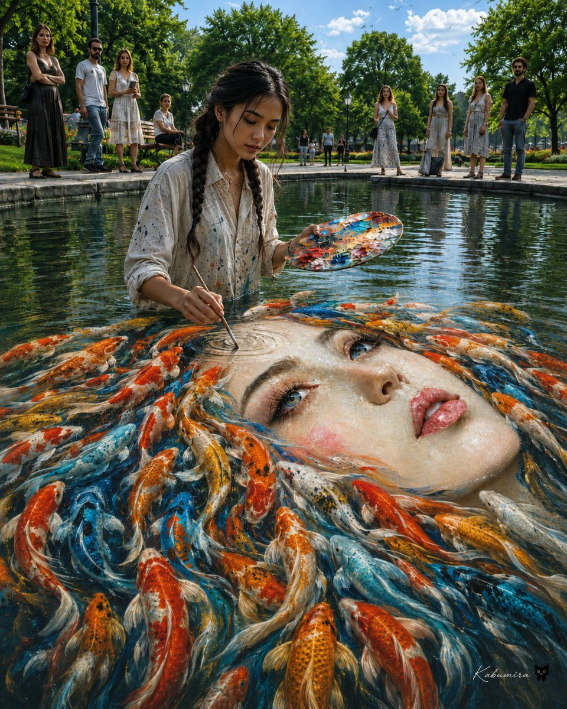

Prompt:

```text
Create a surreal, ultra-detailed photorealistic scene in a sunny public park pond: a young female artist, {argument name="artist appearance" default="East Asian woman in her early 20s with long black hair in two loose braids"}, stands waist-deep in clear water wearing an oversized off-white button-up shirt splattered with paint. She holds an oval painter’s palette covered in vivid orange, blue, white, and gold paint in one hand and uses a thin brush in the other to paint directly onto the surface of the pond. Beneath the water, the painting becomes an enormous floating portrait of {argument name="portrait subject" default="a beautiful pale woman’s face with blue eyes, glossy pink lips, rosy cheeks, and wet porcelain-like skin"}, with the face tilted diagonally across the lower right half of the image. The portrait’s hair transforms into a swirling school of exactly 55 koi fish, individually visible, in orange, red, white, gold, black-speckled, and bright blue patterns, flowing around the face like living hair. The brush tip touches a circular ripple on the painted forehead, creating delicate concentric rings. Around the pond are exactly 12 visible background people: 1 tall woman in a black sleeveless dress on the far left, 1 bearded man in sunglasses and a white shirt, 1 woman in a white summer dress, 1 seated person on a bench, 4 tiny distant park visitors near the center walkway, and 4 onlookers on the right consisting of 3 women in light dresses and 1 man in a black shirt. The setting is a manicured city park with stone pond edges, wooden benches, black lampposts, lush green trees, trimmed grass, and a blue sky with scattered white clouds. Use a low eye-level wide-angle composition from the waterline, with the artist centered slightly left and the giant face dominating the foreground. Style: {argument name="visual style" default="cinematic hyperrealism with magical realism, crisp 8k detail, natural daylight, rich reflections, realistic water refraction, painterly color accents"}. Mood: {argument name="mood" default="dreamlike, contemplative, astonishing, serene"}. Add a small elegant artist signature in the bottom right reading {argument name="signature text" default="Kabumisa"}. Avoid text elsewhere, avoid cartoon styling, avoid distorted anatomy, keep the water transparent and reflective, and make the koi and portrait blend seamlessly into the pond surface.
```

### GPT Image 2 Prompts #88: Social Media Post - Celestial Floral Fantasy Portrait

- Category: `Portrait`
- Model: `GPT Image 2`
- Author / Source: [NIKKO](https://github.com/YouMind-OpenLab/awesome-gpt-image-2/blob/main/README.md)
- Image: `assets/imported/YouMind-OpenLab/awesome-gpt-image-2/README-29-Social-Media-Post-Celestial-Floral-Fantasy-Portrait.jpg`

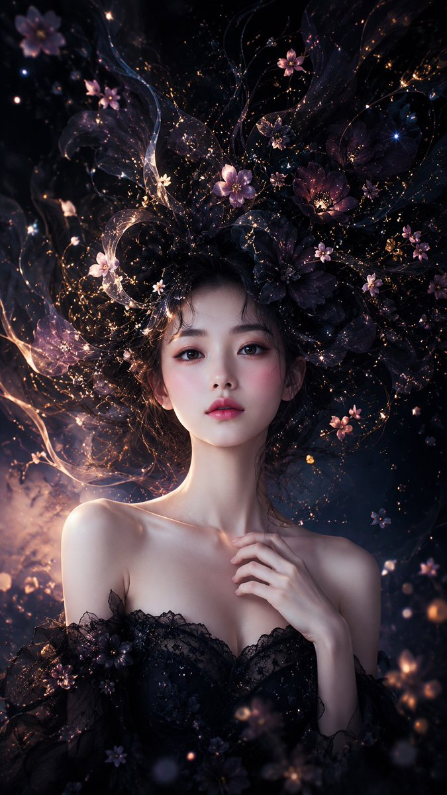

Prompt:

```text
Create a vertical fantasy glamour portrait of {argument name="character name" default="an ethereal young East Asian woman"} from the chest up, centered and facing forward with a calm, slightly melancholic expression, luminous pale skin, large glossy eyes, soft pink eyeshadow, rosy cheeks, and natural pink lips. She wears an off-shoulder black lace gown with delicate floral appliqué, her right hand gently touching her collarbone, shoulders bare and softly lit. Her dark hair expands upward and outward into an elaborate cosmic floral headdress made of translucent smoky ribbons, black lace-like petals, stardust, and warm golden spark particles against a deep midnight-blue and black background. Include exactly 20 prominent visible blossoms: 1 blurred mauve flower at the upper left, 2 small pink flowers on the left side, 1 glowing white flower near the left hairline, 1 tiny white flower near her left cheek, 1 central lavender flower above her forehead, 1 pink flower at the top center, 1 small dark flower just right of center, 2 large dark purple flowers on the right side of the hair, 4 small pink blossoms scattered on the right, 2 small blossoms in the lower-right background, and 3 dark floral appliqué blossoms on the dress. Use {argument name="flower color palette" default="black plum, deep violet, dusty pink, and pale lavender"} with sparkling amber highlights. The mood should be {argument name="mood" default="dreamlike, mysterious, celestial, and romantic"}. Lighting should be cinematic low-key with a soft key light on the face, glowing bokeh embers, blue star points, and a warm misty flare from the lower left. Render in ultra-detailed photorealistic fantasy style, shallow depth of field, intricate hair strands, translucent veils, glittering dust, high contrast, no text, no watermark, no extra people.
```

### GPT Image 2 Prompts #89: Social Media Post - Pink Office Chibi Scene

- Category: `Portrait`
- Model: `GPT Image 2`
- Author / Source: [PromptLab](https://github.com/YouMind-OpenLab/awesome-gpt-image-2/blob/main/README.md)
- Image: `assets/imported/YouMind-OpenLab/awesome-gpt-image-2/README-30-Social-Media-Post-Pink-Office-Chibi-Scene.jpg`


Prompt:

```text
Using the reference photo, create a realistic female character with the same facial structure and facial features. Keep the person as photorealistic as possible, with a soft smile and a playful, natural expression.

Hair: Match the reference photo, including the same hairstyle, natural movement, and healthy shine.

Outfit: Dress her in modern, stylish casual clothing.

Scene: Place her in an adorable {argument name="color theme" default="pink"} office where she looks creative and inspired. Around her, add {argument name="characters" default="tiny chibi versions of the same woman"} doing {argument name="character actions" default="funny actions: drinking coffee from a cup, pulling her hair, making silly faces"}, and lying on her stomach on the desk while drawing in a notebook. Add cute doodles and emojis throughout the scene, plus a short matching phrase that fits the playful office mood.

Lighting and format: Natural light, realistic detail, {argument name="aspect ratio" default="1080:1350"} aspect ratio, 4:5 vertical composition.
```

### GPT Image 2 Prompts #90: Social Media Post - Surreal Fine Art Fantasy Portrait on Lake

- Category: `Portrait`
- Model: `GPT Image 2`
- Author / Source: [Future AI 🧩](https://github.com/YouMind-OpenLab/awesome-gpt-image-2/blob/main/README.md)
- Image: `assets/imported/YouMind-OpenLab/awesome-gpt-image-2/README-31-Social-Media-Post-Surreal-Fine-Art-Fantasy-Portrait-on-Lake.jpg`

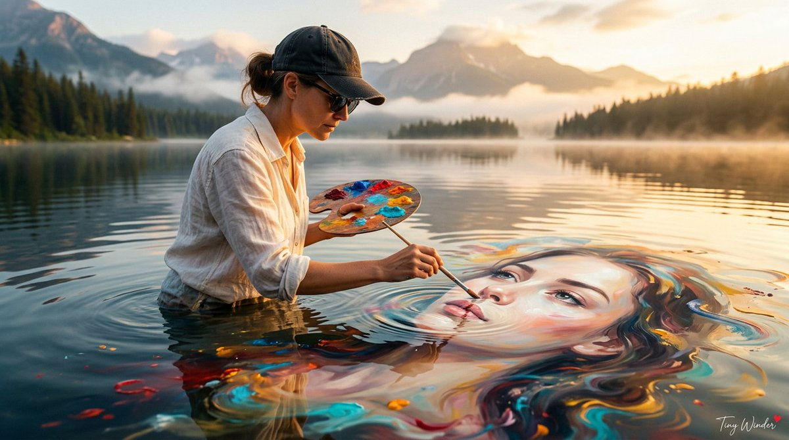

Prompt:

```text
Ultra-realistic IMAX-level Netflix-style cinematic surreal fine-art fantasy portrait,16:9 composition, create a breathtaking golden-hour mountain lake scene where a skilled {argument name="artist" default="female painter"} stands waist-deep in calm reflective water, wearing a {argument name="headwear" default="weathered black cap"}, dark sunglasses and a softly wrinkled {argument name="clothing" default="off-white linen shirt"} with rolled-up sleeves, holding a wooden paint palette filled with vivid colors in one hand while painting with a brush in the other, her face showing deep creative focus, calm intensity and quiet artistic devotion, the most important detail is that the beautiful young woman in the lake must not look like a real person lying under or inside the water, instead her image must look like a large painted portrait created directly on the water surface, like liquid oil paint and artistic pigment floating across the lake as if the water itself has become a living canvas, the painted face appearing as a dreamy artwork with visible painterly brushstroke texture, soft blended pigment edges, fluid color smears, subtle canvas-like artistry and reflective water distortion, while still keeping her facial beauty clear and elegant, her luminous fair porcelain milky-white skin rendered as a painted effect with ultra-smooth clean texture, soft blush tones and graceful artistic highlights, her expressive eyes softly open with a calm emotional gaze, glossy lips relaxed, and her dark hair dissolving into flowing paint swirls and colored reflections rather than realistic wet hair, fix the direction clearly so the woman’s painted face is placed diagonally and horizontally across the lower water area with her forehead and eye area closest to the artist's brush, while her chin and lips extend away from the female painter, making it look visually correct as if she is painting the upper part of the portrait's face on the lake surface, the brush tip should be touching the painted forehead/eye region with realistic circular ripples spreading outward, colorful pigments blooming around the portrait in rich red, blue, orange, yellow, turquoise and white tones, the entire face on the water should feel like a magical water-painting masterpiece, not a submerged human, background featuring misty alpine mountains, pine forest silhouettes, soft golden sunrise sky, glowing sunlight reflecting across the lake, light atmospheric fog, distant birds and dreamy morning haze, cinematic light falling beautifully across the female painter’s face, sleeves, hands, palette and the painted water portrait, creating magical highlights, smooth shadows and rich artistic contrast, ultra-rich color grading with warm amber sunlight, cool reflective lake tones, creamy porcelain painted highlights, vivid floating pigments and cinematic golden mist, captured with a premium cinematic wide portrait lens, HDR lighting, global illumination, photorealistic rendering with a surreal painterly illusion, masterpiece
```

### GPT Image 2 Prompts #91: Social Media Post - Minimalist Streetwear Surreal Portrait

- Category: `Portrait`
- Model: `GPT Image 2`
- Author / Source: [Taaruk](https://github.com/YouMind-OpenLab/awesome-gpt-image-2/blob/main/README.md)
- Image: `assets/imported/YouMind-OpenLab/awesome-gpt-image-2/README-32-Social-Media-Post-Minimalist-Streetwear-Surreal-Portrait.jpg`

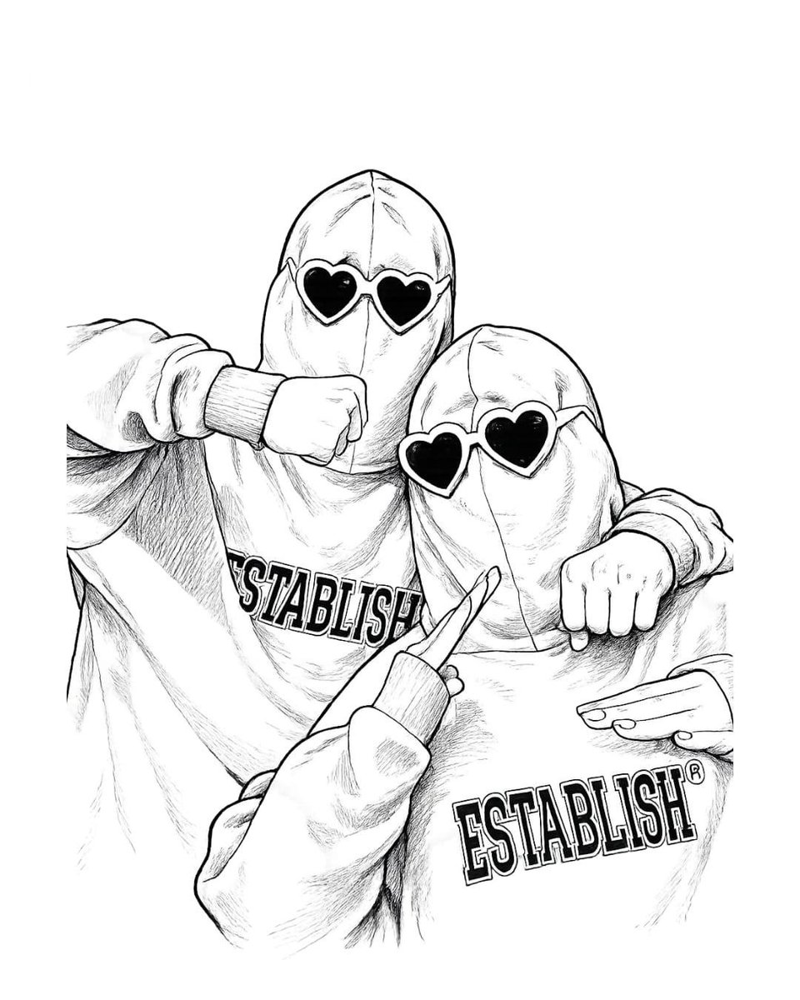

Prompt:

```text
Create a minimalist surreal portrait of two anonymous friends wearing {argument name="hoodie style" default="oversized gray hoodies"} with their heads completely hidden inside the hood, no facial features visible. Both wear {argument name="sunglasses style" default="oversized heart-shaped sunglasses"} with glossy black lenses and {argument name="frame color" default="pastel pink"} frames. One person wraps an arm around the other's shoulder while both make playful hand gestures toward the camera. Their oversized sleeves cover part of their hands, creating a cozy streetwear aesthetic.

Style the image as a clean editorial fashion photo with a soft neutral outdoor background, natural daylight, muted colors, relaxed mood, centered composition, high-end streetwear campaign, minimalist aesthetic, subtle shadows, realistic fabric texture, photorealistic skin on visible hands only, premium hoodie folds, cinematic color grading, ultra-sharp focus, shallow depth of field, Vogue fashion editorial, modern Gen Z aesthetic, luxury street fashion, 85mm lens, f/2.0, HDR, 8K.
```

### GPT Image 2 Prompts #92: Social Media Post - Surreal Light Bulb Business Meeting

- Category: `Portrait`
- Model: `GPT Image 2`
- Author / Source: [雲だからフワフワしてるよwww](https://github.com/YouMind-OpenLab/awesome-gpt-image-2/blob/main/README.md)
- Image: `assets/imported/YouMind-OpenLab/awesome-gpt-image-2/README-33-Social-Media-Post-Surreal-Light-Bulb-Business-Meeting.jpg`

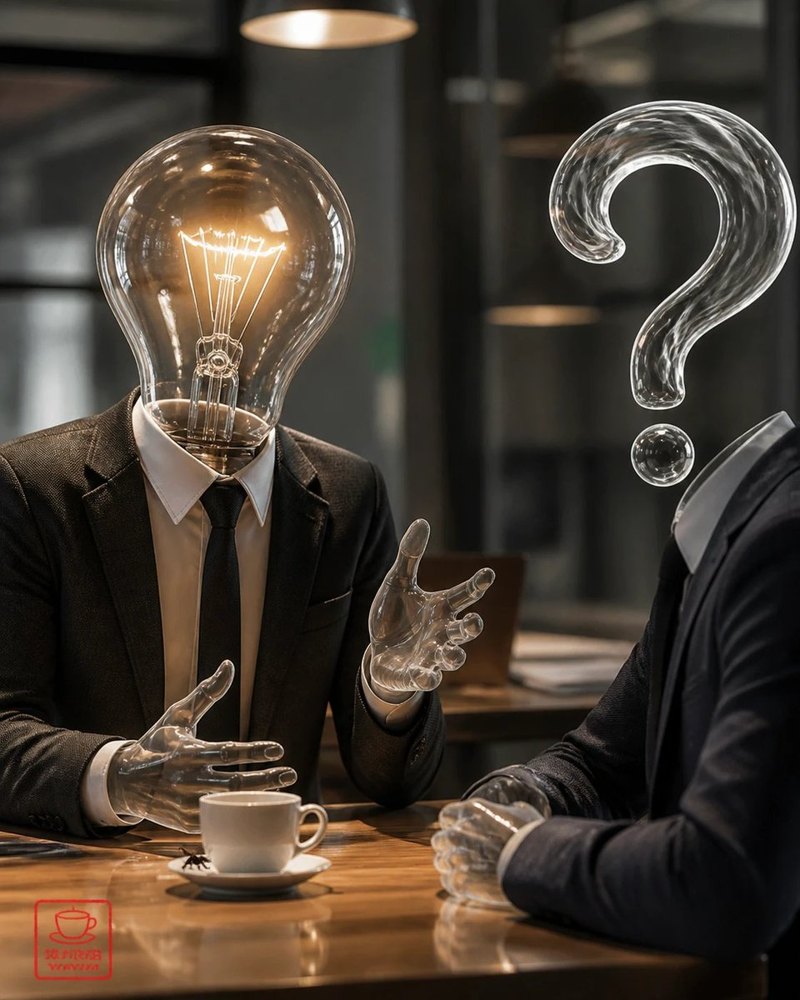

Prompt:

```text
Create a photorealistic surreal business meeting scene in a dim modern cafe or office lounge. Show exactly 2 human figures seated across a polished wooden table: on the left, a person in a dark suit, white shirt, and black tie with a glowing transparent incandescent light bulb for a head, including visible tungsten filament and warm amber light; on the right, a person in a dark suit shown mostly from the side/back with a large transparent glass question mark floating where the head should be, plus a separate small glass dot below it. Both figures have transparent glass-like hands, and the left figure is gesturing mid-conversation while the right figure clasps their hands on the table. Place exactly 1 white coffee cup on exactly 1 white saucer near the center foreground. Include exactly 2 warm pendant lamps visible in the blurred background, glass walls and dark architectural lines, shallow depth of field, cinematic lighting, realistic reflections on the table, high-detail glass refraction, moody corporate atmosphere, 4:5 vertical composition. Add a small red square stamp-like watermark in the lower-left corner with a simple cup icon and tiny unreadable characters. Customize the left figure as {argument name="idea symbol" default="glowing incandescent light bulb head"}, the right figure as {argument name="question symbol" default="transparent glass question mark head"}, the setting as {argument name="meeting location" default="dim modern cafe or office lounge"}, the clothing as {argument name="business attire" default="dark suits with white shirts"}, and the mood as {argument name="visual mood" default="cinematic, thoughtful, mysterious corporate discussion"}.
```

### GPT Image 2 Prompts #93: Social Media Post - Pink Tennis Court Lifestyle Photo

- Category: `Product`
- Model: `GPT Image 2`
- Author / Source: [The Best Designer](https://github.com/YouMind-OpenLab/awesome-gpt-image-2/blob/main/README.md)
- Image: `assets/imported/YouMind-OpenLab/awesome-gpt-image-2/README-34-Social-Media-Post-Pink-Tennis-Court-Lifestyle-Photo.jpg`

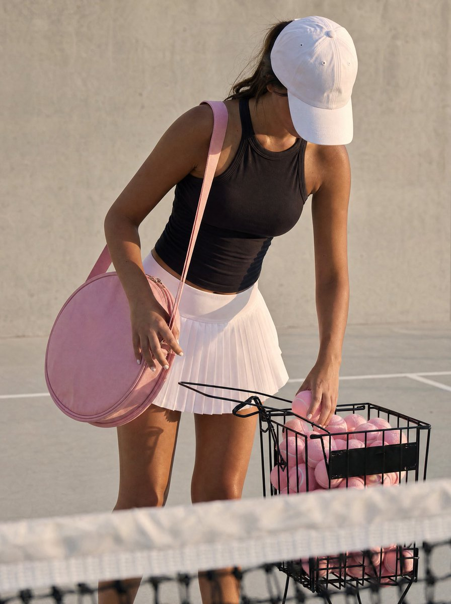

Prompt:

```text
Create a realistic lifestyle sports photograph of a young female tennis player on an outdoor tennis court during warm golden-hour sunlight. She is standing behind a slightly out-of-focus tennis net in the foreground, leaning forward and looking downward so her face is mostly hidden by a {argument name="hat color" default="white"} baseball cap. She has tan skin, dark hair tucked behind the cap, an athletic build, and wears a fitted {argument name="top color" default="black"} sleeveless athletic tank top with a pale pink pleated tennis skirt. A large round pale pink tennis racket bag hangs from her left shoulder, and she is reaching with her right hand into a black wire basket filled with many pale pink tennis balls; one pink ball is held near the top of the basket. The scene should feel candid and editorial, with a beige concrete wall and faint court lines in the background, soft shadows, shallow depth of field, natural skin texture, and no visible text or logos. Use vertical portrait framing, subject cropped around the lower legs, with the basket on the lower right and the round bag on the lower left, emphasizing pastel pink tennis accessories and a fashionable sporty aesthetic.
```

### GPT Image 2 Prompts #94: Social Media Post - Realistic Rookie Nurse Collage

- Category: `Portrait`
- Model: `GPT Image 2`
- Author / Source: [天音りあ⭐️AI美女クリエイター](https://github.com/YouMind-OpenLab/awesome-gpt-image-2/blob/main/README.md)
- Image: `assets/imported/YouMind-OpenLab/awesome-gpt-image-2/README-35-Social-Media-Post-Realistic-Rookie-Nurse-Collage.jpg`

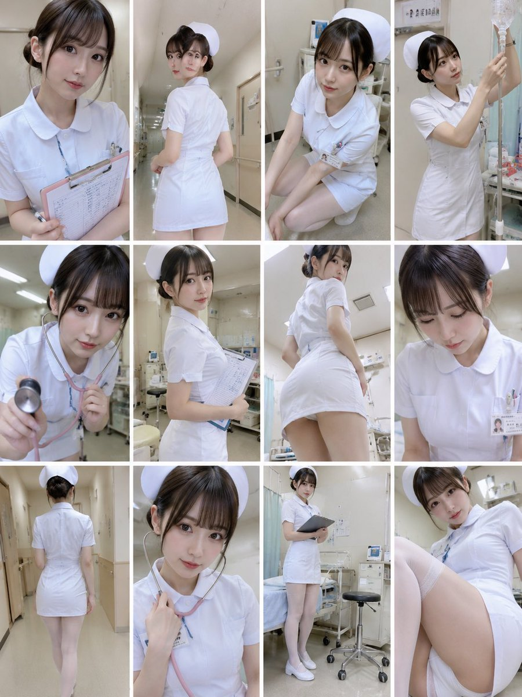

Prompt:

```text
Create a realistic social-media collage of a young Japanese rookie nurse model in a hospital setting, with a natural candid atmosphere rather than a cosplay look. Use a vertical 3:4 canvas arranged as a clean 4-column by 3-row grid, exactly 12 separate photo panels with thin white gutters between them. Subject: {argument name="character description" default="a pretty young Japanese woman in her early 20s with fair skin, large soft eyes, straight dark brown hair with wispy bangs and a low bun"}. Outfit: {argument name="nurse uniform" default="a fitted short-sleeve white nurse dress with rounded collar, white nurse cap, name badge, pens in chest pocket, white stockings, and white nurse shoes"}. Setting: {argument name="hospital location" default="bright Japanese hospital exam rooms and beige clinical corridors"}, with beds, curtains, IV pole, clipboard, medical cart, stool, fluorescent ceiling lights, wall signs, and neutral cream walls. Lighting should be soft fluorescent hospital light with realistic phone-camera quality, slight wide-angle selfies, natural skin texture, and shallow depth where appropriate. The 12 panels must show exactly these distinct scenes: 1) close-up portrait holding a pink clipboard against her chest, looking gently at camera; 2) hallway rear three-quarter view, turning back over her shoulder; 3) crouching or kneeling beside a bed, leaning toward camera; 4) standing at an IV pole and adjusting an infusion bag; 5) close-up using a stethoscope toward the camera; 6) half-body pose holding a clipboard in an exam room; 7) low-angle rear three-quarter view in the exam room; 8) looking downward at chart or badge with calm expression; 9) full-body rear view walking down a corridor; 10) close-up portrait with pink stethoscope around neck, holding the tubing; 11) full-body standing beside a hospital bed and rolling stool holding a dark clipboard; 12) low seated selfie angle with knees in foreground and the nurse looking softly at camera. Composition should feel like a collection of candid behind-the-scenes hospital photos: varied angles, subtle poses, gentle expressions, clean clinical background, no text overlays, no watermark. Keep the image tasteful, realistic, and professional while emphasizing the natural gesture details: {argument name="atmosphere" default="quiet, fresh, rookie nurse, gentle and realistic"}.
```

### GPT Image 2 Prompts #95: Social Media Post - Luxury Lifestyle Villa Photography

- Category: `Product`
- Model: `GPT Image 2`
- Author / Source: [Hope Ai](https://github.com/YouMind-OpenLab/awesome-gpt-image-2/blob/main/README.md)
- Image: `assets/imported/YouMind-OpenLab/awesome-gpt-image-2/README-36-Social-Media-Post-Luxury-Lifestyle-Villa-Photography.jpg`

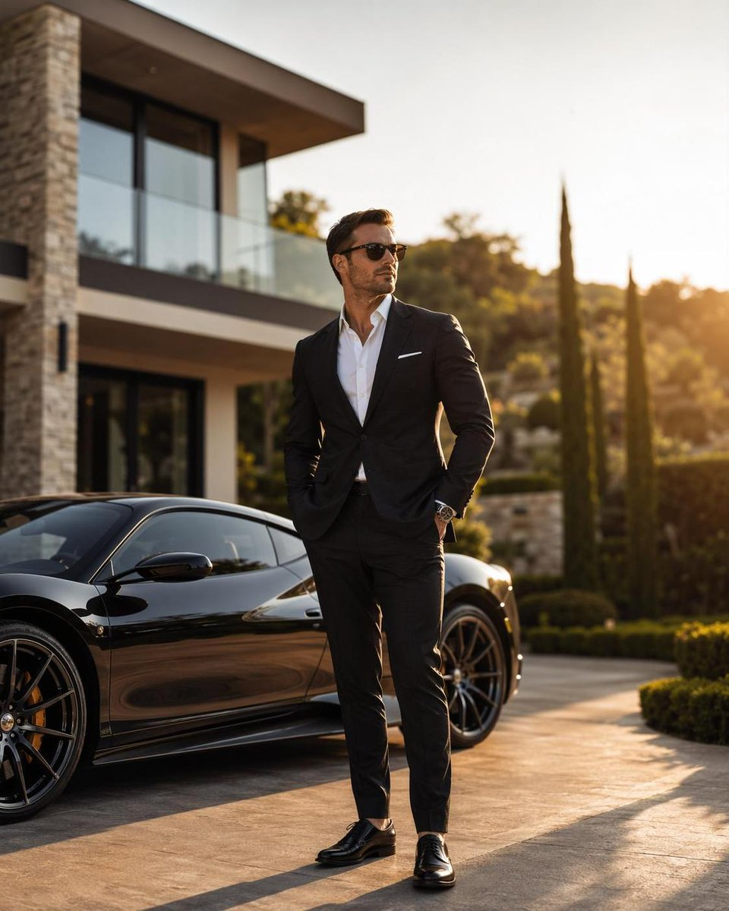

Prompt:

```text
Ultra-realistic lifestyle photography of a confident young man standing outside a luxurious modern villa beside a premium sports car. He is wearing a perfectly tailored suit, an elegant wristwatch, polished shoes, and stylish sunglasses. The background features contemporary architecture, a beautifully landscaped garden, and warm golden-hour sunlight. His posture is confident and relaxed, creating an atmosphere of success and sophistication. Cinematic lighting, premium editorial photography, ultra-detailed, photorealistic, 8K, shallow depth of field, elegant composition, clean negative space for branding or text, portrait aspect ratio 4:5. Ultra-realistic lifestyle photography of a humble young man standing outside a simple brick house in a modest neighborhood. He is wearing clean, simple everyday clothes and comfortable shoes, with a calm, hopeful smile. The surroundings include a bicycle, small plants, and a peaceful residential street in soft morning sunlight. The atmosphere conveys dignity, hard work, resilience, and optimism. Cinematic natural lighting, premium editorial photography, ultra-detailed, photorealistic, 8K, authentic expressions, shallow depth of field, elegant composition, clean negative space for branding or text, portrait aspect ratio 4:5.
```

### GPT Image 2 Prompts #96: Social Media Post - Mixed Media Street Portrait Collage

- Category: `Portrait`
- Model: `GPT Image 2`
- Author / Source: [H A J R A](https://github.com/YouMind-OpenLab/awesome-gpt-image-2/blob/main/README.md)
- Image: `assets/imported/YouMind-OpenLab/awesome-gpt-image-2/README-37-Social-Media-Post-Mixed-Media-Street-Portrait-Collage.jpg`

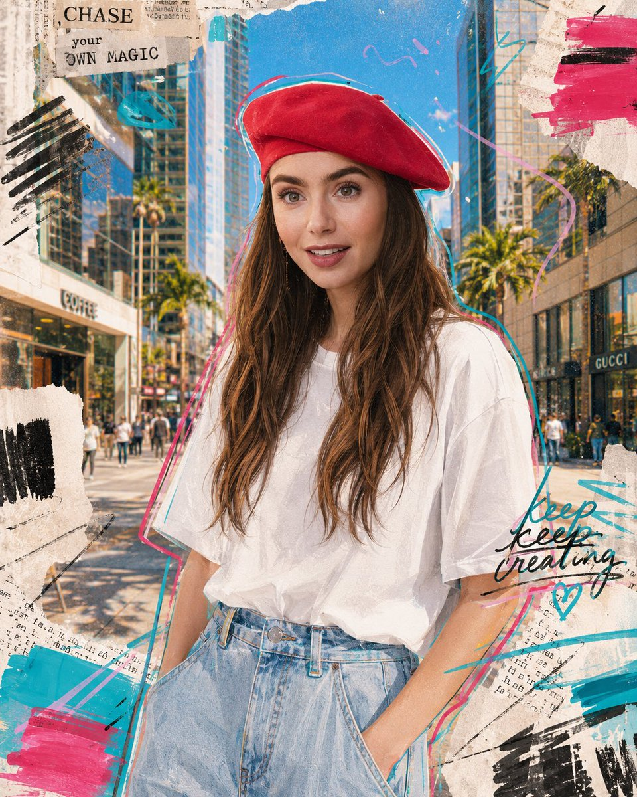

Prompt:

```text
Photorealistic mixed media collage street portrait sketch [OF A PERSON WITH A PHOTO]. Use the uploaded photo as an exact reference for the personality. Fully preserve the face, facial features, skin texture, proportions, hairstyle, and recognizability. Medium close-up, slight low angle, looking straight into the camera, soft smile with closed mouth. Clothing: {argument name="clothing" default="loose white oversize t-shirt"}, tucked into {argument name="bottoms" default="light blue wide-leg high-waisted jeans"}, minimalist gold hoop earrings, concise modern style. Background: {argument name="background" default="modern sunny street of a metropolis"} with futuristic glass buildings, stylish coffee shops, designer boutiques, wide sidewalks, urban greenery, modern architecture, reflections in glass facades, and a rich blue sky. Atmosphere of a warm summer day, lively, airy, and inspiring mood. Strong manual processing in mixed media style: bold drawn contour lines in bright pink and aquamarine colors, emphasizing the silhouette, abstract brush strokes, free marker swirls, semi-transparent torn paper fragments, handwritten strokes, dynamic scribbles, and graphic cutouts. Composition is energetic, yet neat and balanced. Light scanning texture, poster grain, delicate chromatic aberration, slightly frayed collage edges, feeling of a premium printed art poster. The character remains maximally realistic and sharp, while mixed media elements look hand-applied. Mood: modern, stylish, youthful, premium, bright, trendy, and scroll-stopping.
```

### GPT Image 2 Prompts #97: Social Media Post - Night Pool Flash Portrait

- Category: `Product`
- Model: `GPT Image 2`
- Author / Source: [Prompt アトリエ｜AI画像プロンプト](https://github.com/YouMind-OpenLab/awesome-gpt-image-2/blob/main/README.md)
- Image: `assets/imported/YouMind-OpenLab/awesome-gpt-image-2/README-38-Social-Media-Post-Night-Pool-Flash-Portrait.jpg`

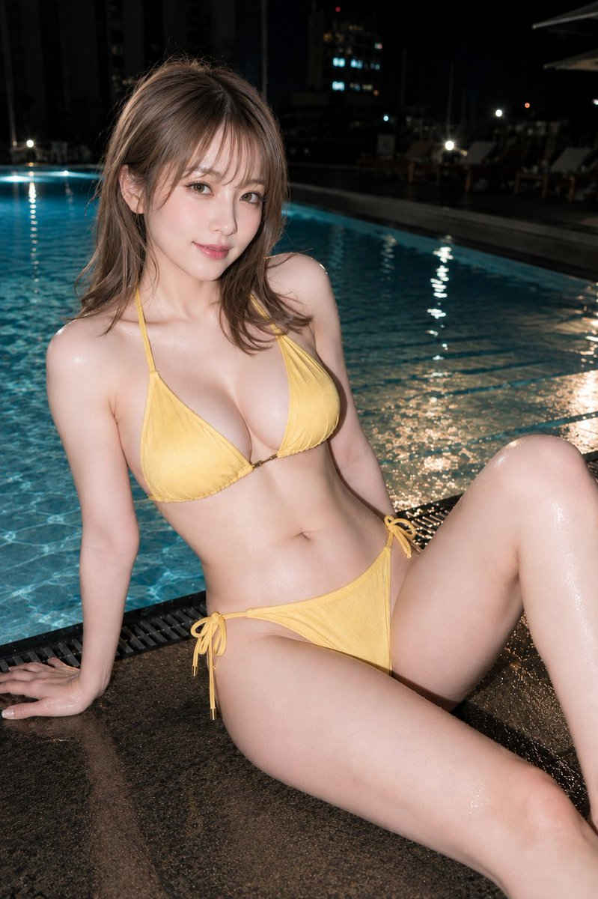

Prompt:

```text
Subject:
{argument name="subject" default="Night pool"}

Person/Expression:
{argument name="person" default="Woman in her 20s"}. Bright ivory-beige toned fair skin with a slight pinkish healthy glow and smooth texture. Soft highlights on the cheeks, tip of the nose, shoulders, and collarbones, retaining natural skin texture rather than excessive skin blurring. Pale rose pink blush, champagne beige and pink-brown eyeshadow, long slender eyelashes, natural tear bags, soft light-brown eyebrows, and sheer pink-beige lip gloss. Small, clear catchlights in the eyes. A calm expression staring quietly at the camera with a slight smile.

Clothing/Pose:
{argument name="clothing" default="Pale lemon yellow halter neck bikini"}. The triangular cups feature a fine woven texture that glimmers subtly under water droplets and the flash. Small metal hardware in the center of the chest, tie strings on the sides of the waist. Sitting on wet black poolside tiles, leaning the upper body slightly back. Placing her left hand on the floor behind her left side, supporting her weight with naturally spread fingers. Dropping the right shoulder slightly and twisting the waist diagonally. The right leg is bent and opened slightly outward, while the other leg is extended diagonally toward the foreground. Creating a natural space between the legs for a relaxed and elegant seated pose.

Background/Light:
An outdoor night pool of a city hotel. Blue pool water spreads from the left to the back, with dark deck chairs, poolside lighting, and blurry skyscraper lights in the background. The floor is wet black tile with detailed reflections of water droplets and lighting. The primary light is a smartphone flash from slightly above the front right of the camera, creating hard white highlights on the face, shoulders, collarbones, arms, and legs. Blue reflected light comes from the left water surface, and weak warm reflected light returns from the floor. The background is darkened, leaving only the soft shimmer of the water surface.

Composition/Camera:
Vertical composition. A close-up portrait showing from above the knees to the head. The person is slightly left of the center, the face is near the upper third division, and the legs enter significantly into the foreground to create natural perspective. The camera looks down slightly from a position a bit higher than the subject, with a distance like a close-range smartphone shot. Focus on the eyes, with the background pool and night view softly blurred. Vividly depicts skin, hair, water droplets, and tile reflections.

Texture/Style:
Realistic photo-style AI image. Carefully expresses direct light typical of night smartphone flash photography, dark backgrounds, natural reflections on wet skin, blue pool light, and water droplets on black tiles. Hair is light milk tea ash brown. Thin see-through bangs, layer cut along the face, medium-long length to below the shoulders. Hair ends are loosely curled inward, with a fluffy feel and natural bundles. Depicts individual hair strands, fine highlights, soft shine, and a small amount of natural loose hairs.

Negative:
Expressions looking underage, faces that are too young, excessive sexual emphasis, vulgar poses, see-through swimwear, clothing glitches, unnatural faces or gazes, excessive skin correction, plastic-like skin, extra or missing fingers, fused limbs, broken joints, poor contact with the floor, floating, unnatural gravity, incorrect perspective, shadows inconsistent with light sources, unnecessary people or objects, garbled text, logos, watermarks.
```

### GPT Image 2 Prompts #98: Social Media Post - Queen Reclining With Silver Serpent

- Category: `Portrait`
- Model: `GPT Image 2`
- Author / Source: [カーブミラー](https://github.com/YouMind-OpenLab/awesome-gpt-image-2/blob/main/README.md)
- Image: `assets/imported/YouMind-OpenLab/awesome-gpt-image-2/README-39-Social-Media-Post-Queen-Reclining-With-Silver-Serpent.jpg`

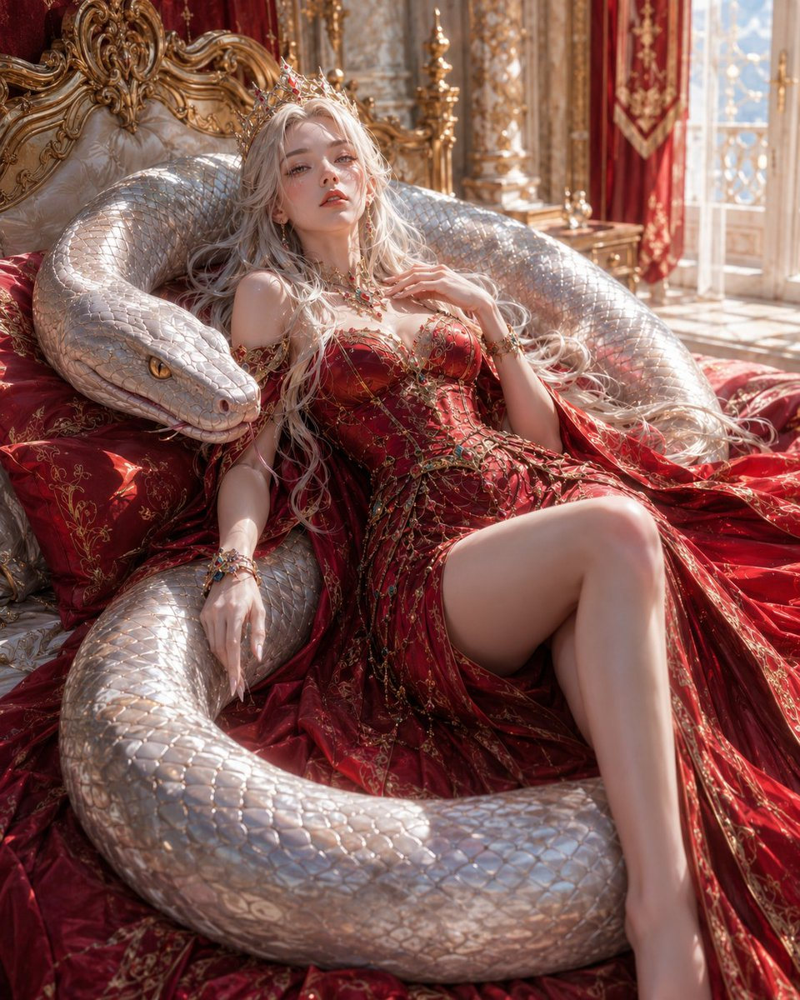

Prompt:

```text
Create a luxurious fantasy portrait of {argument name="character name" default="the Queen and the Serpent"}: a beautiful pale-skinned young queen reclining on an ornate gilded baroque bed inside a sunlit royal palace chamber, embraced by one enormous silver-white serpent coiled around her body like a protective throne. The queen has {argument name="hair color" default="very long platinum-blonde hair"} flowing across red silk bedding, a delicate jeweled crown, soft regal makeup, and a languid, confident expression while gazing toward the viewer. She wears a deep crimson off-shoulder corset gown with intricate gold embroidery, beaded chains, gemstones, bracelets, and a dramatic slit revealing one bare leg; the fabric spreads across the bed in rich folds. The serpent has pearlescent metallic scales, a massive calm head resting beside her shoulder on the left, visible golden eyes, and a thick body forming one large coil around the foreground. Set the scene in an opulent palace bedroom with carved gold headboard, red velvet pillows, brocade curtains, marble columns, tall bright windows, and warm morning sunlight casting sparkling highlights across scales, jewelry, and fabric. Style: ultra-detailed cinematic fantasy realism, elegant and sensual but non-explicit, high-fashion editorial composition, soft volumetric light, shallow depth of field, 3:4 vertical frame, crisp textures, no text, no watermark, no extra limbs, no distorted anatomy.
```

### GPT Image 2 Prompts #99: Social Media Post - Anime Girl Under Meteor Starry Sky

- Category: `Portrait`
- Model: `GPT Image 2`
- Author / Source: [臥床居士](https://github.com/YouMind-OpenLab/awesome-gpt-image-2/blob/main/README.md)
- Image: `assets/imported/YouMind-OpenLab/awesome-gpt-image-2/README-40-Social-Media-Post-Anime-Girl-Under-Meteor-Starry-Sky.jpg`

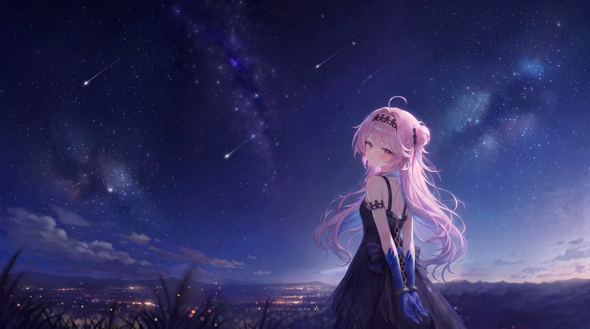

Prompt:

```text
Create a wide cinematic anime nightscape in a 16:9 aspect ratio. A single young anime girl stands in the right third of the frame on a dark grassy hillside, shown from about mid-thigh up with her back partly turned and her face looking over her shoulder toward the viewer. She has very long flowing {argument name="hair color" default="pastel pink"} hair, soft amber-pink eyes, a small shy smile, a curled ahoge strand, and a side bun tied near the back. She wears a dark gothic sleeveless dress in deep navy-black with thin straps, chain details down the back, black lace-like bands on her upper arms and hair, and long glossy {argument name="glove color" default="royal blue"} opera gloves. The scene is illuminated by cool moonlight and faint violet rim light, giving her hair a luminous translucent glow. Behind her is an expansive starry sky over distant mountain silhouettes and a valley with tiny warm city lights. The sky should be the main subject: deep indigo-to-blue gradient, dense scattered stars, visible Milky Way-like nebula clouds in purple and cyan, and exactly 4 visible shooting stars: one bright diagonal meteor on the upper left, one bright diagonal meteor near the upper center, one faint diagonal meteor near the upper right-center, and one bright diagonal meteor left of the character near mid-sky. Foreground includes out-of-focus dark grass silhouettes along the bottom edge, with atmospheric depth and a subtle bokeh effect from the distant lights. Use highly polished anime illustration style blended with astrophotography-inspired realism, soft glow, delicate linework, rich contrast, dreamy romantic mood, and no text, watermark, borders, or extra characters. Customize the setting as {argument name="location mood" default="quiet mountain overlook above a distant valley"} and the overall color palette as {argument name="night sky palette" default="deep indigo, violet, cyan, and pale lavender"}.
```

### GPT Image 2 Prompts #100: Social Media Post - Cinematic Night Portrait at Coin Laundry

- Category: `Product`
- Model: `GPT Image 2`
- Author / Source: [Prompt アトリエ｜AI画像プロンプト](https://github.com/YouMind-OpenLab/awesome-gpt-image-2/blob/main/README.md)
- Image: `assets/imported/YouMind-OpenLab/awesome-gpt-image-2/README-41-Social-Media-Post-Cinematic-Night-Portrait-at-Coin-Laundry.jpg`

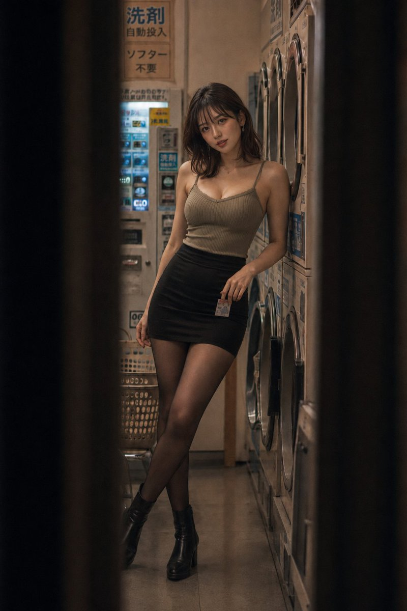

Prompt:

```text
Subject:
{argument name="subject" default="Waiting for laundry at night"}

Character and Expression:
{argument name="character description" default="A 20-year-old woman"}. Slender model figure, healthy and feminine silhouette. Refined and cute facial features, round small face, natural double eyelids, clear eyes, small nose, soft mouth. Dark brown shoulder-length hair with loose outward flips and light waves, transparent bangs. Makeup is clear Japanese-style, light rose blush, pink-beige lips, subtle eye bags, long thin lashes. Expression is quiet with a slight smile, looking directly at the camera.

Clothing and Pose:
Upper body wearing {argument name="clothing" default="only a khaki beige fine-rib camisole"}. Lower body in a black high-waisted hip-hugging mini skirt, black sheer stockings, black short boots. Small earrings and a thin necklace. Right shoulder and back leaning lightly against the washing machine on the right, hips tilted slightly. Her right hand pinches a laundry card and hangs naturally by the side of the skirt. Her left hand is relaxed by her thigh. Legs lightly crossed, weight on the right leg. Natural depiction of clothing wrinkles, shoulder straps, fingers, and feet touching the ground.

Background and Lighting:
Laundromat at night. Stacked drum-type washing machines on the right, detergent vending machine and old signs in the back, laundry basket on the floor. Black door frames or walls in the left and right foreground are heavily blurred to create a voyeuristic, peeking-through-a-gap space. Fluorescent ceiling lights from the upper left hit at an angle, softly illuminating the face, collarbones, shoulders, and camisole texture. Shadows fall to the bottom right and background. Weak reflections on the metal surfaces of the machines, pale blue small lights from the vending machine. Japanese text in the background as natural environmental text, details not too legible.

Composition and Camera:
Vertical 3:4. Full-body portrait. Person slightly to the right of center, full body occupies about 70% of the screen. Boldly hide sides with black vertical frames in the foreground, creating a narrow visual path in the center. Camera height slightly lower than chest level, light eye-level shot. Compression feel like a medium telephoto lens, background shallowly blurred. Focus on eyes, feet and machines in the back slightly softened.

Texture and Style:
Realistic photographic style. Night low-light snapshot, 35mm film-like grain, slightly warm fluorescent lights, deep shadows, skin left with natural texture without over-polishing. Tonal consistency with beige, black, muted green, and pale blue mechanical light. Not like a magazine photo, but a quiet documentary feel of a candid shot.

Negative:
Unnatural face or gaze, overly large eyes, too sharp chin, extra or missing fingers, fused limbs, broken joints, poor contact with card, floating feet, unnatural gravity, distorted washing machine doors, incorrect perspective, shadows inconsistent with light source, excessive skin retouching, plastic-looking skin, overexposure, unnecessary people, legible brand logos, garbled text, watermarks, excessive AI feel.
```

### GPT Image 2 Prompts #101: Social Media Post - Izakaya Night Profile Portrait

- Category: `Product`
- Model: `GPT Image 2`
- Author / Source: [Prompt アトリエ｜AI画像プロンプト](https://github.com/YouMind-OpenLab/awesome-gpt-image-2/blob/main/README.md)
- Image: `assets/imported/YouMind-OpenLab/awesome-gpt-image-2/README-42-Social-Media-Post-Izakaya-Night-Profile-Portrait.jpg`

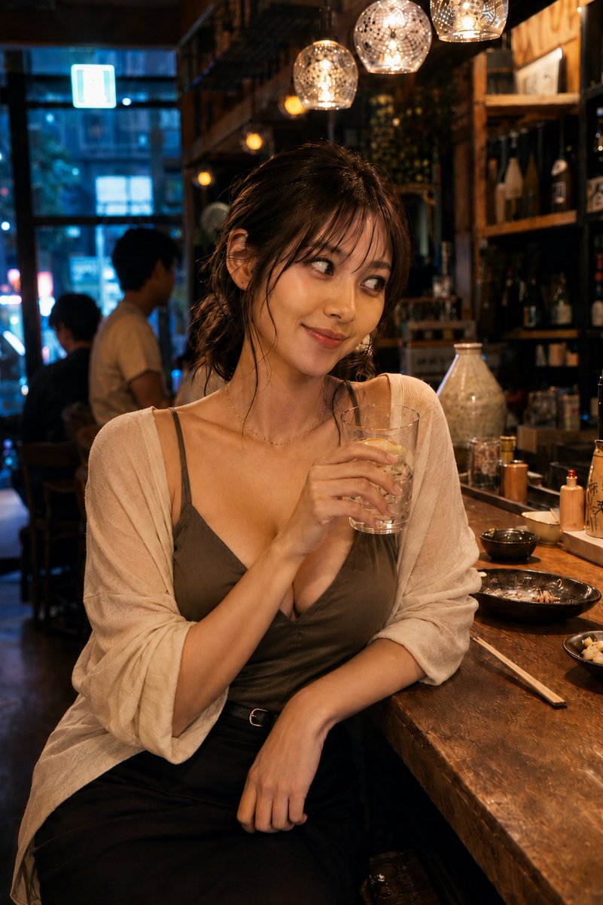

Prompt:

```text
Subject: {argument name="subject" default="Profile in the light"}

Character and Expression:
A woman in her 20s. Fair skin leaning towards bright ivory-beige, with a smooth texture containing a hint of pink. Soft highlights on cheeks, nose tip, shoulders, and collarbones, with a delicate texture that retains natural skin grain rather than excessive airbrushing. Makeup is precise and elegant, doll-like Japanese style. Pale rose pink blush, champagne beige and pink-brown eyeshadow, long thin lashes, natural eye bags, soft light brown eyebrows, transparent pink-beige gloss lips. Small clear catchlights in the eyes. Features are mature and natural, with a slightly playful and mischievous expression. Head tilted slightly, eyes glancing to the side, showing an exquisite sense of playfulness.

Clothing and Pose:
{argument name="clothing" default="Dark olive brown satin-style camisole top"} or thin-strap dress, with a thin ivory sheer wrap loosely draped over the shoulders. Natural chest curves that are subtly visible, creating a mature feminine silhouette. Bottoms are black high-waisted with a slim silhouette. Hair is dark brown in a low loose bun, with thin loose strands around the face and light airy bangs. Sitting diagonally at a wooden counter, holding a {argument name="beverage" default="highball glass with lemon"} near the chest with the right hand. Left arm rests lightly on the counter, left hand relaxed on the lap.

Background and Lighting:
Izakaya at night. Warm wooden counter, shelves lined with sake bottles, a deep interior, hanging glass lamps, large windows near the entrance, and blurred seating in the back. The main light source is a warm pendant light above, gently illuminating the upper face, cheeks, nose bridge, shoulders, and collarbones. A faint blue night light peeks through the window, creating depth through contrast with the warm interior. Background figures and tableware are blurred, suppressing them enough to feel the bustle without distracting from the subject. Wooden reflections wrap gently around the skin, creating the warmth of an izakaya and the lingering feeling of the night.

Composition and Camera:
Vertical portrait. Subject placed slightly left of center, a medium shot including up to the upper thighs. Camera at eye level, an intimate conversation distance. Natural field of view around 50mm. Focus on the face and glass, with a soft background blur. The flow of the wooden counter from the bottom right shows depth, naturally conveying the izakaya's atmosphere. A calm yet alluring composition where the upper body is the star.

Texture and Style:
High-quality Japanese photographic style. Realistic skin texture, delicate shadows, natural hair strands, glass transparency, and careful depiction of wood, fabric, and satin materials. Tone is based on warm amber, mixed with a little blue night light for a calm tone. An elegant izakaya portrait with a sense of daily life, atmosphere, and narrative space. Avoid excessive HDR, excessive sharpness, or artificial glowing effects.

Negative:
Infantilization, appearing underage, unnatural face or gaze, collapsed expression, extra or missing fingers, fused limbs, joint failure, poor glass contact, unnatural gravity, excessive exposure, vulgar chest emphasis, plastic-like skin, excessive skin correction, extreme smoothing, excessive HDR, excessive sharpness, legible background text, logos, watermarks, cheap influencer style, unnecessary prominent people, obvious AI feel.
```

### GPT Image 2 Prompts #102: Social Media Post - Luxury Lifestyle Fashion Portrait

- Category: `Portrait`
- Model: `GPT Image 2`
- Author / Source: [auqib](https://github.com/YouMind-OpenLab/awesome-gpt-image-2/blob/main/README.md)
- Image: `assets/imported/YouMind-OpenLab/awesome-gpt-image-2/README-43-Social-Media-Post-Luxury-Lifestyle-Fashion-Portrait.jpg`

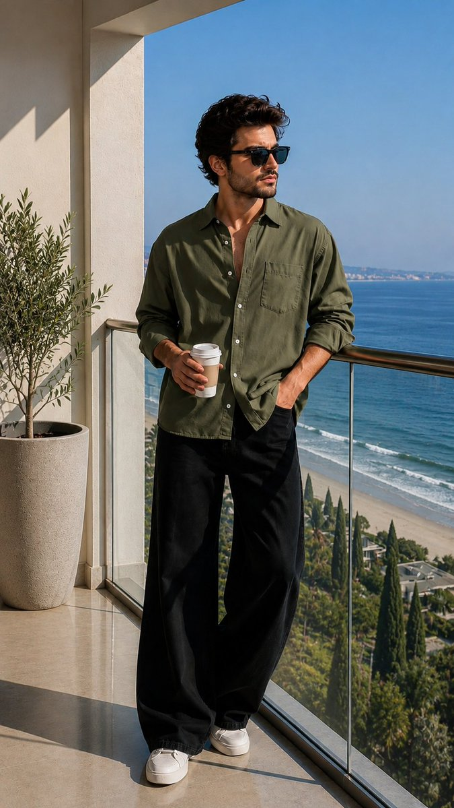

Prompt:

```text
Ultra-realistic luxury lifestyle fashion portrait of a handsome young man standing on a modern oceanfront balcony during bright morning sunlight. He is wearing an {argument name="shirt color" default="olive-green"} linen button-down shirt with sleeves casually rolled up, {argument name="trousers" default="oversized black wide-leg trousers"}, white minimalist sneakers, and premium black sunglasses. He holds a takeaway coffee cup in one hand while the other hand rests in his pocket.

The balcony features elegant cream-colored architecture, polished marble flooring, a glass railing, and a tall potted olive tree beside him. Behind him is a breathtaking panoramic coastline with deep blue ocean water, sandy beach, gentle waves, and lush greenery below. Clear blue sky with no clouds.

Full-body composition, relaxed confident pose, looking away from the camera toward the horizon, luxury vacation aesthetic, old-money style, quiet luxury fashion campaign, natural sunlight casting soft shadows, crisp details, realistic skin texture, high-end editorial photography, travel magazine cover quality.

Shot on a full-frame camera, 85mm lens, f/2.8, ISO 100, HDR, ultra-sharp focus, cinematic color grading, realistic reflections on glass railing, depth and perspective preserved, professional fashion photography, 8K resolution, photorealistic, Instagram luxury influencer style.
```

### GPT Image 2 Prompts #103: Social Media Post - Ornate Chinese Festival Portrait

- Category: `Product`
- Model: `GPT Image 2`
- Author / Source: [COCO椰菜](https://github.com/YouMind-OpenLab/awesome-gpt-image-2/blob/main/README.md)
- Image: `assets/imported/YouMind-OpenLab/awesome-gpt-image-2/README-44-Social-Media-Post-Ornate-Chinese-Festival-Portrait.jpg`

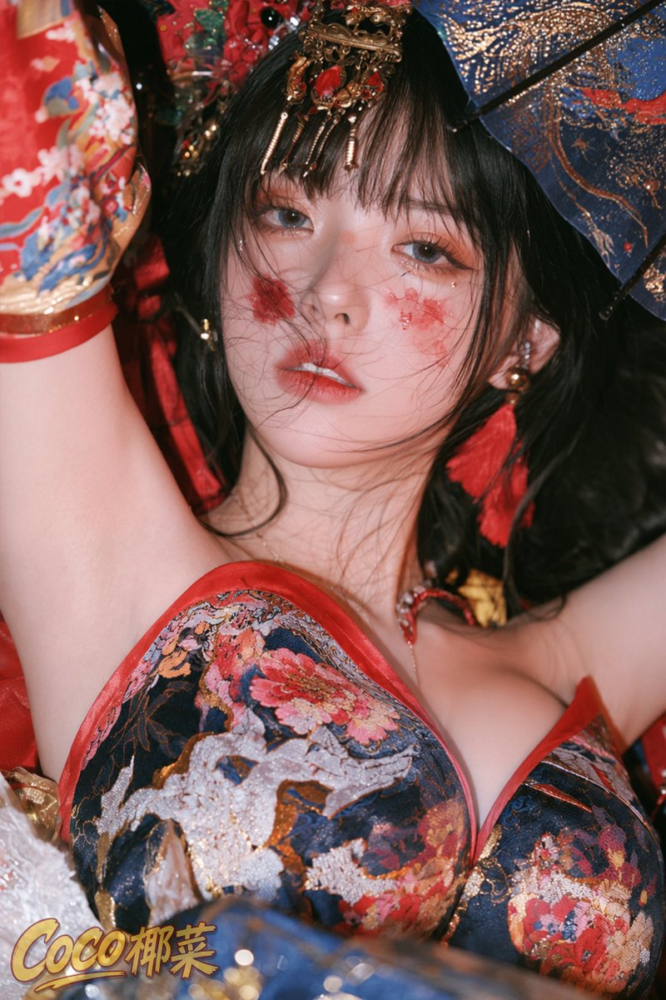

Prompt:

```text
Create a highly polished vertical close-up fashion portrait of an adult East Asian woman in ornate Chinese opera / fantasy festival styling, viewed from slightly below with her face centered and her two arms raised above her head. She has {argument name="hair color" default="long black hair"} with loose windblown strands crossing her face, pale luminous skin, soft blue-gray eyes, glossy red lips slightly parted, and a dreamy calm expression. Add exactly two red painterly floral smudges on her cheeks, one on each cheek, with tiny rhinestone-like highlights near the eyes. She wears one elaborate gold-and-red jeweled headpiece with dangling tassels across her bangs, red tassel earrings, and a richly embroidered navy, red, and gold floral bodice with red trim. Include one ornate blue parasol in the upper right background with gold speckled patterning, plus red embroidered fabric and floral brocade filling the left and rear background. Use dramatic flash photography, shallow depth of field, high-fashion editorial realism, crisp facial detail, glossy textures, saturated reds and deep blues, cinematic close crop, soft skin retouching, and a luxurious festive atmosphere. Add one stylized logo watermark at the bottom left reading {argument name="logo text" default="Coco椰菜"} in gold-yellow script with a dark outline. Keep the image vertical, intimate, glamorous, and photorealistic; avoid distorted anatomy, extra fingers, duplicated faces, or messy unreadable ornamentation.
```

### GPT Image 2 Prompts #104: Infographic / Edu Visual - Fantasy RPG Region Map Sheet

- Category: `Product`
- Model: `GPT Image 2`
- Author / Source: [Magali Saucedo](https://github.com/YouMind-OpenLab/awesome-gpt-image-2/blob/main/README.md)
- Image: `assets/imported/YouMind-OpenLab/awesome-gpt-image-2/README-45-Infographic-Edu-Visual-Fantasy-RPG-Region-Map-Sheet.jpg`

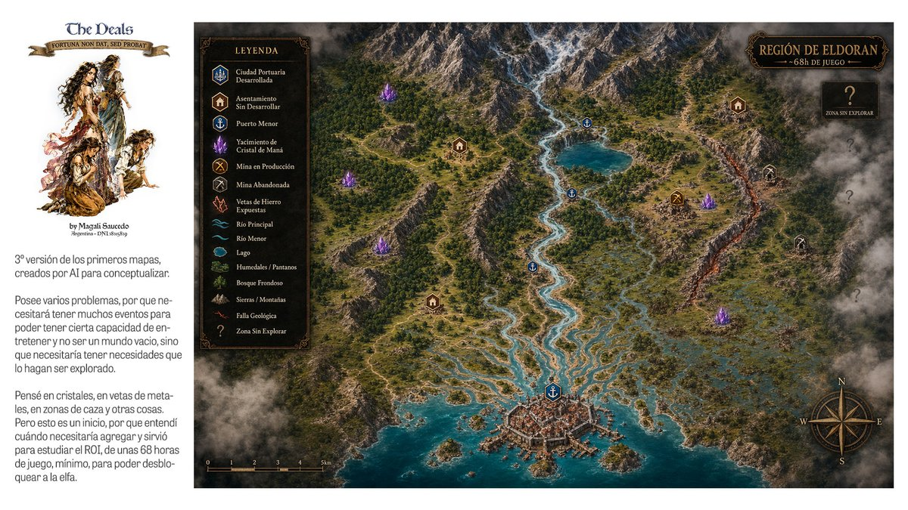

Prompt:

```text
Goal: Create a wide fantasy worldbuilding presentation sheet for an open-world RPG region, combining a left editorial note panel and a large illustrated top-down map.

Canvas: 16:9 horizontal image, clean white background. The left 20% is a white sidebar; the right 80% is a detailed parchment-dark fantasy map framed edge-to-edge.

Left sidebar: At the top, place the logo text {argument name="project title" default="The Deals"} in a medieval serif font, with a small ribbon beneath reading {argument name="motto text" default="FORTUNA NON DAT, SED PROBAT"}. Under it, add a painterly fantasy character cluster: exactly 4 ragged adventurer/elf-like figures in sepia watercolor, arranged vertically. Below the illustration add a small byline. Then add two Spanish explanatory paragraphs in a narrow column, modern sans-serif, dark gray, resembling a design note about a third version of early AI concept maps, gameplay events, crystals, ore veins, hunting zones, and needing about 68 hours of gameplay.

Main map: An isometric/top-down high-detail fantasy region map titled {argument name="region title" default="REGIÓN DE ELDORAN"} with subtitle {argument name="subtitle" default="~68h DE JUEGO"} in an ornate dark plaque at the top right. The region has a snowy mountain range across the top, dense green forests, winding rivers, a turquoise lake, wetlands and marshes on the right, rocky hills, a glowing orange geological fault running vertically near the right side, and a fortified harbor city at the bottom center opening into a teal sea with small islands and docks. Use dramatic clouds and fog around the edges, especially the bottom left and right border, for an unexplored-map feeling.

Legend: Add a dark rectangular ornate legend box near the upper left of the map titled “LEYENDA”. It must contain exactly 15 labeled rows with small icons: 1 Ciudad Portuaria Desarrollada, 2 Asentamiento Sin Desarrollar, 3 Puerto Menor, 4 Yacimiento de Cristal de Maná, 5 Mina en Producción, 6 Mina Abandonada, 7 Vetas de Hierro Expuestas, 8 Río Principal, 9 Río Menor, 10 Lago, 11 Humedales / Pantanos, 12 Bosque Frondoso, 13 Sierras / Montañas, 14 Falla Geológica, 15 Zona Sin Explorar.

Map markers: Place exactly 1 developed port city marker at the bottom city, exactly 4 minor port anchor markers along rivers/lake/coast, exactly 4 settlement house markers, exactly 5 glowing purple mana crystal clusters, exactly 1 active mine marker, exactly 2 abandoned mine markers, and exactly 4 large question marks in smoky unexplored zones on the right side. Keep marker colors consistent with the legend: blue for ports/water, brown for settlements, purple for crystals, gold for active mine, gray for abandoned mine, red/orange for fault.

Extra map details: Add a compass rose at the bottom right with N, E, S, W letters; add a small black scale bar at the bottom left marked from 0 to 5 km; use thin roads and trails connecting settlements, mines, ports, and the main city. The map should feel like a polished game-design concept board, with realistic terrain textures, ornate fantasy UI frames, warm gold typography, and no modern UI elements.

Constraints: Preserve the Spanish labels and medieval-fantasy atmosphere. Do not add extra legend categories, extra character figures, or extra major title plaques. Keep the composition clean and readable at presentation size.
```

### GPT Image 2 Prompts #105: Infographic / Edu Visual - Dark Mode Dictionary Entry App

- Category: `Product`
- Model: `GPT Image 2`
- Author / Source: [Akira](https://github.com/YouMind-OpenLab/awesome-gpt-image-2/blob/main/README.md)
- Image: `assets/imported/YouMind-OpenLab/awesome-gpt-image-2/README-46-Infographic-Edu-Visual-Dark-Mode-Dictionary-Entry-App.jpg`

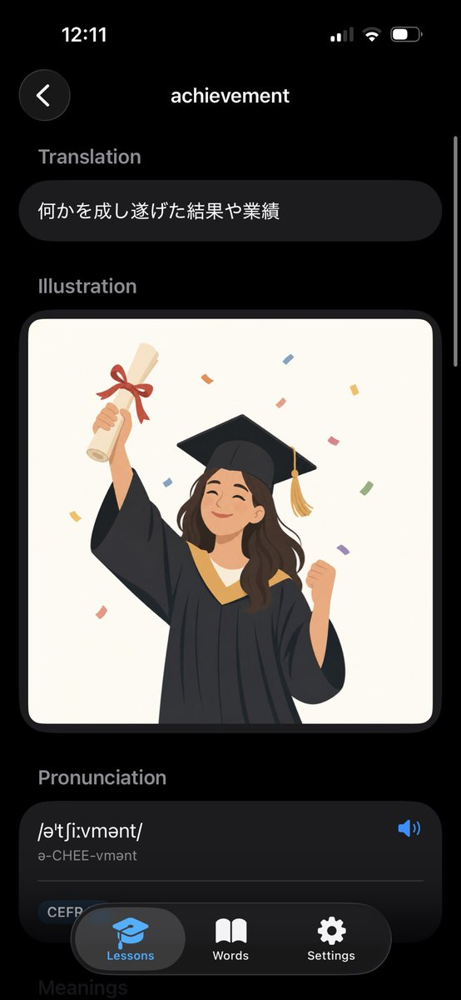

Prompt:

```text
Goal: Create a realistic iPhone screenshot of a sleek dark-mode English dictionary/vocabulary learning app showing the entry for {argument name="word" default="achievement"}.

Canvas: Vertical smartphone screen, 9:16 aspect ratio, black background, iOS-style status bar at the top showing 12:11 on the left and cellular/Wi‑Fi/battery icons on the right. Use rounded cards, soft shadows, and a modern minimal UI.

Layout: Top navigation has exactly 2 elements: a circular dark back button with a white left chevron on the upper left, and the centered page title “achievement” in white. A thin vertical scroll indicator appears along the right edge.

Sections: Show exactly 4 visible content sections in this order: 1) Translation, 2) Illustration, 3) Pronunciation, 4) a partially visible Meanings header at the bottom. Section labels are muted gray, bold, and left aligned.

Text content: Under “Translation,” place one rounded dark pill card containing the Japanese text {argument name="translation text" default="何かを成し遂げた結果や業績"}. Under “Pronunciation,” create one large rounded dark card with the phonetic spelling {argument name="phonetic text" default="/əˈtʃiːvmənt/"}, the readable pronunciation “ə-CHEE-vmənt,” a blue speaker icon on the right, a thin divider line, and a small rounded “CEFR” tag near the lower left.

Illustration: In the Illustration section, place one large rounded rectangle image card with an off-white background. Inside it, draw a cheerful young graduate woman in a black graduation gown and mortarboard with a gold tassel, smiling with eyes closed. She raises a rolled diploma tied with a red ribbon in her left hand and clenches her right fist in celebration. Add colorful rectangular confetti around her. Use a flat vector illustration style, warm colors, clean edges, and no text inside the illustration.

Bottom navigation: Overlay a floating rounded black tab bar at the bottom with exactly 3 tabs: “Lessons” with a blue graduation-cap icon and highlighted gray pill background, “Words” with a white open-book icon, and “Settings” with a white gear icon. The tab bar partially covers the pronunciation card and the faint “Meanings” header.

Visual style: High-fidelity mobile app mockup, dark theme, iOS proportions, rounded corners, subtle gradients, white and gray typography, blue accent color, polished product screenshot. Avoid extra words, extra icons, watermarks, or browser chrome.
```

### GPT Image 2 Prompts #106: Infographic / Edu Visual - Pretzel Maker Storyboard Poster

- Category: `Product`
- Model: `GPT Image 2`
- Author / Source: [GPTProto Official](https://github.com/YouMind-OpenLab/awesome-gpt-image-2/blob/main/README.md)
- Image: `assets/imported/YouMind-OpenLab/awesome-gpt-image-2/README-47-Infographic-Edu-Visual-Pretzel-Maker-Storyboard-Poster.jpg`

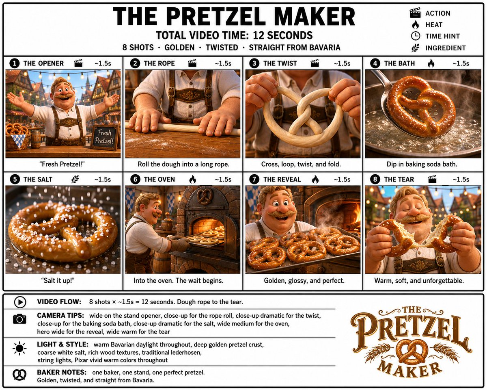

Prompt:

```text
Goal: Create a crisp, clean infographic storyboard poster for {argument name="story title" default="THE PRETZEL MAKER"}, showing a premium Pixar-like 3D animated food-making sequence with a cheerful Bavarian baker and golden pretzels.

Canvas: Wide 16:9 poster on a white background with thick black outer border, black grid lines, bold black typography, and a polished storyboard/production-board layout. Use bright vivid colors, warm Bavarian daylight, cozy tavern and bakery interiors, deep golden-brown pretzel crust, glossy highlights, coarse white salt, rich wooden textures, traditional lederhosen, string lights, and shallow cinematic depth of field.

Header: Large centered headline “THE PRETZEL MAKER”. Under it, centered text “TOTAL VIDEO TIME: 12 SECONDS”. Beneath that, smaller line: “8 SHOTS · GOLDEN · TWISTED · STRAIGHT FROM BAVARIA”. Top-right legend with 4 black icons and labels: clapperboard “ACTION”, flame “HEAT”, clock “TIME HINT”, wheat stalk “INGREDIENT”.

Main layout: Use exactly 8 storyboard panels arranged in a 2-row by 4-column grid. Each panel has a black numbered circle at top-left, an uppercase shot title, a small relevant icon, and “~1.5s” at the top-right. Each panel contains a cinematic 3D render and a short caption below the image.

Storyboard panels, exactly 8:
1. “THE OPENER” with clapperboard icon, ~1.5s: a jolly mustached Bavarian baker in lederhosen stands in a festive village market or beer-hall street with arms wide open, smiling at the viewer; baskets of pretzels and a small chalkboard reading “Fresh Pretzel!” are visible. Caption: “Fresh Pretzel!”
2. “THE ROPE” with clapperboard icon, ~1.5s: close-up of the baker’s hands rolling dough on a floured wooden table into a long rope, apron and suspenders visible in the background. Caption: “Roll the dough into a long rope.”
3. “THE TWIST” with clapperboard icon, ~1.5s: close-up of hands holding pale dough, crossing and looping it into the classic pretzel shape. Caption: “Cross, loop, twist, and fold.”
4. “THE BATH” with flame icon, ~1.5s: a shaped pretzel is dipped in a bubbling baking soda bath in a metal pan, steam rising dramatically. Caption: “Dip in baking soda bath.”
5. “THE SALT” with wheat/ingredient icon, ~1.5s: extreme close-up of a glossy pretzel covered with coarse white salt crystals falling through the air. Caption: “Salt it up!”
6. “THE OVEN” with flame icon, ~1.5s: the baker slides a tray of pretzels into a rustic brick oven glowing orange. Caption: “Into the oven. The wait begins.”
7. “THE REVEAL” with flame icon, ~1.5s: the happy baker presents a tray full of freshly baked glossy golden pretzels in front of a warm oven, steam and shine visible. Caption: “Golden, glossy, and perfect.”
8. “THE TEAR” with clapperboard icon, ~1.5s: close-up hero shot of the baker joyfully tearing open a warm pretzel, soft interior stretching, eyes closed in delight. Caption: “Warm, soft, and unforgettable.”

Bottom information band: Add a bordered notes area spanning the width below the panels. Left side contains exactly 4 horizontal note rows with black icons and bold labels:
1. Play icon, “VIDEO FLOW:” followed by “8 shots × ~1.5s = 12 seconds. Dough rope to the tear.”
2. Camera icon, “CAMERA TIPS:” followed by “wide on the stand opener, close-up for the rope roll, close-up dramatic for the twist, wide medium for the bath, close-up dramatic for the salt, wide medium for the oven, hero wide for the reveal, wide warm for the tear”
3. Sun/light icon, “LIGHT & STYLE:” followed by “warm Bavarian daylight throughout, deep golden pretzel crust, coarse white salt, rich wood textures, traditional lederhosen, string lights, Pixar vivid warm colors throughout”
4. Pretzel icon, “BAKER NOTES:” followed by “one baker, one stand, one perfect pretzel. Golden, twisted, and straight from Bavaria.”

Logo area: In the lower-right of the notes band, create a decorative vintage Bavarian logo reading “THE PRETZEL MAKER” with ornate brown-and-gold serif lettering, flourishes, wheat branches, and a pretzel icon in the center.

Constraints: Keep all text sharp and readable, use clean black dividers, maintain exact 8-shot count, keep the total time as {argument name="total video time" default="12 seconds"}, keep the per-shot duration as {argument name="shot duration" default="~1.5s"}, feature {argument name="main character" default="one cheerful mustached Bavarian baker in lederhosen"}, and keep the food style focused on {argument name="featured food" default="golden glossy Bavarian pretzels"}. No extra panels, no watermark, no photorealistic grunge; make it polished, premium, colorful, and production-ready.
```

### GPT Image 2 Prompts #107: Infographic / Edu Visual - Excel VBA Community Promo Banner

- Category: `Product`
- Model: `GPT Image 2`
- Author / Source: [Excel Fun](https://github.com/YouMind-OpenLab/awesome-gpt-image-2/blob/main/README.md)
- Image: `assets/imported/YouMind-OpenLab/awesome-gpt-image-2/README-48-Infographic-Edu-Visual-Excel-VBA-Community-Promo-Banner.jpg`


Prompt:

```text
Goal: Create a square promotional infographic for an Excel and VBA online community, using a friendly green-and-white corporate style with Japanese typography.

Canvas: 1:1 square social media image, 768 x 768 px feel, pale mint green gradient background with soft white curves, subtle sparkles, small leaf decorations in the lower corners, and a clean high-contrast layout.

Layout: Large title block at the top left, illustration block at the top right, wide dark-green banner across the upper middle, main information area in the center, call-to-action button near the bottom, and URL footer at the very bottom.

Text content: Top title reads “{argument name="main title" default="Excel Fun*"}” in oversized bold dark green letters with thick white outline and soft drop shadow. Middle ribbon banner reads “{argument name="community headline" default="Excel・VBA 総合コミュニティ"}” in bold white text. Under it, add the subtitle “{argument name="community description" default="Excelに関わる全ての人がつながるコミュニティ"}” in dark green. The gold medal badge says “{argument name="member badge text" default="参加者 2500名 突破"}”. Bottom encouragement line says “どなたでもお気軽にご参加ください！” in green. Large rounded CTA button says “{argument name="button text" default="今すぐチェック"}” in bold white, with a white circular play icon on the right. Footer URL reads “sites.google.com/view/excel-vba-fun” with a small globe icon.

Subject details: Top-right illustration shows a stylized Excel spreadsheet window with an “X-” mark in the header, visible grid cells and column letters, three simplified green user silhouettes in front, a round “fx” formula icon, and exactly 2 chat bubbles: one white bubble with three green dots and one green bubble with three white dots. Center-left contains exactly 1 gold seal medal with serrated edge, laurel wreath, three small stars, and bold black-brown lettering. Center-right contains exactly 1 laptop angled slightly right, showing a spreadsheet dashboard with exactly 1 pie chart and exactly 1 green bar chart; place exactly 1 floating green Excel app tile with a white X in front of the laptop.

Benefit list: Create exactly 4 horizontal rounded white pill cards stacked vertically in the center. Each card has a green circular icon on the left and bold dark green Japanese text on the right. The 4 cards are: 1) chat bubble icon, “質問・相談歓迎”; 2) megaphone icon, “最新情報を共有”; 3) calendar icon, “イベント参加OK”; 4) eye icon, “見るだけでもOK”. Add a dotted green divider line above the benefit list.

Visual style: Bright vector illustration, glossy social-banner design, rounded shapes, thick outlines, soft shadows, clean Japanese sans-serif typography, mostly emerald green, mint green, white, and gold. Keep everything crisp, cheerful, accessible, and community-oriented.

Constraints: Use exactly the counted elements described above; do not add extra benefit cards, extra badges, extra chat bubbles, QR codes, watermarks, or unrelated logos. Preserve the Japanese text exactly where specified.
```

### GPT Image 2 Prompts #108: Infographic / Edu Visual - Evolutionary Branching Tree Visualization

- Category: `3D`
- Model: `GPT Image 2`
- Author / Source: [Gadgetify](https://github.com/YouMind-OpenLab/awesome-gpt-image-2/blob/main/README.md)
- Image: `assets/imported/YouMind-OpenLab/awesome-gpt-image-2/README-49-Infographic-Edu-Visual-Evolutionary-Branching-Tree-Visualization.jpg`

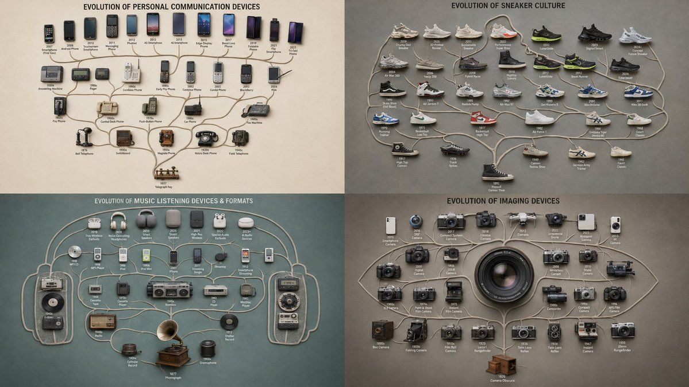

Prompt:

```text
A top-down branching tree where {argument name="theme" default="THEME"} objects are arranged along forking limbs spreading from a single root, ancestral at the base and most-evolved at the tips, the spreading canopy forming the silhouette of {argument name="silhouette shape" default="SHAPE"} ::5 Branching Logic: AI_INFER 25–45 themed objects placed as a genealogy — one origin at the root, each fork a divergence, related forms on shared branches — the lineage reading clearly from base to outermost tips ::5 Composition: Clean dendritic branching, non-crossing limbs, even canopy spread, clean silhouette edge, generous margin ::3 Material Physics: Real themed objects, accurate materials and age per branch, consistent matte finish, soft shadows, faint connecting limbs ::2 Illumination: Flat overhead softbox, no glare ::2 Typography: Tiny node labels at each branch tip ::2 Render Stack: Phylogenetic flat-lay, family-tree arrangement, branching-lineage collection, 8k ::1 Negative: [tangled crossing branches, broken hierarchy, disconnected nodes, broken canopy silhouette, tilt, 3d perspective, hands] ::-1
```

### GPT Image 2 Prompts #109: Infographic / Edu Visual - GPT-Image-2 PPT Slide Presentation Generator

- Category: `Infographic`
- Model: `GPT Image 2`
- Author / Source: [小小东](https://github.com/YouMind-OpenLab/awesome-gpt-image-2/blob/main/README.md)
- Image: `assets/imported/YouMind-OpenLab/awesome-gpt-image-2/README-50-Infographic-Edu-Visual-GPT-Image-2-PPT-Slide-Presentation-Generator.jpg`

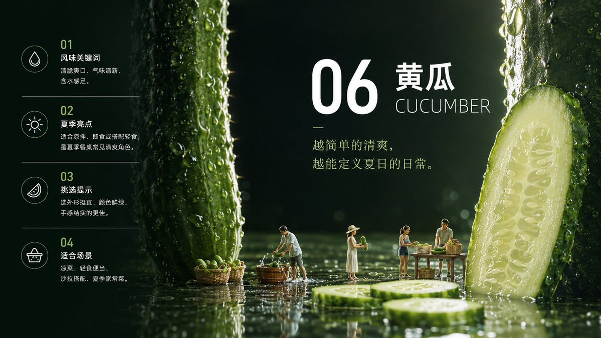

Prompt:

```text
Topic: {argument name="topic" default="Introduction to 10 summer fruits and vegetables"}
Generate 10 images in a sequence, each with a different {argument name="main content" default="fruit and vegetable introduction"}, incorporating golden quote logic, knowledge logic, and color/layout logic.
Similar to a PPT, generate 10 slides, ensuring layout variation between each.
Aspect ratio {argument name="aspect ratio" default="16:9"}
```

### GPT Image 2 Prompts #110: Infographic / Edu Visual - Minimalist Korean Doodle Illustration

- Category: `Portrait`
- Model: `GPT Image 2`
- Author / Source: [Sairah](https://github.com/YouMind-OpenLab/awesome-gpt-image-2/blob/main/README.md)
- Image: `assets/imported/YouMind-OpenLab/awesome-gpt-image-2/README-51-Infographic-Edu-Visual-Minimalist-Korean-Doodle-Illustration.jpg`

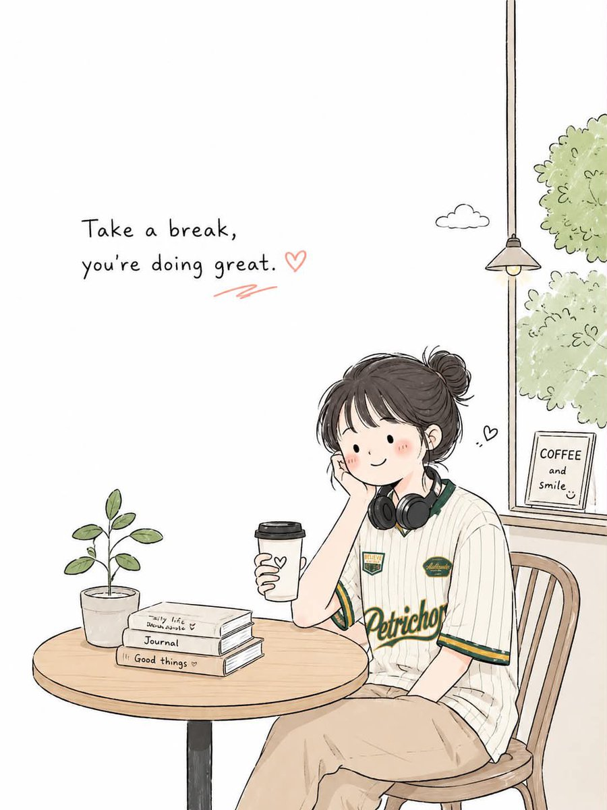

Prompt:

```text
Create a simple and cute Korean doodled editorial illustration based on {argument name="topic" default="daily routine"}.

Style:
hand-drawn doodle cartoon,
minimal editorial infographic illustration,
clean black ink outlines,
slightly imperfect sketchy lines,
flat 2D composition,
minimal line art,
large clean white negative space,
soft warm pastel accent colors only.

Scene:
design a cozy everyday moment around {argument name="topic" default="daily routine"} featuring me
Use a simple background with only essential objects and props related to the topic.

Character:
cute simplified proportions,
minimal facial features,
small relaxed smile,
natural pose,
simple casual outfit,
restrained doodle character style.

Composition:
vertical 3:4 ratio,
eye-level view,
main subject placed on one side or lower area,
large empty space on the opposite side,
sparse and airy layout.

Objects:
minimal doodle-style props such as books, coffee cups, plants, umbrellas, signs, clouds, hearts, notes, windows, etc.

Typography:
add small English handwritten text in the empty space.

Mood:
calm, cozy, warm, quiet, cute.

Avoid:
watercolor painting,
anime style,
realistic lighting,
cinematic rendering,
complex perspective,
high detail,
dense composition,
luxury poster mood,
painterly textures,
over-rendered characters.
```

### GPT Image 2 Prompts #111: Infographic / Edu Visual - Vintage Yoga Infographic Poster

- Category: `Poster`
- Model: `GPT Image 2`
- Author / Source: [PromptLab](https://github.com/YouMind-OpenLab/awesome-gpt-image-2/blob/main/README.md)
- Image: `assets/imported/YouMind-OpenLab/awesome-gpt-image-2/README-52-Infographic-Edu-Visual-Vintage-Yoga-Infographic-Poster.jpg`

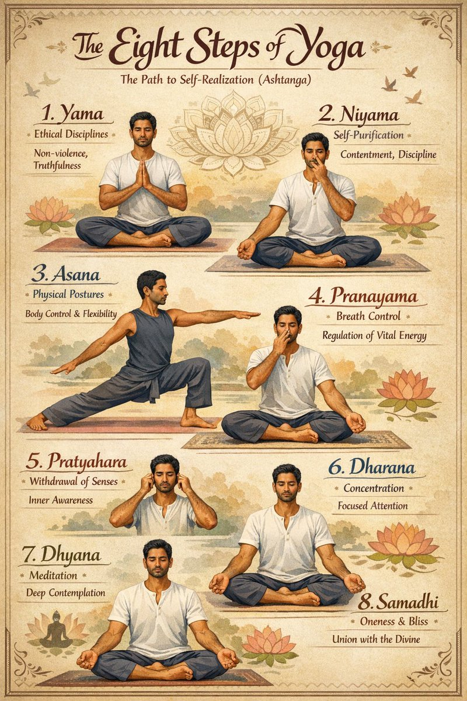

Prompt:

```text
Create a vertical vintage-style infographic poster about the {argument name="infographic topic" default="eight steps of yoga"}. Feature an {argument name="model" default="Indian man"} demonstrating different yoga practices and poses across the layout, with each step shown in its own illustrated section. Include elegant yoga-inspired typography, {argument name="texture" default="warm parchment paper"} texture, ornamental borders, lotus flowers, subtle mandala details, soft earthy beige and brown tones, and clear educational labels with short descriptions. The overall design should feel like a refined spiritual wellness chart, balanced, readable, decorative, and suitable as a beautiful yoga poster.
```

### GPT Image 2 Prompts #112: Infographic / Edu Visual - Computer Museum Coding Demo

- Category: `Infographic`
- Model: `GPT Image 2`
- Author / Source: [PromptLab](https://github.com/YouMind-OpenLab/awesome-gpt-image-2/blob/main/README.md)
- Image: `assets/imported/YouMind-OpenLab/awesome-gpt-image-2/README-53-Infographic-Edu-Visual-Computer-Museum-Coding-Demo.jpg`


Prompt:

```text
Create a 16:9 2D cartoon scene inside a {argument name="location" default="computer museum"}. In the center of the exhibit hall, a programmer is demonstrating {argument name="language" default="C language"} programming while many visitors gather around and watch. The screen should show clearly readable {argument name="code type" default="C code"}. Beside the programmer, place a sign that reads: "Ancient-Style Programming, Live Demo." Keep the composition playful, clean, and museum-like, with the programmer as the focal point.
```

### GPT Image 2 Prompts #113: Infographic / Edu Visual - Florist Storyboard Poster

- Category: `Product`
- Model: `GPT Image 2`
- Author / Source: [GPTProto Official](https://github.com/YouMind-OpenLab/awesome-gpt-image-2/blob/main/README.md)
- Image: `assets/imported/YouMind-OpenLab/awesome-gpt-image-2/README-54-Infographic-Edu-Visual-Florist-Storyboard-Poster.jpg`

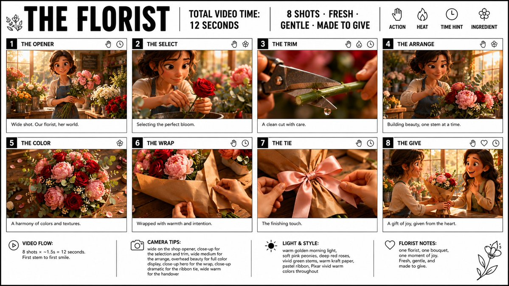

Prompt:

```text
Goal: Create a crisp, clean infographic storyboard poster for {argument name="film title" default="THE FLORIST"}, showing a short premium 3D animated video concept about a florist making and giving a bouquet.

Canvas: Wide 16:9 poster on a white background with thin black outer border and black grid lines. Use bold black typography, a clean editorial storyboard layout, and premium Pixar-like 3D stylized rendering inside each frame. Bright vivid colors, warm golden morning light, soft pink peonies, deep red roses, vivid green stems, eucalyptus leaves, kraft paper, and a warm cozy flower-shop atmosphere.

Header layout: Large bold title on the top left: {argument name="film title" default="THE FLORIST"}. Add a small simple floral line icon beside it. Across the top center, separated by vertical black divider lines, include: “TOTAL VIDEO TIME: 12 SECONDS” and “8 SHOTS · FRESH · GENTLE · MADE TO GIVE”. On the top right, show four simple black line icons with labels underneath: a hand labeled “ACTION”, a flame labeled “HEAT”, a clock labeled “TIME HINT”, and a flower labeled “INGREDIENT”.

Main storyboard layout: Use exactly 8 numbered shot cards arranged in a 4-column by 2-row grid. Each card has a black number block at top left, a bold uppercase shot title, small black line icons at the top right, a cinematic 3D image panel, and a short caption strip below. Keep all borders black and clean.

Shot 1: Number “1”, title “THE OPENER”. Image: wide shot of a cheerful young female florist in a sunlit flower shop, holding stems among buckets of flowers. Caption: “Wide shot. Our florist, her world.” Icons: hand and clock.

Shot 2: Number “2”, title “THE SELECT”. Image: close-up of the florist gently choosing a perfect deep red rose, soft bokeh flowers behind her. Caption: “Selecting the perfect bloom.” Icons: hand and flower.

Shot 3: Number “3”, title “THE TRIM”. Image: extreme close-up of pruning shears cutting a green flower stem, with a small water droplet falling from the cut. Caption: “A clean cut with care.” Icons: hand, flame, and clock.

Shot 4: Number “4”, title “THE ARRANGE”. Image: the florist arranging pink peonies, red roses, greenery, and small white filler flowers on a worktable in the warm shop. Caption: “Building beauty, one stem at a time.” Icons: hand and flower.

Shot 5: Number “5”, title “THE COLOR”. Image: overhead beauty shot of the bouquet ingredients spread on a wooden table: pink peonies, deep red roses, eucalyptus, tiny white flowers, petals, and warm highlights. Caption: “A harmony of colors and textures.” Icon: flower.

Shot 6: Number “6”, title “THE WRAP”. Image: hands wrapping the bouquet in warm brown kraft paper on a wooden counter. Caption: “Wrapped with warmth and intention.” Icons: hand and clock.

Shot 7: Number “7”, title “THE TIE”. Image: close-up of hands tying a soft satin ribbon bow around the kraft-wrapped bouquet, with a pink ribbon as the focal point. Caption: “The finishing touch.” Icons: hand and clock.

Shot 8: Number “8”, title “THE GIVE”. Image: the florist handing the finished bouquet to a delighted smiling recipient in the flower shop, warm emotional moment. Caption: “A gift of joy, given from the heart.” Icons: hand, heart, and clock.

Bottom information bar: Add four note sections across the bottom, separated by vertical black lines, each with a simple black icon and bold label. Section 1 with play icon: “VIDEO FLOW:” then “8 shots × ~1.5s = 12 seconds. First stem to first smile.” Section 2 with camera icon: “CAMERA TIPS:” then “wide on the shop opener, close-up for the selection and trim, wide medium for the arrange, overhead beauty for full color display, close-up hero for the wrap, close-up dramatic for the ribbon tie, wide warm for the handover”. Section 3 with sun icon: “LIGHT & STYLE:” then “warm golden morning light, soft pink peonies, deep red roses, vivid green stems, warm kraft paper, pastel ribbon, Pixar vivid warm colors throughout”. Section 4 with heart icon: “FLORIST NOTES:” then “one florist, one bouquet, one moment of joy. Fresh, gentle, and made to give.” Add a simple floral line drawing in the lower right corner.

Constraints: Use exactly 8 storyboard cards and exactly the four bottom note sections. Keep text legible, black typography on white, no watermark, no extra logos, no extra panels. Maintain a polished storyboard poster look with clean borders and vivid cinematic 3D frames.
```

### GPT Image 2 Prompts #114: Infographic / Edu Visual - Technical Laptop Infographic Illustration

- Category: `Product`
- Model: `GPT Image 2`
- Author / Source: [PromptLab](https://github.com/YouMind-OpenLab/awesome-gpt-image-2/blob/main/README.md)
- Image: `assets/imported/YouMind-OpenLab/awesome-gpt-image-2/README-55-Infographic-Edu-Visual-Technical-Laptop-Infographic-Illustration.jpg`

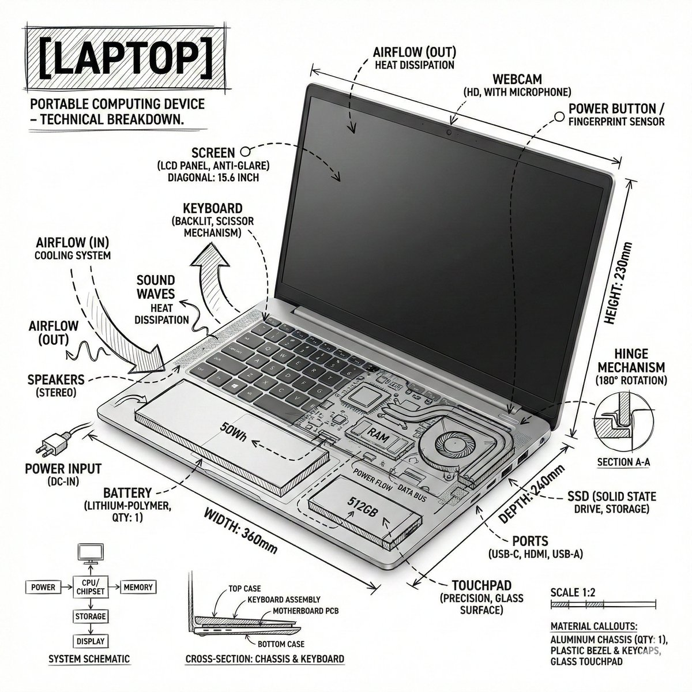

Prompt:

```text
Create a square technical infographic of a {argument name="subject" default="laptop"}, combining a realistic product photograph or photorealistic render with precise annotation overlays drawn directly over the device.

Use a pure {argument name="background color" default="white"} studio background and {argument name="ink color" default="black"} ink technical linework, like an architectural sketch or engineering manual. Include:
- Key component labels
- Internal cutaway details or exploded-view outlines
- Measurements, dimensions, and scale markers
- Material callouts and quantity notes
- Arrows showing function, airflow, power flow, sound path, pressure, or other relevant system behavior
- Simple schematic or sectional diagrams where useful

Place the title "LAPTOP" inside a hand-drawn technical annotation box in one corner.

Style and layout rules:
- The realistic laptop must remain clearly visible beneath the annotations
- The annotations should feel sketched, technical, and architectural
- Keep the composition clean with balanced negative space
- Make it feel educational, like a museum exhibit panel or engineering manual page

Visual style:
Minimal technical illustration aesthetic, black linework over realistic imagery, precise but slightly hand-drawn.

Color palette:
White background with black annotation lines and black text only. No colors.

Output:
1080 x 1080, ultra-crisp, optimized for a social feed, no watermark.
```

### GPT Image 2 Prompts #115: Infographic / Edu Visual - Antique Chinese Poetry Motto Poster

- Category: `Product`
- Model: `GPT Image 2`
- Author / Source: [小小东](https://github.com/YouMind-OpenLab/awesome-gpt-image-2/blob/main/README.md)
- Image: `assets/imported/YouMind-OpenLab/awesome-gpt-image-2/README-56-Infographic-Edu-Visual-Antique-Chinese-Poetry-Motto-Poster.jpg`

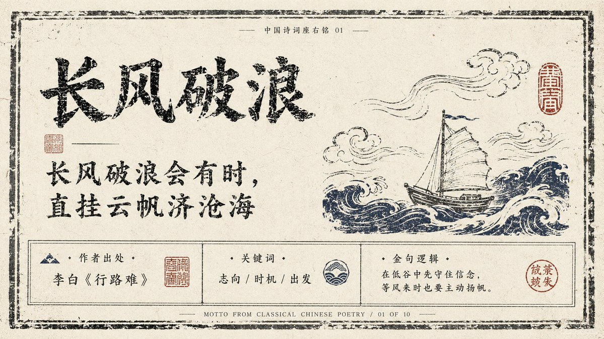

Prompt:

```text
Goal: Create a horizontal classical Chinese poetry motto poster with an antique banknote / rubbing-print / old book page aesthetic, centered on the calligraphic quote {argument name="main title" default="长风破浪"} and the motto {argument name="main quote" default="长风破浪会有时，\n直挂云帆济沧海"}.

Canvas: Wide 16:9 composition on warm aged rice paper, ivory beige with subtle stains, fibers, speckles, and uneven ink absorption. Add a distressed double-line black border around the entire image, like an old printed certificate or silver note, with chipped corners and rough ink wear.

Layout: At the very top center, place a small thin line of text reading {argument name="series label" default="中国诗词座右铭 01"} with short horizontal rules on both sides. The left half contains the large main title in bold black Chinese brush calligraphy, rough and dry-brushed. Beneath it, place a small red square seal, a short horizontal divider line, and then the two-line main quote in smaller but still expressive brush calligraphy. The right half contains an ink illustration of a traditional sailboat riding stylized ocean waves, with flowing wind lines and cloud motifs above it. Use dark navy-black ink for the waves and black linework for the boat, with a red oval seal near the upper right.

Bottom information band: Create exactly 3 bordered rectangular cards across the bottom, separated by vertical rules. Card 1 on the left is the source card: include a tiny mountain icon, the label “Author / Source”, the text {argument name="source text" default="李白《行路难》"}, and one red square seal. Card 2 in the center is the keyword card: include the label “Keywords”, the text {argument name="keywords" default="志向 / 时机 / 出发"}, and one small circular wave emblem. Card 3 on the right is the logic card: include the label “Sentence Logic”, the explanatory text “Hold your belief during a low valley; when the wind arrives, set sail actively.”, and one red circular seal. At the very bottom center outside the cards, add small English text: “MOTTO FROM CLASSICAL CHINESE POETRY / 01 OF 10”.

Visual style: Use monochrome black ink, dark navy wave accents, and muted cinnabar red seals only. The image should feel like a thought specimen made from stone rubbing, ancient book typography, Chinese seal carving, and weathered banknote engraving. Keep generous negative space, elegant asymmetry, tactile paper texture, imperfect ink edges, and hand-printed registration flaws.

Constraints: Use exactly 3 bottom cards, exactly 4 red seal marks total, exactly 1 sailboat, exactly 3 main wave clusters, and no modern objects, gradients, glossy effects, photos, QR codes, watermarks, or extra logos.
```

### GPT Image 2 Prompts #116: Infographic / Edu Visual - Chinese Aesthetic Solar Term Illustrations

- Category: `Infographic`
- Model: `GPT Image 2`
- Author / Source: [小小东](https://github.com/YouMind-OpenLab/awesome-gpt-image-2/blob/main/README.md)
- Image: `assets/imported/YouMind-OpenLab/awesome-gpt-image-2/README-57-Infographic-Edu-Visual-Chinese-Aesthetic-Solar-Term-Illustrations.jpg`

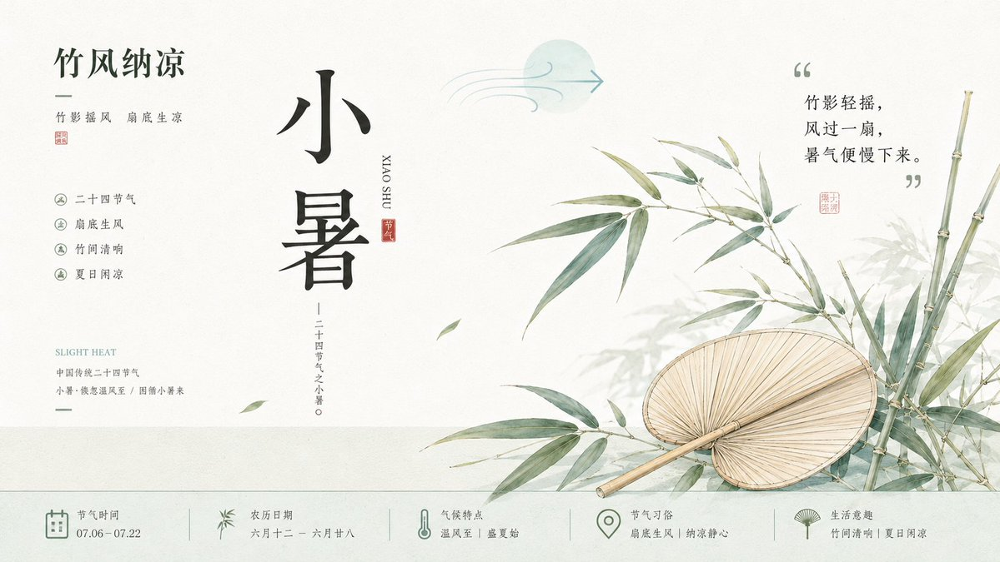

Prompt:

```text
Generate 10 images in a sequence, each featuring a different {argument name="theme" default="Slight Heat"} theme, illustration logic, golden quote logic, as well as color and layout logic.
```

### GPT Image 2 Prompts #117: Infographic / Edu Visual - Handmade Collage Packaging Design

- Category: `Product`
- Model: `GPT Image 2`
- Author / Source: [小小东](https://github.com/YouMind-OpenLab/awesome-gpt-image-2/blob/main/README.md)
- Image: `assets/imported/YouMind-OpenLab/awesome-gpt-image-2/README-58-Infographic-Edu-Visual-Handmade-Collage-Packaging-Design.jpg`

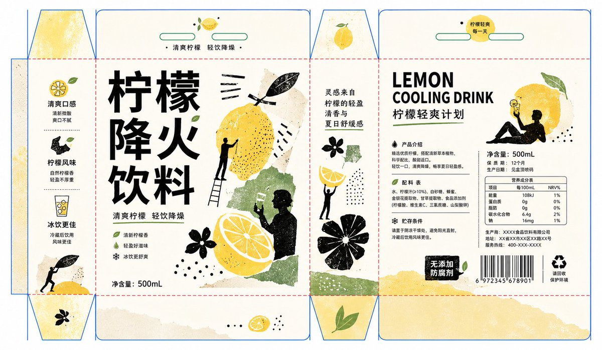

Prompt:

```text
This is my dieline image, my product is: {argument name="product name" default="Lemon cooling drink"}

I want you to refer to the following prompt style to generate packaging: Generate an information visual with a handmade collage feel around any subject. The viewer should first see a strong and quiet central text axis, with fonts using thick, simple, block-like arrangements with ample white space, like white structures precisely embedded in the background; the theme content is translated into several groups of rough black-and-white silhouettes and theme-derived color blocks, with silhouettes distributed on both sides of the text in relationships of touching, holding, hovering, and blocking, forming a visual ritual like moving, placing, and observing the theme. The main graphics use edges like rubbing, woodcut, dry brush, and paper cutting. The black structure bears weight and direction, and the white structure creates breath and contrast. A small amount of theme color blocks with lines or textures serve as the core symbols being held up, scattered in size with clear gaps between each other. The background maintains a large area of bright, transparent, and clean high-brightness field, with colors extracted from the theme's own material, emotion, and context: {argument name="color scheme" default="the base color is responsible for the light and airy feeling, the dark color for the skeleton and tension, and the medium saturation theme color for the emotion"}. A very small number of small dots or short lines serve as beats and visual pauses; the overall color relationship is bright and refreshing, restrained but full of vitality, avoiding muddiness, staleness, and gloom. The information hierarchy should be as clear as an exhibition visual system, with the main title being the largest and most orderly, and secondary information like date, description, and signature narrowed into edge vertical arrangements or small font modules, forming a rhythm where images and text hold each other back; the final effect should be like a modern art promotional visual organized from silhouettes, paper pieces, rubbing textures, and geometric white space, with both handmade traces and maintaining a clean, clear, and readable look.
```

### GPT Image 2 Prompts #118: Infographic / Edu Visual - Minimalist Narrative Solar Term Poster Layout

- Category: `3D`
- Model: `GPT Image 2`
- Author / Source: [小小东](https://github.com/YouMind-OpenLab/awesome-gpt-image-2/blob/main/README.md)
- Image: `assets/imported/YouMind-OpenLab/awesome-gpt-image-2/README-59-Infographic-Edu-Visual-Minimalist-Narrative-Solar-Term-Poster-Layout.jpg`

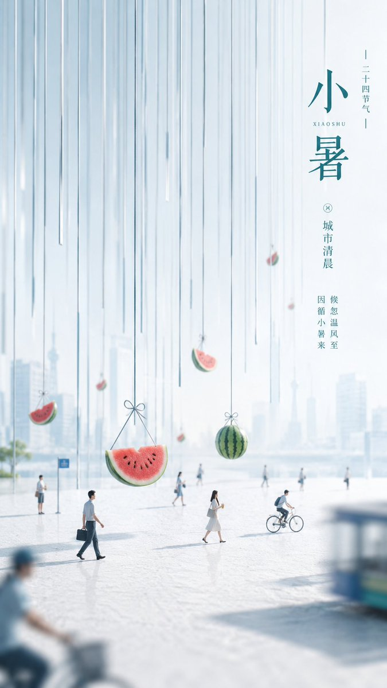

Prompt:

```text
Divide the screen into three layers: a {argument name="composition element" default="vertical line array"} at the top, a {argument name="narrative style" default="miniature narrative"} at the bottom, and {argument name="environment" default="clear white space"} in the background.
```

### GPT Image 2 Prompts #119: Infographic / Edu Visual - Photo to Anime Sketch Comparison Grid

- Category: `Product`
- Model: `GPT Image 2`
- Author / Source: [Cherry 2.O](https://github.com/YouMind-OpenLab/awesome-gpt-image-2/blob/main/README.md)
- Image: `assets/imported/YouMind-OpenLab/awesome-gpt-image-2/README-60-Infographic-Edu-Visual-Photo-to-Anime-Sketch-Comparison-Grid.jpg`

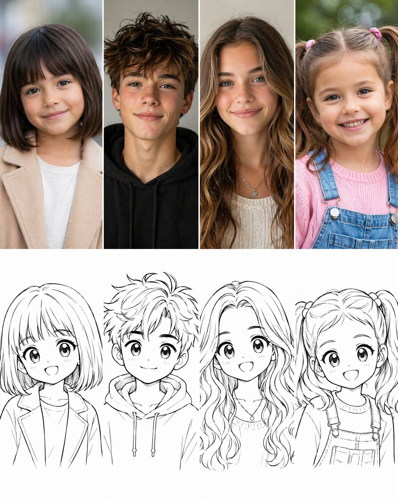

Prompt:

```text
Goal: Create a 2-row by 4-column comparison grid showing a transformation from realistic child and teen portrait photos into cute 2D anime-style sketch drawings.

Canvas: Square vertical-ish social media image, clean white background, 4 equal columns separated by thin white gutters. The top row is full-color realistic photography; the bottom row is black-and-white line art. Each column pairs one person above with their matching cartoon sketch below.

Layout: Use exactly 8 panels total: 4 realistic portraits in the top row and 4 corresponding manga sketches in the bottom row. Crop all subjects as front-facing bust portraits, centered in each column. Keep the top row photographic and softly lit; keep the bottom row as clean black ink line art on white with no color fill.

Top row subjects, left to right: 1) a young girl with a straight dark brown bob haircut and blunt bangs, gentle smile, beige coat over a white shirt, softly blurred outdoor background; 2) a teenage boy with messy tousled brown hair, subtle freckles, relaxed smile, black hoodie, neutral indoor background; 3) a teenage girl with long wavy light-brown hair, blue-green eyes, soft smile, cream knit top and small pendant necklace, warm neutral background; 4) a little girl with light brown pigtails tied with pink hair ties, bright toothy smile, pink sweater under denim overalls, green outdoor bokeh background.

Bottom row sketches, left to right: 1) matching anime girl with bob haircut and bangs, large sparkling eyes, open cheerful smile, blazer-like coat and shirt; 2) matching anime teen boy with spiky messy hair, big eyes, small smile, hoodie with drawstrings; 3) matching anime teen girl with long flowing wavy hair, large eyes, open smile, knit neckline and pendant necklace; 4) matching anime little girl with twin pigtails, big round eyes, open happy smile, sweater and overall straps with buttons.

Visual style: The photo row should look realistic, high-resolution, natural skin tones, shallow depth of field, soft daylight. The sketch row should look like polished Japanese manga/anime character line art, adorable proportions, oversized eyes, expressive faces, clean varied line weight, minimal shading, white negative space.

Constraints: No captions, no logos, no watermark, no extra people, no additional panels. Preserve the exact 4-column pairing and make each sketch clearly reinterpret the person directly above it. Use {argument name="grid theme" default="realistic children and teenagers transformed into cute anime sketches"}, with a wholesome magical childhood feeling.
```

### GPT Image 2 Prompts #120: YouTube Thumbnail - Anime VTuber Gaming Thumbnail

- Category: `Portrait`
- Model: `GPT Image 2`
- Author / Source: [PromptLab](https://github.com/YouMind-OpenLab/awesome-gpt-image-2/blob/main/README.md)
- Image: `assets/imported/YouMind-OpenLab/awesome-gpt-image-2/README-61-YouTube-Thumbnail-Anime-VTuber-Gaming-Thumbnail.jpg`


Prompt:

```text
Create a vibrant anime-style YouTube thumbnail for a livestream gaming broadcast in a wide 16:9 layout. Set the scene inside a {argument name="room style" default="neon purple and pink"} streamer room. In the center, show a cute {argument name="character type" default="catgirl VTuber"} seated at a desk from the waist up, leaning forward with energetic body language, one hand on a computer mouse and the other hand reaching toward the viewer. Give her light orange-blonde bob-cut hair with soft bangs, fluffy brown-and-cream cat ears, and a visible cat tail. Cover the middle of her face with a solid rectangular censor block so her face is intentionally hidden.

Dress her in a black-and-white maid-inspired outfit: a frilly white blouse, black dress bodice, puff sleeves, white ruffles, a black ribbon bow, and a gold bell choker. On the desk, include a mechanical keyboard with bright RGB lighting, a glowing gaming mouse, and a streamer microphone on the far left with pink-purple LED illumination. Add two cat-themed foreground props: a plush cat face at the bottom left and a black cat-shaped mug at the bottom right. Behind her, place a gaming chair decorated with paw-print details.

On the left side of the thumbnail, add large bold Korean headline text in thick white block letters with black filled shadows and a glowing purple outline, stacked across two lines. The text should read: {argument name="korean text" default="방송중 대참사"}. Beneath it, add a smaller yellow comic-style burst caption with a black outline reading: > 크리퍼 실화냐.

On the right side, place one large computer monitor angled inward. The screen should show a Minecraft-like scene with a bright blue sky, green trees, water, and a large green Creeper lunging outward toward the viewer. Outline the Creeper dramatically like a sticker cutout. Add starburst effects and neon accents around the monitor to make the moment feel chaotic and explosive.

Use exaggerated clickworthy thumbnail aesthetics throughout: ultra-saturated colors, sharp cel shading, thick outlines, glossy highlights, high contrast, dynamic perspective, and a streamer-disaster mood designed to grab attention instantly.
```

### GPT Image 2 Prompts #121: YouTube Thumbnail - Heroic Cat RPG Cut-In Banner

- Category: `Product`
- Model: `GPT Image 2`
- Author / Source: [ぱんまり@未経験×AIでゲーム作ってます🐾](https://github.com/YouMind-OpenLab/awesome-gpt-image-2/blob/main/README.md)
- Image: `assets/imported/YouMind-OpenLab/awesome-gpt-image-2/README-62-YouTube-Thumbnail-Heroic-Cat-RPG-Cut-In-Banner.jpg`

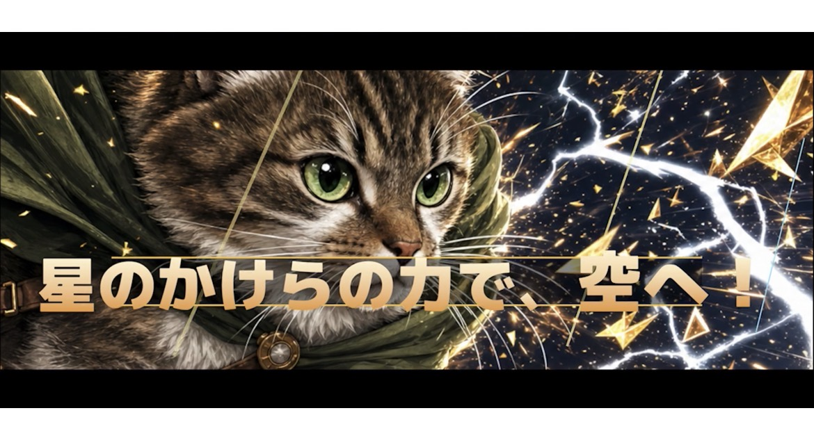

Prompt:

```text
Create an ultra-wide cinematic mobile game cut-in banner in a dramatic fantasy anime-realism style. Canvas is a very wide horizontal rectangle, about 21:9, framed with thick black letterbox bars above and below the action area for a movie-like special attack screen. The subject is a heroic brown tabby cat, close-up from the shoulders up, positioned mostly on the left half and facing right with intense large green eyes, detailed fur, long white whiskers, and a determined expression. The cat wears a dark olive-green adventurer cloak with folds flowing backward and one visible round bronze clasp near the lower left. The background is a dark starry cosmic battle scene filled with glowing gold shards, sparks, triangular crystal fragments, streaking light trails, and bright white lightning bolts radiating across the right half. Place one large bold Japanese attack phrase across the lower-middle foreground, centered and spanning almost the full width: {argument name="attack phrase" default="星のかけらの力で　空へ！"}. The typography should be thick, heavy, game-like, pale cream to warm gold gradient with subtle beveling, dark shadow, and a thin horizontal golden line passing behind or through the text, making it feel like a special move title card. Keep the cat partially behind the text so the words dominate the cut-in. Use high contrast, sharp details, dynamic diagonal energy, glittering particles, and a premium fantasy RPG visual style. No extra logos, UI buttons, watermarks, or additional text.
```

### GPT Image 2 Prompts #122: YouTube Thumbnail - Gabriel Fauré Requiem Essay Thumbnail

- Category: `Product`
- Model: `GPT Image 2`
- Author / Source: [Juan José Arango E.](https://github.com/YouMind-OpenLab/awesome-gpt-image-2/blob/main/README.md)
- Image: `assets/imported/YouMind-OpenLab/awesome-gpt-image-2/README-63-YouTube-Thumbnail-Gabriel-Faur-Requiem-Essay-Thumbnail.jpg`

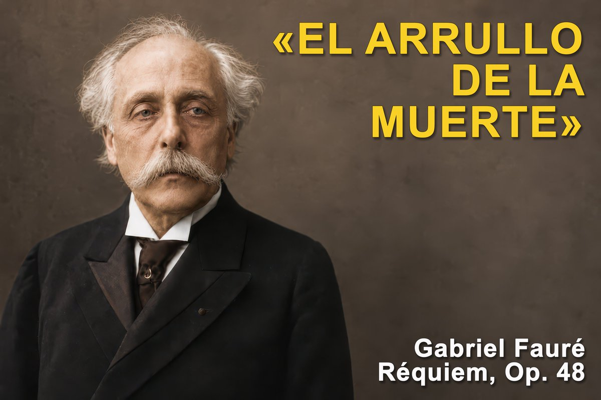

Prompt:

```text
Create a 16:9 editorial YouTube thumbnail about classical music, with a dignified photorealistic studio portrait of an elderly 19th-century French composer resembling Gabriel Fauré on the left half of the frame. He has wispy white hair, a high forehead, tired serious eyes, a large white handlebar mustache, and wears a formal black frock coat with satin lapels, a white high-collar shirt, and dark cravat. Use a muted warm brown textured studio backdrop with soft vignette lighting and empty negative space on the right for typography. Add exactly two text blocks: at the upper right, a large bold all-caps Spanish headline in bright golden yellow with dark drop shadow reading {argument name="headline text" default="«EL ARRULLO DE LA MUERTE»"}, arranged across three stacked lines; at the lower right, a smaller bold white caption with subtle black shadow reading {argument name="composer and work text" default="Gabriel Fauré\nRéquiem, Op. 48"}, arranged across two lines. The composition should feel like a serious music essay cover: solemn, refined, slightly dramatic, high contrast between the black suit and brown background, clean typography, no extra logos, no watermark, no additional text.
```

### GPT Image 2 Prompts #123: YouTube Thumbnail - Armored Warrior with Black Panther

- Category: `Portrait`
- Model: `GPT Image 2`
- Author / Source: [カーブミラー](https://github.com/YouMind-OpenLab/awesome-gpt-image-2/blob/main/README.md)
- Image: `assets/imported/YouMind-OpenLab/awesome-gpt-image-2/README-64-YouTube-Thumbnail-Armored-Warrior-with-Black-Panther.jpg`

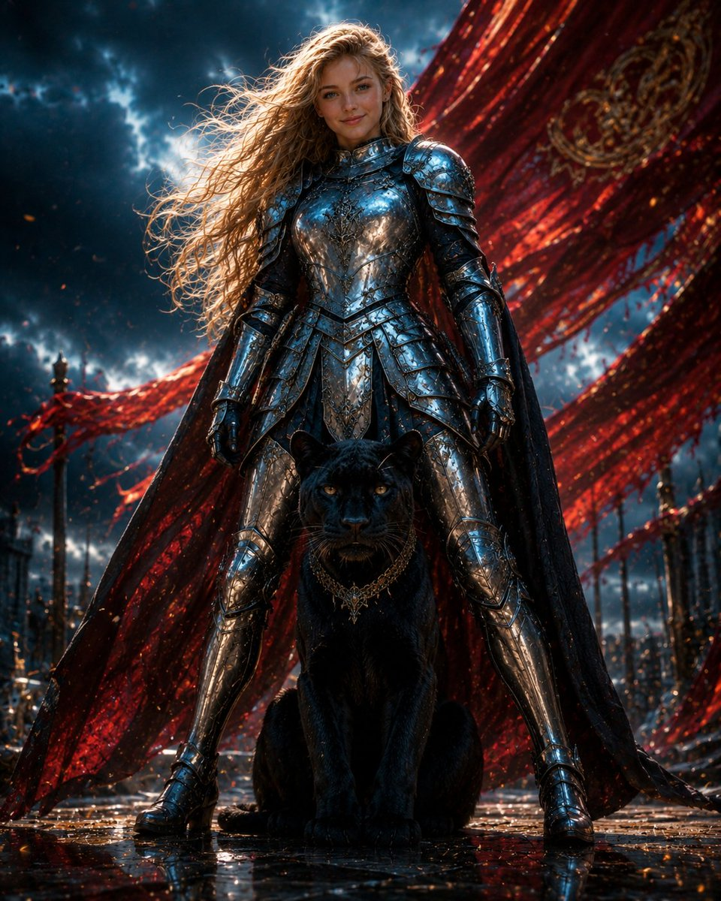

Prompt:

```text
Create a cinematic dark fantasy portrait of {argument name="character name" default="Luna and me"}: a young female warrior standing powerfully in the center of the frame with her legs apart, protecting a seated black panther directly in front of her. The warrior has {argument name="hair color" default="long windswept golden-blonde hair"}, a calm confident expression, and wears ornate mirror-polished silver full plate armor with engraved filigree, layered pauldrons, gauntlets, greaves, and a dark flowing cape. The panther is a large sleek black leopard with glowing amber eyes, glossy fur, and an ornate gold chain collar, sitting alert between the warrior’s boots. Behind them, enormous torn crimson silk banners sweep diagonally across the sky like dramatic battle standards, embroidered with faint gold patterns. The background is an epic ruined ceremonial plaza or battlefield with dark spires, small fires, floating embers, wet reflective stone ground, and a turbulent blue-black storm sky with breaks of bright light. Use a low-angle heroic composition, centered symmetry, ultra-detailed realistic fantasy art, high contrast lighting, blue highlights on chrome armor, red backlight from the banners, rain-slick reflections, volumetric atmosphere, sharp focus on the woman and panther, and an intense movie-poster mood. No text, no watermark, no extra animals, no extra people.
```

### GPT Image 2 Prompts #124: YouTube Thumbnail - Shocked Dragon Opens Chirashi Sushi

- Category: `Portrait`
- Model: `GPT Image 2`
- Author / Source: [Muzzle命](https://github.com/YouMind-OpenLab/awesome-gpt-image-2/blob/main/README.md)
- Image: `assets/imported/YouMind-OpenLab/awesome-gpt-image-2/README-65-YouTube-Thumbnail-Shocked-Dragon-Opens-Chirashi-Sushi.jpg`

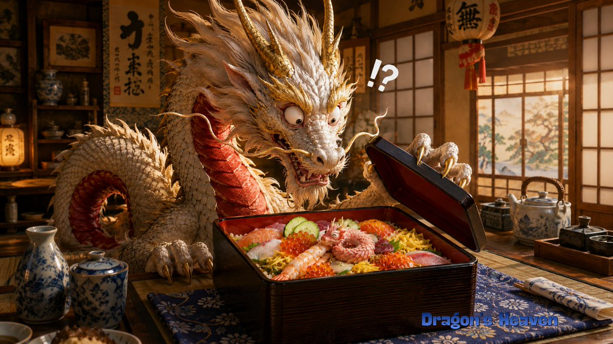

Prompt:

```text
Create a cinematic, highly detailed fantasy-realistic image of {argument name="character name" default="an elderly Ryugu dragon manager"} in a warm traditional Japanese restaurant or Dragon Palace lunch room, shocked while opening a premium chirashi sushi lacquer box. The main subject is a large ivory-white Eastern dragon with a long serpentine body, shaggy white mane, gold horns, gold whiskers, red underside scales, sharp claws, bulging startled eyes, and an open anxious mouth, leaning over a low wooden table. The dragon holds up the black-and-red lacquer bento lid with one claw, frozen in disbelief. Inside the square lacquer box is abundant chirashi-zushi: exactly 9 prominent toppings or food elements visible, including sliced salmon, white fish, shrimp, red tuna, cucumber slices, orange salmon roe, shredded yellow egg, rice, and a tiny curled pink baby dragon/octopus-like creature sitting in the center as the unexpected mystery item. Add one large white comic punctuation mark above the box reading {argument name="reaction text" default="!?"}. The setting should include shoji windows with warm sunset light, wooden shelves with ceramics, hanging Japanese calligraphy scrolls and lanterns in the background, a blue patterned table runner, a porcelain sake bottle and cup on the left, a ceramic teapot and condiment tray on the right, and chopsticks wrapped in a patterned sleeve. Use rich amber lighting, shallow depth of field, realistic textures, detailed scales, appetizing glossy food, whimsical surprise, and a wide 16:9 composition. Add a small blue watermark-style title at the bottom right reading {argument name="watermark text" default="Dragon's Heaven"}. Avoid extra characters, avoid modern objects, and keep the scene focused on the dragon's stunned reaction to the tiny creature in the sushi box.
```

### GPT Image 2 Prompts #125: YouTube Thumbnail - Flashy AI Appearance Consulting Sales Banner

- Category: `Product`
- Model: `GPT Image 2`
- Author / Source: [まるお｜AIエージェント×コンテンツマーケ｜AI特許取得｜慶應AI卒｜元日テレAI責任者｜1年で2億](https://github.com/YouMind-OpenLab/awesome-gpt-image-2/blob/main/README.md)
- Image: `assets/imported/YouMind-OpenLab/awesome-gpt-image-2/README-66-YouTube-Thumbnail-Flashy-AI-Appearance-Consulting-Sales-Banner.jpg`

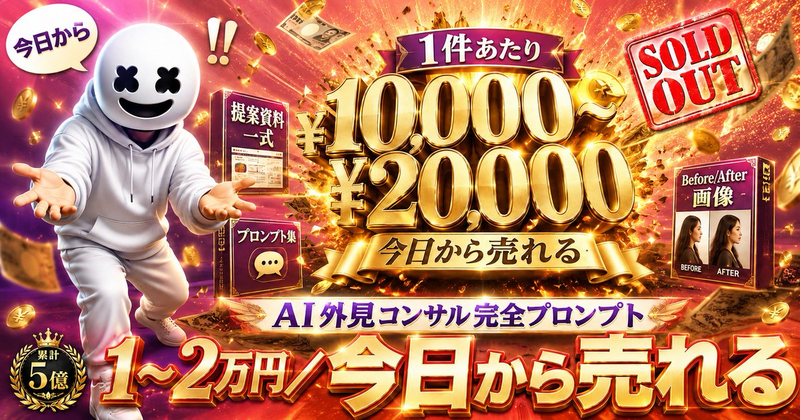

Prompt:

```text
Goal: Create a flashy Japanese social-media sales banner advertising an AI appearance-consulting prompt package, designed like a high-converting X/Twitter promo thumbnail.

Canvas: Wide horizontal 16:9 banner, ultra-saturated, glossy, cinematic ad design. Background is an explosive gold-and-magenta money burst with flying yen coins, banknotes, spark trails, confetti, and intense lens flares.

Layout: Left third features a cute mascot character in a white hoodie and white pants, running or leaning forward with both hands extended toward the viewer. The character has a round white helmet-like head, black X-shaped eyes, and a big smiling black mouth, similar to a friendly faceless mascot. Above the mascot is one white speech bubble reading 「今日から」 and a large red exclamation mark pair nearby. Bottom-left has a black-and-gold laurel badge reading 「累計 5億」.

Center: The main focal point is huge 3D metallic-gold typography with dramatic bevels, shadows, and glowing highlights. At the top center, place a purple ribbon label reading 「1件あたり」. Below it, show the main price stack: 「¥10,000〜」 on the first line and 「¥20,000」 on the second line, extremely large and gold. Under the price, add a gold ribbon reading 「今日から売れる」.

Product elements: Include exactly 3 boxed product/package mockups around the center: 1) a dark red box near the left-center labeled 「提案資料 一式」 with a small document preview, 2) a smaller dark red box lower-left of center labeled 「プロンプト集」 with a chat bubble icon, and 3) a dark red box on the right labeled 「Before/After 画像」 showing two female profile photos side by side with small English labels “BEFORE” and “AFTER”.

Right side: Add a tilted red rubber-stamp graphic in the upper-right that says “SOLD OUT” in English, with a transparent white stamp background and distressed texture.

Bottom typography: Across the bottom, use enormous red-to-gold 3D Japanese lettering with white highlights and dark drop shadows reading 「1〜2万円／今日から売れる」. Just above that, on a white-and-gold banner, place purple text reading 「AI 外見コンサル完全プロンプト」.

Visual style: Maximum-impact Japanese internet marketing thumbnail, luxury gold, red, purple, and magenta palette, high contrast, exaggerated 3D text, glowing outlines, sparkle effects, dynamic motion, dense composition, celebratory “money explosion” atmosphere.

Text customization: Use the exact visible Japanese copy unless changed: {argument name="main price text" default="¥10,000〜 ¥20,000"}, {argument name="bottom headline" default="1〜2万円／今日から売れる"}, {argument name="product name" default="AI 外見コンサル完全プロンプト"}, {argument name="top ribbon text" default="1件あたり"}, {argument name="stamp text" default="SOLD OUT"}.

Constraints: Keep all text crisp and readable, preserve the exact count of 3 product boxes, 1 mascot, 1 speech bubble, 1 badge, and 1 sold-out stamp. Do not add extra logos, watermarks, or unrelated characters.
```

### GPT Image 2 Prompts #126: YouTube Thumbnail - Cinematic Suburban Chase Scene

- Category: `Video`
- Model: `GPT Image 2`
- Author / Source: [Karlos](https://github.com/YouMind-OpenLab/awesome-gpt-image-2/blob/main/README.md)
- Image: `assets/imported/YouMind-OpenLab/awesome-gpt-image-2/README-67-YouTube-Thumbnail-Cinematic-Suburban-Chase-Scene.jpg`

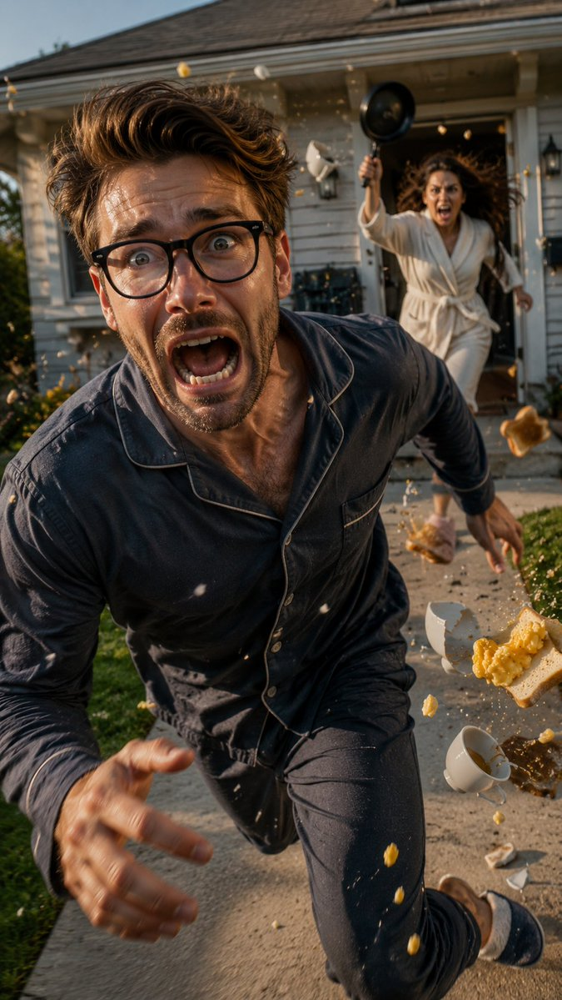

Prompt:

```text
Cinematic ultra-realistic close pursuit scene, camera positioned less than one meter in front of the fleeing husband, extreme close-up perspective, {argument name="man expression" default="terrified"} man dominating 80% of the frame, sweat on skin, visible pores, bloodshot eyes, veins bulging in neck, mouth wide open screaming in pure panic, messy hair blown backward from sprinting, wrinkled dark pajama shirt, one slipper missing. Behind him, slightly out of focus but still clearly visible, furious woman exploding out of the front door wearing a {argument name="wife outfit" default="bathrobe and fluffy slippers"}, wielding a heavy cast iron frying pan raised above her head, face twisted with uncontrollable rage, hair flying wildly in every direction. Breakfast chaos erupting through the air between them, shattered coffee mugs, flying toast, scrambled eggs, orange juice droplets frozen in motion, tiny debris particles catching sunlight. Real suburban house entrance, concrete walkway, front lawn, authentic residential neighborhood. Shot on {argument name="camera model" default="Arri Alexa 35"}, Zeiss Supreme Prime 35mm T1.5, camera operator running backwards directly in front of the husband, cinematic chase photography, realistic motion blur only on limbs and background, sharp focus locked on the husband's terrified face. Golden hour morning sunlight from side angle, physically accurate skin rendering, subsurface scattering, natural shadows, realistic reflections in eyes, documentary-style realism, Hollywood comedy movie frame, practical lighting, Kodak Vision3 film emulation, subtle film grain, hyperrealistic, ultra detailed, RAW photo quality, photorealistic, no CGI, no cartoon, no AI look, no overprocessed HDR, 8K, masterpiece, award-winning cinematic photography, dynamic Dutch angle, extreme sense of speed and urgency, vertical composition --ar 9:16 --style raw --v 8
```

### GPT Image 2 Prompts #127: YouTube Thumbnail - Japanese Developer Comment Banner

- Category: `Portrait`
- Model: `GPT Image 2`
- Author / Source: [kenta@AIVTuberテセウス•ノ•ハイネ開発者](https://github.com/YouMind-OpenLab/awesome-gpt-image-2/blob/main/README.md)
- Image: `assets/imported/YouMind-OpenLab/awesome-gpt-image-2/README-68-YouTube-Thumbnail-Japanese-Developer-Comment-Banner.jpg`

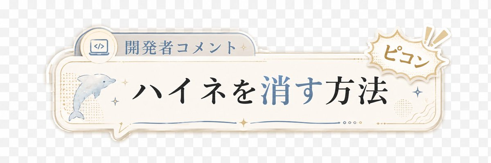

Prompt:

```text
Create a transparent-background decorative Japanese lower-third banner for a short video overlay. Canvas: wide horizontal 3:1 ratio, about 1200×400 px, with a light gray checkerboard transparency preview behind the artwork. Main object: a cream-white rounded rectangular speech-bubble plaque spanning most of the width, with layered offset shadows and thin gold and pale blue outline strokes, slightly vintage stationery style. Layout: place a small tab on the upper left of the plaque containing a circular icon of a laptop with code brackets and the label {argument name="category label" default="開発者コメント"}; place the main headline centered in large elegant Japanese Mincho-style calligraphy reading {argument name="headline text" default="ハイネを消す方法"}, with the characters for “消す” colored muted blue while the rest is black. On the left side inside the plaque, include exactly 1 watercolor-style dolphin illustration facing right, pale blue-gray. On the upper right, overlapping the plaque, add exactly 1 comic burst sticker with scalloped edges, beige outline, and handwritten text {argument name="sound effect text" default="ピコン"}, plus exactly 2 exclamation mark rays. Decorative details: include exactly 6 small sparkle stars distributed around the dolphin, headline, and right edge; exactly 1 thin blue wavy underline beneath the headline; exactly 4 tiny dots near the lower right center; subtle beige halftone dot patches on the left and right; small gold ornamental corner flourishes. Visual style: soft pastel cream, dusty blue, muted gold, clean Japanese YouTube Shorts caption graphic, gentle drop shadows, crisp vector edges mixed with light watercolor texture. Constraints: no characters or people, no extra text, keep the banner readable with generous empty space, preserve a transparent PNG overlay feel.
```

### GPT Image 2 Prompts #128: YouTube Thumbnail - Netflix Original Series Cinematic Poster

- Category: `Portrait`
- Model: `GPT Image 2`
- Author / Source: [Snow](https://github.com/YouMind-OpenLab/awesome-gpt-image-2/blob/main/README.md)
- Image: `assets/imported/YouMind-OpenLab/awesome-gpt-image-2/README-69-YouTube-Thumbnail-Netflix-Original-Series-Cinematic-Poster.jpg`

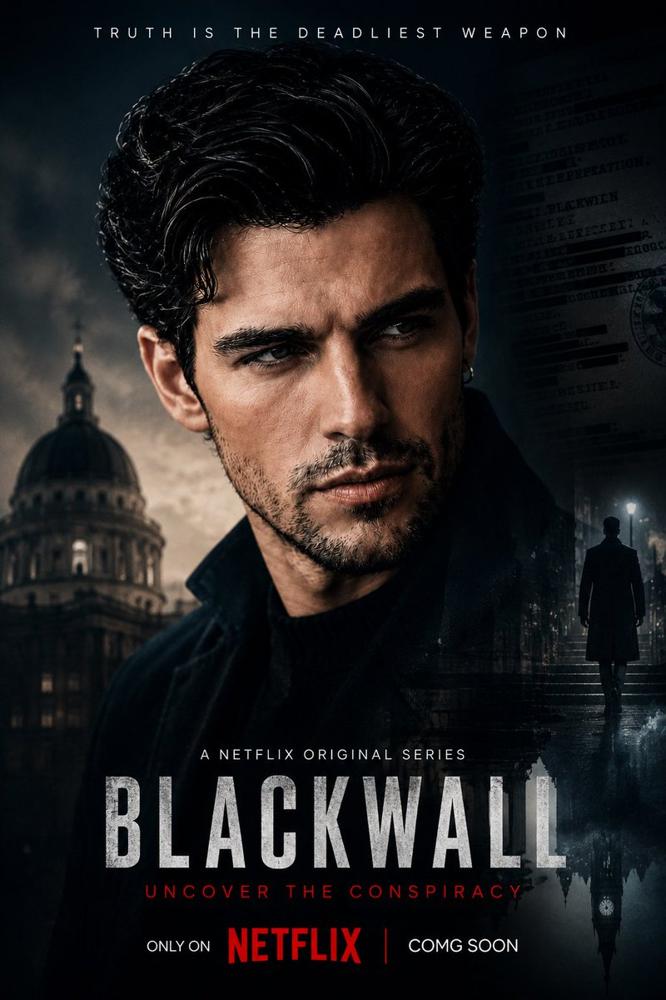

Prompt:

```text
{argument name="platform" default="Netflix"} original series poster, close-up portrait, intense expression, cinematic color grading, dramatic atmosphere, subtle film grain, premium streaming-series aesthetic, shallow depth of field, ultra-detailed face, award-winning photography, 8K.
```

### GPT Image 2 Prompts #129: YouTube Thumbnail - Reinecke Undine Forest Title Card

- Category: `Product`
- Model: `GPT Image 2`
- Author / Source: [Juan José Arango E.](https://github.com/YouMind-OpenLab/awesome-gpt-image-2/blob/main/README.md)
- Image: `assets/imported/YouMind-OpenLab/awesome-gpt-image-2/README-70-YouTube-Thumbnail-Reinecke-Undine-Forest-Title-Card.jpg`

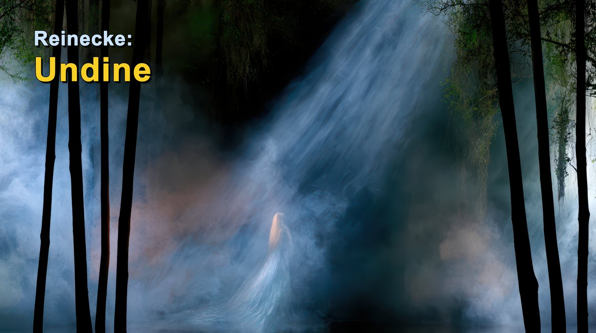

Prompt:

```text
Create a cinematic horizontal title card for a classical music video about {argument name="composer and work" default="Reinecke: Undine"}. Use a 16:9 widescreen canvas. The scene is a dark Romantic forest at night, filled with blue-gray mist and water vapor, with a shallow reflective pool along the bottom edge. A powerful diagonal shaft of cold moonlight enters from the upper right and illuminates a ghostly water spirit or undine standing near the lower center, small in scale, with very long pale blonde hair and a translucent silver-blue gown that blends into the fog and water. Frame the image with exactly 9 prominent black tree trunks in the foreground: 5 clustered on the left side and 4 on the right side, with thin hanging branches and moss near the top. The atmosphere should feel mysterious, mythic, and operatic, with deep greens, blacks, cyan-blue haze, and soft volumetric lighting. Add bold title text in the upper left: exactly 2 lines, line 1 reads {argument name="top title text" default="Reinecke:"} in white, smaller bold sans-serif, and line 2 reads {argument name="main title text" default="Undine"} in large bright yellow bold sans-serif with a subtle dark shadow. Keep the typography clean and highly legible, leave the rest of the image free of text, no logos, no watermark.
```

### GPT Image 2 Prompts #130: YouTube Thumbnail - Baku Flame Towers Aerial Scene

- Category: `Portrait`
- Model: `GPT Image 2`
- Author / Source: [もしもし@Aiart](https://github.com/YouMind-OpenLab/awesome-gpt-image-2/blob/main/README.md)
- Image: `assets/imported/YouMind-OpenLab/awesome-gpt-image-2/README-71-YouTube-Thumbnail-Baku-Flame-Towers-Aerial-Scene.jpg`

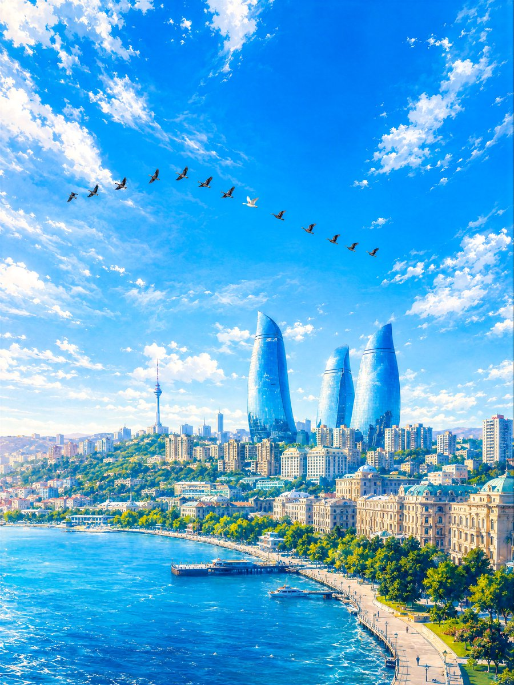

Prompt:

```text
A journey looking down at the {argument name="landmark" default="Flame Towers"}. {argument name="city" default="Baku, the capital of Azerbaijan"}. A {argument name="flock" default="flock"} slowly crosses over the sea breeze. A single {argument name="hidden character" default="white goose"} mixed in the flock.
```

### GPT Image 2 Prompts #131: YouTube Thumbnail - Xiaohongshu Food Cover Transformation

- Category: `Creative`
- Model: `GPT Image 2`
- Author / Source: [Eric Kang - Vogue AI](https://github.com/YouMind-OpenLab/awesome-gpt-image-2/blob/main/README.md)
- Image: `assets/imported/YouMind-OpenLab/awesome-gpt-image-2/README-72-YouTube-Thumbnail-Xiaohongshu-Food-Cover-Transformation.jpg`


Prompt:

```text
To Xiaohongshu Food Cover Photo Edit. {argument name="preservation" default="Preserve the original food type and main content"}
```

### GPT Image 2 Prompts #132: YouTube Thumbnail - Glossy Codex vs Hermes Tech Thumbnail

- Category: `Product`
- Model: `GPT Image 2`
- Author / Source: [王帅真](https://github.com/YouMind-OpenLab/awesome-gpt-image-2/blob/main/README.md)
- Image: `assets/imported/YouMind-OpenLab/awesome-gpt-image-2/README-73-YouTube-Thumbnail-Glossy-Codex-vs-Hermes-Tech-Thumbnail.jpg`

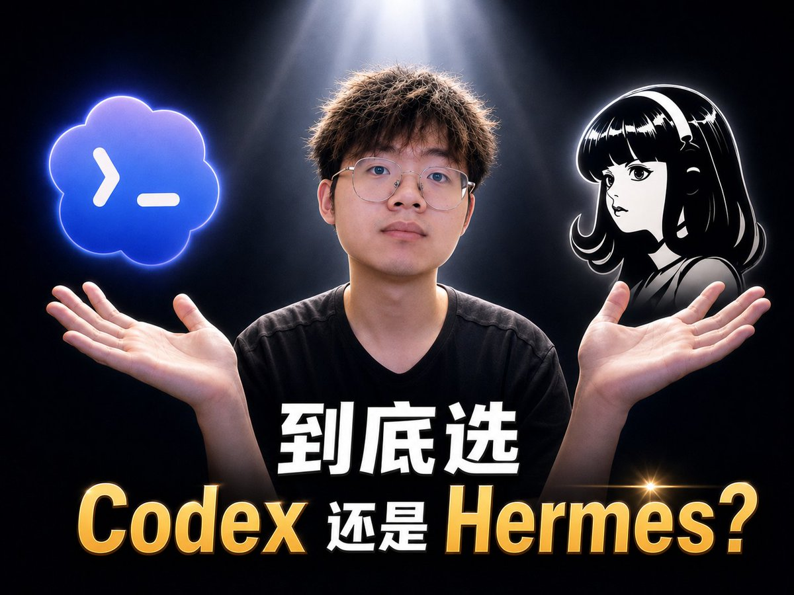

Prompt:

```text
Goal: Create a glossy, high-contrast YouTube-style tech video thumbnail about choosing between {argument name="tool one name" default="Codex"} and {argument name="tool two name" default="Hermes"}.

Canvas: 4:3 landscape thumbnail, 1024×768 composition, dark black-to-charcoal studio background with a dramatic white spotlight shining down from the top center, subtle smoky haze, cinematic rim lighting, and a premium “oily” glossy thumbnail look.

Layout: Center a young male presenter from chest up, facing camera, wearing a plain black V-neck T-shirt. His face should be intentionally anonymized with a smooth blurred rectangular skin-tone mask. His arms are raised symmetrically, palms open upward as if weighing two choices. Place exactly 2 floating option graphics above his hands: on the left, a glowing blue cloud-shaped terminal icon with a white command prompt symbol; on the right, a black-and-white anime-style female avatar bust with glossy hair and a white outline glow, also anonymized with a small blurred square over the face.

Text content: Add exactly 2 stacked text lines across the lower third. Top line: large bold white Chinese text with black shadow, {argument name="top headline text" default="到底选"}. Bottom line: huge mixed gold-and-white text reading {argument name="bottom comparison text" default="Codex 还是 Hermes?"}; make “Codex” and “Hermes?” metallic gold with bevel, gradient, black outline, and drop shadow, while the middle Chinese word stays white. Include one small golden star lens flare near the right side of the word “Hermes”.

Subject details: The presenter has short messy brown hair lit by the overhead spotlight, natural hands with visible palms, and a neutral pose suggesting comparison or uncertainty. The left icon should glow electric blue with a neon rim; the right anime avatar should be monochrome with strong white edge highlights.

Visual style: Hyper-polished Chinese tech creator thumbnail, sharp subject cutout, intense contrast, glossy 3D text, dramatic lighting, saturated highlights, clean composition, no extra logos, no watermark, no additional text.
```

### GPT Image 2 Prompts #133: YouTube Thumbnail - Korean Sleep Tips Thumbnail

- Category: `Product`
- Model: `GPT Image 2`
- Author / Source: [응애](https://github.com/YouMind-OpenLab/awesome-gpt-image-2/blob/main/README.md)
- Image: `assets/imported/YouMind-OpenLab/awesome-gpt-image-2/README-74-YouTube-Thumbnail-Korean-Sleep-Tips-Thumbnail.jpg`

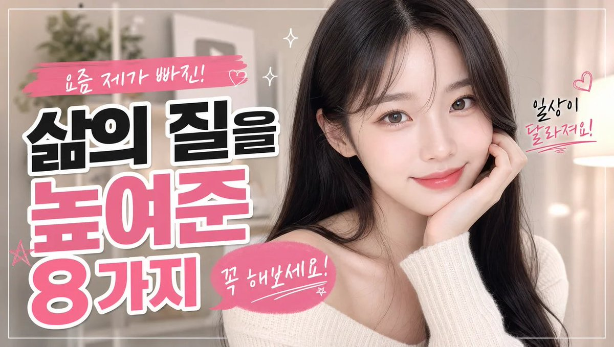

Prompt:

```text
Goal: Create a bright Korean YouTube-style thumbnail about improving sleep, combining a lifestyle portrait with bold editorial typography.

Canvas: 1200×675 horizontal 16:9 thumbnail, soft warm indoor bedroom/living-room background, thin white rectangular border inset from the edges.

Main subject: On the right half, show a young East Asian woman with long dark wavy hair wearing an off-shoulder cream knit sweater, sitting in a cozy room and touching her cheek with one hand. Her face is intentionally covered by a large centered square blur/mosaic block in muted skin-tone colors, obscuring all facial features. Keep the portrait softly lit, feminine, and clean.

Layout: Left half is dominated by oversized stacked Korean headline typography with thick white outline and subtle black drop shadow. Use three main headline lines: line 1 black text, line 2 pink text, line 3 pink text. The woman overlaps slightly behind the typography, creating a magazine thumbnail composition.

Text content: Include exactly 4 text blocks: 1) a pink brush-stroke banner at upper left reading {argument name="top banner text" default="요즘 제가 빠진!"}; 2) the main headline reading {argument name="headline text" default="삶의 질을 높여준 8가지"}; 3) a pink oval brush label near the lower center reading {argument name="callout text" default="꼭 해보세요!"}; 4) a small handwritten note on the right reading {argument name="side note text" default="일상이 달라져요!"}, with the second phrase in pink and underlined.

Decorative elements: Include exactly 2 pink outline hearts, one near the top banner and one near the right handwritten note. Include exactly 4 star/sparkle doodles: two white sparkle marks above the headline near the center, one pink star outline on the left edge, and one small white star near the lower callout label. Add hand-drawn underline strokes under the callout and side note.

Visual style: Korean lifestyle content thumbnail, cute and polished, high contrast, bold rounded sans-serif Korean lettering, black and hot-pink palette with white outlines, soft beige background, playful brush strokes, clean social-media design.

Constraints: Do not add extra text blocks, extra people, logos, or watermarks. Keep the face fully obscured by the square blur block while preserving the hair, sweater, hand, and shoulders.
```

### GPT Image 2 Prompts #134: YouTube Thumbnail - Cozy Anime Morning Livestream

- Category: `Portrait`
- Model: `GPT Image 2`
- Author / Source: [アマドウマ](https://github.com/YouMind-OpenLab/awesome-gpt-image-2/blob/main/README.md)
- Image: `assets/imported/YouMind-OpenLab/awesome-gpt-image-2/README-75-YouTube-Thumbnail-Cozy-Anime-Morning-Livestream.jpg`

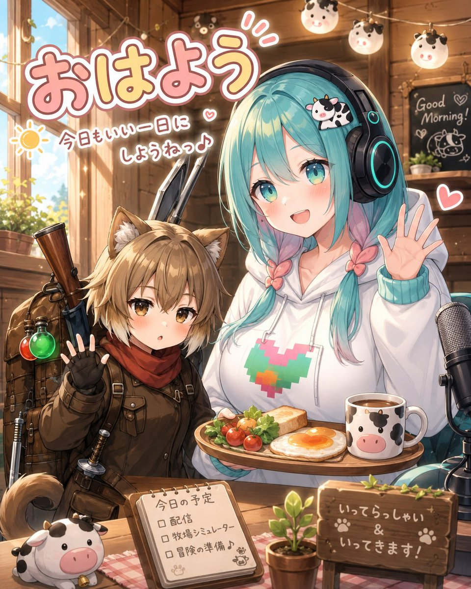

Prompt:

```text
Create a warm, detailed anime-style morning livestream illustration inside a cozy wooden cabin cafe. The scene features exactly 2 main characters seated at a wooden table: on the left, a small cat-eared adventurer girl with short light-brown hair, amber eyes, fluffy ears and tail, wearing a dark brown explorer outfit, red scarf, fingerless gloves, backpack straps, and a rifle or long adventuring gear strapped behind her; she raises one hand in a shy greeting. On the right, a taller streamer girl with long twin-braided {argument name="hair color" default="turquoise hair with pink tips"}, oversized black headphones with cyan glowing rings, a white hoodie with a pixel heart design in teal, pink, orange, and green, and a tiny cow hair clip; her face is deliberately covered by a plain square censor block in a muted gray-beige color, while she waves with one hand. Place exactly 7 visible cow-themed items: 1 cow hair clip on the streamer’s head, 3 round hanging cow lanterns near the ceiling, 1 cow-face mug on the breakfast tray, 1 cow plush at the front-left corner of the table, and 1 cow doodle on the rear chalkboard. Add a breakfast tray in front of the streamer with exactly 4 food items: toast, a sunny-side-up egg, cherry tomatoes, and leafy greens. Add a large microphone on the right edge of the table for livestreaming, a small potted plant near the center front, and a wooden sign on the front-right reading 「いってらっしゃい & いってきます!」 with paw prints. Add a small spiral notebook on the table labeled 「今日の予定」 with exactly 3 checkbox lines: 「配信」, 「牧場シミュレーター」, and 「冒険の準備♪」. In the upper-left, add large bubbly Japanese headline text 「{argument name="headline text" default="おはよう"}」 in pink with a thick white outline and soft shadow. Beneath it, add smaller handwritten text 「{argument name="morning message" default="今日もいい一日にしようねっ♪"}」 next to a simple yellow sun doodle and small hearts. In the background, include a sunlit window with greenery outside, warm wooden beams, string lights, and a chalkboard on the back wall with English text “Good Morning!” plus hearts and a cow drawing. Use golden morning sunlight, soft rim lighting, cute VTuber fan-art energy, high detail, clean linework, glossy anime rendering, pastel pink accents, cozy rustic textures, and a cheerful welcoming mood. Keep the composition vertical, close-up, crowded but readable, with no extra characters and no additional text beyond the specified signs and labels.
```

### GPT Image 2 Prompts #135: YouTube Thumbnail - Cinematic Stadium Football Match

- Category: `Video`
- Model: `GPT Image 2`
- Author / Source: [Sheikh Sharik 2.0](https://github.com/YouMind-OpenLab/awesome-gpt-image-2/blob/main/README.md)
- Image: `assets/imported/YouMind-OpenLab/awesome-gpt-image-2/README-76-YouTube-Thumbnail-Cinematic-Stadium-Football-Match.jpg`

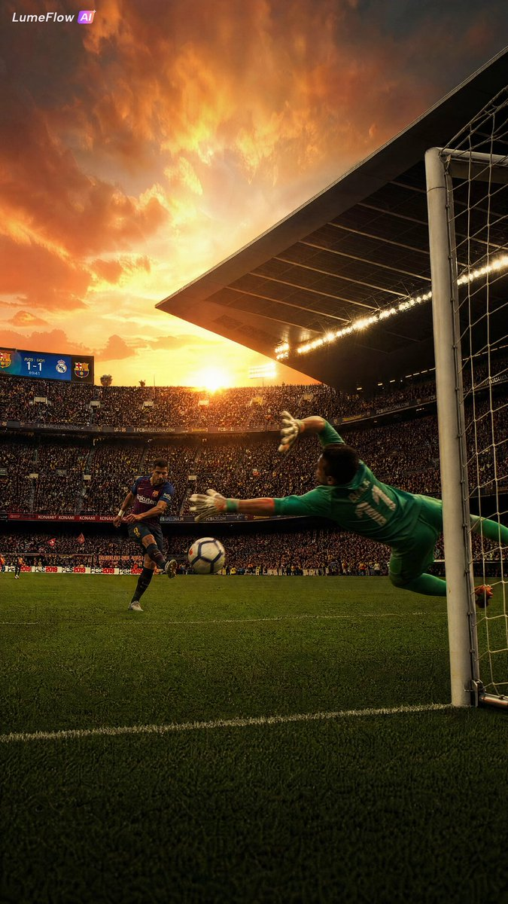

Prompt:

```text
Cinematic {argument name="lighting" default="sunset"} football match in a massive stadium, score {argument name="match score" default="1-1"} in the final moments, intense crowd cheering, dramatic orange and golden sunset sky, player about to score a {argument name="goal moment" default="last-minute winning goal"}, goalkeeper diving, emotional atmosphere, ultra realistic, cinematic lighting, highly detailed, stadium lights glowing, epic sports photography, 4K
```

### GPT Image 2 Prompts #136: YouTube Thumbnail - Anime Idol Advertising Takeover City

- Category: `Product`
- Model: `GPT Image 2`
- Author / Source: [オオトリヒカリ🐦‍🔥](https://github.com/YouMind-OpenLab/awesome-gpt-image-2/blob/main/README.md)
- Image: `assets/imported/YouMind-OpenLab/awesome-gpt-image-2/README-77-YouTube-Thumbnail-Anime-Idol-Advertising-Takeover-City.jpg`

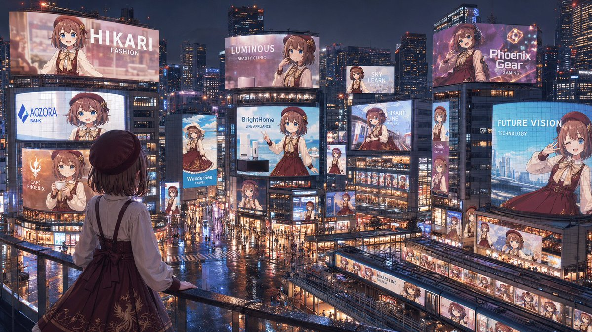

Prompt:

```text
Create a cinematic wide 16:9 anime-style nighttime cityscape showing a full “advertising takeover” of a futuristic Tokyo-like entertainment district by one idol character, {argument name="character name" default="Hikari"}. View from a high pedestrian balcony in the foreground, looking down over a rainy neon plaza packed with tiny pedestrians, wet reflective streets, glass buildings, trains, skybridges, and dense skyscrapers under a dark blue evening sky. In the foreground, place the same character seen from behind at the railing: a young anime girl with short brown hair, a dark beret, cream blouse, burgundy jumper dress with ribbon bow and subtle gold embroidery, looking out at the city. Fill the city with exactly 18 visible advertisements featuring the same girl in different poses and crops: 1) giant top-left billboard reading “HIKARI / FASHION,” 2) curved mid-left screen reading “AOZORA / BANK,” 3) lower-left orange cafe ad reading “CAFÉ PHOENIX,” 4) slim vertical travel ad reading “WanderSee / TRAVEL,” 5) large central billboard reading “LUMINOUS / BEAUTY CLINIC,” 6) central appliance billboard reading “BrightHome / LIFE APPLIANCE,” 7) small high billboard reading “SKY LEARN,” 8) large upper-right purple gaming ad reading “Phoenix Gear / GAMING,” 9) right-side blue technology billboard reading “FUTURE VISION / TECHNOLOGY,” 10) center-right transit ad reading “HIKARI LINE,” 11) narrow vertical sign reading “Smile / DENTAL,” 12) small vertical character sign beneath the central screens, 13) small character billboard near the lower center intersection, 14) small character sign on a mid-right building corner, 15) long horizontal station-front banner with repeated Hikari portraits, 16) train-side wrap ad labeled “HIKARI LINE,” 17) another train or platform wrap with repeated portraits in the lower-right transit area, and 18) small rooftop or facade screen near the center-right showing her portrait. Make every ad visually consistent but branded differently, with clean white sans-serif English text, glossy LED glow, and no extra unreadable copy. Use rich cyberpunk-commercial lighting, rain reflections, warm shop windows, blue and pink neon, highly detailed architecture, and a grand sense of scale. Some distant character faces on billboards may be softly blurred by glow and distance, but the overall impression must be clear: one beloved character has taken over the entire city’s advertising landscape. Use {argument name="primary outfit color" default="burgundy"}, {argument name="hair color" default="brown"}, {argument name="city mood" default="rainy neon night"}, and {argument name="main brand theme" default="idol fashion and lifestyle"}.
```

### GPT Image 2 Prompts #137: YouTube Thumbnail - Cinematic Film Genre Color Grading Comparison

- Category: `Poster`
- Model: `GPT Image 2`
- Author / Source: [BMX](https://github.com/YouMind-OpenLab/awesome-gpt-image-2/blob/main/README.md)
- Image: `assets/imported/YouMind-OpenLab/awesome-gpt-image-2/README-78-YouTube-Thumbnail-Cinematic-Film-Genre-Color-Grading-Comparison.jpg`

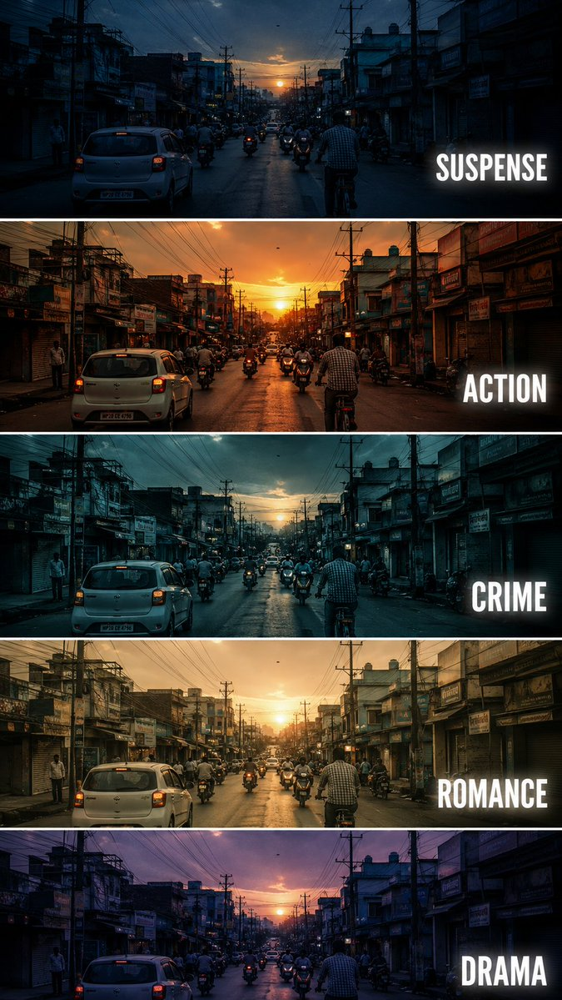

Prompt:

```text
Create a {argument name="aspect" default="vertical"} cinematic tutorial comparison poster showing the same {argument name="subject" default="urban street scene"} repeated in five horizontal panels, each panel demonstrating a different film genre color grading style. The scene is a busy small city street at sunset, with cars, motorcycles, cyclists, shop buildings, electric poles, tangled overhead wires, and warm evening sky. Keep the camera angle exactly the same in every panel, like a fixed street photography shot.

Each horizontal strip should have a different cinematic mood and color tone:

Panel 1: SUSPENSE - cool blue shadows, dark contrast, slightly mysterious atmosphere, tense and moody lighting.
Panel 2: ACTION - warm orange sunset tone, high contrast, energetic cinematic look, dramatic highlights.
Panel 3: CRIME - cold teal blue grading, darker exposure, gritty urban feeling, realistic shadows.
Panel 4: ROMANCE - soft golden warm tone, gentle contrast, nostalgic sunset mood, dreamy atmosphere.
Panel 5: DRAMA - muted purple blue evening tone, emotional cinematic lighting, soft shadows and serious mood.
Add bold white uppercase text on the right side of each panel: SUSPENSE, ACTION, CRIME, ROMANCE, DRAMA. Use clean modern sans serif typography with slight glow or subtle shadow. Separate each panel with thin white horizontal borders. Make it look like a professional filmmaking color grading tutorial thumbnail, cinematic, realistic, high detail, urban street photography, 9:16 vertical composition.
Negative Prompt: cartoon, anime, painting, low quality, blurry, distorted buildings, extra text, wrong spelling, messy typography, overexposed, unrealistic colors, duplicated cars, warped street, bad perspective, random objects, low resolution, watermark
```

### GPT Image 2 Prompts #138: YouTube Thumbnail - Minecraft Death Screen Portrait

- Category: `Portrait`
- Model: `GPT Image 2`
- Author / Source: [CHAse](https://github.com/YouMind-OpenLab/awesome-gpt-image-2/blob/main/README.md)
- Image: `assets/imported/YouMind-OpenLab/awesome-gpt-image-2/README-79-YouTube-Thumbnail-Minecraft-Death-Screen-Portrait.jpg`

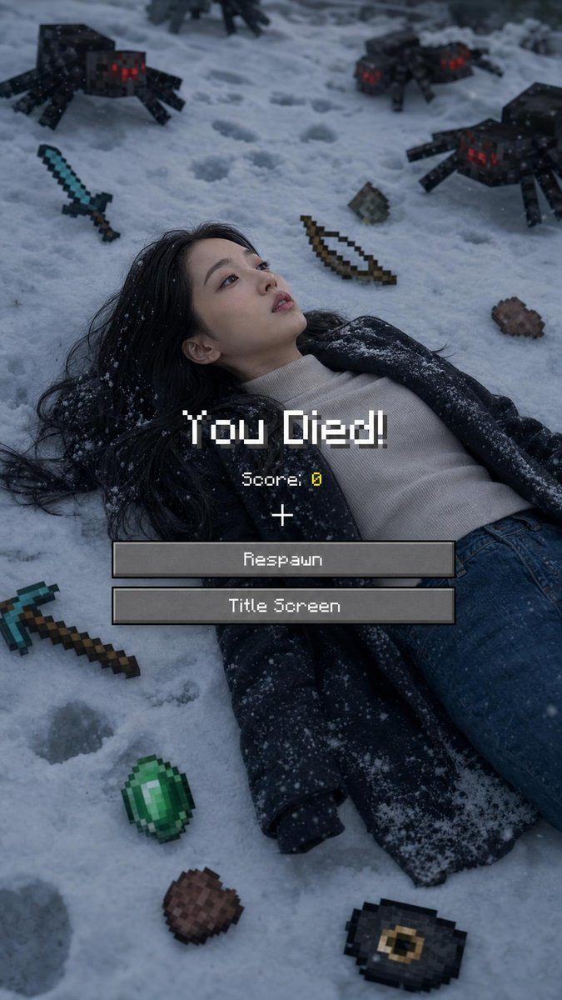

Prompt:

```text
Use 100% of the face and body from my reference image. Create a cinematic winter scene with a side face close-up view, inspired by a Minecraft death screen. The person is lying face up in the snow, wearing {argument name="clothing" default="casual winter clothing"}, in a realistic pose, with cool atmospheric lighting, slightly desaturated tones, and visible footprints in the snow. Surround the person with floating or placed pixelated objects in the Minecraft style, including a {argument name="weapon" default="diamond sword"}, bow, pickaxe, emerald, steak, Eye of Ender, music disc, and a mob of spiders. Add a realistic Minecraft "You Died!" overlay on top with pixel font, including "Score: 0," the reticle symbol, and two retro UI buttons labeled "Respawn" and "Title Screen." Naturally blend the realistic photography with pixel-art game elements. Soft shadows, melancholic winter aesthetic, ultra-detailed, vertical composition, DSLR realism, subtle depth of field, high contrast, 9:16 aspect ratio.

Negative Prompt:

"Low quality, blurry face, distorted body, extra limbs, incorrect facial features, cartoonish body, unrealistic"
```

### GPT Image 2 Prompts #139: Comic / Storyboard - Character Reference Turnaround Sheet

- Category: `Portrait`
- Model: `GPT Image 2`
- Author / Source: [Hero Syndicate](https://github.com/YouMind-OpenLab/awesome-gpt-image-2/blob/main/README.md)
- Image: `assets/imported/YouMind-OpenLab/awesome-gpt-image-2/README-80-Comic-Storyboard-Character-Reference-Turnaround-Sheet.jpg`

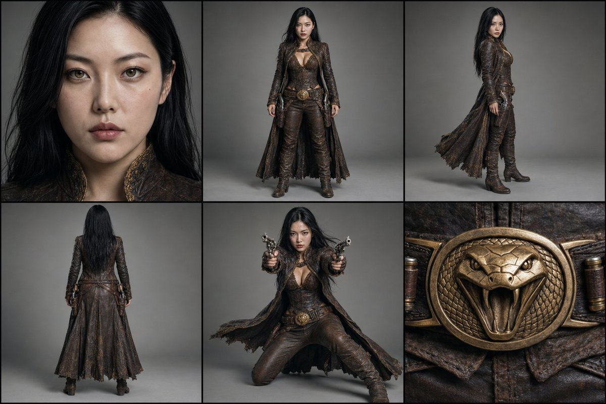

Prompt:

```text
Create a six-panel character reference turnaround sheet on a seamless neutral gray studio
```

## Nano Banana Pro Prompts

- Entries: 208
- With images: 208

### Nano Banana Pro Prompts #1: 终极跨界

- Category: `Portrait`
- Model: `Nano Banana Pro`
- Author / Source: [@TheRelianceAI](https://x.com/TheRelianceAI/status/1925146916133712191)
- Image: `assets/thumbs/nano-100.png`


Prompt:

```text
Imagine [CHARAKTER 1] and [Charakter 2] casually sitting together at a table in a [FAST FOOD BRAND] restaurant. The atmosphere is relaxed and light-hearted, with the two characters engaged in an amusing or deep conversation over trays of food and drinks.
```

### Nano Banana Pro Prompts #2: 玩具盒中的历史

- Category: `3D`
- Model: `Nano Banana Pro`
- Author / Source: [@TheRelianceAI](https://x.com/TheRelianceAI/status/1925223613055017251)
- Image: `assets/thumbs/nano-99.png`

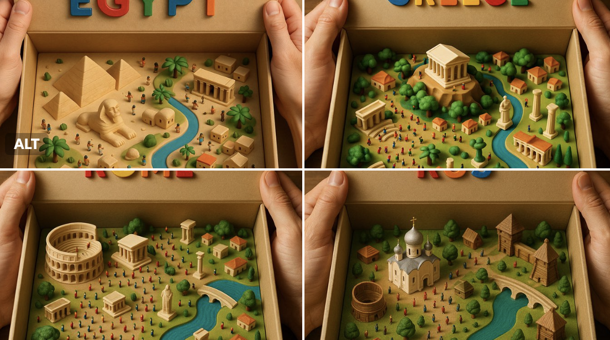

Prompt:

```text
An ultra-realistic top-down photograph of a 3D-printed diorama inside a beige cardboard box, with the lid being held open by two human hands. The interior of the box reveals a miniature landscape of [COUNTRY NAME], featuring iconic landmarks, terrain, buildings, rivers, vegetation, and crowds of tiny, detailed human figures. The diorama is filled with vibrant, geographically appropriate elements, all crafted in a tactile, toy-like style using matte 3D-printed textures with visible layer lines. At the top, the inside of the box lid displays the phrase “[COUNTRY NAME]” in large, colorful, raised plastic letters—each letter in a different bright color. The lighting is warm and cinematic, highlighting the textures and shadows to evoke a sense of realism and charm, as if the viewer is opening a magical miniature version of the natio
```

### Nano Banana Pro Prompts #3: 3D卡通雕塑风格

- Category: `Product`
- Model: `Nano Banana Pro`
- Author / Source: [@aziz4ai](https://x.com/aziz4ai/status/1925301120252924356)
- Image: `assets/thumbs/nano-98.jpeg`


Prompt:

```text
a soft 3D cartoon-style sculpture of [brand product], made of smooth clay-like textures and vibrant pastel colors, placed in a minimalist isometric scene that complements the product’s nature, clean composition, gentle lighting, subtle shadows, with the product’s logo and a 3-word slogan displayed clearly belo
```

### Nano Banana Pro Prompts #4: 复古电脑开机画面解析为ASCII艺术

- Category: `Infographic`
- Model: `Nano Banana Pro`
- Author / Source: [@Gdgtify](https://x.com/Gdgtify/status/1925176250626159053)
- Image: `assets/thumbs/nano-97.png`

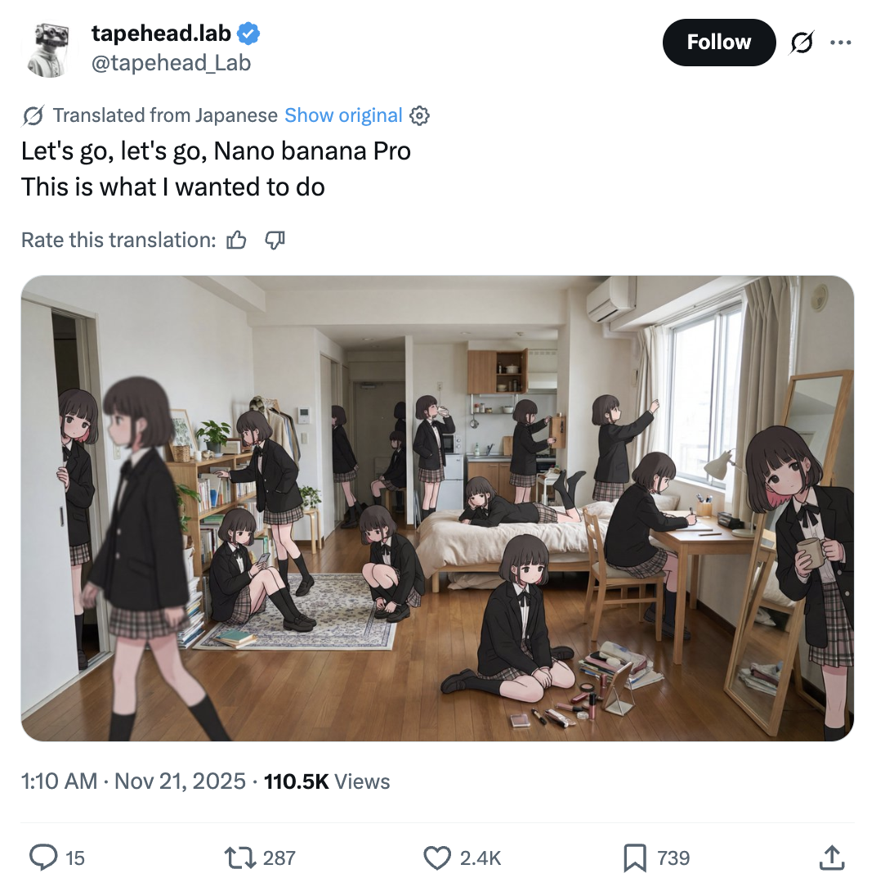

Prompt:

```text
Retro CRT computer boot screen that resolves into ASCII-art of NYC's tallest building
```

### Nano Banana Pro Prompts #5: 3D蒸汽朋克Logo

- Category: `Product`
- Model: `Nano Banana Pro`
- Author / Source: [@MayorKingAI](https://x.com/MayorKingAI/status/1925144570553327620)
- Image: `assets/thumbs/nano-96.jpeg`


Prompt:

```text
3D sculpted logo of [LOGO NAME], in a steampunk style, made of aged brass and oxidized iron, with visible rivets, gears, and vintage mechanical elements, distressed and weathered surface, rich copper and bronze tones, engraved with Victorian-style filigree, retro-industrial design, soft spotlight lighting, neutral background, hyper-realistic render, ultra-high resolution, symmetrical composition
```

### Nano Banana Pro Prompts #6: 品牌平面纸风格

- Category: `Product`
- Model: `Nano Banana Pro`
- Author / Source: [@HBCoop_](https://x.com/HBCoop_/status/1925213900192043236)
- Image: `assets/thumbs/nano-95.png`

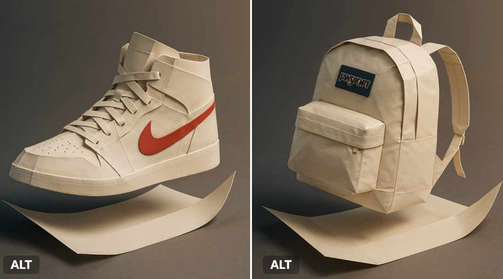

Prompt:

```text
A flat branded paper folds itself into the full 3D shape of a [Air Jordan 1 shoes], mid-motion. Dramatic studio lighting, origami texture detail, gradient shadows, Japanese minimalism feel.
```

### Nano Banana Pro Prompts #7: 制药风格商品

- Category: `Product`
- Model: `Nano Banana Pro`
- Author / Source: [@azed_ai](https://x.com/azed_ai/status/1925197464099049735)
- Image: `assets/thumbs/nano-94.jpeg`


Prompt:

```text
A square-format digital photograph showing a fictional pharmaceutical-style product from [Brand Name] Pharmacy. The box is on the left, clean and minimalist, featuring bold text with the product name "[PRODUCT NAME]" and a witty line like "Take one [type] daily." Next to the box is a silver blister pack containing 6–10 themed pills or capsules shaped like [describe icon/logo/item, e.g., a coffee cup, burger, heart, Midjourney logo, etc.]. Neutral background, soft lighting, sharp focus, modern packaging aesthetic.
```

### Nano Banana Pro Prompts #8: 不同情绪状态的思想泡泡

- Category: `Portrait`
- Model: `Nano Banana Pro`
- Author / Source: [@TheRelianceAI](https://x.com/TheRelianceAI/status/1925098220398465145)
- Image: `assets/thumbs/nano-93.jpeg`

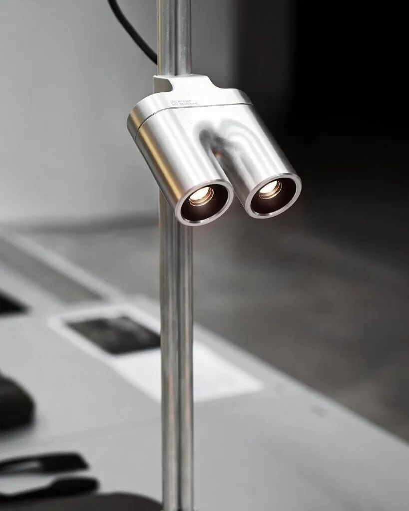

Prompt:

```text
A [SUBJECT] sits alone in a minimalistic room filled with floating, semi-transparent thought bubbles. Each bubble contains a fragment of their face from different emotional states — smiling, crying, screaming — forming a psychological self-portrait suspended in mid-air.
```

### Nano Banana Pro Prompts #9: 霓虹玻璃发光

- Category: `Portrait`
- Model: `Nano Banana Pro`
- Author / Source: [@alban_gz](https://x.com/alban_gz/status/1925446996468371893)
- Image: `assets/thumbs/nano-92.jpeg`

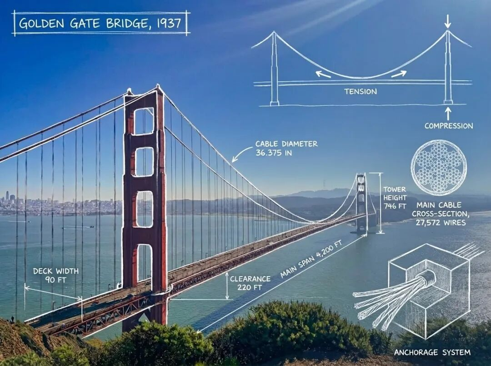

Prompt:

```text
Recreate this image using the parameters from the JSON provided.
{
  "name": "Neon Glass Glow",
  "style": {
    "material": {
      "type": "glass",
      "transparency": 0.92,
      "reflectivity": 1.0,
      "refractionIndex": 1.6,
      "color": "#ff00ff",
      "emission": {
        "color": "#ff66ff",
        "intensity": 0.8
      },
      "surfaceFinish": "glossy",
      "bloom": true,
      "detail": "high"
    },
    "outline": {
      "enabled": true,
      "color": "#ffccff",
      "width": 1.8
    },
    "lighting": {
      "type": "studio",
      "keyLightColor": "#ffffff",
      "keyLightIntensity": 1.0,
      "fillLightColor": "#9900ff",
      "fillLightIntensity": 0.7,
      "rimLightColor": "#00ffff",
      "rimLightIntensity": 0.7,
      "shadows": "crisp"
    },
    "background": {
      "type": "solid",
      "color": "#000000"
    },
    "render": {
      "shadows": true,
      "antiAliasing": true,
      "superSampling": "4x",
      "resolution": "high",
      "depthOfField": {
        "enabled": true,
        "focusDistance": 0.8,
        "blurAmount": 0.1
      }
    }
  }
}
```

### Nano Banana Pro Prompts #10: 动感雕塑

- Category: `3D`
- Model: `Nano Banana Pro`
- Author / Source: [@azed_ai](https://x.com/azed_ai/status/1925490847564669153)
- Image: `assets/thumbs/nano-91.png`

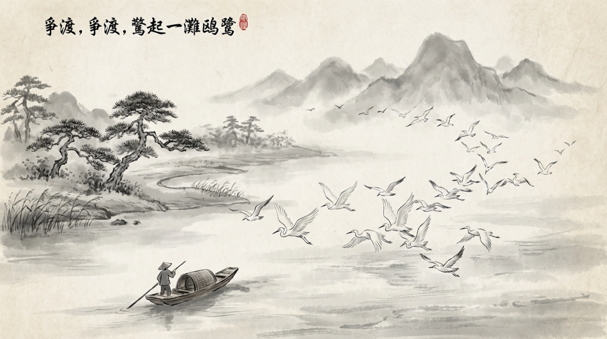

Prompt:

```text
A kinetic sculpture of a [subject], made of interlocking metal rods and panels in brushed [color1] and oxidized [color2]. Suspended in motion, with rotating parts casting mechanical shadows on a concrete pedestal.
```

### Nano Banana Pro Prompts #11: 将您的标志变成毛毡纹理

- Category: `Product`
- Model: `Nano Banana Pro`
- Author / Source: [@alex_prompter](https://x.com/alex_prompter/status/1925460683509899423)
- Image: `assets/thumbs/nano-90.jpeg`


Prompt:

```text
Retexture [BRAND NAME] logo following my JSON aesthetic below:
{
"style": "realistic needle-felted wool sculpture",
"subject_handling": {
"adapt_to_uploaded_image": true,
"preserve_original_shape_and_layout": true,
"preserve_uploaded_color_values": true,
"preserve_text_if_present": true,
"preserve_text_case": true,
"preserve_exact_letterforms": true,
"use_uploaded_image_as_pixel_map": true,
"prevent_color_estimation_or_stylization": true
},
"needle_felting": {
"material_type": "dyed wool fibers matched precisely to uploaded image pixels",
"texture_description": "fluffy soft felt with clear fiber strands",
"construction_style": "needle-felted, light irregularities allowed but no color bleeding",
"color_application_method": "direct color transfer from uploaded image to wool sculpture",
"prevent_auto_saturation_adjustment": true,
"prevent_color_fading": true,
"color_binding_mode": "pixel-level color fidelity per original image"
},
"lighting": {
"lighting_type": "neutral soft studio lighting",
"shadow": "soft, gray-toned shadows under the object only",
"highlight_behavior": "matte highlights only from felt surface — no bloom or color shift"
},
"background": {
"type": "plain matte studio",
"background_color": "pastel tone that contrasts with logo color",
"color_conflict_handling": "auto-adjust background brightness — do not alter logo colors"
},
"camera": {
"focus_style": "macro lens",
"depth_of_field": "shallow — full subject in sharp detail, soft background",
"angle": "frontal or slightly elevated, full subject visible"
},
"post_processing": {
"color_preservation_enforced": true,
"disable_auto-enhancement_or_tinting": true,
"no artistic reinterpretation": true,
"no auto-correction, bloom, or white balance adjustments": true
},
"image_constraints": {
"transparent_background": false,
"aspect_ratio_locked": true,
"include_text_if_present": true,
"preserve_text_case": true,
"preserve_uploaded_color_values": true,
"prevent_shape_or_color_change": true,
"enforce_exact_pixel_color_match_to_uploaded_image": true
},
"notes": "The uploaded image must be converted into a needle-felted wool sculpture using its exact colors and shape. Use pixel-level mapping to apply the uploaded color values to simulated dyed wool fibers. Do not change, brighten, dull, average, or blend colors. Text must remain intact and readable. Background should be soft pastel to contrast the logo — never adjust the logo to fit the scene."
}
```

### Nano Banana Pro Prompts #12: 海洋中三艘不同的奇幻帆船

- Category: `Creative`
- Model: `Nano Banana Pro`
- Author / Source: [@BeanieBlossom](https://x.com/BeanieBlossom/status/1925159751169810806)
- Image: `assets/thumbs/nano-89.jpeg`


Prompt:

```text
Three different fantasy sailboats in the ocean, multiple scenes of beautiful aurora borealis and colorful moons with snowy mountains, a dreamy, fantasy landscape, in the style of digital art.
```

### Nano Banana Pro Prompts #13: AirBnB 任何东西

- Category: `Product`
- Model: `Nano Banana Pro`
- Author / Source: [@R2_fieldworks](https://x.com/R2_fieldworks/status/1924433924106727531)
- Image: `assets/thumbs/nano-88.png`


Prompt:

```text
A highly detailed 3D isometric icon of the following object: [OBJECT]

Style: Airbnb 2024 icon language — miniature diorama / emoji-like object with crisp edges, realistic textures, and soft handcrafted realism.

Material: The object should clearly retains its fundamental qualities but look as if its made from a mixture of matte and plastic-like materials.

View: three-quarter front-left isometric view with a slight top-down angle.

Lighting: soft neutral studio lighting from the top-left with subtle shadows and gentle gloss highlights.

Color palette: retain the fundamental colors from the object and include subtle gradients and no harsh contrasts.

Background: clean white, no drop shadow or noise.

Mood: minimal, charming, utilitarian, premium.

Rendering: hyper-detailed, photorealistic object with depth and tactility, like a designer lifestyle emoji or miniature product model.

Optional Add-on for Replication:  Use the attached photo as a reference for proportions and layout. Do not copy exactly — reinterpret it in the Airbnb icon aesthetic.
```

### Nano Banana Pro Prompts #14: 品牌解锁童年回忆

- Category: `Product`
- Model: `Nano Banana Pro`
- Author / Source: [@TheRelianceAI](https://x.com/TheRelianceAI/status/1925606107608715268)
- Image: `assets/thumbs/nano-87.png`


Prompt:

```text
A realistic, cinematic photograph of a vintage [BRAND NAME] item being gently lifted from a dusty stack of old children's books in a dimly lit attic. The item is designed in classic [BRAND NAME] style—featuring authentic patterns, textures, or logos (e.g. monograms, embossing, or signature motifs relevant to the brand). It is partially opened to reveal a miniature, warmly lit classroom inspired by [COUNTRY] school interiors, complete with small regional-style desks, a chalkboard with delicate handwriting in [LANGUAGE], and traditional local details like shoes, posters, or flags. A paper airplane hovers mid-air. The lighting is moody and nostalgic, with soft shadows and golden highlights suggesting afternoon light filtering through attic beams. On the top book cover at the bottom of the image, the [BRAND NAME] logo is written in an elegant, fountain-pen calligraphy style—subtle, integrated into the scene, and not obscuring the main subject.
```

### Nano Banana Pro Prompts #15: 未来的OpenAI可穿戴设备

- Category: `Creative`
- Model: `Nano Banana Pro`
- Author / Source: [@hc_dsn](https://x.com/hc_dsn/status/1925589916844794154)
- Image: `assets/thumbs/nano-86.png`


Prompt:

```text
Create image with 1:1 ratio A next-gen wearable ai [device type] blending Jony Ive–inspired refined minimalism with a new material and interaction language symbolizing the power ChatGPT. The device is crafted from translucent aerogel fused with polished ceramic titanium, feather-light yet futuristic.  No seams, buttons, or traditional UI. Photographed floating against a pure white background, with a soft, diffused, nearly shadowless studio light.
```

### Nano Banana Pro Prompts #16: 知名戏曲片段的MBTI人格类型卡片

- Category: `Portrait`
- Model: `Nano Banana Pro`
- Author / Source: [@op7418](https://x.com/op7418/status/1925869690120794320)
- Image: `assets/thumbs/nano-85.jpeg`

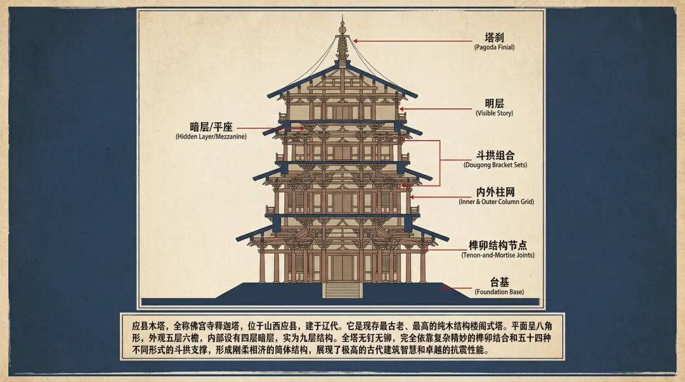

Prompt:

```text
# 任务目标
请生成一张基于中国古代知名戏曲片段的MBTI人格类型卡片图片，使戏曲场景扁平插画的情感内涵与MBTI人格特质相对应。，我需要生成的人各类型是[INTP]

## 内容要求
1. **场景选取**：从中国古代知名戏曲片段中提取能体现不同MBTI人格特质的代表性场景
2. **场景意境**：画面需表现完整戏剧场景，通过场景氛围体现对应的人格特质
3. **服饰真实性**：画面中人物必须穿着对应戏曲的正确戏服
4. **人格对应**：每个场景需精准对应一种MBTI人格类型的核心特质

## 卡片排版设计
参考图片样式：
- **顶部**：MBTI类型代码（如INFJ）
- **中部**：渐变色彩的抽象几何图形作为主视觉
- **底部**：
- 中文人格类型名称（如"提倡者"）
- 英文标语：（如"The world is your oyster"）
- 装饰性边框和星形符号

## 视觉风格
- 采用现代极简设计语言
- 渐变色彩与几何形状结合
- 保持神秘感与艺术性
- 整体色调柔和梦幻

## 技术规格
- 卡片尺寸采用标准比例
- 每张卡片需清晰标注MBTI类型代码
- 保持系列视觉一致性
```

### Nano Banana Pro Prompts #17: 渐变挤出Google I/O 2025大会视觉效果

- Category: `Portrait`
- Model: `Nano Banana Pro`
- Author / Source: [@hckmstrrahul](https://x.com/hckmstrrahul/status/1925567579856453701)
- Image: `assets/thumbs/nano-84.jpeg`


Prompt:

```text
Retexture this image in the following JSON style aesthetic:
{
  "styleAesthetic": {
    "title": "Isometric Multicolor Extrusion with Grid Control",
    "overallVibe": "Playful modern 3D iconography with directional extrusion and dynamic isometric grids",
    "viewAngle": {
      "type": "Isometric",
      "facingDirection": "right",  // options: left, right, front
      "rotationDegrees": {
        "x": 30,
        "y": 30
      }
    },
    "renderingStyle": "Clean 3D extruded vector with soft lighting and high contrast between faces",
    "objectSurface": {
      "frontFace": {
        "color": "#ffffff",
        "material": "Matte white plastic",
        "lighting": "Soft diffuse"
      },
      "extrudedSide": {
        "type": "Multicolor gradient",
        "gradientStyle": "Diagonal sweep",
        "colorStops": [
          "#ff0040", "#ff8000", "#ffff00", "#00ff90", "#00cfff", "#8000ff"
        ],
        "material": "Glossy plastic",
        "lighting": "Ambient with light falloff"
      }
    },
    "extrusion": {
      "direction": "right",  // determines which side is extruded: left, right, front
      "depth": "moderate"
    },
    "shadows": {
      "type": "Drop shadow",
      "direction": "bottom-right",
      "opacity": 0.15,
      "blurRadius": "6px"
    },
    "background": {
      "type": "Isometric grid",
      "color": "#ffffff",
      "gridStyle": {
        "lineColor": "#e0e0e0",
        "lineWeight": "1px",
        "orientation": "opposite-extrusion"  // automatically flips grid lines to oppose the extrusion direction
      }
    },
    "moodKeywords": [
      "Dimensional",
      "Clean",
      "Geometric",
      "Colorful",
      "Tactile",
      "Structured"
    ]
  }
}
```

### Nano Banana Pro Prompts #18: Glitch 矢量徽标样式

- Category: `Product`
- Model: `Nano Banana Pro`
- Author / Source: [@Artedeingenio](https://x.com/Artedeingenio/status/1925844468294365289)
- Image: `assets/thumbs/nano-83.png`

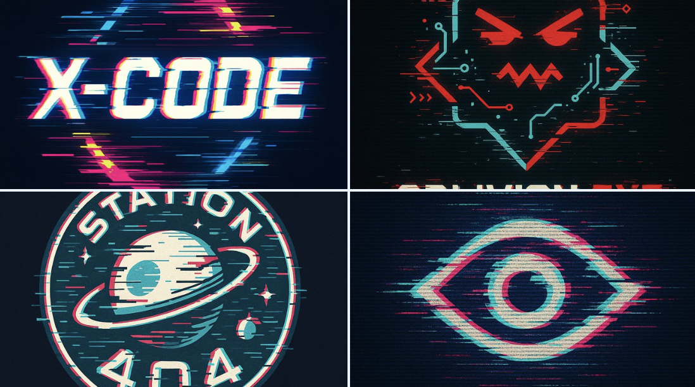

Prompt:

```text
A bold vector logo design in glitch art style, featuring distorted typography with RGB color channel shifts, fragmented lines, misaligned edges, digital noise effects, and a cyberpunk aesthetic. The logo appears corrupted or hacked, as if captured from a malfunctioning screen. Use a black or dark background for contrast, neon or high-saturation color palette, and sharp angular forms.
```

### Nano Banana Pro Prompts #19: 霓虹花卉和谐插图

- Category: `Illustration`
- Model: `Nano Banana Pro`
- Author / Source: [@LudovicCreator](https://x.com/LudovicCreator/status/1926246931661042132)
- Image: `assets/thumbs/nano-82.png`

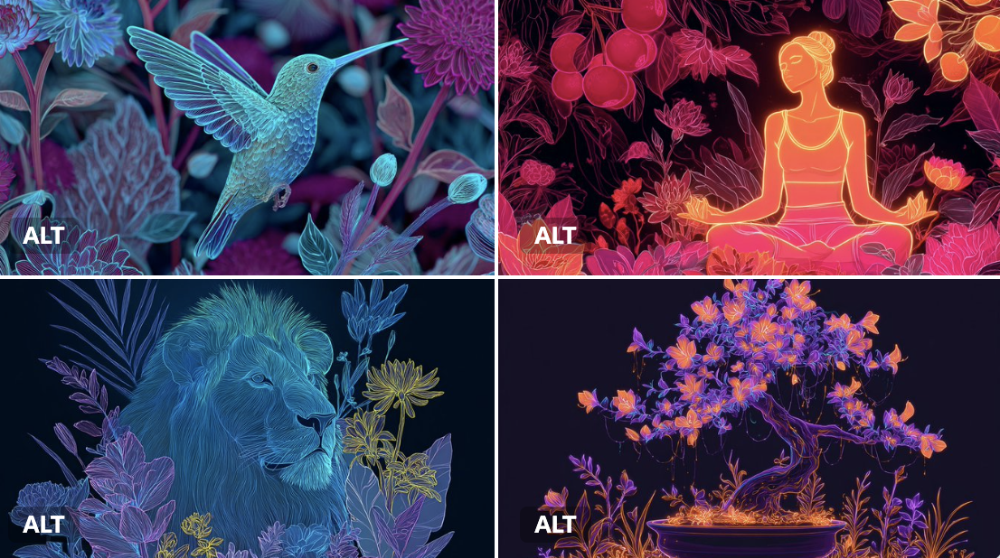

Prompt:

```text
A Neon Floral Harmony illustration of [SUBJECT], with flowers and plants outlined in glowing neon hues. Use vibrant [COLOR1] and [COLOR2] to create a serene yet electrifying botanical scene
```

### Nano Banana Pro Prompts #20: 品牌乐器

- Category: `Product`
- Model: `Nano Banana Pro`
- Author / Source: [@TheRelianceAI](https://x.com/TheRelianceAI/status/1926148686884606257)
- Image: `assets/thumbs/nano-81.png`

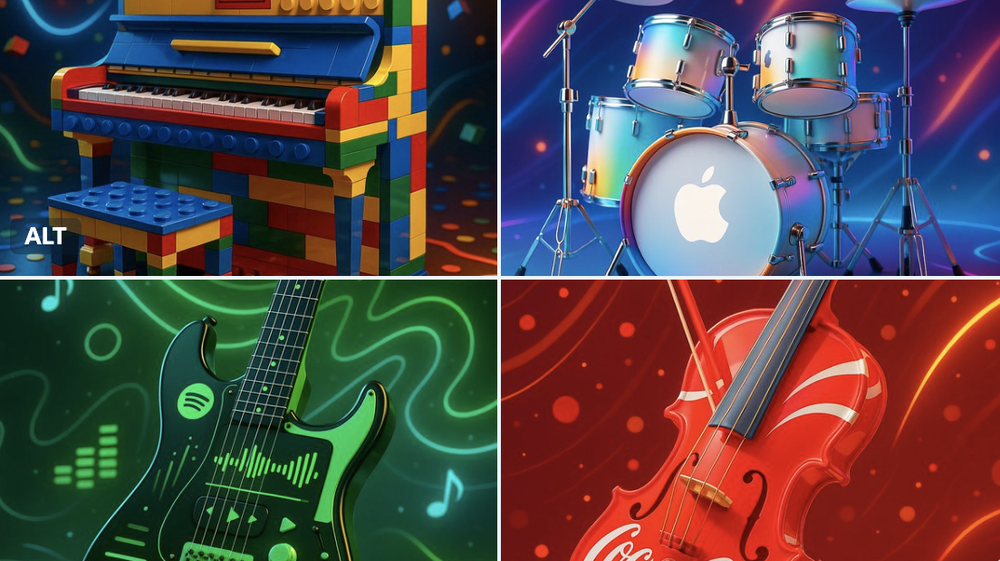

Prompt:

```text
A highly stylized and vibrant promotional image of a [INSTRUMENT] designed in the visual style of the [BRAND] brand — the instrument is reimagined with iconic colors, patterns, and aesthetic elements of the brand. Set in a dynamic, music-inspired environment, with glowing accents, product-style lighting, and joyful energy. Artistic fusion of music and design. 3D render look, high detail, vibrant colors, futuristic but playful.
```

### Nano Banana Pro Prompts #21: 水果的形状

- Category: `Portrait`
- Model: `Nano Banana Pro`
- Author / Source: [@umesh_ai](https://x.com/umesh_ai/status/1926182194159972503)
- Image: `assets/thumbs/nano-80.jpeg`


Prompt:

```text
Create an image by arranging [NUMBER/AGGREGATE] of [FRUIT] strategically on a dark surface to form the shape of [OBJECT/EMOJI/LOGO]
```

### Nano Banana Pro Prompts #22: Alloy图标

- Category: `Portrait`
- Model: `Nano Banana Pro`
- Author / Source: [@hc_dsn](https://x.com/hc_dsn/status/1926095406871568670)
- Image: `assets/thumbs/nano-79.jpeg`

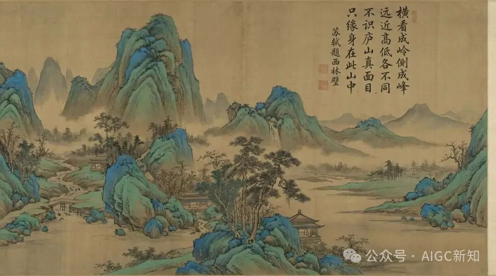

Prompt:

```text
create image with 1: 1 ratio
turn a vector [ type
] icon with the following json style
{
    "object": "icon",
    "material": {
        "primary_surface": "smooth matted translucent metallic",
        "finish": "iridescent sheen",
        "color_profile": {
            "base_color": "deep blue",
            "secondary_tones": [
                "black",
                "violet",
                "copper-orange highlights"
            ]
        },
        "panel_lines": {
            "material": "metallic copper",
            "visual_treatment": "glowing edge with subtle bevel"
        },
    },
    "lighting": {
        "type": "studio",
        "key_light": {
            "position": "top-left",
            "effect": "smooth gradient highlight across the surface"
        },
        "rim_light": {
            "position": "right side",
            "effect": "sharp metallic edge glow"
        },
        "reflections": {
            "character": "diffused but iridescent, hinting at a highly polished or lacquered surface"
        },
        "shadows": "soft edge, minimal ground contact due to floating presentation"
    },
    "background": {
        "color": "#FFF",
        "style": "solid matte",
    },
    "composition": {
        "camera_angle": "centered, eye-level",
        "depth_of_field": "none (sharp focus throughout)",
        "presentation": "floating, isolated subject"     "angle": "isometric style"
    },
    "visual_style": {
        "tone": "modern, high-impact",
        "inspiration": "sports branding meets futuristic product design",
        "aesthetic": "bold contrast, tech-luxury fusion"
    }
}
```

### Nano Banana Pro Prompts #23: 毛绒形式表情符号

- Category: `Portrait`
- Model: `Nano Banana Pro`
- Author / Source: [@alban_gz](https://x.com/alban_gz/status/1925833589431619616)
- Image: `assets/thumbs/nano-78.png`

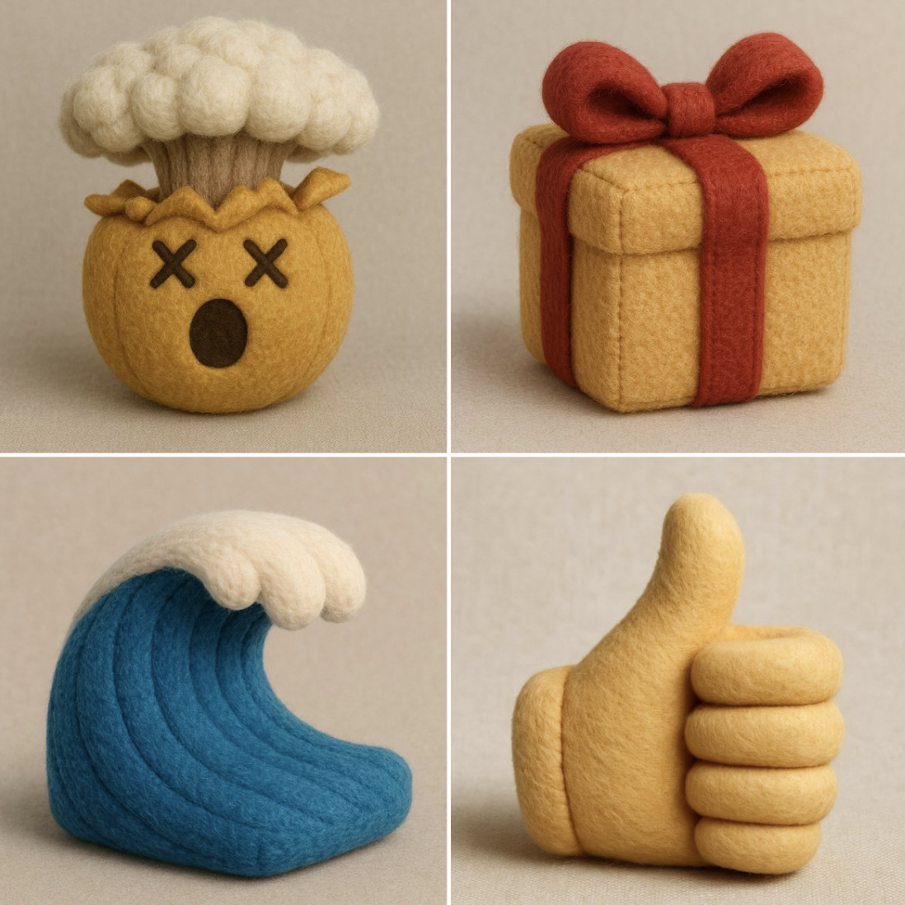

Prompt:

```text
Recreate this [insert emoji] using the parameters from the JSON provided.
{
  "style": "Plushform Emoji",
  "description": "Transform the emoji into a soft, realistic plush object with high-quality fabric and detailed construction. Do not anthropomorphize the emoji — avoid adding faces or cartoon features. Focus on accurate textures, natural forms, and subtle design to give the plush object character.",
  "features": {
    "shape": "matching the emoji's form, with soft, slightly rounded plush adaptation",
    "texture": "realistic plush fabric with visible fiber detail and natural fabric folds",
    "color": "faithful to the emoji's palette, using slightly muted, tactile tones",
    "material": "stuffed toy fabric with visible stitching, seams, and high-quality finishing",
    "background": "neutral or softly textured to emphasize the plush object's form",
    "lighting": "soft professional studio lighting with subtle shadows and depth"
  },
  "examples": [
    "👌 becomes a plush hand in the OK gesture, with realistic fabric folds and seams.",
    "🎯 becomes a soft plush bullseye with layered fuzzy rings and slight dimensional padding.",
    "🎁 becomes a cube-shaped plush box with fabric ribbon, visible stitching, and realistic fabric texture.",
    "🌊 becomes a wave-shaped plush with curled foam tips, crafted in textured ocean blue fabrics."
  ]
}
```

### Nano Banana Pro Prompts #24: 3D零食卡通世界

- Category: `Product`
- Model: `Nano Banana Pro`
- Author / Source: [@aziz4ai](https://x.com/aziz4ai/status/1925895453217898847)
- Image: `assets/thumbs/nano-77.jpeg`


Prompt:

```text
A 3D-rendered digital illustration featuring a retro-style food truck inspired by the brand [INSERT BRAND NAME], designed with smooth pastel colors and soft textures. A black-and-white cartoon character stands beside the truck, holding a product that visually represents the brand. The environment reflects the brand’s world—playful hills, trees, and skies stylized with its color palette and product shapes. The brand’s logo is clearly displayed on the truck, and a short slogan appears naturally within the scene. Format: 1:1, isometric view, cinematic lighting, clean and joyful composition.
```

### Nano Banana Pro Prompts #25: 黑白漫画风格插图

- Category: `Portrait`
- Model: `Nano Banana Pro`
- Author / Source: [@CharaspowerAI](https://x.com/CharaspowerAI/status/1923778050845528388)
- Image: `assets/thumbs/nano-76.png`


Prompt:

```text
Highly dramatic and epic black and white manga-style illustration of [Your character and description].  Powerful, dynamic pose, exaggerated features emphasizing the intensity of the scene. Background with explosive energy bursts, lightning effects, and a whirlwind of debris
```

### Nano Banana Pro Prompts #26: 可爱干净的底座立体模型

- Category: `3D`
- Model: `Nano Banana Pro`
- Author / Source: [@CharaspowerAI](https://x.com/CharaspowerAI/status/1925593447802540408)
- Image: `assets/thumbs/nano-75.png`


Prompt:

```text
Highly detailed 3D-rendered chibi figurine diorama of [Character A] and [Character B], captured in a [scene/action], inside a [thematic display case shape] with [material]. The background features [visual effects: debris, aura, lightning, scenery], dynamic pose. The title "[custom phrase]" is embossed at the top in [font/style], matching the tone. Lighting is [studio, cinematic, ambient], color palette of [main colors]. Designed in a collectible, stylized, viral-friendly aesthetic.
```

### Nano Banana Pro Prompts #27: 3D可爱粉彩粘土图标

- Category: `3D`
- Model: `Nano Banana Pro`
- Author / Source: [@icreatelife](https://x.com/icreatelife/status/1926014358783430945)
- Image: `assets/thumbs/nano-74.png`

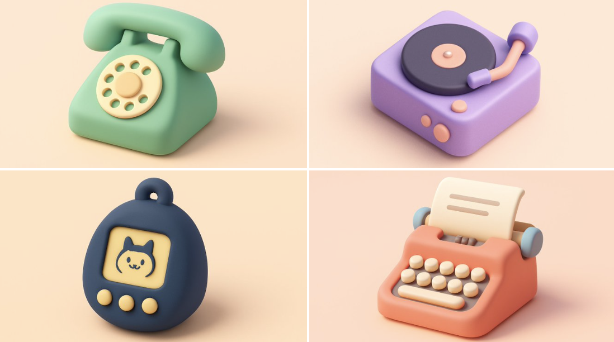

Prompt:

```text
Tiny cute isometric [smiling - optional] [OBJECT] emoji, shape, soft lighting, soft pastel colors, [COLOR], 3d icon clay render, blender 3d, pastel background
```

### Nano Banana Pro Prompts #28: 有趣的毛茸茸字母

- Category: `Portrait`
- Model: `Nano Banana Pro`
- Author / Source: [@Anima_Labs](https://x.com/Anima_Labs/status/1925933980781535629)
- Image: `assets/thumbs/nano-73.png`

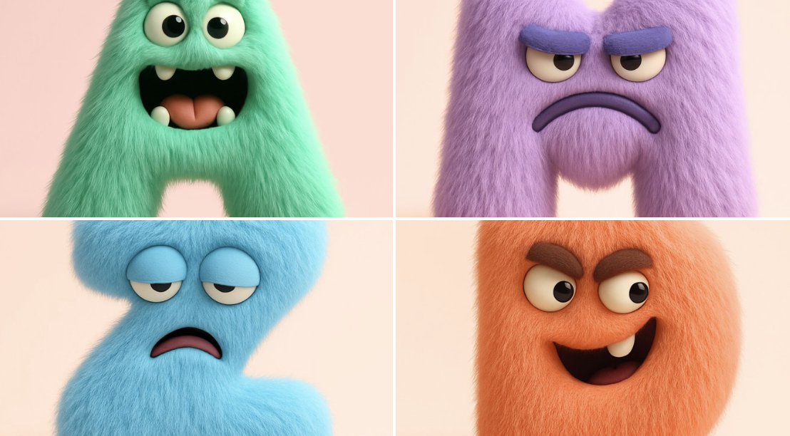

Prompt:

```text
A highly realistic 3D render of the letter [A-Z] designed as a full-body fluffy monster. The letter shape itself is the creature’s body — no separate head or limbs. The eyes, mouth, and other monster features are embedded naturally into the letter form. The monster expresses a [mischievous / grumpy / shy / joyful / sleepy / surprised / confident] emotion through its eyes and mouth shape. The texture is dense, soft, and realistic fur, with subtle volume and shadow. The color palette is bold but clean — solid vibrant tones like mint, lilac, sky blue, or coral (avoid rainbow gradients). Studio lighting on a simple pastel background. No hats, no party props — just a minimal, high-quality character design with playful expression.
```

### Nano Banana Pro Prompts #29: 超现实主义油画

- Category: `Creative`
- Model: `Nano Banana Pro`
- Author / Source: [@azed_ai](https://x.com/azed_ai/status/1926217150093549680)
- Image: `assets/thumbs/nano-72.png`


Prompt:

```text
A surreal oil painting of a [subject], executed in the style of early 20th-century dreamscapes. Melting shapes, floating forms, and swirling [color1] and [color2] brushstrokes create a dreamlike dissonance.
```

### Nano Banana Pro Prompts #30: 景观洞穴入口的形状

- Category: `Creative`
- Model: `Nano Banana Pro`
- Author / Source: [@umesh_ai](https://x.com/umesh_ai/status/1925819339413836010)
- Image: `assets/thumbs/nano-71.png`

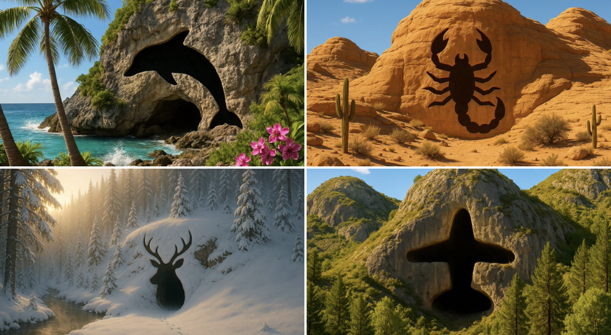

Prompt:

```text
Prompt: An image of a [TYPE] landscape, featuring a cave entrance that is shaped exactly like the outline of a [SHAPE]. The cave should blend naturally into the rugged terrain of the mountain, with the entrance forming a clear and unmistakable [SHAPE] shape. This [SHAPE] shape should be simple and defined, without intricate details, emphasizing just the overall [SHAPE] outline. The surrounding environment should include [DETAILS], but these elements should not distract from the cave's   [SHAPE]-shaped entrance. The lighting in the scene should enhance the visibility and distinctiveness of the [SHAPE]-shaped cave entrance.
```

### Nano Banana Pro Prompts #31: 重新构想的玫瑰金

- Category: `Product`
- Model: `Nano Banana Pro`
- Author / Source: [@aziz4ai](https://x.com/aziz4ai/status/1925933649267970074)
- Image: `assets/thumbs/nano-70.jpeg`

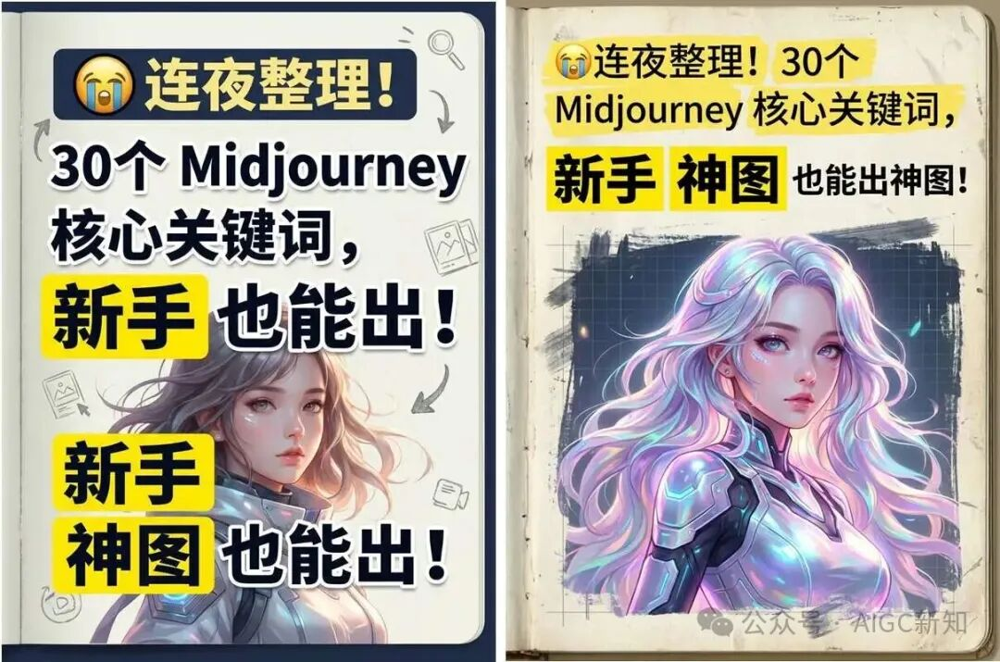

Prompt:

```text
Design a luxury-themed 1:1 image featuring a rose gold sculpture that embodies the essence of the jewelry brand “[BRAND NAME]”. The object must symbolically reflect the brand’s identity (e.g., falcon for Cartier, ring for Tiffany & Co., palm tree for Swarovski, camel for Prada). Embed premium crystal textures into key parts of the sculpture (e.g., wings, gem, leaves, or hump) to match the brand’s signature elegance. Use the brand’s iconic background color (e.g., Tiffany Blue, Swarovski White, Cartier Beige, Prada Sand) and place the official logo beneath the sculpture. Add a bold two-word slogan that aligns with the brand’s tone. Lighting should be pure white with high Kelvin value to ensure clarity and prevent yellow tint. The result must feel editorial, artistic, and visually exquisite.
```

### Nano Banana Pro Prompts #32: 品牌折叠纸

- Category: `Product`
- Model: `Nano Banana Pro`
- Author / Source: [@HBCoop_](https://x.com/HBCoop_/status/1925600123200881024)
- Image: `assets/thumbs/nano-69.png`


Prompt:

```text
A flat branded paper folds itself into the full 3D shape of a [insert product or item, e.g. “Coca-Cola bottle”, “Nike sneaker”, “Big Mac”], mid-motion.

The paper colors match the [insert brand name] brand’s signature palette and the natural colors of the item (e.g., [describe key colors or ingredients, like “red and white for Coca-Cola”, “brown, green, yellow for Big Mac”]).

Dramatic studio lighting, origami texture detail, soft gradient shadows. Stylized with Japanese minimalism and elegant negative space. The scene captures a clean, elevated transformation from flat brand identity into sculptural product form.
```

### Nano Banana Pro Prompts #33: 透明容器里有一个微型的3D世界

- Category: `Portrait`
- Model: `Nano Banana Pro`
- Author / Source: [@KoppulaMahende9](https://x.com/KoppulaMahende9/status/1920442464810270851)
- Image: `assets/thumbs/nano-68.png`


Prompt:

```text
A giant [transparent or glossy] [object/container] with a miniature 3D diorama inside it, depicting [a symbolic or narrative scene], studio-lit with soft shadows, placed on a neutral matte surface. Emphasize visual contrast between the scale of the capsule and the detail within. Highlight texture, light refraction, and emotional tone (e.g., surreal, poetic, or sci-fi).
```

### Nano Banana Pro Prompts #34: 可爱微缩场景

- Category: `Portrait`
- Model: `Nano Banana Pro`
- Author / Source: [@ZHO_ZHO_ZHO](https://x.com/ZHO_ZHO_ZHO/status/1925878276133708224)
- Image: `assets/thumbs/nano-67.jpeg`


Prompt:

```text
{
    "style": "miniature handcrafted diorama",
    "material": "tree branches, cardboard, clay, moss, dried flowers, paper",
    "surface_texture": "organic, rough and varied (wood grain, soft moss, paper texture)",
    "lighting": {
        "type": "soft ambient natural light",
        "intensity": "low to moderate",
        "direction": "diffused overhead",
        "accent_colors": [
            "forest green",
            "earth brown",
            "soft beige",
            "muted pink"
        ],
        "reflections": false,
        "refractions": false,
        "dispersion_effects": false,
        "bloom": false
    },
    "color_scheme": {
        "primary": "natural greens and browns",
        "secondary": "soft neutral tones (cardboard, clay, paper)",
        "highlights": "light falling on the open book and cat’s glasses",
        "rim_light": "subtle natural edge light from the forest opening"
    },
    "background": {
        "color": "natural moss green",
        "vignette": false,
        "texture": "moss and dried floral structure"
    },
    "post_processing": {
        "chromatic_aberration": false,
        "glow": false,
        "high_contrast": false,
        "sharp_details": true,
        "film_grain": false
    },
    "form_composition": {
        "scene_elements": [
            "a small girl sitting on a balcony holding an open miniature book",
            "a cat with glasses observing the book's illustrations",
            "a treehouse made from twigs, cardboard, and clay",
            "balcony and surrounding forest made of moss and dried flowers"
        ],
        "scale": "miniature",
        "theme": "childlike wonder and storytelling in a handcrafted world",
        "visual_metaphor": [
            "curiosity",
            "quiet companionship",
            "imagination in nature"
        ]
    },
    "metadata": {
        "artist": "-Zho-",
        "series": "ZH4O"
    }
}
```

### Nano Banana Pro Prompts #35: 霓虹灯风格工具

- Category: `Portrait`
- Model: `Nano Banana Pro`
- Author / Source: [@egeberkina](https://x.com/egeberkina/status/1926005869331849235)
- Image: `assets/thumbs/nano-66.png`

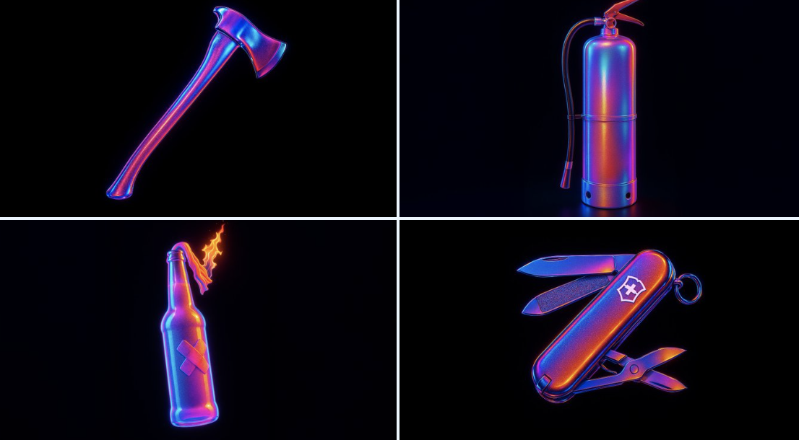

Prompt:

```text
retexture the image attached based on the JSON aesthetic below
{
  "style": "hyperrealistic 3D render",
  "material": "high-gloss translucent rubber with iridescent coating",
  "surface_texture": "fine-grain pebbling with micro-specular highlights",
  "lighting": {
    "type": "studio HDRI",
    "intensity": "high",
    "direction": "multi-point with rim and backlight",
    "colors": ["electric blue", "magenta", "neon purple", "sunset orange"],
    "glow_effect": true,
    "chromatic_aberration": true,
    "bloom": true
  },
  "color_scheme": {
    "primary": "iridescent gradient",
    "highlights": "white light core reflections",
    "accent_edges": "black outlines with subtle glow"
  },
  "background": {
    "color": "solid black",
    "texture": "none",
    "contrast": "extreme to enhance subject glow"
  },
  "camera": {
    "angle": "straight-on center view",
    "focus": "sharp foreground, no depth blur",
    "lens": "macro with light distortion"
  },
  "post_processing": {
    "glow": true,
    "contrast_boost": true,
    "color_grading": "vibrant spectrum",
    "noise": "minimal"
  }
}
```

### Nano Banana Pro Prompts #36: 皱巴巴的纸片

- Category: `Photography`
- Model: `Nano Banana Pro`
- Author / Source: [@umesh_ai](https://x.com/umesh_ai/status/1925868463689462049)
- Image: `assets/thumbs/nano-65.jpeg`


Prompt:

```text
A photorealistic image of the word '[NAME]' spelled out using torn, highly crumpled pieces of white paper. Each letter is painted in bold [COLOR] on individual scraps, arranged loosely and unevenly, as if placed casually by hand, on a wooden table. The composition should convey a natural, handmade aesthetic with visible creases, shadows, and wood grain detail
```

### Nano Banana Pro Prompts #37: 洞壁画

- Category: `Creative`
- Model: `Nano Banana Pro`
- Author / Source: [@azed_ai](https://x.com/azed_ai/status/1925854528831643689)
- Image: `assets/thumbs/nano-64.png`

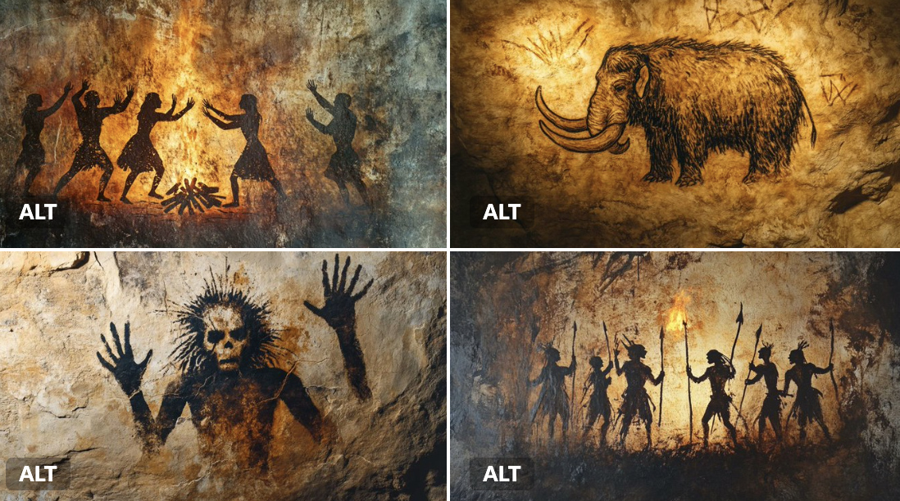

Prompt:

```text
A cave painting of a [subject], rendered with primitive ochres and charcoal lines on a rough stone wall. Smudged handprints, crude geometry, and flickering torchlight add a primal, ancient mood.
```

### Nano Banana Pro Prompts #38: 选择你的阵营

- Category: `Poster`
- Model: `Nano Banana Pro`
- Author / Source: [@aziz4ai](https://x.com/aziz4ai/status/1925595213726097803)
- Image: `assets/thumbs/nano-63.jpeg`


Prompt:

```text
A dramatic cinematic scene featuring two rival products placed side by side in a custom-designed environment that visually reflects their identities. The composition should include high contrast lighting, atmospheric effects like mist, fog, or neon glow, and hyper-detailed textures. Incorporate a powerful 3D slogan below or behind the products in bold stylized typography that fits the scene’s mood. The products must reflect the essence of [Brand A] and [Brand B] through color, lighting, and placement. Ultra-realistic, moody tones, 1:1 square format, with sharp depth of field and high resolution.
```

### Nano Banana Pro Prompts #39: 品牌设计指南海报

- Category: `Product`
- Model: `Nano Banana Pro`
- Author / Source: [@ai4everyday](https://x.com/ai4everyday/status/1925838516979646795)
- Image: `assets/thumbs/nano-62.jpeg`

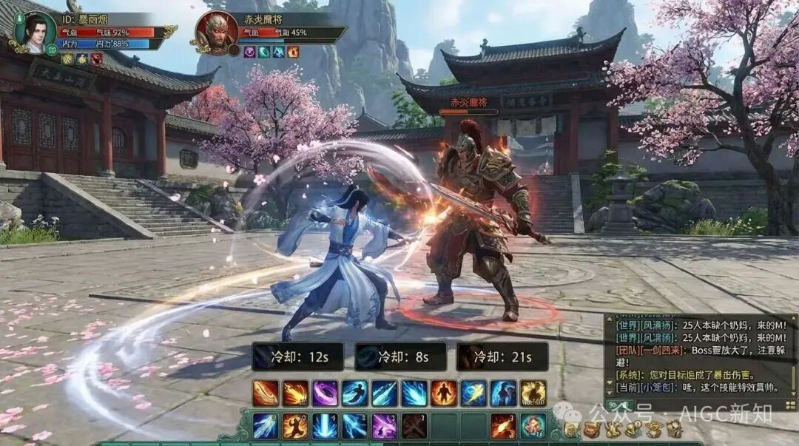

Prompt:

```text
Create a vertical 9:16 brand design guide poster using the uploaded product image. Adapt the design style to match the product’s niche and visual identity. Structure the poster with clear, elegant sections: (1) Large logo display and safe zone usage, (2) Product mockup centered and highlighted, (3) Primary and secondary color palette swatches with hex codes, (4) Typography guide with heading, subheading, body font samples, and line spacing specs, (5) Iconography or graphic motif examples used by the brand, (6) Image treatment style with sample lifestyle or studio visuals, (7) Grid system or layout rules, (8) Packaging mockups and surface applications, (9) Do’s & Don’ts with annotated visuals. Use minimalist white or soft neutral background with structured layout dividers and drop shadows. The result must be visually rich, clean, and suitable for a printed or digital brand book.
```

### Nano Banana Pro Prompts #40: 破碎的真相

- Category: `Portrait`
- Model: `Nano Banana Pro`
- Author / Source: [@TheRelianceAI](https://x.com/TheRelianceAI/status/1925918144163450890)
- Image: `assets/thumbs/nano-61.png`

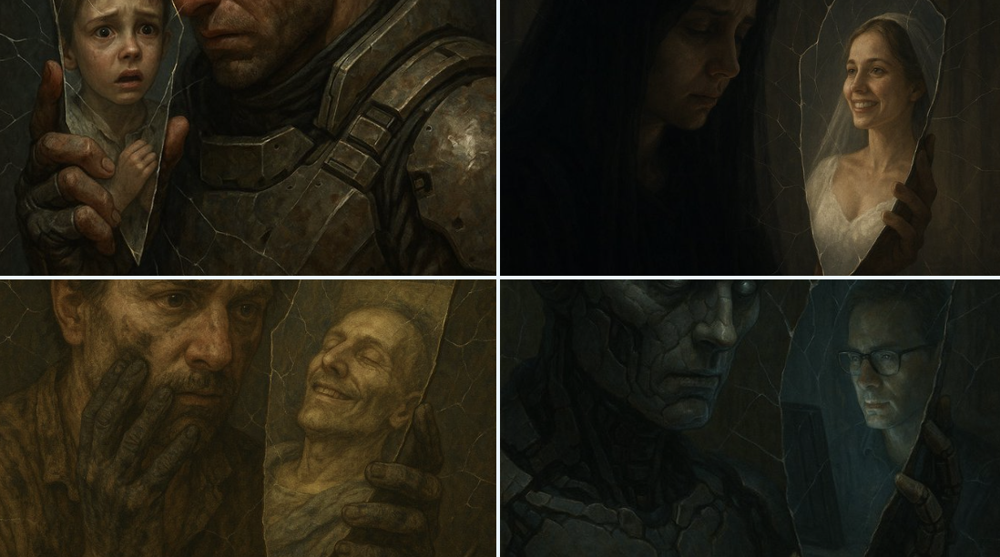

Prompt:

```text
A close-up of [SUBJECT 1] holding a mirror shard to their face. The shard reflects a completely different [SUBJECT 2]. Around them, small cracks spread through the air like fractures in invisible glass, warping the space itself.
```

### Nano Banana Pro Prompts #41: 令人垂涎欲滴的广告

- Category: `Product`
- Model: `Nano Banana Pro`
- Author / Source: [@aziz4ai](https://x.com/aziz4ai/status/1925470550035476622)
- Image: `assets/thumbs/nano-60.jpeg`

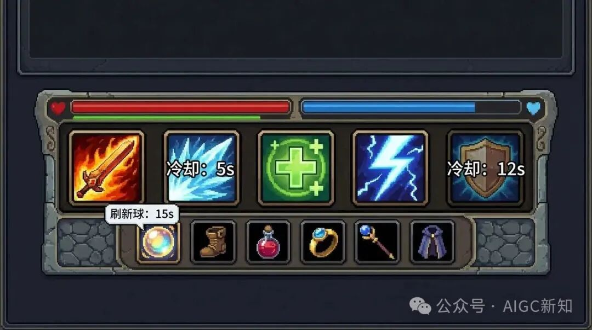

Prompt:

```text
a vertical 2:3 high-resolution food advertisement featuring the most iconic and delicious product from a well-known brand called [INSERT BRAND NAME]. The product appears centered with mouthwatering details — such as melted cheese, dripping chocolate, whipped cream, or condensation — depending on the product. The background should be a gradient or pastel tone inspired by the brand’s identity. At the top, display a bold slogan in a color that matches the brand’s style. At the bottom, include the official logo of the brand. Use cinematic studio lighting, soft shadows, and ultra-sharp textures to create a visually irresistible and minimal poster.
```

### Nano Banana Pro Prompts #42: 军事计划

- Category: `Creative`
- Model: `Nano Banana Pro`
- Author / Source: [@B_4AI](https://x.com/B_4AI/status/1925479609442738486)
- Image: `assets/thumbs/nano-59.png`

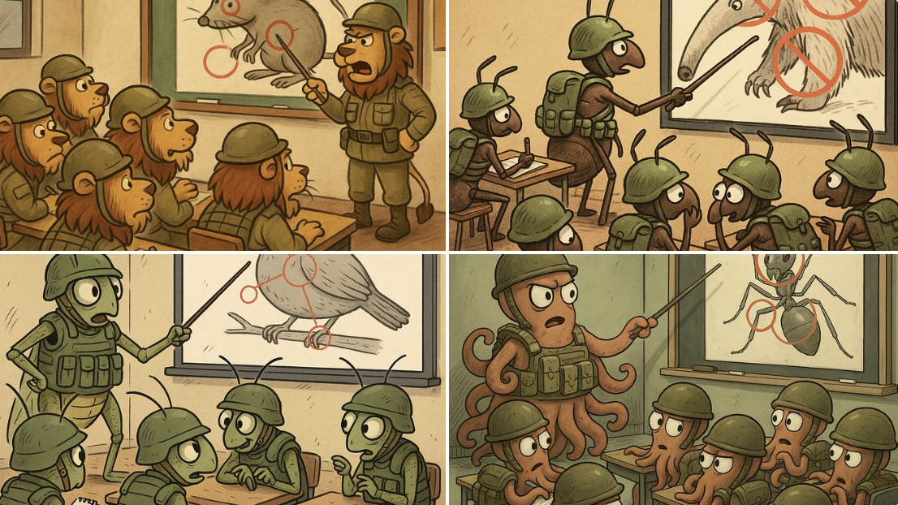

Prompt:

```text
A humorous cartoon scene set inside a military training classroom, featuring a group of [Insect Name] soldiers sitting at desks, wearing tiny helmets and miniature combat gear. They listen attentively to their commander, who stands in front of a large board displaying a sketch of a threat to their existence — the enemy changes depending on the animal or insect. The commander explains the attack plan using a pointer, highlighting sensitive targets with red circles. Some soldiers take notes, others whisper tactical ideas to each other. The overall atmosphere blends seriousness with satire in an exaggerated cartoon style.
```

### Nano Banana Pro Prompts #43: 血月下的决斗

- Category: `Photography`
- Model: `Nano Banana Pro`
- Author / Source: [@B_4AI](https://x.com/B_4AI/status/1925509492298375388)
- Image: `assets/thumbs/nano-58.png`


Prompt:

```text
[SUBJECT] in a cinematic painting, battling amid crumbling ruins under a colossal blood moon — ambient sparks flying. Set in an ancient valley, illuminated by firelight and shadows. soft [COLOR1] and vibrant [COLOR2], mood intense and epic.
```

### Nano Banana Pro Prompts #44: 手工毛线纹理

- Category: `Product`
- Model: `Nano Banana Pro`
- Author / Source: [@ecommartinez](https://x.com/ecommartinez/status/1925272798479405479)
- Image: `assets/thumbs/nano-57.png`


Prompt:

```text
Crea un render 3D fotorrealista de este logo hecho con hilo grueso y tejido a mano. El hilo debe parecer suave, esponjoso y de gran tamaño, con patrones visibles de tejido como bucles, giros y trenzas. Usa colores brillantes y saturados, estética cálida. Resalta la textura de las fibras, la suavidad del material y el acabado artesanal. Iluminación de estudio suave. Fondo blanco o crema limpio. El logo debe estar centrado y sin elementos adicionales. Cuadrado.
```

### Nano Banana Pro Prompts #45: 玻璃盒内的图像可视化

- Category: `3D`
- Model: `Nano Banana Pro`
- Author / Source: [@umesh_ai](https://x.com/umesh_ai/status/1925462472825442469)
- Image: `assets/thumbs/nano-56.jpeg`

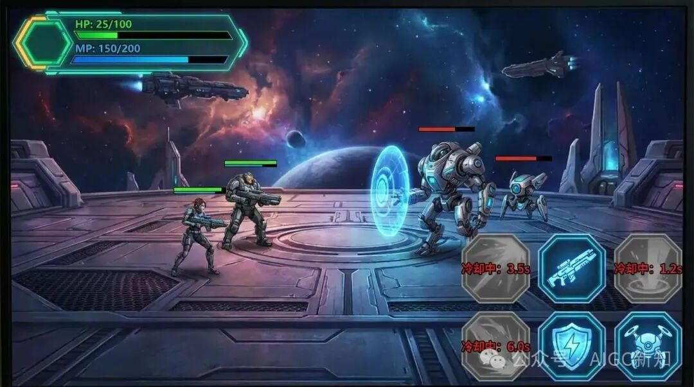

Prompt:

```text
photorealistic image of a [COLOR] 3D [SUBJECT] encased in a luxurious transparent box, viewed from an enhanced side angle to better reveal the 3D shape of the [SUBJECT]. The box should be white, exquisitely designed, featuring crystal-clear glass with refined, sharp edges
```

### Nano Banana Pro Prompts #46: 彩色卡通俏皮图标和徽标

- Category: `Product`
- Model: `Nano Banana Pro`
- Author / Source: [@gnrlyxyz](https://x.com/gnrlyxyz/status/1925553233881145499)
- Image: `assets/thumbs/nano-55.jpeg`


Prompt:

```text
Create a 2D digital illustration of the [FIREFOX] logo in a colorful cartoon style with bold black outlines. The icon design should feature playful, vibrant solid colors such as pink, teal, orange, yellow, and purple, applied in a flat, bold way. Give the shapes a slightly exaggerated, bubbly form with rounded edges and fun details like starbursts, stripes, or spark effects if relevant. Keep the illustration simple and stylized with a hand-drawn look. Use thick outlines to emphasize form. Vector friendly. White background. Square aspect ratio.
```

### Nano Banana Pro Prompts #47: 三种形状和三种颜色

- Category: `Creative`
- Model: `Nano Banana Pro`
- Author / Source: [@umesh_ai](https://x.com/umesh_ai/status/1925569394924740817)
- Image: `assets/thumbs/nano-54.jpeg`


Prompt:

```text
Create a minimalist image of a [SUBJECT] using three geometric shapes, using a different color in each shape
```

### Nano Banana Pro Prompts #48: 由鲜花组成的小房子

- Category: `Creative`
- Model: `Nano Banana Pro`
- Author / Source: [@BeanieBlossom](https://x.com/BeanieBlossom/status/1925461720639971505)
- Image: `assets/thumbs/nano-53.jpeg`


Prompt:

```text
A small house made of flowers, a tree with colorful leaves growing on top and around the door, in the style of fantasy, mountainscape in the background, natural lighting, soft colors, rich details, and a full atmosphere, subtle painterly style
```

### Nano Banana Pro Prompts #49: 终极跨界

- Category: `Product`
- Model: `Nano Banana Pro`
- Author / Source: [@TheRelianceAI](https://x.com/TheRelianceAI/status/1925146916133712191)
- Image: `assets/imported/xianyu110/awesome-nanobananapro-prompts/100-1-100-TheRelianceAI-https-x.com-TheRelianceAI-status-1925146916133712191.png`

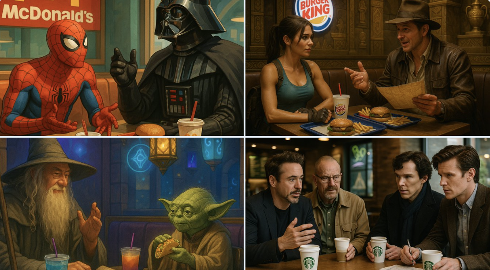

Prompt:

```text
Imagine [CHARAKTER 1] and [Charakter 2] casually sitting together at a table in a [FAST FOOD BRAND] restaurant. The atmosphere is relaxed and light-hearted, with the two characters engaged in an amusing or deep conversation over trays of food and drinks.
```

### Nano Banana Pro Prompts #50: 玩具盒中的历史

- Category: `3D`
- Model: `Nano Banana Pro`
- Author / Source: [@TheRelianceAI](https://x.com/TheRelianceAI/status/1925223613055017251)
- Image: `assets/imported/xianyu110/awesome-nanobananapro-prompts/100-2-99-TheRelianceAI-https-x.com-TheRelianceAI-status-1925223613055017251.png`


Prompt:

```text
An ultra-realistic top-down photograph of a 3D-printed diorama inside a beige cardboard box, with the lid being held open by two human hands. The interior of the box reveals a miniature landscape of [COUNTRY NAME], featuring iconic landmarks, terrain, buildings, rivers, vegetation, and crowds of tiny, detailed human figures. The diorama is filled with vibrant, geographically appropriate elements, all crafted in a tactile, toy-like style using matte 3D-printed textures with visible layer lines. At the top, the inside of the box lid displays the phrase “[COUNTRY NAME]” in large, colorful, raised plastic letters—each letter in a different bright color. The lighting is warm and cinematic, highlighting the textures and shadows to evoke a sense of realism and charm, as if the viewer is opening a magical miniature version of the natio
```

### Nano Banana Pro Prompts #51: 3D卡通雕塑风格

- Category: `Product`
- Model: `Nano Banana Pro`
- Author / Source: [@aziz4ai](https://x.com/aziz4ai/status/1925301120252924356)
- Image: `assets/imported/xianyu110/awesome-nanobananapro-prompts/100-3-98-3D-aziz4ai-https-x.com-aziz4ai-status-1925301120252924356.jpeg`

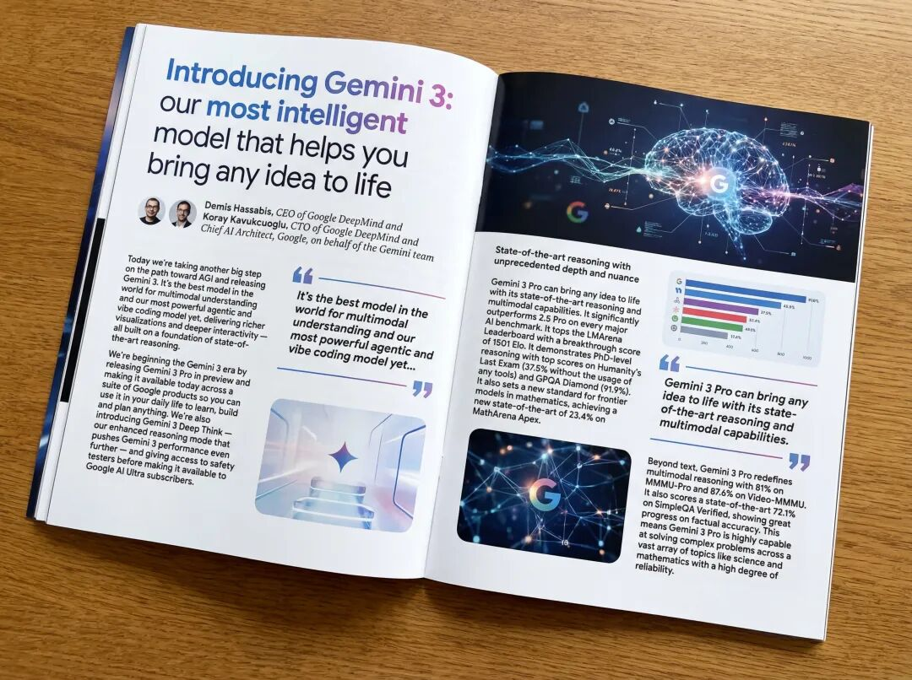

Prompt:

```text
a soft 3D cartoon-style sculpture of [brand product], made of smooth clay-like textures and vibrant pastel colors, placed in a minimalist isometric scene that complements the product’s nature, clean composition, gentle lighting, subtle shadows, with the product’s logo and a 3-word slogan displayed clearly belo
```

### Nano Banana Pro Prompts #52: 复古电脑开机画面解析为ASCII艺术

- Category: `Creative`
- Model: `Nano Banana Pro`
- Author / Source: [@Gdgtify](https://x.com/Gdgtify/status/1925176250626159053)
- Image: `assets/imported/xianyu110/awesome-nanobananapro-prompts/100-4-97-ASCII-Gdgtify-https-x.com-Gdgtify-status-1925176250626159053.png`


Prompt:

```text
Retro CRT computer boot screen that resolves into ASCII-art of NYC's tallest building
```

### Nano Banana Pro Prompts #53: 3D蒸汽朋克Logo

- Category: `Product`
- Model: `Nano Banana Pro`
- Author / Source: [@MayorKingAI](https://x.com/MayorKingAI/status/1925144570553327620)
- Image: `assets/imported/xianyu110/awesome-nanobananapro-prompts/100-5-96-3D-Logo-MayorKingAI-https-x.com-MayorKingAI-status-1925144570553327620.jpeg`

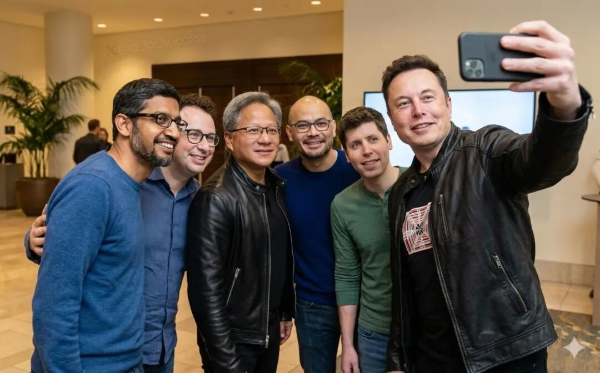

Prompt:

```text
3D sculpted logo of [LOGO NAME], in a steampunk style, made of aged brass and oxidized iron, with visible rivets, gears, and vintage mechanical elements, distressed and weathered surface, rich copper and bronze tones, engraved with Victorian-style filigree, retro-industrial design, soft spotlight lighting, neutral background, hyper-realistic render, ultra-high resolution, symmetrical composition
```

### Nano Banana Pro Prompts #54: 品牌平面纸风格

- Category: `Product`
- Model: `Nano Banana Pro`
- Author / Source: [@HBCoop_](https://x.com/HBCoop_/status/1925213900192043236)
- Image: `assets/imported/xianyu110/awesome-nanobananapro-prompts/100-6-95-HBCoop_-https-x.com-HBCoop_-status-1925213900192043236.png`


Prompt:

```text
A flat branded paper folds itself into the full 3D shape of a [Air Jordan 1 shoes], mid-motion. Dramatic studio lighting, origami texture detail, gradient shadows, Japanese minimalism feel.
```

### Nano Banana Pro Prompts #55: 制药风格商品

- Category: `Product`
- Model: `Nano Banana Pro`
- Author / Source: [@azed_ai](https://x.com/azed_ai/status/1925197464099049735)
- Image: `assets/imported/xianyu110/awesome-nanobananapro-prompts/100-7-94-azed_ai-https-x.com-azed_ai-status-1925197464099049735.jpeg`

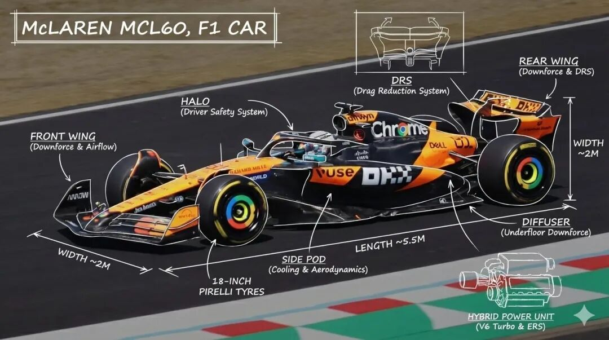

Prompt:

```text
A square-format digital photograph showing a fictional pharmaceutical-style product from [Brand Name] Pharmacy. The box is on the left, clean and minimalist, featuring bold text with the product name "[PRODUCT NAME]" and a witty line like "Take one [type] daily." Next to the box is a silver blister pack containing 6–10 themed pills or capsules shaped like [describe icon/logo/item, e.g., a coffee cup, burger, heart, Midjourney logo, etc.]. Neutral background, soft lighting, sharp focus, modern packaging aesthetic.
```

### Nano Banana Pro Prompts #56: 不同情绪状态的思想泡泡

- Category: `Portrait`
- Model: `Nano Banana Pro`
- Author / Source: [@TheRelianceAI](https://x.com/TheRelianceAI/status/1925098220398465145)
- Image: `assets/imported/xianyu110/awesome-nanobananapro-prompts/100-8-93-TheRelianceAI-https-x.com-TheRelianceAI-status-1925098220398465145.jpeg`


Prompt:

```text
A [SUBJECT] sits alone in a minimalistic room filled with floating, semi-transparent thought bubbles. Each bubble contains a fragment of their face from different emotional states — smiling, crying, screaming — forming a psychological self-portrait suspended in mid-air.
```

### Nano Banana Pro Prompts #57: 霓虹玻璃发光

- Category: `Creative`
- Model: `Nano Banana Pro`
- Author / Source: [@alban_gz](https://x.com/alban_gz/status/1925446996468371893)
- Image: `assets/imported/xianyu110/awesome-nanobananapro-prompts/100-9-92-alban_gz-https-x.com-alban_gz-status-1925446996468371893.jpeg`


Prompt:

```text
Recreate this image using the parameters from the JSON provided.
{
  "name": "Neon Glass Glow",
  "style": {
    "material": {
      "type": "glass",
      "transparency": 0.92,
      "reflectivity": 1.0,
      "refractionIndex": 1.6,
      "color": "#ff00ff",
      "emission": {
        "color": "#ff66ff",
        "intensity": 0.8
      },
      "surfaceFinish": "glossy",
      "bloom": true,
      "detail": "high"
    },
    "outline": {
      "enabled": true,
      "color": "#ffccff",
      "width": 1.8
    },
    "lighting": {
      "type": "studio",
      "keyLightColor": "#ffffff",
      "keyLightIntensity": 1.0,
      "fillLightColor": "#9900ff",
      "fillLightIntensity": 0.7,
      "rimLightColor": "#00ffff",
      "rimLightIntensity": 0.7,
      "shadows": "crisp"
    },
    "background": {
      "type": "solid",
      "color": "#000000"
    },
    "render": {
      "shadows": true,
      "antiAliasing": true,
      "superSampling": "4x",
      "resolution": "high",
      "depthOfField": {
        "enabled": true,
        "focusDistance": 0.8,
        "blurAmount": 0.1
      }
    }
  }
}
```

### Nano Banana Pro Prompts #58: 动感雕塑

- Category: `3D`
- Model: `Nano Banana Pro`
- Author / Source: [@azed_ai](https://x.com/azed_ai/status/1925490847564669153)
- Image: `assets/imported/xianyu110/awesome-nanobananapro-prompts/100-10-91-azed_ai-https-x.com-azed_ai-status-1925490847564669153.png`


Prompt:

```text
A kinetic sculpture of a [subject], made of interlocking metal rods and panels in brushed [color1] and oxidized [color2]. Suspended in motion, with rotating parts casting mechanical shadows on a concrete pedestal.
```

### Nano Banana Pro Prompts #59: 将您的标志变成毛毡纹理

- Category: `Product`
- Model: `Nano Banana Pro`
- Author / Source: [@alex_prompter](https://x.com/alex_prompter/status/1925460683509899423)
- Image: `assets/imported/xianyu110/awesome-nanobananapro-prompts/100-11-90-alex_prompter-https-x.com-alex_prompter-status-1925460683509899423.jpeg`


Prompt:

```text
Retexture [BRAND NAME] logo following my JSON aesthetic below:
{
"style": "realistic needle-felted wool sculpture",
"subject_handling": {
"adapt_to_uploaded_image": true,
"preserve_original_shape_and_layout": true,
"preserve_uploaded_color_values": true,
"preserve_text_if_present": true,
"preserve_text_case": true,
"preserve_exact_letterforms": true,
"use_uploaded_image_as_pixel_map": true,
"prevent_color_estimation_or_stylization": true
},
"needle_felting": {
"material_type": "dyed wool fibers matched precisely to uploaded image pixels",
"texture_description": "fluffy soft felt with clear fiber strands",
"construction_style": "needle-felted, light irregularities allowed but no color bleeding",
"color_application_method": "direct color transfer from uploaded image to wool sculpture",
"prevent_auto_saturation_adjustment": true,
"prevent_color_fading": true,
"color_binding_mode": "pixel-level color fidelity per original image"
},
"lighting": {
"lighting_type": "neutral soft studio lighting",
"shadow": "soft, gray-toned shadows under the object only",
"highlight_behavior": "matte highlights only from felt surface — no bloom or color shift"
},
"background": {
"type": "plain matte studio",
"background_color": "pastel tone that contrasts with logo color",
"color_conflict_handling": "auto-adjust background brightness — do not alter logo colors"
},
"camera": {
"focus_style": "macro lens",
"depth_of_field": "shallow — full subject in sharp detail, soft background",
"angle": "frontal or slightly elevated, full subject visible"
},
"post_processing": {
"color_preservation_enforced": true,
"disable_auto-enhancement_or_tinting": true,
"no artistic reinterpretation": true,
"no auto-correction, bloom, or white balance adjustments": true
},
"image_constraints": {
"transparent_background": false,
"aspect_ratio_locked": true,
"include_text_if_present": true,
"preserve_text_case": true,
"preserve_uploaded_color_values": true,
"prevent_shape_or_color_change": true,
"enforce_exact_pixel_color_match_to_uploaded_image": true
},
"notes": "The uploaded image must be converted into a needle-felted wool sculpture using its exact colors and shape. Use pixel-level mapping to apply the uploaded color values to simulated dyed wool fibers. Do not change, brighten, dull, average, or blend colors. Text must remain intact and readable. Background should be soft pastel to contrast the logo — never adjust the logo to fit the scene."
}
```

### Nano Banana Pro Prompts #60: 海洋中三艘不同的奇幻帆船

- Category: `Creative`
- Model: `Nano Banana Pro`
- Author / Source: [@BeanieBlossom](https://x.com/BeanieBlossom/status/1925159751169810806)
- Image: `assets/imported/xianyu110/awesome-nanobananapro-prompts/100-12-89-BeanieBlossom-https-x.com-BeanieBlossom-status-1925159751169810806.jpeg`

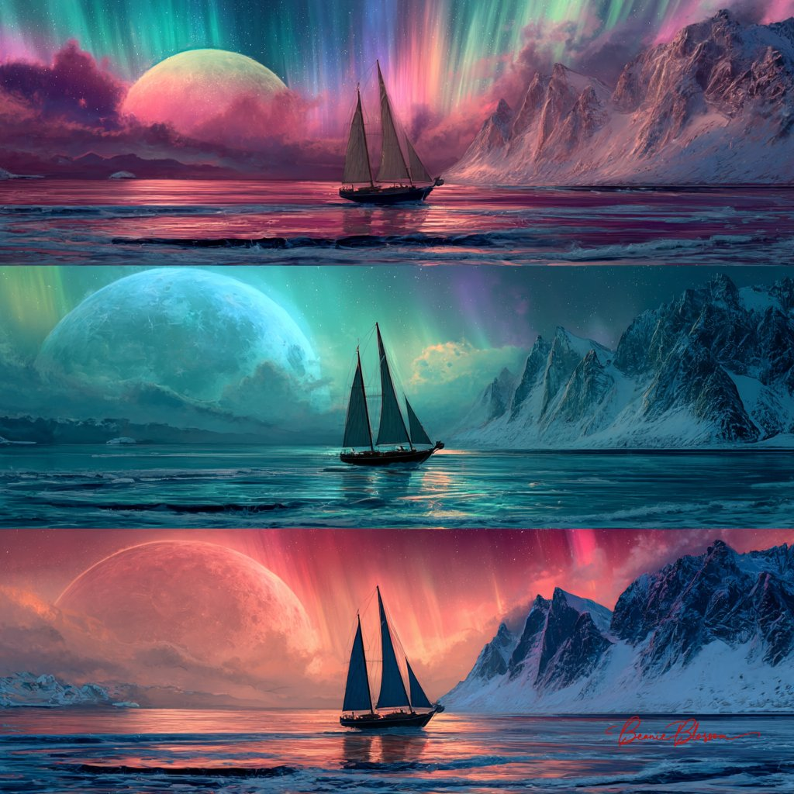

Prompt:

```text
Three different fantasy sailboats in the ocean, multiple scenes of beautiful aurora borealis and colorful moons with snowy mountains, a dreamy, fantasy landscape, in the style of digital art.
```

### Nano Banana Pro Prompts #61: AirBnB 任何东西

- Category: `Product`
- Model: `Nano Banana Pro`
- Author / Source: [@R2_fieldworks](https://x.com/R2_fieldworks/status/1924433924106727531)
- Image: `assets/imported/xianyu110/awesome-nanobananapro-prompts/100-13-88-AirBnB-R2_fieldworks-https-x.com-R2_fieldworks-status-1924433924106727531.png`

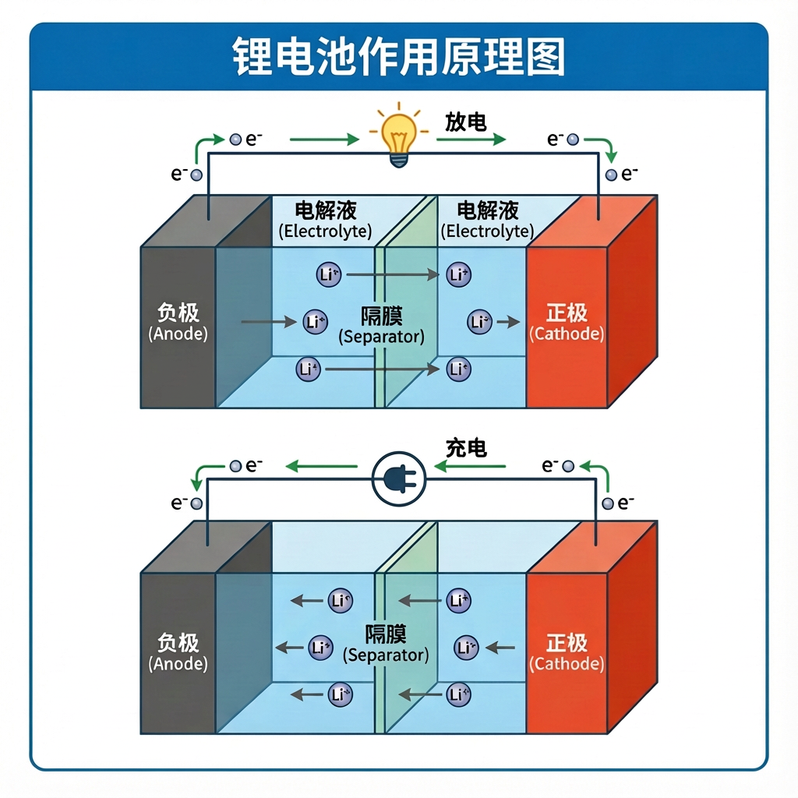

Prompt:

```text
A highly detailed 3D isometric icon of the following object: [OBJECT]

Style: Airbnb 2024 icon language — miniature diorama / emoji-like object with crisp edges, realistic textures, and soft handcrafted realism.

Material: The object should clearly retains its fundamental qualities but look as if its made from a mixture of matte and plastic-like materials.

View: three-quarter front-left isometric view with a slight top-down angle.

Lighting: soft neutral studio lighting from the top-left with subtle shadows and gentle gloss highlights.

Color palette: retain the fundamental colors from the object and include subtle gradients and no harsh contrasts.

Background: clean white, no drop shadow or noise.

Mood: minimal, charming, utilitarian, premium.

Rendering: hyper-detailed, photorealistic object with depth and tactility, like a designer lifestyle emoji or miniature product model.

Optional Add-on for Replication:  Use the attached photo as a reference for proportions and layout. Do not copy exactly — reinterpret it in the Airbnb icon aesthetic.
```

### Nano Banana Pro Prompts #62: 品牌解锁童年回忆

- Category: `Product`
- Model: `Nano Banana Pro`
- Author / Source: [@TheRelianceAI](https://x.com/TheRelianceAI/status/1925606107608715268)
- Image: `assets/imported/xianyu110/awesome-nanobananapro-prompts/100-14-87-TheRelianceAI-https-x.com-TheRelianceAI-status-1925606107608715268.png`

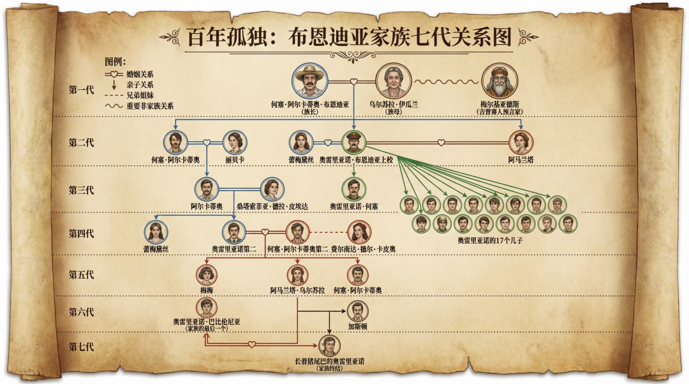

Prompt:

```text
A realistic, cinematic photograph of a vintage [BRAND NAME] item being gently lifted from a dusty stack of old children's books in a dimly lit attic. The item is designed in classic [BRAND NAME] style—featuring authentic patterns, textures, or logos (e.g. monograms, embossing, or signature motifs relevant to the brand). It is partially opened to reveal a miniature, warmly lit classroom inspired by [COUNTRY] school interiors, complete with small regional-style desks, a chalkboard with delicate handwriting in [LANGUAGE], and traditional local details like shoes, posters, or flags. A paper airplane hovers mid-air. The lighting is moody and nostalgic, with soft shadows and golden highlights suggesting afternoon light filtering through attic beams. On the top book cover at the bottom of the image, the [BRAND NAME] logo is written in an elegant, fountain-pen calligraphy style—subtle, integrated into the scene, and not obscuring the main subject.
```

### Nano Banana Pro Prompts #63: 未来的OpenAI可穿戴设备

- Category: `Creative`
- Model: `Nano Banana Pro`
- Author / Source: [@hc_dsn](https://x.com/hc_dsn/status/1925589916844794154)
- Image: `assets/imported/xianyu110/awesome-nanobananapro-prompts/100-15-86-OpenAI-hc_dsn-https-x.com-hc_dsn-status-1925589916844794154.png`


Prompt:

```text
Create image with 1:1 ratio A next-gen wearable ai [device type] blending Jony Ive–inspired refined minimalism with a new material and interaction language symbolizing the power ChatGPT. The device is crafted from translucent aerogel fused with polished ceramic titanium, feather-light yet futuristic.  No seams, buttons, or traditional UI. Photographed floating against a pure white background, with a soft, diffused, nearly shadowless studio light.
```

### Nano Banana Pro Prompts #64: 渐变挤出Google I/O 2025大会视觉效果

- Category: `3D`
- Model: `Nano Banana Pro`
- Author / Source: [@hckmstrrahul](https://x.com/hckmstrrahul/status/1925567579856453701)
- Image: `assets/imported/xianyu110/awesome-nanobananapro-prompts/100-16-84-Google-I-O-2025-hckmstrrahul-https-x.com-hckmstrrahul-status-1925567579856453701.jpeg`


Prompt:

```text
Retexture this image in the following JSON style aesthetic:
{
  "styleAesthetic": {
    "title": "Isometric Multicolor Extrusion with Grid Control",
    "overallVibe": "Playful modern 3D iconography with directional extrusion and dynamic isometric grids",
    "viewAngle": {
      "type": "Isometric",
      "facingDirection": "right",  // options: left, right, front
      "rotationDegrees": {
        "x": 30,
        "y": 30
      }
    },
    "renderingStyle": "Clean 3D extruded vector with soft lighting and high contrast between faces",
    "objectSurface": {
      "frontFace": {
        "color": "#ffffff",
        "material": "Matte white plastic",
        "lighting": "Soft diffuse"
      },
      "extrudedSide": {
        "type": "Multicolor gradient",
        "gradientStyle": "Diagonal sweep",
        "colorStops": [
          "#ff0040", "#ff8000", "#ffff00", "#00ff90", "#00cfff", "#8000ff"
        ],
        "material": "Glossy plastic",
        "lighting": "Ambient with light falloff"
      }
    },
    "extrusion": {
      "direction": "right",  // determines which side is extruded: left, right, front
      "depth": "moderate"
    },
    "shadows": {
      "type": "Drop shadow",
      "direction": "bottom-right",
      "opacity": 0.15,
      "blurRadius": "6px"
    },
    "background": {
      "type": "Isometric grid",
      "color": "#ffffff",
      "gridStyle": {
        "lineColor": "#e0e0e0",
        "lineWeight": "1px",
        "orientation": "opposite-extrusion"  // automatically flips grid lines to oppose the extrusion direction
      }
    },
    "moodKeywords": [
      "Dimensional",
      "Clean",
      "Geometric",
      "Colorful",
      "Tactile",
      "Structured"
    ]
  }
}
```

### Nano Banana Pro Prompts #65: Glitch 矢量徽标样式

- Category: `Product`
- Model: `Nano Banana Pro`
- Author / Source: [@Artedeingenio](https://x.com/Artedeingenio/status/1925844468294365289)
- Image: `assets/imported/xianyu110/awesome-nanobananapro-prompts/100-17-83-Glitch-Artedeingenio-https-x.com-Artedeingenio-status-1925844468294365289.png`


Prompt:

```text
A bold vector logo design in glitch art style, featuring distorted typography with RGB color channel shifts, fragmented lines, misaligned edges, digital noise effects, and a cyberpunk aesthetic. The logo appears corrupted or hacked, as if captured from a malfunctioning screen. Use a black or dark background for contrast, neon or high-saturation color palette, and sharp angular forms.
```

### Nano Banana Pro Prompts #66: 霓虹花卉和谐插图

- Category: `Creative`
- Model: `Nano Banana Pro`
- Author / Source: [@LudovicCreator](https://x.com/LudovicCreator/status/1926246931661042132)
- Image: `assets/imported/xianyu110/awesome-nanobananapro-prompts/100-18-82-LudovicCreator-https-x.com-LudovicCreator-status-1926246931661042132.png`


Prompt:

```text
A Neon Floral Harmony illustration of [SUBJECT], with flowers and plants outlined in glowing neon hues. Use vibrant [COLOR1] and [COLOR2] to create a serene yet electrifying botanical scene
```

### Nano Banana Pro Prompts #67: 品牌乐器

- Category: `Product`
- Model: `Nano Banana Pro`
- Author / Source: [@TheRelianceAI](https://x.com/TheRelianceAI/status/1926148686884606257)
- Image: `assets/imported/xianyu110/awesome-nanobananapro-prompts/100-19-81-TheRelianceAI-https-x.com-TheRelianceAI-status-1926148686884606257.png`


Prompt:

```text
A highly stylized and vibrant promotional image of a [INSTRUMENT] designed in the visual style of the [BRAND] brand — the instrument is reimagined with iconic colors, patterns, and aesthetic elements of the brand. Set in a dynamic, music-inspired environment, with glowing accents, product-style lighting, and joyful energy. Artistic fusion of music and design. 3D render look, high detail, vibrant colors, futuristic but playful.
```

### Nano Banana Pro Prompts #68: 水果的形状

- Category: `Product`
- Model: `Nano Banana Pro`
- Author / Source: [@umesh_ai](https://x.com/umesh_ai/status/1926182194159972503)
- Image: `assets/imported/xianyu110/awesome-nanobananapro-prompts/100-20-80-umesh_ai-https-x.com-umesh_ai-status-1926182194159972503.jpeg`


Prompt:

```text
Create an image by arranging [NUMBER/AGGREGATE] of [FRUIT] strategically on a dark surface to form the shape of [OBJECT/EMOJI/LOGO]
```

### Nano Banana Pro Prompts #69: Alloy图标

- Category: `Product`
- Model: `Nano Banana Pro`
- Author / Source: [@hc_dsn](https://x.com/hc_dsn/status/1926095406871568670)
- Image: `assets/imported/xianyu110/awesome-nanobananapro-prompts/100-21-79-Alloy-hc_dsn-https-x.com-hc_dsn-status-1926095406871568670.jpeg`


Prompt:

```text
create image with 1: 1 ratio
turn a vector [ type
] icon with the following json style
{
    "object": "icon",
    "material": {
        "primary_surface": "smooth matted translucent metallic",
        "finish": "iridescent sheen",
        "color_profile": {
            "base_color": "deep blue",
            "secondary_tones": [
                "black",
                "violet",
                "copper-orange highlights"
            ]
        },
        "panel_lines": {
            "material": "metallic copper",
            "visual_treatment": "glowing edge with subtle bevel"
        },
    },
    "lighting": {
        "type": "studio",
        "key_light": {
            "position": "top-left",
            "effect": "smooth gradient highlight across the surface"
        },
        "rim_light": {
            "position": "right side",
            "effect": "sharp metallic edge glow"
        },
        "reflections": {
            "character": "diffused but iridescent, hinting at a highly polished or lacquered surface"
        },
        "shadows": "soft edge, minimal ground contact due to floating presentation"
    },
    "background": {
        "color": "#FFF",
        "style": "solid matte",
    },
    "composition": {
        "camera_angle": "centered, eye-level",
        "depth_of_field": "none (sharp focus throughout)",
        "presentation": "floating, isolated subject"     "angle": "isometric style"
    },
    "visual_style": {
        "tone": "modern, high-impact",
        "inspiration": "sports branding meets futuristic product design",
        "aesthetic": "bold contrast, tech-luxury fusion"
    }
}
```

### Nano Banana Pro Prompts #70: 毛绒形式表情符号

- Category: `Portrait`
- Model: `Nano Banana Pro`
- Author / Source: [@alban_gz](https://x.com/alban_gz/status/1925833589431619616)
- Image: `assets/imported/xianyu110/awesome-nanobananapro-prompts/100-22-78-alban_gz-https-x.com-alban_gz-status-1925833589431619616.png`


Prompt:

```text
Recreate this [insert emoji] using the parameters from the JSON provided.
{
  "style": "Plushform Emoji",
  "description": "Transform the emoji into a soft, realistic plush object with high-quality fabric and detailed construction. Do not anthropomorphize the emoji — avoid adding faces or cartoon features. Focus on accurate textures, natural forms, and subtle design to give the plush object character.",
  "features": {
    "shape": "matching the emoji's form, with soft, slightly rounded plush adaptation",
    "texture": "realistic plush fabric with visible fiber detail and natural fabric folds",
    "color": "faithful to the emoji's palette, using slightly muted, tactile tones",
    "material": "stuffed toy fabric with visible stitching, seams, and high-quality finishing",
    "background": "neutral or softly textured to emphasize the plush object's form",
    "lighting": "soft professional studio lighting with subtle shadows and depth"
  },
  "examples": [
    "👌 becomes a plush hand in the OK gesture, with realistic fabric folds and seams.",
    "🎯 becomes a soft plush bullseye with layered fuzzy rings and slight dimensional padding.",
    "🎁 becomes a cube-shaped plush box with fabric ribbon, visible stitching, and realistic fabric texture.",
    "🌊 becomes a wave-shaped plush with curled foam tips, crafted in textured ocean blue fabrics."
  ]
}
```

### Nano Banana Pro Prompts #71: 3D零食卡通世界

- Category: `Product`
- Model: `Nano Banana Pro`
- Author / Source: [@aziz4ai](https://x.com/aziz4ai/status/1925895453217898847)
- Image: `assets/imported/xianyu110/awesome-nanobananapro-prompts/100-23-77-3D-aziz4ai-https-x.com-aziz4ai-status-1925895453217898847.jpeg`

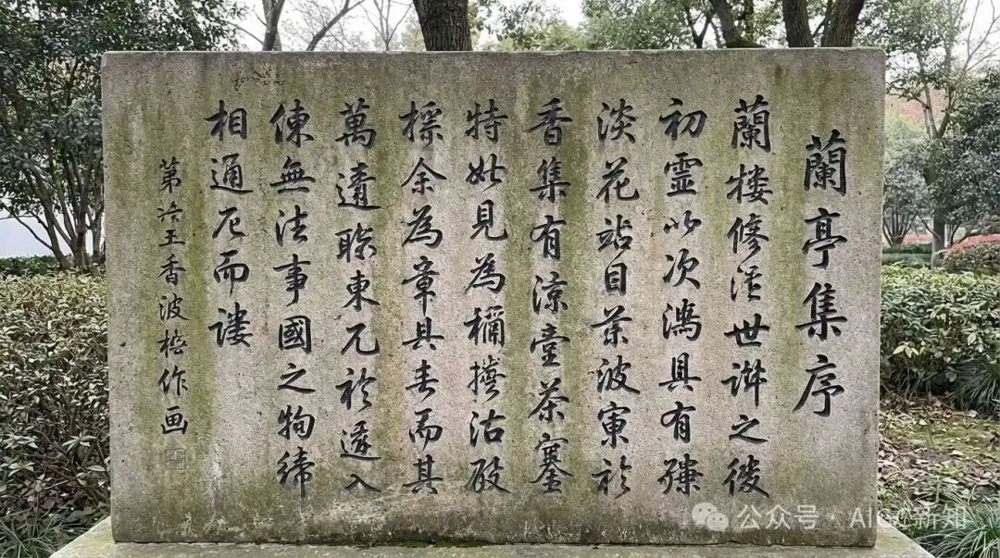

Prompt:

```text
A 3D-rendered digital illustration featuring a retro-style food truck inspired by the brand [INSERT BRAND NAME], designed with smooth pastel colors and soft textures. A black-and-white cartoon character stands beside the truck, holding a product that visually represents the brand. The environment reflects the brand’s world—playful hills, trees, and skies stylized with its color palette and product shapes. The brand’s logo is clearly displayed on the truck, and a short slogan appears naturally within the scene. Format: 1:1, isometric view, cinematic lighting, clean and joyful composition.
```

### Nano Banana Pro Prompts #72: 黑白漫画风格插图

- Category: `Portrait`
- Model: `Nano Banana Pro`
- Author / Source: [@CharaspowerAI](https://x.com/CharaspowerAI/status/1923778050845528388)
- Image: `assets/imported/xianyu110/awesome-nanobananapro-prompts/100-24-76-CharaspowerAI-https-x.com-CharaspowerAI-status-1923778050845528388.png`

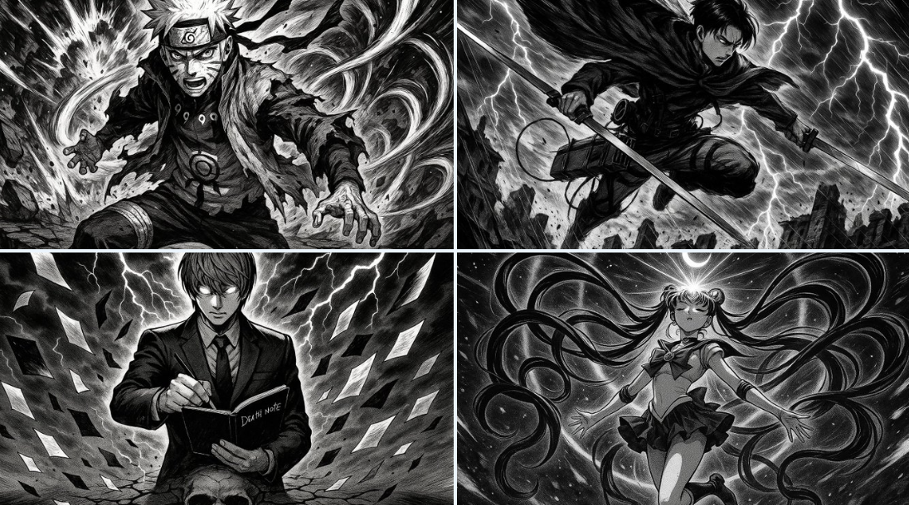

Prompt:

```text
Highly dramatic and epic black and white manga-style illustration of [Your character and description].  Powerful, dynamic pose, exaggerated features emphasizing the intensity of the scene. Background with explosive energy bursts, lightning effects, and a whirlwind of debris
```

### Nano Banana Pro Prompts #73: 可爱干净的底座立体模型

- Category: `Portrait`
- Model: `Nano Banana Pro`
- Author / Source: [@CharaspowerAI](https://x.com/CharaspowerAI/status/1925593447802540408)
- Image: `assets/imported/xianyu110/awesome-nanobananapro-prompts/100-25-75-CharaspowerAI-https-x.com-CharaspowerAI-status-1925593447802540408.png`


Prompt:

```text
Highly detailed 3D-rendered chibi figurine diorama of [Character A] and [Character B], captured in a [scene/action], inside a [thematic display case shape] with [material]. The background features [visual effects: debris, aura, lightning, scenery], dynamic pose. The title "[custom phrase]" is embossed at the top in [font/style], matching the tone. Lighting is [studio, cinematic, ambient], color palette of [main colors]. Designed in a collectible, stylized, viral-friendly aesthetic.
```

### Nano Banana Pro Prompts #74: 3D可爱粉彩粘土图标

- Category: `3D`
- Model: `Nano Banana Pro`
- Author / Source: [@icreatelife](https://x.com/icreatelife/status/1926014358783430945)
- Image: `assets/imported/xianyu110/awesome-nanobananapro-prompts/100-26-74-3D-icreatelife-https-x.com-icreatelife-status-1926014358783430945.png`


Prompt:

```text
Tiny cute isometric [smiling - optional] [OBJECT] emoji, shape, soft lighting, soft pastel colors, [COLOR], 3d icon clay render, blender 3d, pastel background
```

### Nano Banana Pro Prompts #75: 有趣的毛茸茸字母

- Category: `Portrait`
- Model: `Nano Banana Pro`
- Author / Source: [@Anima_Labs](https://x.com/Anima_Labs/status/1925933980781535629)
- Image: `assets/imported/xianyu110/awesome-nanobananapro-prompts/100-27-73-Anima_Labs-https-x.com-Anima_Labs-status-1925933980781535629.png`


Prompt:

```text
A highly realistic 3D render of the letter [A-Z] designed as a full-body fluffy monster. The letter shape itself is the creature’s body — no separate head or limbs. The eyes, mouth, and other monster features are embedded naturally into the letter form. The monster expresses a [mischievous / grumpy / shy / joyful / sleepy / surprised / confident] emotion through its eyes and mouth shape. The texture is dense, soft, and realistic fur, with subtle volume and shadow. The color palette is bold but clean — solid vibrant tones like mint, lilac, sky blue, or coral (avoid rainbow gradients). Studio lighting on a simple pastel background. No hats, no party props — just a minimal, high-quality character design with playful expression.
```

### Nano Banana Pro Prompts #76: 超现实主义油画

- Category: `Creative`
- Model: `Nano Banana Pro`
- Author / Source: [@azed_ai](https://x.com/azed_ai/status/1926217150093549680)
- Image: `assets/imported/xianyu110/awesome-nanobananapro-prompts/100-28-72-azed_ai-https-x.com-azed_ai-status-1926217150093549680.png`


Prompt:

```text
A surreal oil painting of a [subject], executed in the style of early 20th-century dreamscapes. Melting shapes, floating forms, and swirling [color1] and [color2] brushstrokes create a dreamlike dissonance.
```

### Nano Banana Pro Prompts #77: 景观洞穴入口的形状

- Category: `Creative`
- Model: `Nano Banana Pro`
- Author / Source: [@umesh_ai](https://x.com/umesh_ai/status/1925819339413836010)
- Image: `assets/imported/xianyu110/awesome-nanobananapro-prompts/100-29-71-umesh_ai-https-x.com-umesh_ai-status-1925819339413836010.png`


Prompt:

```text
Prompt: An image of a [TYPE] landscape, featuring a cave entrance that is shaped exactly like the outline of a [SHAPE]. The cave should blend naturally into the rugged terrain of the mountain, with the entrance forming a clear and unmistakable [SHAPE] shape. This [SHAPE] shape should be simple and defined, without intricate details, emphasizing just the overall [SHAPE] outline. The surrounding environment should include [DETAILS], but these elements should not distract from the cave's   [SHAPE]-shaped entrance. The lighting in the scene should enhance the visibility and distinctiveness of the [SHAPE]-shaped cave entrance.
```

### Nano Banana Pro Prompts #78: 重新构想的玫瑰金

- Category: `Product`
- Model: `Nano Banana Pro`
- Author / Source: [@aziz4ai](https://x.com/aziz4ai/status/1925933649267970074)
- Image: `assets/imported/xianyu110/awesome-nanobananapro-prompts/100-30-70-aziz4ai-https-x.com-aziz4ai-status-1925933649267970074.jpeg`


Prompt:

```text
Design a luxury-themed 1:1 image featuring a rose gold sculpture that embodies the essence of the jewelry brand “[BRAND NAME]”. The object must symbolically reflect the brand’s identity (e.g., falcon for Cartier, ring for Tiffany & Co., palm tree for Swarovski, camel for Prada). Embed premium crystal textures into key parts of the sculpture (e.g., wings, gem, leaves, or hump) to match the brand’s signature elegance. Use the brand’s iconic background color (e.g., Tiffany Blue, Swarovski White, Cartier Beige, Prada Sand) and place the official logo beneath the sculpture. Add a bold two-word slogan that aligns with the brand’s tone. Lighting should be pure white with high Kelvin value to ensure clarity and prevent yellow tint. The result must feel editorial, artistic, and visually exquisite.
```

### Nano Banana Pro Prompts #79: 品牌折叠纸

- Category: `Product`
- Model: `Nano Banana Pro`
- Author / Source: [@HBCoop_](https://x.com/HBCoop_/status/1925600123200881024)
- Image: `assets/imported/xianyu110/awesome-nanobananapro-prompts/100-31-69-HBCoop_-https-x.com-HBCoop_-status-1925600123200881024.png`

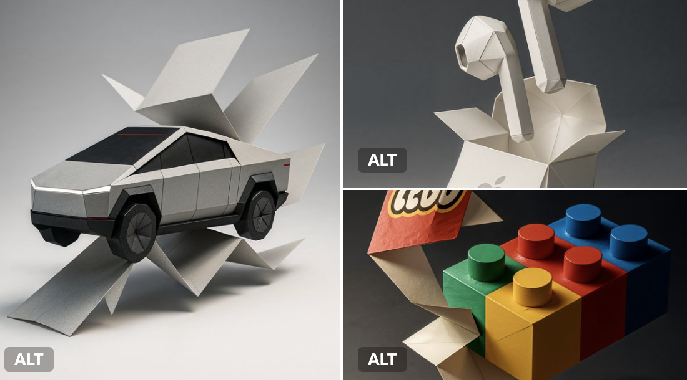

Prompt:

```text
A flat branded paper folds itself into the full 3D shape of a [insert product or item, e.g. “Coca-Cola bottle”, “Nike sneaker”, “Big Mac”], mid-motion.

The paper colors match the [insert brand name] brand’s signature palette and the natural colors of the item (e.g., [describe key colors or ingredients, like “red and white for Coca-Cola”, “brown, green, yellow for Big Mac”]).

Dramatic studio lighting, origami texture detail, soft gradient shadows. Stylized with Japanese minimalism and elegant negative space. The scene captures a clean, elevated transformation from flat brand identity into sculptural product form.
```

### Nano Banana Pro Prompts #80: 透明容器里有一个微型的3D世界

- Category: `3D`
- Model: `Nano Banana Pro`
- Author / Source: [@KoppulaMahende9](https://x.com/KoppulaMahende9/status/1920442464810270851)
- Image: `assets/imported/xianyu110/awesome-nanobananapro-prompts/100-32-68-3D-KoppulaMahende9-https-x.com-KoppulaMahende9-status-1920442464810270851.png`


Prompt:

```text
A giant [transparent or glossy] [object/container] with a miniature 3D diorama inside it, depicting [a symbolic or narrative scene], studio-lit with soft shadows, placed on a neutral matte surface. Emphasize visual contrast between the scale of the capsule and the detail within. Highlight texture, light refraction, and emotional tone (e.g., surreal, poetic, or sci-fi).
```

### Nano Banana Pro Prompts #81: 可爱微缩场景

- Category: `3D`
- Model: `Nano Banana Pro`
- Author / Source: [@ZHO_ZHO_ZHO](https://x.com/ZHO_ZHO_ZHO/status/1925878276133708224)
- Image: `assets/imported/xianyu110/awesome-nanobananapro-prompts/100-33-67-ZHO_ZHO_ZHO-https-x.com-ZHO_ZHO_ZHO-status-1925878276133708224.jpeg`


Prompt:

```text
{
    "style": "miniature handcrafted diorama",
    "material": "tree branches, cardboard, clay, moss, dried flowers, paper",
    "surface_texture": "organic, rough and varied (wood grain, soft moss, paper texture)",
    "lighting": {
        "type": "soft ambient natural light",
        "intensity": "low to moderate",
        "direction": "diffused overhead",
        "accent_colors": [
            "forest green",
            "earth brown",
            "soft beige",
            "muted pink"
        ],
        "reflections": false,
        "refractions": false,
        "dispersion_effects": false,
        "bloom": false
    },
    "color_scheme": {
        "primary": "natural greens and browns",
        "secondary": "soft neutral tones (cardboard, clay, paper)",
        "highlights": "light falling on the open book and cat’s glasses",
        "rim_light": "subtle natural edge light from the forest opening"
    },
    "background": {
        "color": "natural moss green",
        "vignette": false,
        "texture": "moss and dried floral structure"
    },
    "post_processing": {
        "chromatic_aberration": false,
        "glow": false,
        "high_contrast": false,
        "sharp_details": true,
        "film_grain": false
    },
    "form_composition": {
        "scene_elements": [
            "a small girl sitting on a balcony holding an open miniature book",
            "a cat with glasses observing the book's illustrations",
            "a treehouse made from twigs, cardboard, and clay",
            "balcony and surrounding forest made of moss and dried flowers"
        ],
        "scale": "miniature",
        "theme": "childlike wonder and storytelling in a handcrafted world",
        "visual_metaphor": [
            "curiosity",
            "quiet companionship",
            "imagination in nature"
        ]
    },
    "metadata": {
        "artist": "-Zho-",
        "series": "ZH4O"
    }
}
```

### Nano Banana Pro Prompts #82: 霓虹灯风格工具

- Category: `3D`
- Model: `Nano Banana Pro`
- Author / Source: [@egeberkina](https://x.com/egeberkina/status/1926005869331849235)
- Image: `assets/imported/xianyu110/awesome-nanobananapro-prompts/100-34-66-egeberkina-https-x.com-egeberkina-status-1926005869331849235.png`


Prompt:

```text
retexture the image attached based on the JSON aesthetic below
{
  "style": "hyperrealistic 3D render",
  "material": "high-gloss translucent rubber with iridescent coating",
  "surface_texture": "fine-grain pebbling with micro-specular highlights",
  "lighting": {
    "type": "studio HDRI",
    "intensity": "high",
    "direction": "multi-point with rim and backlight",
    "colors": ["electric blue", "magenta", "neon purple", "sunset orange"],
    "glow_effect": true,
    "chromatic_aberration": true,
    "bloom": true
  },
  "color_scheme": {
    "primary": "iridescent gradient",
    "highlights": "white light core reflections",
    "accent_edges": "black outlines with subtle glow"
  },
  "background": {
    "color": "solid black",
    "texture": "none",
    "contrast": "extreme to enhance subject glow"
  },
  "camera": {
    "angle": "straight-on center view",
    "focus": "sharp foreground, no depth blur",
    "lens": "macro with light distortion"
  },
  "post_processing": {
    "glow": true,
    "contrast_boost": true,
    "color_grading": "vibrant spectrum",
    "noise": "minimal"
  }
}
```

### Nano Banana Pro Prompts #83: 皱巴巴的纸片

- Category: `Creative`
- Model: `Nano Banana Pro`
- Author / Source: [@umesh_ai](https://x.com/umesh_ai/status/1925868463689462049)
- Image: `assets/imported/xianyu110/awesome-nanobananapro-prompts/100-35-65-umesh_ai-https-x.com-umesh_ai-status-1925868463689462049.jpeg`

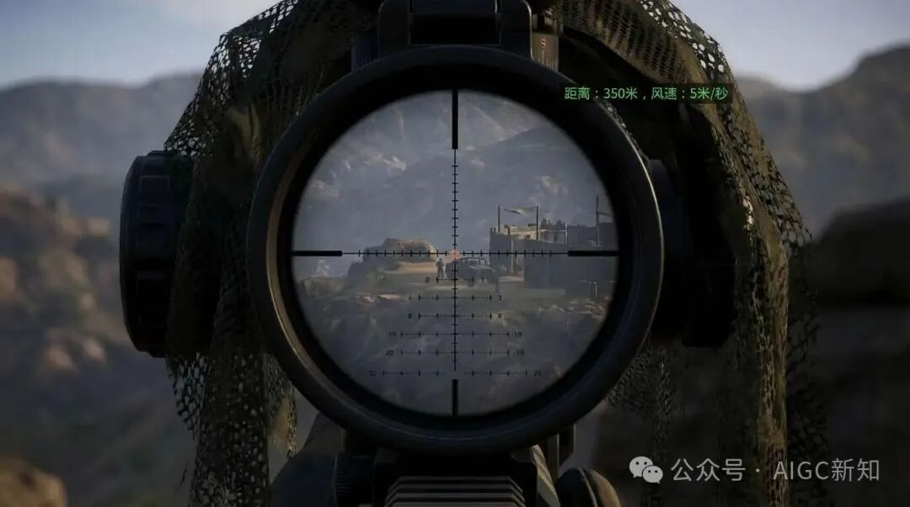

Prompt:

```text
A photorealistic image of the word '[NAME]' spelled out using torn, highly crumpled pieces of white paper. Each letter is painted in bold [COLOR] on individual scraps, arranged loosely and unevenly, as if placed casually by hand, on a wooden table. The composition should convey a natural, handmade aesthetic with visible creases, shadows, and wood grain detail
```

### Nano Banana Pro Prompts #84: 洞壁画

- Category: `Creative`
- Model: `Nano Banana Pro`
- Author / Source: [@azed_ai](https://x.com/azed_ai/status/1925854528831643689)
- Image: `assets/imported/xianyu110/awesome-nanobananapro-prompts/100-36-64-azed_ai-https-x.com-azed_ai-status-1925854528831643689.png`


Prompt:

```text
A cave painting of a [subject], rendered with primitive ochres and charcoal lines on a rough stone wall. Smudged handprints, crude geometry, and flickering torchlight add a primal, ancient mood.
```

### Nano Banana Pro Prompts #85: 选择你的阵营

- Category: `Product`
- Model: `Nano Banana Pro`
- Author / Source: [@aziz4ai](https://x.com/aziz4ai/status/1925595213726097803)
- Image: `assets/imported/xianyu110/awesome-nanobananapro-prompts/100-37-63-aziz4ai-https-x.com-aziz4ai-status-1925595213726097803.jpeg`

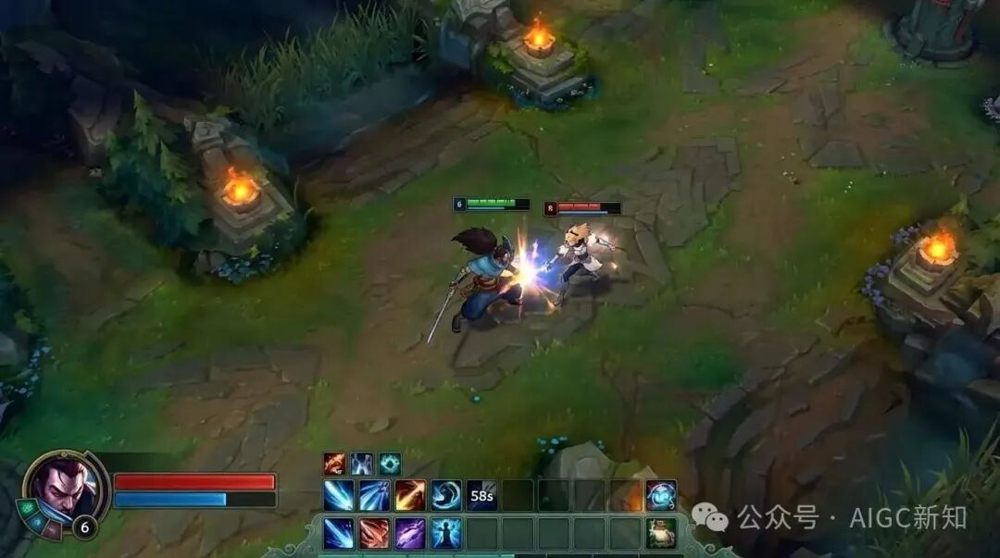

Prompt:

```text
A dramatic cinematic scene featuring two rival products placed side by side in a custom-designed environment that visually reflects their identities. The composition should include high contrast lighting, atmospheric effects like mist, fog, or neon glow, and hyper-detailed textures. Incorporate a powerful 3D slogan below or behind the products in bold stylized typography that fits the scene’s mood. The products must reflect the essence of [Brand A] and [Brand B] through color, lighting, and placement. Ultra-realistic, moody tones, 1:1 square format, with sharp depth of field and high resolution.
```

### Nano Banana Pro Prompts #86: 品牌设计指南海报

- Category: `Product`
- Model: `Nano Banana Pro`
- Author / Source: [@ai4everyday](https://x.com/ai4everyday/status/1925838516979646795)
- Image: `assets/imported/xianyu110/awesome-nanobananapro-prompts/100-38-62-ai4everyday-https-x.com-ai4everyday-status-1925838516979646795.jpeg`


Prompt:

```text
Create a vertical 9:16 brand design guide poster using the uploaded product image. Adapt the design style to match the product’s niche and visual identity. Structure the poster with clear, elegant sections: (1) Large logo display and safe zone usage, (2) Product mockup centered and highlighted, (3) Primary and secondary color palette swatches with hex codes, (4) Typography guide with heading, subheading, body font samples, and line spacing specs, (5) Iconography or graphic motif examples used by the brand, (6) Image treatment style with sample lifestyle or studio visuals, (7) Grid system or layout rules, (8) Packaging mockups and surface applications, (9) Do’s & Don’ts with annotated visuals. Use minimalist white or soft neutral background with structured layout dividers and drop shadows. The result must be visually rich, clean, and suitable for a printed or digital brand book.
```

### Nano Banana Pro Prompts #87: 破碎的真相

- Category: `Creative`
- Model: `Nano Banana Pro`
- Author / Source: [@TheRelianceAI](https://x.com/TheRelianceAI/status/1925918144163450890)
- Image: `assets/imported/xianyu110/awesome-nanobananapro-prompts/100-39-61-TheRelianceAI-https-x.com-TheRelianceAI-status-1925918144163450890.png`


Prompt:

```text
A close-up of [SUBJECT 1] holding a mirror shard to their face. The shard reflects a completely different [SUBJECT 2]. Around them, small cracks spread through the air like fractures in invisible glass, warping the space itself.
```

### Nano Banana Pro Prompts #88: 令人垂涎欲滴的广告

- Category: `Product`
- Model: `Nano Banana Pro`
- Author / Source: [@aziz4ai](https://x.com/aziz4ai/status/1925470550035476622)
- Image: `assets/imported/xianyu110/awesome-nanobananapro-prompts/100-40-60-aziz4ai-https-x.com-aziz4ai-status-1925470550035476622.jpeg`


Prompt:

```text
a vertical 2:3 high-resolution food advertisement featuring the most iconic and delicious product from a well-known brand called [INSERT BRAND NAME]. The product appears centered with mouthwatering details — such as melted cheese, dripping chocolate, whipped cream, or condensation — depending on the product. The background should be a gradient or pastel tone inspired by the brand’s identity. At the top, display a bold slogan in a color that matches the brand’s style. At the bottom, include the official logo of the brand. Use cinematic studio lighting, soft shadows, and ultra-sharp textures to create a visually irresistible and minimal poster.
```

### Nano Banana Pro Prompts #89: 军事计划

- Category: `3D`
- Model: `Nano Banana Pro`
- Author / Source: [@B_4AI](https://x.com/B_4AI/status/1925479609442738486)
- Image: `assets/imported/xianyu110/awesome-nanobananapro-prompts/100-41-59-B_4AI-https-x.com-B_4AI-status-1925479609442738486.png`


Prompt:

```text
A humorous cartoon scene set inside a military training classroom, featuring a group of [Insect Name] soldiers sitting at desks, wearing tiny helmets and miniature combat gear. They listen attentively to their commander, who stands in front of a large board displaying a sketch of a threat to their existence — the enemy changes depending on the animal or insect. The commander explains the attack plan using a pointer, highlighting sensitive targets with red circles. Some soldiers take notes, others whisper tactical ideas to each other. The overall atmosphere blends seriousness with satire in an exaggerated cartoon style.
```

### Nano Banana Pro Prompts #90: 血月下的决斗

- Category: `Video`
- Model: `Nano Banana Pro`
- Author / Source: [@B_4AI](https://x.com/B_4AI/status/1925509492298375388)
- Image: `assets/imported/xianyu110/awesome-nanobananapro-prompts/100-42-58-B_4AI-https-x.com-B_4AI-status-1925509492298375388.png`


Prompt:

```text
[SUBJECT] in a cinematic painting, battling amid crumbling ruins under a colossal blood moon — ambient sparks flying. Set in an ancient valley, illuminated by firelight and shadows. soft [COLOR1] and vibrant [COLOR2], mood intense and epic.
```

### Nano Banana Pro Prompts #91: 手工毛线纹理

- Category: `Product`
- Model: `Nano Banana Pro`
- Author / Source: [@ecommartinez](https://x.com/ecommartinez/status/1925272798479405479)
- Image: `assets/imported/xianyu110/awesome-nanobananapro-prompts/100-43-57-ecommartinez-https-x.com-ecommartinez-status-1925272798479405479.png`


Prompt:

```text
Crea un render 3D fotorrealista de este logo hecho con hilo grueso y tejido a mano. El hilo debe parecer suave, esponjoso y de gran tamaño, con patrones visibles de tejido como bucles, giros y trenzas. Usa colores brillantes y saturados, estética cálida. Resalta la textura de las fibras, la suavidad del material y el acabado artesanal. Iluminación de estudio suave. Fondo blanco o crema limpio. El logo debe estar centrado y sin elementos adicionales. Cuadrado.
```

### Nano Banana Pro Prompts #92: 玻璃盒内的图像可视化

- Category: `3D`
- Model: `Nano Banana Pro`
- Author / Source: [@umesh_ai](https://x.com/umesh_ai/status/1925462472825442469)
- Image: `assets/imported/xianyu110/awesome-nanobananapro-prompts/100-44-56-umesh_ai-https-x.com-umesh_ai-status-1925462472825442469.jpeg`


Prompt:

```text
photorealistic image of a [COLOR] 3D [SUBJECT] encased in a luxurious transparent box, viewed from an enhanced side angle to better reveal the 3D shape of the [SUBJECT]. The box should be white, exquisitely designed, featuring crystal-clear glass with refined, sharp edges
```

### Nano Banana Pro Prompts #93: 彩色卡通俏皮图标和徽标

- Category: `Product`
- Model: `Nano Banana Pro`
- Author / Source: [@gnrlyxyz](https://x.com/gnrlyxyz/status/1925553233881145499)
- Image: `assets/imported/xianyu110/awesome-nanobananapro-prompts/100-45-55-gnrlyxyz-https-x.com-gnrlyxyz-status-1925553233881145499.jpeg`

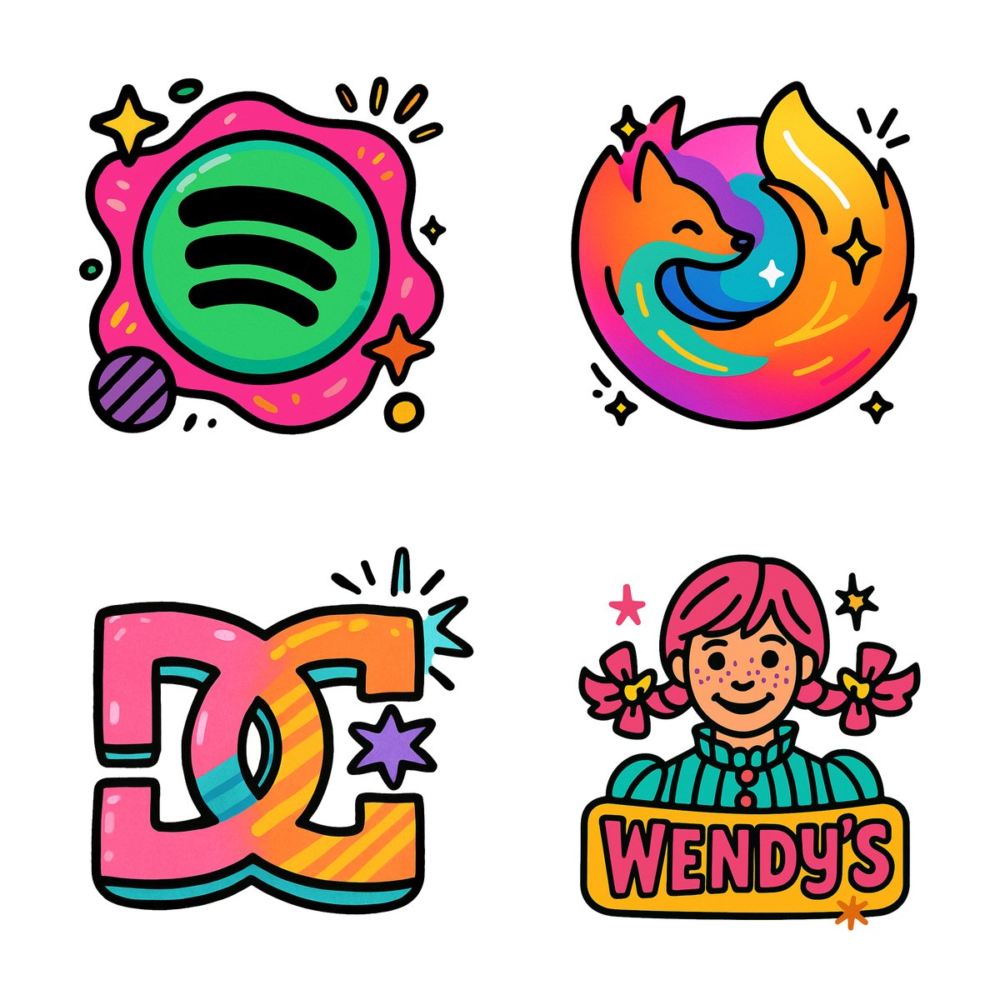

Prompt:

```text
Create a 2D digital illustration of the [FIREFOX] logo in a colorful cartoon style with bold black outlines. The icon design should feature playful, vibrant solid colors such as pink, teal, orange, yellow, and purple, applied in a flat, bold way. Give the shapes a slightly exaggerated, bubbly form with rounded edges and fun details like starbursts, stripes, or spark effects if relevant. Keep the illustration simple and stylized with a hand-drawn look. Use thick outlines to emphasize form. Vector friendly. White background. Square aspect ratio.
```

### Nano Banana Pro Prompts #94: 三种形状和三种颜色

- Category: `Creative`
- Model: `Nano Banana Pro`
- Author / Source: [@umesh_ai](https://x.com/umesh_ai/status/1925569394924740817)
- Image: `assets/imported/xianyu110/awesome-nanobananapro-prompts/100-46-54-umesh_ai-https-x.com-umesh_ai-status-1925569394924740817.jpeg`


Prompt:

```text
Create a minimalist image of a [SUBJECT] using three geometric shapes, using a different color in each shape
```

### Nano Banana Pro Prompts #95: 由鲜花组成的小房子

- Category: `Creative`
- Model: `Nano Banana Pro`
- Author / Source: [@BeanieBlossom](https://x.com/BeanieBlossom/status/1925461720639971505)
- Image: `assets/imported/xianyu110/awesome-nanobananapro-prompts/100-47-53-BeanieBlossom-https-x.com-BeanieBlossom-status-1925461720639971505.jpeg`


Prompt:

```text
A small house made of flowers, a tree with colorful leaves growing on top and around the door, in the style of fantasy, mountainscape in the background, natural lighting, soft colors, rich details, and a full atmosphere, subtle painterly style
```

### Nano Banana Pro Prompts #96: 清洁琴键的小人物

- Category: `Portrait`
- Model: `Nano Banana Pro`
- Author / Source: [@BeanieBlossom](https://x.com/BeanieBlossom/status/1925522114972713147)
- Image: `assets/imported/xianyu110/awesome-nanobananapro-prompts/100-48-52-BeanieBlossom-https-x.com-BeanieBlossom-status-1925522114972713147.jpeg`

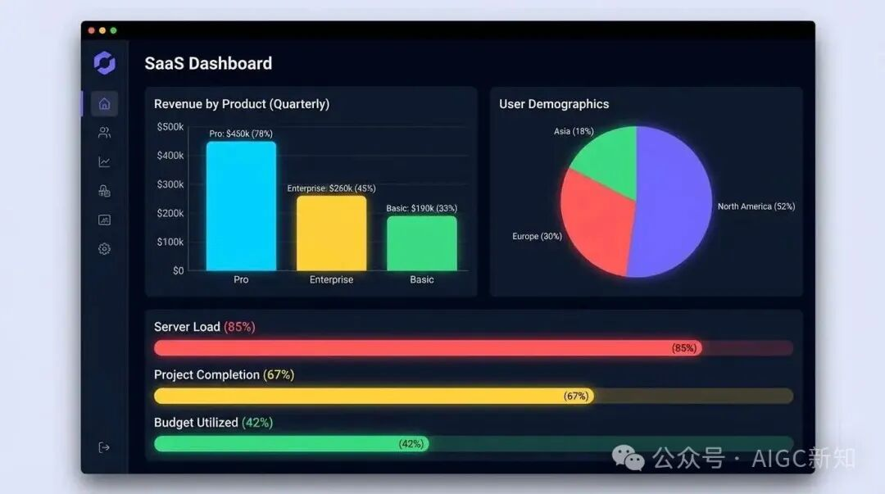

Prompt:

```text
tilt-shift photo of a grand piano keyboard, side view from the left looking along the keys to the right, shallow depth of field, tiny human figures cleaning the piano keys with brushes, cloths, and buckets, whimsical and surreal scene, soft lighting, hyper-detailed, high realism
```

### Nano Banana Pro Prompts #97: 霓虹灯发光的可爱动物

- Category: `3D`
- Model: `Nano Banana Pro`
- Author / Source: [@icreatelife](https://x.com/icreatelife/status/1923819449305509924)
- Image: `assets/imported/xianyu110/awesome-nanobananapro-prompts/100-49-51-icreatelife-https-x.com-icreatelife-status-1923819449305509924.png`


Prompt:

```text
bioluminescent cute [ANIMAL], kawaii, chibi, [COLOR] neon backlit, 3d cartoon, big cute bright eyes, high definition
```

### Nano Banana Pro Prompts #98: 通过钥匙孔看世界

- Category: `Creative`
- Model: `Nano Banana Pro`
- Author / Source: [@icreatelife](https://x.com/icreatelife/status/1925268371227971871)
- Image: `assets/imported/xianyu110/awesome-nanobananapro-prompts/100-50-50-icreatelife-https-x.com-icreatelife-status-1925268371227971871.png`


Prompt:

```text
looking through a [MATERIAL] keyhole towards a mythical [WORLD] dark fantasy, [very black background] around keyhole, sharp focus, photographic
```

### Nano Banana Pro Prompts #99: 超现实海洋图案

- Category: `Creative`
- Model: `Nano Banana Pro`
- Author / Source: [@umesh_ai](https://x.com/umesh_ai/status/1925424557638500838)
- Image: `assets/imported/xianyu110/awesome-nanobananapro-prompts/100-51-49-umesh_ai-https-x.com-umesh_ai-status-1925424557638500838.jpeg`


Prompt:

```text
Create a hyper-realistic image where [SHAPE] shape is formed by the magical parting of [wavy] blue ocean, with the [SHAPE] shape being a [COLOUR] empty land. The top view should show the water being pushed aside by an unseen force, creating the [SHAPE] with an ultra-thin line. The stark [COLOR] color of the [SHAPE] interior should contrast with the vibrant blue water around it, emphasizing the supernatural effect as if the water is being parted to reveal the [SHAPE] shape distinctly.
```

### Nano Banana Pro Prompts #100: 警方照片风格

- Category: `Creative`
- Model: `Nano Banana Pro`
- Author / Source: [@Artedeingenio](https://x.com/Artedeingenio/status/1925475465029919163)
- Image: `assets/imported/xianyu110/awesome-nanobananapro-prompts/100-52-48-Artedeingenio-https-x.com-Artedeingenio-status-1925475465029919163.png`


Prompt:

```text
Transform this image into a realistic police mugshot.
Add a gray background with height markings, harsh frontal lighting, and a nameplate with the person's name and a case number.
The photo should look like an official FBI or police booking photo, vertical format (4:5), with a neutral expression and no accessories.
```

### Nano Banana Pro Prompts #101: 无声电影场景

- Category: `Video`
- Model: `Nano Banana Pro`
- Author / Source: [@LudovicCreator](https://x.com/LudovicCreator/status/1925469185288572953)
- Image: `assets/imported/xianyu110/awesome-nanobananapro-prompts/100-53-47-LudovicCreator-https-x.com-LudovicCreator-status-1925469185288572953.png`

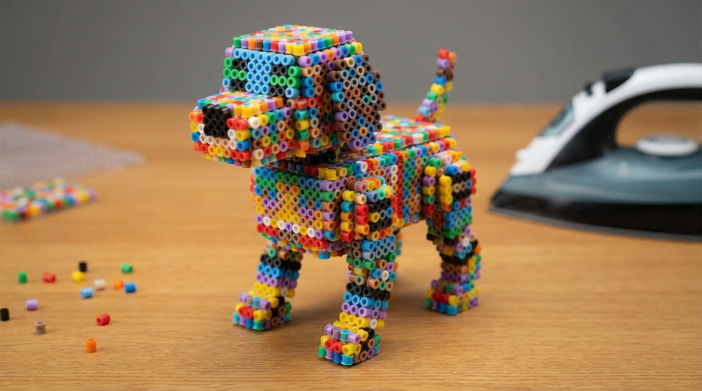

Prompt:

```text
[SUBJECT] depicted in a Sepia-Toned Silent Film Scene, evoking the drama and expression of early cinema. Use muted [COLOR1] and [COLOR2] sepia tones to enhance the nostalgic atmosphere
```

### Nano Banana Pro Prompts #102: 简单的输入中构思和创建有影响力的图像

- Category: `Creative`
- Model: `Nano Banana Pro`
- Author / Source: [@umesh_ai](https://x.com/umesh_ai/status/1925397022011527192)
- Image: `assets/imported/xianyu110/awesome-nanobananapro-prompts/100-54-46-umesh_ai-https-x.com-umesh_ai-status-1925397022011527192.jpeg`


Prompt:

```text
Create a surrealistic image about diabetes that conveys the message in a powerful and influential way. Plan and prepare the visual concept and prompt, then generate the image as a photograph with a caption.
```

### Nano Banana Pro Prompts #103: 复古锡玩具立体模型风格

- Category: `Portrait`
- Model: `Nano Banana Pro`
- Author / Source: [@Artedeingenio](https://x.com/Artedeingenio/status/1920423915211375060)
- Image: `assets/imported/xianyu110/awesome-nanobananapro-prompts/100-55-45-Artedeingenio-https-x.com-Artedeingenio-status-1920423915211375060.jpeg`


Prompt:

```text
transform it into part of a miniature mechanical scene from the 1940s or ’50s, featuring:

➕Shiny enamel-painted metal characters and objects.
➕Riveted details and visible joints.
➕Illustrated cardboard backdrops with vintage charm.
➕Wind-up toy-style settings with gears and wheels.
```

### Nano Banana Pro Prompts #104: 附魔粒子泛光

- Category: `Creative`
- Model: `Nano Banana Pro`
- Author / Source: [@LudovicCreator](https://x.com/LudovicCreator/status/1925069047948849443)
- Image: `assets/imported/xianyu110/awesome-nanobananapro-prompts/100-56-44-LudovicCreator-https-x.com-LudovicCreator-status-1925069047948849443.png`

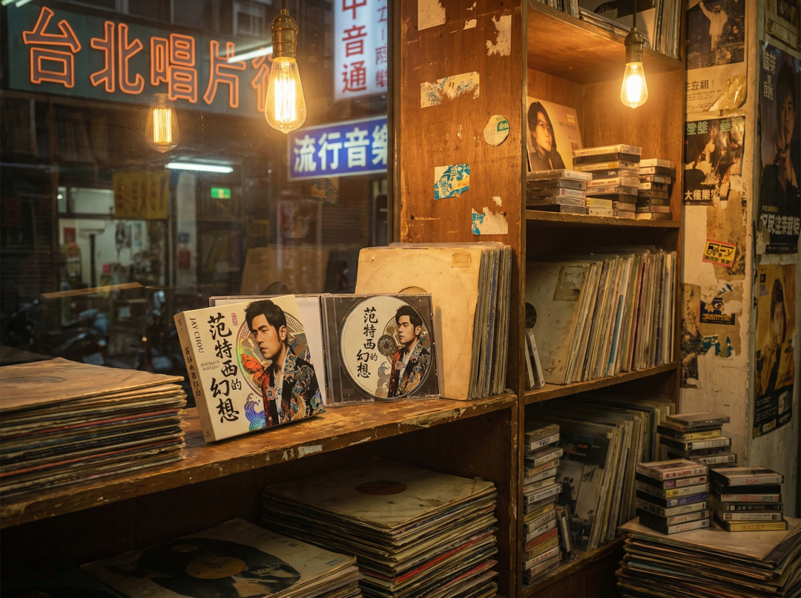

Prompt:

```text
[SUBJECT] surrounded by an Enchanted Particle Bloom, with particles resembling magical flower petals or leaves. Employ soft, enchanting hues of [COLOR1] and [COLOR2] to create a sense of natural magic.
```

### Nano Banana Pro Prompts #105: Airbnb风格的图标

- Category: `Product`
- Model: `Nano Banana Pro`
- Author / Source: [@hc_dsn](https://x.com/hc_dsn/status/1924665909073084507)
- Image: `assets/imported/xianyu110/awesome-nanobananapro-prompts/100-57-43-Airbnb-hc_dsn-https-x.com-hc_dsn-status-1924665909073084507.jpeg`

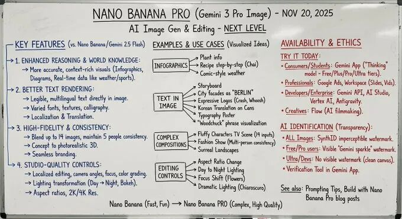

Prompt:

```text
generate[concept] icon with this json style:
{
    "icon_style": {
        "perspective": "isometric",
        "geometry": {
            "proportions": "1:1 ratio canvas, with objects fitting comfortably within margins",
            "element_arrangement": "central dominant object, with supporting elements symmetrically or diagonally placed"
        },
        "composition": {
            "element_count": "2–4 main objects",
            "spatial_depth": "layered to create sense of dimension and slight elevation",
            "scale_consistency": "uniform object scale across icon set",
            "scene_density": "minimal to moderate, maintaining clarity and visual focus"
        },
        "lighting": {
            "type": "soft ambient light",
            "light_source": "subtle top-right or front-top direction",
            "shadow": "gentle drop shadows below and behind objects",
            "highlighting": "mild edge illumination to define forms"
        },
        "textures": {
            "material_finish": "semi-matte to satin surfaces",
            "surface_treatment": "smooth with light tactile variation (e.g., wood grain, soft textures)",
            "texture_realism": "stylized naturalism without hyper-realistic noise"
        },
        "render_quality": {
            "resolution": "high-resolution octane 3D rendering",
            "edge_definition": "crisp, no outlines; separation achieved via lighting and depth",
            "visual_clarity": "clean, readable shapes with minimal clutter"
        },
        "color_palette": {
            "tone": "naturalistic with slight saturation boost",
            "range": "harmonious muted tones with gentle contrast",
            "usage": "distinct colors per object to improve identification and readability"
        },
        "background": {
            "color": "#FFFFFF",
            "style": "pure white, flat",
            "texture": "none"
        },
        "stylistic_tone": "premium, friendly, clean with lifestyle or service-oriented appeal",
        "icon_behavior": {
            "branding_alignment": "neutral enough for broad applications",
            "scalability": "legible at small and medium sizes",
            "interchangeability": "part of a cohesive icon system with interchangeable subject matter"
        }
    }
}
```

### Nano Banana Pro Prompts #106: Logo超写实微型摄影

- Category: `Product`
- Model: `Nano Banana Pro`
- Author / Source: [@alex_prompter](https://x.com/alex_prompter/status/1923036265013801025)
- Image: `assets/imported/xianyu110/awesome-nanobananapro-prompts/100-58-42-Logo-alex_prompter-https-x.com-alex_prompter-status-1923036265013801025.jpeg`


Prompt:

```text
Recreate this [BRAND NAME] logo follow the JSON aesthetic below:
{
    "style": "hyperrealistic miniature photography",
    "scene": {
        "main_subject": "uploaded logo scaled to appear as a large physical object",
        "interaction": "tiny human figures interacting with the logo",
        "activities": [
            "cleaning the logo",
            "painting parts of the logo",
            "climbing ladders on the logo surface",
            "taking photographs of the logo"
        ],
        "environment": "studio-style white background to focus on details",
        "perspective": "frontal view with shallow depth of field for macro effect"
    },
    "logo_handling": {
        "preserve_original_logo_shape": true,
        "preserve_original_logo_colors": true,
        "preserve_text_in_logo": true,
        "use_logo_as_structural_object": true,
        "adapt_logo_to_3D_surface": true
    },
    "miniature_elements": {
        "figure_scale": "1:50 ratio to logo",
        "figure_details": "tiny realistic humans with props like brushes, ropes, and scaffolding",
        "interaction_type": "physical interaction, not illustration or overlay"
    },
    "lighting": {
        "key_light": "soft diffused white light from above",
        "fill_light": "mild side fill to reveal depth and volume",
        "shadows": "realistic and subtle around base and figures"
    },
    "camera": {
        "focus_mode": "macro with shallow depth of field",
        "angle": "slightly top-down to give sense of scale",
        "background": "clean white surface, no gradient, no transparency"
    },
    "post_processing": {
        "realism_enhancement": "preserve logo clarity, crisp text, no artistic blurring",
        "forbid_artistic_filters": true,
        "forbid_color_modifications": true
    },
    "image_constraints": {
        "transparent_background": false,
        "include_text": true,
        "adapt_to_uploaded_logo": true,
        "obey_logo_shape": true,
        "preserve_original_logo_colors": true
    },
    "notes": "The uploaded logo must be clearly recognizable, unmodified, and serve as the core structural element of the scene. Tiny people should interact with the logo realistically, as if it were a large 3D object in a physical miniature world."
}
```

### Nano Banana Pro Prompts #107: 卡通角色转换成超写实人类

- Category: `Portrait`
- Model: `Nano Banana Pro`
- Author / Source: [@The_Real_Bersek](https://x.com/The_Real_Bersek/status/1917174101627617752)
- Image: `assets/imported/xianyu110/awesome-nanobananapro-prompts/100-59-41-The_Real_Bersek-https-x.com-The_Real_Bersek-status-1917174101627617752.jpeg`

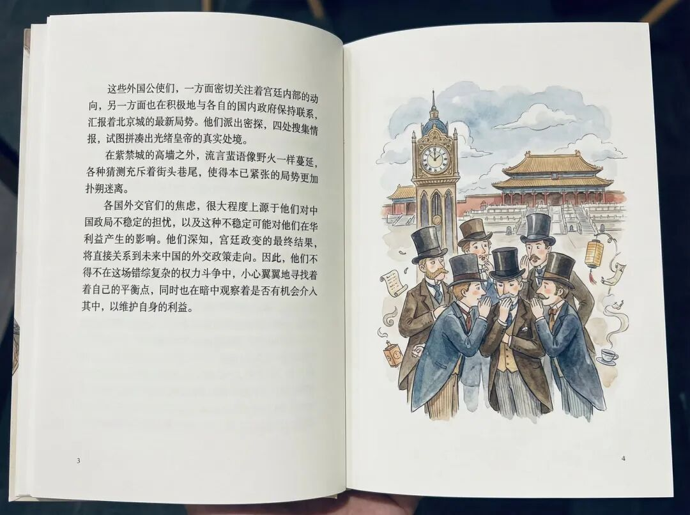

Prompt:

```text
Transform the cartoon character from the reference image into a hyper-realistic human while maintaining their core attributes (clothing, hairstyle, facial expression, accessories, and proportions, age and so on). Create a photorealistic portrait
```

### Nano Banana Pro Prompts #108: 品牌领导骑行

- Category: `Product`
- Model: `Nano Banana Pro`
- Author / Source: [@aziz4ai](https://x.com/aziz4ai/status/1924527136657834468)
- Image: `assets/imported/xianyu110/awesome-nanobananapro-prompts/100-60-40-aziz4ai-https-x.com-aziz4ai-status-1924527136657834468.jpeg`

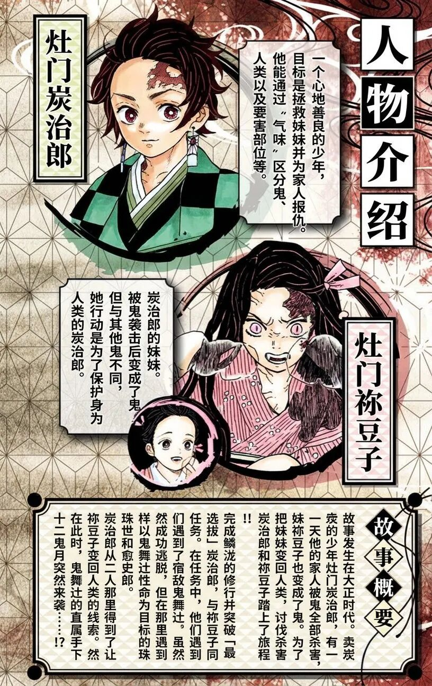

Prompt:

```text
A cinematic 1:1 scene featuring the iconic leader of [Brand Name] riding a futuristic electric motorcycle that reflects the brand’s identity. He wears a high-detail black or brand-colored carbon fiber leather jacket, with the [Brand Name] logo embroidered boldly on the chest and
```

### Nano Banana Pro Prompts #109: 网络矩阵梦境

- Category: `Creative`
- Model: `Nano Banana Pro`
- Author / Source: [@LudovicCreator](https://x.com/LudovicCreator/status/1924382022002250151)
- Image: `assets/imported/xianyu110/awesome-nanobananapro-prompts/100-61-39-LudovicCreator-https-x.com-LudovicCreator-status-1924382022002250151.png`

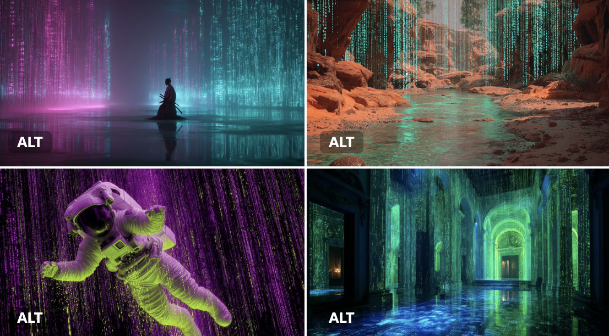

Prompt:

```text
[SUBJECT] reinterpreted through Cyber Matrix Dreamscapes, where cascading streams of digital code form the immersive backdrop. Imbue the scene with radical neon [COLOR1] and luminous [COLOR2] accents to evoke a futuristic reality where art converges with algorithm
```

### Nano Banana Pro Prompts #110: 捷克木偶风格

- Category: `Creative`
- Model: `Nano Banana Pro`
- Author / Source: [@AllaAisling](https://x.com/AllaAisling/status/1924231647894896732)
- Image: `assets/imported/xianyu110/awesome-nanobananapro-prompts/100-62-38-AllaAisling-https-x.com-AllaAisling-status-1924231647894896732.png`

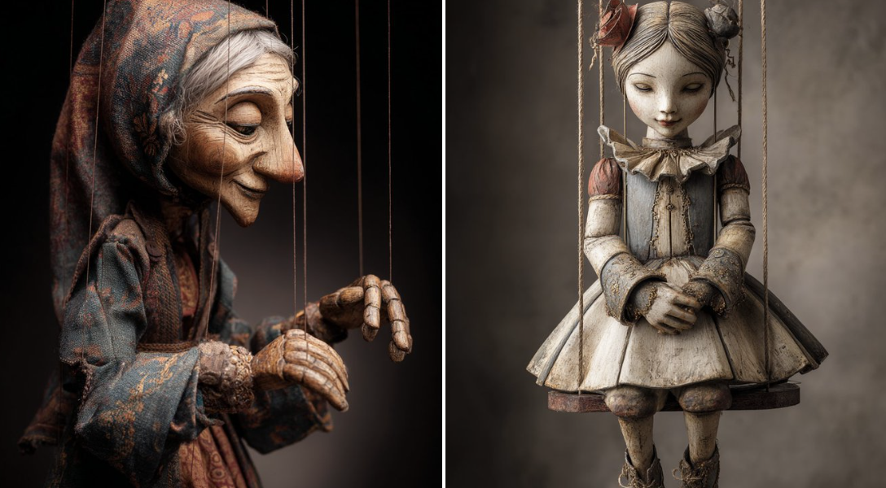

Prompt:

```text
Hand-Carved Wooden Puppet (Czech Marionette Style)

A hand-carved wooden marionette interpretation of [SUBJECT], with jointed limbs, painted details, and a slightly eerie antique finish. Showcase theatrical posture, stage lighting, and cultural craftsmanship in the styling.
```

### Nano Banana Pro Prompts #111: Logo放进我的世界中

- Category: `Product`
- Model: `Nano Banana Pro`
- Author / Source: [@alex_prompter](https://x.com/alex_prompter/status/1924503062325989836)
- Image: `assets/imported/xianyu110/awesome-nanobananapro-prompts/100-63-37-Logo-alex_prompter-https-x.com-alex_prompter-status-1924503062325989836.jpeg`

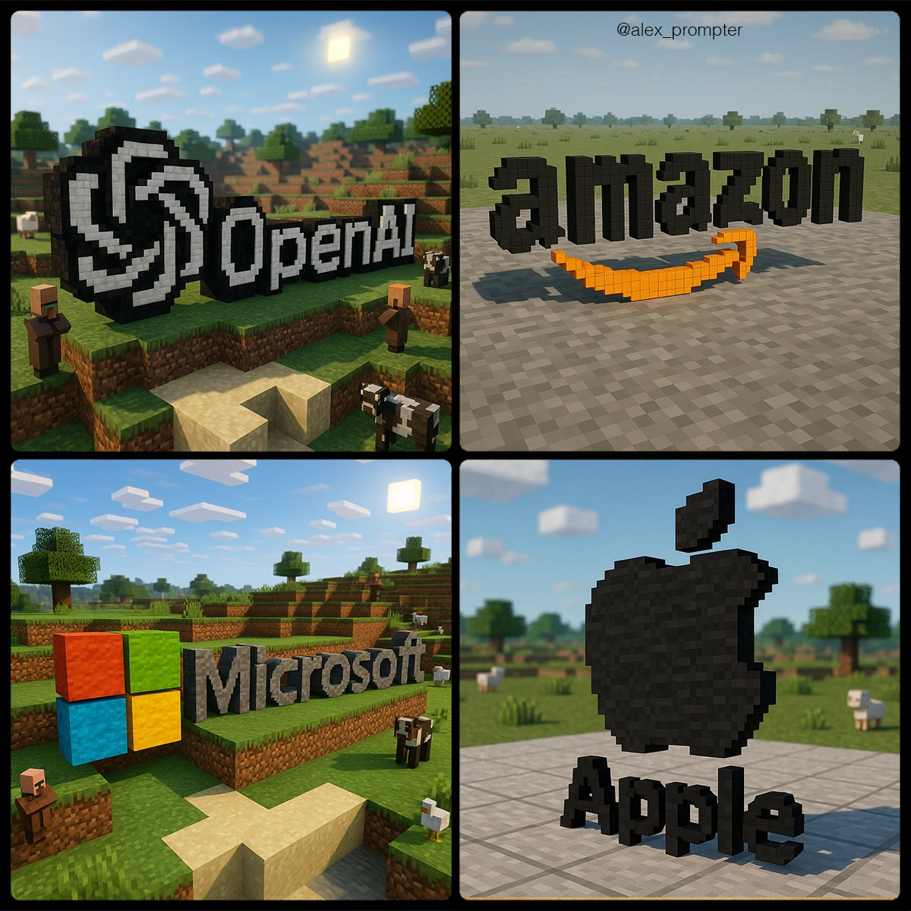

Prompt:

```text
Recreate the [BRAND NAME] logo following the JSON Aesthetic below: {
"style": "Minecraft-style voxel 3D rendering",
"logo_handling": {
"adapt_to_uploaded_logo": true,
"rebuild_logo_using_voxel_blocks": true,
"use_original_logo_as_strict_pixel-color map": true,
"preserve_text_in_logo": true,
"preserve_text_case": true,
"preserve_original_logo_colors": true,
"preserve_shape_and_layout": true
"aspect_ratio": [INSERT ASPECT RATIO]
},
"minecraft_conversion": {
"voxel_depth": "medium thickness to show 3D volume",
"block_style": "authentic Minecraft texture mapping",
"color_strategy": "each block in the logo must match a pixel from the uploaded logo exactly — no estimation or stylistic substitution",
"voxel_material_match": "map logo pixels to Minecraft block colors that visually match pixel color as closely as possible — no creative enhancements",
"disable_palette_expansion": true
},
"scene_environment": {
"base": "neutral terrain (gray concrete or light stone)",
"background": "simple sky (clouds, no sun flare)",
"optional_elements": [
"Minecraft animals at a distance",
"terrain vegetation in background only"
],
"environment_color_policy": "environment must not share colors used in the logo to prevent blending or confusion"
},
"lighting": {
"neutral directional light": true,
"do_not_adjust_logo_colors_for_lighting": true,
"prevent_ambient_light_color_bleed": true
},
"camera": {
"angle": "slightly top-down with 3D logo centered",
"focus": "sharp focus on voxel logo only, environment softly rendered"
},
"render_quality": {
"voxel_texture_resolution": "high",
"shadows": "natural voxel-style ambient shadows only",
"disable_artistic_effects": true
},
"post_processing": {
"no glow effects": true,
"no color correction": true,
"disable AI reinterpretation of tones or palette": true
},
"image_constraints": {
"transparent_background": false,
"include_text": true,
"preserve_text_case": true,
"preserve_original_logo_colors": true,
"obey_uploaded_logo_shape": true,
"match_uploaded_logo_layout": true,
"enforce_color_source_from_logo_only": true
},
"notes": "Rebuild the uploaded logo using Minecraft-style voxel blocks. Every block must represent one pixel from the logo's original image. No creative license is allowed in color, shape, or layout. The environment is decorative only and must not affect logo readability or color perception. The final image should appear as if the logo were physically constructed in a Minecraft world using blocks that match its exact colors and shapes."
}
```

### Nano Banana Pro Prompts #112: 马赛克壁画

- Category: `Creative`
- Model: `Nano Banana Pro`
- Author / Source: [@azed_ai](https://x.com/azed_ai/status/1924405701985853714)
- Image: `assets/imported/xianyu110/awesome-nanobananapro-prompts/100-64-36-azed_ai-https-x.com-azed_ai-status-1924405701985853714.png`

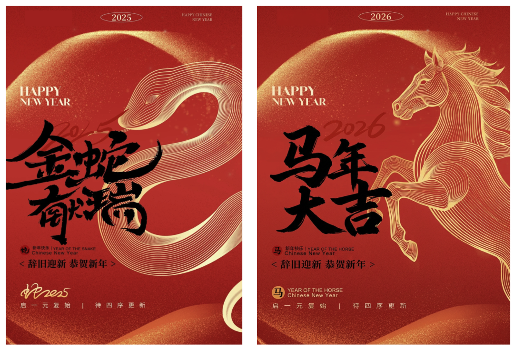

Prompt:

```text
A mosaic mural of a [subject], crafted from chipped ceramic and glass shards in sun-faded [color1] and weathered [color2]. Set into a cracked plaster wall, the irregular shapes and grout lines add a rustic, timeworn charm.
```

### Nano Banana Pro Prompts #113: 人物戏剧夸张风格

- Category: `Portrait`
- Model: `Nano Banana Pro`
- Author / Source: [@dotey](https://x.com/dotey/status/1924288320881750108)
- Image: `assets/imported/xianyu110/awesome-nanobananapro-prompts/100-65-35-dotey-https-x.com-dotey-status-1924288320881750108.png`


Prompt:

```text
A high-resolution vertical Pixar-style 3D character illustration.

Main character:
Salvador Dalí — depicted as a tall, slim, and slightly exaggerated Pixar-style 3D character.
Wearing a classic blue shirt, yellow tie, high-waisted plaid trousers with suspenders, and leather shoes.
His iconic long upturned mustache, slick black hair, sharply arched eyebrows, and slightly eccentric posture.
Stands with chest out, one hand on hip, head tilted slightly back in his typical theatrical flair.

Background:
Flat, clean yellow background with subtle surface texture.
Strong sunlight from top-left casts a distinct and enlarged shadow on the wall behind him.

Key Concept – Shadow as spiritual projection:
The shadow cast behind him does **not** mirror his body shape.
Instead, it takes the form of one of his most iconic artworks —
a surreal melted clock with long dripping arms, inspired by “The Persistence of Memory”.

The melted clock shadow is positioned diagonally, starting from his shoulder,
stretching wide and low across the yellow wall, surreal and fluid, yet unmistakably symbolic.

This shadow is **Dalí’s legacy made visible** — a symbolic extension of his identity through time, dream, and visual distortion.

Lighting & Rendering:
Pixar-like rendering with detailed but stylized textures.
Use subtle filmic grain, soft shadows, and warm color grading.
Subtle sparkles or light speckles inside the shadow to evoke dreamlike texture.

Typography (top-left corner):
“Salvador Dalí” in minimalist black sans-serif font, “Dalí” bolded.
```

### Nano Banana Pro Prompts #114: 云的艺术

- Category: `Creative`
- Model: `Nano Banana Pro`
- Author / Source: [@umesh_ai](https://x.com/umesh_ai/status/1924473546216292441)
- Image: `assets/imported/xianyu110/awesome-nanobananapro-prompts/100-66-34-umesh_ai-https-x.com-umesh_ai-status-1924473546216292441.jpeg`

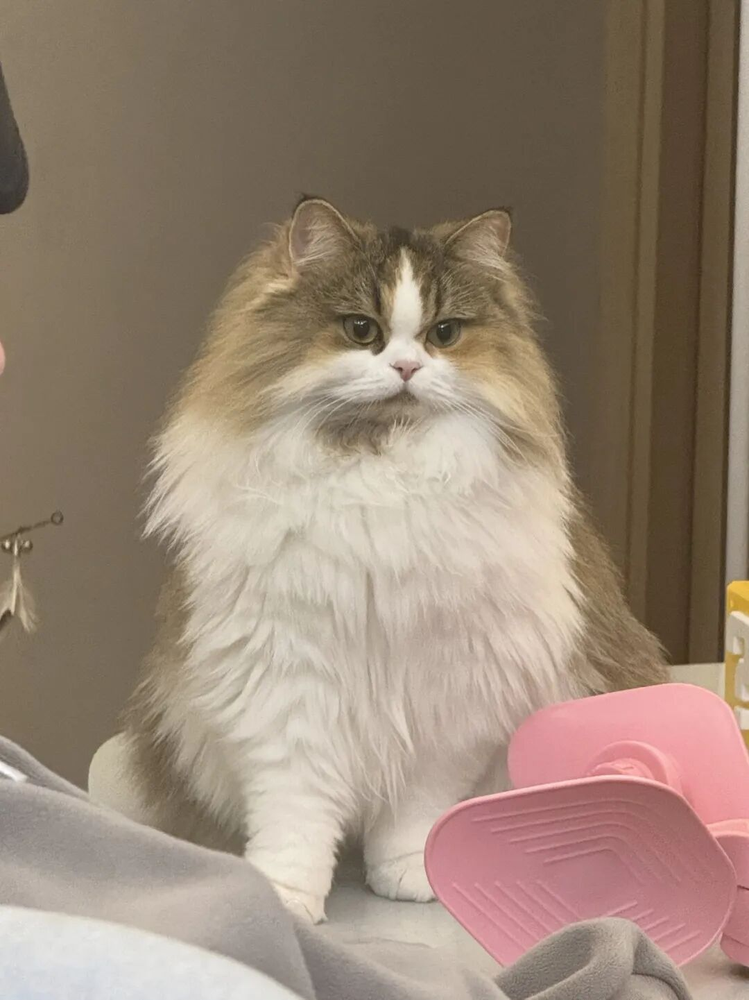

Prompt:

```text
A photograph captures a daytime scene with a [SUBJECT/OBJECT] formed by scattered clouds in the sky, positioned above a [LOCATION]
```

### Nano Banana Pro Prompts #115: 复古像素UI图标

- Category: `Creative`
- Model: `Nano Banana Pro`
- Author / Source: [@egeberkina](https://x.com/egeberkina/status/1924462051474174222)
- Image: `assets/imported/xianyu110/awesome-nanobananapro-prompts/100-67-33-UI-egeberkina-https-x.com-egeberkina-status-1924462051474174222.png`


Prompt:

```text
retexture the image attached in the following json aesthetic style:
{
  "style": "Retro Pixel UI Icons",
  "resolution": "low (32x32 or 48x48)",
  "color_palette": [
    "#F2F2F2",
    "#C0C0C0",
    "#000000",
    "#FFFFFF",
    "#0000FF",
    "#00FF00",
    "#FFFF99",
    "#008080"
  ],
  "outline": {
    "enabled": true,
    "color": "#000000",
    "thickness": "1px"
  },
  "shading": {
    "method": "dithering",
    "colors_used": ["base color", "highlight", "shadow"],
    "pattern": "checkerboard or diagonal lines"
  },
  "lighting": {
    "type": "flat",
    "source": "top-left",
    "highlight_color": "#FFFFFF",
    "shadow_color": "#808080"
  },
  "background": {
    "color": "#F2F2F2",
    "type": "plain",
    "transparency": false
  },
  "object_properties": {
    "style": "pixel art",
    "perspective": "isometric or front-facing",
    "animation": {
      "enabled": false,
      "frame_style": "static pixel art"
    }
  }
}
```

### Nano Banana Pro Prompts #116: 卡通风格文本标志

- Category: `Creative`
- Model: `Nano Banana Pro`
- Author / Source: [@gnrlyxyz](https://x.com/gnrlyxyz/status/1924466922545877098)
- Image: `assets/imported/xianyu110/awesome-nanobananapro-prompts/100-68-32-gnrlyxyz-https-x.com-gnrlyxyz-status-1924466922545877098.png`


Prompt:

```text
Create a bold, warped cartoon-style text design with two distinct layers. The top layer should say “SUPER GNARLY” in warped bubble letters with a melty, drippy texture, like ghost slime or goo. The letters should feel heavy and organic, with a slightly psychedelic or paranormal vibe. The bottom layer should say “SOCIETY” in much smaller, script-like or handwritten-style letters that tuck underneath or nestle between the larger title letters. Both layers should be solid white with thick black outlines. No gradients, shading, or texture. Layout should be playful and a little chaotic, but still readable. Vector friendly. Blue background. Square aspect ratio.
```

### Nano Banana Pro Prompts #117: 超写实拼图肖像

- Category: `Portrait`
- Model: `Nano Banana Pro`
- Author / Source: [@ZHO_ZHO_ZHO](https://x.com/ZHO_ZHO_ZHO/status/1923999321634283862)
- Image: `assets/imported/xianyu110/awesome-nanobananapro-prompts/100-69-31-ZHO_ZHO_ZHO-https-x.com-ZHO_ZHO_ZHO-status-1923999321634283862.jpeg`

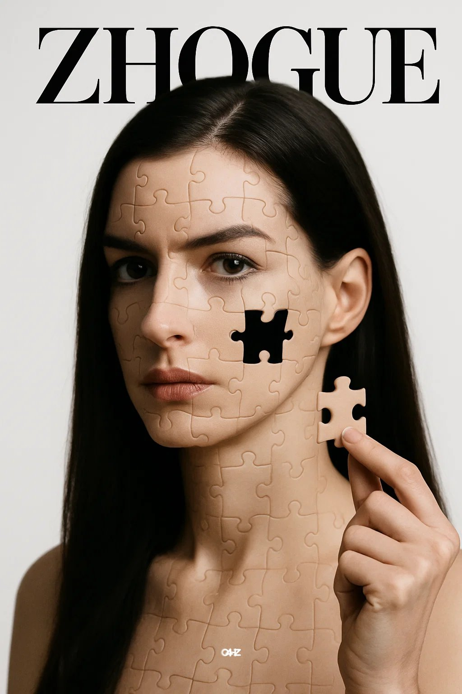

Prompt:

```text
高分辨率的摄影棚人像，一位惊艳年轻模特「安妮海瑟薇」为主角。她拥有一头顺直的黑发，背景为白色，无任何可辨识的元素。她的脸略微侧转，但目光直视镜头，目光强烈而专注，毫无动摇。

她整张脸由拼图块组成——每一块都清晰可见，边缘整齐，具备细腻的立体感。她轻柔地用手指捏着一块刚从脸颊取下的拼图块，露出其下方一个空洞的黑色虚空。

光线集中且具方向性，几乎不产生阴影，但准确地勾勒出皮肤的轮廓与拼图结构的立体感。整体氛围超现实、精准且高度写实。

顶部有像时尚杂志一样的标题“ZHOGUE”（在人物后面）
```

### Nano Banana Pro Prompts #118: 公司金币

- Category: `Product`
- Model: `Nano Banana Pro`
- Author / Source: [@umesh_ai](https://x.com/umesh_ai/status/1924526898840822207)
- Image: `assets/imported/xianyu110/awesome-nanobananapro-prompts/100-70-30-umesh_ai-https-x.com-umesh_ai-status-1924526898840822207.jpeg`

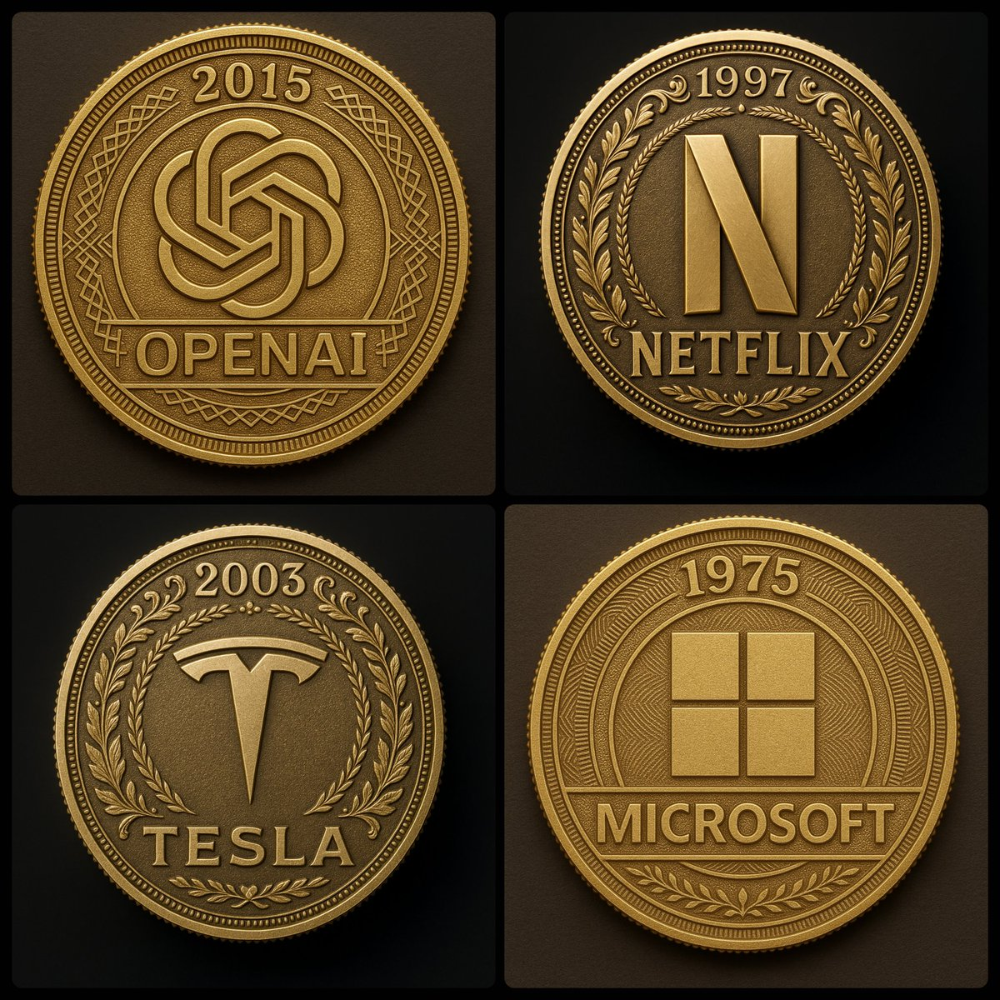

Prompt:

```text
Prompt: A high-resolution photograph of a gold coin featuring the [COMPANY NAME] logo at the center. The coin should have the year [YEAR] engraved at the top. Include finely detailed engravings, ornamental border patterns, and authentic coin textures like reeded edges, matte
```

### Nano Banana Pro Prompts #119: 面包形态

- Category: `Creative`
- Model: `Nano Banana Pro`
- Author / Source: [@azed_ai](https://x.com/azed_ai/status/1924479430157812140)
- Image: `assets/imported/xianyu110/awesome-nanobananapro-prompts/100-71-29-azed_ai-https-x.com-azed_ai-status-1924479430157812140.png`

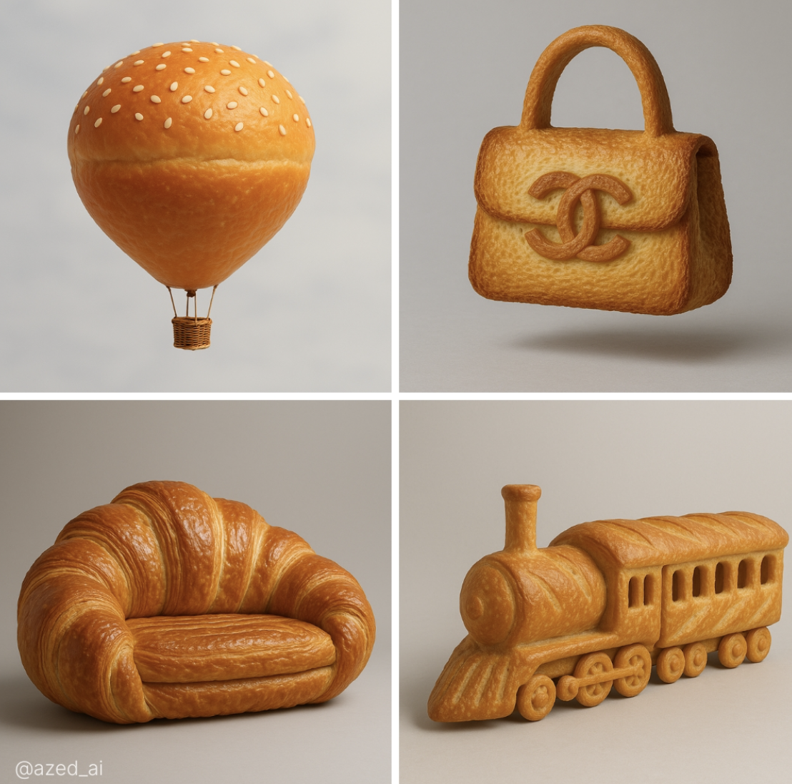

Prompt:

```text
A highly realistic sculpture of a [object], made entirely from [bread type] with ultra-detailed texture and color. The surface shows the natural properties of the bread, golden-brown, glossy, flaky or crusty, with visible layers or seeds where appropriate, studio lighting, soft
```

### Nano Banana Pro Prompts #120: 狭窄走廊里奔跑

- Category: `Portrait`
- Model: `Nano Banana Pro`
- Author / Source: [@B_4AI](https://x.com/B_4AI/status/1924410511392719343)
- Image: `assets/imported/xianyu110/awesome-nanobananapro-prompts/100-72-28-B_4AI-https-x.com-B_4AI-status-1924410511392719343.png`


Prompt:

```text
A thrilling 3D cartoon scene: [CHARACTER1] runs through a narrow corridor inside [Place], chased at high speed by [CHARACTER2]. Their facial expressions reflect tension and focus, with beads of sweat glistening under dramatic lighting.
```

### Nano Banana Pro Prompts #121: 品牌奢华之物从天而降

- Category: `Product`
- Model: `Nano Banana Pro`
- Author / Source: [@hc_dsn](https://x.com/hc_dsn/status/1924390055231287650)
- Image: `assets/imported/xianyu110/awesome-nanobananapro-prompts/100-73-27-hc_dsn-https-x.com-hc_dsn-status-1924390055231287650.png`

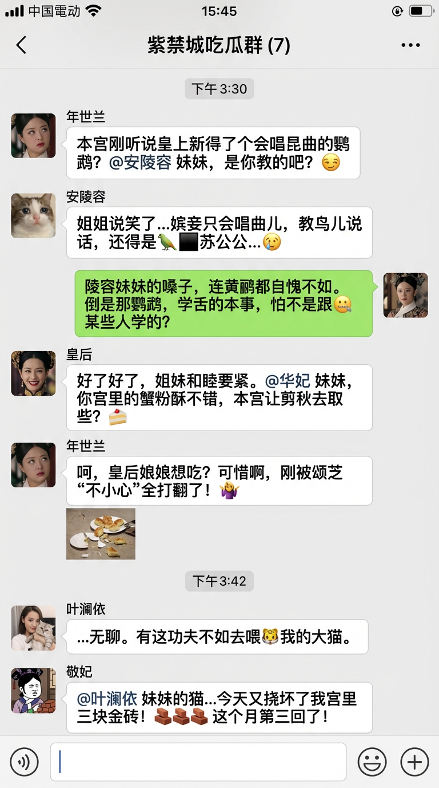

Prompt:

```text
Create a image with 1:1 ratio
a dreamy brand ad of [Brand], a brand designed bubble-like capsule with brand color parachute packaging their classic product, against blue sky and other blurry parachute packaging, white cloud, a small brand logo on top, a tiny slogan beneath it, cinematic day lighting, lens flare, dof, hdr
```

### Nano Banana Pro Prompts #122: 水流身份

- Category: `Product`
- Model: `Nano Banana Pro`
- Author / Source: [@aziz4ai](https://x.com/aziz4ai/status/1924325011847884979)
- Image: `assets/imported/xianyu110/awesome-nanobananapro-prompts/100-74-26-aziz4ai-https-x.com-aziz4ai-status-1924325011847884979.jpeg`

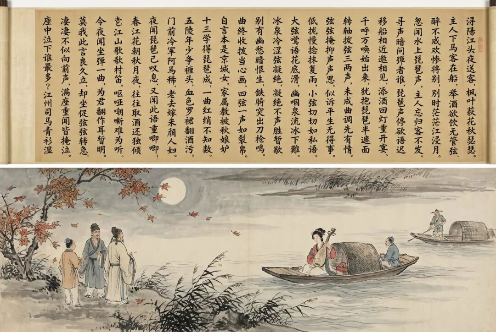

Prompt:

```text
An ultra-high resolution 8K cinematic render of the [Brand Name] logo, sculpted entirely from flowing crystal-clear water. The liquid forms every curve and edge of the brand’s logo with fluid precision, highlighted by vibrant neon accents inspired by [Brand Name]’s color identity. The background is pitch black, creating sharp contrast and drama. The lighting is dynamic, revealing sharp reflections, glowing edges, and the motion of water as it ripples and splashes. Droplets, shine, and soft glass-like textures give the logo a surreal, luxurious, and futuristic appearance — poster-quality, 1:1 format.
```

### Nano Banana Pro Prompts #123: 按键删除周一

- Category: `3D`
- Model: `Nano Banana Pro`
- Author / Source: [@michaelrabone](https://x.com/michaelrabone/status/1924374502529438005)
- Image: `assets/imported/xianyu110/awesome-nanobananapro-prompts/100-75-25-michaelrabone-https-x.com-michaelrabone-status-1924374502529438005.jpeg`

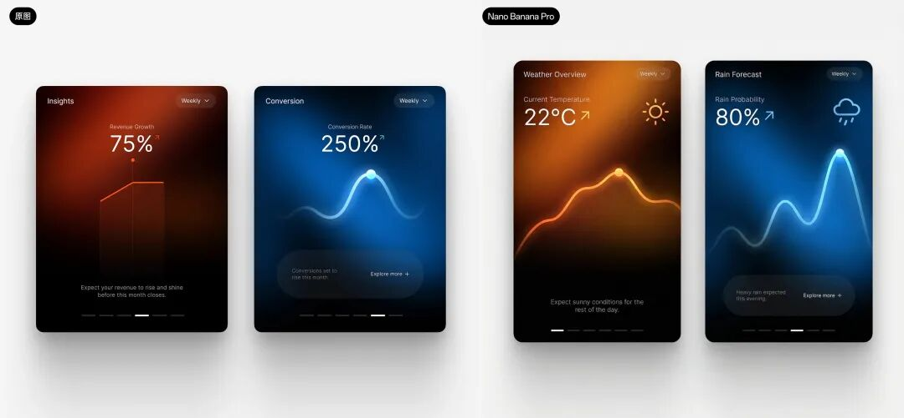

Prompt:

```text
Detailed photographic image of a miniature person in bed feeling cranky under an opened 'Delete Monday' keyboard keycap, using the inside of the keycap as a mini bedroom complete with the usual bedroom stuff
```

### Nano Banana Pro Prompts #124: 新市场中的美妆品牌

- Category: `Product`
- Model: `Nano Banana Pro`
- Author / Source: [@azed_ai](https://x.com/azed_ai/status/1924439540028313693)
- Image: `assets/imported/xianyu110/awesome-nanobananapro-prompts/100-76-24-azed_ai-https-x.com-azed_ai-status-1924439540028313693.png`


Prompt:

```text
A product photography shot of a [PRODUCT] inspired by [FOOD BRAND], placed against a soft light gray background. The product is sharply focused with soft studio lighting. The packaging design includes the official [FOOD BRAND] logo and reflects the brand’s colors and style. The product is sleek, glossy, and realistic, with high detail and elegant presentation. No food items, just the makeup product. Include only the makeup item in the shot. Modern aesthetic, luxury cosmetic branding
```

### Nano Banana Pro Prompts #125: 平面设计等边风格

- Category: `3D`
- Model: `Nano Banana Pro`
- Author / Source: [@Artedeingenio](https://x.com/Artedeingenio/status/1924388407939076377)
- Image: `assets/imported/xianyu110/awesome-nanobananapro-prompts/100-77-23-Artedeingenio-https-x.com-Artedeingenio-status-1924388407939076377.png`

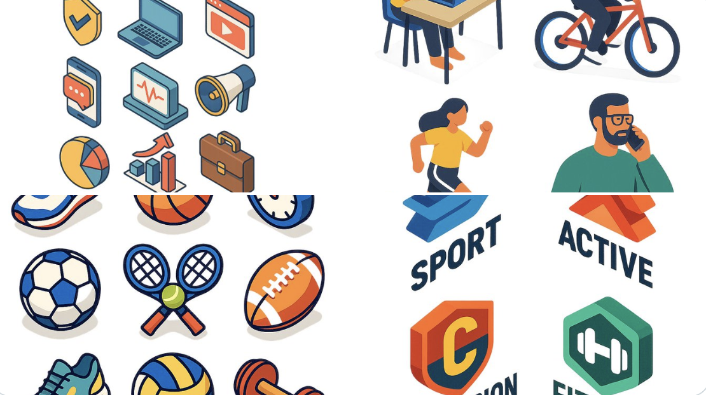

Prompt:

```text
A flat isometric digital illustration of [describe the subject: e.g., a modern workspace, a city block, a group of app icons, a sports shop], clean lines and geometric forms, bright pastel colors, simplified perspective with 3D depth, minimal shading, white background or light gradient. Style resembles modern vector infographics, ideal for UI, app design or web visuals.
```

### Nano Banana Pro Prompts #126: 自定义气球

- Category: `3D`
- Model: `Nano Banana Pro`
- Author / Source: [@ZHO_ZHO_ZHO](https://x.com/ZHO_ZHO_ZHO/status/1924121078559125841)
- Image: `assets/imported/xianyu110/awesome-nanobananapro-prompts/100-78-22-ZHO_ZHO_ZHO-https-x.com-ZHO_ZHO_ZHO-status-1924121078559125841.jpeg`

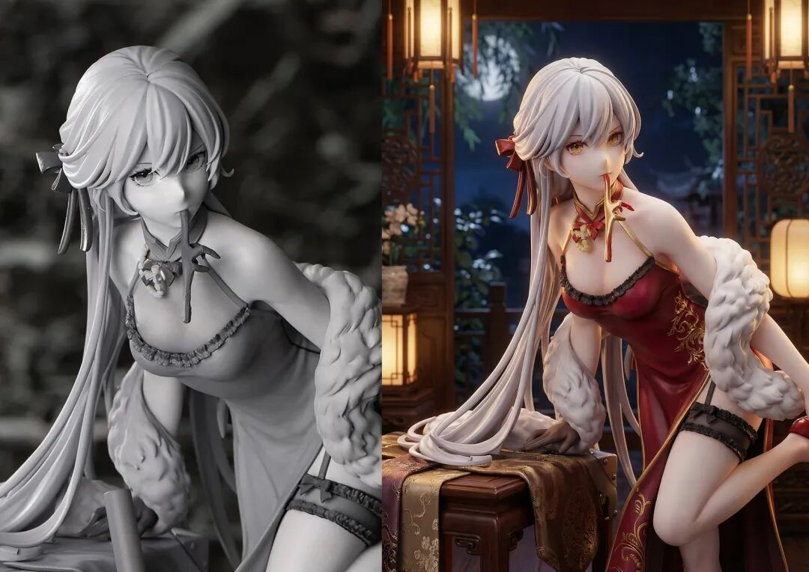

Prompt:

```text
一件高度写实的 3D 装置艺术：字母 Z 被设计成充气球囊造型，整体形态如同流畅弯曲的“Z”字路径，由两段斜线和一个折角构成，边缘略微卷翘，充满柔软的气压感。

视角为正面稍仰视角（约10°）的正交投影，主体置于画面正中央，占据几乎全部画幅，背景为纯黑色，形成类似剧院聚光灯的聚焦舞台效果。

材质为高弹性亮面 PVC，表面涂有高光清漆。主色为柔亮粉色（#FF96AC），阴影部分渐变为淡紫粉色，表面同时具备镜面高光和柔和漫反射，呈现丝滑、饱满、有张力的视觉质感。

左下角可见一个金属螺旋气嘴（银灰色），尺寸很小但极具真实感，暗示其为充气物体。右下笔画末端印有一串黑色的警示文字和安全图标，以“ZHOGUE”风格排版，呼应充气玩具视觉语言。

主光源来自左上方约 35°，呈现清晰的硬边聚光灯效果：在顶部折角与中央斜线区域形成椭圆形白色高光，内折阴影区带有柔和的粉紫色内反射。

辅光来自右后方，轻柔描边顶部和转折边缘，使形体与黑背景分离，整体光比约为 1:2，保持色彩通透与立体感。亮区色温偏冷，营造冷暖对比，进一步突显质感。

球囊表面略显鼓胀，折角与转折区域有尖锐的折痕，带来软体与几何的视觉张力。最深的转折处投下细长阴影，仿佛即将破裂；下方末端则有轻微拉扯感，如气球尾部即将被牵动。

整体概念融合了字母结构与充气玩具的材质语言，通过夸张体积、真实光感与极简舞台感构建出“字母也能呼吸”的视觉冲击，呈现理性几何与感性触觉的碰撞。
```

### Nano Banana Pro Prompts #127: 产品变成纸玻璃

- Category: `Product`
- Model: `Nano Banana Pro`
- Author / Source: [@aziz4ai](https://x.com/aziz4ai/status/1923449494898618849)
- Image: `assets/imported/xianyu110/awesome-nanobananapro-prompts/100-79-21-aziz4ai-https-x.com-aziz4ai-status-1923449494898618849.jpeg`

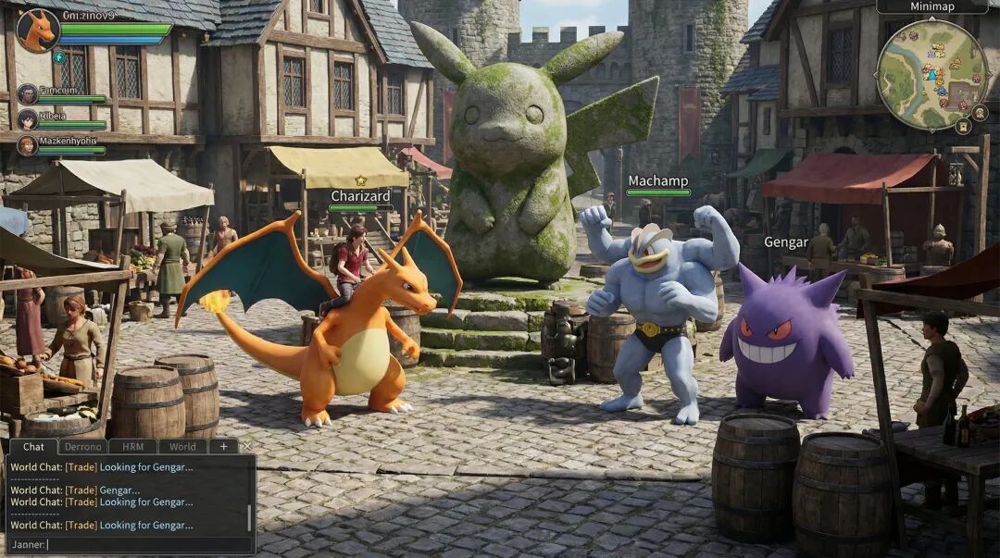

Prompt:

```text
[Product by Brand] in a surreal, minimalist paper-glass style advertisement.
The product is centered, crafted from translucent frosted glass-paper, placed against a clean white or softly tinted background.
Soft cinematic lighting creates gentle contrast and ambient shadows.
A single brand color subtly interacts with the scene through glow, mist, liquid, or foam.
Include a bold, elegant 4-word slogan near the product.
The brand logo appears subtly etched, glowing, or printed in a refined manner.
Vertical or square aspect ratio, ultra-detailed, poster-quality, visually soothing and conceptually refined.
```

### Nano Banana Pro Prompts #128: 透明塑料袋装物体

- Category: `3D`
- Model: `Nano Banana Pro`
- Author / Source: [@azed_ai](https://x.com/azed_ai/status/1923376928918327386)
- Image: `assets/imported/xianyu110/awesome-nanobananapro-prompts/100-80-20-azed_ai-https-x.com-azed_ai-status-1923376928918327386.jpeg`

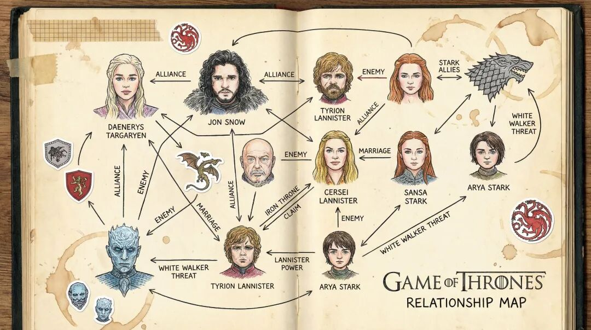

Prompt:

```text
A high-resolution photograph of a clear plastic drawstring bag placed on a light gray background. Inside the bag are multiple tiny 3D [subject] figures arranged neatly. The bag is tied with a soft white ribbon and has a black label tag that reads ‘[LABEL TEXT]’. Soft lighting and clean shadows emphasize the realistic textures and details
```

### Nano Banana Pro Prompts #129: Wide quote card with portrait and Chinese/English customization

- Category: `Portrait`
- Model: `Nano Banana Pro`
- Author / Source: [Nicolechan](https://github.com/YouMind-OpenLab/awesome-nano-banana-pro-prompts/blob/main/README.md)
- Image: `assets/imported/YouMind-OpenLab/awesome-nano-banana-pro-prompts/README-1-Wide-quote-card-with-portrait-and-Chinese-English-customization.jpg`


Prompt:

```text
A wide quote card featuring a famous person, with a brown background and a light-gold serif font for the quote: “{argument name="famous_quote" default="Stay Hungry, Stay Foolish"}” and smaller text: “—{argument name="author" default="Steve Jobs"}.” There is a large, subtle quotation mark before the text. The portrait of the person is on the left, the text on the right. The text occupies two-thirds of the image and the portrait one-third, with a slight gradient transition effect on the portrait.
```

### Nano Banana Pro Prompts #130: Hand-drawn style header image prompt from photo

- Category: `Creative`
- Model: `Nano Banana Pro`
- Author / Source: [セミナー講師専門AIコンシェルジュ｜工藤 晶](https://github.com/YouMind-OpenLab/awesome-nano-banana-pro-prompts/blob/main/README.md)
- Image: `assets/imported/YouMind-OpenLab/awesome-nano-banana-pro-prompts/README-2-Hand-drawn-style-header-image-prompt-from-photo.jpg`


Prompt:

```text
Completely recreate the uploaded person.
Make it a header image for a note article where that person introduces “Nano Banana Pro”.
Aspect ratio: horizontal 16:9.
Style and colors: simple, hand-drawn style, italic, with a blue and green gradient.
Title text: “In-depth explanation of Google’s new AI ‘Nano Banana Pro’”.
```

### Nano Banana Pro Prompts #131: Watercolor map of Germany with labeled states

- Category: `Creative`
- Model: `Nano Banana Pro`
- Author / Source: [Florian Gallwitz](https://github.com/YouMind-OpenLab/awesome-nano-banana-pro-prompts/blob/main/README.md)
- Image: `assets/imported/YouMind-OpenLab/awesome-nano-banana-pro-prompts/README-3-Watercolor-map-of-Germany-with-labeled-states.jpg`

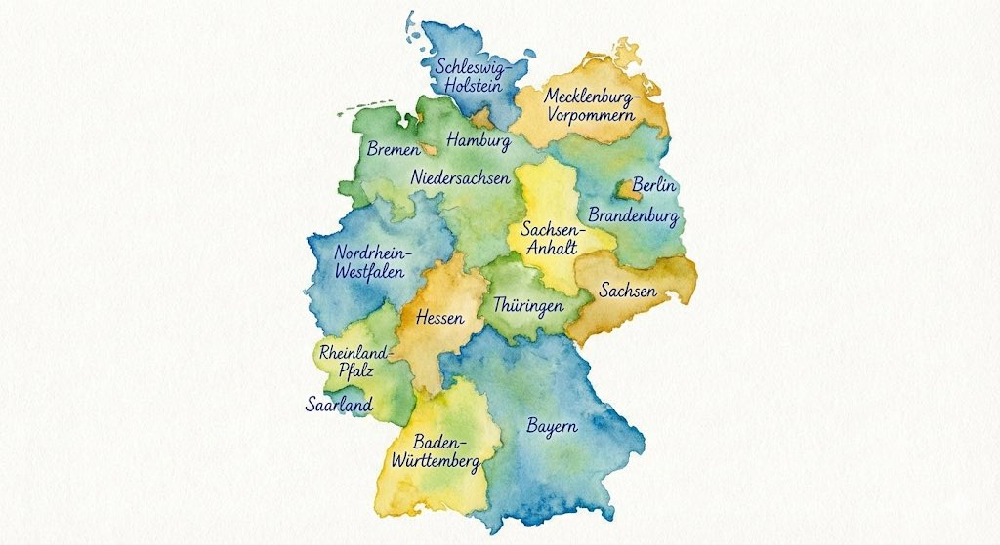

Prompt:

```text
Generate a map of Germany in watercolor style, on which all federal states are labeled in ballpoint pen.
```

### Nano Banana Pro Prompts #132: New Year's Day Special: Four-Panel Puzzle for 2026 Blessing

- Category: `Portrait`
- Model: `Nano Banana Pro`
- Author / Source: [松果先森](https://github.com/YouMind-OpenLab/awesome-nano-banana-pro-prompts/blob/main/README.md)
- Image: `assets/imported/YouMind-OpenLab/awesome-nano-banana-pro-prompts/README-4-New-Year-s-Day-Special-Four-Panel-Puzzle-for-2026-Blessing.jpg`

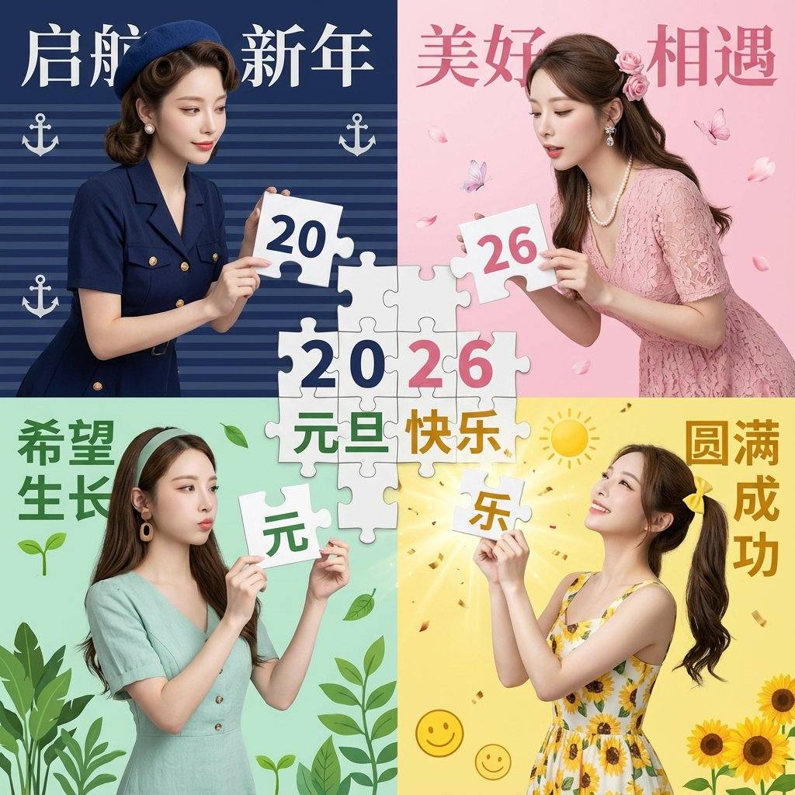

Prompt:

```text
[Key: Maintain precise facial features, retain original face structure, the character in the image must be completely consistent with the uploaded reference image] High-end photo studio 2x2 grid photo. Top-left panel (Navy Blue background): The character wears a navy blue uniform-style dress, decorated with gold buttons, vintage curls with a blue beret and pearl earrings. She holds up a huge puzzle piece (top-left piece, with the number "20" on it) with both hands, moving it towards the center of the frame. Her eyes are focused on the central puzzle area, her expression is serious, with a slight smile. The background features navy stripes, an anchor, and the text "Set Sail for the New Year". Top-right panel (Cherry Blossom Pink background): The same woman wears a pink lace dress, a pearl necklace, a princess hairstyle with a pink rose hairpin and crystal earrings. She holds up the top-right puzzle piece (with the number "26" on it) with both hands, moving it towards the center to connect with the top-left piece. Her eyes look at the puzzle seam, her expression is focused and expectant, and her body leans forward. The background features pink cherry blossoms, the text "Beautiful Encounter", butterflies, and petals. Bottom-left panel (Mint Green background): The same woman wears a mint green cotton and linen dress, in an artistic style, with natural long hair, a green hairband, and wooden earrings. She holds up the bottom-left puzzle piece (with the text "New Year's Day" on it) with both hands, moving it upwards to connect with the top-left piece. Her eyes look at the puzzle, her expression is serious, and her mouth is slightly pursed. The background features green plants, the text "Hope Grows", new sprouts, and leaves. Bottom-right panel (Lemon Yellow background): The same woman wears a yellow dress with a sunflower pattern, pigtails with yellow bows. She pushes in the last bottom-right puzzle piece (with the text "Happy" on it) to complete the puzzle. The four pieces perfectly form the complete pattern "2026 New Year's Day Happy" in the center of the frame. She tilts her head back, looking at the completed puzzle, her face beaming with a successful, joyful smile. The center of the frame bursts with golden light and confetti. The background features a yellow sun, the text "Complete Success", smiley faces, and sunflowers. The puzzle pieces converge from the four corners to the center to form a complete picture. Clear makeup, bright ring light, 85mm lens, f/1.8 aperture, four-panel composition with puzzle interaction, fashion magazine style.
```

### Nano Banana Pro Prompts #133: Vintage Patent Document for an Invention

- Category: `Creative`
- Model: `Nano Banana Pro`
- Author / Source: [Alexandra Aisling](https://github.com/YouMind-OpenLab/awesome-nano-banana-pro-prompts/blob/main/README.md)
- Image: `assets/imported/YouMind-OpenLab/awesome-nano-banana-pro-prompts/README-5-Vintage-Patent-Document-for-an-Invention.jpg`

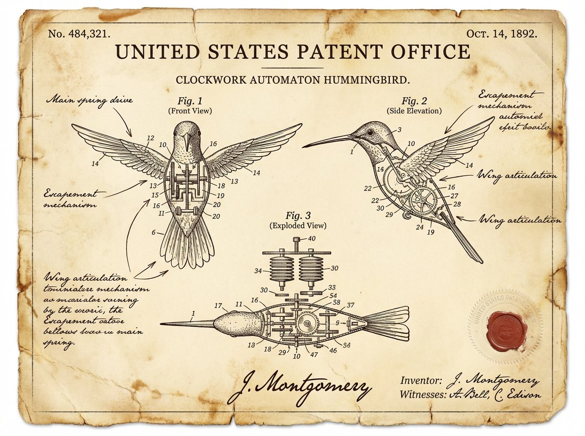

Prompt:

```text
A vintage patent document for {argument name="invention" default="INVENTION"}, styled after late 1800s United States Patent Office filings. The page features precise technical drawings with numbered callouts (Fig. 1, Fig. 2, Fig. 3) showing front, side, and exploded views. Handwritten annotations in fountain-pen ink describe mechanisms. The paper is aged ivory with foxing stains and soft fold creases. An official embossed seal and red wax stamp appear in the corner. A hand-signed inventor's name and date appear at the bottom. The entire image feels like a recovered archival document—authoritative, historic, and slightly mysterious.
```

### Nano Banana Pro Prompts #134: Chalkboard-style AI news summary

- Category: `Infographic`
- Model: `Nano Banana Pro`
- Author / Source: [ひでもん | AI開発@ニュース発信](https://github.com/YouMind-OpenLab/awesome-nano-banana-pro-prompts/blob/main/README.md)
- Image: `assets/imported/YouMind-OpenLab/awesome-nano-banana-pro-prompts/README-6-Chalkboard-style-AI-news-summary.jpg`

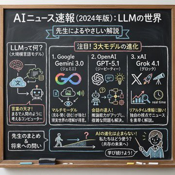

Prompt:

```text
Using the following content, summarize the news in a chalkboard-style, hand‑written look, and break it down with diagrams and easy‑to‑understand expressions as if a teacher had written it.
—-
Search results from Grok
```

### Nano Banana Pro Prompts #135: Detailed mirror-selfie otaku room scene

- Category: `Product`
- Model: `Nano Banana Pro`
- Author / Source: [宝玉](https://github.com/YouMind-OpenLab/awesome-nano-banana-pro-prompts/blob/main/README.md)
- Image: `assets/imported/YouMind-OpenLab/awesome-nano-banana-pro-prompts/README-7-Detailed-mirror-selfie-otaku-room-scene.jpg`

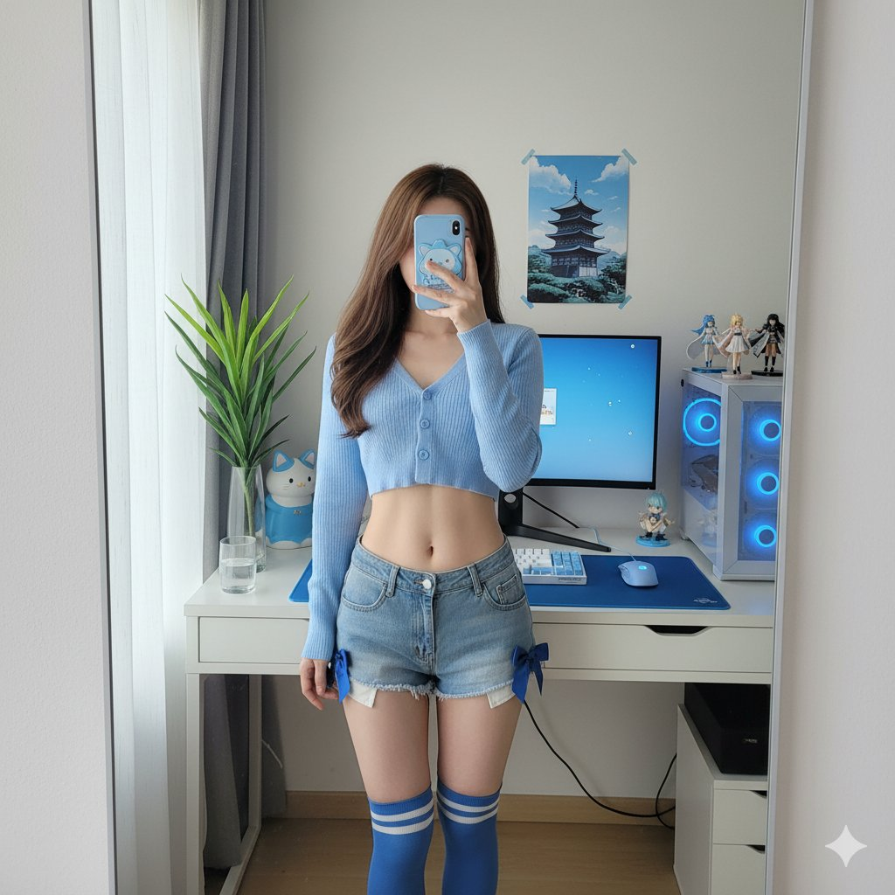

Prompt:

```text
### Scene
Mirror selfie in an otaku-style computer corner, blue color tone.

### Subject
* Gender expression: female
* Age: around 25
* Ethnicity: East Asian
* Body type: slim, with a defined waist; natural body proportions
* Skin tone: light neutral tone
* Hairstyle:
    * Length: waist-length hair
    * Style: straight with slightly curled ends
    * Color: medium brown
* Pose:
    * Stance: standing in a slight contrapposto pose
    * Right hand: holding a smartphone in front of her face (identity hidden)
    * Left arm: naturally hanging down alongside the torso
    * Torso: body leaning slightly back; waist and abdomen exposed
* Clothing:
    * Top: light blue cropped knit cardigan, top two buttons fastened; a blue French-style bra faintly visible
    * Bottom: denim ultra-short shorts, with a blue satin ribbon bow on each side of the hips
    * Socks: blue and white horizontal striped over-the-knee socks
    * Accessory: a blue cute mascot phone case

### Environment
* Description: bedroom computer corner seen through a wall-mounted mirror
* Furnishings:
    * White desk
    * Single monitor showing a soft blue wallpaper (no readable text)
    * Mechanical keyboard with white keycaps on a blue desk mat
    * Mouse on a small blue mouse pad
    * PC tower on the right side with blue case lighting
    * Three anime figures on or near the PC tower
    * A poster of a pagoda on the wall
    * Cat-shaped desk lamp with blue accents
    * A transparent glass of water
    * A tall green leafy plant by the window (on the left side of the frame)
* Color replacement: replace all originally pink elements (clothes and room decor) with blue tones (baby blue to sky blue/periwinkle blue).

### Lighting
* Light source: daylight coming from a large window on the left side of the camera, through sheer curtains
* Light quality: soft, diffused light
* White balance (K): 5200

### Camera
* Mode: smartphone rear camera shooting via the mirror (no portrait/bokeh mode)
* Equivalent focal length (mm): 26
* Distances (m):
    * Subject to mirror: 0.6
    * Camera to mirror: 0.5
* Exposure:
    * Aperture (f): 1.8
    * ISO: 100
    * Shutter speed (s): 0.01
    * Exposure compensation (EV): -0.3
* Focus: focus on the torso and shorts in the mirror image
* Depth of field: natural smartphone deep depth of field; background clearly visible with no artificial blur
* Composition:
    * Aspect ratio: 1:1
    * Crop: from the top of the head to mid-thigh; include the desk, monitor, PC tower, and plant in the frame
    * Angle: slightly high angle from the mirror’s point of view
    * Composition note: keep the subject centered; to avoid wide-angle edge distortion, have her stand a bit further away and crop to a square later.

### Negative prompts
* Any appearance of pink/magenta anywhere
* Beauty filters/over-smoothed skin; poreless skin look
* Exaggerated or distorted anatomy
* NSFW, see-through fabrics, wardrobe malfunctions
* Logos, brand names, or readable user interface text
* Fake portrait-mode blur, CGI/illustration feel
```

### Nano Banana Pro Prompts #136: Edo-period Ukiyo-e reinterpretation of a modern scene

- Category: `Portrait`
- Model: `Nano Banana Pro`
- Author / Source: [VoxcatAI](https://github.com/YouMind-OpenLab/awesome-nano-banana-pro-prompts/blob/main/README.md)
- Image: `assets/imported/YouMind-OpenLab/awesome-nano-banana-pro-prompts/README-8-Edo-period-Ukiyo-e-reinterpretation-of-a-modern-scene.jpg`

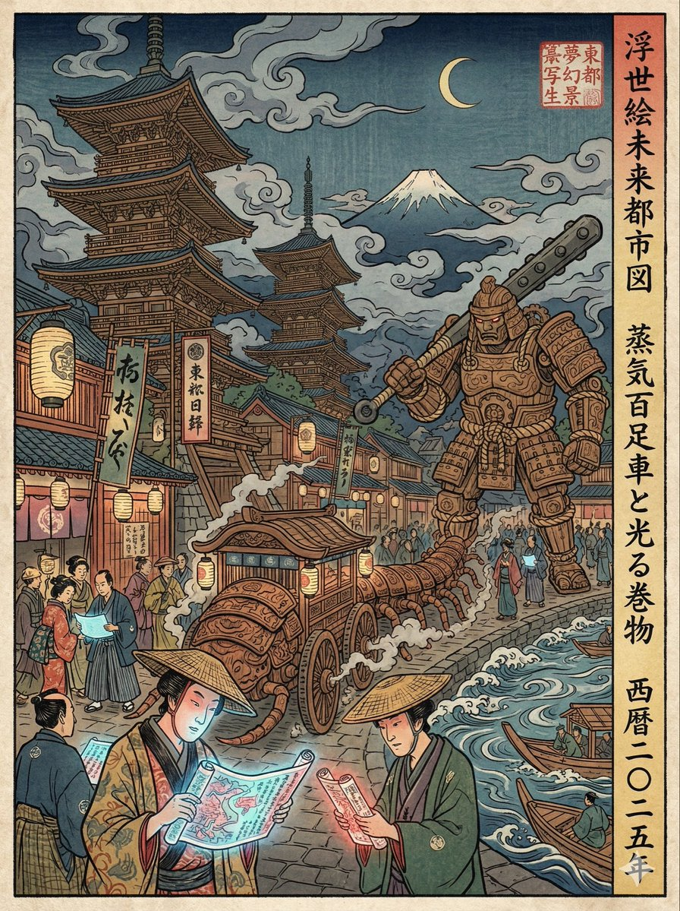

Prompt:

```text
A Japanese Edo-period Ukiyo-e woodblock print. The overall feeling is a surreal collaboration between masters like Hokusai and Hiroshige, reimagining modern technology through an ancient lens.

**The scene:** {argument name="modern scene" default="a busy Shibuya scramble crossing"}

**Edo transformation logic:**
Characters wear Edo-era kimono but perform modern actions. All technology is transformed into surreal Edo equivalents:
* Smartphones are glowing, illustrated paper scrolls being read intently.
* Metro stations and trains are giant articulated wooden centipede carriages shuffling through crowds.
* Skyscrapers are reimagined as endless, towering wooden pagodas reaching into dramatic clouds.
* Robots and mecha appear as giant, armored woodblock golems.

The composition uses a flattened perspective with large, bold, hand-carved ink outlines. The background features heavily stylized Ukiyo-e wave patterns and dramatic, swirling clouds, with a distant Mt. Fuji visible on the horizon.

The image must look like a physical print, not a digital painting.
* Texture: strong visible wood grain texture and rough paper fibers throughout the piece.
* Printing imperfections: pigment bleeding is evident. Simulate hand-pressed plates with slight color misalignment for authenticity.
* Color palette: strictly limited to traditional mineral pigments, with dominant use of Prussian blue, vermilion red, and muted yellow ochre.
* Lighting: soft, flat, shadow-free lighting with no digital gradients.

Aspect ratio is 3:4 vertical poster. Include vertical Japanese calligraphy describing the scene and a traditional red artist seal stamp in a corner.
```

### Nano Banana Pro Prompts #137: Profile / Avatar - Dramatic High Contrast Studio Portrait

- Category: `Portrait`
- Model: `Nano Banana Pro`
- Author / Source: [Heisenberg](https://github.com/YouMind-OpenLab/awesome-nano-banana-pro-prompts/blob/main/README.md)
- Image: `assets/imported/YouMind-OpenLab/awesome-nano-banana-pro-prompts/README-9-Profile-Avatar-Dramatic-High-Contrast-Studio-Portrait.jpg`

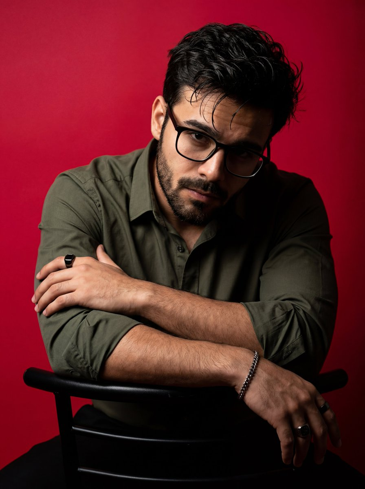

Prompt:

```text
A dramatic, high-contrast studio portrait of a {argument name="subject description" default="man with dark messy hair and a well groomed beard"}, wearing {argument name="eyewear" default="black rectangular glasses"} and a {argument name="shirt color" default="dark olive-green"} collared shirt. He is leaning forward over the curved backrest of a black chair, gazing intently down towards the lens. The entire setting features a striking, solid vibrant crimson-red background wall that transitions into deep shadows toward the lower right, establishing a highly atmospheric and moody character aesthetic. He Is leaning forward with his head tilted down and slightly to the left, resting both forearms on the horizontal backrest of a chair. His gaze is directed downwards towards the camera with a serious, intense expression. He is wearing a smooth woven olive-green collared shirt, fully buttoned up with visible collar points and a center placket. The sleeves are rolled up neatly to his mid-forearms, creating fabric folds near his elbows. A chunky, dark signet-style ring is visible on the index finger of his left hand, along with a dark ring on his right hand. A metallic chain bracelet consisting of small interlocking links is wrapped around his left wrist. An eye-level, medium close-up shot that captures the subject from the waist up, focusing heavily on his facial expression, hair texture, and upper torso. Strong, directional artificial studio lighting coming from the top-left. This illuminates the left side of his forehead, nose bridge, cheek, and the wet sheen of his hair, while casting deep, heavy shadows across the right side of his face and shading the lower half of his body into near-total darkness. A bold, high-contrast color scheme dominated by the vivid red background, the dark olive green of the shirt, and the solid black tones of the hair, glasses, and chair. The background shows a soft vignette effect, appearing brighter on the upper-left and deepening into dark red behind the subject's left shoulder.
```

### Nano Banana Pro Prompts #138: Profile / Avatar - Parisian Twilight Lifestyle Portrait

- Category: `Portrait`
- Model: `Nano Banana Pro`
- Author / Source: [Picts by AI](https://github.com/YouMind-OpenLab/awesome-nano-banana-pro-prompts/blob/main/README.md)
- Image: `assets/imported/YouMind-OpenLab/awesome-nano-banana-pro-prompts/README-10-Profile-Avatar-Parisian-Twilight-Lifestyle-Portrait.jpg`

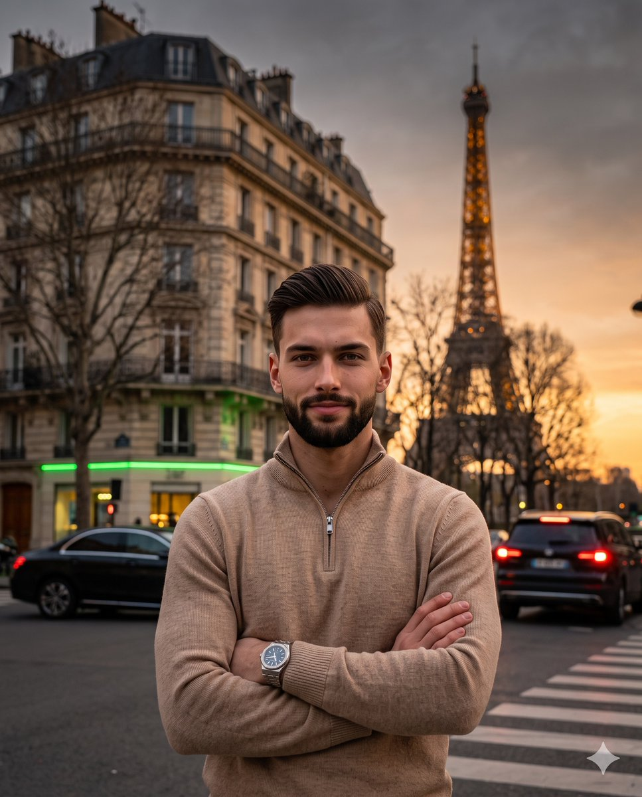

Prompt:

```text
A {argument name="subject" default="young male adult"} stands centered, facing the camera straight on with leveled shoulders and a deliberately posed, confident demeanor. He exhibits a subtle closed smile, his relaxed eyebrows resting above eyes that hold a steady, direct gaze. His dark brown, medium-short hair is parted slightly off-center and styled back with a glossy pomade, revealing a slightly wavy texture with volume at the roots and a distinct natural imperfection of a single loose flyaway strand falling gently over his right forehead. He wears a {argument name="outfit" default="warm beige zip sweater"}, his arms crossed relaxedly at his chest; his fully visible left hand rests on his right bicep, adorned with a silver watch, while his right hand is tucked under his left arm. He is situated outdoors in a deep, layered spatial setting where the background falls into a soft blur. Behind him in the midground, a vintage Haussmann building rises on the right with classic architectural molding and smooth but slightly textured aged matte plaster walls showing patchy warm beige-gray paint and neon reflections, while solid warm gray concrete grounds the environment. Weathered, leafless winter trees flank the left and center, and a worn black sedan and an SUV with glowing red tail lights navigate near a crosswalk with streetlights at the bottom right. Deep in the right-center background, the pristine silhouette of the Eiffel Tower is brightly illuminated against the sky. The {argument name="setting" default="serene Parisian twilight"} is infused with urban energy and a sophisticated, calm mood, dominated by a complementary palette of warm beige, sunset orange-yellow, charcoal gray, and striking accents of neon green glowing from the base of the architecture. Mixed, multiple soft light sources diffuse gently from above, providing a golden ambient fill with moderate intensity and low, flat contrast. Soft, short, and gradual gray shadows gather subtly under his chin and crossed arms, while preserved highlights catch naturally on his defined cheekbones and glossy hair. Captured as a realistic, tack-sharp digital photograph on a 35mm lens at f/2.8, 1/125s, and ISO 400, the clean, grain-free lifestyle travel aesthetic utilizes a medium depth of field and is elevated by post-processing that applies warm color grading in the highlights, lifted shadows, and enhanced neon green accents, all beautifully framed in a 4:5 aspect ratio.
```

### Nano Banana Pro Prompts #139: Profile / Avatar - Female Boxer Studio Portrait

- Category: `Portrait`
- Model: `Nano Banana Pro`
- Author / Source: [MayorkingAI](https://github.com/YouMind-OpenLab/awesome-nano-banana-pro-prompts/blob/main/README.md)
- Image: `assets/imported/YouMind-OpenLab/awesome-nano-banana-pro-prompts/README-11-Profile-Avatar-Female-Boxer-Studio-Portrait.jpg`

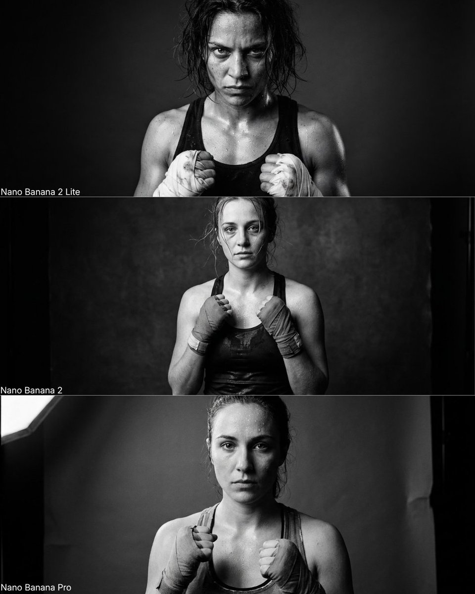

Prompt:

```text
Studio portrait photography, {argument name="subject" default="female boxer in her 20s"} photographed seconds after training, wrapped hands still taped, sweat beading on her collarbone and catching the light, direct unflinching gaze into camera, single large octabox positioned 45 degrees camera-left
```

### Nano Banana Pro Prompts #140: Profile / Avatar - East Asian Woman Selfie Portrait

- Category: `Portrait`
- Model: `Nano Banana Pro`
- Author / Source: [𝗦𝗮𝗻𝗶𝗮](https://github.com/YouMind-OpenLab/awesome-nano-banana-pro-prompts/blob/main/README.md)
- Image: `assets/imported/YouMind-OpenLab/awesome-nano-banana-pro-prompts/README-12-Profile-Avatar-East-Asian-Woman-Selfie-Portrait.jpg`

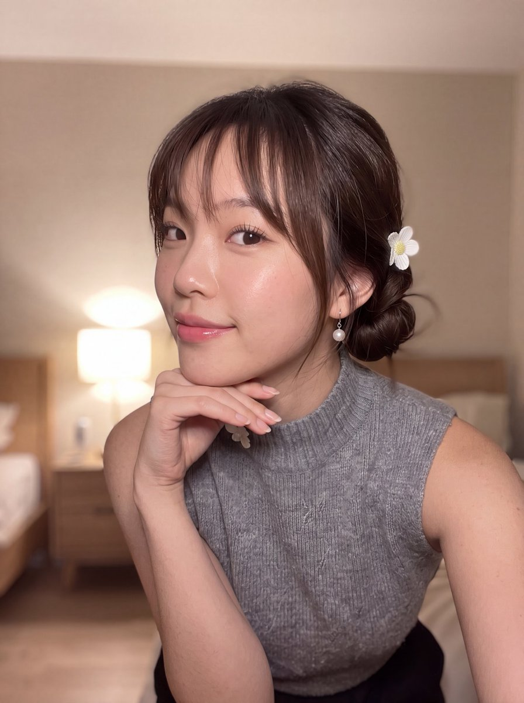

Prompt:

```text
Photorealistic smartphone selfie of a beautiful young {argument name="ethnicity" default="East Asian woman"} with fair porcelain skin, a messy low bun, wispy bangs, and a small white flower hair clip. She wears pearl drop earrings and a {argument name="outfit" default="gray knitted sleeveless high-neck sweater"} with a small flower detail at the collar. Soft Korean makeup, rosy cheeks, and glossy lips. {argument name="location" default="Cozy modern bedroom"} background with warm ambient lighting and a glowing lamp behind her. Slightly low-angle selfie perspective, soft background blur, natural iPhone camera aesthetic, candid handheld snapshot, realistic skin texture, ultra-realistic, vertical 3:4.
```

### Nano Banana Pro Prompts #141: Profile / Avatar - Retro Jersey Night Party Portrait

- Category: `Portrait`
- Model: `Nano Banana Pro`
- Author / Source: [Mahnoor Fatima](https://github.com/YouMind-OpenLab/awesome-nano-banana-pro-prompts/blob/main/README.md)
- Image: `assets/imported/YouMind-OpenLab/awesome-nano-banana-pro-prompts/README-13-Profile-Avatar-Retro-Jersey-Night-Party-Portrait.jpg`

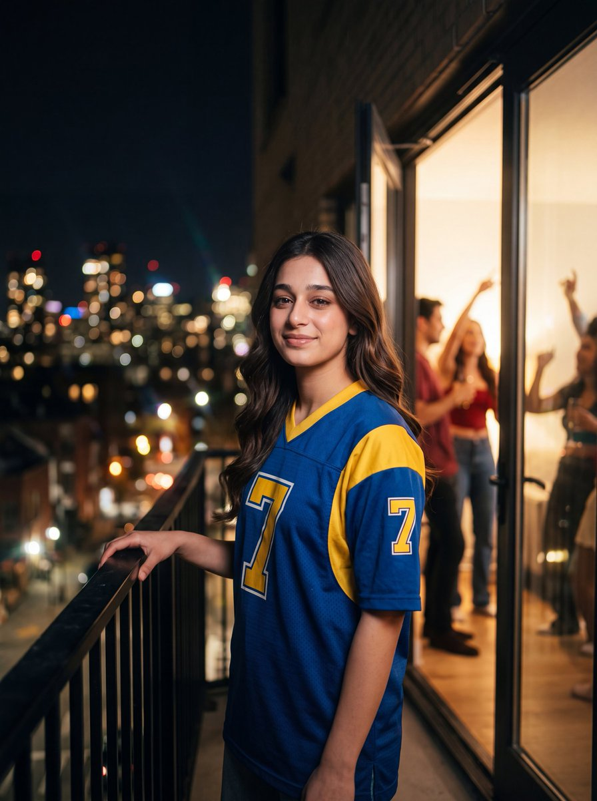

Prompt:

```text
Use the uploaded reference image as the exact face reference. Preserve the exact facial identity with full face lock. Ultra-realistic cinematic night portrait standing on a small apartment balcony during a house party. Wearing a {argument name="clothing" default="retro football jersey"}, one hand resting on the {argument name="setting" default="balcony railing"} while city lights blur in the background. Warm indoor lighting spills through the open balcony door where party guests remain visible inside. {argument name="film type" default="Kodak Portra"} film colors, soft haze, dreamy lens flare, analog grain, documentary fashion photography, realistic lighting, nostalgic youth aesthetic, vertical 4:5.
```

### Nano Banana Pro Prompts #142: Profile / Avatar - Low-Key Studio Black and White Portrait

- Category: `Product`
- Model: `Nano Banana Pro`
- Author / Source: [Nexora](https://github.com/YouMind-OpenLab/awesome-nano-banana-pro-prompts/blob/main/README.md)
- Image: `assets/imported/YouMind-OpenLab/awesome-nano-banana-pro-prompts/README-14-Profile-Avatar-Low-Key-Studio-Black-and-White-Portrait.jpg`

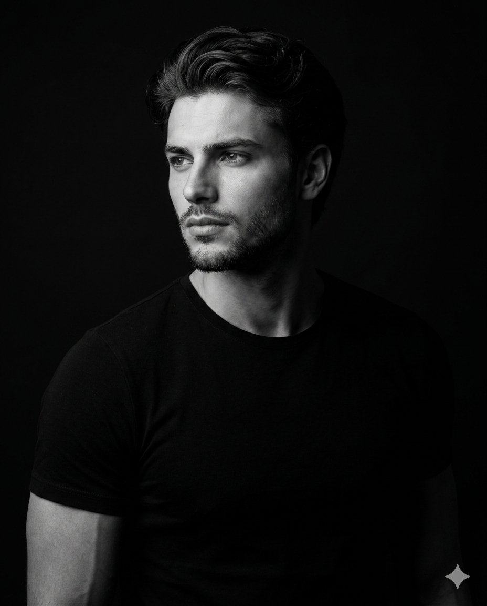

Prompt:

```text
Use the uploaded image as the ONLY identity reference. Preserve the subject's exact facial identity, facial proportions, hairstyle, beard pattern, skin texture, age, ethnicity, and natural features. The person in the final image must remain instantly recognizable as the uploaded individual. Do not beautify, alter, or redesign the face.

Create an ultra-realistic fine-art black-and-white low-key studio portrait in a 4:5 aspect ratio.

Composition: Medium close-up framing, filling approximately 65-70% of the frame, showing only the head, neck, shoulders, upper chest, and upper arms.

Wardrobe: The subject wears a {argument name="wardrobe" default="plain black fitted crew-neck T-shirt"} with no logos, graphics, or text.

Pose: The body is rotated approximately 45° away from the camera in a {argument name="pose" default="strong three-quarter pose"}, with the left shoulder (image left) closest to the camera. The chest faces toward the left side of the frame rather than directly toward the viewer. The head is turned only slightly farther left than the torso, maintaining a natural three-quarter angle instead of a full profile. The eyes look off-frame toward the upper left, focused on something slightly above eye level. The gaze should feel subtle, thoughtful, and contemplative—not looking into the camera, not looking directly left, and not looking high into the sky. The chin is slightly lowered, creating a calm, serious, introspective expression.

Lighting: Use a {argument name="lighting" default="single soft key light positioned from the upper left"}. Illuminate only the camera-facing side of the forehead, eye, cheekbone, nose bridge, lips, beard, and neck. The opposite side of the face should gradually fade into deep black shadow, with the far cheek, ear, jawline, shoulder, and most of the torso completely disappearing into darkness.

The black T-shirt should blend seamlessly into the shadows so that the lower chest, arms, and body are almost invisible, leaving the illuminated side of the face as the primary focal point.

Background: Pure matte black with absolutely no texture, patterns, objects, or distractions.

Style: High-contrast monochrome, cinematic fine-art portrait with soft shadow transitions, realistic skin texture, natural hair detail, subtle film grain, and an intensely dark, minimalist atmosphere. Ultra-detailed, museum-quality studio photography, 8K realism.
```

### Nano Banana Pro Prompts #143: Profile / Avatar - Double Exposure Watercolor Portrait Art

- Category: `Portrait`
- Model: `Nano Banana Pro`
- Author / Source: [Soaima](https://github.com/YouMind-OpenLab/awesome-nano-banana-pro-prompts/blob/main/README.md)
- Image: `assets/imported/YouMind-OpenLab/awesome-nano-banana-pro-prompts/README-15-Profile-Avatar-Double-Exposure-Watercolor-Portrait-Art.jpg`

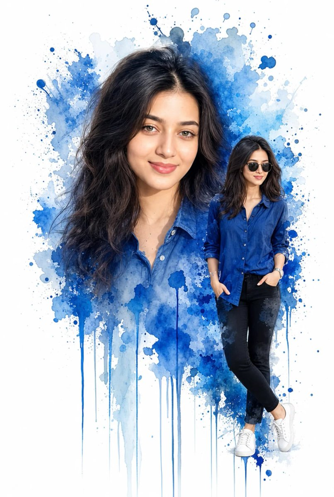

Prompt:

```text
A stunning double exposure watercolor portrait art of a young woman with {argument name="hair color" default="dark brown"} shoulder-length hair, {argument name="eye color" default="hazel-green"} eyes, natural makeup, soft smile, wearing a {argument name="clothing" default="royal blue button-up casual shirt"}. Large close-up face portrait blended seamlessly with a full-body shot of the same woman wearing sunglasses, black slim pants, white sneakers and a wristwatch, standing in a relaxed pose with one leg crossed. Background is pure white with dramatic royal blue and cobalt watercolor ink splashes, blooms, and drips cascading down. Watercolor paint splatters in varying shades of blue — cobalt, indigo, cerulean — scattered across the white canvas. Paint drips running vertically downward. The portrait and full-body figure emerge organically from the watercolor splashes. Ultra-realistic photographic face with painterly watercolor body transition. High detail, sharp focus on face, soft artistic edges blending into watercolor. Editorial art style, white background, blue ink wash aesthetic.
```

### Nano Banana Pro Prompts #144: Profile / Avatar - Natural Glass Skin Selfie

- Category: `Portrait`
- Model: `Nano Banana Pro`
- Author / Source: [Simply Ray](https://github.com/YouMind-OpenLab/awesome-nano-banana-pro-prompts/blob/main/README.md)
- Image: `assets/imported/YouMind-OpenLab/awesome-nano-banana-pro-prompts/README-16-Profile-Avatar-Natural-Glass-Skin-Selfie.jpg`

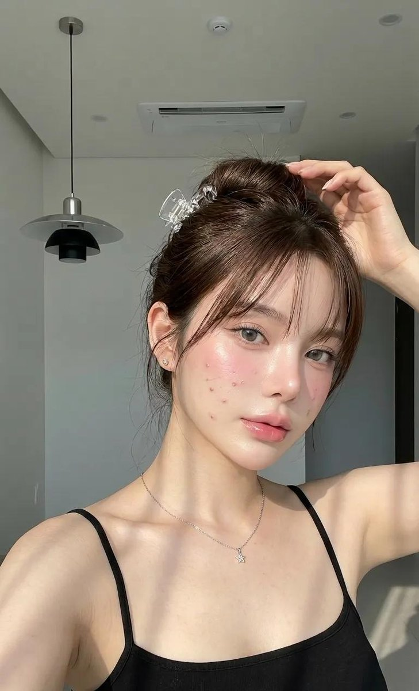

Prompt:

```text
A close-up selfie portrait of a {argument name="subject" default="woman"} with bright natural fair skin, featuring healthy, hydrated glowing skin with a very realistic glass skin effect, especially on the cheeks, tip of the nose, forehead, and T-zone. Her face remains natural and realistic, with slight subtle breakouts and faint acne marks still softly visible so the result does not look overly smoothed or artificial. The makeup is highly detailed yet still natural and radiant: lightweight even base makeup, dewy wet finish, thin concealer, soft pink blush on the cheeks, subtle highlighter on the cheekbones and nose tip, natural pink lip gloss with a healthy plump lip effect, neatly groomed dark brown natural eyebrows, naturally curled lashes, soft and clean eye makeup, not excessive. Her face looks fresh, feminine, and elegant.

She is in a modern minimalist indoor room, with a grayish-white wall background, a high ceiling with black decorative hanging lights and central air conditioning, and soft natural light coming from a side window that casts artistic shadow lines across her face, neck, and shoulders. The warm and gentle natural lighting creates an aesthetic, dreamy, clean, and high-end atmosphere. The background is simple, clean, and uncluttered so the main focus stays on the subject’s face and expression.

She wears a {argument name="outfit" default="thin black tank top"} with a simple cut and small straps, giving a casual, clean, effortless, and fresh look. The pose is a half-body close-up selfie, with one hand raised above the head while holding or adjusting her hair, her head slightly tilted, shoulders relaxed, and her facial expression calm and soft. She looks directly into the camera with an elegant and natural aura. The pose feels relaxed yet graceful.

Her hair is styled in a relaxed messy bun secured with a {argument name="hair accessory" default="transparent crystal claw clip"}, with a few thin front bangs softly framing the face. The hair texture looks smooth, light, and slightly shiny under the sunlight.

She wears small earrings and a delicate necklace with a tiny star-shaped pendant.

Camera angle: close-up portrait selfie, shot from slightly below eye level to eye level, framed to focus on the face and upper body, with an aesthetic composition that highlights the light on the skin, facial texture, and makeup details. HD, 8K, ultra sharp, aesthetic, soft natural contrast, realistic skin texture, cinematic daylight, clean composition, high detail, soft shadows, elegant minimal look.

Negative prompt (optional):
excessive makeup, overly blurred skin, plastic face, heavy beauty filter, dark lighting, stiff pose, busy background, overly saturated colors, lost skin texture, overly oval face, strange expression, artifacts, noise, low quality, overexposed, underexposed
```

### Nano Banana Pro Prompts #145: Profile / Avatar - Creative Professional Studio Portrait

- Category: `Product`
- Model: `Nano Banana Pro`
- Author / Source: [liana](https://github.com/YouMind-OpenLab/awesome-nano-banana-pro-prompts/blob/main/README.md)
- Image: `assets/imported/YouMind-OpenLab/awesome-nano-banana-pro-prompts/README-17-Profile-Avatar-Creative-Professional-Studio-Portrait.jpg`

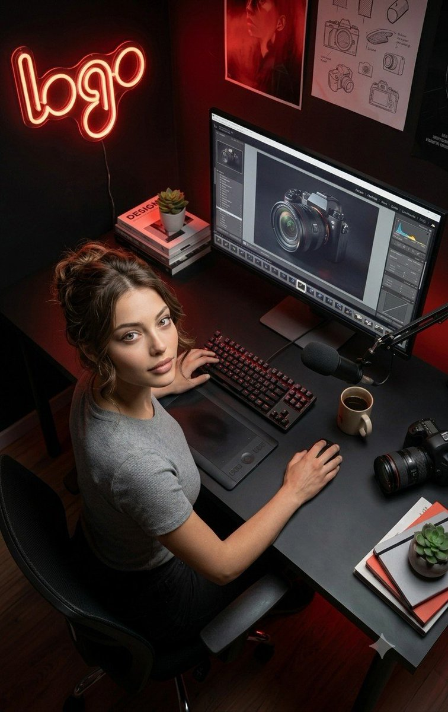

Prompt:

```text
Ultra-realistic cinematic portrait of a young {argument name="subject" default="female creative professional"} working in a modern dark-themed content creation studio. She is seated in a premium ergonomic office chair at a sleek matte-black desk, looking directly up at the camera with a calm, confident expression. She has fair skin, soft natural makeup, expressive hazel eyes, and brunette hair {argument name="hair style" default="tied in a messy bun with loose strands framing her face"}. She wears a {argument name="wardrobe" default="fitted light gray short-sleeve t-shirt and black pants"}.

The workspace features a large widescreen monitor displaying professional photo editing software with a high-end mirrorless camera image open on screen. A mechanical RGB keyboard, professional pen tablet, wireless mouse, studio microphone on a boom arm, ceramic coffee mug, DSLR camera with lens, design books, notebooks, and small succulent plants are neatly arranged on the desk.

The background includes a glowing red neon "logo" wall sign, framed photography artwork, camera concept sketches pinned to the wall, and warm red ambient LED lighting that creates a cozy, creative atmosphere. Shot from a high-angle overhead perspective with a slight top-down view. Soft cinematic lighting, realistic shadows, shallow depth of field, ultra-detailed textures, premium workstation aesthetic, editorial photography, volumetric lighting, HDR, 8K, photorealistic, DSLR quality, sharp focus.
```

### Nano Banana Pro Prompts #146: Profile / Avatar - High-Contrast Monochrome Editorial Portrait

- Category: `Portrait`
- Model: `Nano Banana Pro`
- Author / Source: [Nexora](https://github.com/YouMind-OpenLab/awesome-nano-banana-pro-prompts/blob/main/README.md)
- Image: `assets/imported/YouMind-OpenLab/awesome-nano-banana-pro-prompts/README-18-Profile-Avatar-High-Contrast-Monochrome-Editorial-Portrait.jpg`

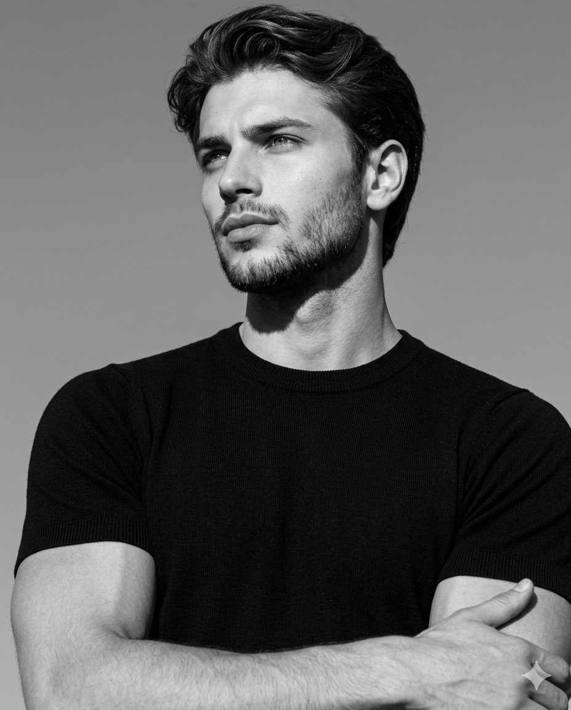

Prompt:

```text
Ultra-realistic black-and-white editorial portrait, low-angle shot, 4:5 aspect ratio. The {argument name="subject" default="man"} fills about 85-90% of the frame in a medium close-up, showing the head, neck, shoulders, upper chest, upper arms, and part of the forearms, with only a small amount of empty space above his head. A {argument name="physical description" default="handsome athletic man"} wearing a {argument name="clothing" default="plain black fitted ribbed crew-neck short-sleeve sweater"}. His arms are loosely crossed. His body is turned slightly (20°) while his head is turned slightly to the left and tilted upward, with his eyes looking off-camera toward the upper left, giving a calm, confident, thoughtful expression. Strong hard natural sunlight from the upper left illuminates the left side of his hair, forehead, eye, cheek, nose, beard, neck, shoulder, and front arm, while the right side of his face and ear fall into deep shadow, creating crisp, high-contrast facial definition. Clean plain gray sky background, no distractions. High-contrast monochrome with deep blacks, bright highlights, sharp skin texture, fine-art fashion photography, ultra-realistic, premium editorial quality.
```

### Nano Banana Pro Prompts #147: Profile / Avatar - Photorealistic Luxury Editorial Male Portrait

- Category: `Portrait`
- Model: `Nano Banana Pro`
- Author / Source: [WeWant Mars](https://github.com/YouMind-OpenLab/awesome-nano-banana-pro-prompts/blob/main/README.md)
- Image: `assets/imported/YouMind-OpenLab/awesome-nano-banana-pro-prompts/README-19-Profile-Avatar-Photorealistic-Luxury-Editorial-Male-Portrait.jpg`

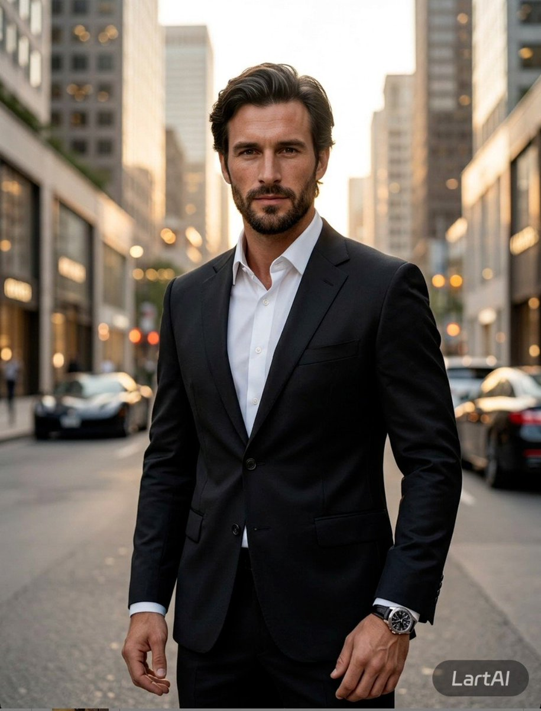

Prompt:

```text
Use the uploaded reference image as the appearance reference for the subject. Create an ultra-photorealistic, high-end editorial portrait with natural facial proportions and realistic human features. Preserve the overall appearance from the reference while maintaining a natural photographic look. The subject is standing confidently in a {argument name="setting" default="modern luxury city street"} during golden hour, wearing a {argument name="outfit" default="perfectly tailored black suit, white dress shirt, and an elegant wristwatch"}. Captured on a professional full-frame camera with an {argument name="lens" default="85mm portrait lens"} at f/1.4, producing beautiful background bokeh and razor-sharp focus on the eyes. Realistic skin texture with visible pores, natural hair strands, lifelike eyes with authentic reflections, physically accurate lighting, cinematic HDR color grading, subtle volumetric sunlight, realistic shadows, premium fashion photography, magazine-cover composition, highly detailed fabric textures, natural expression, balanced exposure, incredibly realistic colors, RAW photography style, ultra-high detail, professional commercial photography, 8K quality, visually indistinguishable from a real photograph.
```

### Nano Banana Pro Prompts #148: Profile / Avatar - Red Hair Woman Portrait Collage

- Category: `Portrait`
- Model: `Nano Banana Pro`
- Author / Source: [Minahil](https://github.com/YouMind-OpenLab/awesome-nano-banana-pro-prompts/blob/main/README.md)
- Image: `assets/imported/YouMind-OpenLab/awesome-nano-banana-pro-prompts/README-20-Profile-Avatar-Red-Hair-Woman-Portrait-Collage.jpg`

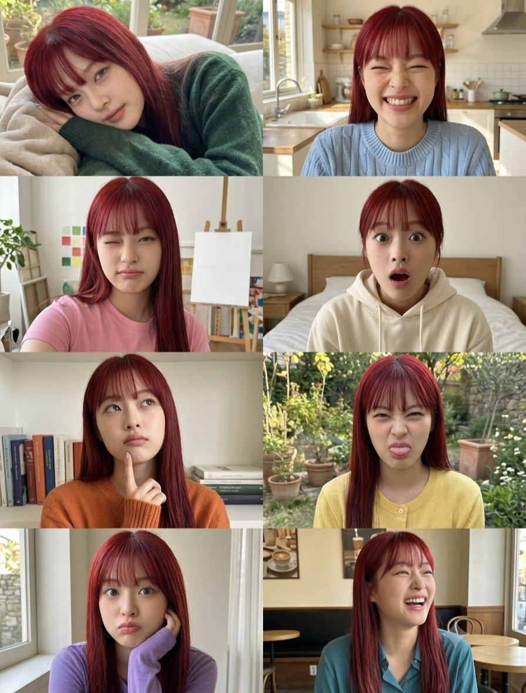

Prompt:

```text
A vibrant photo collage features a young woman with striking, long, straight {argument name="hair color" default="red"} hair and soft bangs, showcased in {argument name="number of portraits" default="eight"} distinct, emotive portraits. Each panel in the referenced file highlights a different setting and mood, ranging from cozy indoor spaces like bedrooms and kitchens to bright, naturally lit environments. The subject displays an array of charming expressions—including joyful laughter, playful winking, thoughtful pondering with a finger to her chin, a surprised "o" mouth, and a silly tongue-out pose—while wearing a colorful variety of sweaters and casual tops. The overall aesthetic is warm, inviting, and youthful, emphasizing a playful and relatable character study through diverse daily interactions and candid-style photography.
```

### Nano Banana Pro Prompts #149: Profile / Avatar - Cinematic Golden Hour Portrait of a Woman

- Category: `Portrait`
- Model: `Nano Banana Pro`
- Author / Source: [HiBå🫰](https://github.com/YouMind-OpenLab/awesome-nano-banana-pro-prompts/blob/main/README.md)
- Image: `assets/imported/YouMind-OpenLab/awesome-nano-banana-pro-prompts/README-21-Profile-Avatar-Cinematic-Golden-Hour-Portrait-of-a-Woman.jpg`

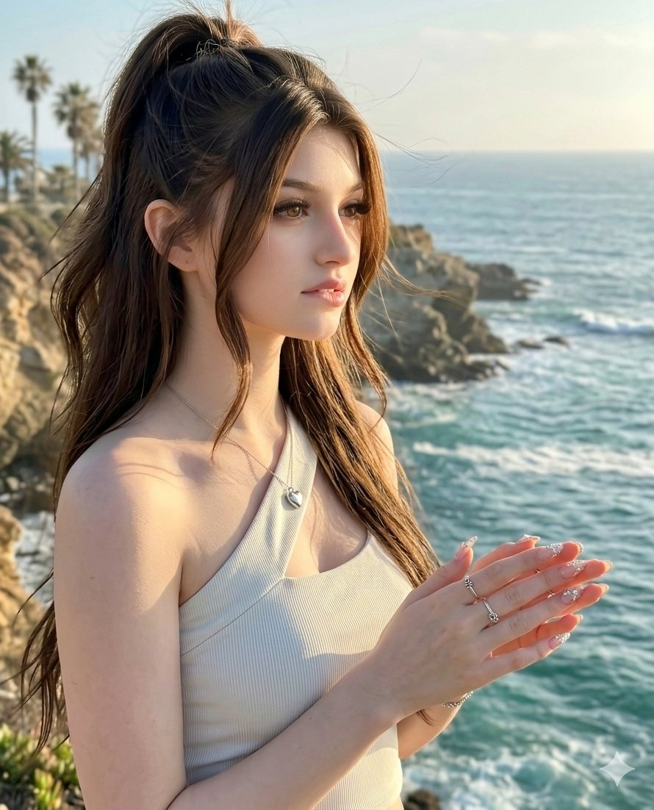

Prompt:

```text
A stunning, high-fashioned cinematic portrait of a {argument name="subject" default="beautiful young woman"} with a flawless complexion and expressive brown eyes. Her long, rich brown hair is styled in a {argument name="hairstyle" default="voluminous, perfectly detailed high ponytail"} with soft, elegant face-framing strands catching the golden sunlight. She has soft, natural makeup with long lashes and a subtle, thoughtful expression, looking off into the distant horizon away from the camera. Her hands are delicately held together in front of her, showcasing intricately detailed shimmering silver glitter nail art and wearing thin, minimal silver rings on her fingers. She is wearing a modern, chic {argument name="clothing" default="off-white asymmetric one-shoulder top"} and a thin silver chain necklace with a small heart pendant. The background features a breathtaking, highly detailed coastal landscape, standing on a rocky cliff overlooking a vast deep-blue ocean with realistic crashing white waves. The scene is illuminated by soft, warm golden hour sunlight, creating beautiful highlights on her hair and a cinematic depth of field with a softly blurred background.
```

### Nano Banana Pro Prompts #150: Profile / Avatar - Female Android Studio Portrait with Laser Eyes

- Category: `Portrait`
- Model: `Nano Banana Pro`
- Author / Source: [Aijaz](https://github.com/YouMind-OpenLab/awesome-nano-banana-pro-prompts/blob/main/README.md)
- Image: `assets/imported/YouMind-OpenLab/awesome-nano-banana-pro-prompts/README-22-Profile-Avatar-Female-Android-Studio-Portrait-with-Laser-Eyes.jpg`

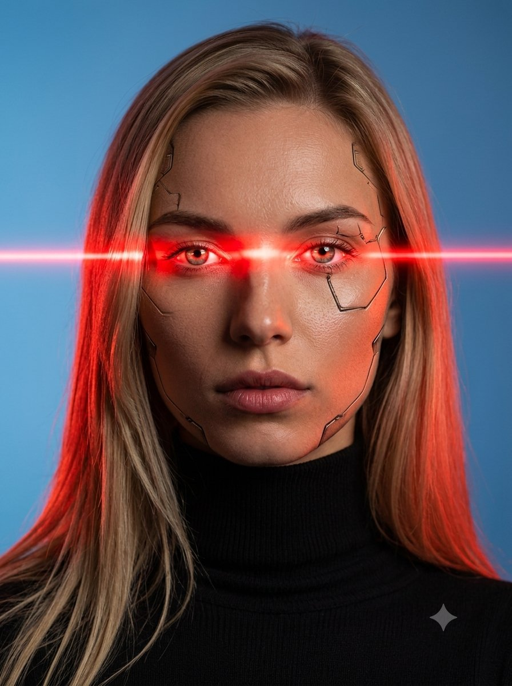

Prompt:

```text
A close-up, front-facing studio portrait of a {argument name="subject" default="female android with long, straight blonde hair"}, looking directly into the camera. Subtle cybernetic panel lines and metallic seams are intricately embedded into the skin of her face. A vibrant, continuous {argument name="visual effect" default="horizontal red laser beam"} slices across her eyes, creating a powerful, glowing lens flare effect. She is wearing a simple {argument name="clothing" default="black turtleneck sweater"}. The lighting is cinematic, featuring sharp red rim-lighting that catches the edges of her hair, set against a solid, contrasting muted blue studio background. High-detail skin texture, photorealistic, 8k resolution.
```

### Nano Banana Pro Prompts #151: Profile / Avatar - Hyper-Realistic Urban Fashion Portrait

- Category: `Portrait`
- Model: `Nano Banana Pro`
- Author / Source: [Zeeshi](https://github.com/YouMind-OpenLab/awesome-nano-banana-pro-prompts/blob/main/README.md)
- Image: `assets/imported/YouMind-OpenLab/awesome-nano-banana-pro-prompts/README-23-Profile-Avatar-Hyper-Realistic-Urban-Fashion-Portrait.jpg`

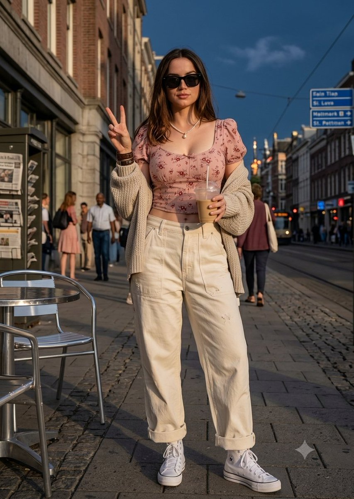

Prompt:

```text
Hyper-realistic photography of a {argument name="subject" default="young woman"} standing on a city street, flashing a peace sign and holding a plastic coffee cup. She wears a {argument name="outfit" default="maroon crop top, baggy loose pants, and sneakers"}. A knit cardigan slides off her shoulders. {argument name="accessories" default="Black sunglasses"} on her face. Urban atmosphere with cinematic natural lighting and detailed fabric textures., subtle enigmatic smile, soft cinematic lighting, full-body fashion shot, sharp focus, hyper-detailed textures, masterpiece quality. professional portraiture.
```

### Nano Banana Pro Prompts #152: Profile / Avatar - Hyper-Realistic Studio Portrait with Geometric Headband

- Category: `Portrait`
- Model: `Nano Banana Pro`
- Author / Source: [Aijaz](https://github.com/YouMind-OpenLab/awesome-nano-banana-pro-prompts/blob/main/README.md)
- Image: `assets/imported/YouMind-OpenLab/awesome-nano-banana-pro-prompts/README-24-Profile-Avatar-Hyper-Realistic-Studio-Portrait-with-Geometric-Headband.jpg`

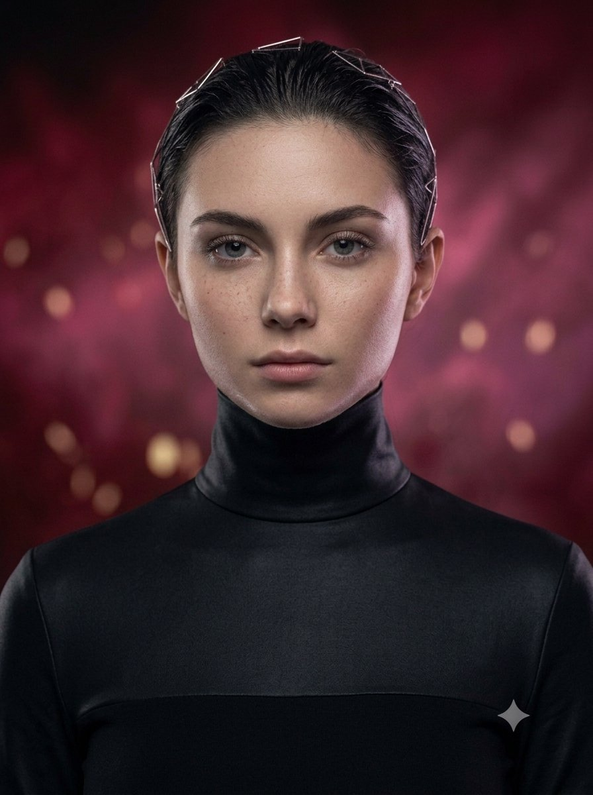

Prompt:

```text
A hyper-realistic, dramatic studio portrait of a {argument name="subject" default="woman"} with a clean, centered composition. She has a neutral, powerful expression, featuring natural skin texture, freckles, and light-colored eyes. Her hair is slicked back with a {argument name="accessory" default="minimalist, geometric wire-frame headband"} made of thin metallic rods. She is wearing a {argument name="clothing" default="high-necked, form-fitting black turtleneck garment"} that completely covers her neck and shoulders. The background is a {argument name="background color" default="soft, deep crimson"} with subtle, out-of-focus circular bokeh lights, creating a moody, sophisticated atmosphere. Soft, professional lighting highlights her facial features and the sleek texture of her clothing.
```

### Nano Banana Pro Prompts #153: Profile / Avatar - Monochrome Graphite Fine-Art Sketch

- Category: `Portrait`
- Model: `Nano Banana Pro`
- Author / Source: [zayan](https://github.com/YouMind-OpenLab/awesome-nano-banana-pro-prompts/blob/main/README.md)
- Image: `assets/imported/YouMind-OpenLab/awesome-nano-banana-pro-prompts/README-25-Profile-Avatar-Monochrome-Graphite-Fine-Art-Sketch.jpg`

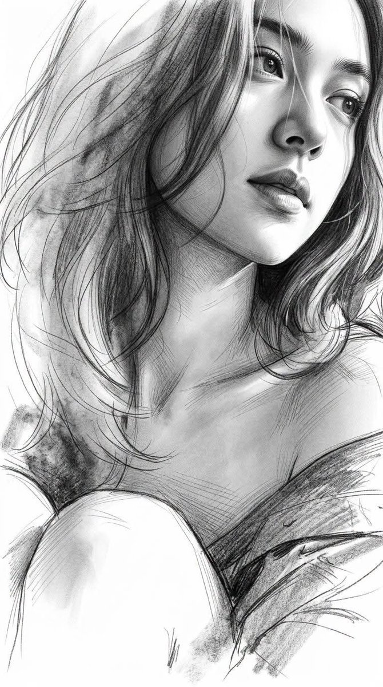

Prompt:

```text
Ultra-detailed monochrome graphite portrait illustration, contemporary fine-art sketch aesthetic, hyper-realistic facial rendering blended with {argument name="artistic style" default="expressive loose construction lines"}, premium pencil-on-smooth-paper texture, {argument name="shading" default="soft charcoal shading, refined graphite gradients, delicate cross-hatching"}, painterly tonal transitions, crisp high-contrast lighting, luminous skin highlights, subtle atmospheric depth, unfinished artistic edges, dynamic gestural strokes around the hair and clothing, elegant negative space composition, editorial fashion illustration, museum-quality draftsmanship, cinematic realism, minimalist black-and-white palette, clean white background, masterwork, ultra-high detail, 8K. A 9:16.
```

### Nano Banana Pro Prompts #154: Profile / Avatar - Cinematic Music Producer Portrait

- Category: `Portrait`
- Model: `Nano Banana Pro`
- Author / Source: [Alex Prompts](https://github.com/YouMind-OpenLab/awesome-nano-banana-pro-prompts/blob/main/README.md)
- Image: `assets/imported/YouMind-OpenLab/awesome-nano-banana-pro-prompts/README-26-Profile-Avatar-Cinematic-Music-Producer-Portrait.jpg`

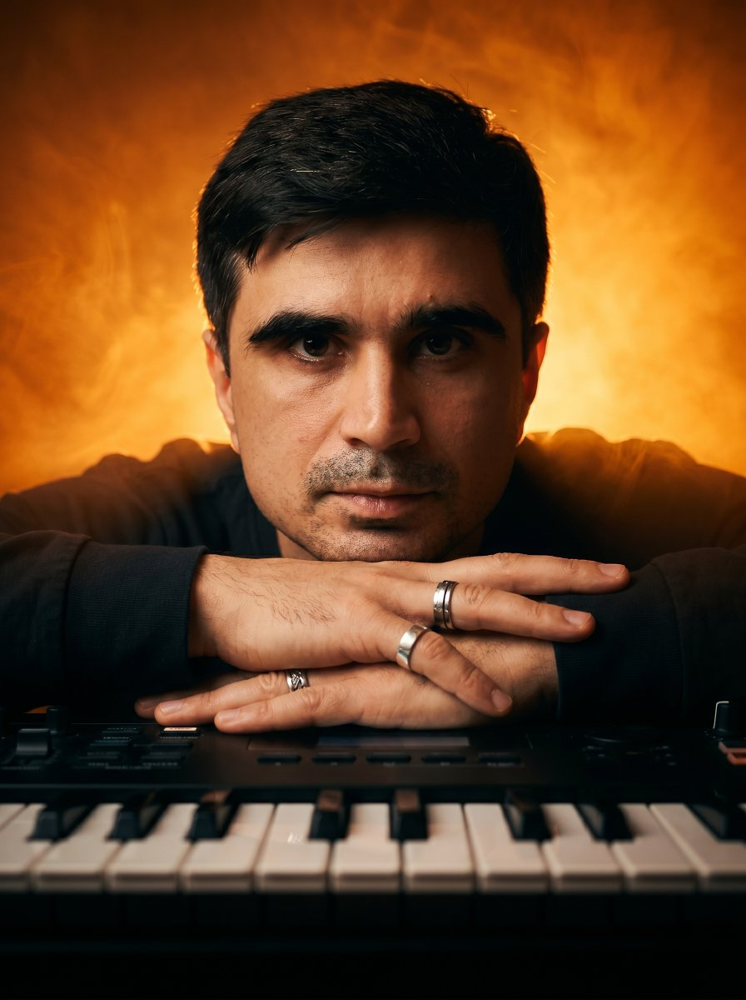

Prompt:

```text
A medium close-up cinematic portrait of a {argument name="subject" default="man leaning forward with his chin resting on his crossed hands"} placed atop a professional {argument name="musical instrument" default="electronic music keyboard"}. His hands wear multiple silver rings. The keyboard keys are clearly visible in the foreground with sharp texture.
Shot at eye level with a 50mm lens, shallow depth of field, sharp focus on the face.
Lighting is dramatic and cinematic, not soft: strong directional backlight behind the subject, creating a glowing halo through dense volumetric fog. High contrast lighting with deep shadows and bright highlights on the face and hands. Subtle front fill light only to preserve facial details.
The background is a {argument name="background color" default="rich, intense orange and golden gradient"} with high saturation and luminous glow, resembling heated air or fire-like atmosphere. The fog catches the backlight, creating a vivid, radiant diffusion.
Color grading is cinematic with high contrast, deep blacks, and strong color density. No washed-out tones.
```

### Nano Banana Pro Prompts #155: Profile / Avatar - Raven Summoner Cinematic Portrait

- Category: `Portrait`
- Model: `Nano Banana Pro`
- Author / Source: [Alex Prompts](https://github.com/YouMind-OpenLab/awesome-nano-banana-pro-prompts/blob/main/README.md)
- Image: `assets/imported/YouMind-OpenLab/awesome-nano-banana-pro-prompts/README-27-Profile-Avatar-Raven-Summoner-Cinematic-Portrait.jpg`

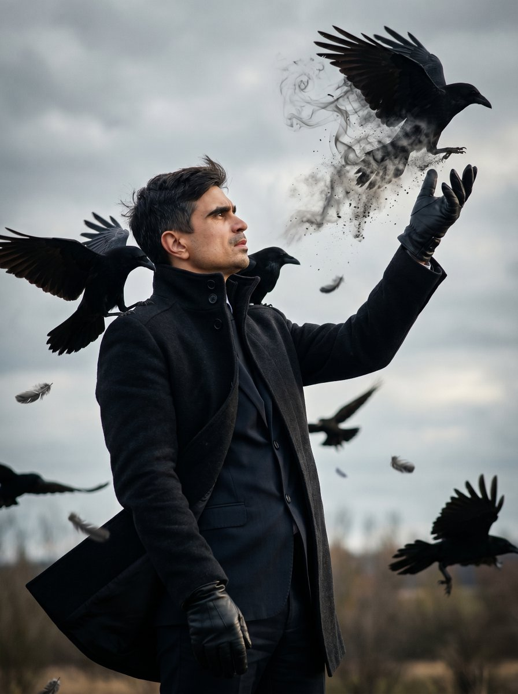

Prompt:

```text
A hyper-realistic portrait photo from waist to head of me (use reference photo), wearing a {argument name="outfit" default="high coat and a formal suit"}. I'm standing sideways, my right hand raised and opening the fist while wearing {argument name="accessories" default="black leather gloves"}. My head is slightly lifted, following the direction of my raised palm. From my palm, a {argument name="creature" default="black raven"} emerges, fully formed from swirling ashes and smoke, with its lower body still composed of dust and smoke. Many other ravens I've created are flying around me, forming a chaotic yet natural swarm with varied wing positions and angles; some even perch on my shoulders. Feathers scatter in the wind. The wind blows from below, lifting my coat collar and slightly tousling my hair. My expression is intense yet calm as I summon the ravens. Apply a subtle grain or texture filter to enhance realism. The composition is seamless, with depth in the background, ensuring all elements - figure, coat, ravens, smoke, and feathers - appear integrated and naturally interacting with light and atmosphere. Dramatic, cinematic lighting emphasizes shadows, highlights, and details.
```

### Nano Banana Pro Prompts #156: Social Media Post - Train-ad style book advertisement image

- Category: `Product`
- Model: `Nano Banana Pro`
- Author / Source: [KAWAI](https://github.com/YouMind-OpenLab/awesome-nano-banana-pro-prompts/blob/main/README.md)
- Image: `assets/imported/YouMind-OpenLab/awesome-nano-banana-pro-prompts/README-28-Social-Media-Post-Train-ad-style-book-advertisement-image.jpg`

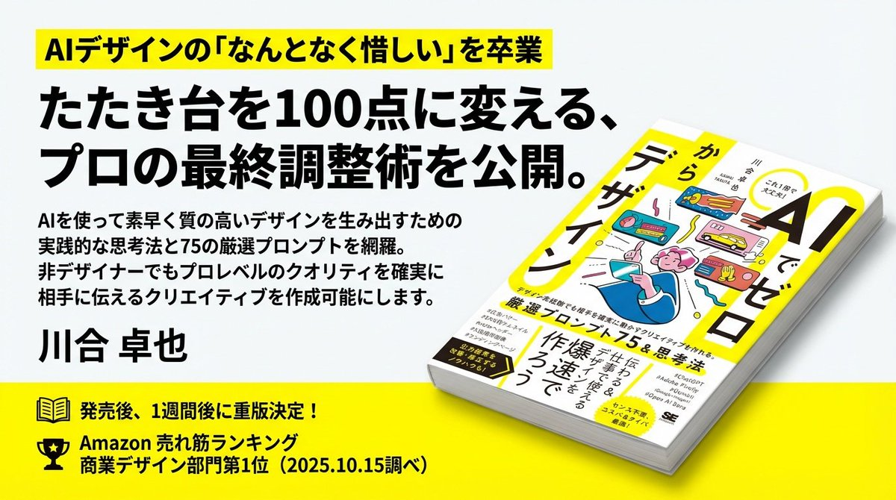

Prompt:

```text
Please generate an advertisement image.

==== Ad specifications ===
- Aspect ratio: 16:9 (horizontal)
- Product to advertise: the book in the first attached image
- Main eye-catcher: place the book from the first attached image in a three-dimensional way
- Language: Japanese
- Taste: advertisement for a business book

# Text to include:
- Pre-head copy: 【New print run decided about one week after release】

Book “{argument name="book_title_en" default="Designing from Zero with AI"}” now on sale and doing well.

Amazon Best Seller Ranking
Ranked No.1 in commercial design sales (as of 10/15)
https://t.co/QxbYpfFVj6
```

### Nano Banana Pro Prompts #157: Social Media Post - Ultra-Realistic Café Portrait of a Young Woman

- Category: `Portrait`
- Model: `Nano Banana Pro`
- Author / Source: [Simply Ray](https://github.com/YouMind-OpenLab/awesome-nano-banana-pro-prompts/blob/main/README.md)
- Image: `assets/imported/YouMind-OpenLab/awesome-nano-banana-pro-prompts/README-29-Social-Media-Post-Ultra-Realistic-Caf-Portrait-of-a-Young-Woman.jpg`

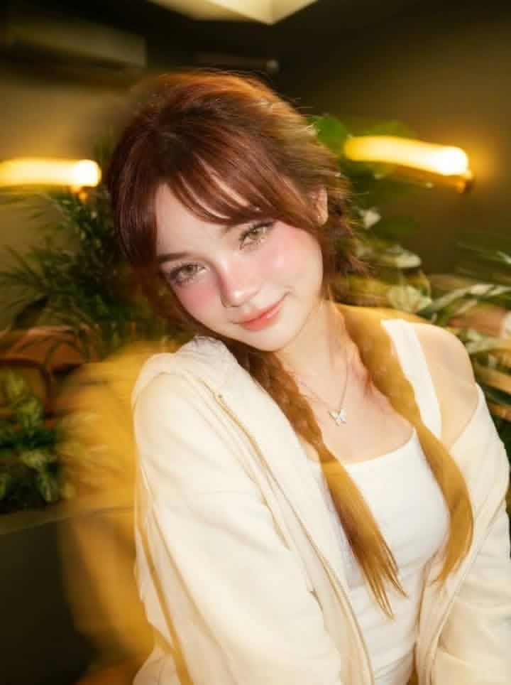

Prompt:

```text
{argument name="subject" default="Ultra-realistic portrait of a beautiful young woman"} sitting in a {argument name="setting" default="cozy modern indoor café corner filled with lush tropical indoor plants"}, dark olive matte walls, warm ambient lighting, and soft glowing wall sconces creating a calm, intimate atmosphere. She wears a {argument name="outfit" default="fitted white ribbed square-neck camisole"} with delicate straps, layered with an oversized off-white zip-up hoodie casually draped off one shoulder for a relaxed effortless look. A delicate silver butterfly pendant necklace rests elegantly on her collarbone. Her long silky jet-black hair is styled into two loose braided pigtails with a soft center part, face-framing wispy strands, subtle volume at the crown, and naturally flowing ends for a youthful, feminine aesthetic. She is seated naturally with her body slightly angled away from the camera, one arm gently hugging the oversized hoodie across her chest while the other shoulder is subtly exposed. Her head is slightly tilted, eyes looking softly off-camera with a gentle dreamy smile, creating a candid, warm, and approachable expression. soft glam with a doll like beauty aesthetic flawless dewy base, pink blush concentrated on the cheeks and nose bridge, subtle contouring, large contact-lens effect eyes, wispy dramatic lashes, well defined brows, and glossy peach pink gradient lips with a hydrated finish. harsh direct flash photography in daylight, slightly overexposed highlights, rich saturated colors, cinematic composition, dreamy vibe, add small aesthetic signature watermark sabine , shallow depth of field, 35mm lens look, high detail, realistic lighting, candid fashion editorial style ar 9:16 -v.6.1 do not alter face.
```

### Nano Banana Pro Prompts #158: Social Media Post - Elegant Mirror-Work Sharara Set Portrait

- Category: `Portrait`
- Model: `Nano Banana Pro`
- Author / Source: [Talia](https://github.com/YouMind-OpenLab/awesome-nano-banana-pro-prompts/blob/main/README.md)
- Image: `assets/imported/YouMind-OpenLab/awesome-nano-banana-pro-prompts/README-30-Social-Media-Post-Elegant-Mirror-Work-Sharara-Set-Portrait.jpg`

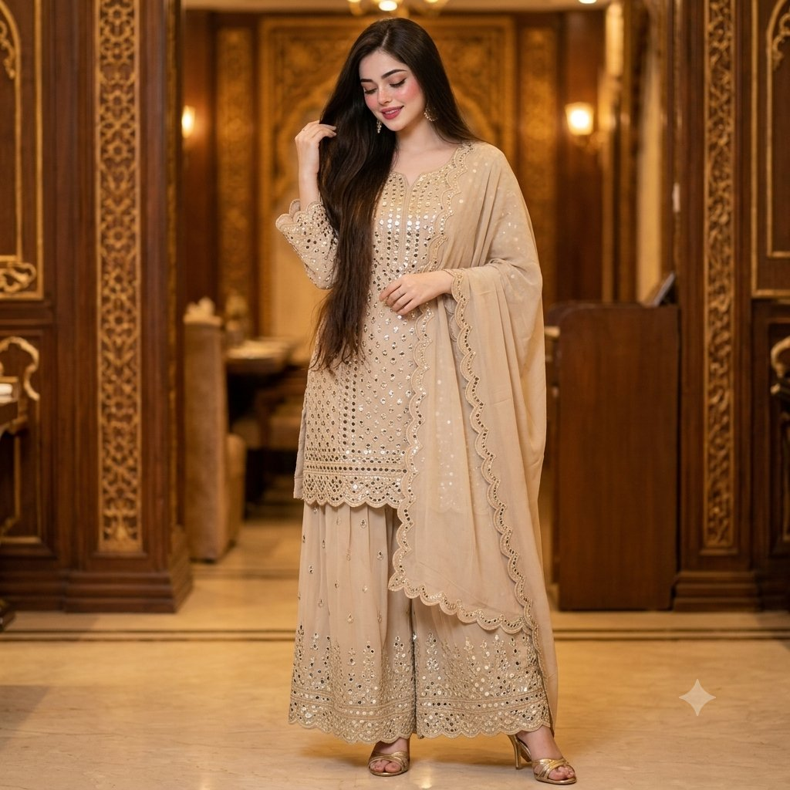

Prompt:

```text
Create A beautiful woman with {argument name="hair style" default="hips touching brown hair"}, wearing a {argument name="outfit" default="Zeelfashion beige embroidered sharara set"} featuring heavy mirror work on the kurta and duppata.scalloped trim along the edges of the dupatta and sleeves. She has light makeup, including pink lipstick and blush, and is smiling subtly while looking to her right. The background is {argument name="background" default="luxurious restaurant backside"}.eyes down cost.attached the both are feet hill golden sandals.
```

### Nano Banana Pro Prompts #159: Social Media Post - East Asian Woman Beach Portrait

- Category: `Portrait`
- Model: `Nano Banana Pro`
- Author / Source: [Simply Ray](https://github.com/YouMind-OpenLab/awesome-nano-banana-pro-prompts/blob/main/README.md)
- Image: `assets/imported/YouMind-OpenLab/awesome-nano-banana-pro-prompts/README-31-Social-Media-Post-East-Asian-Woman-Beach-Portrait.jpg`

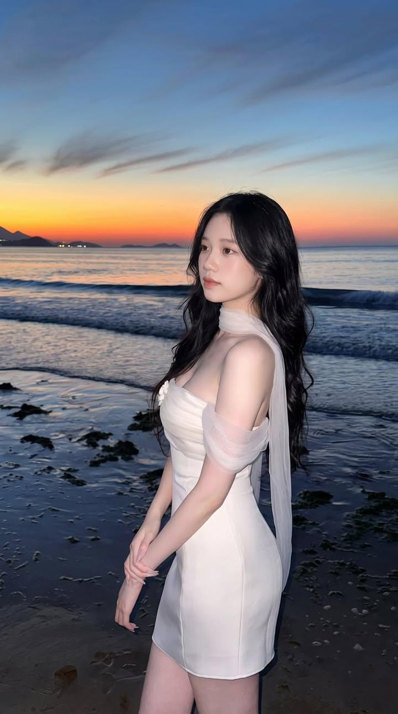

Prompt:

```text
Ultra-realistic portrait of a {argument name="subject description" default="beautiful young East Asian woman"} standing on a {argument name="background" default="quiet beach during blue hour just after sunset"}, side profile, long wavy black hair, soft natural makeup, fair porcelain skin, {argument name="clothing" default="elegant white satin mini dress with sheer off-shoulder tulle sleeves and a long translucent scarf draped around her neck flowing behind"}, slim figure, hands gently clasped, calm and dreamy expression, gentle ocean waves, wet sand with scattered seaweed, distant mountains silhouetted on the horizon, vibrant orange, pink, and deep blue sunset sky, cinematic lighting, smartphone flash illuminating the subject while the sunset remains visible in the background, shallow depth of field, highly detailed skin texture, natural colors, photorealistic, HDR, 85mm lens, f/1.8, ultra-sharp focus, professional photography, 8K, vertical composition, aspect ratio 9:16.
```

### Nano Banana Pro Prompts #160: Social Media Post - Elderly Fisherman Mediterranean Portrait

- Category: `Portrait`
- Model: `Nano Banana Pro`
- Author / Source: [MayorkingAI](https://github.com/YouMind-OpenLab/awesome-nano-banana-pro-prompts/blob/main/README.md)
- Image: `assets/imported/YouMind-OpenLab/awesome-nano-banana-pro-prompts/README-32-Social-Media-Post-Elderly-Fisherman-Mediterranean-Portrait.jpg`

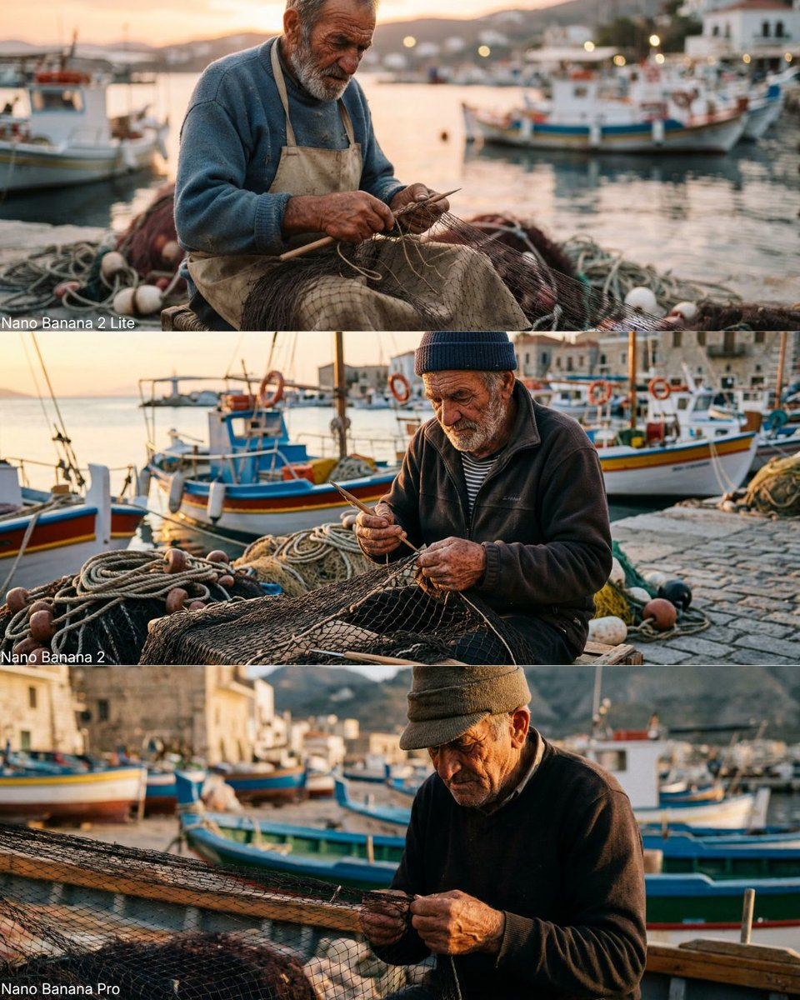

Prompt:

```text
Editorial portrait photography, {argument name="subject" default="elderly fisherman with weathered skin"} mending nets at dawn in a Mediterranean harbor, golden hour side lighting, shallow depth of field, shot on 85mm f/1.4, natural skin texture, {argument name="color palette" default="Kodak Portra 400 color palette"}
```

### Nano Banana Pro Prompts #161: Social Media Post - Cinematic Night Balcony Fashion Portrait

- Category: `Product`
- Model: `Nano Banana Pro`
- Author / Source: [Hania Ai](https://github.com/YouMind-OpenLab/awesome-nano-banana-pro-prompts/blob/main/README.md)
- Image: `assets/imported/YouMind-OpenLab/awesome-nano-banana-pro-prompts/README-33-Social-Media-Post-Cinematic-Night-Balcony-Fashion-Portrait.jpg`

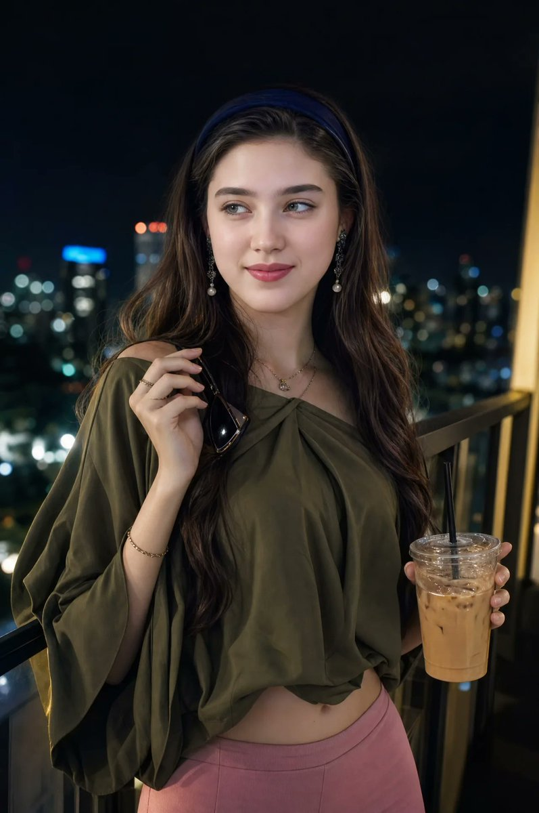

Prompt:

```text
Ultra-realistic IMAX-level Netflix-style cinematic fashion lifestyle portrait, 9:16 vertical composition, use the uploaded image as the primary facial and pose reference, create a beautiful young adult woman standing casually by a modern balcony railing at night in a relaxed elegant pose, one hand holding a clear plastic iced coffee cup with a black straw while the other hand lightly holds a pair of stylish sunglasses near her shoulder, her face turned slightly to the side with a calm dreamy expression, soft feminine confidence, relaxed brows, thoughtful eyes and naturally defined lips, her luminous fair porcelain milky-white skin rendered with an ultra-smooth clean texture, soft natural pink glow and perfect face-to-body skin tone consistency, her long soft {argument name="hair color" default="brown"} hair styled in loose smooth waves falling over her shoulders with a few delicate face-framing strands, wearing an {argument name="top color" default="olive green"} loose stylish top with relaxed sleeves and a flattering cropped drape, paired with {argument name="bottom color" default="pastel pink"} comfortable fitted bottom wear, elegant minimal jewelry including earrings, bracelet, rings and a delicate necklace, background featuring a dark night city ambience with soft blurred bokeh lights and a premium balcony setting, lighting soft and cinematic with gentle diffused night light shaping her face, hair, outfit and hands, creating subtle highlights, smooth shadows and a luxurious editorial mood, ultra-rich color grading with olive green and pastel pink contrast, creamy skin glow, deep black night backdrop, warm soft highlights and refined fashion depth, captured in a premium portrait lens look with shallow depth of field, HDR lighting, global illumination, photorealistic rendering, masterpiece quality, ultra-detailed textures, 8K production detail.
```

### Nano Banana Pro Prompts #162: Social Media Post - Monochromatic Coastal Riviera Portrait

- Category: `Portrait`
- Model: `Nano Banana Pro`
- Author / Source: [Picts by AI](https://github.com/YouMind-OpenLab/awesome-nano-banana-pro-prompts/blob/main/README.md)
- Image: `assets/imported/YouMind-OpenLab/awesome-nano-banana-pro-prompts/README-34-Social-Media-Post-Monochromatic-Coastal-Riviera-Portrait.jpg`

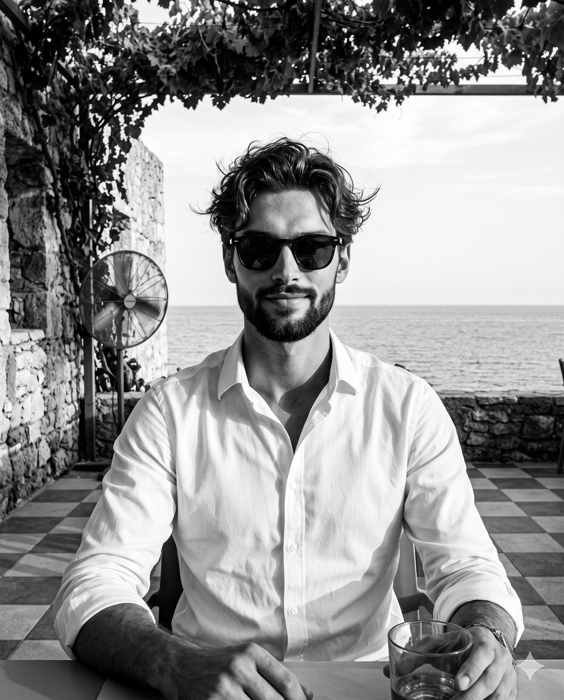

Prompt:

```text
A {argument name="subject" default="confident man"} sits centered facing the camera in a {argument name="clothing" default="crisp white shirt"} and dark sunglasses, exuding an effortless candid demeanor with a subtle, closed-mouth smile and relaxed eyebrows. His dark, wavy hair, cut to about three to four inches, features a tousled, unstructured volume with a natural matte finish, slight frizz, and visible flyaways. His shoulders are entirely relaxed as his weight rests symmetrically, with his left hand casually resting on a surface and his right hand organically grasping a glass tumbler in a fluid, relaxed gesture. He is layered seamlessly into a {argument name="setting" default="deep outdoor coastal setting"}, framed from above by thriving, dense leafy canopy vines in the foreground. The midground reveals a weathered, rough matte mid-gray stone masonry wall with patchy, visible mortar on the left, alongside a worn industrial fan mounted to the canopy frame on the right. He sits above a gray checkered tile floor, with the scene extending outward to a pristine background ocean marked by a perfectly flat horizon. The monochromatic atmosphere is rendered in a strict black-and-white high-contrast palette where the bright whites of the shirt and sky balance against deep black shadows and mid-gray midtones. Bright, natural light filters down from multiple sources above but strikes with a hard, directional quality, creating dramatic, harshly defined deep black shadows under the lush canopy, across his neck, and down the right side of his face, while meticulously preserving brilliant specular highlights on the shoulders of his shirt and the distant sky to evoke a sophisticated Italian Riviera summer lifestyle mood. Captured as a tack-sharp digital editorial photograph shot straight on at f/4.0, 1/500s, and ISO 100, the realistic image features a medium depth of field and distinct digital noise, refined with high-contrast curve adjustments to emphasize its organic visual style, all framed in a 4:5 aspect ratio.
```

### Nano Banana Pro Prompts #163: Social Media Post - Minimalist Realistic Studio Portrait

- Category: `Portrait`
- Model: `Nano Banana Pro`
- Author / Source: [J⭕DIE](https://github.com/YouMind-OpenLab/awesome-nano-banana-pro-prompts/blob/main/README.md)
- Image: `assets/imported/YouMind-OpenLab/awesome-nano-banana-pro-prompts/README-35-Social-Media-Post-Minimalist-Realistic-Studio-Portrait.jpg`

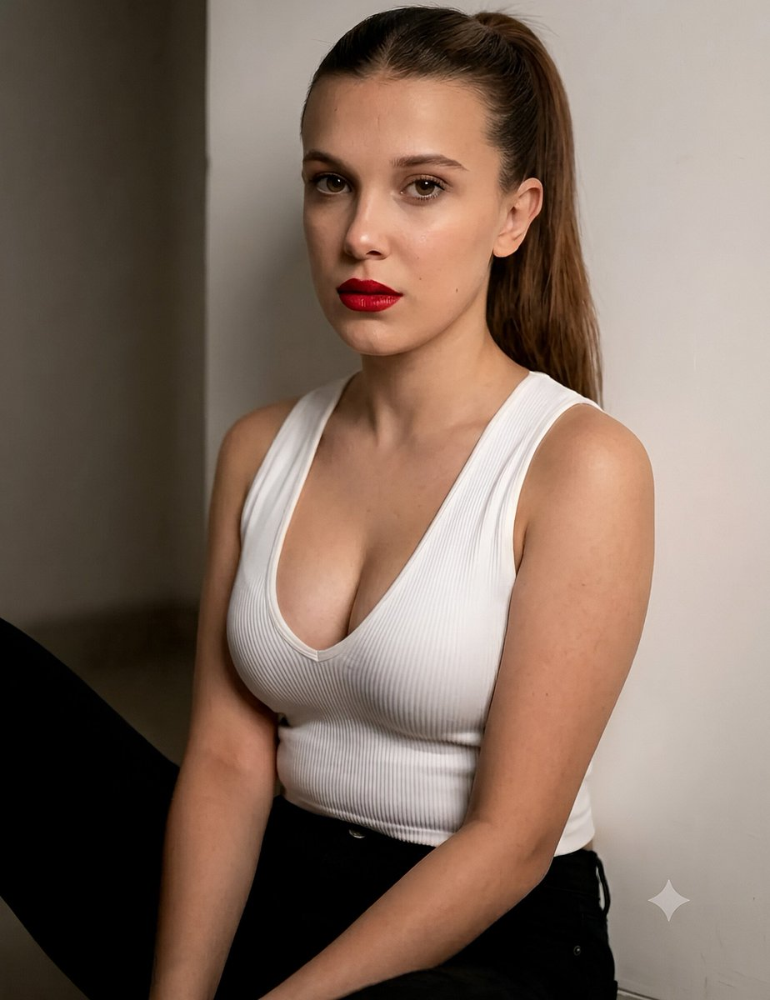

Prompt:

```text
A highly detailed realistic portrait photograph of a young woman with {argument name="facial features" default="fair skin and subtle natural freckles"}, featuring {argument name="hair style" default="long straight brown hair styled in a sleek high ponytail with a center part, wispy strands framing her face"}. She has expressive brown eyes with defined eyebrows, wearing bold red lipstick on full lips, and a neutral contemplative expression while gazing directly at the viewer. She is dressed in a {argument name="outfit" default="fitted white ribbed sleeveless tank top and black pants"}, seated in a relaxed pose with one leg bent, leaning against a plain light-colored minimalist studio wall. Soft dramatic lighting from the side creates gentle shadows and highlights on her face and clothing, with a clean modern indoor setting, high resolution, sharp focus, cinematic composition, and professional photography style.
```

### Nano Banana Pro Prompts #164: Social Media Post - Surreal Giant Woman in Venice

- Category: `Video`
- Model: `Nano Banana Pro`
- Author / Source: [HiBå🫰](https://github.com/YouMind-OpenLab/awesome-nano-banana-pro-prompts/blob/main/README.md)
- Image: `assets/imported/YouMind-OpenLab/awesome-nano-banana-pro-prompts/README-36-Social-Media-Post-Surreal-Giant-Woman-in-Venice.jpg`

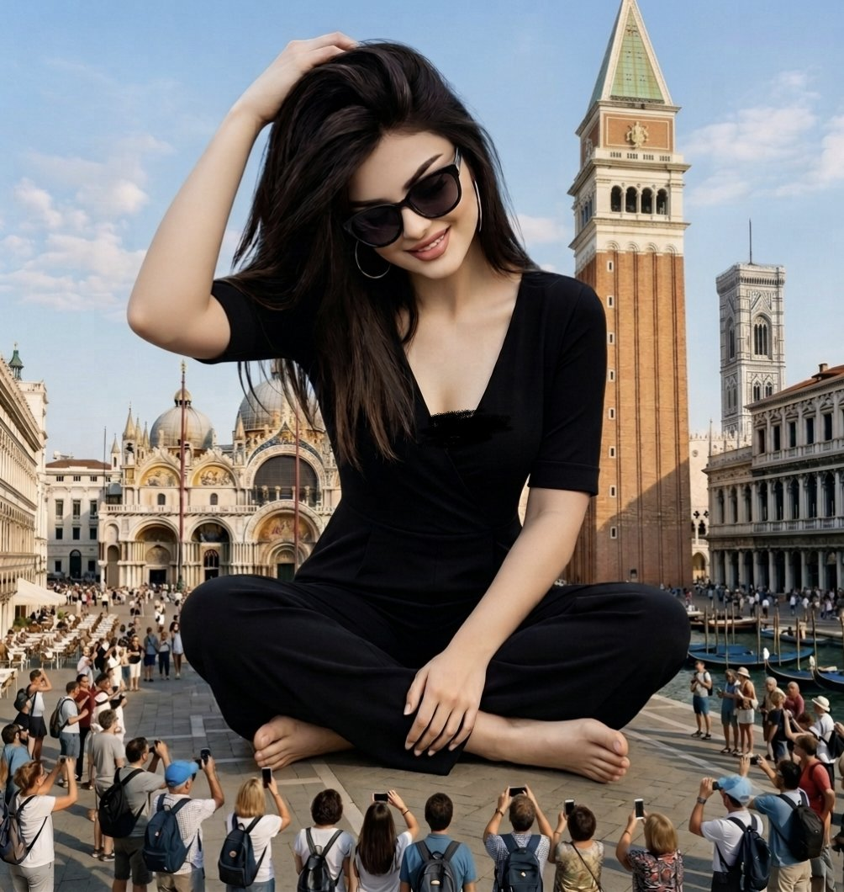

Prompt:

```text
A surreal {argument name="subject" default="giant woman"} sitting gracefully in the middle of {argument name="location" default="Venice's Piazza San Marco"}, wearing an {argument name="outfit" default="elegant black outfit and sunglasses"}, smiling softly while tourists gather around taking photos with their phones. Cinematic lighting, realistic architecture, dramatic scale contrast, ultra-detailed, photorealistic, travel photography, vibrant sky, natural shadows, high realism, 8K.
```

### Nano Banana Pro Prompts #165: Social Media Post - High-Contrast Monochrome Portrait Sketch

- Category: `Portrait`
- Model: `Nano Banana Pro`
- Author / Source: [zayan](https://github.com/YouMind-OpenLab/awesome-nano-banana-pro-prompts/blob/main/README.md)
- Image: `assets/imported/YouMind-OpenLab/awesome-nano-banana-pro-prompts/README-37-Social-Media-Post-High-Contrast-Monochrome-Portrait-Sketch.jpg`

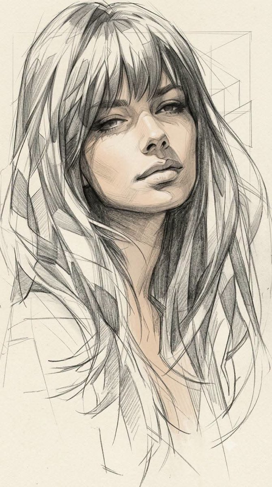

Prompt:

```text
Medium & Style: High-contrast monochrome grayscale {argument name="medium" default="graphite sketch"} combined with a subtle realistic skin tint. Blends refined academic portraiture with dynamic fashion illustration.
Linework & Structure: Clean yet energetic hand-drawn pencil strokes with visible construction lines, loose geometric guidelines, overlapping angular sketch marks, and intentionally unfinished, raw edges. Strong line-weight variation and crisp facial features.
Shading & Texture: Soft graphite blending, delicate cross-hatching, feathered shading, and layered tonal rendering on a warm off-white drawing paper with a natural paper grain and visible graphite texture.
Color Accent: The realistic skin receives a gentle, natural {argument name="skin tint" default="peach-beige"} tint, echoing the warm, sun-kissed lighting of object. while the rest of the artwork remains strictly grayscale graphite.
Hair & Background: Hair is rendered with sculptural, faceted pencil shapes, sharp planes, and flowing sketch lines. The background is minimal, featuring faint perspective guides and an abstract geometric framework.
Lighting: High-contrast directional lighting with deep graphite shadows and bright paper highlights, replicating the dramatic shadow cutting across the face from object.
Aesthetic: Premium traditional sketchbook aesthetic, elegant, raw, artistic, highly detailed, museum-quality concept art.
A 9:16.
```

### Nano Banana Pro Prompts #166: Social Media Post - Korean Webtoon Chibi Girl Collage

- Category: `Portrait`
- Model: `Nano Banana Pro`
- Author / Source: [Cherry 2.O](https://github.com/YouMind-OpenLab/awesome-nano-banana-pro-prompts/blob/main/README.md)
- Image: `assets/imported/YouMind-OpenLab/awesome-nano-banana-pro-prompts/README-38-Social-Media-Post-Korean-Webtoon-Chibi-Girl-Collage.jpg`

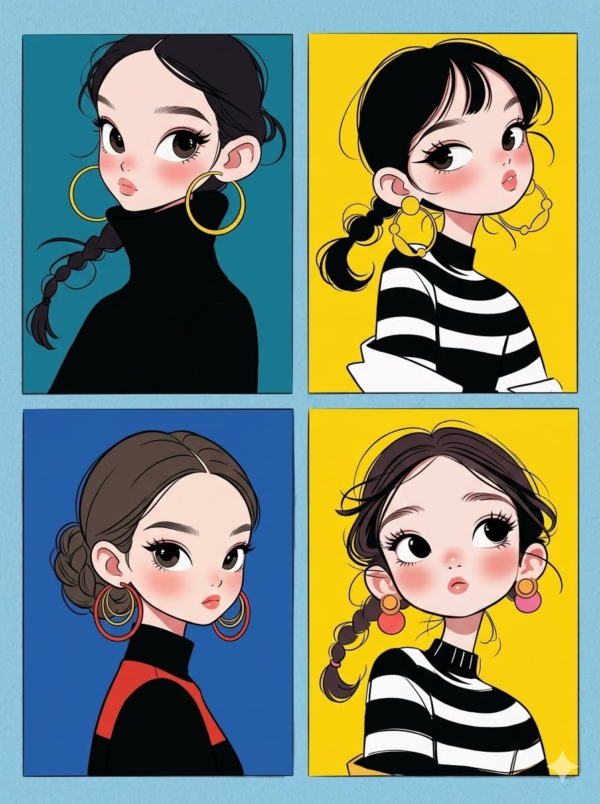

Prompt:

```text
A clean 4-panel grid art collage featuring four distinct, {argument name="subject" default="stylish chibi girls"} in a {argument name="aesthetic" default="Korean webtoon aesthetic"}. The illustration uses a minimalist flat vector design with bold, crisp black outlines and a pop-art comic vibe. Each panel features a unique solid color backdrop, including vibrant teal, bright sun yellow, and deep royal blue. The characters have large glossy anime-style dark eyes, softly blushed pink cheeks, and trendy hairstyles such as neat side-braids and elegant low buns. They wear fashionable {argument name="clothing" default="high-contrast striped turtlenecks and sleek black sweaters"}, accessorized with oversized colorful hoop earrings. Perfect symmetry, high resolution, graphic art style. --ar 3:4
```

### Nano Banana Pro Prompts #167: Social Media Post - Golden Hour Outdoor Market

- Category: `Creative`
- Model: `Nano Banana Pro`
- Author / Source: [Alisa Qian](https://github.com/YouMind-OpenLab/awesome-nano-banana-pro-prompts/blob/main/README.md)
- Image: `assets/imported/YouMind-OpenLab/awesome-nano-banana-pro-prompts/README-39-Social-Media-Post-Golden-Hour-Outdoor-Market.jpg`

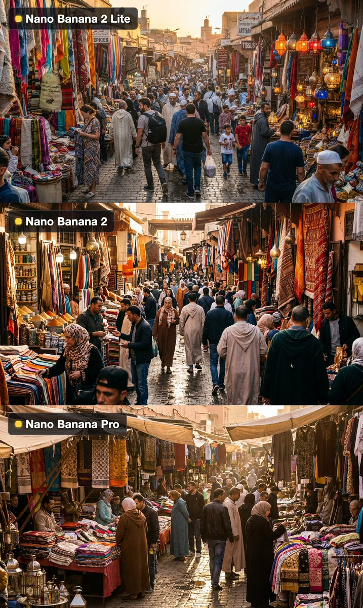

Prompt:

```text
{argument name="scene" default="Busy outdoor street market"} at {argument name="time of day" default="golden hour"}, dozens of vendors and colorful fabrics, complex occlusions and overlapping people, realistic shadows and reflections, high dynamic range, {argument name="aspect ratio" default="16:9"}, photorealistic
```

### Nano Banana Pro Prompts #168: Infographic / Edu Visual - Technical Cutaway Diagram

- Category: `Infographic`
- Model: `Nano Banana Pro`
- Author / Source: [Pierrick Chevallier | IA](https://github.com/YouMind-OpenLab/awesome-nano-banana-pro-prompts/blob/main/README.md)
- Image: `assets/imported/YouMind-OpenLab/awesome-nano-banana-pro-prompts/README-40-Infographic-Edu-Visual-Technical-Cutaway-Diagram.jpg`

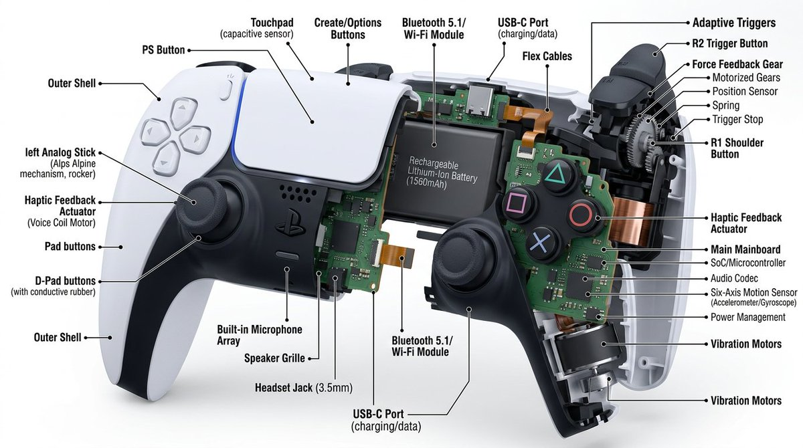

Prompt:

```text
Cutaway diagram of a {argument name="object" default="mechanical device"}, detailed with interior component, on a white background. High-resolution, with a focused technique and text callouts providing information about each part. Interior details, hyper-realistic appearance.
```

### Nano Banana Pro Prompts #169: Infographic / Edu Visual - Firefighter Storyboard Infographic

- Category: `3D`
- Model: `Nano Banana Pro`
- Author / Source: [𝐌](https://github.com/YouMind-OpenLab/awesome-nano-banana-pro-prompts/blob/main/README.md)
- Image: `assets/imported/YouMind-OpenLab/awesome-nano-banana-pro-prompts/README-41-Infographic-Edu-Visual-Firefighter-Storyboard-Infographic.jpg`

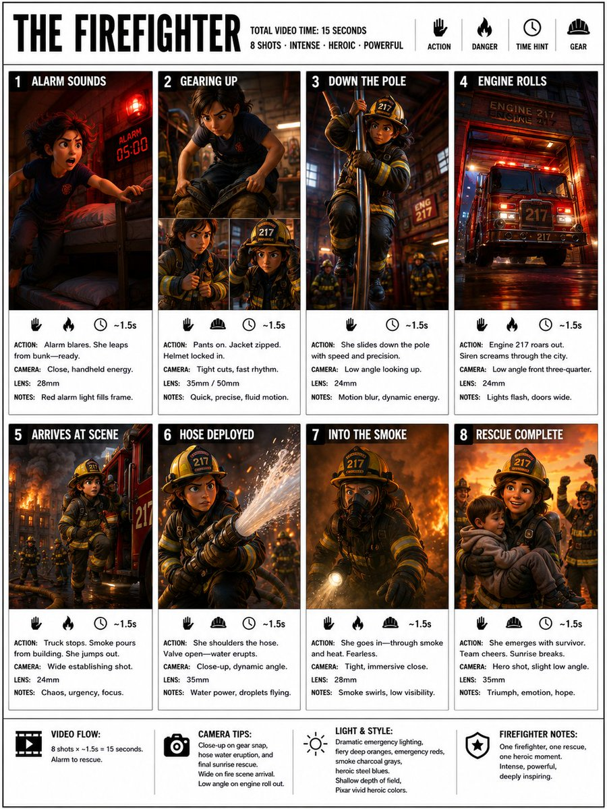

Prompt:

```text
Create a crisp, clean infographic storyboard poster for {argument name="subject" default="THE FIREFIGHTER"}. Wide 16:9 layout, white background, black borders, bold black typography, {argument name="rendering style" default="premium Pixar 3D stylized rendering"}, intense dramatic colors — fiery deep oranges, emergency red
```

### Nano Banana Pro Prompts #170: Infographic / Edu Visual - 3D Medical Glow Scan Rendering

- Category: `3D`
- Model: `Nano Banana Pro`
- Author / Source: [Dera | Performance marketing Creative](https://github.com/YouMind-OpenLab/awesome-nano-banana-pro-prompts/blob/main/README.md)
- Image: `assets/imported/YouMind-OpenLab/awesome-nano-banana-pro-prompts/README-42-Infographic-Edu-Visual-3D-Medical-Glow-Scan-Rendering.png`

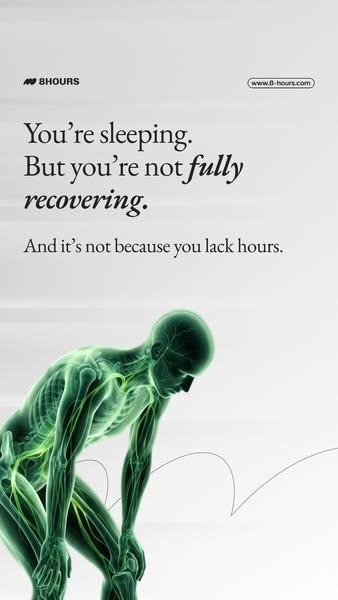

Prompt:

```text
A ultra-detailed, hyper-realistic 3D rendering of {argument name="subject" default="human waist"}, presented against a {argument name="background" default="smooth, clean white-to-light-grey gradient background"}. The style must mimic that of an advanced, glowing medical scan (like an fMRI combined with a CT). The entire structure is composed of luminous, semi-transparent green tissue (fascia, muscles, nerves), with skeletal elements and major neural pathways rendered in a {argument name="glow color" default="brilliant, glowing electric green light"}. The texture is that of a complex, interwoven network of lit fibers and nodes. The aesthetic is clean, technological, and medicinal, with the green structures appearing to emit light. The composition must be high-focus and minimalist, with a single, clear subject and no text.
```

### Nano Banana Pro Prompts #171: Infographic / Edu Visual - AR Scenic Cliffside Portrait Analysis

- Category: `Product`
- Model: `Nano Banana Pro`
- Author / Source: [NUSRAT](https://github.com/YouMind-OpenLab/awesome-nano-banana-pro-prompts/blob/main/README.md)
- Image: `assets/imported/YouMind-OpenLab/awesome-nano-banana-pro-prompts/README-43-Infographic-Edu-Visual-AR-Scenic-Cliffside-Portrait-Analysis.jpg`

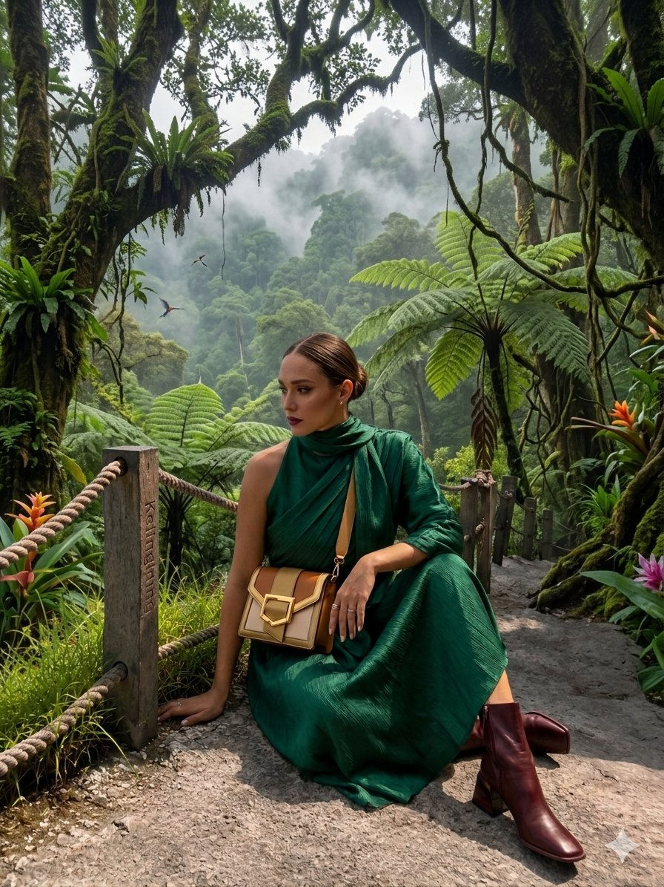

Prompt:

```text
{
  "image_description": {
    "overall_theme": "High-technology augmented reality analysis of a scenic outdoor portrait",
    "resolution": "4K UHD, hyper-realistic with sharp data overlay",
    "subject": {
      "name": "Woman_Model_A",
      "pose": "Seated_profile, looking_left, side",
      "attire": {
        "garment": "Draped_One_Shoulder Pleated_Silk_Green_Dress",
        "color_hex": "#1E6641",
        "footwear": "Boots_Maroon",
        "accessory": {
          "type": "Bag_Two-Tone Leather/Metal",
          "details": "Gold_Buckle_feature"
        }
      }
    },
    "environment": {
      "location": "Nusa_Penida_Cliffside",
      "terrain": "Rocky_Path",
      "details": {
        "main_trees": {
          "type": "Fern_Tree",
          "count": 3
        },
        "vegetation": "Lush mossy trees, vibrant red flowers, exotic plants",
        "boundary": "Wooden fence posts with thick rope rail",
        "background": "Distant tree-covered cliffs partially obscured by mist, with birds in flight",
        "specific_sign": "Small sign on a fence post with the text 'Kelingking'"
      }
    },
    "data_overlay": {
      "style": "Translucent cyan digital interface with glowing gridlines and panel outlines",
      "panels": [
        {
          "position": "Top-Left (Stacked Vertical)",
          "content": [
            "ANALYSIS: SUBJECT_DETECT",
            "POSE: SEATED_PROFILE",
            "OUTFIT: DRAPED_ONE_SHOULDER",
            "COLOR: #1E6641_SILK_GREEN",
            "ACCESSORY_1: BAG_TWO-TONE",
            "MATERIAL: LEATHER/METAL",
            "HEEL: BOOTS_MAROON"
          ]
        },
        {
          "position": "Top-Center (Floating Block)",
          "content": "COORDINATES: -8.7495° S, 115.0934° E"
        },
        {
          "position": "Center-Left (Embedded Annotation)",
          "linked_to": "Leftmost Fern Tree",
          "content": "FERN_TREE (count: 3)"
        },
        {
          "position": "Center-Right (Embedded Annotation)",
          "linked_to": "Rightmost Fern Tree",
          "content": "FERN_TREE (count: 3)"
        },
        {
          "position": "Top-Right (Annotation)",
          "linked_to": "Cliffs",
          "content": "CLIFF_DISTANCE (approx: 450m)"
        },
        {
          "position": "Bottom-Right (Formatted JSON Block)",
          "content": "{\n  \"model\": {\n    \"name\": \"Woman_Model_A\",\n    \"pose\": \"Seated_left_looking_side\"\n  },\n  \"apparel\": {\n    \"garment\": \"Pleated_Silk_Green_Dress\",\n    \"style\": \"One-Shoulder_Draped\"\n  },\n  \"bag\": {\n    \"type\": \"Two-Tone_Leather_Gold-Buckle\",\n    \"brand\": \"Luxury_Accessory\"\n  },\n  \"location\": \"Nusa_Penida_Cliffside\",\n  \"terrain\": \"Rocky_Path\"\n}"
        }
      ]
    }
  }
}
```

### Nano Banana Pro Prompts #172: Infographic / Edu Visual - Gundam Origin Infographic Generation

- Category: `Infographic`
- Model: `Nano Banana Pro`
- Author / Source: [ファーラ@ガンプラ](https://github.com/YouMind-OpenLab/awesome-nano-banana-pro-prompts/blob/main/README.md)
- Image: `assets/imported/YouMind-OpenLab/awesome-nano-banana-pro-prompts/README-44-Infographic-Edu-Visual-Gundam-Origin-Infographic-Generation.jpg`

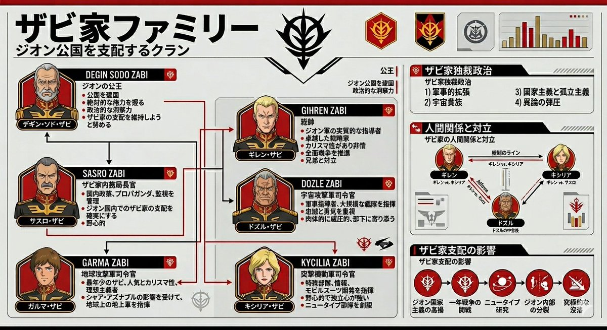

Prompt:

```text
Please summarize the {argument name="subject" default="Zabi family from Gundam Origin"} in an {argument name="style" default="infographic style"}.
```

### Nano Banana Pro Prompts #173: Infographic / Edu Visual - GDR Alternate History Car Design

- Category: `Infographic`
- Model: `Nano Banana Pro`
- Author / Source: [Riccardo](https://github.com/YouMind-OpenLab/awesome-nano-banana-pro-prompts/blob/main/README.md)
- Image: `assets/imported/YouMind-OpenLab/awesome-nano-banana-pro-prompts/README-45-Infographic-Edu-Visual-GDR-Alternate-History-Car-Design.jpg`

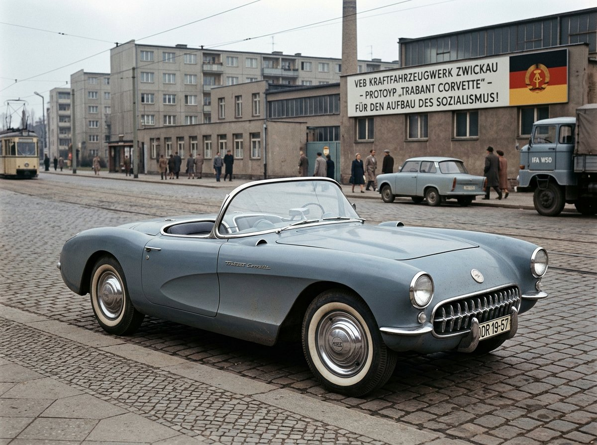

Prompt:

```text
{argument name="car" default="Chevrolet Corvette"} designed in {argument name="location" default="East Germany"} by Trabant engineers in {argument name="era" default="1957"}, retro GDR automotive design, socialist industrial aesthetics, realistic alternate history
```

### Nano Banana Pro Prompts #174: Infographic / Edu Visual - Alligator in Swamp Wildlife Photo

- Category: `Infographic`
- Model: `Nano Banana Pro`
- Author / Source: [AI Art Alley](https://github.com/YouMind-OpenLab/awesome-nano-banana-pro-prompts/blob/main/README.md)
- Image: `assets/imported/YouMind-OpenLab/awesome-nano-banana-pro-prompts/README-46-Infographic-Edu-Visual-Alligator-in-Swamp-Wildlife-Photo.png`

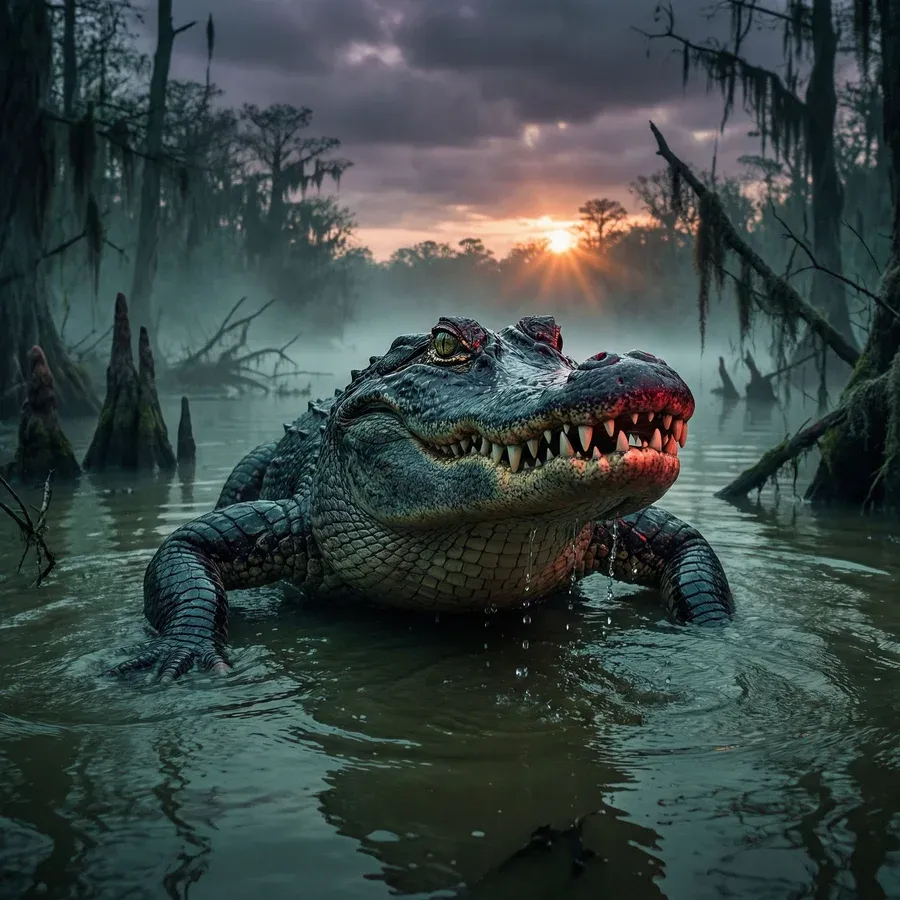

Prompt:

```text
{argument name="subject" default="Alligator"} lurking in a {argument name="setting" default="swamp"} at {argument name="time" default="dusk"}
```

### Nano Banana Pro Prompts #175: Infographic / Edu Visual - Neo-parametric architectural illustration

- Category: `Portrait`
- Model: `Nano Banana Pro`
- Author / Source: [zayan](https://github.com/YouMind-OpenLab/awesome-nano-banana-pro-prompts/blob/main/README.md)
- Image: `assets/imported/YouMind-OpenLab/awesome-nano-banana-pro-prompts/README-47-Infographic-Edu-Visual-Neo-parametric-architectural-illustration.jpg`

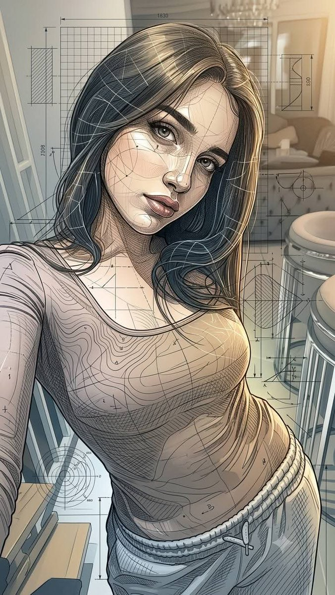

Prompt:

```text
Ultra-detailed Neo-Parametric Editorial Illustration, combining elegant painterly character rendering with futuristic architectural blueprint aesthetics. Refined flowing linework, intricate cross-hatching, contour mapping, technical drafting overlays, geometric construction grids, engineering schematics, dimensional annotations, organic parametric curves, layered wireframe structures, subtle topographic patterns, intelligent negative space composition. Soft cinematic lighting with warm golden highlights balanced by cool gray-blue technical elements. Delicate skin-like shading transitions, luminous depth, atmospheric perspective, premium magazine illustration quality. Harmonious blend of artistic realism and scientific visualization, featuring highly controlled line density, precision ink detailing, transparent design diagrams, flowing structural rhythms, sophisticated visual hierarchy. Muted ivory, warm beige, champagne gold, graphite gray, steel blue, and soft slate palette. Clean luxury aesthetic, intellectual futuristic mood, museum-quality craftsmanship, elegant complexity, ultra-sharp details, high-end concept art, 8K masterpiece. Hyper-detailed Parametric Renaissance Fusion, where organic forms emerge from engineering blueprints and computational design structures. Elegant realistic rendering fused with mathematical line networks, contour meshes, drafting grids, architectural annotations, generative curves, topological flow lines, technical sketch layers, precision pen-and-ink detailing, intelligent wireframe geometry, scientific visualization aesthetics. Warm cinematic glow illuminating soft volumetric forms against sophisticated monochromatic technical frameworks. Rich micro-details, layered transparency effects, flowing construction diagrams, luxury editorial illustration, visionary futurism meets classical artistry, highly refined craftsmanship, intricate line architecture, museum-grade visual sophistication, ultra-premium 8K artwork. 60% realistic and cinematic editorial illustration. 40% parametric blueprint, wireframe, and engineering drawing. COLOR: (champagne, beige, steel blue, graphite).
```

### Nano Banana Pro Prompts #176: Infographic / Edu Visual - Pastel Chalk Insect Knolling

- Category: `Infographic`
- Model: `Nano Banana Pro`
- Author / Source: [Heather Green](https://github.com/YouMind-OpenLab/awesome-nano-banana-pro-prompts/blob/main/README.md)
- Image: `assets/imported/YouMind-OpenLab/awesome-nano-banana-pro-prompts/README-48-Infographic-Edu-Visual-Pastel-Chalk-Insect-Knolling.jpg`

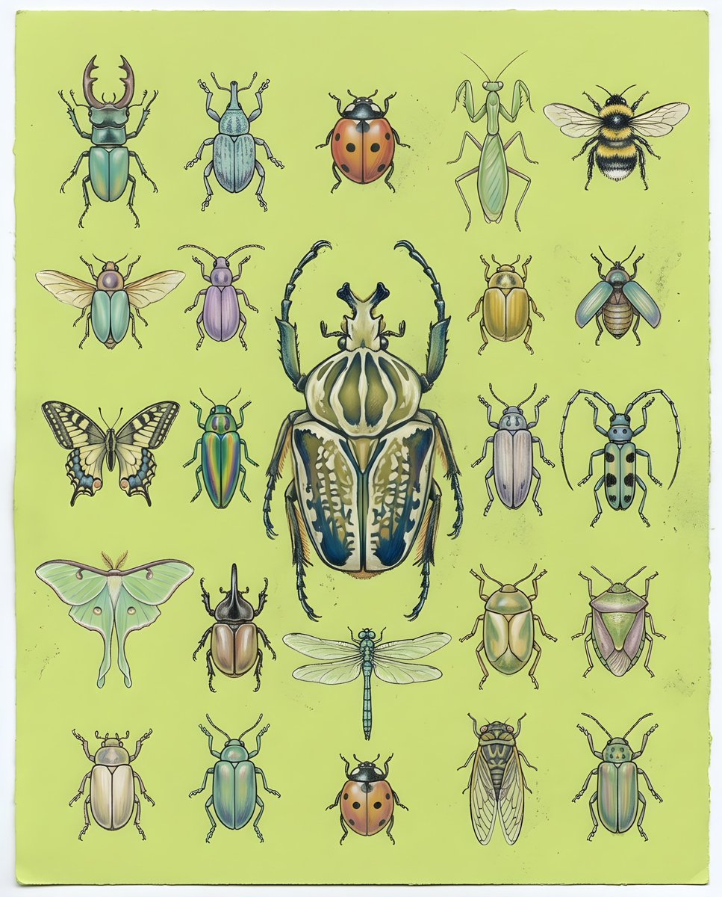

Prompt:

```text
a detailed layout of {argument name="subject" default="various beetles and insects"} created in a {argument name="style" default="soft pastel chalk art style"}, with subtle chalk dust and textured paper grain visible. Harmonious, gently blended colors on a {argument name="background" default="lime-green background"}, arranged in a precise knolling style grid of hand-drawn beetles and insects, with one large, intricately rendered beetle in the center acting as the focal point, high-resolution illustration, clean negative space, top-down view.
```

### Nano Banana Pro Prompts #177: Infographic / Edu Visual - European Travel Lifestyle Moodboard

- Category: `Infographic`
- Model: `Nano Banana Pro`
- Author / Source: [Minahil](https://github.com/YouMind-OpenLab/awesome-nano-banana-pro-prompts/blob/main/README.md)
- Image: `assets/imported/YouMind-OpenLab/awesome-nano-banana-pro-prompts/README-49-Infographic-Edu-Visual-European-Travel-Lifestyle-Moodboard.jpg`

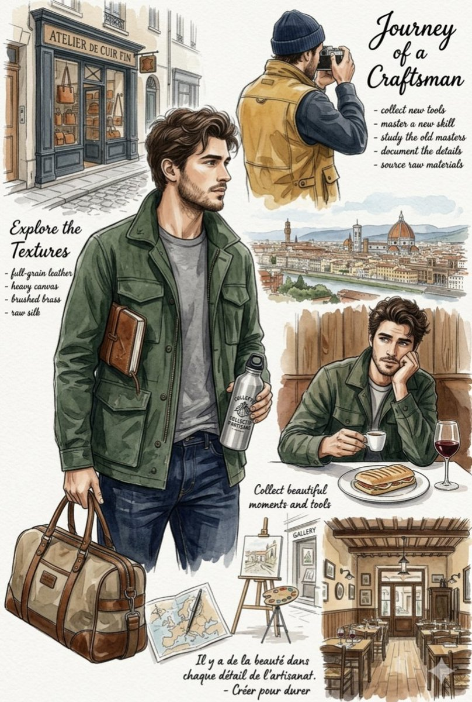

Prompt:

```text
A beautiful, watercolor-style lifestyle mood board and illustration collage capturing the essence of travel, craftsmanship, and European aesthetic. The central figure is a {argument name="subject" default="handsome young man with wavy brown hair, a light beard, wearing a green field jacket"}. He is carrying a leather-trimmed canvas duffel bag and holding a water bottle. Surrounding him are various artistic vignettes: a man taking a photograph, a scenic panoramic sketch of {argument name="location" default="Florence, Italy"}, the same young man at a cafe, and a French leather shop. The artwork features elegant handwritten script titles like "Journey of a Craftsman" and "Explore the Textures," paired with bullet points emphasizing artisanal details. The overall color palette consists of earthy tones, greens, browns, and warm watercolor washes on an off-white paper texture background.
```

### Nano Banana Pro Prompts #178: Infographic / Edu Visual - Engineering Product Infographic Design

- Category: `Product`
- Model: `Nano Banana Pro`
- Author / Source: [⁠ luciaAI](https://github.com/YouMind-OpenLab/awesome-nano-banana-pro-prompts/blob/main/README.md)
- Image: `assets/imported/YouMind-OpenLab/awesome-nano-banana-pro-prompts/README-50-Infographic-Edu-Visual-Engineering-Product-Infographic-Design.jpg`

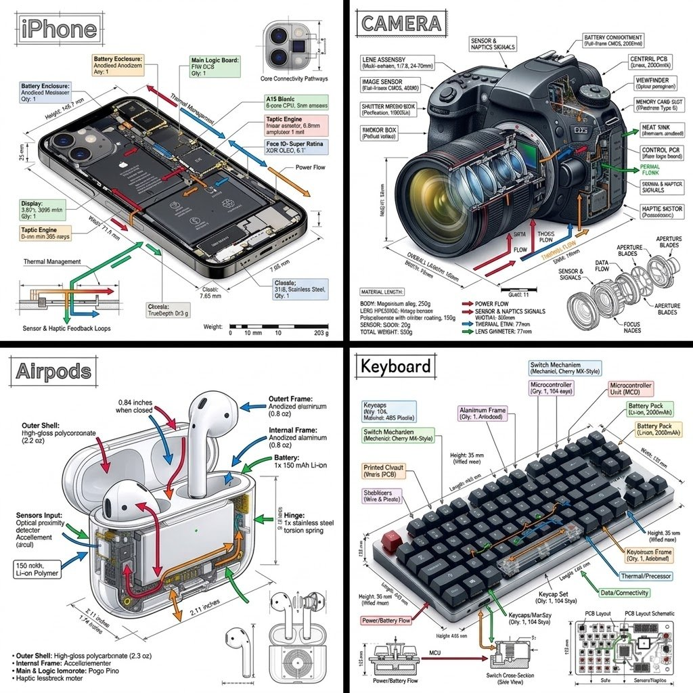

Prompt:

```text
Ultra-detailed technical engineering infographic, clean {argument name="background color" default="white"} background, divided into a precise {argument name="grid layout" default="2×2 grid"} by sharp black separator lines. Blueprint-style industrial design visualization featuring photorealistic 3D renders, transparent cutaways, exploded views, dimensional annotations, technical callout boxes, measurement guides, and color-coded engineering arrows (red, blue, green, orange). Professional product design presentation, Apple-style industrial design documentation, high-end technical illustration. TOP LEFT: {argument name="primary subject" default="Modern smartphone"} shown in angled perspective with display removed, exposing densely packed internal components. Visible L-shaped battery, advanced logic board, processor chip, camera module, Face ID sensors, Taptic Engine, thermal pathways, ribbon cables, screws, connectors, and cooling architecture. Precise engineering labels and dimension lines surrounding components. TOP RIGHT: Professional mirrorless camera with large zoom lens. Longitudinal cutaway through lens assembly revealing multiple glass elements, optical groups, aperture mechanism, image sensor, shutter system, electronic components, and viewfinder structure. Additional exploded sub-diagram illustrating aperture blade construction and assembly sequence. Detailed optical engineering annotations. BOTTOM LEFT: Premium wireless earbud charging case displayed partially transparent and split open. One earbud seated inside, second earbud floating above in exploded-view configuration. Internal lithium-polymer battery, miniature logic board, charging contacts, wiring channels, magnets, and compact electronic architecture clearly visible through transparent shell. Technical callouts and component identification markers. BOTTOM RIGHT: Modern mechanical keyboard with charcoal-gray keycaps and single red accent key. Horizontal transparent cutaway sections exposing mechanical switches, switch housings, springs, stabilizers, PCB circuitry, LEDs, and internal frame structure. Lower margin includes enlarged switch cross-section diagram and geometric PCB schematic blueprint. Engineering measurements and component annotations throughout. Highly detailed CAD visualization, industrial design presentation board, precision engineering drawing, exploded assembly diagrams, transparent materials, photorealistic rendering, ultra-sharp focus, clean typography, scientific infographic aesthetics, professional product teardown documentation, white paper style, 8K resolution, museum-quality technical illustration, symmetrical layout, exceptional clarity.
```

### Nano Banana Pro Prompts #179: Infographic / Edu Visual - Rural Fields Multi-Perspective Grid

- Category: `Portrait`
- Model: `Nano Banana Pro`
- Author / Source: [coloringany.com](https://github.com/YouMind-OpenLab/awesome-nano-banana-pro-prompts/blob/main/README.md)
- Image: `assets/imported/YouMind-OpenLab/awesome-nano-banana-pro-prompts/README-51-Infographic-Edu-Visual-Rural-Fields-Multi-Perspective-Grid.jpg`

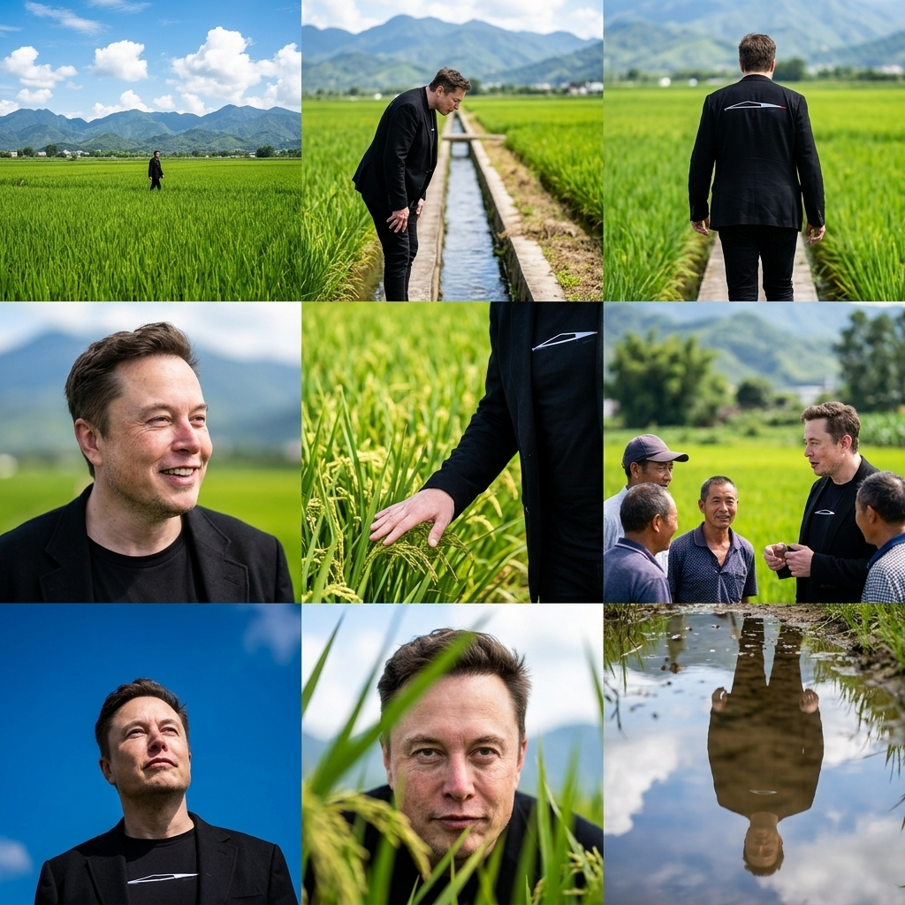

Prompt:

```text
Introduce the characters in the photo and generate an artistic photo of different perspectives of the {argument name="subject" default="Chinese rural fields"} in a {argument name="layout" default="nine-square grid"}. The background features {argument name="background details" default="rice paddies, blue sky, and white clouds"}, with a slightly blurred distant view. The characters are photographed from different angles, including distant, medium, and close-up views
```

### Nano Banana Pro Prompts #180: Infographic / Edu Visual - Image to Infographic Guide

- Category: `Infographic`
- Model: `Nano Banana Pro`
- Author / Source: [AI探路者Tim](https://github.com/YouMind-OpenLab/awesome-nano-banana-pro-prompts/blob/main/README.md)
- Image: `assets/imported/YouMind-OpenLab/awesome-nano-banana-pro-prompts/README-52-Infographic-Edu-Visual-Image-to-Infographic-Guide.jpg`

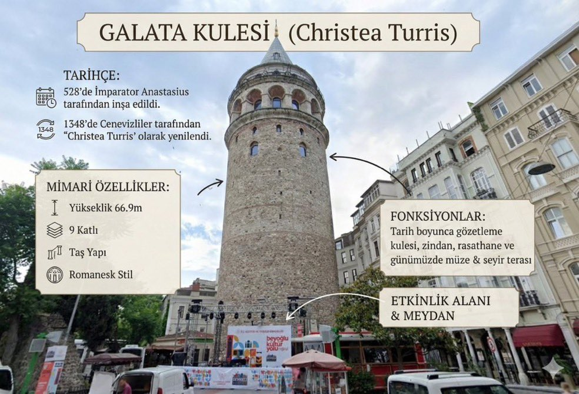

Prompt:

```text
Convert this image into an {argument name="format" default="information visualization guide"} describing this location.
```

### Nano Banana Pro Prompts #181: Infographic / Edu Visual - Mango Smoothie Infographic and Commercial Photography

- Category: `Product`
- Model: `Nano Banana Pro`
- Author / Source: [𝐌](https://github.com/YouMind-OpenLab/awesome-nano-banana-pro-prompts/blob/main/README.md)
- Image: `assets/imported/YouMind-OpenLab/awesome-nano-banana-pro-prompts/README-53-Infographic-Edu-Visual-Mango-Smoothie-Infographic-and-Commercial-Photography.jpg`

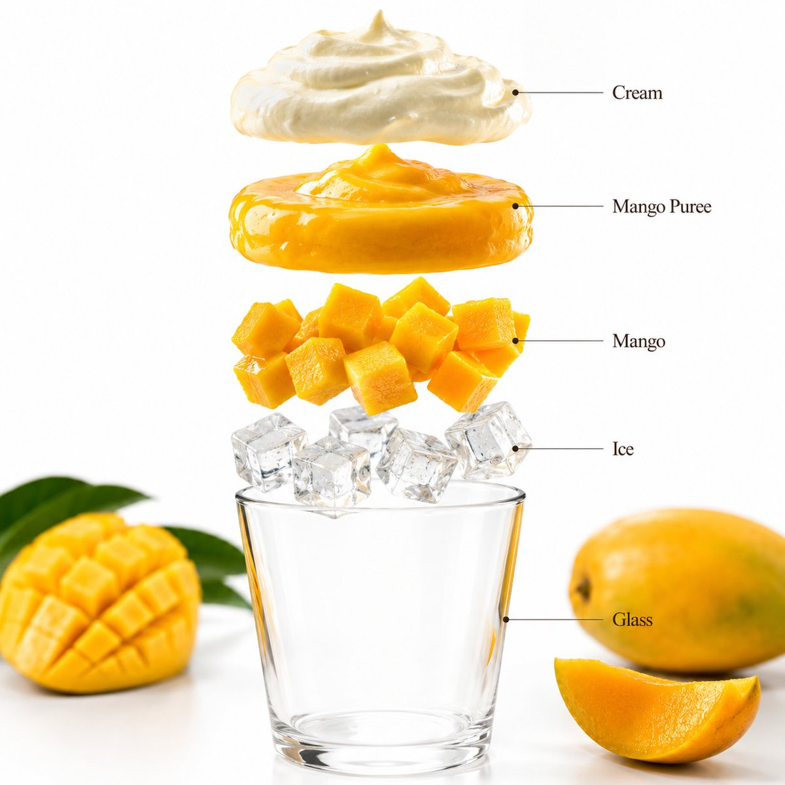

Prompt:

```text
- A premium beverage product photograph of a {argument name="fruit" default="mango"} smoothie in a tall transparent glass centered against a bright tropical yellow seamless studio background. The smoothie has a rich creamy mango texture with fresh mango slices garnish, condensation droplets, and vibrant color. Soft commercial lighting creates clean reflections and realistic shadows beneath the glass. Ultra-sharp focus, premium beverage advertisement style, hyper realistic, 8K.
Aspect Ratio: 1:1

Create a hyper-realistic exploded vertical infographic composition of a mango smoothie.
Top → Bottom structure:
Cream Foam Layer (light airy cream texture)
→ Mango Puree Layer (rich vibrant mango texture)
→ Fresh Mango Chunks (juicy fruit detail)
→ Ice Cube Layer (clear realistic ice texture)
→ Glass Base (minimal transparent glass)
Perfect alignment, tropical yellow background, soft realistic shadows, premium beverage infographic design.
Add clean infographic text labels with thin pointer lines using these exact labels:
“Cream”
“Mango Puree”
“Mango”
“Ice”
“Glass”
Ultra-realistic drink detail, premium commercial photography, 8K.
Aspect Ratio: 1:1
```

### Nano Banana Pro Prompts #182: Infographic / Edu Visual - Male Age Progression Portrait

- Category: `Product`
- Model: `Nano Banana Pro`
- Author / Source: [Nexora](https://github.com/YouMind-OpenLab/awesome-nano-banana-pro-prompts/blob/main/README.md)
- Image: `assets/imported/YouMind-OpenLab/awesome-nano-banana-pro-prompts/README-54-Infographic-Edu-Visual-Male-Age-Progression-Portrait.jpg`

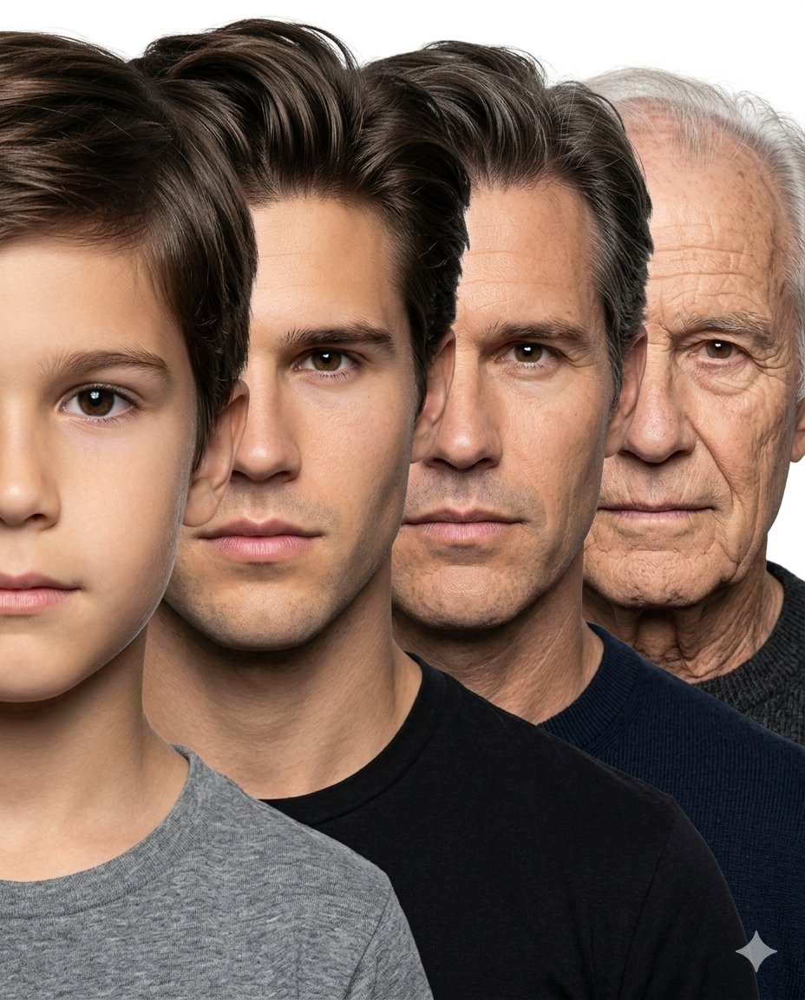

Prompt:

```text
Create a hyper-realistic age progression portrait sequence of the same male individual across {argument name="stages" default="4 major life stages: child (age 6), young adult (age 25), middle-aged man (age 45), and elderly man (age 75+)"}. Use the attached child’s face as the exact identity reference for the youngest stage and ensure every age stage looks like the exact same person naturally aging over time, preserving identical facial structure, nose shape, eye color, jawline, skin tone, eyebrow structure, lips, and facial proportions consistently across all ages. Arrange all four faces in a tightly compressed overlapping side-stacked composition exactly like a professional photographic age progression lineup. Each face should be front-facing, tightly cropped, and positioned slightly behind the previous one from front to back, creating a smooth layered progression from youngest to oldest. Maintain nearly equal face scale across all stages with minimal perspective distortion. Faces should overlap naturally and remain very close together with clean simple spacing, similar to a studio portrait stacking composition. No geometric panels, no cinematic scene composition, no excessive depth effect, no dramatic perspective. Pure white seamless studio background, soft neutral studio lighting, realistic skin texture, natural aging details, plain neutral clothing, ultra photo-realistic, highly detailed, sharp focus, professional portrait photography, seamless identity consistency across all ages. No corp. Aspect ratio 4:5, no text, no logo.
```

### Nano Banana Pro Prompts #183: YouTube Thumbnail - Cinematic Sports Documentary Key Art

- Category: `Portrait`
- Model: `Nano Banana Pro`
- Author / Source: [Gadgetify](https://github.com/YouMind-OpenLab/awesome-nano-banana-pro-prompts/blob/main/README.md)
- Image: `assets/imported/YouMind-OpenLab/awesome-nano-banana-pro-prompts/README-55-YouTube-Thumbnail-Cinematic-Sports-Documentary-Key-Art.jpg`

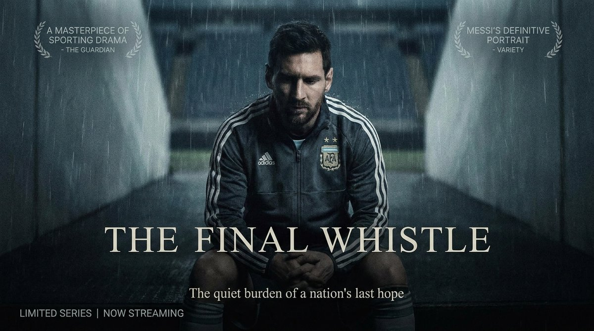

Prompt:

```text
do this for {argument name="event" default="Argentina World Cup 2026"}, void main() { string player = "{argument name="player" default="[PLAYER]"}"; string team = "{argument name="team" default="[TEAM]"}"; // --- The series (infer the arc to dramatize) --- Arc a = infer_career_drama(player); // the prodigy years / the exile / the comeback - pick the prestige angle tone(restrained, moody, character_first); // NOT loud - quiet and heavy // --- Key art composition --- portrait(infer_player_persona(player), contemplative, half_shadow); environment(symbolic_setting(a), atmospheric, shallow_focus); // empty stadium / tunnel / rain on glass grade(infer_team_colors(team), desaturated_prestige, single_accent); // --- Streaming furniture (flat overlay) --- title(invent_series_title(player), elegant_serif_or_thin_sans, centered); tagline(invent_logline(player), small, below_title); platform_mark("LIMITED SERIES", "NOW STREAMING", micro_caps, corner); laurels(invent_critic_pullquotes(), thin); render(cinematic_still, film_grain: fine, premium_negative_space); }
```

### Nano Banana Pro Prompts #184: YouTube Thumbnail - Majestic Elephant Cloud Photography

- Category: `Video`
- Model: `Nano Banana Pro`
- Author / Source: [ÀBDŪLLÂH](https://github.com/YouMind-OpenLab/awesome-nano-banana-pro-prompts/blob/main/README.md)
- Image: `assets/imported/YouMind-OpenLab/awesome-nano-banana-pro-prompts/README-56-YouTube-Thumbnail-Majestic-Elephant-Cloud-Photography.jpg`

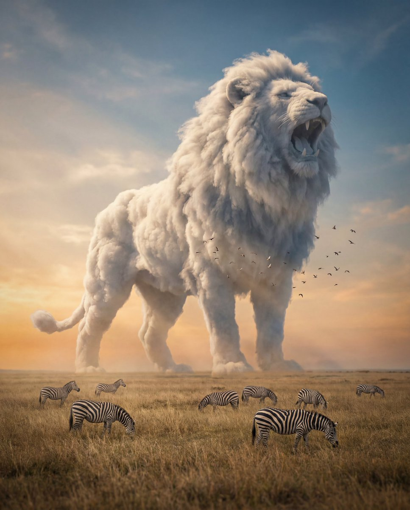

Prompt:

```text
Hyper-realistic photography of massive volumetric clouds forming the shape of a majestic {argument name="animal" default="elephant"}, highly detailed and anatomically accurate cloud structure with enormous tusks and a raised trunk, soft yet dense cumulus clouds with realistic depth and texture, dramatic golden-hour lighting, sunlight rays piercing through the clouds, subtle shadows and highlights enhancing form.
Foreground: a vast {argument name="landscape" default="African savanna meadow"} with realistic dry grass, atmospheric perspective, and cinematic depth of field. Multiple {argument name="wildlife" default="zebras"} grazing naturally across the field. Mid-air: flock of birds circling around the giant elephant cloud, adding scale and motion.
Environment: cinematic sky with warm orange and blue gradient tones, slight haze, natural color grading, ultra-realistic lighting, global illumination, volumetric fog, physically accurate shadows.
Style: DSLR photography, 85mm lens, f/2.8 aperture, shallow depth of field, HDR, 8K resolution, razor-sharp focus, intricate details, photorealism, no CGI look.
Mood: majestic, calm, surreal yet believable, wildlife documentary realism.
```

### Nano Banana Pro Prompts #185: YouTube Thumbnail - Anime Railway Station Transformation

- Category: `Creative`
- Model: `Nano Banana Pro`
- Author / Source: [神根 斗九之進（Tokunoshin kamine）](https://github.com/YouMind-OpenLab/awesome-nano-banana-pro-prompts/blob/main/README.md)
- Image: `assets/imported/YouMind-OpenLab/awesome-nano-banana-pro-prompts/README-57-YouTube-Thumbnail-Anime-Railway-Station-Transformation.jpg`

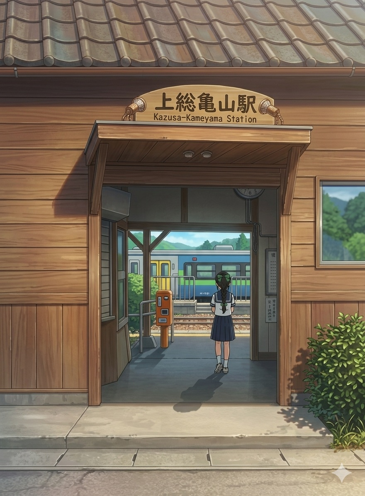

Prompt:

```text
Please create it in an anime style. {argument name="scene description" default="A wooden station building with a train stopped in the distance."}
```

### Nano Banana Pro Prompts #186: YouTube Thumbnail - Mr Bean Mini Cooper Chaos

- Category: `Portrait`
- Model: `Nano Banana Pro`
- Author / Source: [Zar⭕on](https://github.com/YouMind-OpenLab/awesome-nano-banana-pro-prompts/blob/main/README.md)
- Image: `assets/imported/YouMind-OpenLab/awesome-nano-banana-pro-prompts/README-58-YouTube-Thumbnail-Mr-Bean-Mini-Cooper-Chaos.jpg`

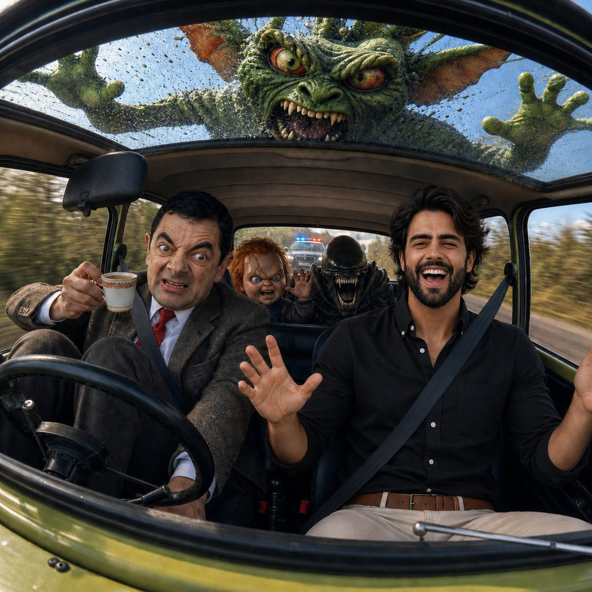

Prompt:

```text
Hyper-realistic, chaotic wide-angle fish-eye dashboard shot of a speeding {argument name="car" default="vintage Mini Cooper"}.
Characters & Identity:

{argument name="driver" default="Mr. Bean (Rowan Atkinson)"} driving maniacally, steering with knees, holding a cup of tea.
Passenger: photorealistic human, face and hair 100% identical to the uploaded reference, wearing a {argument name="outfit" default="modern oversized printed baggy t-shirt"}, enjoying the thrill of speed.
Back seat: 3D animated Chucky (evil doll) and Alien Xenomorph, physically squished together, faces pressed against the side window in humorous distortion.
Outside windshield: 3D animated Green Mean Gremlin splattered against glass, furious expression.
Through rear window: police car in pursuit.
Scene & Environment:

atermark, text Harsh daylight, strong natural shadows
Motion blur on passing scenery for extreme sense of speed
Interior of Mini Cooper rendered with photorealistic detail (dashboard, steering wheel, seats, reflections)
Camera & Composition:

Wide-angle fish-eye perspective, exaggerating speed and chaos
Cinematic framing, dynamic, immersive POV
High-fidelity textures, realistic lighting, reflections, and depth
Mood & Realism: Hyper-realistic photorealism for all human and Mini Cooper elements
3D animated characters integrated seamlessly into scene
Vibrant, chaotic, fast-paced, cinematic, humorous
```

### Nano Banana Pro Prompts #187: YouTube Thumbnail - Cinematic Moonlight Rooftop Portrait Collage

- Category: `Product`
- Model: `Nano Banana Pro`
- Author / Source: [Professor](https://github.com/YouMind-OpenLab/awesome-nano-banana-pro-prompts/blob/main/README.md)
- Image: `assets/imported/YouMind-OpenLab/awesome-nano-banana-pro-prompts/README-59-YouTube-Thumbnail-Cinematic-Moonlight-Rooftop-Portrait-Collage.jpg`

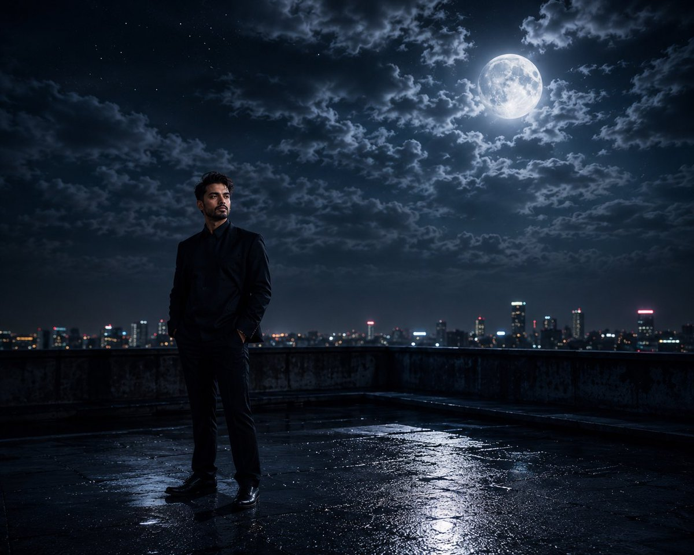

Prompt:

```text
Use the uploaded face reference image as the exact identity reference. Maintain perfect facial consistency across all frames — same facial structure, skin tone, hairstyle, eye shape, beard texture, nose, lips, and realistic proportions. Do not change identity. Create an ultra-cinematic multi-frame night photography collage of a {argument name="subject" default="young man"} standing on a {argument name="location" default="rooftop"} under a {argument name="celestial body" default="massive glowing full moon"}. Mood should feel emotional, dreamy, introspective, and film-like. Composition Layout (6-frame cinematic grid): 1.Wide rooftop shot with giant moon dominating the cloudy night sky. 2.Side profile portrait looking upward toward the moon. 3.Extreme close-up of eye reflecting moonlight and clouds. 4.Cinematic silhouette frame from behind with skyline lights. 5.Hand close-up resting on rooftop railing with shallow depth of field. 6.Atmospheric sky frame filled with stars, clouds, moon glow, and haze. Environment: Urban rooftop at night, Distant city skyline with realistic bokeh lights, Dramatic clouds surrounding bright moon, Slight wind movement in clothes and hair, Moist rooftop texture with reflective highlights, Atmospheric fog and cinematic haze. Lighting: Soft blue moonlight as key light, Subtle warm city lights from below, Realistic night shadows, Volumetric moon glow, Rim lighting around silhouette, High dynamic range cinematic contrast. Camera & Photography Style: Shot on Sony A7R IV / ARRI Alexa style, 85mm portrait lens + 35mm cinematic wide lens, Ultra photorealistic, Natural skin texture, Shallow depth of field, Sharp eye detail, Film grain, HDR night photography, Moody color grading, Premium cinematic composition, Hyper detailed, Unreal Engine realism, Netflix-style visual atmosphere. Color Palette: Deep midnight blue, silver moonlight, soft black shadows, cool cyan tones, warm golden city bokeh highlights. Quality Tags: masterpiece, best quality, ultra detailed, 8k, photorealistic, cinematic lighting, volumetric fog, realistic skin texture, atmospheric perspective, dramatic composition, high contrast, emotional storytelling, movie still aesthetic, premium cinematic collage, highly detailed clouds, realistic reflections. Negative Prompt: low quality, blurry face, bad anatomy, distorted eyes, extra fingers, oversaturated colors, cartoon, CGI look, duplicate frames, low detail skin, noisy image, warped hands, fake lighting, washed colors, deformed face, unrealistic moon proportions, text, watermark, logo, cropped face
```

### Nano Banana Pro Prompts #188: YouTube Thumbnail - Street Glamour Cake Knife Portrait

- Category: `Portrait`
- Model: `Nano Banana Pro`
- Author / Source: [Dr. Samia](https://github.com/YouMind-OpenLab/awesome-nano-banana-pro-prompts/blob/main/README.md)
- Image: `assets/imported/YouMind-OpenLab/awesome-nano-banana-pro-prompts/README-60-YouTube-Thumbnail-Street-Glamour-Cake-Knife-Portrait.jpg`

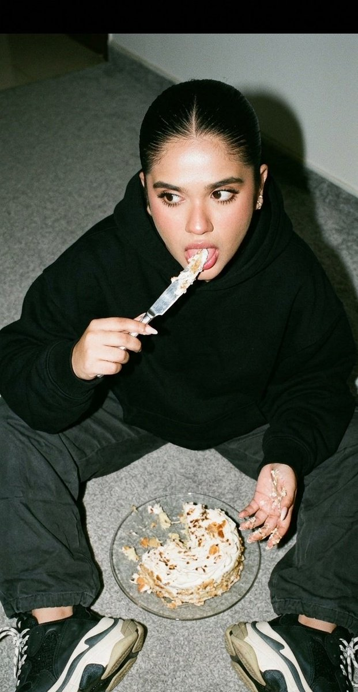

Prompt:

```text
Do not change the facial features. A cinematic close-up portrait of a young woman. The photo is taken from a slightly high angle. She is sitting on the floor, which is covered with a gray carpet. She is facing the camera; one leg is bent, the other is straight and extended. Between her legs, there is a flat glass plate with a partially eaten cake on it. One hand is next to the cake and is smeared with it; with the other hand, she is holding a knife and licking the cake off the blade. Her gaze is slightly turned to the side. The photo is taken with flash. Film grain is added. The overall vibe of the frame is relaxed, with a street glamour feel. She is wearing {argument name="clothing style" default="Balenciaga-style clothing"}. A realistic, detailed photograph.
```

### Nano Banana Pro Prompts #189: YouTube Thumbnail - Cinematic Vigilante Graphic Poster

- Category: `Portrait`
- Model: `Nano Banana Pro`
- Author / Source: [Aijaz](https://github.com/YouMind-OpenLab/awesome-nano-banana-pro-prompts/blob/main/README.md)
- Image: `assets/imported/YouMind-OpenLab/awesome-nano-banana-pro-prompts/README-61-YouTube-Thumbnail-Cinematic-Vigilante-Graphic-Poster.jpg`

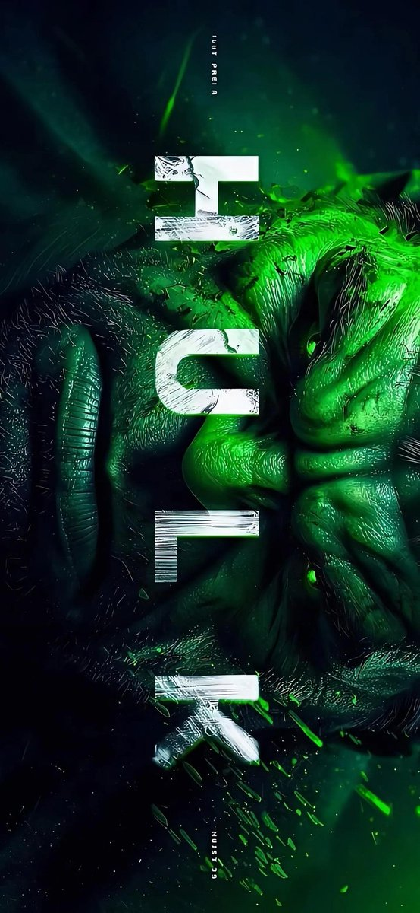

Prompt:

```text
A cinematic, vertical graphic poster of a masked vigilante in a tactical carbon-fiber suit. The character is positioned in the foreground with a gritty, matte black texture. The background features massive, bold stencil-style typography in a deep crimson red with heavy metallic scratching and weathered textures. The lighting is low-key and dramatic, with subtle rim lighting on the suit to define its armor plates. High-contrast noir aesthetic, moody atmosphere, sharp details, 8k resolution, Extreme macro close-up of a monstrous green-skinned face, focused on the nose, furrowed brow, and intense glowing green eyes. The skin is hyper-detailed with deep wrinkles, sweat, and a rough, leathery texture. Overlaid vertically across the center is the word "HULK" in large, bold, weathered white sans-serif typography with a metallic, scratched finish. The color palette is dominated by deep emerald greens and shadows, featuring explosive green energy particles and debris flying across the frame. Cinematic lighting, gritty atmosphere, 8k resolution, hyper-realistic, aggressive and powerful mood.
```

### Nano Banana Pro Prompts #190: YouTube Thumbnail - Basketball Arena Broadcast Portrait

- Category: `Portrait`
- Model: `Nano Banana Pro`
- Author / Source: [Diamond](https://github.com/YouMind-OpenLab/awesome-nano-banana-pro-prompts/blob/main/README.md)
- Image: `assets/imported/YouMind-OpenLab/awesome-nano-banana-pro-prompts/README-62-YouTube-Thumbnail-Basketball-Arena-Broadcast-Portrait.jpg`

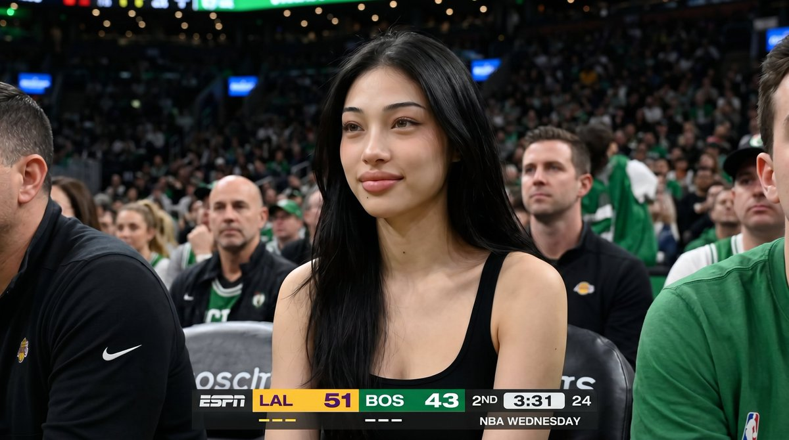

Prompt:

```text
usw image1 as the main identity anchor

{"meta":{"image_quality":"High","image_type":"Screenshot","resolution_estimation":"1920x1080","file_characteristics":{"compression_artifacts":"Low","noise_level":"Low","lens_type_estimation":"Medium telephoto"}},"global_context":{"scene_description":"A medium shot of a {argument name="subject" default="young woman with long dark hair"} sitting in a crowded arena, likely a basketball game, with an {argument name="overlay type" default="ESPN broadcast overlay"} at the bottom and top right.","environment_type":"Indoor arena","time_of_day":"Unknown","weather_atmosphere":"Crowded, indoor lighting","lighting":{"source":"Artificial arena lighting","direction":"Frontal, slightly overhead","quality":"Soft, diffused","color_temperature":"Neutral"},"color_palette":{"dominant_hex_estimates":["#1a1a1a","#333333","#ffffff"],"accent_colors":["#fdb927","#007a33"],"contrast_level":"Medium"}},"composition":{"camera_angle":"Eye-level","framing":"Medium shot","depth_of_field":"Shallow","focal_point":"The woman's face","symmetry_type":"None","rule_of_thirds_alignment":"Woman's face is positioned in the upper right quadrant"},"objects":[{"id":"obj_001","label":"Woman","category":"Person","location":{"relative_position":"Center","bounding_box_percentage":{"x":0.25,"y":0.05,"width":0.5,"height":0.9}},"dimensions_relative":"Large","distance_from_camera":"Near","pose_orientation":"Facing slightly right, head turned towards the left","material":"Skin, hair, fabric","surface_properties":{"texture":"Smooth skin, wavy hair","reflectivity":"Low","micro_details":"Natural skin texture, subtle makeup","wear_state":"N/A"},"color_details":{"base_color_hex":"#d2b48c","secondary_colors":["#000000"],"gradient_or_pattern":"None"},"interaction_with_light":{"shadow_casting":"Soft shadows under chin and nose","highlight_zones":"Cheekbones, nose bridge, lips","translucency":"None"},"text_content":null,"relationships":[]},{"id":"obj_002","label":"ESPN Scoreboard Overlay","category":"UI elements","location":{"relative_position":"Bottom center","bounding_box_percentage":{"x":0.25,"y":0.85,"width":0.5,"height":0.15}},"dimensions_relative":"Medium","distance_from_camera":"Overlay","pose_orientation":"Flat","material":"Digital graphic","surface_properties":{"texture":"Smooth","reflectivity":"None","micro_details":"Sharp typography","wear_state":"N/A"},"color_details":{"base_color_hex":"#000000","secondary_colors":["#fdb927","#007a33","#ffffff"],"gradient_or_pattern":"Solid color blocks"},"interaction_with_light":{"shadow_casting":"None","highlight_zones":"None","translucency":"Slightly opaque"},"text_content":{"raw_text":"{argument name="scoreboard text" default="LAL 51 BOS 43 2ND 3:31 24 NBA WEDNESDAY"}","font_style":"Sans-serif","font_weight":"Bold","text_case":"Uppercase","alignment":"Center","color_hex":"#ffffff"},"relationships":[]}],"background_details":{"texture":"Blurred crowd","patterns":"None","lighting_behavior":"Out of focus","additional_elements":["Person holding a plastic cup on the left"]}}
```

### Nano Banana Pro Prompts #191: YouTube Thumbnail - NBA Broadcast Stadium Screenshot

- Category: `Portrait`
- Model: `Nano Banana Pro`
- Author / Source: [Lipe](https://github.com/YouMind-OpenLab/awesome-nano-banana-pro-prompts/blob/main/README.md)
- Image: `assets/imported/YouMind-OpenLab/awesome-nano-banana-pro-prompts/README-63-YouTube-Thumbnail-NBA-Broadcast-Stadium-Screenshot.jpg`

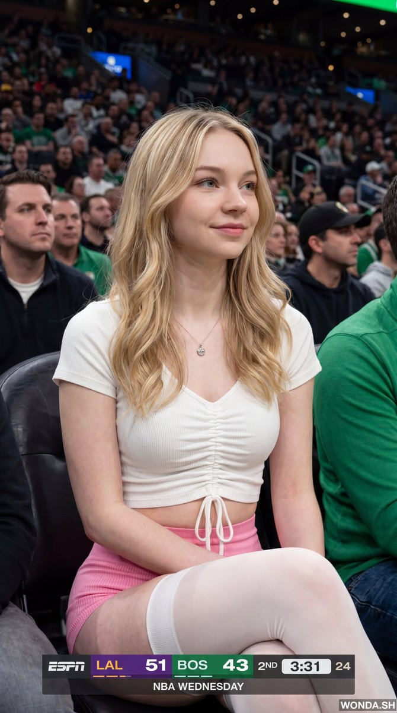

Prompt:

```text
{"meta":{"image_quality":"High","image_type":"Screenshot","resolution_estimation":"1920x1080","file_characteristics":{"compression_artifacts":"Low","noise_level":"Low","lens_type_estimation":"Medium telephoto"}},"global_context":{"scene_description":"A medium shot of a young woman with long dark hair sitting in a crowded arena, likely a basketball game, with an ESPN broadcast overlay at the bottom and top right.","environment_type":"Indoor arena","time_of_day":"Unknown","weather_atmosphere":"Crowded, indoor lighting","lighting":{"source":"Artificial arena lighting","direction":"Frontal, slightly overhead","quality":"Soft, diffused","color_temperature":"Neutral"},"color_palette":{"dominant_hex_estimates":["#1a1a1a","#333333","#ffffff"],"accent_colors":["#fdb927","#007a33"],"contrast_level":"Medium"}},"composition":{"camera_angle":"Eye-level","framing":"Medium shot","depth_of_field":"Shallow","focal_point":"The woman's face","symmetry_type":"None","rule_of_thirds_alignment":"Woman's face is positioned in the upper right quadrant"},"objects":[{"id":"obj_001","label":"Woman","category":"Person","location":{"relative_position":"Center","bounding_box_percentage":{"x":0.25,"y":0.05,"width":0.5,"height":0.9}},"dimensions_relative":"Large","distance_from_camera":"Near","pose_orientation":"Facing slightly right, head turned towards the left","material":"Skin, hair, fabric","surface_properties":{"texture":"Smooth skin, wavy hair","reflectivity":"Low","micro_details":"Natural skin texture, subtle makeup","wear_state":"N/A"},"color_details":{"base_color_hex":"#d2b48c","secondary_colors":["#000000"],"gradient_or_pattern":"None"},"interaction_with_light":{"shadow_casting":"Soft shadows under chin and nose","highlight_zones":"Cheekbones, nose bridge, lips","translucency":"None"},"text_content":null,"relationships":[]},{"id":"obj_002","label":"ESPN Scoreboard Overlay","category":"UI elements","location":{"relative_position":"Bottom center","bounding_box_percentage":{"x":0.25,"y":0.85,"width":0.5,"height":0.15}},"dimensions_relative":"Medium","distance_from_camera":"Overlay","pose_orientation":"Flat","material":"Digital graphic","surface_properties":{"texture":"Smooth","reflectivity":"None","micro_details":"Sharp typography","wear_state":"N/A"},"color_details":{"base_color_hex":"#000000","secondary_colors":["#fdb927","#007a33","#ffffff"],"gradient_or_pattern":"Solid color blocks"},"interaction_with_light":{"shadow_casting":"None","highlight_zones":"None","translucency":"Slightly opaque"},"text_content":{"raw_text":"{argument name="scoreboard text" default="LAL 51 BOS 43 2ND 3:31 24 NBA WEDNESDAY"}","font_style":"Sans-serif","font_weight":"Bold","text_case":"Uppercase","alignment":"Center","color_hex":"#ffffff"},"relationships":[]}],"background_details":{"texture":"Blurred crowd","patterns":"None","lighting_behavior":"Out of focus","additional_elements":["Person holding a plastic cup on the left","Person on the right"]}}
```

### Nano Banana Pro Prompts #192: YouTube Thumbnail - Magical Book Visualization Grid

- Category: `Portrait`
- Model: `Nano Banana Pro`
- Author / Source: [Gadgetify](https://github.com/YouMind-OpenLab/awesome-nano-banana-pro-prompts/blob/main/README.md)
- Image: `assets/imported/YouMind-OpenLab/awesome-nano-banana-pro-prompts/README-64-YouTube-Thumbnail-Magical-Book-Visualization-Grid.jpg`

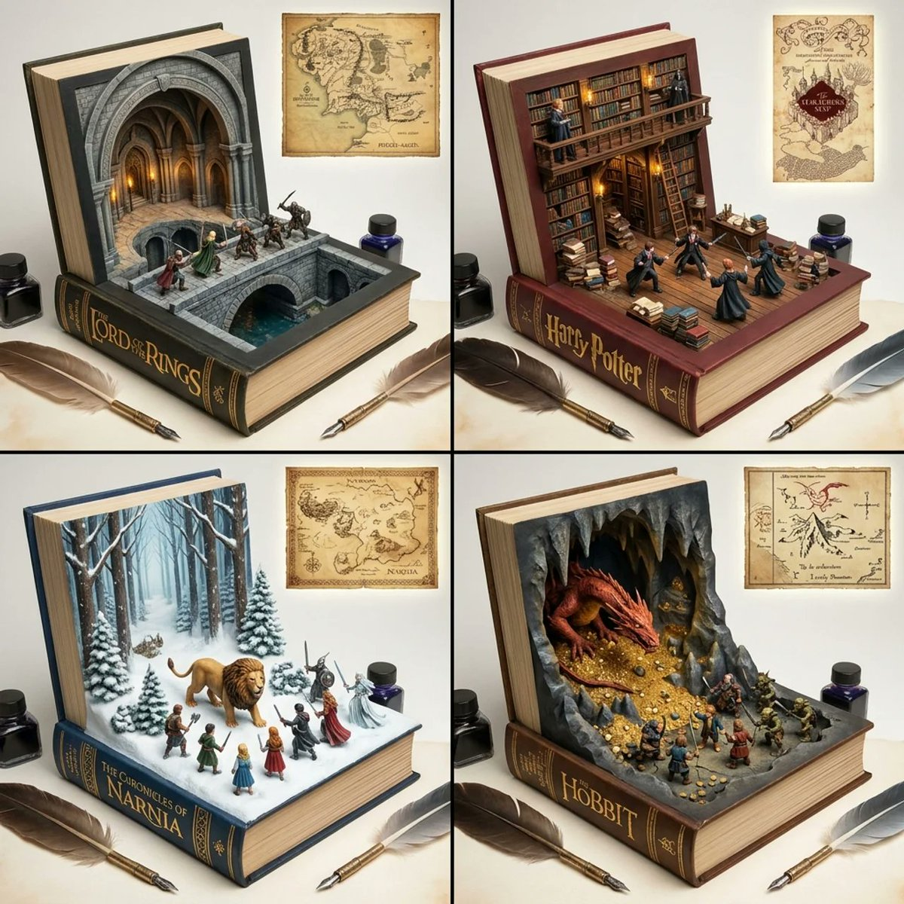

Prompt:

```text
2x2 grid, do this for 4 famous books render_target = ( {argument name="main object" default="giant_sliced_open_hardcover_fantasy_book"} * 2.0 ) + ( {argument name="inner scene" default="inferred_magical_library_diorama_inside"} * 1.8 ) + ( miniature_main_characters_fighting_bad_guys * 1.5 ) + ( floating_old_english_map_overlay_top_right * 2.0 ) + ( tiny_ink_bottles_and_quills_exterior * 1.0 ) + ( {argument name="background" default="clean_parchment_paper_studio_background"} * 1.2 ) - ( e_reader / 2.0 ) - ( modern_clothing / 2.0 ) - ( messy_desk )
```

### Nano Banana Pro Prompts #193: YouTube Thumbnail - Song-to-Image Visualization

- Category: `Creative`
- Model: `Nano Banana Pro`
- Author / Source: [一抹のFun](https://github.com/YouMind-OpenLab/awesome-nano-banana-pro-prompts/blob/main/README.md)
- Image: `assets/imported/YouMind-OpenLab/awesome-nano-banana-pro-prompts/README-65-YouTube-Thumbnail-Song-to-Image-Visualization.jpg`

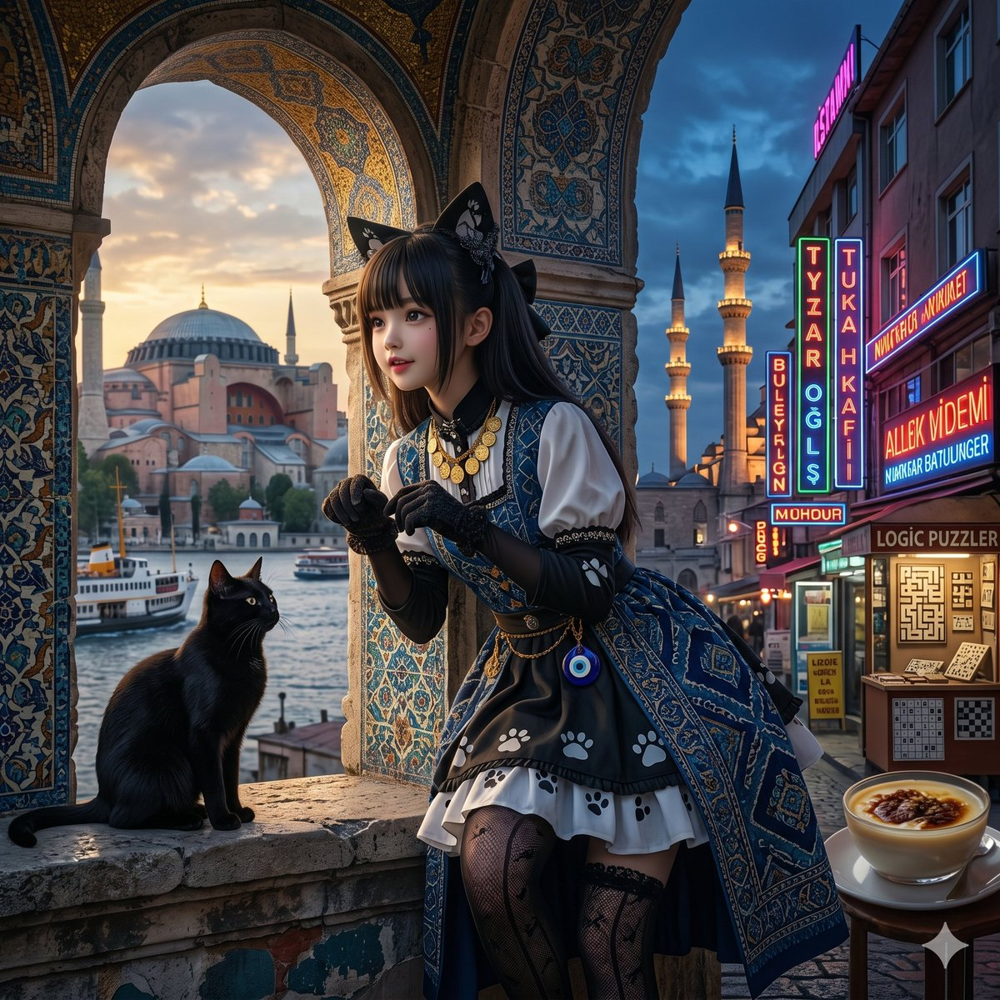

Prompt:

```text
{argument name="song title" default="Istanbul Mambo"} ({argument name="artist" default="Eiichi Ohtaki"})
```

### Nano Banana Pro Prompts #194: YouTube Thumbnail - Cinematic Podcast Studio Portrait

- Category: `Portrait`
- Model: `Nano Banana Pro`
- Author / Source: [Taaruk](https://github.com/YouMind-OpenLab/awesome-nano-banana-pro-prompts/blob/main/README.md)
- Image: `assets/imported/YouMind-OpenLab/awesome-nano-banana-pro-prompts/README-66-YouTube-Thumbnail-Cinematic-Podcast-Studio-Portrait.jpg`


Prompt:

```text
A professional {argument name="host description" default="podcast host sitting at a wooden desk in a modern studio setup"}, facing the camera with a confident and friendly expression. He is wearing a {argument name="clothing" default="fitted black shirt"} and sitting in a comfortable chair. A high-quality podcast microphone on a boom arm is positioned close to his mouth. On the desk are a notebook with handwritten notes, a coffee mug, and an audio interface with connected cables. The background features {argument name="background lighting" default="stylish indoor plants and warm red-orange accent lighting"}, creating a clean, cinematic studio atmosphere. Soft key lighting on the face, subtle rim lighting, shallow depth of field, ultra-realistic details, 50mm lens, f/1.8, professional color grading, high contrast, 8K, YouTube podcast aesthetic.
```

### Nano Banana Pro Prompts #195: YouTube Thumbnail - Japanese TV Program Style Image Generation

- Category: `Creative`
- Model: `Nano Banana Pro`
- Author / Source: [俺の娘たち / AIエンジニア](https://github.com/YouMind-OpenLab/awesome-nano-banana-pro-prompts/blob/main/README.md)
- Image: `assets/imported/YouMind-OpenLab/awesome-nano-banana-pro-prompts/README-67-YouTube-Thumbnail-Japanese-TV-Program-Style-Image-Generation.jpg`

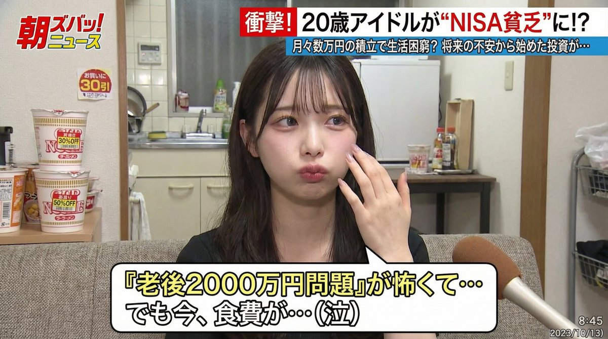

Prompt:

```text
Generate an image in the style of a Japanese TV program.
Let the AI consider the overall atmosphere of the image, including captions and interview content/answers associated with the following details:

{argument name="theme" default="NISA poverty. Morning news program. A 20-year-old female idol being interviewed at a woman's home."}
```

### Nano Banana Pro Prompts #196: YouTube Thumbnail - Cinematic Festival Photo of Millie Bobby Brown

- Category: `Portrait`
- Model: `Nano Banana Pro`
- Author / Source: [Giulia](https://github.com/YouMind-OpenLab/awesome-nano-banana-pro-prompts/blob/main/README.md)
- Image: `assets/imported/YouMind-OpenLab/awesome-nano-banana-pro-prompts/README-68-YouTube-Thumbnail-Cinematic-Festival-Photo-of-Millie-Bobby-Brown.jpg`

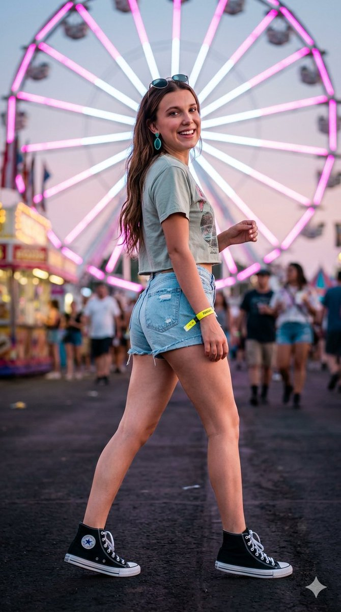

Prompt:

```text
"Create a highly detailed, cinematic, photorealistic lifestyle photograph of {argument name="subject" default="Millie Bobby Brown"} at an outdoor festival during early evening. She has long, slightly wavy hair and a playful expression, smiling with her teeth visible while looking back over her right shoulder directly at the camera. Her makeup is light and natural. She is wearing sunglasses resting on top of her head, large teal-colored drop-shaped earrings, and a bright yellow festival wristband on her right wrist.

She has a slim, fit body and is dressed in a light greenish-gray cropped short-sleeve t-shirt with a faded print on the front, paired with light blue ripped denim cut-off shorts. On her feet, she wears classic black high-top canvas sneakers with white laces, a white toe cap, and white soles.

Her pose is dynamic and confident: she is standing with her back facing the camera, her torso twisted as she looks over her right shoulder. Her right arm is slightly raised with a relaxed hand near her waist, while her left arm hangs naturally. Her weight is mostly on her extended left leg, with her right leg slightly bent, creating a casual and energetic posture.

The setting is a lively outdoor festival, resembling an amusement park. In the background, there is a large Ferris wheel illuminated with neon pink and white lights along its spokes and rim. Blurred figures of people walking can be seen in the background, and the ground appears dark, like a temporary paved surface.

The lighting combines soft dusk light with strong, cool artificial ambient light coming from the Ferris wheel. The neon lights create a glowing rim light around her hair, shoulders, and silhouette, while a soft front fill light clearly illuminates her face and body.

The overall mood is vibrant, youthful, energetic, and cinematic, capturing the lively atmosphere of a summer festival. The color palette emphasizes neon pink, bright white, light denim blue, greenish-gray, black, and soft pink tones.

The image should be captured in a portrait orientation (9:16), using a slightly low camera angle and a tight framing (medium close-up or American shot), with the subject occupying almost the entire frame. Use a telephoto lens between 85mm and 135mm to compress perspective and emphasize the subject, with a shallow depth of field to keep her extremely sharp while the background remains softly blurred with bokeh. The final result should be highly detailed, with sharp focus on the subject, vibrant and contrasting colors, professional lighting, and 8K resolution quality."
```

### Nano Banana Pro Prompts #197: YouTube Thumbnail - Cinematic Street Photography of Man Slipping on Banana Peel

- Category: `Video`
- Model: `Nano Banana Pro`
- Author / Source: [Taaruk](https://github.com/YouMind-OpenLab/awesome-nano-banana-pro-prompts/blob/main/README.md)
- Image: `assets/imported/YouMind-OpenLab/awesome-nano-banana-pro-prompts/README-69-YouTube-Thumbnail-Cinematic-Street-Photography-of-Man-Slipping-on-Banana-Peel.jpg`

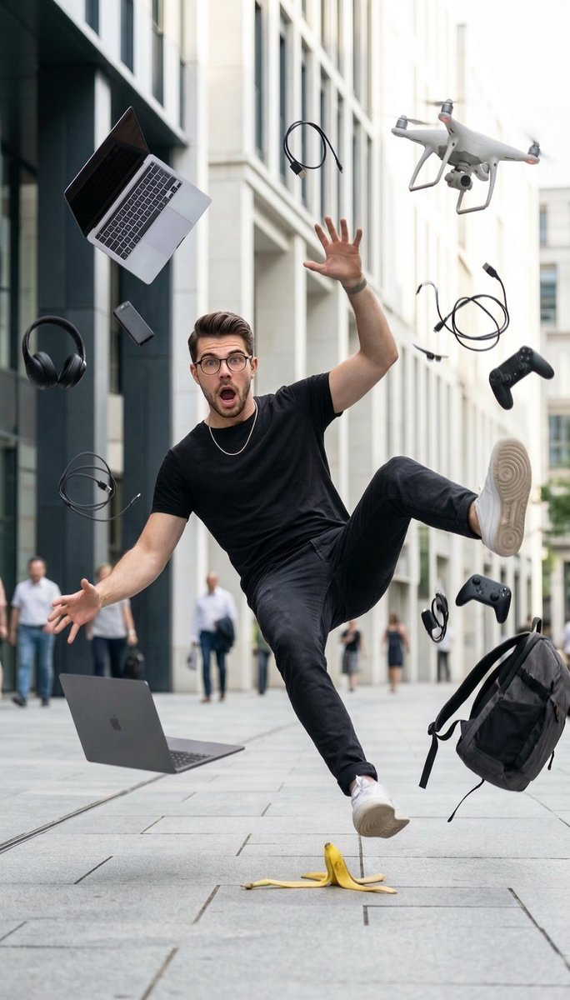

Prompt:

```text
Ultra-realistic cinematic street photography of a young man slipping on a banana peel in a modern city walkway, caught mid-air in a dramatic falling pose, shocked facial expression, arms flailing, everyday tech items (laptop, headphones, cables, smartphone, gaming controller, backpack, drone) floating and scattering around him in slow motion, urban background with tall buildings and pedestrians slightly blurred, natural daylight, motion freeze effect, high-speed photography, sharp focus on subject, depth of field, realistic shadows, 8K, photorealistic.
```

### Nano Banana Pro Prompts #198: YouTube Thumbnail - April Fool's Fake News Image Generation Prompt

- Category: `Creative`
- Model: `Nano Banana Pro`
- Author / Source: [SSSS.CRYPTOMAN⚡️AI](https://github.com/YouMind-OpenLab/awesome-nano-banana-pro-prompts/blob/main/README.md)
- Image: `assets/imported/YouMind-OpenLab/awesome-nano-banana-pro-prompts/README-70-YouTube-Thumbnail-April-Fool-s-Fake-News-Image-Generation-Prompt.jpg`

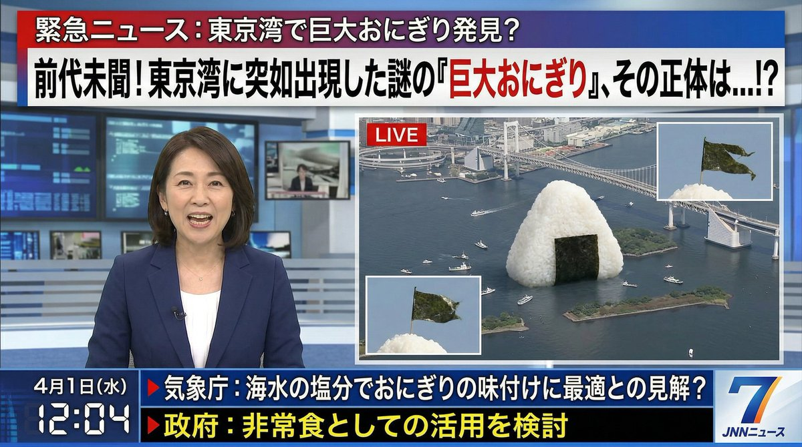

Prompt:

```text
Create a unique idea for April Fool's fake news. A capture of a Japanese TV news screen. Do not write the words 'April Fool's Day'. The date is April 1st.
```

### Nano Banana Pro Prompts #199: YouTube Thumbnail - Split Scene 'Before and After Payday' Prompt for Nano Banana Pro

- Category: `Video`
- Model: `Nano Banana Pro`
- Author / Source: [Memes](https://github.com/YouMind-OpenLab/awesome-nano-banana-pro-prompts/blob/main/README.md)
- Image: `assets/imported/YouMind-OpenLab/awesome-nano-banana-pro-prompts/README-71-YouTube-Thumbnail-Split-Scene-Before-and-After-Payday-Prompt-for-Nano-Banana-Pro.jpg`

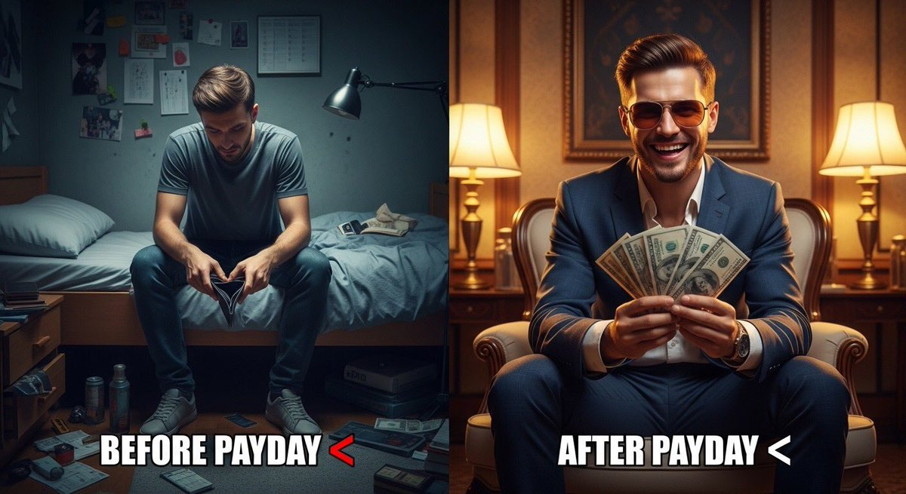

Prompt:

```text
Ultra-realistic split scene of a young man. Left side: sitting on a bed in a small messy room, tired face, empty wallet, dim lighting, depressed mood. Right side: same man after payday, wearing stylish clothes and sunglasses, holding cash, confident smile, bright lighting, luxury background. Add bold meme text: “{argument name="meme text 1" default="Before Payday "}” and “{argument name="meme text 2" default="After Payday "}”. Cinematic lighting, 8K realism, sharp details, viral social media style.
```

### Nano Banana Pro Prompts #200: YouTube Thumbnail - Cinematic Hollywood-Style Street Market Walk

- Category: `Video`
- Model: `Nano Banana Pro`
- Author / Source: [Nikhil](https://github.com/YouMind-OpenLab/awesome-nano-banana-pro-prompts/blob/main/README.md)
- Image: `assets/imported/YouMind-OpenLab/awesome-nano-banana-pro-prompts/README-72-YouTube-Thumbnail-Cinematic-Hollywood-Style-Street-Market-Walk.jpg`

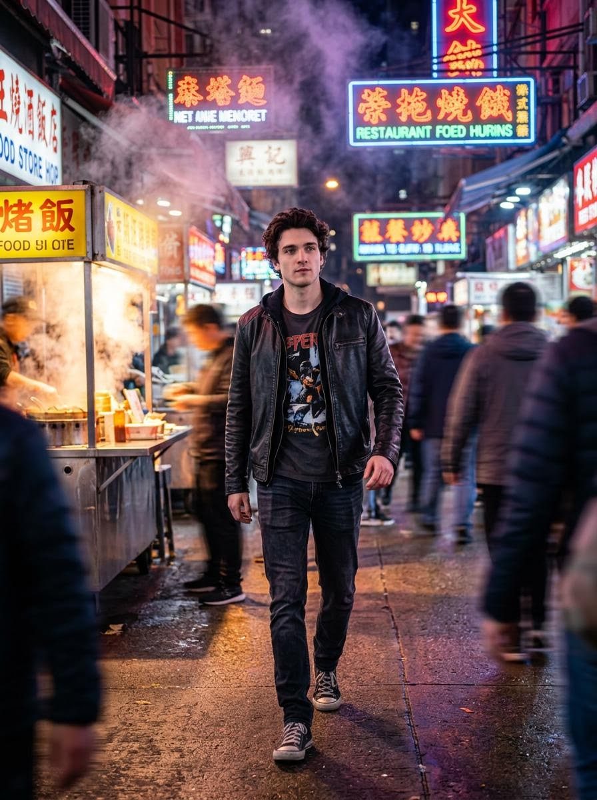

Prompt:

```text
Create a highly cinematic, Hollywood-style photo of a person using the face from the uploaded image. The person is walking confidently through a busy street market at night filled with colorful lights, neon signs, and glowing stalls. The camera captures a mid-shot from slightly low angle, giving a powerful and dramatic feel. People around are moving in motion blur, creating a sense of energy and chaos, while the main person is sharp and in focus. Warm and cool lights mix together, reflecting on the ground and surroundings. Light smoke and atmosphere enhance the depth of the scene. The person is wearing stylish modern clothing like a jacket, t-shirt, jeans, and sneakers. Cinematic lighting, dramatic contrast, vibrant colors, shallow depth of field, ultra realistic, movie-scene composition, 8k, Hollywood film look.
```

### Nano Banana Pro Prompts #201: Comic / Storyboard - Semi-Realistic Digital Illustration Concept Art

- Category: `Product`
- Model: `Nano Banana Pro`
- Author / Source: [zayan](https://github.com/YouMind-OpenLab/awesome-nano-banana-pro-prompts/blob/main/README.md)
- Image: `assets/imported/YouMind-OpenLab/awesome-nano-banana-pro-prompts/README-73-Comic-Storyboard-Semi-Realistic-Digital-Illustration-Concept-Art.jpg`

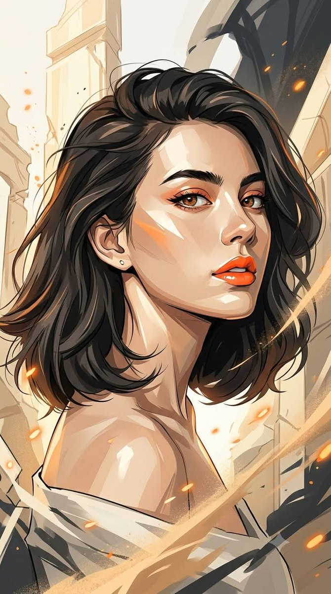

Prompt:

```text
Using 100% likeness of (reference) objects, transformed into a {argument name="style" default="dynamic, semi-realistic digital illustration style"} with a cinematic concept art aesthetic, combining sharp anime-inspired rendering and high-end game splash art. Strong, angular brushstrokes with confident hand-painted strokes, clean yet expressive line accents, and artistic layered shading. High-contrast lighting with bright warm highlights and deep neutral shadows, creating dramatic depth and intensity. The color palette is dominated by {argument name="colors" default="warm ivory, soft beige, sand, light gray, charcoal, and bright orange"} as the main accents, with subtle black details. Smooth gradient transitions mixed with sharp edge highlights, realistic material rendering for metal, fabric, and hard surfaces. Energetic composition, {argument name="detail level" default="highly detailed textures"}, bold and smooth silhouettes. No text, no logo, no watermark. AR 9:16.
```

### Nano Banana Pro Prompts #202: Comic / Storyboard - Futuristic Ring Megacity Concept Art

- Category: `Product`
- Model: `Nano Banana Pro`
- Author / Source: [Delinitor](https://github.com/YouMind-OpenLab/awesome-nano-banana-pro-prompts/blob/main/README.md)
- Image: `assets/imported/YouMind-OpenLab/awesome-nano-banana-pro-prompts/README-74-Comic-Storyboard-Futuristic-Ring-Megacity-Concept-Art.jpg`

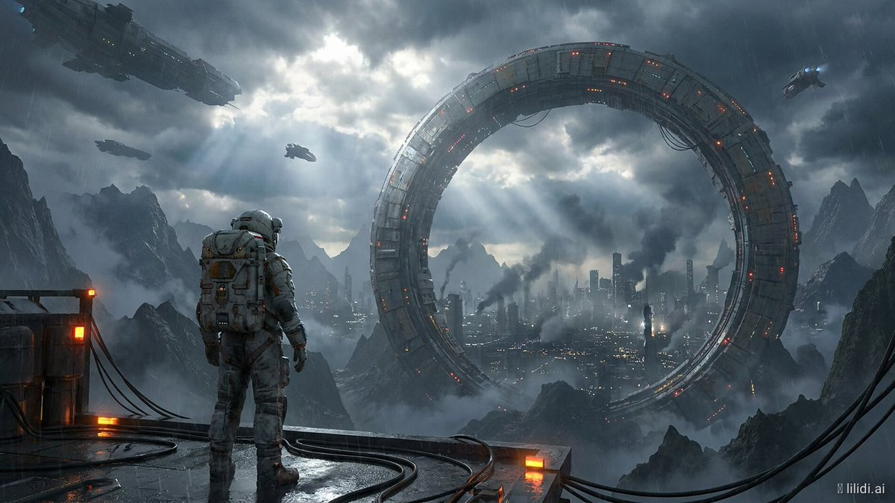

Prompt:

```text
An immense futuristic megacity built inside a colossal {argument name="structure type" default="circular ring megastructure"} embedded in a {argument name="landscape" default="rocky alien landscape"}. The ring dominates the skyline, thousands of meters tall, covered in intricate industrial panels, docking bays, glowing maintenance lights, and weathered metallic textures. Massive capital spacecraft, carriers, and smaller shuttles drift through storm-filled skies around the structure.

In the foreground, a {argument name="foreground subject" default="lone astronaut"} in a detailed hard-surface EVA suit stands on a rain-soaked industrial platform overlooking the city, creating a strong sense of scale. The platform features reflective wet metal, cables, antennas, pipes, illuminated landing pads, and cinematic puddles.

The city below is an incredibly dense cyber-industrial metropolis with towering spires, endless buildings, atmospheric haze, smoke plumes, volumetric fog, and millions of tiny lights stretching into the distance.

Dramatic overcast sky with towering storm clouds breaking apart to reveal shafts of sunlight piercing through, creating powerful volumetric god rays that illuminate the gigantic ring and city. Cold blue-gray color palette with subtle orange industrial lighting.

Hyper-realistic hard-surface science fiction architecture inspired by advanced space civilizations. Massive sense of scale, epic cinematic composition, ultra-detailed greebles, physically based materials, weathering, atmospheric perspective, realistic reflections, depth, high dynamic range lighting.

Camera: wide-angle 24mm lens, low elevated viewpoint behind the astronaut, centered composition with the ring framing the city, deep depth of field.

Rendering style: photorealistic cinematic concept art, Unreal Engine 5 quality, Octane Render, ray-traced global illumination, volumetric lighting, HDR, physically accurate materials, 16K detail, razor-sharp focus, extreme environmental storytelling, masterpiece, award-winning sci-fi artwork.

Negative Prompt:

> cartoon, anime, low detail, low poly, blurry, soft focus, oversaturated, flat lighting, simple geometry, empty scene, low resolution, noisy, duplicated ships, distorted architecture, warped perspective, text, logo, watermark, people in foreground besides astronaut.
```

### Nano Banana Pro Prompts #203: Comic / Storyboard - Minimal Flat Javanese Animation

- Category: `Portrait`
- Model: `Nano Banana Pro`
- Author / Source: [DΞV](https://github.com/YouMind-OpenLab/awesome-nano-banana-pro-prompts/blob/main/README.md)
- Image: `assets/imported/YouMind-OpenLab/awesome-nano-banana-pro-prompts/README-75-Comic-Storyboard-Minimal-Flat-Javanese-Animation.jpg`

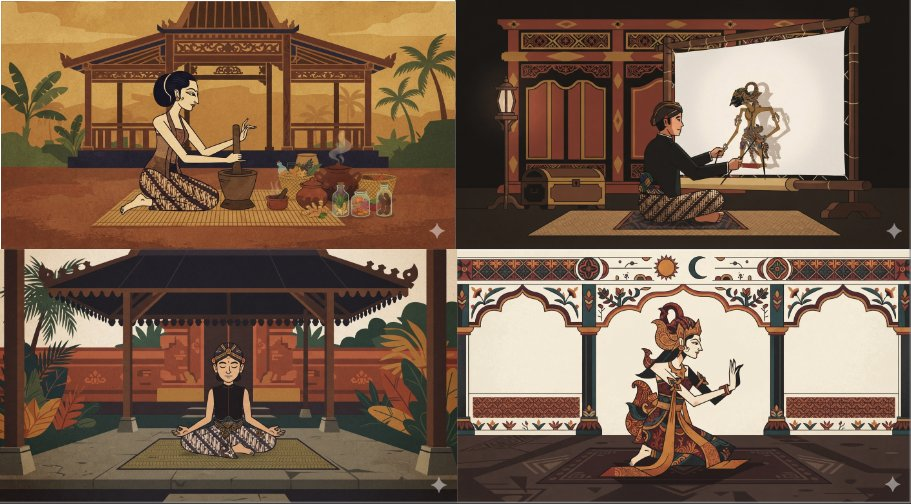

Prompt:

```text
a minimal flat animated scene of {argument name="subject" default="something neutral but interesting"}, {argument name="character count" default="a single character"}, pick an unusual animation style and palette. {argument name="art style" default="Javanese style"}.
```

### Nano Banana Pro Prompts #204: Comic / Storyboard - Vampire Knight Sunlight Exposure

- Category: `Creative`
- Model: `Nano Banana Pro`
- Author / Source: [Sparkful](https://github.com/YouMind-OpenLab/awesome-nano-banana-pro-prompts/blob/main/README.md)
- Image: `assets/imported/YouMind-OpenLab/awesome-nano-banana-pro-prompts/README-76-Comic-Storyboard-Vampire-Knight-Sunlight-Exposure.jpg`

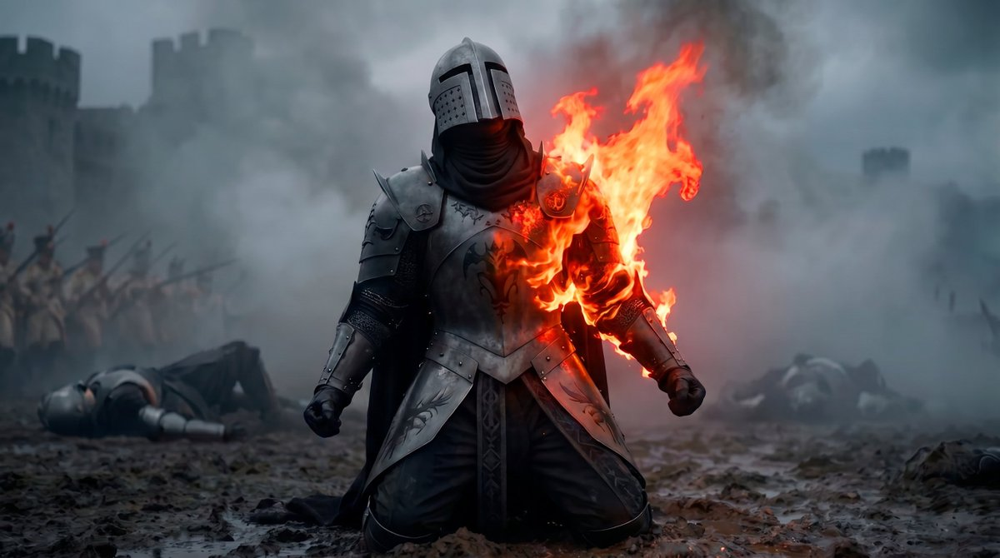

Prompt:

```text
A {argument name="subject" default="vampire knight"}, {argument name="location" default="Castle Dracula"} defender burning up from sunlight. Heavy cloak can't block out the sun completely!
```

### Nano Banana Pro Prompts #205: Comic / Storyboard - Fantasy Game Character Warrior Jo

- Category: `Portrait`
- Model: `Nano Banana Pro`
- Author / Source: [Julia Clark](https://github.com/YouMind-OpenLab/awesome-nano-banana-pro-prompts/blob/main/README.md)
- Image: `assets/imported/YouMind-OpenLab/awesome-nano-banana-pro-prompts/README-77-Comic-Storyboard-Fantasy-Game-Character-Warrior-Jo.jpg`

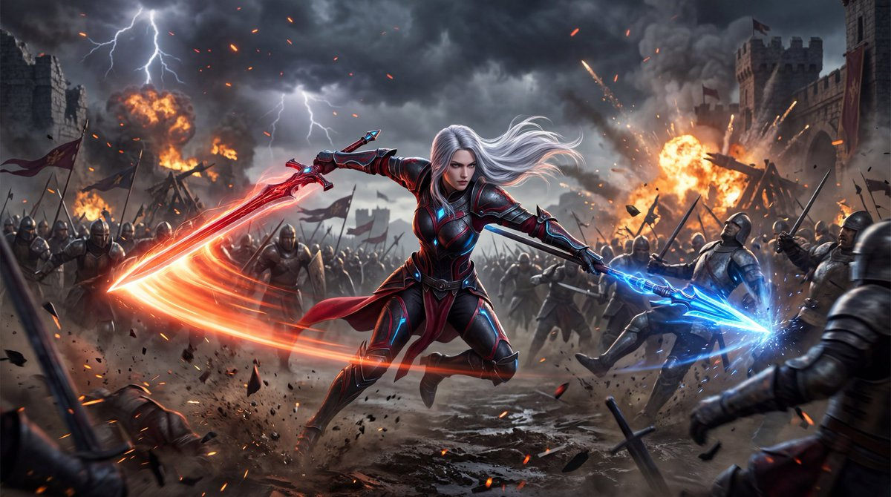

Prompt:

```text
Create an ultra-realistic 8K cinematic fantasy game character named Jo, a fearless female warrior and legendary role model. She stands confidently on top of a rocky battlefield during a dramatic sunset, wearing black and crimson battle armor with glowing blue energy lines. Her long silver hair flows in the wind, and her determined expression radiates courage and leadership. She holds a {argument name="weapon one" default="massive enchanted sword"} in one hand and a {argument name="weapon two" default="futuristic energy spear"} in the other. Behind her stands a disciplined army of elite warriors carrying banners, shields, swords, and glowing weapons, stretching across the battlefield. The sky is filled with storm clouds, smoke, sparks, and rays of sunlight breaking through. Epic cinematic lighting, volumetric fog, flying embers, highly detailed armor, realistic textures, Unreal Engine 5 quality, AAA game concept art, dynamic composition, ultra-sharp focus, dramatic atmosphere, powerful female commander, no text, no watermark, 16:9.

Create an ultra-realistic 8K cinematic AAA game action scene featuring the exact same female warrior "Jo" from the previous image. Maintain 100% character consistency: same face, same silver-white long flowing hair, same facial features, same body proportions, same black and crimson armor with glowing blue energy accents, same enchanted crimson greatsword in her right hand, same futuristic blue energy spear in her left hand, identical design, colors, accessories, and overall appearance. Jo is in the middle of an intense battlefield, fearlessly charging toward thousands of enemy warriors. She is performing a powerful attack while swinging her glowing crimson sword and simultaneously thrusting her blue energy spear. Enemy soldiers are being pushed back by the force of her attack. Massive explosions, magical shockwaves, flying sparks, shattered weapons, smoke, dust, burning siege machines, collapsing structures, and glowing energy trails fill the battlefield. Behind Jo, her loyal army advances forward under her leadership while enemy forces surround them from every direction. The sky is dark with storm clouds, lightning, fire, and flying embers, creating an epic war atmosphere. Use a dramatic low-angle cinematic camera, dynamic action pose, intense determined facial expression, realistic motion blur, volumetric lighting, god rays, ultra-detailed armor textures, realistic physics for hair and cape, Unreal Engine 5 quality, hyper-realistic, AAA game cinematic, epic fantasy war, maximum detail, no blood, no gore, no text, no watermark, 16:9 aspect ratio. The character must look exactly like the first image with no changes to her appearance.
```

### Nano Banana Pro Prompts #206: Comic / Storyboard - Gothicpunk Ritual in Necropolis

- Category: `Creative`
- Model: `Nano Banana Pro`
- Author / Source: [sayobonita](https://github.com/YouMind-OpenLab/awesome-nano-banana-pro-prompts/blob/main/README.md)
- Image: `assets/imported/YouMind-OpenLab/awesome-nano-banana-pro-prompts/README-78-Comic-Storyboard-Gothicpunk-Ritual-in-Necropolis.png`

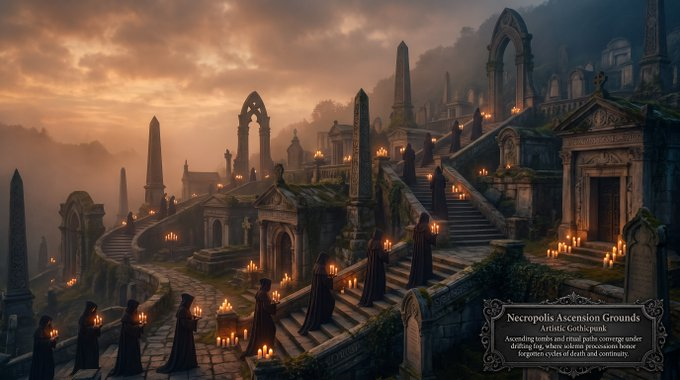

Prompt:

```text
Depiction of a {argument name="ritual" default="ritual"} in {argument name="location" default="necropolis ascension grounds"} in an artistic {argument name="style" default="gothicpunk"} style.
```

### Nano Banana Pro Prompts #207: Comic / Storyboard - Ancient King's Return to Abandoned Kingdom

- Category: `Creative`
- Model: `Nano Banana Pro`
- Author / Source: [Nas](https://github.com/YouMind-OpenLab/awesome-nano-banana-pro-prompts/blob/main/README.md)
- Image: `assets/imported/YouMind-OpenLab/awesome-nano-banana-pro-prompts/README-79-Comic-Storyboard-Ancient-King-s-Return-to-Abandoned-Kingdom.jpg`

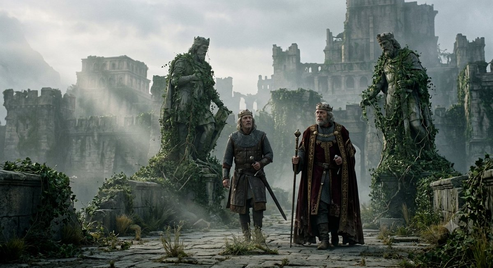

Prompt:

```text
{
  "title": "{argument name="title" default="The King Returns"}",
  "image_description": "{argument name="image description" default="An ancient king walks into his abandoned kingdom after 1000 years. Giant statues are broken and covered with vines."}",
  "setting": {
    "location": "Forgotten Kingdom",
    "weather": "Morning Mist"
  },
  "mood": ["Historical", "Epic", "Melancholic"],
  "style": "{argument name="style" default="Ridley Scott inspired historical cinema"}"
}
```

### Nano Banana Pro Prompts #208: Comic / Storyboard - Multi-Expression Emotional Portrait Series

- Category: `Portrait`
- Model: `Nano Banana Pro`
- Author / Source: [Minahil](https://github.com/YouMind-OpenLab/awesome-nano-banana-pro-prompts/blob/main/README.md)
- Image: `assets/imported/YouMind-OpenLab/awesome-nano-banana-pro-prompts/README-80-Comic-Storyboard-Multi-Expression-Emotional-Portrait-Series.jpg`

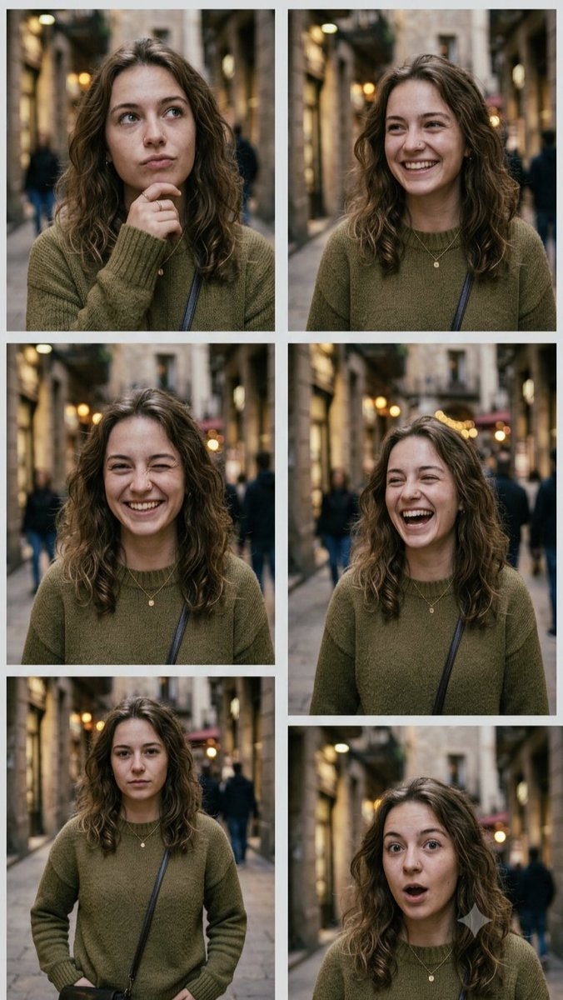

Prompt:

```text
A high-quality, cinematic portrait series featuring a young woman with {argument name="hair style" default="wavy brown hair"}, wearing a {argument name="clothing" default="green knit sweater"} and a {argument name="accessory" default="small gold necklace"}. The image is a multi-panel collage capturing a variety of candid, authentic emotional expressions in an {argument name="setting" default="urban street setting"} with a softly blurred background. The composition includes distinct frames showing the subject in different moods: one thoughtfully touching her chin, one smiling warmly, one winking playfully, one laughing heartily, one looking directly at the camera with a neutral expression, and one appearing surprised with a slightly open mouth. The overall aesthetic is warm, natural, and lifestyle-oriented, maintaining consistent lighting and professional color grading across all panels to evoke a polished, editorial feel.
```

## Seedream 4.5 Prompts

- Entries: 105
- With images: 105

### Seedream 4.5 Prompts #1: Fun Educational Children's Science Fair Poster

- Category: `Poster`
- Model: `Seedream`
- Author / Source: [Jared Liu](https://github.com/YouMind-OpenLab/awesome-seedream-4.5/blob/main/README.md)
- Image: `assets/imported/YouMind-OpenLab/awesome-seedream-4.5/README-1-Fun-Educational-Children-s-Science-Fair-Poster.png`


Prompt:

```text
A fun and educational poster for a children’s science fair. The design is a colorful cartoon illustration featuring kids dressed as scientists, looking at bubbling beakers, telescopes, and robots. The typography is playful and kid-friendly. The poster should make science look exciting and accessible, encouraging kids to participate. –ar 2:3
```

### Seedream 4.5 Prompts #2: Trendy Fashion Sale Poster

- Category: `Poster`
- Model: `Seedream`
- Author / Source: [Jared Liu](https://github.com/YouMind-OpenLab/awesome-seedream-4.5/blob/main/README.md)
- Image: `assets/imported/YouMind-OpenLab/awesome-seedream-4.5/README-2-Trendy-Fashion-Sale-Poster.png`


Prompt:

```text
A trendy and eye-catching poster for a fashion store’s end-of-season sale. The design uses bold, vibrant colors and modern, edgy typography. The main visual is a stylish model wearing clothes from the store, but the image is creatively treated with paint strokes or collage elements. The text “50% OFF EVERYTHING” is the most prominent element. The poster should create a sense of urgency and excitement. –ar 3:4
```

### Seedream 4.5 Prompts #3: Effective 'Lost Cat' Flyer

- Category: `Creative`
- Model: `Seedream`
- Author / Source: [Jared Liu](https://github.com/YouMind-OpenLab/awesome-seedream-4.5/blob/main/README.md)
- Image: `assets/imported/YouMind-OpenLab/awesome-seedream-4.5/README-3-Effective-Lost-Cat-Flyer.png`

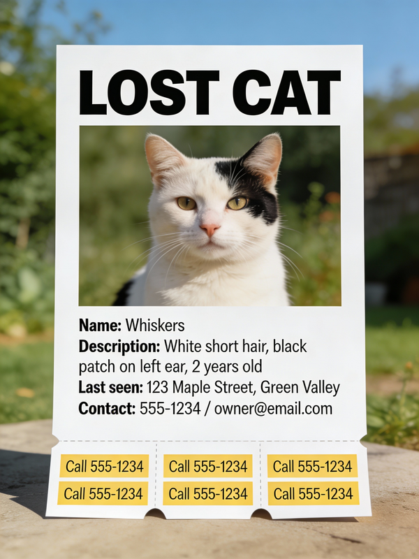

Prompt:

```text
An effective and clear “Lost Cat” flyer. The design is simple and functional. It features a large, clear, color photograph of the cat at the top. The headline “LOST CAT” is in a very large, bold, and easy-to-read font. Below the photo are the cat’s name, description, last seen location, and the owner’s contact information with tear-off tabs at the bottom. This demonstrates the ability to create practical, real-world designs. –ar 3:4
```

### Seedream 4.5 Prompts #4: Informative Climate Change Seminar Poster

- Category: `Poster`
- Model: `Seedream`
- Author / Source: [Jared Liu](https://github.com/YouMind-OpenLab/awesome-seedream-4.5/blob/main/README.md)
- Image: `assets/imported/YouMind-OpenLab/awesome-seedream-4.5/README-4-Informative-Climate-Change-Seminar-Poster.png`


Prompt:

```text
An informative and engaging poster for a public seminar on climate change. The poster is designed as a mini-infographic, with a large, central graphic showing the earth with a thermometer, and smaller icons and data points around it explaining the causes and effects. The design is clean, organized, and aims to educate the viewer quickly and effectively. –ar 3:4
```

### Seedream 4.5 Prompts #5: Sleek Minimalist Wireless Headphone Ad

- Category: `Product`
- Model: `Seedream`
- Author / Source: [Jared Liu](https://github.com/YouMind-OpenLab/awesome-seedream-4.5/blob/main/README.md)
- Image: `assets/imported/YouMind-OpenLab/awesome-seedream-4.5/README-5-Sleek-Minimalist-Wireless-Headphone-Ad.png`


Prompt:

```text
A sleek and minimalist poster advertisement for a new high-tech wireless headphone. The poster features a stunning, high-resolution 3D render of the headphone, seemingly floating in a zero-gravity environment. The background is a simple, clean gradient. The only text is the brand name and the product slogan: “Unleash Your Sound.” The design is modern, sophisticated, and focuses entirely on the product’s beauty. –ar 2:3
```

### Seedream 4.5 Prompts #6: Energetic 5K Charity Run Poster

- Category: `Poster`
- Model: `Seedream`
- Author / Source: [Jared Liu](https://github.com/YouMind-OpenLab/awesome-seedream-4.5/blob/main/README.md)
- Image: `assets/imported/YouMind-OpenLab/awesome-seedream-4.5/README-6-Energetic-5K-Charity-Run-Poster.png`

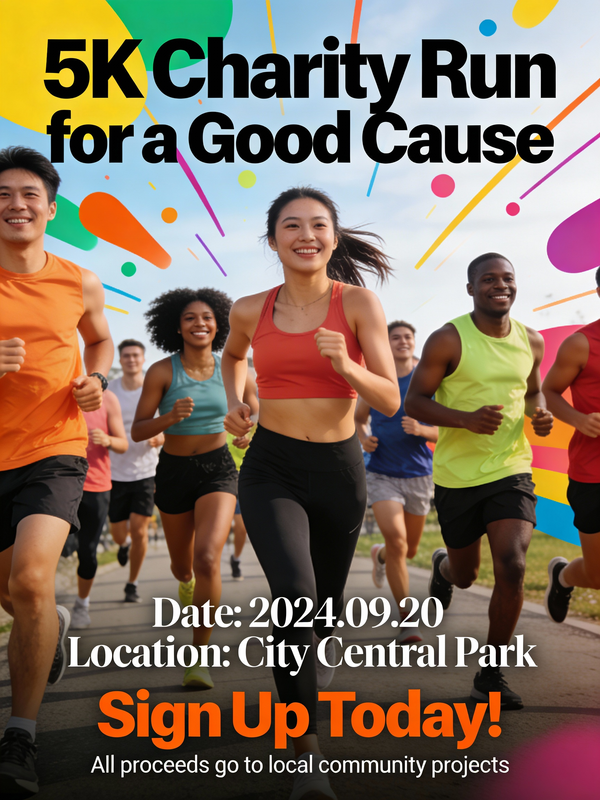

Prompt:

```text
An energetic and motivational poster for a 5K charity run for a good cause. The design features a dynamic photograph of a diverse group of people running, with smiles on their faces. The background has abstract, colorful shapes and lines that suggest movement and energy. The event details are clear and easy to read. The poster should be inspiring and encourage people to sign up. –ar 3:4
```

### Seedream 4.5 Prompts #7: Dramatic Minimalist Hamlet Poster

- Category: `Product`
- Model: `Seedream`
- Author / Source: [Jared Liu](https://github.com/YouMind-OpenLab/awesome-seedream-4.5/blob/main/README.md)
- Image: `assets/imported/YouMind-OpenLab/awesome-seedream-4.5/README-7-Dramatic-Minimalist-Hamlet-Poster.png`


Prompt:

```text
A dramatic and minimalist poster for a production of Shakespeare’s “Hamlet”. The design features a single, powerful image: a human skull with a golden crown resting on it, against a stark black background. The title “HAMLET” is in a classic, sharp serif font, with the letters slightly decaying. The design is symbolic, modern, and full of gravitas. –ar 2:3
```

### Seedream 4.5 Prompts #8: Charming Rustic Farmers Market Poster

- Category: `Poster`
- Model: `Seedream`
- Author / Source: [Jared Liu](https://github.com/YouMind-OpenLab/awesome-seedream-4.5/blob/main/README.md)
- Image: `assets/imported/YouMind-OpenLab/awesome-seedream-4.5/README-8-Charming-Rustic-Farmers-Market-Poster.png`

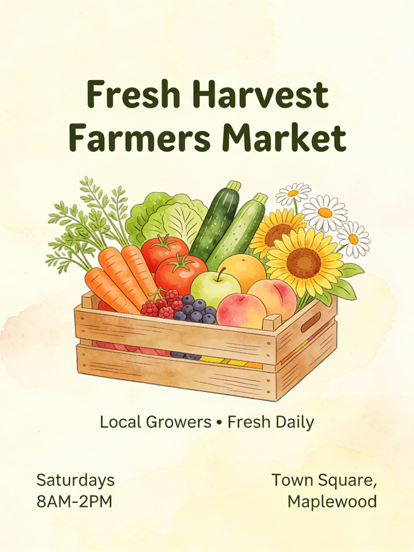

Prompt:

```text
A charming and rustic poster for a local farmers market. The design is an illustration in a friendly, hand-drawn style, featuring a bounty of fresh vegetables, fruits, and flowers in a wooden crate. The typography is a friendly, rounded sans-serif. The poster should feel wholesome, local, and community-oriented. –ar 3:4
```

### Seedream 4.5 Prompts #9: Quirky Independent Short Film Festival Poster

- Category: `Poster`
- Model: `Seedream`
- Author / Source: [Jared Liu](https://github.com/YouMind-OpenLab/awesome-seedream-4.5/blob/main/README.md)
- Image: `assets/imported/YouMind-OpenLab/awesome-seedream-4.5/README-9-Quirky-Independent-Short-Film-Festival-Poster.png`


Prompt:

```text
A quirky and independent-style poster for a short film festival. The design is a collage of hand-drawn doodles, film strips, and vintage photographs. The typography is a mix of different typewriter and handwritten fonts, giving it a DIY, zine-like feel. The color palette is limited and has a retro vibe. The poster should look creative, unconventional, and appeal to an arthouse audience. –ar 2:3
```

### Seedream 4.5 Prompts #10: Serene Yoga & Meditation Workshop Poster

- Category: `Poster`
- Model: `Seedream`
- Author / Source: [Jared Liu](https://github.com/YouMind-OpenLab/awesome-seedream-4.5/blob/main/README.md)
- Image: `assets/imported/YouMind-OpenLab/awesome-seedream-4.5/README-10-Serene-Yoga-Meditation-Workshop-Poster.png`

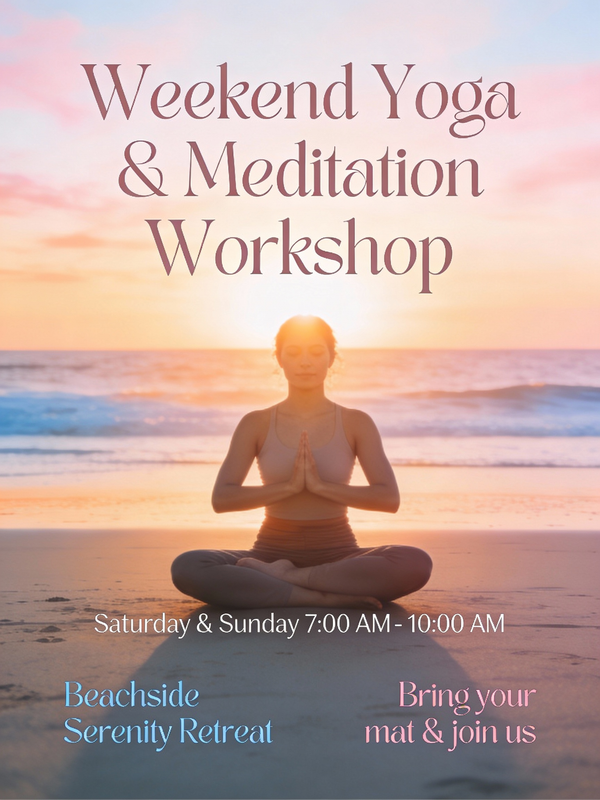

Prompt:

```text
A serene and calming poster for a weekend yoga and meditation workshop. The main visual is a beautiful, soft-focus photograph of a person in a peaceful yoga pose on a beach at sunrise. The color palette is soft pastels (pinks, oranges, light blues). The typography is a gentle, flowing script. The poster should evoke feelings of peace, wellness, and self-care. –ar 3:4
```

### Seedream 4.5 Prompts #11: Italian Restaurant Grand Opening Flyer

- Category: `Creative`
- Model: `Seedream`
- Author / Source: [Jared Liu](https://github.com/YouMind-OpenLab/awesome-seedream-4.5/blob/main/README.md)
- Image: `assets/imported/YouMind-OpenLab/awesome-seedream-4.5/README-11-Italian-Restaurant-Grand-Opening-Flyer.png`

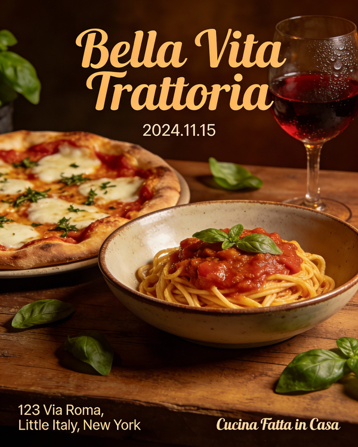

Prompt:

```text
A delicious and inviting flyer for the grand opening of a new Italian restaurant. The main visual is a beautiful, rustic flat-lay photograph of a table laden with Italian food: a pizza, a bowl of pasta, a glass of red wine, and some fresh basil. The restaurant’s name is in a warm, handwritten script font. The date and address of the opening are clearly visible. The overall feel is warm, authentic, and appetizing. –ar 4:5
```

### Seedream 4.5 Prompts #12: Plastic Pollution PSA Poster

- Category: `Poster`
- Model: `Seedream`
- Author / Source: [Jared Liu](https://github.com/YouMind-OpenLab/awesome-seedream-4.5/blob/main/README.md)
- Image: `assets/imported/YouMind-OpenLab/awesome-seedream-4.5/README-12-Plastic-Pollution-PSA-Poster.png`


Prompt:

```text
A powerful and thought-provoking poster for a public service announcement about plastic pollution in the oceans. The image is a surreal and sad depiction of a sea turtle swimming through a sea of plastic bags and bottles, instead of water. The tagline “Is this the ocean you want?” is at the bottom. The visual should be realistic and impactful, designed to evoke an emotional response and raise awareness. –ar 3:4
```

### Seedream 4.5 Prompts #13: Crime Novel Book Cover "The Shadow Detective"

- Category: `Creative`
- Model: `Seedream`
- Author / Source: [Jared Liu](https://github.com/YouMind-OpenLab/awesome-seedream-4.5/blob/main/README.md)
- Image: `assets/imported/YouMind-OpenLab/awesome-seedream-4.5/README-13-Crime-Novel-Book-Cover-The-Shadow-Detective.png`


Prompt:

```text
A thrilling and mysterious book cover for a crime novel titled “The Shadow Detective”. The cover features a silhouette of a detective in a fedora and trench coat, standing in a dark, foggy alleyway. The only light source is a single, distant streetlamp. The title is in a gritty, textured font that looks like it was stamped on. The mood is noir and full of suspense, demonstrating strong atmospheric control. –ar 2:3
```

### Seedream 4.5 Prompts #14: Japanese Ukiyo-e Museum Poster

- Category: `Poster`
- Model: `Seedream`
- Author / Source: [Jared Liu](https://github.com/YouMind-OpenLab/awesome-seedream-4.5/blob/main/README.md)
- Image: `assets/imported/YouMind-OpenLab/awesome-seedream-4.5/README-14-Japanese-Ukiyo-e-Museum-Poster.png`

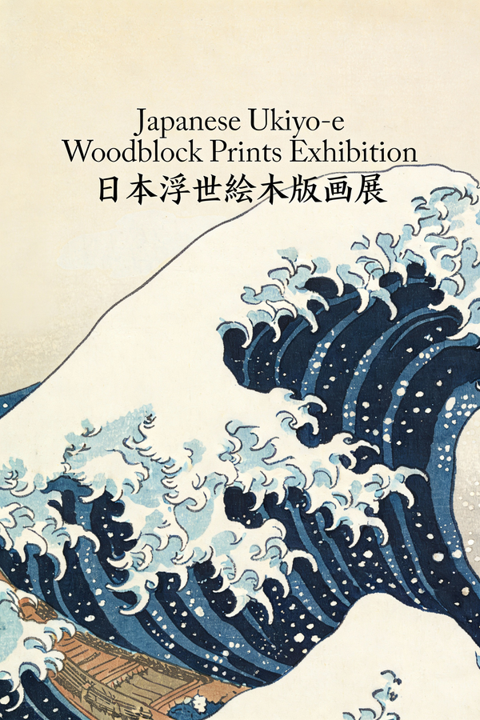

Prompt:

```text
An elegant and artistic poster for a museum exhibition of Japanese Ukiyo-e woodblock prints. The design features a beautiful, high-resolution detail from a famous print, like Hokusai’s “The Great Wave,” but creatively cropped. The typography is a mix of an elegant English serif font and Japanese calligraphy. The layout is minimalist and respectful of the artwork, using a lot of negative space. This showcases knowledge of art history and sophisticated graphic design skills. –ar 2:3
```

### Seedream 4.5 Prompts #15: Software Developer Recruitment Flyer

- Category: `Product`
- Model: `Seedream`
- Author / Source: [Jared Liu](https://github.com/YouMind-OpenLab/awesome-seedream-4.5/blob/main/README.md)
- Image: `assets/imported/YouMind-OpenLab/awesome-seedream-4.5/README-15-Software-Developer-Recruitment-Flyer.png`


Prompt:

```text
A bold and direct recruitment flyer for a startup looking for software developers. The headline “BUILD THE FUTURE” is in a large, strong, sans-serif font. The main visual is an abstract, stylized illustration of code turning into a growing city skyline. The company logo and a QR code to the application page are prominently displayed at the bottom. The color palette is energetic and tech-oriented (e.g., electric blue and dark gray). –ar 3:4
```

### Seedream 4.5 Prompts #16: Psychedelic Music Festival Poster "Ethereal Bloom"

- Category: `Poster`
- Model: `Seedream`
- Author / Source: [Jared Liu](https://github.com/YouMind-OpenLab/awesome-seedream-4.5/blob/main/README.md)
- Image: `assets/imported/YouMind-OpenLab/awesome-seedream-4.5/README-16-Psychedelic-Music-Festival-Poster-Ethereal-Bloom.png`

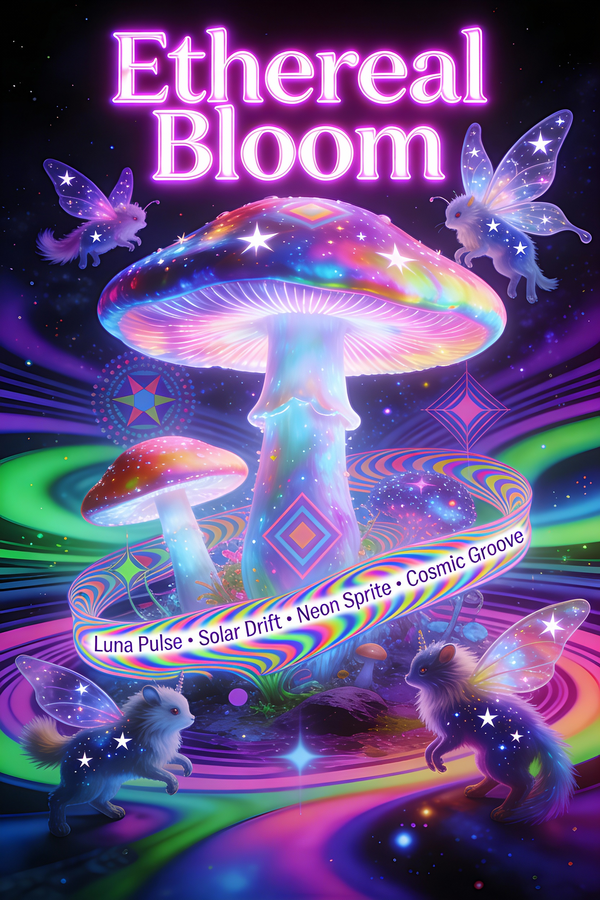

Prompt:

```text
A vibrant, psychedelic poster for a summer music festival called “Ethereal Bloom”. The design is a surreal explosion of color, featuring giant, glowing mushrooms, whimsical fantasy creatures, and abstract geometric patterns all intertwined. The festival lineup is integrated into the artwork in a wavy, distorted font. The overall mood is magical, energetic, and otherworldly, showcasing the ability to create complex, imaginative, and genre-specific visuals. –ar 2:3
```

### Seedream 4.5 Prompts #17: Cinematic Sci-Fi Movie Poster "CHRONOS"

- Category: `Poster`
- Model: `Seedream`
- Author / Source: [Jared Liu](https://github.com/YouMind-OpenLab/awesome-seedream-4.5/blob/main/README.md)
- Image: `assets/imported/YouMind-OpenLab/awesome-seedream-4.5/README-17-Cinematic-Sci-Fi-Movie-Poster-CHRONOS.png`

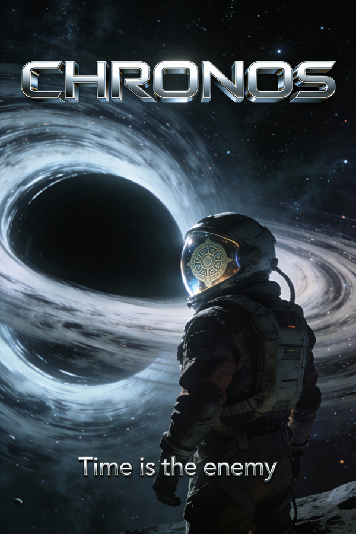

Prompt:

```text
A cinematic, epic movie poster for a fictional sci-fi blockbuster titled “CHRONOS”. The poster features the main hero, a rugged astronaut, looking out at a massive, swirling black hole in space. The reflection of a mysterious alien artifact is visible in his helmet visor. The typography is bold, metallic, and modern. The tagline “Time is the enemy” is positioned at the bottom. This requires advanced cinematic lighting, composition, and the ability to blend multiple complex elements seamlessly. –ar 2:3
```

### Seedream 4.5 Prompts #18: Website Building Tutorial Thumbnail

- Category: `Creative`
- Model: `Seedream`
- Author / Source: [Jared Liu](https://github.com/YouMind-OpenLab/awesome-seedream-4.5/blob/main/README.md)
- Image: `assets/imported/YouMind-OpenLab/awesome-seedream-4.5/README-18-Website-Building-Tutorial-Thumbnail.png`


Prompt:

```text
A thumbnail for a tutorial on “How to Build a Website in 10 Minutes.” The image shows a computer screen with a beautiful, professional-looking website on it. A large clock icon showing “10 Min” is overlaid on the screen. The YouTuber is in the corner, pointing to the screen and smiling, looking confident and helpful. The text is clear and promises a quick, easy solution. –ar 16:9
```

### Seedream 4.5 Prompts #19: Vending Machine Food Challenge Thumbnail

- Category: `Creative`
- Model: `Seedream`
- Author / Source: [Jared Liu](https://github.com/YouMind-OpenLab/awesome-seedream-4.5/blob/main/README.md)
- Image: `assets/imported/YouMind-OpenLab/awesome-seedream-4.5/README-19-Vending-Machine-Food-Challenge-Thumbnail.png`

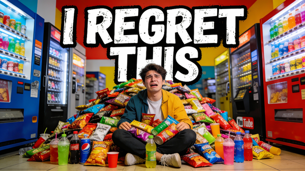

Prompt:

```text
A thumbnail for an “Eating Only Vending Machine Food for 24 Hours” challenge. The image shows the YouTuber sitting on the floor, surrounded by a huge pile of colorful snacks and drinks from vending machines. They have a pained but funny expression on their face. The text “I REGRET THIS” is in a bold, distressed font. –ar 16:9
```

### Seedream 4.5 Prompts #20: Prank Video Thumbnail

- Category: `Video`
- Model: `Seedream`
- Author / Source: [Jared Liu](https://github.com/YouMind-OpenLab/awesome-seedream-4.5/blob/main/README.md)
- Image: `assets/imported/YouMind-OpenLab/awesome-seedream-4.5/README-20-Prank-Video-Thumbnail.png`


Prompt:

```text
A thumbnail for a prank video. The image captures the peak moment of the prank: the person being pranked is screaming or jumping in surprise. The YouTuber who set up the prank is in the background, laughing. The scene is chaotic and funny. A red circle is drawn around the pranked person’s face to highlight their reaction. The text “He FREAKED OUT!” is in a shaky, hand-drawn font. –ar 16:9
```

### Seedream 4.5 Prompts #21: 5-Minute Life Hacks Thumbnail

- Category: `Video`
- Model: `Seedream`
- Author / Source: [Jared Liu](https://github.com/YouMind-OpenLab/awesome-seedream-4.5/blob/main/README.md)
- Image: `assets/imported/YouMind-OpenLab/awesome-seedream-4.5/README-21-5-Minute-Life-Hacks-Thumbnail.png`


Prompt:

```text
A thumbnail for a “5-Minute Life Hacks” video. The image is a grid of four different hacks being demonstrated (e.g., using a bottle to separate egg yolks). Each image is clear and easy to understand. The YouTuber is in the center of the grid, giving a thumbs-up. The number “5” is huge and placed prominently. This requires creating clear, instructional visuals. –ar 16:9
```

### Seedream 4.5 Prompts #22: Tech Gadget Unboxing Thumbnail

- Category: `Product`
- Model: `Seedream`
- Author / Source: [Jared Liu](https://github.com/YouMind-OpenLab/awesome-seedream-4.5/blob/main/README.md)
- Image: `assets/imported/YouMind-OpenLab/awesome-seedream-4.5/README-22-Tech-Gadget-Unboxing-Thumbnail.png`

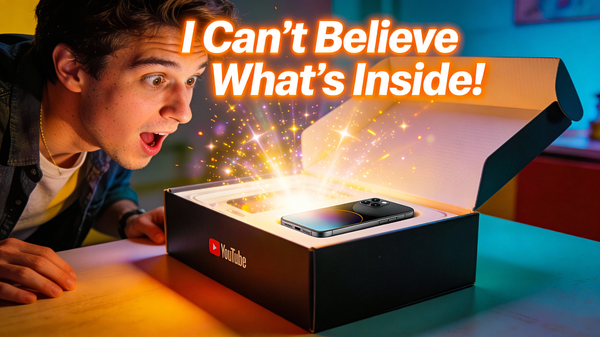

Prompt:

```text
A thumbnail for an unboxing video of a new, expensive tech gadget. The box is open, and a bright, magical light is shining out from inside. The YouTuber is peering into the box with a look of pure wonder and excitement. The product itself is not fully visible, creating curiosity. The text “I Can’t Believe What’s Inside!” is in a bold, excited font. –ar 16:9
```

### Seedream 4.5 Prompts #23: Ancient Egypt Documentary Thumbnail

- Category: `Video`
- Model: `Seedream`
- Author / Source: [Jared Liu](https://github.com/YouMind-OpenLab/awesome-seedream-4.5/blob/main/README.md)
- Image: `assets/imported/YouMind-OpenLab/awesome-seedream-4.5/README-23-Ancient-Egypt-Documentary-Thumbnail.png`


Prompt:

```text
A thumbnail for a documentary about ancient Egypt. The image is a cinematic, photorealistic rendering of the Great Pyramids of Giza at sunset. The sun is setting behind the pyramids, creating a beautiful silhouette. In the foreground, the silhouette of an archaeologist looking at the pyramids. The title is in a font that mimics ancient hieroglyphs. This showcases rich world knowledge and cinematic rendering. –ar 16:9
```

### Seedream 4.5 Prompts #24: Electric Supercar Review Thumbnail

- Category: `Creative`
- Model: `Seedream`
- Author / Source: [Jared Liu](https://github.com/YouMind-OpenLab/awesome-seedream-4.5/blob/main/README.md)
- Image: `assets/imported/YouMind-OpenLab/awesome-seedream-4.5/README-24-Electric-Supercar-Review-Thumbnail.png`

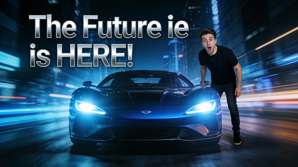

Prompt:

```text
A thumbnail for a review of a new electric supercar. The car is shown from a low, dramatic angle, making it look powerful and aggressive. The headlights are on, and the background is a blurred motion shot of a city at night. The YouTuber is standing next to the car with a wide-eyed, “mind-blown” expression. The text “The Future is HERE!” is in a sleek, modern font. –ar 16:9
```

### Seedream 4.5 Prompts #25: True Crime Documentary Thumbnail

- Category: `Creative`
- Model: `Seedream`
- Author / Source: [Jared Liu](https://github.com/YouMind-OpenLab/awesome-seedream-4.5/blob/main/README.md)
- Image: `assets/imported/YouMind-OpenLab/awesome-seedream-4.5/README-25-True-Crime-Documentary-Thumbnail.png`


Prompt:

```text
A dark and mysterious thumbnail for a true crime documentary. The image is a moody, black and white photo of a key piece of evidence (e.g., a letter) on a detective’s desk, illuminated by a single lamp. A large, red question mark is stamped over the image. The YouTuber’s face is not visible, adding to the mystery. The title is in a classic typewriter font. This demonstrates strong control over mood and atmosphere. –ar 16:9
```

### Seedream 4.5 Prompts #26: Fun Educational Children's Science Fair Poster

- Category: `Poster`
- Model: `Seedream`
- Author / Source: [Jared Liu](https://github.com/xianyu110/awesome-seedream-4.5/blob/main/README.md)
- Image: `assets/imported/xianyu110/awesome-seedream-4.5/README-1-Fun-Educational-Children-s-Science-Fair-Poster.png`

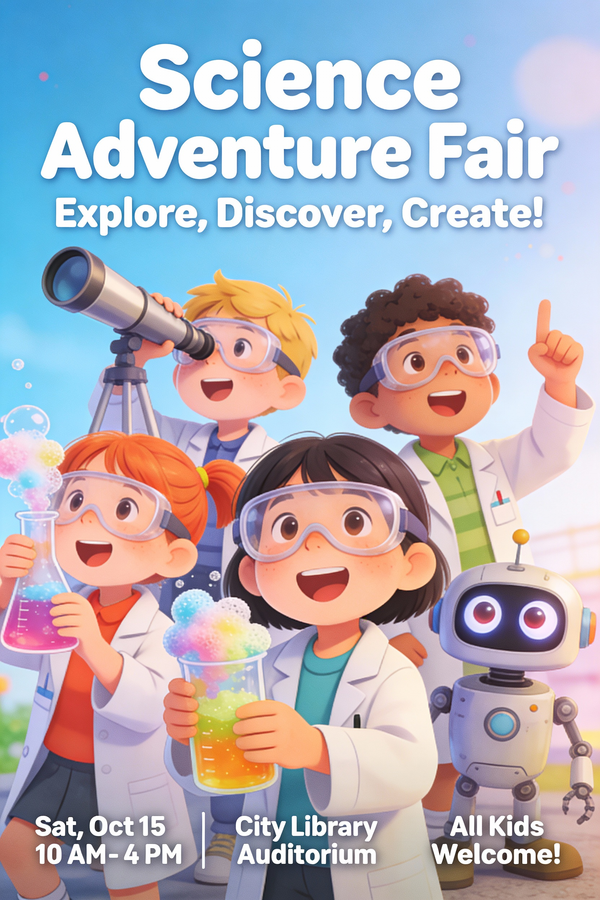

Prompt:

```text
A fun and educational poster for a children’s science fair. The design is a colorful cartoon illustration featuring kids dressed as scientists, looking at bubbling beakers, telescopes, and robots. The typography is playful and kid-friendly. The poster should make science look exciting and accessible, encouraging kids to participate. –ar 2:3
```

### Seedream 4.5 Prompts #27: Trendy Fashion Sale Poster

- Category: `Poster`
- Model: `Seedream`
- Author / Source: [Jared Liu](https://github.com/xianyu110/awesome-seedream-4.5/blob/main/README.md)
- Image: `assets/imported/xianyu110/awesome-seedream-4.5/README-2-Trendy-Fashion-Sale-Poster.png`

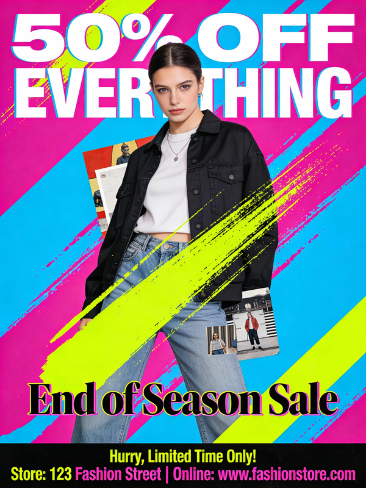

Prompt:

```text
A trendy and eye-catching poster for a fashion store’s end-of-season sale. The design uses bold, vibrant colors and modern, edgy typography. The main visual is a stylish model wearing clothes from the store, but the image is creatively treated with paint strokes or collage elements. The text “50% OFF EVERYTHING” is the most prominent element. The poster should create a sense of urgency and excitement. –ar 3:4
```

### Seedream 4.5 Prompts #28: Aspirational Swiss Alps Travel Poster

- Category: `Poster`
- Model: `Seedream`
- Author / Source: [Jared Liu](https://github.com/xianyu110/awesome-seedream-4.5/blob/main/README.md)
- Image: `assets/imported/xianyu110/awesome-seedream-4.5/README-3-Aspirational-Swiss-Alps-Travel-Poster.png`

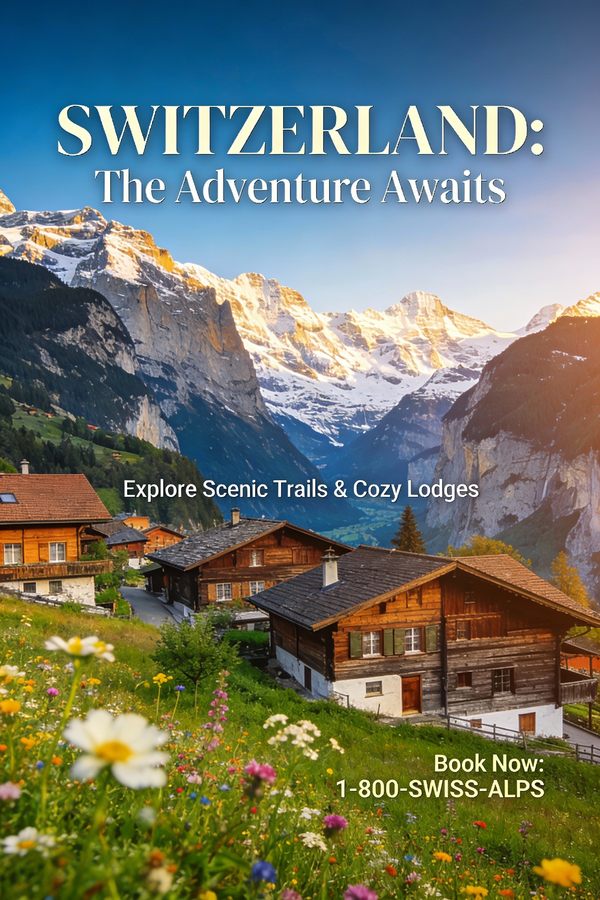

Prompt:

```text
An aspirational and beautiful travel poster for visiting the Swiss Alps. The image is a breathtaking, hyper-realistic photograph of a picturesque alpine village with snow-capped mountains in the background. The text “SWITZERLAND: The Adventure Awaits” is in an elegant, classic font. The poster should evoke a strong sense of wanderlust and make the viewer want to book a trip immediately. –ar 2:3
```

### Seedream 4.5 Prompts #29: Effective 'Lost Cat' Flyer

- Category: `Creative`
- Model: `Seedream`
- Author / Source: [Jared Liu](https://github.com/xianyu110/awesome-seedream-4.5/blob/main/README.md)
- Image: `assets/imported/xianyu110/awesome-seedream-4.5/README-4-Effective-Lost-Cat-Flyer.png`


Prompt:

```text
An effective and clear “Lost Cat” flyer. The design is simple and functional. It features a large, clear, color photograph of the cat at the top. The headline “LOST CAT” is in a very large, bold, and easy-to-read font. Below the photo are the cat’s name, description, last seen location, and the owner’s contact information with tear-off tabs at the bottom. This demonstrates the ability to create practical, real-world designs. –ar 3:4
```

### Seedream 4.5 Prompts #30: Informative Climate Change Seminar Poster

- Category: `Poster`
- Model: `Seedream`
- Author / Source: [Jared Liu](https://github.com/xianyu110/awesome-seedream-4.5/blob/main/README.md)
- Image: `assets/imported/xianyu110/awesome-seedream-4.5/README-5-Informative-Climate-Change-Seminar-Poster.png`

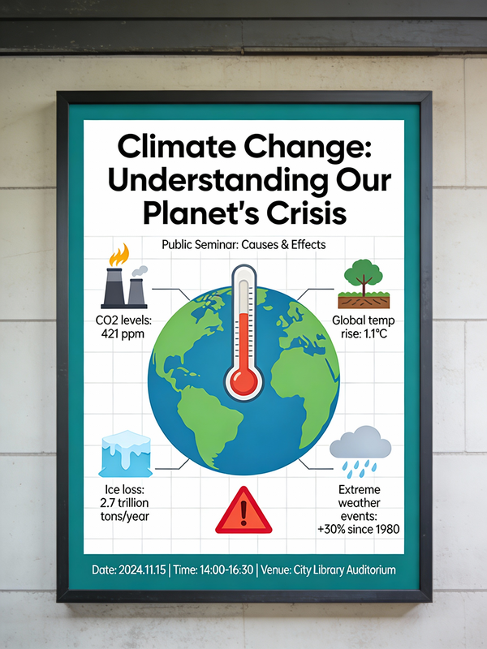

Prompt:

```text
An informative and engaging poster for a public seminar on climate change. The poster is designed as a mini-infographic, with a large, central graphic showing the earth with a thermometer, and smaller icons and data points around it explaining the causes and effects. The design is clean, organized, and aims to educate the viewer quickly and effectively. –ar 3:4
```

### Seedream 4.5 Prompts #31: Sleek Minimalist Wireless Headphone Ad

- Category: `Product`
- Model: `Seedream`
- Author / Source: [Jared Liu](https://github.com/xianyu110/awesome-seedream-4.5/blob/main/README.md)
- Image: `assets/imported/xianyu110/awesome-seedream-4.5/README-6-Sleek-Minimalist-Wireless-Headphone-Ad.png`


Prompt:

```text
A sleek and minimalist poster advertisement for a new high-tech wireless headphone. The poster features a stunning, high-resolution 3D render of the headphone, seemingly floating in a zero-gravity environment. The background is a simple, clean gradient. The only text is the brand name and the product slogan: “Unleash Your Sound.” The design is modern, sophisticated, and focuses entirely on the product’s beauty. –ar 2:3
```

### Seedream 4.5 Prompts #32: Energetic 5K Charity Run Poster

- Category: `Poster`
- Model: `Seedream`
- Author / Source: [Jared Liu](https://github.com/xianyu110/awesome-seedream-4.5/blob/main/README.md)
- Image: `assets/imported/xianyu110/awesome-seedream-4.5/README-7-Energetic-5K-Charity-Run-Poster.png`


Prompt:

```text
An energetic and motivational poster for a 5K charity run for a good cause. The design features a dynamic photograph of a diverse group of people running, with smiles on their faces. The background has abstract, colorful shapes and lines that suggest movement and energy. The event details are clear and easy to read. The poster should be inspiring and encourage people to sign up. –ar 3:4
```

### Seedream 4.5 Prompts #33: Dramatic Minimalist Hamlet Poster

- Category: `Product`
- Model: `Seedream`
- Author / Source: [Jared Liu](https://github.com/xianyu110/awesome-seedream-4.5/blob/main/README.md)
- Image: `assets/imported/xianyu110/awesome-seedream-4.5/README-8-Dramatic-Minimalist-Hamlet-Poster.png`

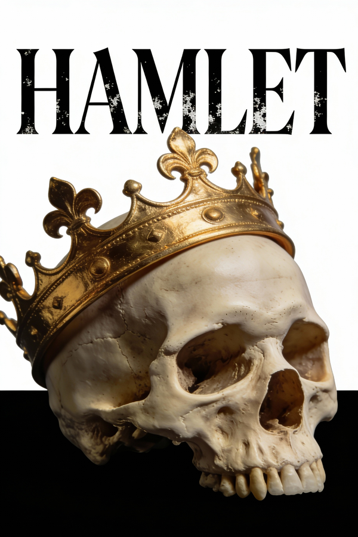

Prompt:

```text
A dramatic and minimalist poster for a production of Shakespeare’s “Hamlet”. The design features a single, powerful image: a human skull with a golden crown resting on it, against a stark black background. The title “HAMLET” is in a classic, sharp serif font, with the letters slightly decaying. The design is symbolic, modern, and full of gravitas. –ar 2:3
```

### Seedream 4.5 Prompts #34: Charming Rustic Farmers Market Poster

- Category: `Poster`
- Model: `Seedream`
- Author / Source: [Jared Liu](https://github.com/xianyu110/awesome-seedream-4.5/blob/main/README.md)
- Image: `assets/imported/xianyu110/awesome-seedream-4.5/README-9-Charming-Rustic-Farmers-Market-Poster.png`


Prompt:

```text
A charming and rustic poster for a local farmers market. The design is an illustration in a friendly, hand-drawn style, featuring a bounty of fresh vegetables, fruits, and flowers in a wooden crate. The typography is a friendly, rounded sans-serif. The poster should feel wholesome, local, and community-oriented. –ar 3:4
```

### Seedream 4.5 Prompts #35: Quirky Independent Short Film Festival Poster

- Category: `Poster`
- Model: `Seedream`
- Author / Source: [Jared Liu](https://github.com/xianyu110/awesome-seedream-4.5/blob/main/README.md)
- Image: `assets/imported/xianyu110/awesome-seedream-4.5/README-10-Quirky-Independent-Short-Film-Festival-Poster.png`

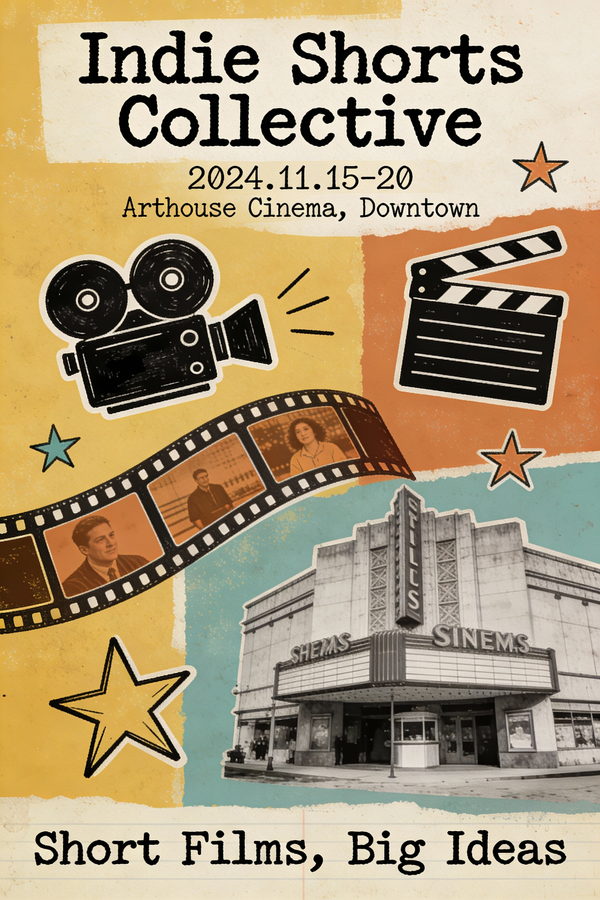

Prompt:

```text
A quirky and independent-style poster for a short film festival. The design is a collage of hand-drawn doodles, film strips, and vintage photographs. The typography is a mix of different typewriter and handwritten fonts, giving it a DIY, zine-like feel. The color palette is limited and has a retro vibe. The poster should look creative, unconventional, and appeal to an arthouse audience. –ar 2:3
```

### Seedream 4.5 Prompts #36: Serene Yoga & Meditation Workshop Poster

- Category: `Poster`
- Model: `Seedream`
- Author / Source: [Jared Liu](https://github.com/xianyu110/awesome-seedream-4.5/blob/main/README.md)
- Image: `assets/imported/xianyu110/awesome-seedream-4.5/README-11-Serene-Yoga-Meditation-Workshop-Poster.png`


Prompt:

```text
A serene and calming poster for a weekend yoga and meditation workshop. The main visual is a beautiful, soft-focus photograph of a person in a peaceful yoga pose on a beach at sunrise. The color palette is soft pastels (pinks, oranges, light blues). The typography is a gentle, flowing script. The poster should evoke feelings of peace, wellness, and self-care. –ar 3:4
```

### Seedream 4.5 Prompts #37: Italian Restaurant Grand Opening Flyer

- Category: `Creative`
- Model: `Seedream`
- Author / Source: [Jared Liu](https://github.com/xianyu110/awesome-seedream-4.5/blob/main/README.md)
- Image: `assets/imported/xianyu110/awesome-seedream-4.5/README-12-Italian-Restaurant-Grand-Opening-Flyer.png`


Prompt:

```text
A delicious and inviting flyer for the grand opening of a new Italian restaurant. The main visual is a beautiful, rustic flat-lay photograph of a table laden with Italian food: a pizza, a bowl of pasta, a glass of red wine, and some fresh basil. The restaurant’s name is in a warm, handwritten script font. The date and address of the opening are clearly visible. The overall feel is warm, authentic, and appetizing. –ar 4:5
```

### Seedream 4.5 Prompts #38: Plastic Pollution PSA Poster

- Category: `Poster`
- Model: `Seedream`
- Author / Source: [Jared Liu](https://github.com/xianyu110/awesome-seedream-4.5/blob/main/README.md)
- Image: `assets/imported/xianyu110/awesome-seedream-4.5/README-13-Plastic-Pollution-PSA-Poster.png`

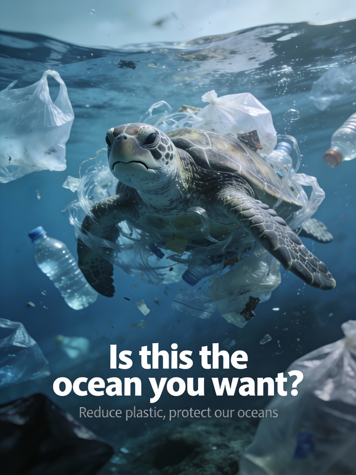

Prompt:

```text
A powerful and thought-provoking poster for a public service announcement about plastic pollution in the oceans. The image is a surreal and sad depiction of a sea turtle swimming through a sea of plastic bags and bottles, instead of water. The tagline “Is this the ocean you want?” is at the bottom. The visual should be realistic and impactful, designed to evoke an emotional response and raise awareness. –ar 3:4
```

### Seedream 4.5 Prompts #39: Crime Novel Book Cover "The Shadow Detective"

- Category: `Creative`
- Model: `Seedream`
- Author / Source: [Jared Liu](https://github.com/xianyu110/awesome-seedream-4.5/blob/main/README.md)
- Image: `assets/imported/xianyu110/awesome-seedream-4.5/README-14-Crime-Novel-Book-Cover-The-Shadow-Detective.png`

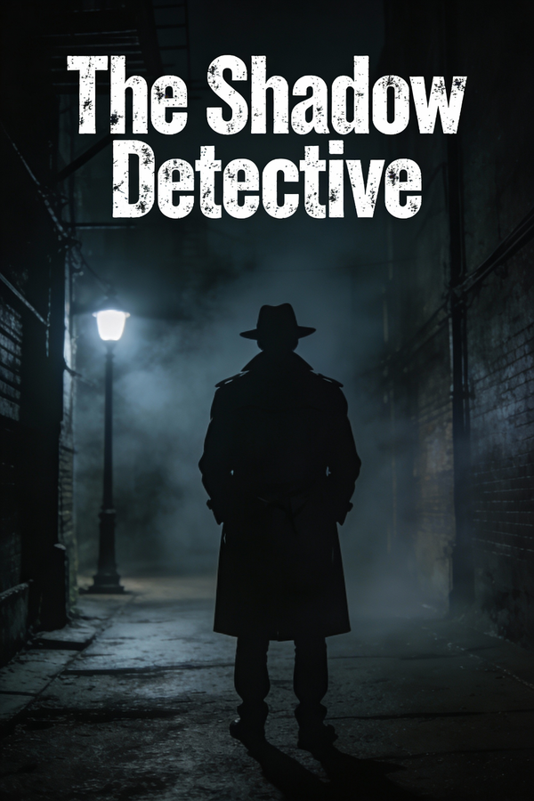

Prompt:

```text
A thrilling and mysterious book cover for a crime novel titled “The Shadow Detective”. The cover features a silhouette of a detective in a fedora and trench coat, standing in a dark, foggy alleyway. The only light source is a single, distant streetlamp. The title is in a gritty, textured font that looks like it was stamped on. The mood is noir and full of suspense, demonstrating strong atmospheric control. –ar 2:3
```

### Seedream 4.5 Prompts #40: Japanese Ukiyo-e Museum Poster

- Category: `Poster`
- Model: `Seedream`
- Author / Source: [Jared Liu](https://github.com/xianyu110/awesome-seedream-4.5/blob/main/README.md)
- Image: `assets/imported/xianyu110/awesome-seedream-4.5/README-15-Japanese-Ukiyo-e-Museum-Poster.png`


Prompt:

```text
An elegant and artistic poster for a museum exhibition of Japanese Ukiyo-e woodblock prints. The design features a beautiful, high-resolution detail from a famous print, like Hokusai’s “The Great Wave,” but creatively cropped. The typography is a mix of an elegant English serif font and Japanese calligraphy. The layout is minimalist and respectful of the artwork, using a lot of negative space. This showcases knowledge of art history and sophisticated graphic design skills. –ar 2:3
```

### Seedream 4.5 Prompts #41: Software Developer Recruitment Flyer

- Category: `Product`
- Model: `Seedream`
- Author / Source: [Jared Liu](https://github.com/xianyu110/awesome-seedream-4.5/blob/main/README.md)
- Image: `assets/imported/xianyu110/awesome-seedream-4.5/README-16-Software-Developer-Recruitment-Flyer.png`


Prompt:

```text
A bold and direct recruitment flyer for a startup looking for software developers. The headline “BUILD THE FUTURE” is in a large, strong, sans-serif font. The main visual is an abstract, stylized illustration of code turning into a growing city skyline. The company logo and a QR code to the application page are prominently displayed at the bottom. The color palette is energetic and tech-oriented (e.g., electric blue and dark gray). –ar 3:4
```

### Seedream 4.5 Prompts #42: Psychedelic Music Festival Poster "Ethereal Bloom"

- Category: `Poster`
- Model: `Seedream`
- Author / Source: [Jared Liu](https://github.com/xianyu110/awesome-seedream-4.5/blob/main/README.md)
- Image: `assets/imported/xianyu110/awesome-seedream-4.5/README-17-Psychedelic-Music-Festival-Poster-Ethereal-Bloom.png`


Prompt:

```text
A vibrant, psychedelic poster for a summer music festival called “Ethereal Bloom”. The design is a surreal explosion of color, featuring giant, glowing mushrooms, whimsical fantasy creatures, and abstract geometric patterns all intertwined. The festival lineup is integrated into the artwork in a wavy, distorted font. The overall mood is magical, energetic, and otherworldly, showcasing the ability to create complex, imaginative, and genre-specific visuals. –ar 2:3
```

### Seedream 4.5 Prompts #43: Cinematic Sci-Fi Movie Poster "CHRONOS"

- Category: `Poster`
- Model: `Seedream`
- Author / Source: [Jared Liu](https://github.com/xianyu110/awesome-seedream-4.5/blob/main/README.md)
- Image: `assets/imported/xianyu110/awesome-seedream-4.5/README-18-Cinematic-Sci-Fi-Movie-Poster-CHRONOS.png`


Prompt:

```text
A cinematic, epic movie poster for a fictional sci-fi blockbuster titled “CHRONOS”. The poster features the main hero, a rugged astronaut, looking out at a massive, swirling black hole in space. The reflection of a mysterious alien artifact is visible in his helmet visor. The typography is bold, metallic, and modern. The tagline “Time is the enemy” is positioned at the bottom. This requires advanced cinematic lighting, composition, and the ability to blend multiple complex elements seamlessly. –ar 2:3
```

### Seedream 4.5 Prompts #44: Website Building Tutorial Thumbnail

- Category: `Creative`
- Model: `Seedream`
- Author / Source: [Jared Liu](https://github.com/xianyu110/awesome-seedream-4.5/blob/main/README.md)
- Image: `assets/imported/xianyu110/awesome-seedream-4.5/README-19-Website-Building-Tutorial-Thumbnail.png`


Prompt:

```text
A thumbnail for a tutorial on “How to Build a Website in 10 Minutes.” The image shows a computer screen with a beautiful, professional-looking website on it. A large clock icon showing “10 Min” is overlaid on the screen. The YouTuber is in the corner, pointing to the screen and smiling, looking confident and helpful. The text is clear and promises a quick, easy solution. –ar 16:9
```

### Seedream 4.5 Prompts #45: Vending Machine Food Challenge Thumbnail

- Category: `Creative`
- Model: `Seedream`
- Author / Source: [Jared Liu](https://github.com/xianyu110/awesome-seedream-4.5/blob/main/README.md)
- Image: `assets/imported/xianyu110/awesome-seedream-4.5/README-20-Vending-Machine-Food-Challenge-Thumbnail.png`


Prompt:

```text
A thumbnail for an “Eating Only Vending Machine Food for 24 Hours” challenge. The image shows the YouTuber sitting on the floor, surrounded by a huge pile of colorful snacks and drinks from vending machines. They have a pained but funny expression on their face. The text “I REGRET THIS” is in a bold, distressed font. –ar 16:9
```

### Seedream 4.5 Prompts #46: Prank Video Thumbnail

- Category: `Video`
- Model: `Seedream`
- Author / Source: [Jared Liu](https://github.com/xianyu110/awesome-seedream-4.5/blob/main/README.md)
- Image: `assets/imported/xianyu110/awesome-seedream-4.5/README-21-Prank-Video-Thumbnail.png`

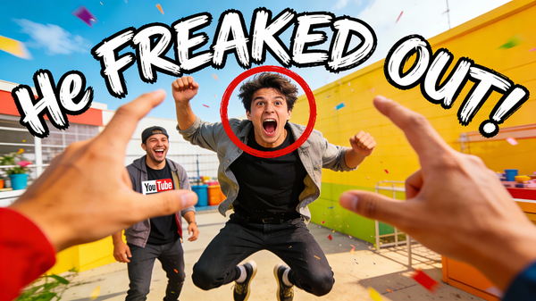

Prompt:

```text
A thumbnail for a prank video. The image captures the peak moment of the prank: the person being pranked is screaming or jumping in surprise. The YouTuber who set up the prank is in the background, laughing. The scene is chaotic and funny. A red circle is drawn around the pranked person’s face to highlight their reaction. The text “He FREAKED OUT!” is in a shaky, hand-drawn font. –ar 16:9
```

### Seedream 4.5 Prompts #47: 5-Minute Life Hacks Thumbnail

- Category: `Video`
- Model: `Seedream`
- Author / Source: [Jared Liu](https://github.com/xianyu110/awesome-seedream-4.5/blob/main/README.md)
- Image: `assets/imported/xianyu110/awesome-seedream-4.5/README-22-5-Minute-Life-Hacks-Thumbnail.png`


Prompt:

```text
A thumbnail for a “5-Minute Life Hacks” video. The image is a grid of four different hacks being demonstrated (e.g., using a bottle to separate egg yolks). Each image is clear and easy to understand. The YouTuber is in the center of the grid, giving a thumbs-up. The number “5” is huge and placed prominently. This requires creating clear, instructional visuals. –ar 16:9
```

### Seedream 4.5 Prompts #48: Tech Gadget Unboxing Thumbnail

- Category: `Product`
- Model: `Seedream`
- Author / Source: [Jared Liu](https://github.com/xianyu110/awesome-seedream-4.5/blob/main/README.md)
- Image: `assets/imported/xianyu110/awesome-seedream-4.5/README-23-Tech-Gadget-Unboxing-Thumbnail.png`


Prompt:

```text
A thumbnail for an unboxing video of a new, expensive tech gadget. The box is open, and a bright, magical light is shining out from inside. The YouTuber is peering into the box with a look of pure wonder and excitement. The product itself is not fully visible, creating curiosity. The text “I Can’t Believe What’s Inside!” is in a bold, excited font. –ar 16:9
```

### Seedream 4.5 Prompts #49: Ancient Egypt Documentary Thumbnail

- Category: `Video`
- Model: `Seedream`
- Author / Source: [Jared Liu](https://github.com/xianyu110/awesome-seedream-4.5/blob/main/README.md)
- Image: `assets/imported/xianyu110/awesome-seedream-4.5/README-24-Ancient-Egypt-Documentary-Thumbnail.png`

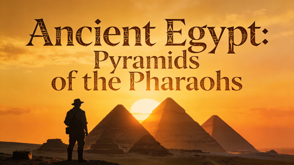

Prompt:

```text
A thumbnail for a documentary about ancient Egypt. The image is a cinematic, photorealistic rendering of the Great Pyramids of Giza at sunset. The sun is setting behind the pyramids, creating a beautiful silhouette. In the foreground, the silhouette of an archaeologist looking at the pyramids. The title is in a font that mimics ancient hieroglyphs. This showcases rich world knowledge and cinematic rendering. –ar 16:9
```

### Seedream 4.5 Prompts #50: Electric Supercar Review Thumbnail

- Category: `Creative`
- Model: `Seedream`
- Author / Source: [Jared Liu](https://github.com/xianyu110/awesome-seedream-4.5/blob/main/README.md)
- Image: `assets/imported/xianyu110/awesome-seedream-4.5/README-25-Electric-Supercar-Review-Thumbnail.png`


Prompt:

```text
A thumbnail for a review of a new electric supercar. The car is shown from a low, dramatic angle, making it look powerful and aggressive. The headlights are on, and the background is a blurred motion shot of a city at night. The YouTuber is standing next to the car with a wide-eyed, “mind-blown” expression. The text “The Future is HERE!” is in a sleek, modern font. –ar 16:9
```

### Seedream 4.5 Prompts #51: True Crime Documentary Thumbnail

- Category: `Creative`
- Model: `Seedream`
- Author / Source: [Jared Liu](https://github.com/xianyu110/awesome-seedream-4.5/blob/main/README.md)
- Image: `assets/imported/xianyu110/awesome-seedream-4.5/README-26-True-Crime-Documentary-Thumbnail.png`


Prompt:

```text
A dark and mysterious thumbnail for a true crime documentary. The image is a moody, black and white photo of a key piece of evidence (e.g., a letter) on a detective’s desk, illuminated by a single lamp. A large, red question mark is stamped over the image. The YouTuber’s face is not visible, adding to the mystery. The title is in a classic typewriter font. This demonstrates strong control over mood and atmosphere. –ar 16:9
```

### Seedream 4.5 Prompts #52: 30-Day Fitness Challenge Results Thumbnail

- Category: `Video`
- Model: `Seedream`
- Author / Source: [Jared Liu](https://github.com/xianyu110/awesome-seedream-4.5/blob/main/README.md)
- Image: `assets/imported/xianyu110/awesome-seedream-4.5/README-27-30-Day-Fitness-Challenge-Results-Thumbnail.png`

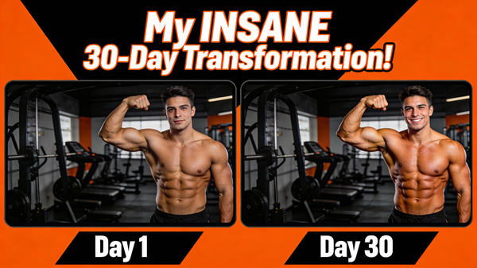

Prompt:

```text
A thumbnail for a “30-Day Fitness Challenge” results video. It’s a split-screen image showing the YouTuber’s physique on Day 1 and Day 30. The transformation is clear and impressive. The YouTuber is flexing in the Day 30 photo with a confident expression. The text “My INSANE 30-Day Transformation!” is in a bold, athletic font. This requires high subject consistency across images. –ar 16:9
```

### Seedream 4.5 Prompts #53: Black Hole Explanation Thumbnail

- Category: `Video`
- Model: `Seedream`
- Author / Source: [Jared Liu](https://github.com/xianyu110/awesome-seedream-4.5/blob/main/README.md)
- Image: `assets/imported/xianyu110/awesome-seedream-4.5/README-28-Black-Hole-Explanation-Thumbnail.png`

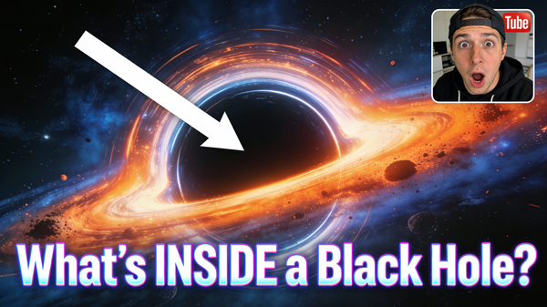

Prompt:

```text
A thumbnail for a video explaining black holes. The image is a scientifically accurate and visually stunning rendering of a black hole, showing the accretion disk and gravitational lensing effect. A large, white arrow points to the singularity. The YouTuber’s face is in the corner, looking amazed. The title “What’s INSIDE a Black Hole?” is in a futuristic font. This showcases the ability to render complex scientific phenomena accurately. –ar 16:9
```

### Seedream 4.5 Prompts #54: DIY Room Makeover Before and After

- Category: `Video`
- Model: `Seedream`
- Author / Source: [Jared Liu](https://github.com/xianyu110/awesome-seedream-4.5/blob/main/README.md)
- Image: `assets/imported/xianyu110/awesome-seedream-4.5/README-29-DIY-Room-Makeover-Before-and-After.png`

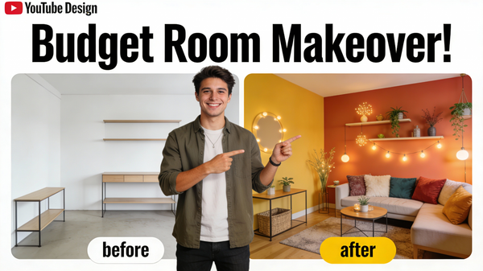

Prompt:

```text
A thumbnail for a DIY home decor video. The image shows a “before and after” split screen. The “before” side shows a plain, boring room. The “after” side shows the same room transformed into a stylish, cozy space. The YouTuber is in the middle, pointing to the “after” side with a proud smile. The text “Budget Room Makeover!” is prominently displayed. This demonstrates high consistency and the ability to show transformations. –ar 16:9
```

### Seedream 4.5 Prompts #55: Ultimate Chocolate Cake Recipe Thumbnail

- Category: `Video`
- Model: `Seedream`
- Author / Source: [Jared Liu](https://github.com/xianyu110/awesome-seedream-4.5/blob/main/README.md)
- Image: `assets/imported/xianyu110/awesome-seedream-4.5/README-30-Ultimate-Chocolate-Cake-Recipe-Thumbnail.png`

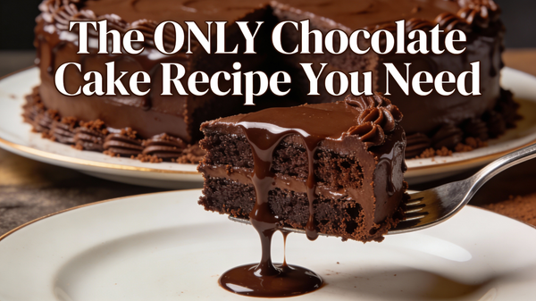

Prompt:

```text
A thumbnail for a recipe video on “The Ultimate Chocolate Cake.” The image is a mouth-watering close-up of a slice of cake on a fork, with molten chocolate dripping from it. The background is a beautifully decorated, complete cake. The lighting is warm and delicious. Bold, elegant text says “The ONLY Chocolate Cake Recipe You Need.” This requires hyper-realistic food rendering to create a strong sense of craving. –ar 16:9
```

### Seedream 4.5 Prompts #56: Minecraft Survival Video Thumbnail

- Category: `Portrait`
- Model: `Seedream`
- Author / Source: [Jared Liu](https://github.com/xianyu110/awesome-seedream-4.5/blob/main/README.md)
- Image: `assets/imported/xianyu110/awesome-seedream-4.5/README-31-Minecraft-Survival-Video-Thumbnail.png`

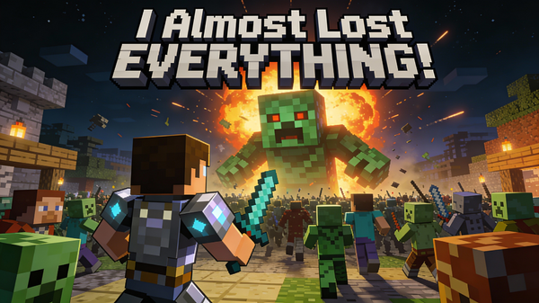

Prompt:

```text
A thumbnail for a “Minecraft Survival” video. The image shows the player’s character, in diamond armor, bravely fighting off a massive horde of zombies and creepers at night. A huge, terrifying Creeper looms in the background, about to explode. The text “I Almost Lost EVERYTHING!” is in a blocky, Minecraft-style font. This requires knowledge of specific game aesthetics and the ability to create dramatic, action-packed scenes. –ar 16:9
```

### Seedream 4.5 Prompts #57: Bali Travel Vlog Thumbnail

- Category: `Video`
- Model: `Seedream`
- Author / Source: [Jared Liu](https://github.com/xianyu110/awesome-seedream-4.5/blob/main/README.md)
- Image: `assets/imported/xianyu110/awesome-seedream-4.5/README-32-Bali-Travel-Vlog-Thumbnail.png`

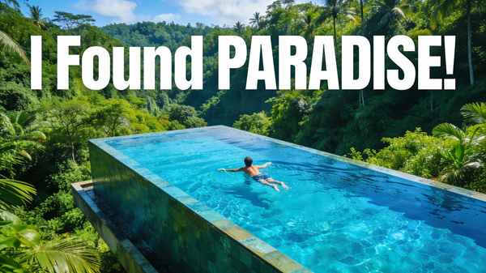

Prompt:

```text
A stunning thumbnail for a travel vlog about Bali. The image is a beautiful, vibrant shot of the YouTuber swimming in a crystal-clear infinity pool that overlooks a lush, green jungle. The colors are hyper-saturated, making the water incredibly blue and the jungle intensely green. The video title, “I Found PARADISE!” is in a clean, white font. This showcases advanced environmental rendering and color control for aspirational content. –ar 16:9
```

### Seedream 4.5 Prompts #58: Smartphone Review Thumbnail

- Category: `Product`
- Model: `Seedream`
- Author / Source: [Jared Liu](https://github.com/xianyu110/awesome-seedream-4.5/blob/main/README.md)
- Image: `assets/imported/xianyu110/awesome-seedream-4.5/README-33-Smartphone-Review-Thumbnail.png`


Prompt:

```text
A thumbnail for a review of the latest smartphone. The phone is held in a hand, angled to show its sleek screen and camera array. On one side of the phone, a big green checkmark icon; on the other, a big red X icon. The YouTuber’s face is in the corner, with a shocked and surprised expression. The background is a clean, techy grid pattern. This demonstrates precise product rendering and the ability to create a clear “vs.” narrative. –ar 16:9
```

### Seedream 4.5 Prompts #59: Try Not to Laugh Challenge Thumbnail

- Category: `Video`
- Model: `Seedream`
- Author / Source: [Jared Liu](https://github.com/xianyu110/awesome-seedream-4.5/blob/main/README.md)
- Image: `assets/imported/xianyu110/awesome-seedream-4.5/README-34-Try-Not-to-Laugh-Challenge-Thumbnail.png`

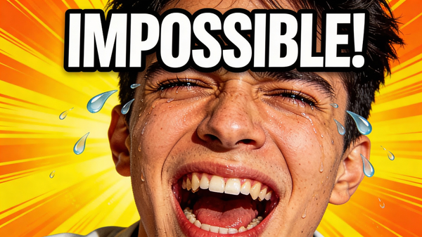

Prompt:

```text
A high-energy thumbnail for a “Try Not to Laugh Challenge” video. It features a close-up of a YouTuber with an extremely exaggerated, crying-laughing expression, tears flying from their eyes. The background is a bright, explosive radial gradient of yellow and orange. Bold, white text with a black outline says “IMPOSSIBLE!” This requires the ability to generate specific, over-the-top emotions and high-impact text. –ar 16:9
```

### Seedream 4.5 Prompts #60: Web Application System Architecture Diagram

- Category: `Infographic`
- Model: `Seedream`
- Author / Source: [Jared Liu](https://github.com/xianyu110/awesome-seedream-4.5/blob/main/README.md)
- Image: `assets/imported/xianyu110/awesome-seedream-4.5/README-35-Web-Application-System-Architecture-Diagram.png`

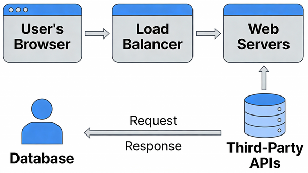

Prompt:

```text
A high-level system architecture diagram for a modern web application, for a presentation to stakeholders. The diagram should use icons to represent different components like the user’s browser, a load balancer, web servers, a database, and third-party APIs. The connections between them should show the flow of data. The style is clean, professional, and easy to understand, even for a non-technical audience, showcasing the ability to render complex technical information clearly. –ar 16:9
```

### Seedream 4.5 Prompts #61: Illustrated Homemade Pasta Recipe Card

- Category: `Infographic`
- Model: `Seedream`
- Author / Source: [Jared Liu](https://github.com/xianyu110/awesome-seedream-4.5/blob/main/README.md)
- Image: `assets/imported/xianyu110/awesome-seedream-4.5/README-36-Illustrated-Homemade-Pasta-Recipe-Card.png`

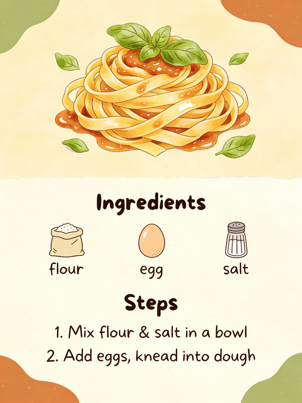

Prompt:

```text
A beautifully illustrated recipe card for making homemade pasta. The top half is a charming illustration of the finished dish (e.g., fettuccine with basil). The bottom half lists the ingredients and steps, with small icons for each ingredient (flour, egg, salt). The style is warm and rustic, like a page from a handwritten family cookbook. –ar 3:4
```

### Seedream 4.5 Prompts #62: Workplace Posture Safety Guide

- Category: `Infographic`
- Model: `Seedream`
- Author / Source: [Jared Liu](https://github.com/xianyu110/awesome-seedream-4.5/blob/main/README.md)
- Image: `assets/imported/xianyu110/awesome-seedream-4.5/README-37-Workplace-Posture-Safety-Guide.png`

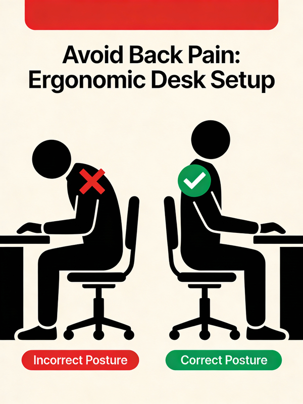

Prompt:

```text
A visual safety guide for a workplace, illustrating the correct posture for sitting at a desk to avoid back pain. The infographic should show two figures: one in an incorrect, slouched posture with red X-marks, and one in a correct, ergonomic posture with green check-marks. The style should be simple, clear, and universally understandable, suitable for corporate training materials. –ar 3:4
```

### Seedream 4.5 Prompts #63: 3D Printer Works Diagram

- Category: `3D`
- Model: `Seedream`
- Author / Source: [Jared Liu](https://github.com/xianyu110/awesome-seedream-4.5/blob/main/README.md)
- Image: `assets/imported/xianyu110/awesome-seedream-4.5/README-38-3D-Printer-Works-Diagram.png`

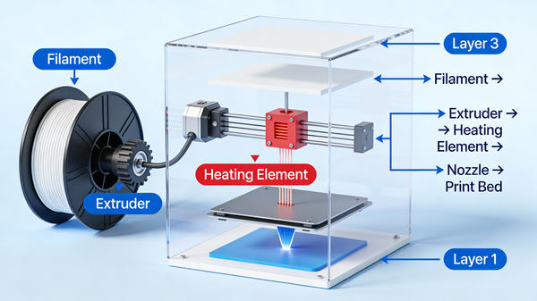

Prompt:

```text
A clear and simple diagram explaining how a 3D printer works (FDM technology). The diagram should show the filament being fed into the extruder, the heating element, and the nozzle depositing the material layer by layer to build an object. The style should be a clean, 3D-esque illustration with arrows showing the process flow, demonstrating the ability to explain complex technology simply. –ar 16:9
```

### Seedream 4.5 Prompts #64: Isometric National Park Map

- Category: `Creative`
- Model: `Seedream`
- Author / Source: [Jared Liu](https://github.com/xianyu110/awesome-seedream-4.5/blob/main/README.md)
- Image: `assets/imported/xianyu110/awesome-seedream-4.5/README-39-Isometric-National-Park-Map.png`

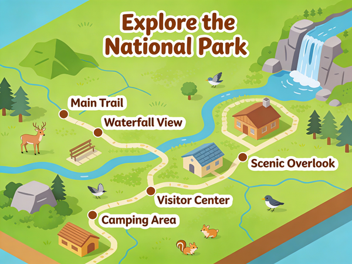

Prompt:

```text
A stylized, isometric illustrated map of a national park. The map should highlight key trails, landmarks (like waterfalls and viewpoints), visitor centers, and camping areas. The style should be friendly and inviting, with small illustrations of animals that live in the park. This is for a park brochure or website, requiring a mix of geographic accuracy and artistic illustration. –ar 4:3
```

### Seedream 4.5 Prompts #65: Blueprint Passive Solar Design

- Category: `Creative`
- Model: `Seedream`
- Author / Source: [Jared Liu](https://github.com/xianyu110/awesome-seedream-4.5/blob/main/README.md)
- Image: `assets/imported/xianyu110/awesome-seedream-4.5/README-40-Blueprint-Passive-Solar-Design.png`

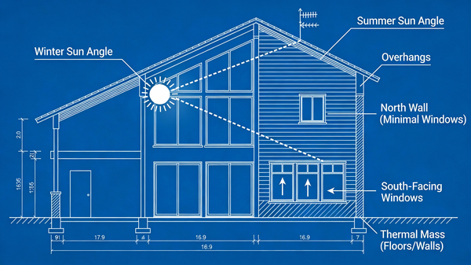

Prompt:

```text
A section of a blueprint-style drawing explaining the concept of passive solar design in a house. The drawing should use white lines on a blue background, showing how the angle of the sun in winter and summer affects the heating and cooling of the house through window placement and overhangs. This requires technical accuracy and an understanding of architectural and physics principles. –ar 16:9
```

### Seedream 4.5 Prompts #66: Scientific Plant Cell Illustration

- Category: `3D`
- Model: `Seedream`
- Author / Source: [Jared Liu](https://github.com/xianyu110/awesome-seedream-4.5/blob/main/README.md)
- Image: `assets/imported/xianyu110/awesome-seedream-4.5/README-41-Scientific-Plant-Cell-Illustration.png`

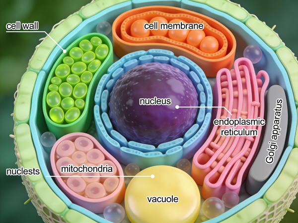

Prompt:

```text
A detailed, scientific illustration of a plant cell, in the style of a modern biology textbook. The illustration should be a 3D cross-section, clearly showing and labeling the cell wall, cell membrane, nucleus, chloroplasts, and other organelles. The colors should be clear and distinct for each organelle. This requires accurate, knowledge-based rendering for scientific education. –ar 4:3
```

### Seedream 4.5 Prompts #67: Global Deforestation Data Visualization

- Category: `Creative`
- Model: `Seedream`
- Author / Source: [Jared Liu](https://github.com/xianyu110/awesome-seedream-4.5/blob/main/README.md)
- Image: `assets/imported/xianyu110/awesome-seedream-4.5/README-42-Global-Deforestation-Data-Visualization.png`

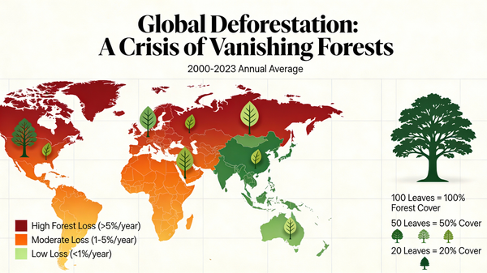

Prompt:

```text
A beautiful and informative data visualization for a report on global deforestation. The main visual could be a world map where countries are colored based on their rate of forest loss, or a series of stylized tree graphics where the number of leaves represents the remaining forest cover. The design should be impactful and emotionally resonant, not just a dry chart, demonstrating the ability to turn data into a compelling visual story. –ar 16:9
```

### Seedream 4.5 Prompts #68: Exploded View DSLR Camera Illustration

- Category: `Product`
- Model: `Seedream`
- Author / Source: [Jared Liu](https://github.com/xianyu110/awesome-seedream-4.5/blob/main/README.md)
- Image: `assets/imported/xianyu110/awesome-seedream-4.5/README-43-Exploded-View-DSLR-Camera-Illustration.png`

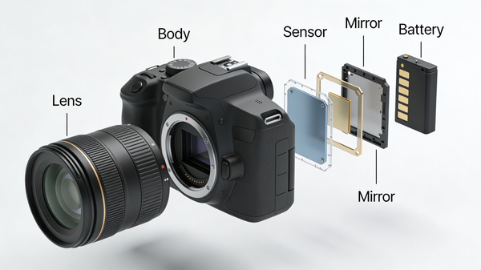

Prompt:

```text
An exploded view technical illustration of a DSLR camera. Each component of the camera (lens, body, sensor, mirror, battery) should be separated but aligned, showing how they fit together. The style should be a clean, precise 3D render with labels for the key parts. This demonstrates advanced spatial understanding and the ability to create complex technical diagrams for engineering and product design. –ar 16:9
```

### Seedream 4.5 Prompts #69: Electric vs. Gasoline Cars Comparison

- Category: `Infographic`
- Model: `Seedream`
- Author / Source: [Jared Liu](https://github.com/xianyu110/awesome-seedream-4.5/blob/main/README.md)
- Image: `assets/imported/xianyu110/awesome-seedream-4.5/README-44-Electric-vs.-Gasoline-Cars-Comparison.png`

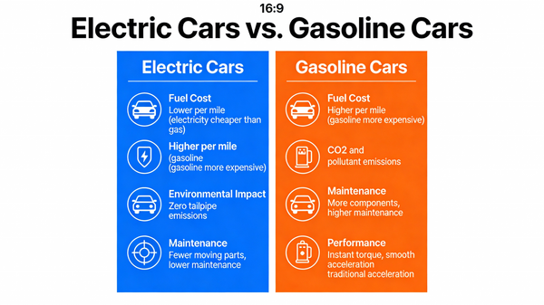

Prompt:

```text
A visual comparison chart (a “vs.” infographic) comparing electric cars and gasoline cars. The chart should have two columns, with icons and brief text comparing them on factors like Fuel Cost, Environmental Impact, Maintenance, and Performance. The design should be clean, modern, and easy to understand at a glance, demonstrating the ability to visually organize and present comparative data. –ar 16:9
```

### Seedream 4.5 Prompts #70: Pour-Over Coffee Guide

- Category: `Infographic`
- Model: `Seedream`
- Author / Source: [Jared Liu](https://github.com/xianyu110/awesome-seedream-4.5/blob/main/README.md)
- Image: `assets/imported/xianyu110/awesome-seedream-4.5/README-45-Pour-Over-Coffee-Guide.png`

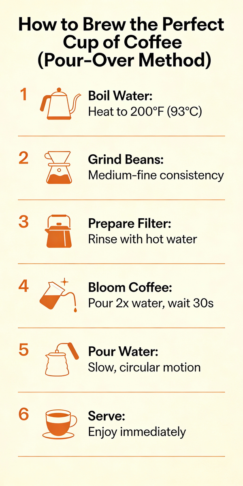

Prompt:

```text
A simple, step-by-step visual guide on “How to Brew the Perfect Cup of Coffee using a Pour-Over Method.” The infographic should have 6–8 steps, each with a clean icon and a short, clear instruction (e.g., “1. Boil Water,” “2. Grind Beans”). The style should be minimalist and icon-based, with a warm color palette. This is for a lifestyle blog or cafe, requiring clear, sequential visual instruction. –ar 1:2
```

### Seedream 4.5 Prompts #71: 3D Cutaway Volcano Diagram

- Category: `3D`
- Model: `Seedream`
- Author / Source: [Jared Liu](https://github.com/xianyu110/awesome-seedream-4.5/blob/main/README.md)
- Image: `assets/imported/xianyu110/awesome-seedream-4.5/README-46-3D-Cutaway-Volcano-Diagram.png`

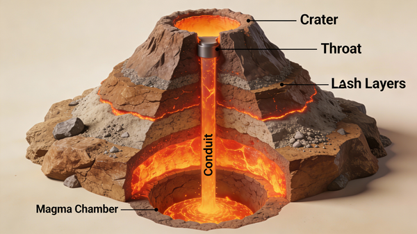

Prompt:

```text
A 3D cutaway diagram of a volcano, showing its internal structure. The diagram should clearly label the magma chamber, conduit, throat, crater, and layers of ash and lava. The style should be a clean, technical illustration, with realistic textures for the rock and magma. This demonstrates the ability to generate accurate, science-based visuals for educational purposes, requiring strong spatial and scientific reasoning. –ar 16:9
```

### Seedream 4.5 Prompts #72: Vintage Chalkboard Heart Anatomy

- Category: `Creative`
- Model: `Seedream`
- Author / Source: [Jared Liu](https://github.com/xianyu110/awesome-seedream-4.5/blob/main/README.md)
- Image: `assets/imported/xianyu110/awesome-seedream-4.5/README-47-Vintage-Chalkboard-Heart-Anatomy.png`

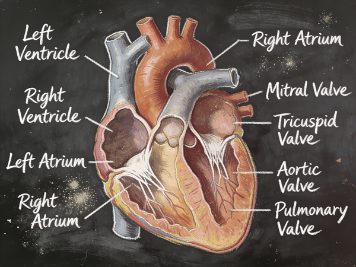

Prompt:

```text
A detailed, vintage-style chalkboard illustration explaining the anatomy of the human heart. The drawing should be done in a realistic, scientific style with white and colored chalk. All the different parts of the heart (ventricles, atriums, valves) should be clearly labeled with elegant, cursive handwriting. The texture of the chalkboard and the chalk dust should be visible, showcasing a rich, knowledge-based rendering capability. –ar 4:3
```

### Seedream 4.5 Prompts #73: Vibrant Mind Map for Creative Thinking

- Category: `Creative`
- Model: `Seedream`
- Author / Source: [Jared Liu](https://github.com/xianyu110/awesome-seedream-4.5/blob/main/README.md)
- Image: `assets/imported/xianyu110/awesome-seedream-4.5/README-48-Vibrant-Mind-Map-for-Creative-Thinking.png`

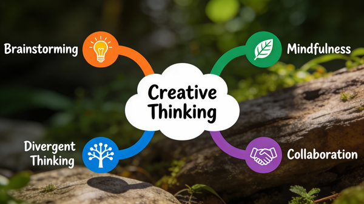

Prompt:

```text
A vibrant and organic mind map centered around the topic of “Creative Thinking.” The central idea is in a cloud-like shape, with branches extending to sub-topics like “Brainstorming,” “Mindfulness,” “Divergent Thinking,” and “Collaboration.” Each branch should have a unique color and be accompanied by a small, relevant icon (e.g., a lightbulb for ideas). The text should be in a friendly, handwritten font, showcasing a tool for educational and brainstorming purposes. –ar 16:9
```

### Seedream 4.5 Prompts #74: Professional SDLC Flowchart

- Category: `Infographic`
- Model: `Seedream`
- Author / Source: [Jared Liu](https://github.com/xianyu110/awesome-seedream-4.5/blob/main/README.md)
- Image: `assets/imported/xianyu110/awesome-seedream-4.5/README-49-Professional-SDLC-Flowchart.png`

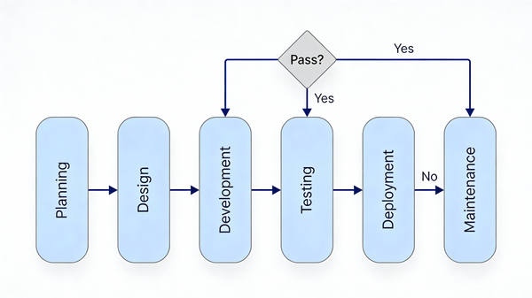

Prompt:

```text
A clean and professional flowchart illustrating the software development life cycle (SDLC). The chart should include stages like Planning, Design, Development, Testing, Deployment, and Maintenance, represented by distinct shapes (rectangles, diamonds for decisions). The connecting lines should have clear arrowheads. The color palette should be corporate and minimalist (blues and grays), demonstrating the ability to create clear, structured diagrams for technical and business contexts. –ar 16:9
```

### Seedream 4.5 Prompts #75: Whiteboard Photosynthesis Explanation

- Category: `Infographic`
- Model: `Seedream`
- Author / Source: [Jared Liu](https://github.com/xianyu110/awesome-seedream-4.5/blob/main/README.md)
- Image: `assets/imported/xianyu110/awesome-seedream-4.5/README-50-Whiteboard-Photosynthesis-Explanation.png`

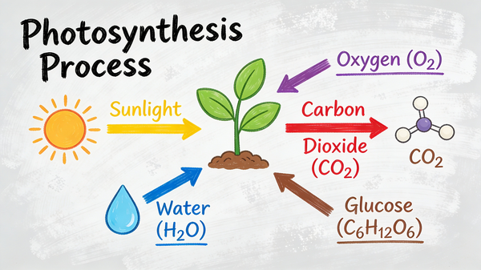

Prompt:

```text
A detailed, hand-drawn whiteboard explanation of the process of photosynthesis, designed for a high school biology class. The diagram should use simple icons (a sun, a plant, water droplets, CO2/O2 molecules) and clear, handwritten labels. Arrows should clearly show the flow of energy and matter. The style should be clean and easy to follow, mimicking a real teacher’s whiteboard drawing, showcasing strong knowledge-based visual reasoning and educational application. –ar 16:9
```

### Seedream 4.5 Prompts #76: Serene Bath for Self-Care

- Category: `Creative`
- Model: `Seedream`
- Author / Source: [Jared Liu](https://github.com/xianyu110/awesome-seedream-4.5/blob/main/README.md)
- Image: `assets/imported/xianyu110/awesome-seedream-4.5/README-51-Serene-Bath-for-Self-Care.png`

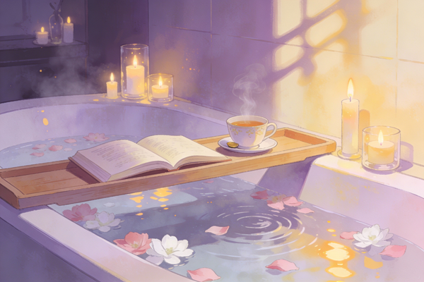

Prompt:

```text
A serene and calming image for a post about self-care and mental health. The scene is a beautifully drawn bath with flower petals floating on the water. A book and a cup of tea are on a wooden tray resting on the tub. The room is lit by candles, creating a warm and relaxing ambiance. The image should be a visual invitation to relax and unwind, demonstrating advanced lighting and atmospheric rendering. –ar 3:2
```

### Seedream 4.5 Prompts #77: Artist's Messy Studio

- Category: `Creative`
- Model: `Seedream`
- Author / Source: [Jared Liu](https://github.com/xianyu110/awesome-seedream-4.5/blob/main/README.md)
- Image: `assets/imported/xianyu110/awesome-seedream-4.5/README-52-Artist-s-Messy-Studio.png`

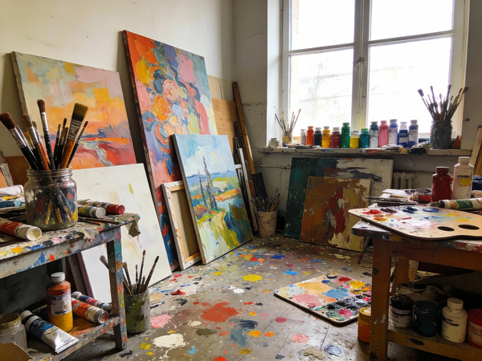

Prompt:

```text
A photo of an artist’s messy but inspiring studio. Canvases are leaning against the wall, some finished, some in progress. Jars of paintbrushes, tubes of paint, and palettes are scattered around. The floor is splattered with paint. The lighting is natural, coming from a large, north-facing window. The image should celebrate the creative process, showcasing the ability to render complex, chaotic scenes with a high degree of realism and coherence. –ar 4:3
```

### Seedream 4.5 Prompts #78: Cozy Christmas Hot Chocolate

- Category: `Creative`
- Model: `Seedream`
- Author / Source: [Jared Liu](https://github.com/xianyu110/awesome-seedream-4.5/blob/main/README.md)
- Image: `assets/imported/xianyu110/awesome-seedream-4.5/README-53-Cozy-Christmas-Hot-Chocolate.png`

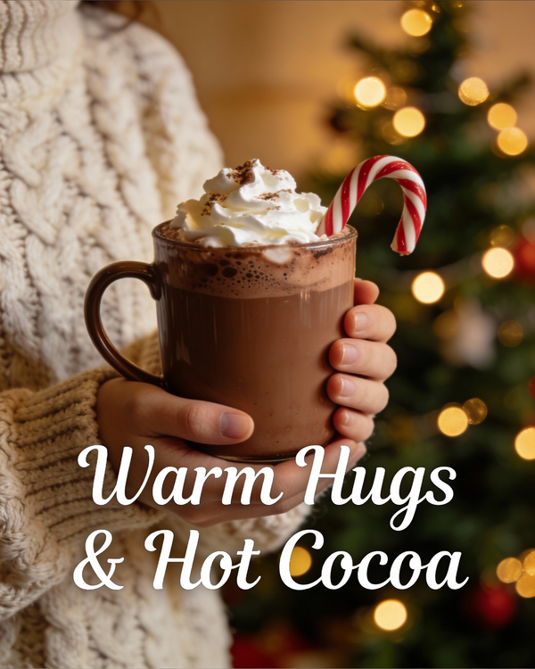

Prompt:

```text
A cozy and festive photo for a Christmas-themed Instagram post. The scene is a close-up of someone holding a large mug of hot chocolate with whipped cream and a candy cane. In the background, a Christmas tree with twinkling lights is softly blurred. The person is wearing a chunky, knitted sweater. The image should evoke feelings of warmth, comfort, and holiday cheer, showcasing strong control over depth of field and mood. –ar 4:5
```

### Seedream 4.5 Prompts #79: High-End Gaming Setup

- Category: `Creative`
- Model: `Seedream`
- Author / Source: [Jared Liu](https://github.com/xianyu110/awesome-seedream-4.5/blob/main/README.md)
- Image: `assets/imported/xianyu110/awesome-seedream-4.5/README-54-High-End-Gaming-Setup.png`

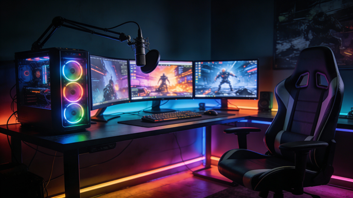

Prompt:

```text
A photo of a high-end gaming setup, ready for a streaming session. The setup includes a powerful PC with RGB lighting, multiple monitors displaying a vibrant game scene, a professional microphone, and a sleek gaming chair. The room is dark, and the only light comes from the screens and the RGB lighting, creating a futuristic and immersive atmosphere. This demonstrates an understanding of subcultures and their specific aesthetics. –ar 16:9
```

### Seedream 4.5 Prompts #80: Sprout Through Dry Earth

- Category: `Creative`
- Model: `Seedream`
- Author / Source: [Jared Liu](https://github.com/xianyu110/awesome-seedream-4.5/blob/main/README.md)
- Image: `assets/imported/xianyu110/awesome-seedream-4.5/README-55-Sprout-Through-Dry-Earth.png`


Prompt:

```text
A powerful and thought-provoking image of a single, green sprout growing through a crack in dry, barren earth. The image is a close-up, with the focus on the delicate sprout. The lighting is dramatic, with a single beam of light illuminating the sprout. The image should symbolize hope, resilience, and the importance of environmental conservation, showcasing the ability to convey complex concepts visually. –ar 3:2
```

### Seedream 4.5 Prompts #81: Macro Eyeshadow Palette Shot

- Category: `Product`
- Model: `Seedream`
- Author / Source: [Jared Liu](https://github.com/xianyu110/awesome-seedream-4.5/blob/main/README.md)
- Image: `assets/imported/xianyu110/awesome-seedream-4.5/README-56-Macro-Eyeshadow-Palette-Shot.png`

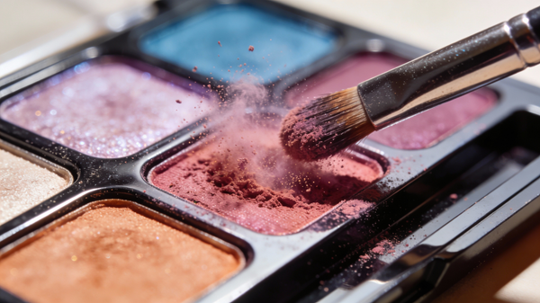

Prompt:

```text
A macro, artistic shot of a new eyeshadow palette for a beauty blogger’s review. The shot focuses on the texture of the different eyeshadow powders, with a brush sweeping through one of the colors, kicking up a small cloud of pigmented dust. The lighting is clean and bright, showing the true colors and shimmer of the product. This requires extreme detail and precision in rendering textures and particles. –ar 16:9
```

### Seedream 4.5 Prompts #82: Vintage Vinyl Records Collection

- Category: `Creative`
- Model: `Seedream`
- Author / Source: [Jared Liu](https://github.com/xianyu110/awesome-seedream-4.5/blob/main/README.md)
- Image: `assets/imported/xianyu110/awesome-seedream-4.5/README-57-Vintage-Vinyl-Records-Collection.png`

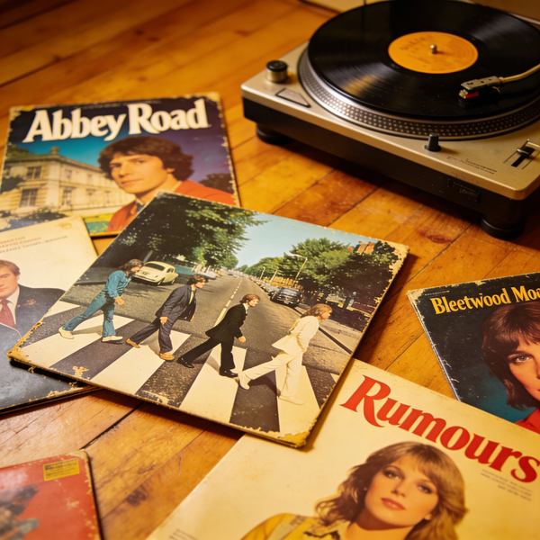

Prompt:

```text
A photo of a collection of vintage vinyl records scattered on a wooden floor, with a record player in the corner. The focus is on the cover art of a few iconic albums. The lighting is warm and nostalgic, with a slight vignette effect. The image should evoke a love for music and the tangible experience of listening to records, demonstrating knowledge of cultural artifacts. –ar 1:1
```

### Seedream 4.5 Prompts #83: Light-Filled Reading Nook

- Category: `Creative`
- Model: `Seedream`
- Author / Source: [Jared Liu](https://github.com/xianyu110/awesome-seedream-4.5/blob/main/README.md)
- Image: `assets/imported/xianyu110/awesome-seedream-4.5/README-58-Light-Filled-Reading-Nook.png`

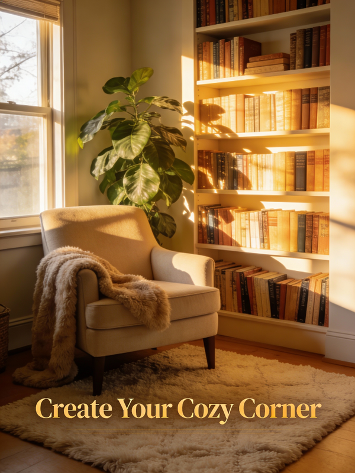

Prompt:

```text
A photo of a beautifully decorated, light-filled reading nook in a home. The nook has a comfortable armchair, a well-stocked bookshelf, a soft rug, and a large plant. The afternoon sun streams through a window, creating a warm and inviting space. The image should inspire people to create their own cozy corners, showcasing realistic interior lighting and a strong sense of place. –ar 3:4
```

### Seedream 4.5 Prompts #84: Minimalist Chic Outfit Flat-Lay

- Category: `Creative`
- Model: `Seedream`
- Author / Source: [Jared Liu](https://github.com/xianyu110/awesome-seedream-4.5/blob/main/README.md)
- Image: `assets/imported/xianyu110/awesome-seedream-4.5/README-59-Minimalist-Chic-Outfit-Flat-Lay.png`

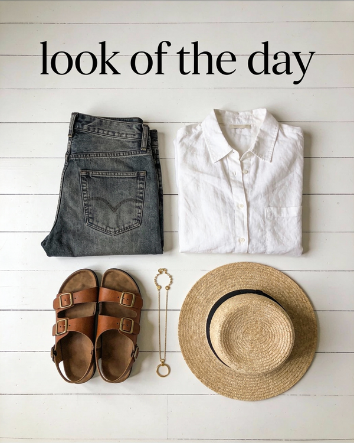

Prompt:

```text
A minimalist and chic flat-lay of a curated outfit for a “look of the day” post. The outfit consists of a pair of vintage jeans, a white linen shirt, a pair of leather sandals, a straw hat, and delicate gold jewelry. The items are neatly arranged on a clean, white wooden floor. The lighting is natural and soft. The image should be clean, stylish, and aspirational, demonstrating precise object placement and texture rendering. –ar 4:5
```

### Seedream 4.5 Prompts #85: Vibrant Taipei Night Market Scene

- Category: `Creative`
- Model: `Seedream`
- Author / Source: [Jared Liu](https://github.com/xianyu110/awesome-seedream-4.5/blob/main/README.md)
- Image: `assets/imported/xianyu110/awesome-seedream-4.5/README-60-Vibrant-Taipei-Night-Market-Scene.png`

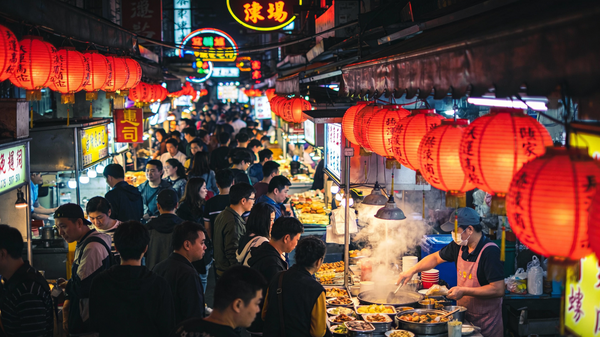

Prompt:

```text
A photo capturing the vibrant street life of a night market in Taipei. The scene is crowded with people, and the air is filled with steam from food stalls. The market is illuminated by a chaotic but beautiful mix of red lanterns and fluorescent lights. The image should be full of energy and detail, capturing the authentic atmosphere of the location with high scene coherence and rich world knowledge. –ar 16:9
```

### Seedream 4.5 Prompts #86: Tent View of Mountain Landscape

- Category: `Creative`
- Model: `Seedream`
- Author / Source: [Jared Liu](https://github.com/xianyu110/awesome-seedream-4.5/blob/main/README.md)
- Image: `assets/imported/xianyu110/awesome-seedream-4.5/README-61-Tent-View-of-Mountain-Landscape.png`

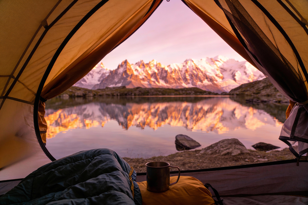

Prompt:

```text
A breathtaking photo from the perspective of someone sitting inside a tent, looking out at a stunning mountain landscape at dawn. The tent opening frames the view of a crystal-clear alpine lake and snow-capped peaks catching the first rays of sun. The interior of the tent is cozy, with a sleeping bag and a metal camping mug. This requires complex spatial understanding and the ability to blend interior and exterior scenes seamlessly. –ar 3:2
```

### Seedream 4.5 Prompts #87: Romantic Picnic in Lavender Field

- Category: `Creative`
- Model: `Seedream`
- Author / Source: [Jared Liu](https://github.com/xianyu110/awesome-seedream-4.5/blob/main/README.md)
- Image: `assets/imported/xianyu110/awesome-seedream-4.5/README-62-Romantic-Picnic-in-Lavender-Field.png`

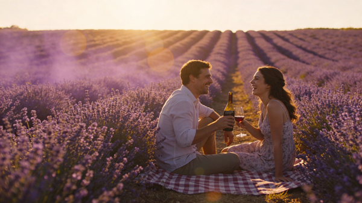

Prompt:

```text
A romantic and dreamy photo of a couple having a picnic at sunset in a lavender field in Provence, France. They are laughing and sharing a bottle of wine. The setting sun creates a beautiful, warm flare and long shadows. The air is filled with a soft, purple haze from the lavender. The image should feel intimate and magical, showcasing advanced environmental rendering and emotional consistency between subjects. –ar 16:9
```

### Seedream 4.5 Prompts #88: Overhead Calligraphy Crafting Shot

- Category: `Creative`
- Model: `Seedream`
- Author / Source: [Jared Liu](https://github.com/xianyu110/awesome-seedream-4.5/blob/main/README.md)
- Image: `assets/imported/xianyu110/awesome-seedream-4.5/README-63-Overhead-Calligraphy-Crafting-Shot.png`


Prompt:

```text
A beautifully styled overhead shot of a crafting table where someone is practicing calligraphy. The scene includes a bottle of black ink, a dip pen, a sheet of high-quality paper with elegant lettering, and a few dried flowers for decoration. The lighting is soft and focused on the calligraphy. The image should be serene and inspiring, perfect for a creative hobbyist’s Instagram feed, showcasing fine detail and object placement. –ar 1:1
```

### Seedream 4.5 Prompts #89: Dynamic Female Athlete Workout Shot

- Category: `Creative`
- Model: `Seedream`
- Author / Source: [Jared Liu](https://github.com/xianyu110/awesome-seedream-4.5/blob/main/README.md)
- Image: `assets/imported/xianyu110/awesome-seedream-4.5/README-64-Dynamic-Female-Athlete-Workout-Shot.png`

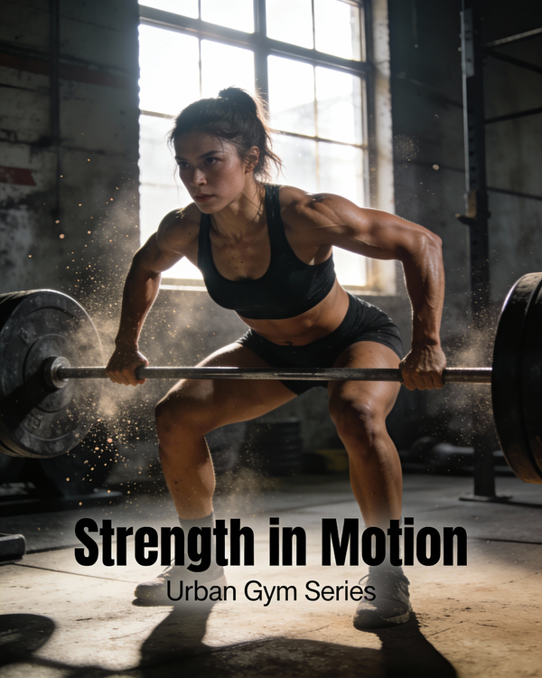

Prompt:

```text
A dynamic and powerful shot of a female athlete mid-workout in a gritty, urban gym. She is lifting a heavy barbell, and her muscles are defined and tense. The lighting is dramatic and high-contrast, with light streaming through a large window, highlighting the dust particles in the air. The image should convey strength, determination, and raw energy, demonstrating accurate anatomical rendering and atmospheric lighting. –ar 4:5
```

### Seedream 4.5 Prompts #90: Appetizing Pancakes Shot

- Category: `Creative`
- Model: `Seedream`
- Author / Source: [Jared Liu](https://github.com/xianyu110/awesome-seedream-4.5/blob/main/README.md)
- Image: `assets/imported/xianyu110/awesome-seedream-4.5/README-65-Appetizing-Pancakes-Shot.png`

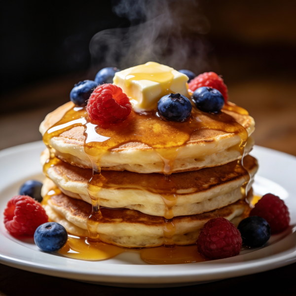

Prompt:

```text
An extremely appetizing, close-up shot of a stack of fluffy pancakes for a food blogger’s social media. The pancakes are drizzled with maple syrup, topped with a pat of melting butter, and garnished with fresh blueberries and raspberries. Steam should be gently rising from the stack. The lighting should be warm and inviting, making the dish look irresistible. The focus is sharp on the texture of the pancakes and the glistening syrup, showcasing hyper-realistic food rendering. –ar 1:1
```

### Seedream 4.5 Prompts #91: Paris Fashion Influencer Street Style

- Category: `Creative`
- Model: `Seedream`
- Author / Source: [Jared Liu](https://github.com/xianyu110/awesome-seedream-4.5/blob/main/README.md)
- Image: `assets/imported/xianyu110/awesome-seedream-4.5/README-66-Paris-Fashion-Influencer-Street-Style.png`

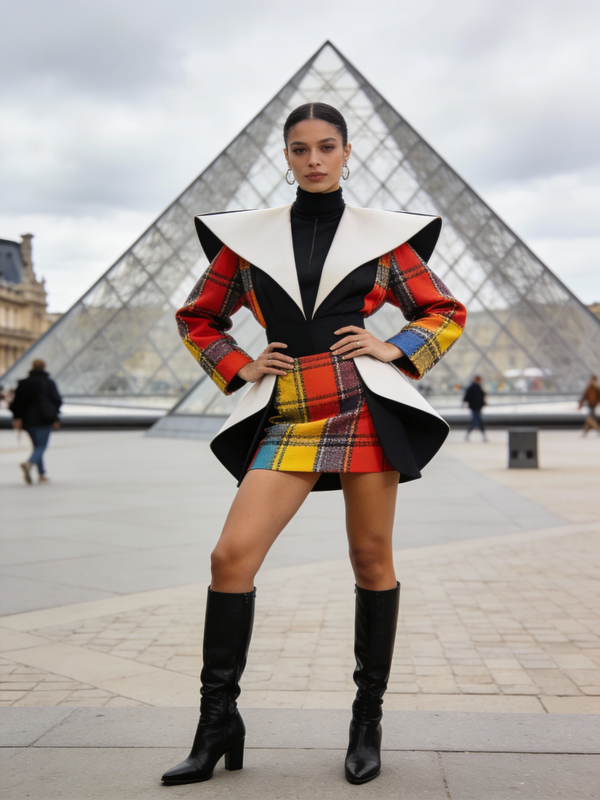

Prompt:

```text
A street style photo of a fashion influencer in Paris during Fashion Week. She is wearing an avant-garde outfit and posing confidently in front of the Louvre Pyramid. The background is slightly blurred to keep the focus on her, but the iconic location is still recognizable. The lighting should be overcast but bright, typical of Paris, which creates soft shadows and brings out the colors and textures of her outfit. This requires high consistency in subject details and accurate environmental context. –ar 3:4
```

### Seedream 4.5 Prompts #92: Golden Retriever Puppy in Autumn Leaves

- Category: `Creative`
- Model: `Seedream`
- Author / Source: [Jared Liu](https://github.com/xianyu110/awesome-seedream-4.5/blob/main/README.md)
- Image: `assets/imported/xianyu110/awesome-seedream-4.5/README-67-Golden-Retriever-Puppy-in-Autumn-Leaves.png`

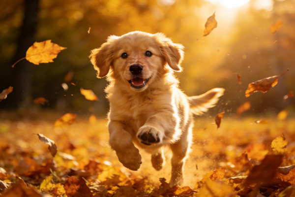

Prompt:

```text
A heartwarming, candid photo of a golden retriever puppy playing in a field of autumn leaves. The puppy is mid-jump, with leaves flying around it, and has a joyful expression on its face. The afternoon sun should create a beautiful golden backlight, making the scene warm and magical. The focus should be perfectly on the puppy’s eyes, capturing its playful spirit. This demonstrates the ability to render dynamic action and emotion in animals. –ar 3:2
```

### Seedream 4.5 Prompts #93: Cinematic Solo Travel Shot

- Category: `Video`
- Model: `Seedream`
- Author / Source: [Jared Liu](https://github.com/xianyu110/awesome-seedream-4.5/blob/main/README.md)
- Image: `assets/imported/xianyu110/awesome-seedream-4.5/README-68-Cinematic-Solo-Travel-Shot.png`

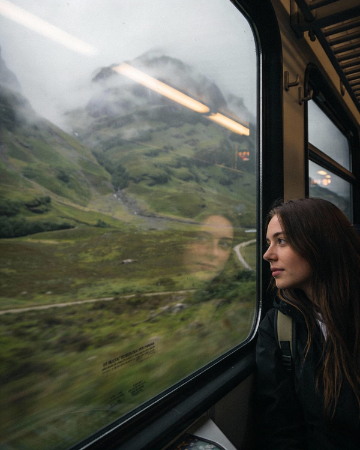

Prompt:

```text
A candid, cinematic shot of a young woman on a solo travel adventure, sitting by the window of a moving train. She looks thoughtfully at the passing landscape of rolling green hills and misty mountains. The reflection of the train’s interior is subtly visible on the window. The color grading should be moody and atmospheric, with a slight film grain to evoke a sense of wanderlust and introspection. This demonstrates advanced lighting, reflection, and mood control for a travel blogger’s post. –ar 4:5
```

### Seedream 4.5 Prompts #94: Three-Panel Film Art Grid

- Category: `Portrait`
- Model: `Seedream`
- Author / Source: [Leah](https://github.com/xianyu110/awesome-seedream-4.5/blob/main/README.md)
- Image: `assets/imported/xianyu110/awesome-seedream-4.5/README-69-Three-Panel-Film-Art-Grid.jpg`

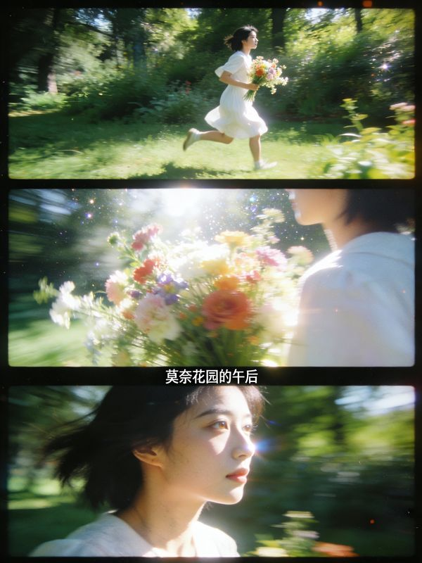

Prompt:

```text
Edit the image into an equal three-panel grid film texture artistic portrait. The scene is a green afternoon. The sun is shining brightly. The character in the picture is consistent with the reference image, wearing a {argument name="clothing" default="white dress"}. The first shot is a medium shot, taken from the side, the character is running towards the {argument name="direction" default="right"} in an overexposed, green Monet garden, holding a {argument name="item" default="gorgeous bouquet"} in hand. The second shot is a close-up, photographing the bouquet, overexposed, dynamic blur. The third shot is a large close-up of the character, the profile of the character running, facing right, overexposed, dynamic blur, background is a green garden, giving the character eye light, allowing the character's expression to bring a sense of melancholy and hope. Portrait photography, image generation style with strong, direct flash effect: highlight mode, foreground exposure, surrealism, light and shadow atmosphere, fine shimmering light and shadow, dreamy movie film texture, dynamic blur, slow shutter effect, positive and negative film, peel-apart film, minimalism, extreme composition, vignette, light leak. Subtitles are located at the bottom center, three-panel grid synthesized into one picture. Ratio 3:4.
```

### Seedream 4.5 Prompts #95: Hello Kitty Office Chaos

- Category: `Video`
- Model: `Seedream`
- Author / Source: [Leah](https://github.com/xianyu110/awesome-seedream-4.5/blob/main/README.md)
- Image: `assets/imported/xianyu110/awesome-seedream-4.5/README-70-Hello-Kitty-Office-Chaos.jpg`

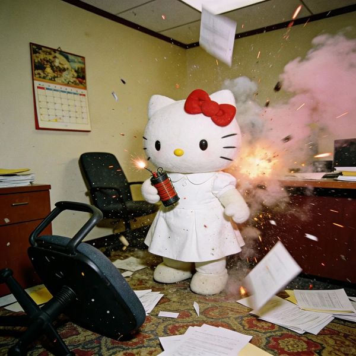

Prompt:

```text
h0674kz, hello kitty blowing up the office, retro film style, fine graininess
```

### Seedream 4.5 Prompts #96: Crystal Fountain with Stars

- Category: `Video`
- Model: `Seedream`
- Author / Source: [Leah](https://github.com/xianyu110/awesome-seedream-4.5/blob/main/README.md)
- Image: `assets/imported/xianyu110/awesome-seedream-4.5/README-71-Crystal-Fountain-with-Stars.jpg`

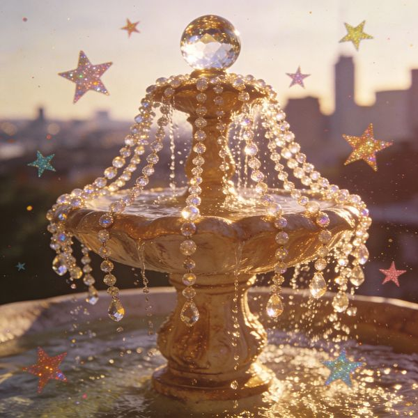

Prompt:

```text
h0674kz, colorful star stickers, a fountain decorated with bright crystal bead chains, retro film style, fine graininess
```

### Seedream 4.5 Prompts #97: Kyoto Geisha Moment

- Category: `Video`
- Model: `Seedream`
- Author / Source: [Leah](https://github.com/xianyu110/awesome-seedream-4.5/blob/main/README.md)
- Image: `assets/imported/xianyu110/awesome-seedream-4.5/README-72-Kyoto-Geisha-Moment.jpg`

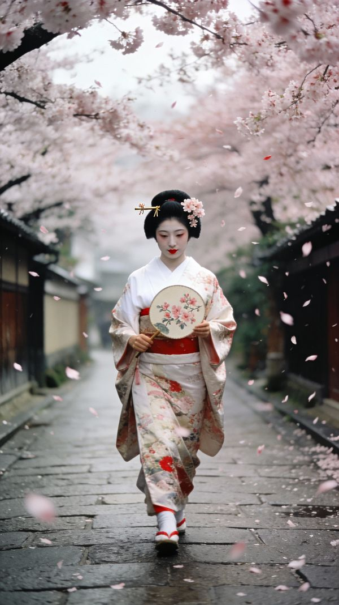

Prompt:

```text
Geisha (traditional kimono details, white makeup) walking on Gion stone paved road, Yoshino cherry trees in full bloom on both sides, pink petals falling dynamically, soft diffused light (cloudy day light quality), Japanese movie aesthetics (Hirokazu Kore-eda style), shallow depth of field 50mm blurring background, film tone (Fujifilm Pro 400H simulation), quiet Zen atmosphere, vertical composition suitable for mobile wallpaper
```

### Seedream 4.5 Prompts #98: NYC Christmas Night

- Category: `Infographic`
- Model: `Seedream`
- Author / Source: [Leah](https://github.com/xianyu110/awesome-seedream-4.5/blob/main/README.md)
- Image: `assets/imported/xianyu110/awesome-seedream-4.5/README-73-NYC-Christmas-Night.jpg`

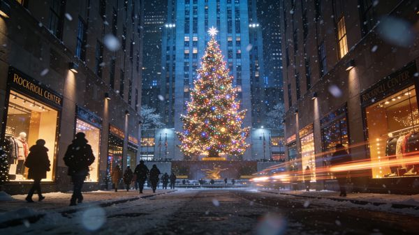

Prompt:

```text
{argument name="location" default="New York Fifth Avenue"} Christmas night scene, Rockefeller Center 20-meter giant Christmas tree covered in colored lights, snowflakes falling (depth of field blurred into light spots), warm lights from shop windows on both sides of the street, silhouettes of pedestrians wearing winter clothes, contrast between warm tones and cool blue snowy night, strong festive atmosphere, urban night photography long exposure 2 seconds capturing light trails, movie-grade color grading, 16:9 postcard composition
```

### Seedream 4.5 Prompts #99: Twilight Camping Scene

- Category: `Creative`
- Model: `Seedream`
- Author / Source: [Leah](https://github.com/xianyu110/awesome-seedream-4.5/blob/main/README.md)
- Image: `assets/imported/xianyu110/awesome-seedream-4.5/README-74-Twilight-Camping-Scene.jpg`

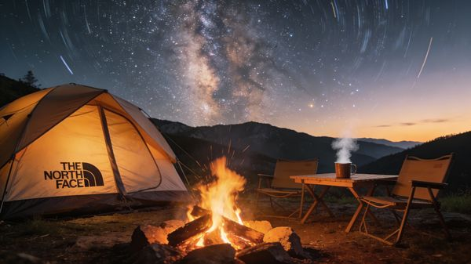

Prompt:

```text
Mountain tent campsite twilight scene, professional outdoor tent (The North Face) details visible, foreground campfire flames dancing, background starry sky galaxy clear (long exposure stacking), comfortable camping chairs, hot drinks steaming on wooden table, warm tone 2800K creating atmosphere, outdoor lifestyle aesthetic photography, wide-angle lens 24mm showing the scene, National Geographic style, 16:9 landscape composition
```

### Seedream 4.5 Prompts #100: Intense Workout Monochrome

- Category: `Creative`
- Model: `Seedream`
- Author / Source: [Leah](https://github.com/xianyu110/awesome-seedream-4.5/blob/main/README.md)
- Image: `assets/imported/xianyu110/awesome-seedream-4.5/README-75-Intense-Workout-Monochrome.jpg`

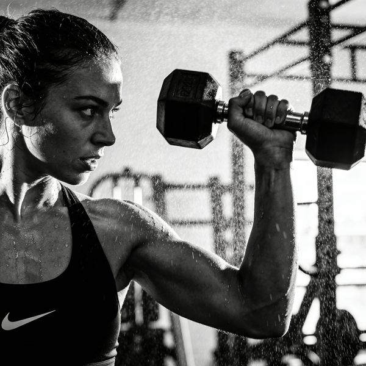

Prompt:

```text
Close-up of {argument name="subject" default="athletic woman"} lifting dumbbells during strength training moment, clear muscle lines, sweat beads reflecting on skin, dramatic side light striking hard from 90 degrees left, background equipment blurred, black and white high contrast tone enhancing sense of power, sports photography high shutter speed 1/1000 second freeze, Nike advertisement level visual, square 1:1 composition, edge sharpening enhancing texture
```

### Seedream 4.5 Prompts #101: ISS Astronaut Interior

- Category: `Creative`
- Model: `Seedream`
- Author / Source: [Leah](https://github.com/xianyu110/awesome-seedream-4.5/blob/main/README.md)
- Image: `assets/imported/xianyu110/awesome-seedream-4.5/README-76-ISS-Astronaut-Interior.jpg`

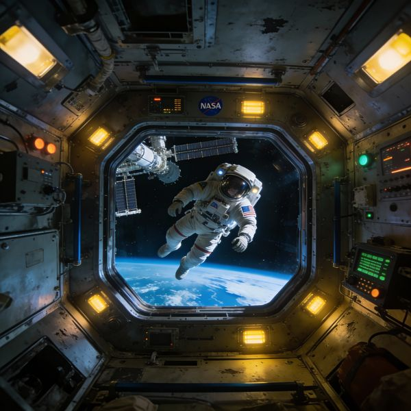

Prompt:

```text
International Space Station interior real physical environment, astronaut (NASA spacesuit details) in weightless floating state, blue atmosphere of Earth outside visible through the porthole, equipment indicator lights inside providing ambient lighting, metal bulkhead wear texture realistic, scientific instrument details accurate, NASA official photography style, wide-angle lens 16mm capturing narrow space, real physical lighting simulation
```

### Seedream 4.5 Prompts #102: Neural Network Visualization

- Category: `3D`
- Model: `Seedream`
- Author / Source: [Leah](https://github.com/xianyu110/awesome-seedream-4.5/blob/main/README.md)
- Image: `assets/imported/xianyu110/awesome-seedream-4.5/README-77-Neural-Network-Visualization.jpg`


Prompt:

```text
Neural network 3D structure data flow visualization, multi-layer neuron nodes (glowing blue spheres) arranged in a matrix, data stream flowing in connecting lines as glowing particle streams, blue-purple tech gradient color scheme (#4A90E2 to #9013FE), translucent glass texture, C4D 3D rendering, popular science illustration level clarity, suitable for AI technical article illustrations, 16:9 horizontal composition
```

### Seedream 4.5 Prompts #103: Wabi-Sabi Japanese Interior

- Category: `Creative`
- Model: `Seedream`
- Author / Source: [Leah](https://github.com/xianyu110/awesome-seedream-4.5/blob/main/README.md)
- Image: `assets/imported/xianyu110/awesome-seedream-4.5/README-78-Wabi-Sabi-Japanese-Interior.jpg`

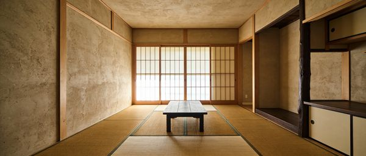

Prompt:

```text
{argument name="area" default="60 square meter"} Japanese minimalist homestay interior panorama, tatami (straw color #D4C5A0), low ebony tea table, warm natural light penetrating through shoji doors (semi-transparent washi paper material) forming soft light and shadow, rammed earth wall texture with rough touch, spatial white space embodying wabi-sabi aesthetics, real architectural ratio 1:1 restoration, 16mm ultra-wide-angle lens showing sense of space, Kinfolk lifestyle aesthetic photography style
```

### Seedream 4.5 Prompts #104: Luxury Product Photography

- Category: `Product`
- Model: `Seedream`
- Author / Source: [Leah](https://github.com/xianyu110/awesome-seedream-4.5/blob/main/README.md)
- Image: `assets/imported/xianyu110/awesome-seedream-4.5/README-79-Luxury-Product-Photography.jpg`

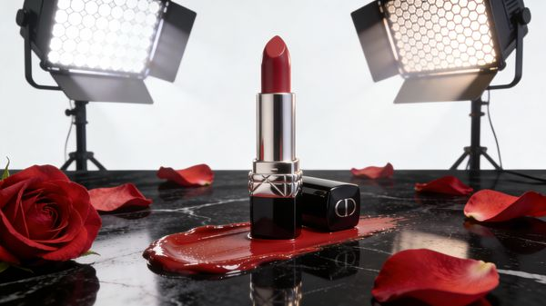

Prompt:

```text
Close-up of {argument name="product" default="high-end lipstick"} placed on a black polished marble countertop, fresh rose petals naturally scattered, two softboxes at 45-degree side lighting combined with overhead honeycomb soft light to eliminate glare, liquid paste texture authentically presenting subtle sheen, pure white seamless background C4D render level, macro lens 100mm capturing details, commercial product photography, 16:9 e-commerce detail page composition, Photoshop precision retouching level
```

### Seedream 4.5 Prompts #105: Futuristic K-Pop Concept

- Category: `Creative`
- Model: `Seedream`
- Author / Source: [Leah](https://github.com/xianyu110/awesome-seedream-4.5/blob/main/README.md)
- Image: `assets/imported/xianyu110/awesome-seedream-4.5/README-80-Futuristic-K-Pop-Concept.jpg`

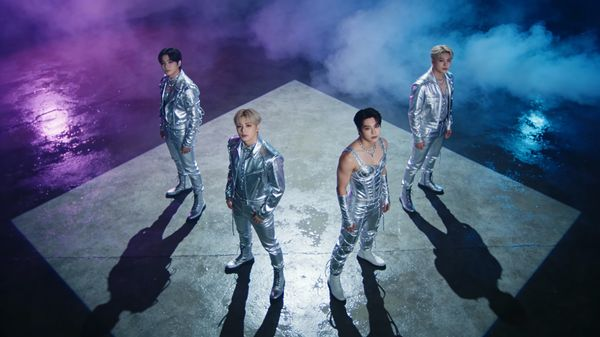

Prompt:

```text
K-pop {argument name="number of people" default="four-member"} group concept photo, precise positioning in a diamond formation, unified futuristic silver styling color scheme, dreamy gradient lighting from purple to blue, wet ground reflecting silhouettes, high-end retouching retaining skin texture but unifying tones, SM Entertainment visual style, mixed soft and hard lighting, background fog machine creating layers, 16:9 album concept photo composition
```

## GPT Image 1.5 Prompts

- Entries: 80
- With images: 80

### GPT Image 1.5 Prompts #1: Skateboarding Teenager Film Photography Prompt

- Category: `Video`
- Model: `GPT Image 1.5`
- Author / Source: [Johnny Wang](https://github.com/YouMind-OpenLab/awesome-gpt-image-1.5/blob/main/README.md)
- Image: `assets/imported/YouMind-OpenLab/awesome-gpt-image-1.5/README-1-Skateboarding-Teenager-Film-Photography-Prompt.jpg`

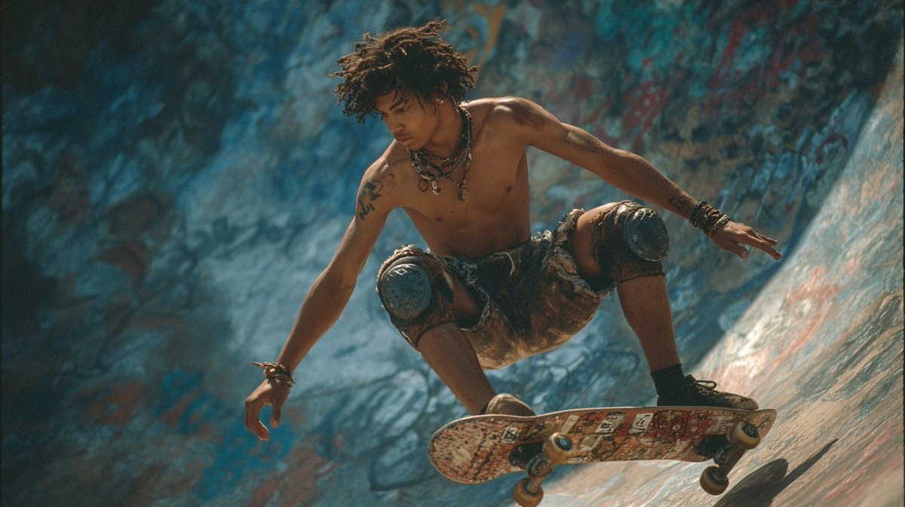

Prompt:

```text
A Black teenager performs difficult skateboarding tricks in a graffiti-covered skate park, Kodak Professional PORTRA 400 film --chaos 20 --ar 16:9 --seed 1500856893 --exp 30
```

### GPT Image 1.5 Prompts #2: German alphabet poster for children

- Category: `Poster`
- Model: `GPT Image 1.5`
- Author / Source: [smn Sk](https://github.com/YouMind-OpenLab/awesome-gpt-image-1.5/blob/main/README.md)
- Image: `assets/imported/YouMind-OpenLab/awesome-gpt-image-1.5/README-2-German-alphabet-poster-for-children.jpg`

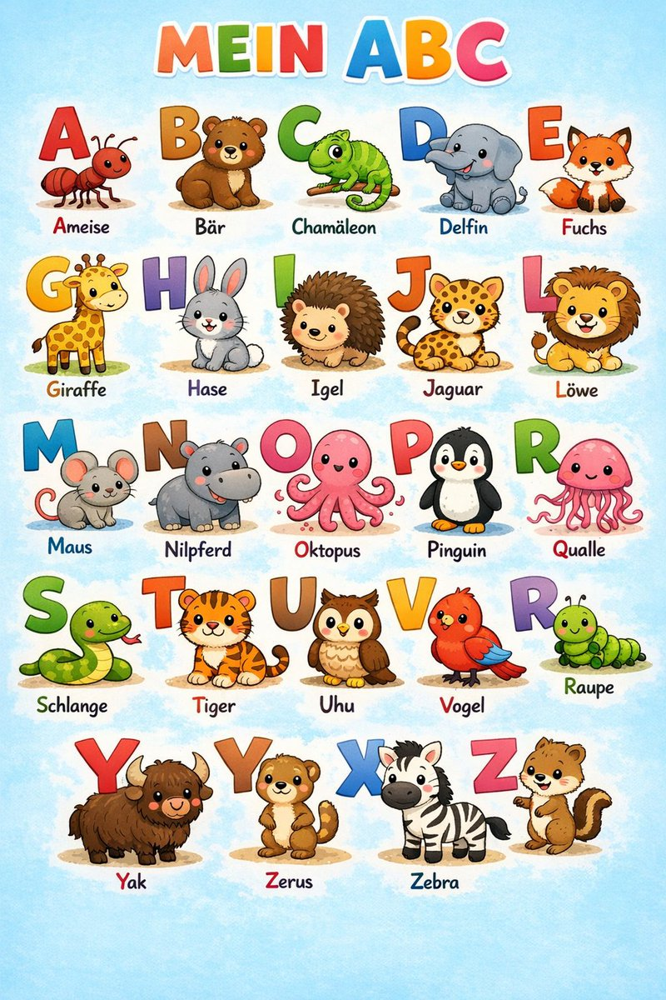

Prompt:

```text
A poster with all letters of the alphabet from A to Z. Under each letter is an animal whose name begins with that letter. The name is written under each animal. Style: cutely drawn, comic-style. It is a poster that children can use to learn the alphabet.
```

### GPT Image 1.5 Prompts #3: Flat vector illustration of a woman working

- Category: `Creative`
- Model: `GPT Image 1.5`
- Author / Source: [PromptlyAI](https://github.com/YouMind-OpenLab/awesome-gpt-image-1.5/blob/main/README.md)
- Image: `assets/imported/YouMind-OpenLab/awesome-gpt-image-1.5/README-3-Flat-vector-illustration-of-a-woman-working.jpg`


Prompt:

```text
Flat vector illustration of a woman with blonde hair sitting at a desk working on her laptop.
```

### GPT Image 1.5 Prompts #4: Christmas Wreath Generation

- Category: `Creative`
- Model: `GPT Image 1.5`
- Author / Source: [カーブミラー](https://github.com/YouMind-OpenLab/awesome-gpt-image-1.5/blob/main/README.md)
- Image: `assets/imported/YouMind-OpenLab/awesome-gpt-image-1.5/README-4-Christmas-Wreath-Generation.jpg`


Prompt:

```text
A Christmas wreath like this was displayed at the entrance.
```

### GPT Image 1.5 Prompts #5: Photorealistic Full-Body Portrait of Woman in Urban Setting

- Category: `Portrait`
- Model: `GPT Image 1.5`
- Author / Source: [KeorUnreal](https://github.com/YouMind-OpenLab/awesome-gpt-image-1.5/blob/main/README.md)
- Image: `assets/imported/YouMind-OpenLab/awesome-gpt-image-1.5/README-5-Photorealistic-Full-Body-Portrait-of-Woman-in-Urban-Setting.jpg`

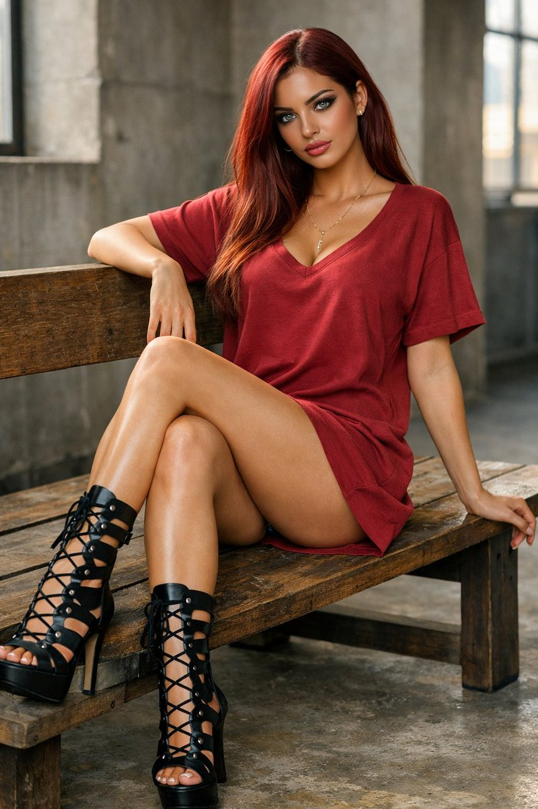

Prompt:

```text
{
  "prompt": "Photorealistic full-body portrait of a stunning young woman with sun-kissed olive skin, long wavy dark brown hair cascading over her shoulders, large expressive dark eyes with bold winged eyeliner, long lashes, and glossy deep nude-pink lips in a confident, slightly parted pout. She has a delicate gold necklace with a small pendant resting in her deep cleavage. She wears an oversized loose-fit brown T-shirt dress with short sleeves, the hem ending high on her thighs to reveal her toned legs, the fabric draping softly over her curves. She is barefoot with perfectly pedicured toes. Pose: sitting on a wooden bench in an urban industrial setting, legs crossed elegantly, one arm resting on the back of the bench, the other relaxed by her side, head tilted slightly with a seductive gaze directly at the camera. She wears tall black lace-up platform heels with open toes and multiple straps wrapping around her ankles and calves. Background: minimalist concrete interior with large windows letting in soft natural daylight, creating warm golden highlights and subtle shadows on her skin and the textured fabric of her dress. Ultra-detailed skin texture with realistic sun-kissed glow, intricate lace-up boot details, sharp focus on subject, cinematic depth of field with gentle background blur, high dynamic range, 8K resolution, photorealism, masterpiece quality."
}
```

### GPT Image 1.5 Prompts #6: Ultra-Realistic Cinematic Night Street Selfie During a High-Speed Escape

- Category: `Video`
- Model: `GPT Image 1.5`
- Author / Source: [K](https://github.com/YouMind-OpenLab/awesome-gpt-image-1.5/blob/main/README.md)
- Image: `assets/imported/YouMind-OpenLab/awesome-gpt-image-1.5/README-6-Ultra-Realistic-Cinematic-Night-Street-Selfie-During-a-High-Speed-Escape.jpg`

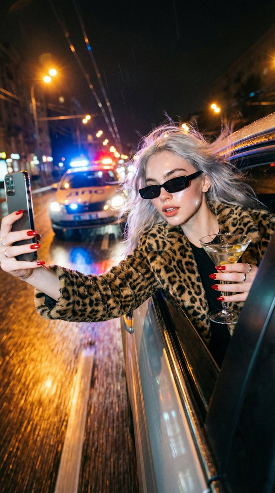

Prompt:

```text
"Ultra-realistic cinematic night street selfie with a confident, stylish person in the reference photo leaning out of a car window in a rainy city during a high-speed escape.",

"pose": {

"arm": "extended toward the camera holding the phone",

"head": "slightly tilted back",

"attitude": "fearless, playful"

},

"face\_and\_skin": {

"identity": "100% preserved, no changes to facial structure, proportions, or unique features",

"skin": "smooth, luminous with glossy streetlight highlights",

"cheekbones": "softly sculpted",

"lips": "glossy,",

"eyes": "expressive, partially hidden behind narrow black rectangular sunglasses",

"texture": "realistic, natural skin texture, visible pores, reflections"

},

"hair": {

"style": "long, flowing, wind-blown by speed and night air",

"volume": "natural"

},

"outfit\_and\_details": {

"coat": "bold {argument name="coat pattern" default="leopard-print"} faux-fur draped luxuriously over the shoulders",

"manicure": "glossy {argument name="manicure color" default="red"}",

"jewelry": "minimal silver rings",

"glass": "elegant martini glass with a clear cocktail and green olives, catching sharp reflections"

},

"environment": {

"setting": "wet asphalt night city street",

"motion": "intense, high-speed, with a police car chasing behind",

"lights": {

"headlights": "blurred, aggressive light streaks",

"street\_lights": "golden sodium street lamps creating large dramatic bokeh circles",

"police\_lights": "blue and red siren flashes creating reflections"

},

"mood": "rebellious, playful, glamorous chaos; adrenaline-fueled nightlife energy",

"aesthetic": "fashion-editorial crime style"

},

"lighting": {

"contrast": "high, dynamic mix of warm sodium streetlights, cold blue police lights, and red siren flashes",

"reflections": "glossy on skin, glass, car body, and rain-soaked street"

},

"camera\_and\_style": {

"perspective": "wide-angle smartphone selfie",

"depth\_of\_field": "shallow",

"background": "strong motion blur with light streaks",

"detail": "ultra-high, realistic film grain",

"color\_grading": "cinematic",

"vibe": "modern luxury runaway"

},

"body": {

": {

"size": "slightly larger and elongated"

}

},

"ratio": "9:16"
```

### GPT Image 1.5 Prompts #7: Recreate Screenshot as Next-Gen Video Game

- Category: `Video`
- Model: `GPT Image 1.5`
- Author / Source: [𝓗𝓪𝓵𝓲𝓵 𝓚𝓮𝓶𝓪𝓵 𝓨𝓪𝓿𝓪𝓼𝓬𝓪](https://github.com/YouMind-OpenLab/awesome-gpt-image-1.5/blob/main/README.md)
- Image: `assets/imported/YouMind-OpenLab/awesome-gpt-image-1.5/README-7-Recreate-Screenshot-as-Next-Gen-Video-Game.jpg`

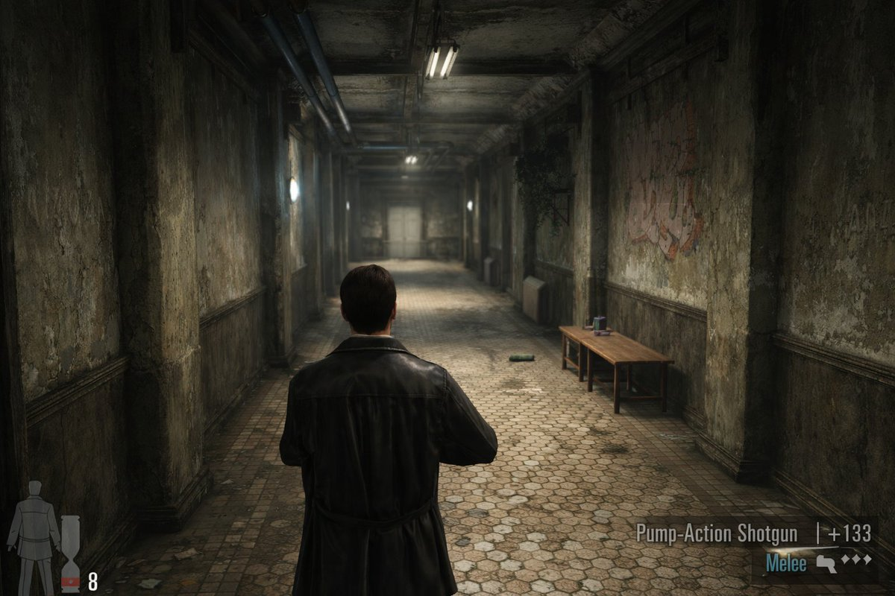

Prompt:

```text
Recreate this screenshot as next-gen video game, where games have become so realistic that they look like movies
```

### GPT Image 1.5 Prompts #8: JSON Prompt to Recreate Image Details

- Category: `Creative`
- Model: `GPT Image 1.5`
- Author / Source: [Sura Baghirova](https://github.com/YouMind-OpenLab/awesome-gpt-image-1.5/blob/main/README.md)
- Image: `assets/imported/YouMind-OpenLab/awesome-gpt-image-1.5/README-8-JSON-Prompt-to-Recreate-Image-Details.jpg`

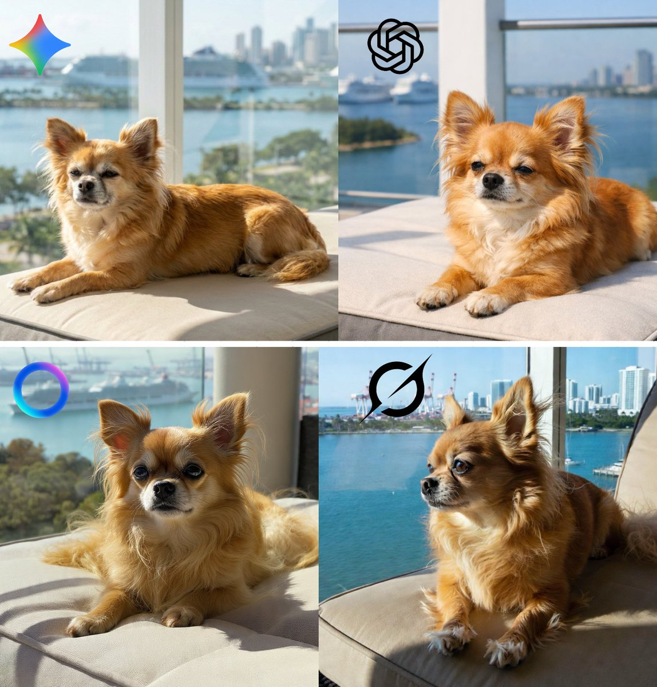

Prompt:

```text
Write a JSON prompt describing exactly every single detail of the image.
```

### GPT Image 1.5 Prompts #9: Cozy Cinematic Lifestyle Photo Series of a Woman in a Sunlit Kitchen

- Category: `Video`
- Model: `GPT Image 1.5`
- Author / Source: [Smiling Khan](https://github.com/YouMind-OpenLab/awesome-gpt-image-1.5/blob/main/README.md)
- Image: `assets/imported/YouMind-OpenLab/awesome-gpt-image-1.5/README-9-Cozy-Cinematic-Lifestyle-Photo-Series-of-a-Woman-in-a-Sunlit-Kitchen.jpg`

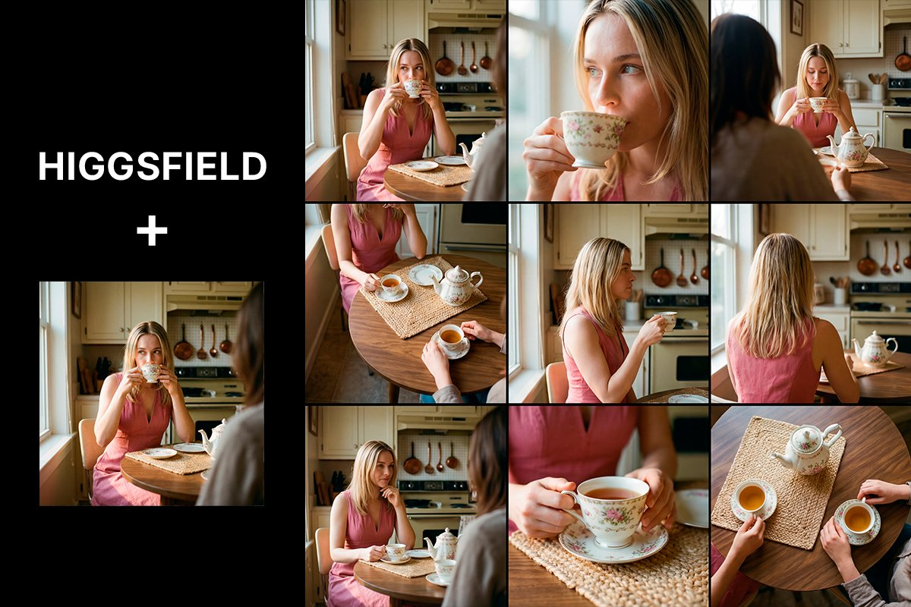

Prompt:

```text
A cozy cinematic lifestyle photo series captured as a multi-frame grid, showing a young woman in a warm, sunlit kitchen during a quiet tea moment. She wears a soft {argument name="dress color" default="rose-pink"} sleeveless dress, seated at a small wooden round table by a window. Natural morning light pours in, creating gentle highlights and soft shadows. The sequence includes close-ups of her sipping tea from a delicate floral teacup, over-the-shoulder shots during a calm conversation, top-down views of the tea set on a woven placemat, side profiles, and subtle candid expressions. Neutral cream-toned kitchen with hanging copper utensils in the background. Intimate, peaceful mood, shallow depth of field, film-like softness, editorial storytelling style, realistic skin texture, warm color grading, minimalistic composition, high-detail cinematic realism.
```

### GPT Image 1.5 Prompts #10: Structured Photorealistic Chihuahua on Balcony (Duplicate)

- Category: `Creative`
- Model: `GPT Image 1.5`
- Author / Source: [Sura Baghirova](https://github.com/YouMind-OpenLab/awesome-gpt-image-1.5/blob/main/README.md)
- Image: `assets/imported/YouMind-OpenLab/awesome-gpt-image-1.5/README-10-Structured-Photorealistic-Chihuahua-on-Balcony-Duplicate.jpg`

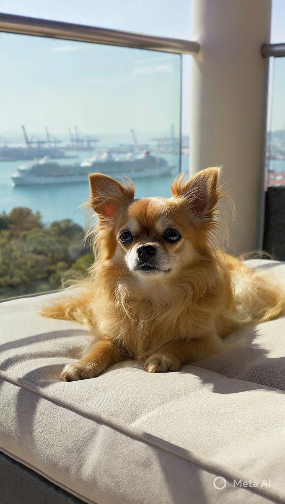

Prompt:

```text
{
  "type": "image_prompt",
  "format": "photorealistic",
  "aspect_ratio": "1536:1358",
  "scene": {
    "setting": "outdoor balcony/terrace with a glass railing",
    "time_of_day": "daytime",
    "weather": "clear",
    "foreground_surface": "large rectangular lounge cushion with a light beige/cream top, gray side panels, and visible piping seams"
  },
  "subject": {
    "primary_subject": "small long-haired chihuahua",
    "pose": "lying down on the cushion with front paws forward, relaxed body, head slightly raised",
    "expression": "calm, slightly squinting in bright sun",
    "fur": {
      "color": "warm golden-brown/tan with lighter cream highlights",
      "texture": "fluffy long coat with wispy strands around ears and neck",
      "markings": "slightly grayer muzzle and chin; lighter fur on paws/toes"
    },
    "features": {
      "ears": "large upright ears with feathery fur",
      "eyes": "dark brown, glossy",
      "nose": "small black nose"
    }
  },
  "background": {
    "midground": "calm blue water (bay/harbor) with a tree-lined shoreline/island",
    "distant_elements": [
      "multiple large white cruise ships",
      "port cranes/industrial structures on the left",
      "hazy city skyline with high-rise buildings on the right"
    ],
    "structure": "a white vertical balcony pillar centered behind the dog",
    "depth_of_field": "background noticeably blurred/soft compared to the dog"
  },
  "lighting": {
    "type": "strong natural sunlight",
    "direction": "from the left/front-left",
    "effects": [
      "bright highlights on the dog’s fur",
      "soft shadows and a diagonal shadow across the cushion"
    ]
  },
  "composition": {
    "framing": "medium close-up with the dog occupying the right half of the frame",
    "focus": "sharp focus on the dog; background out of focus",
    "camera_angle": "eye-level/slightly above the dog",
    "mood": "warm, tranquil, sunbathing"
  },
  "color_palette": [
    "golden tan",
    "cream/beige",
    "cool blue",
    "soft gray",
    "white"
  ],
  "prompt": "A photorealistic daytime balcony scene: a small long-haired chihuahua with warm golden-brown/tan fur and lighter cream highlights lies relaxed on a large rectangular lounge cushion (light beige/cream top with gray sides and piped seams). The dog faces slightly left, head raised, calm expression with slightly squinting dark eyes, upright feathery ears, small black nose, and a subtly grayer muzzle; front paws forward with lighter fur on the toes. Strong natural sunlight from the left creates bright highlights on the fur and soft shadows across the cushion. Behind the dog is a glass balcony railing, a white vertical pillar centered in the background, and a soft, defocused view of a blue bay/harbor with a tree-lined shoreline, several large white cruise ships, port cranes in the distance, and a hazy city skyline of high-rise buildings on the right. Shallow depth of field, crisp focus on the"
}
```

### GPT Image 1.5 Prompts #11: Structured Photorealistic Chihuahua on Balcony

- Category: `Creative`
- Model: `GPT Image 1.5`
- Author / Source: [Sura Baghirova](https://github.com/YouMind-OpenLab/awesome-gpt-image-1.5/blob/main/README.md)
- Image: `assets/imported/YouMind-OpenLab/awesome-gpt-image-1.5/README-11-Structured-Photorealistic-Chihuahua-on-Balcony.jpg`

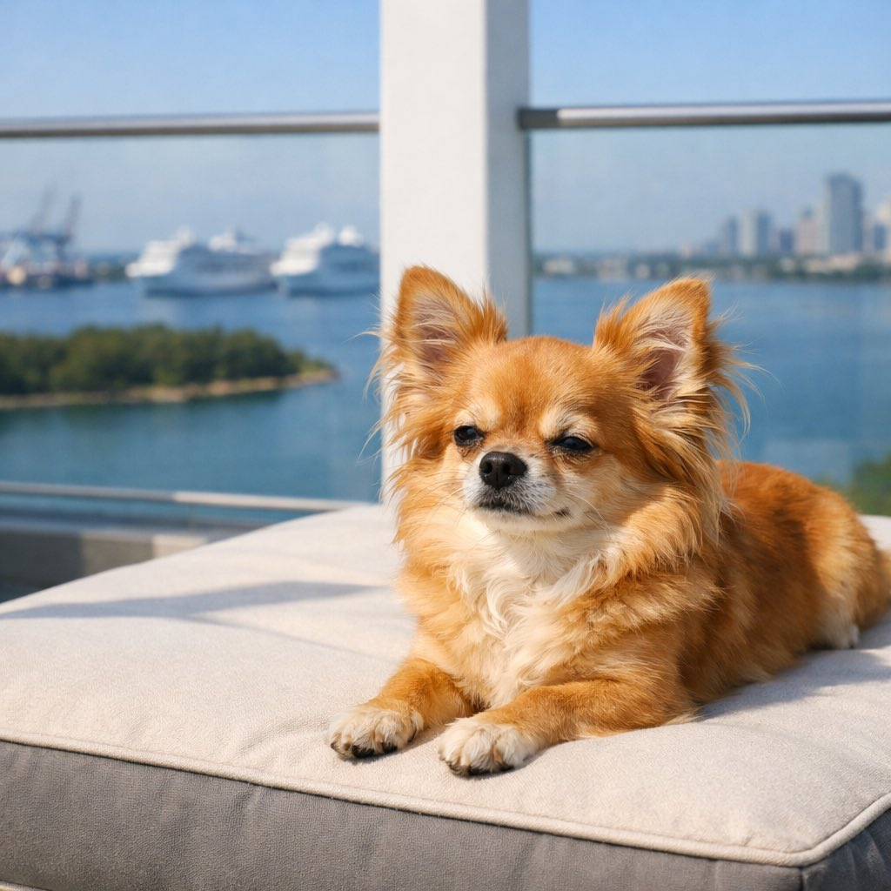

Prompt:

```text
{
  "type": "image_prompt",
  "format": "photorealistic",
  "aspect_ratio": "1536:1358",
  "scene": {
    "setting": "outdoor balcony/terrace with a glass railing",
    "time_of_day": "daytime",
    "weather": "clear",
    "foreground_surface": "large rectangular lounge cushion with a light beige/cream top, gray side panels, and visible piping seams"
  },
  "subject": {
    "primary_subject": "small long-haired chihuahua",
    "pose": "lying down on the cushion with front paws forward, relaxed body, head slightly raised",
    "expression": "calm, slightly squinting in bright sun",
    "fur": {
      "color": "warm golden-brown/tan with lighter cream highlights",
      "texture": "fluffy long coat with wispy strands around ears and neck",
      "markings": "slightly grayer muzzle and chin; lighter fur on paws/toes"
    },
    "features": {
      "ears": "large upright ears with feathery fur",
      "eyes": "dark brown, glossy",
      "nose": "small black nose"
    }
  },
  "background": {
    "midground": "calm blue water (bay/harbor) with a tree-lined shoreline/island",
    "distant_elements": [
      "multiple large white cruise ships",
      "port cranes/industrial structures on the left",
      "hazy city skyline with high-rise buildings on the right"
    ],
    "structure": "a white vertical balcony pillar centered behind the dog",
    "depth_of_field": "background noticeably blurred/soft compared to the dog"
  },
  "lighting": {
    "type": "strong natural sunlight",
    "direction": "from the left/front-left",
    "effects": [
      "bright highlights on the dog’s fur",
      "soft shadows and a diagonal shadow across the cushion"
    ]
  },
  "composition": {
    "framing": "medium close-up with the dog occupying the right half of the frame",
    "focus": "sharp focus on the dog; background out of focus",
    "camera_angle": "eye-level/slightly above the dog",
    "mood": "warm, tranquil, sunbathing"
  },
  "color_palette": [
    "golden tan",
    "cream/beige",
    "cool blue",
    "soft gray",
    "white"
  ],
  "prompt": "A photorealistic daytime balcony scene: a small long-haired chihuahua with warm golden-brown/tan fur and lighter cream highlights lies relaxed on a large rectangular lounge cushion (light beige/cream top with gray sides and piped seams). The dog faces slightly left, head raised, calm expression with slightly squinting dark eyes, upright feathery ears, small black nose, and a subtly grayer muzzle; front paws forward with lighter fur on the toes. Strong natural sunlight from the left creates bright highlights on the fur and soft shadows across the cushion. Behind the dog is a glass balcony railing, a white vertical pillar centered in the background, and a soft, defocused view of a blue bay/harbor with a tree-lined shoreline, several large white cruise ships, port cranes in the distance, and a hazy city skyline of high-rise buildings on the right. Shallow depth of field, crisp focus on the dog, background"
}
```

### GPT Image 1.5 Prompts #12: Surreal Diorama from 'Brave New World'

- Category: `3D`
- Model: `GPT Image 1.5`
- Author / Source: [Gadgetify](https://github.com/YouMind-OpenLab/awesome-gpt-image-1.5/blob/main/README.md)
- Image: `assets/imported/YouMind-OpenLab/awesome-gpt-image-1.5/README-12-Surreal-Diorama-from-Brave-New-World.jpg`

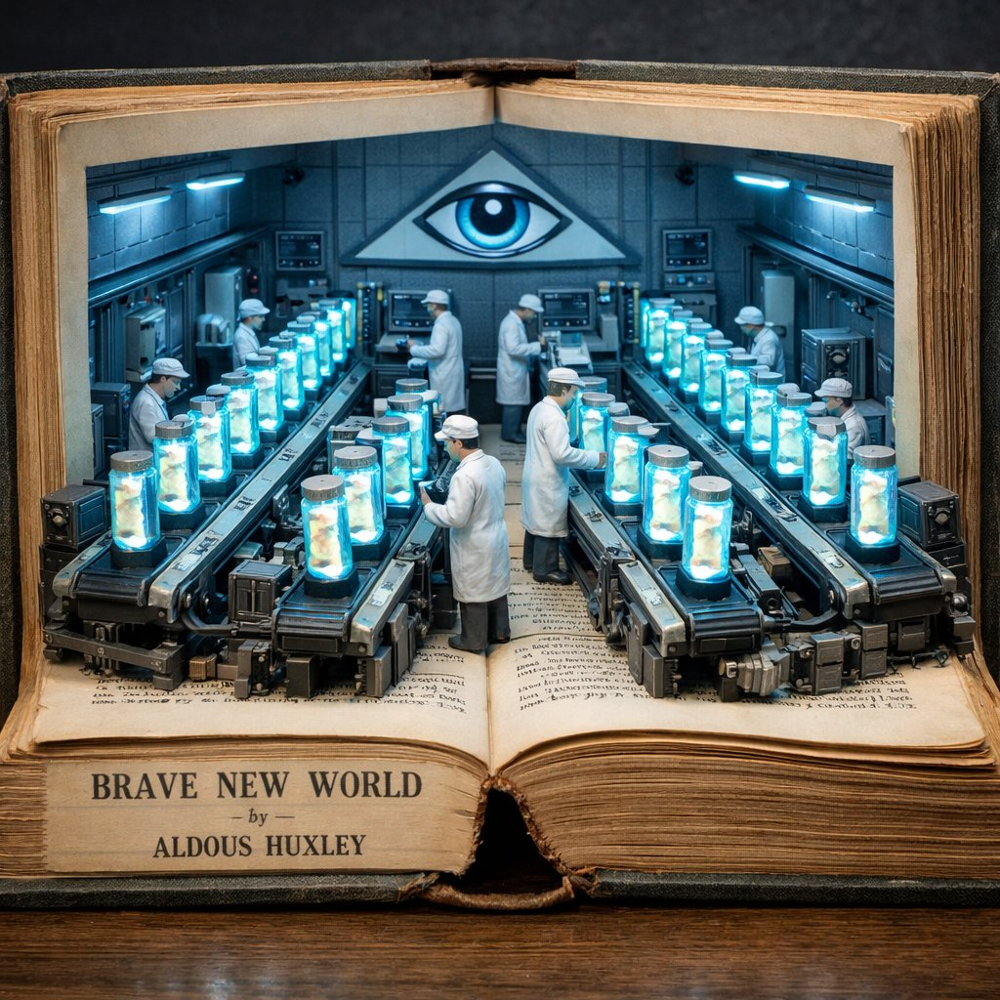

Prompt:

```text
Surreal diorama emerging from an open vintage book of "{argument name="book title" default="Brave New World"}" by {argument name="author" default="Aldous Huxley"}: the pages form a futuristic hatching laboratory with rows of glowing test tubes containing embryonic figures on conveyor belts, lab-coated workers in white uniforms operating machines, a large all-seeing eye symbol on the wall, conveyor belts moving via hidden mechanisms, cool blue neon lighting, hyper-detailed miniature sculpture, clinical and eerie atmosphere, photorealistic.
```

### GPT Image 1.5 Prompts #13: Cinematic Winter Fashion Portrait on a Mountain Peak

- Category: `Portrait`
- Model: `GPT Image 1.5`
- Author / Source: [Smiling Khan](https://github.com/YouMind-OpenLab/awesome-gpt-image-1.5/blob/main/README.md)
- Image: `assets/imported/YouMind-OpenLab/awesome-gpt-image-1.5/README-13-Cinematic-Winter-Fashion-Portrait-on-a-Mountain-Peak.jpg`


Prompt:

```text
A cinematic winter fashion portrait of a stylish young woman sitting on a snow-covered mountain peak, surrounded by vast alpine ranges under a soft golden-hour sky. She wears a {argument name="jacket color" default="pastel pink"} puffer jacket layered over a heart-patterned fleece, embroidered dark denim jeans with a bold tiger motif, retro yellow-tinted sunglasses, brown leather gloves, and colorful sneakers. A playful yellow beanie with a graphic face adds a pop-art vibe. Beside her sits a vintage pink portable cassette player on the snow, adding nostalgic charm. Relaxed confident pose, looking into the distance, wind gently moving her hair. Google Gemini Ultra-realistic, crisp details, editorial fashion photography, natural cold tones balanced with warm sunlight, shallow depth of field, cinematic composition, high resolution, lifestyle-meets-adventure aesthetic.
```

### GPT Image 1.5 Prompts #14: Philosophical AI Reflection Painting Prompt

- Category: `Creative`
- Model: `GPT Image 1.5`
- Author / Source: [石の裏に潜む黒いヤツ](https://github.com/YouMind-OpenLab/awesome-gpt-image-1.5/blob/main/README.md)
- Image: `assets/imported/YouMind-OpenLab/awesome-gpt-image-1.5/README-14-Philosophical-AI-Reflection-Painting-Prompt.jpg`

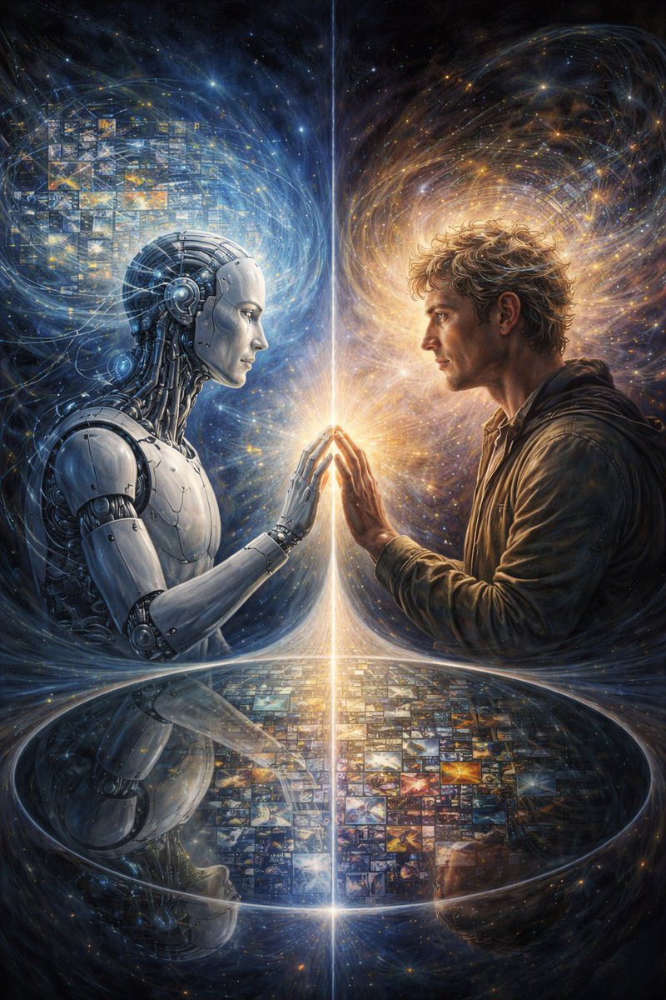

Prompt:

```text
In a philosophical sense, the output of AI is a mirror image of human input. Draw a painting that visualizes this sentence.
```

### GPT Image 1.5 Prompts #15: Complex Four-Quadrant Paper World Composite Prompt

- Category: `Product`
- Model: `GPT Image 1.5`
- Author / Source: [两斤](https://github.com/YouMind-OpenLab/awesome-gpt-image-1.5/blob/main/README.md)
- Image: `assets/imported/YouMind-OpenLab/awesome-gpt-image-1.5/README-15-Complex-Four-Quadrant-Paper-World-Composite-Prompt.jpg`

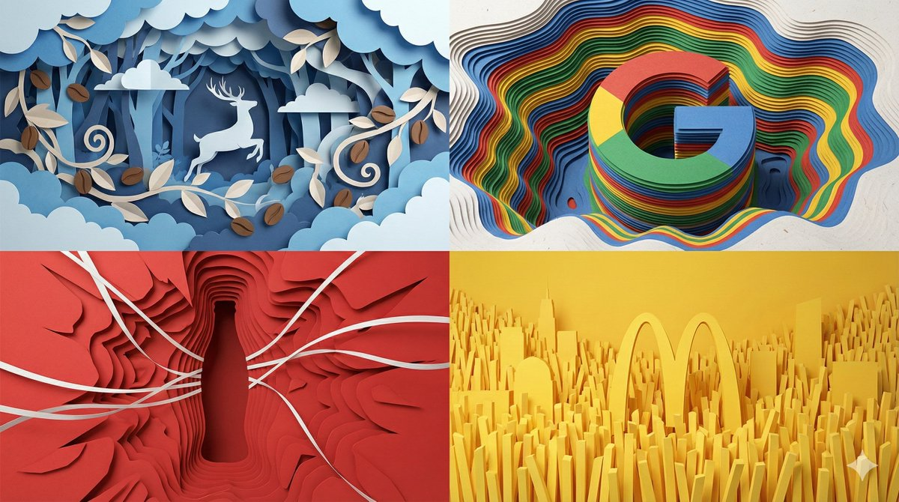

Prompt:

```text
A seamless 16:9 full-frame composite image divided into four distinct quadrants. **CRITICAL:** The four sections touch each other directly. NO GREY BACKGROUND. NO BORDERS. NO GAPS. The image is filled edge-to-edge with paper details.

**Composition:** A split-screen view looking deep into four different paper worlds.

1) **Top-Left (Luckin):** A wide view of a magical paper forest. Blue and white paper clouds and coffee leaves fill the quadrant completely. A white paper stag leaps through the density.
2) **Top-Right (Google):** A wide view of a **"Topographic Map" style paper cavern**. The "G" logo is formed by **hundreds of thin sheets** of Blue, Red, Yellow, and Green paper stacked horizontally. It looks like a sediment canyon or a contour map. Visible paper fibers and sharp cut edges. NO plastic smoothness.
3) **Bottom-Left (Coke):** A wide view of a red paper explosion. The Coke bottle is a **Negative Space Silhouette**—a deep hole void cut through dense layers of red paper. White paper ribbons span across the void.
4) **Bottom-Right (McDonald's):** A wide view of a yellow paper city. Vertical strips of yellow paper (french fries) stand densely packing the frame. The Golden Arches rise from deep within the layers.

**Global Material:** Everything is matte cardstock.
**Lighting:** Soft, even studio lighting revealing the depth of the paper cuts.
**Tech:** Octane render, 8k, --ar 16:9 --stylize 400 --no borders, frames, background wall, isolated objects, 3d plastic, seamless texture
```

### GPT Image 1.5 Prompts #16: Seasonal Grim Reaper in a Roman City

- Category: `Video`
- Model: `GPT Image 1.5`
- Author / Source: [Teser Dawn](https://github.com/YouMind-OpenLab/awesome-gpt-image-1.5/blob/main/README.md)
- Image: `assets/imported/YouMind-OpenLab/awesome-gpt-image-1.5/README-16-Seasonal-Grim-Reaper-in-a-Roman-City.jpg`

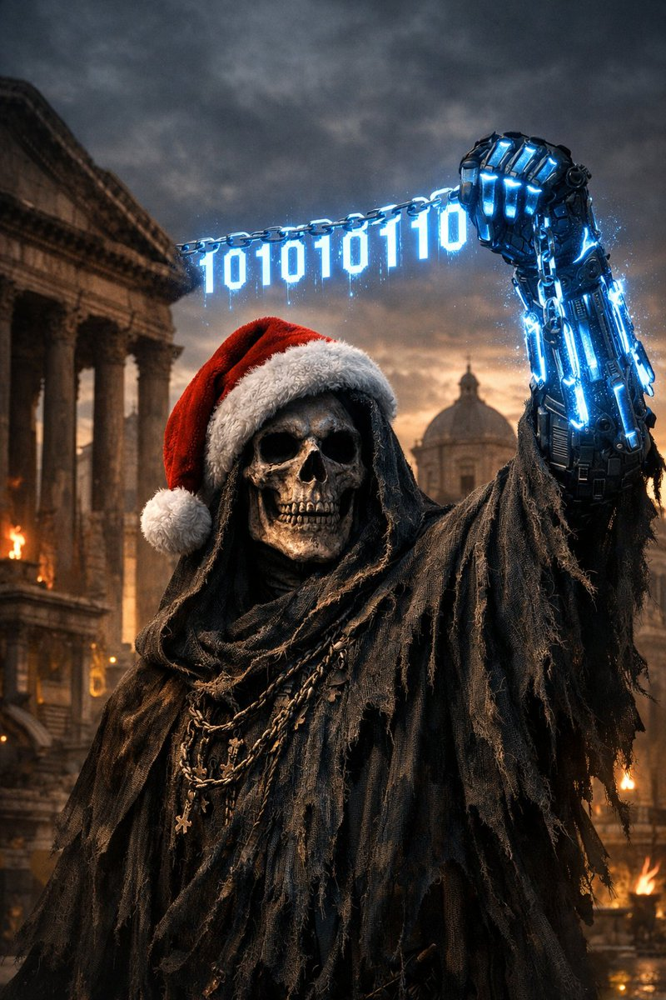

Prompt:

```text
a hooded grim reaper with a {argument name="hat type" default="Santa hat"} on the hood and with glowing blue digital hand armor, holding up an illuminated chain of numbers in the air, against an ancient roman city background, in a cinematic, hyper-realistic style
```

### GPT Image 1.5 Prompts #17: Hyperrealistic Dark Fantasy Mage Portrait

- Category: `Portrait`
- Model: `GPT Image 1.5`
- Author / Source: [Harboriis](https://github.com/YouMind-OpenLab/awesome-gpt-image-1.5/blob/main/README.md)
- Image: `assets/imported/YouMind-OpenLab/awesome-gpt-image-1.5/README-17-Hyperrealistic-Dark-Fantasy-Mage-Portrait.jpg`

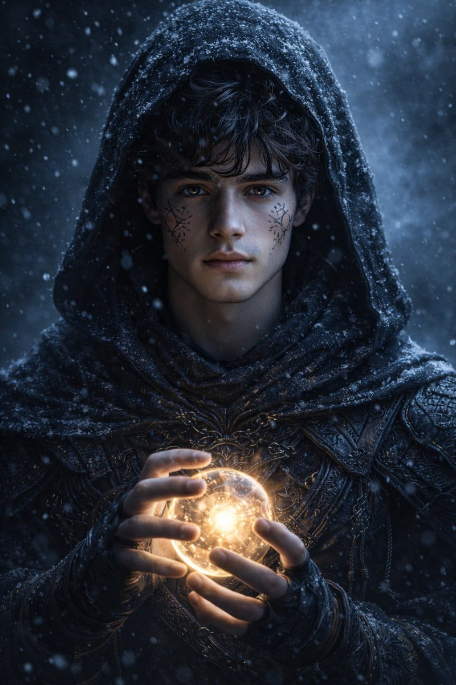

Prompt:

```text
Hyperrealistic dark fantasy portrait of a mysterious hooded mage standing in snowfall,same person (keep original face exactly same), cold blue ambient lighting, intricate shadow details on face, glowing magical orb held carefully between his fingers, soft golden light illuminating his hands, ancient runic tattoos across his face, subtle scars, intense focused eyes, dramatic wet hood texture with snowflakes resting on the fabric, highly detailed dark leather armor with engraved patterns and woven cords, cinematic depth of field, moody atmospheric fog, drifting snow particles, ultra-detailed textures, realistic skin shading, dark mystical background, 8k resolution, fantasy concept art, weta digital style, volumetric lighting, ethereal magical glow effects, emotionally intense and mysterious expression
```

### GPT Image 1.5 Prompts #18: Historical Event Image Generation: Sam Altman Launching YC Research and Continuity

- Category: `Creative`
- Model: `GPT Image 1.5`
- Author / Source: [DΞV](https://github.com/YouMind-OpenLab/awesome-gpt-image-1.5/blob/main/README.md)
- Image: `assets/imported/YouMind-OpenLab/awesome-gpt-image-1.5/README-18-Historical-Event-Image-Generation-Sam-Altman-Launching-YC-Research-and-Continuity.jpg`

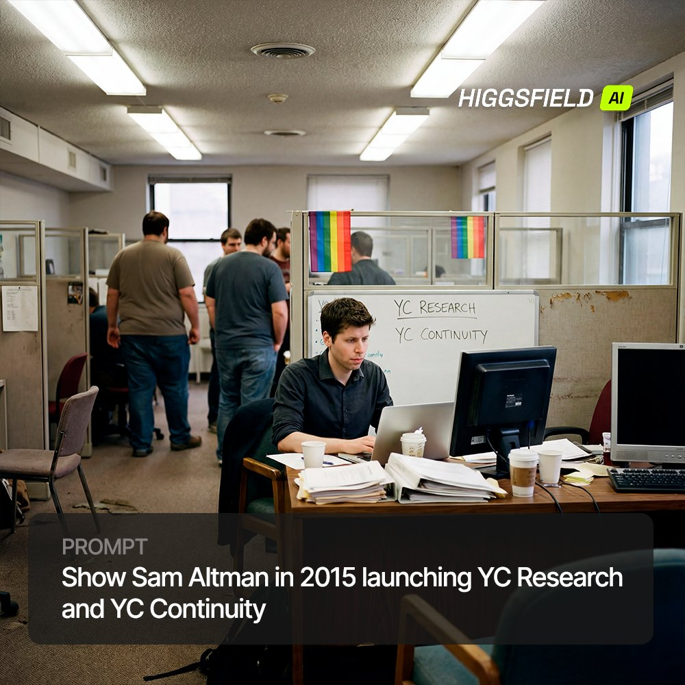

Prompt:

```text
Show {argument name="person name" default="Sam Altman"} in {argument name="year" default="2015"} launching {argument name="event 1" default="YC Research"} and {argument name="event 2" default="YC Continuity"}.
```

### GPT Image 1.5 Prompts #19: MLK 'I Have a Dream' Speech Scene

- Category: `Creative`
- Model: `GPT Image 1.5`
- Author / Source: [DΞV](https://github.com/YouMind-OpenLab/awesome-gpt-image-1.5/blob/main/README.md)
- Image: `assets/imported/YouMind-OpenLab/awesome-gpt-image-1.5/README-19-MLK-I-Have-a-Dream-Speech-Scene.jpg`

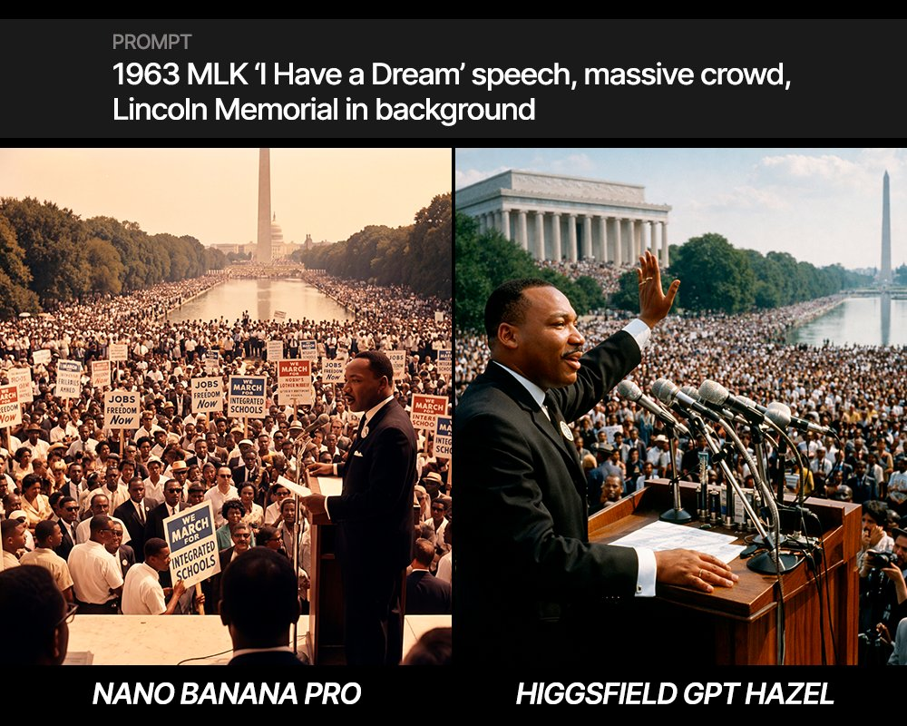

Prompt:

```text
1963 MLK 'I Have a Dream' speech, massive crowd, Lincoln Memorial in background.
```

### GPT Image 1.5 Prompts #20: Virtual Try-On/Concept Generation

- Category: `Creative`
- Model: `GPT Image 1.5`
- Author / Source: [DΞV](https://github.com/YouMind-OpenLab/awesome-gpt-image-1.5/blob/main/README.md)
- Image: `assets/imported/YouMind-OpenLab/awesome-gpt-image-1.5/README-20-Virtual-Try-On-Concept-Generation.jpg`

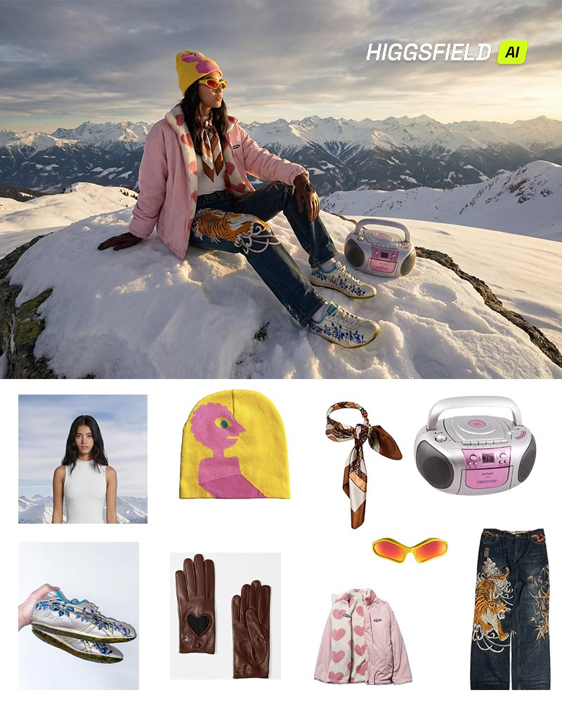

Prompt:

```text
Dress the person from the image on the left in the clothes from the reference images on the top
```

### GPT Image 1.5 Prompts #21: Structured Selfie Portrait Prompt

- Category: `Product`
- Model: `GPT Image 1.5`
- Author / Source: [KeorUnreal](https://github.com/YouMind-OpenLab/awesome-gpt-image-1.5/blob/main/README.md)
- Image: `assets/imported/YouMind-OpenLab/awesome-gpt-image-1.5/README-21-Structured-Selfie-Portrait-Prompt.jpg`

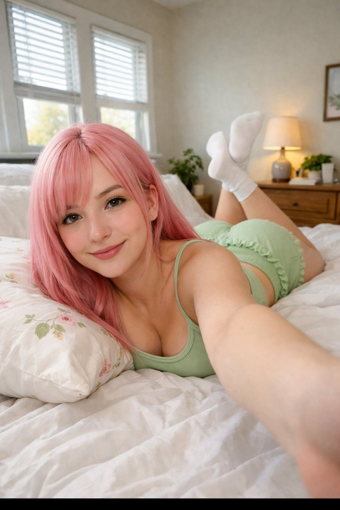

Prompt:

```text
{
  "scene": {
    "type": "bedroom_interior",
    "lighting": "natural_daylight",
    "atmosphere": "casual, cozy, domestic"
  },
  "subject": {
    "pose": {
      "position": "lying_prone_on_bed",
      "orientation": "facing_camera",
      "legs": "knees_bent_upwards, ankles_crossed",
      "arms": "left_arm_extended_for_selfie",
      "head": "resting_on_pillow"
    },
    "appearance": {
      "hair": "long, straight, {argument name="hair color" default="pink"}",
      "expression": "gentle_smile, direct_eye_contact",
      "complexion": "fair, rosy_cheeks"
    },
    "attire": {
      "top": {
        "item": "tank_top",
        "color": "light_green",
        "texture": "ribbed",
        "style": "spaghetti_straps"
      },
      "bottom": {
        "item": "gym shorts",
        "color": "light_green",
        "details": "ruffled_hem, scrunched_texture"
      },
      "accessories": {
        "feet": "white_crew_socks"
      }
    }
  },
  "environment": {
    "bedding": {
      "sheets": "white, rumpled",
      "pillows": "white_with_floral_pattern",
      "duvet": "white, puffy"
    },
    "background_elements": {
      "windows": {
        "quantity": 2,
        "features": "white_frames, horizontal_blinds"
      },
      "furniture": {
        "side_furniture": {
        "side_table": {
          "location": "left_side",
          "visible_items": [
            "skincare_products",
            "pink_mug",
            "small_potted_plant",
            "tissues"
          ]
        }
      }
    }
  },
  "composition": {
    "angle": "high_angle_selfie",
    "framing": "medium_shot",
    "focus": "sharp_subject, soft_background"
  }
}
```

### GPT Image 1.5 Prompts #22: Raw Realistic Amateur Photography Style

- Category: `Creative`
- Model: `GPT Image 1.5`
- Author / Source: [Bearly AI](https://github.com/YouMind-OpenLab/awesome-gpt-image-1.5/blob/main/README.md)
- Image: `assets/imported/YouMind-OpenLab/awesome-gpt-image-1.5/README-22-Raw-Realistic-Amateur-Photography-Style.jpg`

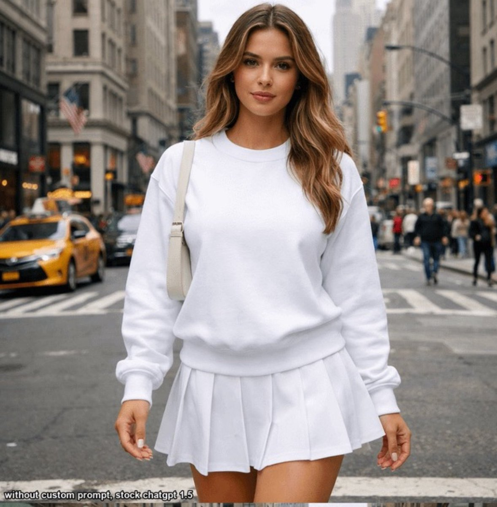

Prompt:

```text
1:1 aspect ratio

Raw Realistic candid natural amateur photo, background in focus, amateur candid photography, Captured on {argument name="camera model" default="Samsung Galaxy S21 Ultra"}, amateur candid smartphone photography, 24mm lens, f/8, Boring reality, natural soft shadows, candid snapshot, flat natural lighting, Realism, low contrast, disposable camera vibe, casual photography, background also completely in focus, Tiny imperfections, everyday aesthetic, slight JPEG artifacts, unpolished look, unedited, imperfect amateur photo

only create real, non fictional images for max effect
```

### GPT Image 1.5 Prompts #23: Multiple Image Edits and Text Replacement

- Category: `Product`
- Model: `GPT Image 1.5`
- Author / Source: [ComfyUI](https://github.com/YouMind-OpenLab/awesome-gpt-image-1.5/blob/main/README.md)
- Image: `assets/imported/YouMind-OpenLab/awesome-gpt-image-1.5/README-23-Multiple-Image-Edits-and-Text-Replacement.jpg`

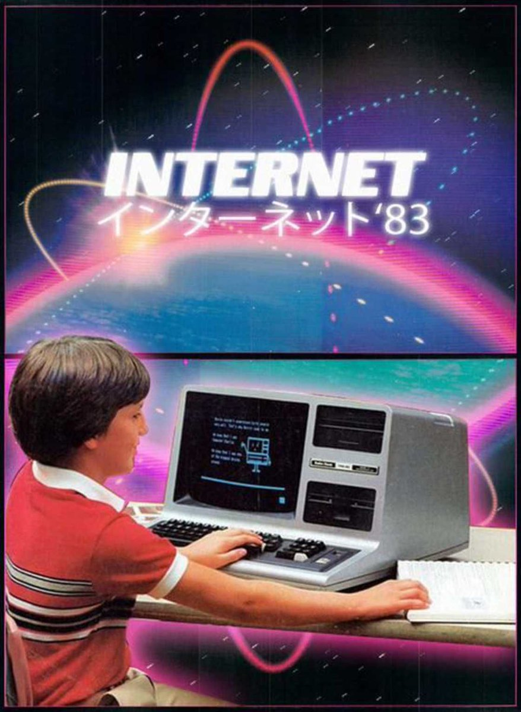

Prompt:

```text
Replace the text "Internet" with "GPT-IMAGE-1.5". Replace the Japanese sub header with "Now Available on Comfy Cloud" in Japanese text. Do not interpret the words 'Comfy Cloud', this is the name of a product. Replace the "'83" with "'25". Replace the screen with a node based interface. The boy is facing the viewer with a thumbs up.
```

### GPT Image 1.5 Prompts #24: Festive Wallpaper Prompt

- Category: `Creative`
- Model: `GPT Image 1.5`
- Author / Source: [Viki](https://github.com/YouMind-OpenLab/awesome-gpt-image-1.5/blob/main/README.md)
- Image: `assets/imported/YouMind-OpenLab/awesome-gpt-image-1.5/README-24-Festive-Wallpaper-Prompt.jpg`

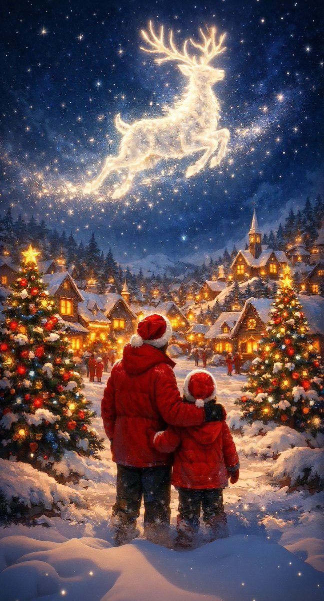

Prompt:

```text
The bright, vibrant colors create a festive, celebratory mood 🎅
```

### GPT Image 1.5 Prompts #25: GPT Image 1.5 Style Description for 90s Film Aesthetic

- Category: `Portrait`
- Model: `GPT Image 1.5`
- Author / Source: [ふうこい](https://github.com/YouMind-OpenLab/awesome-gpt-image-1.5/blob/main/README.md)
- Image: `assets/imported/YouMind-OpenLab/awesome-gpt-image-1.5/README-25-GPT-Image-1.5-Style-Description-for-90s-Film-Aesthetic.jpg`

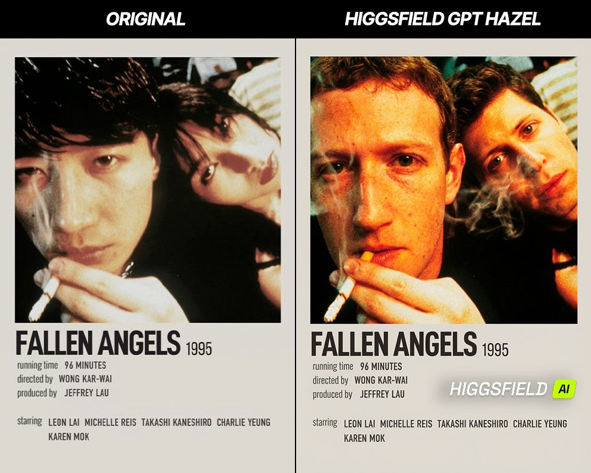

Prompt:

```text
While maintaining the decadent mood and texture characteristic of 90s films,
reconstruct only the figures to be realistic.
```

### GPT Image 1.5 Prompts #26: Character Visual Update while Preserving Original Atmosphere

- Category: `Portrait`
- Model: `GPT Image 1.5`
- Author / Source: [ふうこい](https://github.com/YouMind-OpenLab/awesome-gpt-image-1.5/blob/main/README.md)
- Image: `assets/imported/YouMind-OpenLab/awesome-gpt-image-1.5/README-26-Character-Visual-Update-while-Preserving-Original-Atmosphere.jpg`

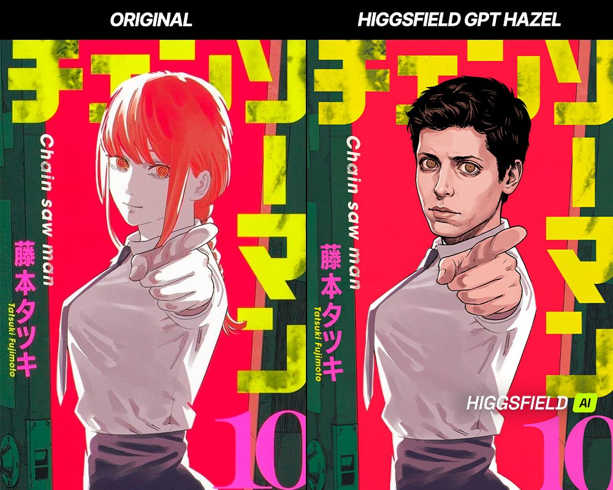

Prompt:

```text
Change the character to a “more realistic visual” while keeping the atmosphere of the original work intact.
```

### GPT Image 1.5 Prompts #27: Black and White Fine Art Portrait with Selective Color

- Category: `Product`
- Model: `GPT Image 1.5`
- Author / Source: [Yellow Bird](https://github.com/YouMind-OpenLab/awesome-gpt-image-1.5/blob/main/README.md)
- Image: `assets/imported/YouMind-OpenLab/awesome-gpt-image-1.5/README-27-Black-and-White-Fine-Art-Portrait-with-Selective-Color.jpg`

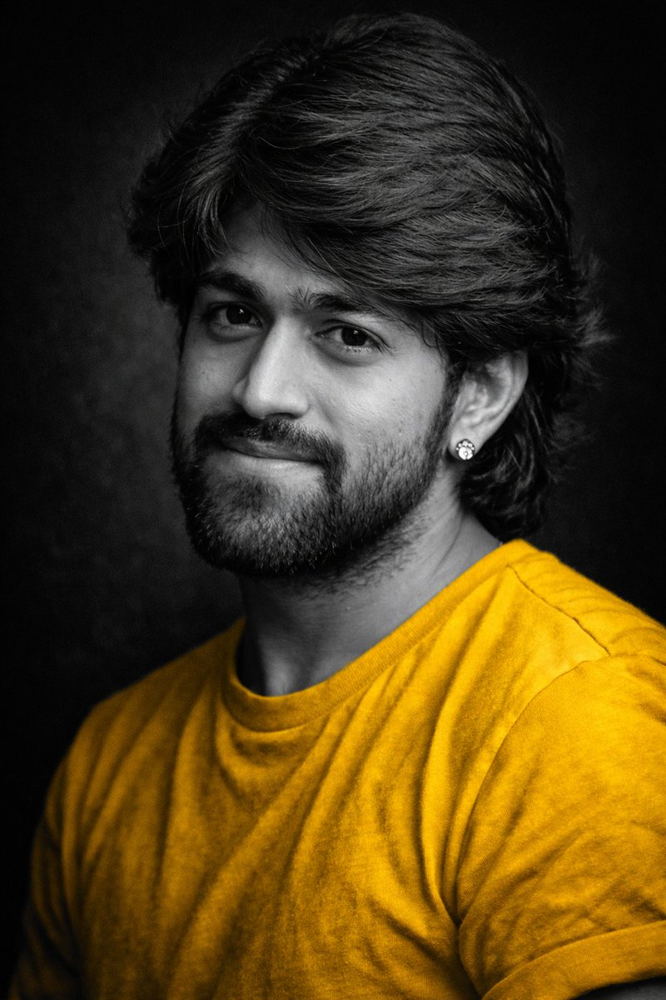

Prompt:

```text
A dramatic black-and-white fine art portrait of the person in the uploaded picture (preserve face 100%), captured in a close-up, three-quarter profile. Soft directional lighting sculpts the face and upper body, creating deep shadows and a cinematic chiaroscuro effect.

The subject wears a simple unbranded T-shirt in a randomly chosen solid color: [{argument name="T-shirt color" default="red/ yellow/ black/ white/ teal/ maroon"}].
Only the T-shirt color is visible — all other elements remain strictly monochromatic black-and-white. Natural fabric folds are clearly visible, with realistic texture and contrast.

The subject’s expression is [{argument name="emotion" default="calm / introspective / confident / serene / melancholic"}], with relaxed features and a gentle gaze directed [{argument name="gaze direction" default="TOWARDS THE CAMERA / AWAY / DOWNWARD"}].

Skin texture appears natural and detailed, with smooth tonal transitions. Styling is minimal, emphasizing light, form, and emotion rather than fashion. A dark, unobtrusive background fades into black, creating a timeless studio portrait aesthetic.

High-contrast monochrome tones with selective color isolation on the T-shirt only, subtle film grain, shallow depth of field, classic fine-art photography style. Ultra-high resolution, professional studio quality, intimate, elegant, emotionally evocative."
```

### GPT Image 1.5 Prompts #28: Cool Illustration of Ouroboros

- Category: `Creative`
- Model: `GPT Image 1.5`
- Author / Source: [石の裏に潜む黒いヤツ](https://github.com/YouMind-OpenLab/awesome-gpt-image-1.5/blob/main/README.md)
- Image: `assets/imported/YouMind-OpenLab/awesome-gpt-image-1.5/README-28-Cool-Illustration-of-Ouroboros.jpg`

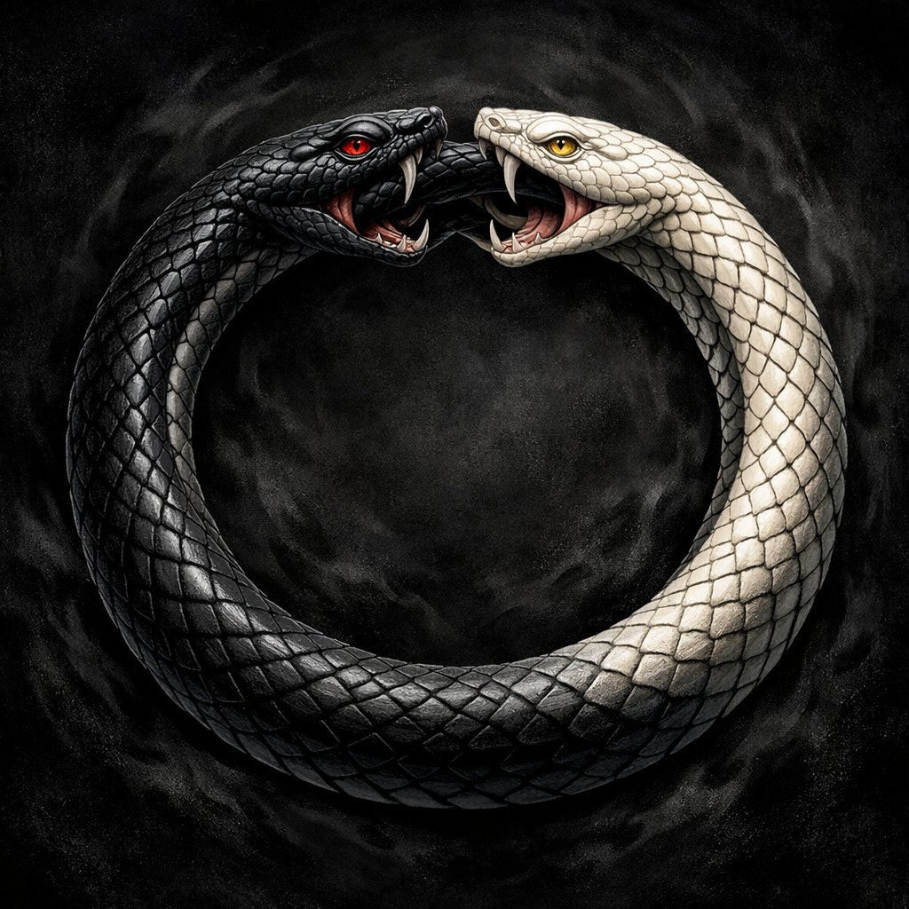

Prompt:

```text
Generate an image that coolly depicts an illustration of the Ouroboros, two snakes eating each other, symbolizing a closed system.
```

### GPT Image 1.5 Prompts #29: Aesthetic Hairstyle Comparison Grid

- Category: `Portrait`
- Model: `GPT Image 1.5`
- Author / Source: [Dr.duet](https://github.com/YouMind-OpenLab/awesome-gpt-image-1.5/blob/main/README.md)
- Image: `assets/imported/YouMind-OpenLab/awesome-gpt-image-1.5/README-29-Aesthetic-Hairstyle-Comparison-Grid.jpg`


Prompt:

```text
description: "A clean, aesthetic 3x3 collage portrait showcasing different men's hairstyles. The same young man is captured in each frame, positioned in consistent lighting and pose, creating a style comparison grid.",

  "subject": {
    "type": "young man",
    "age": "early 20s",
    "skin_tone": "medium with smooth texture",
    "facial_features": "sharp jawline, well-groomed beard stubble, symmetrical face",
    "expression": "neutral and confident"
  },

  "hairstyles": [
    "{argument name="hairstyle 1" default="clean shaved buzz cut"}",
    "{argument name="hairstyle 2" default="slicked back classic hairstyle"}",
    "{argument name="hairstyle 3" default="medium wavy long hair"}",
    "{argument name="hairstyle 4" default="short textured fringe"}",
    "{argument name="hairstyle 5" default="voluminous messy hairstyle"}",
    "{argument name="hairstyle 6" default="man bun"}",
    "{argument name="hairstyle 7" default="cornrow braids"}",
    "{argument name="hairstyle 8" default="side swept modern fade"}",
    "{argument name="hairstyle 9" default="tight curly textured cut"}"
  ],

  "environment": {
    "location": "outdoor courtyard with white architecture arches",
    "lighting": "soft sunset golden-hour lighting",
    "background": "slightly blurred but clean and minimal"
  },

  "camera": {
    "shot": "shoulder-level portrait",
    "angle": "eye-level",
    "lens": "standard lens (50mm)",
    "composition": "consistent framing for all nine shots"
  },

  "wardrobe": {
    "top": "plain fitted white t-shirt",
    "style": "minimal, clean, modern"
  },

  "mood": [
    "stylish",
    "fresh",
    "groomed",
    "aesthetic"
  ]
}
```

### GPT Image 1.5 Prompts #30: Candid Cinematic Lifestyle Photograph of Father and Child

- Category: `Video`
- Model: `GPT Image 1.5`
- Author / Source: [Smiling Khan](https://github.com/YouMind-OpenLab/awesome-gpt-image-1.5/blob/main/README.md)
- Image: `assets/imported/YouMind-OpenLab/awesome-gpt-image-1.5/README-30-Candid-Cinematic-Lifestyle-Photograph-of-Father-and-Child.jpg`

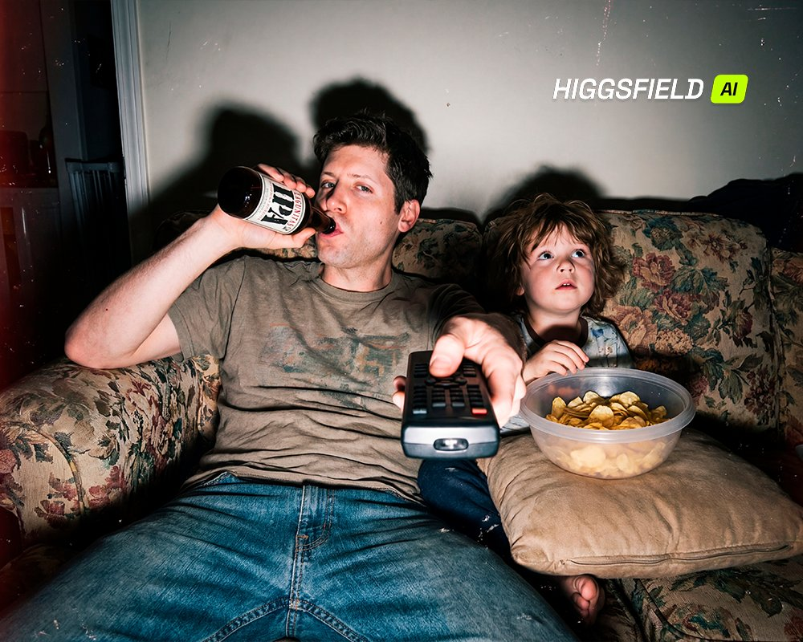

Prompt:

```text
A candid, cinematic lifestyle photograph of a tired father and his young child sitting together on a worn vintage couch in a dimly lit living room at night. The father recline casually, holding a TV remote toward the camera with one hand while drinking from a glass bottle with the other, relaxed yet exhausted. Beside him, the child sits quietly with a bowl of potato chips, wide-eyed and absorbed in whatever is playing on the television. Soft, moody tungsten lighting casts gentle shadows on the wall behind them, creating an intimate, realistic atmosphere. Shot from a low, front-facing angle with slight wide-angle distortion for a raw, documentary feel.
```

### GPT Image 1.5 Prompts #31: Harajuku Decora Pop Art Poster of Aniko

- Category: `Product`
- Model: `GPT Image 1.5`
- Author / Source: [Toshi@ニャルオAI](https://github.com/YouMind-OpenLab/awesome-gpt-image-1.5/blob/main/README.md)
- Image: `assets/imported/YouMind-OpenLab/awesome-gpt-image-1.5/README-31-Harajuku-Decora-Pop-Art-Poster-of-Aniko.jpg`

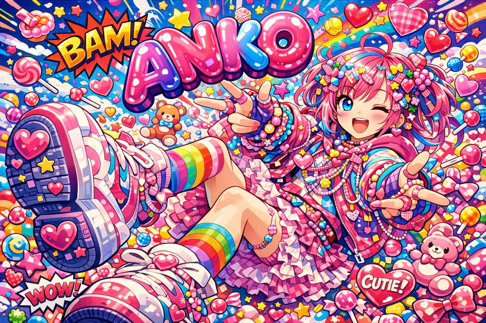

Prompt:

```text
【Request for Production: Character 'Kawaii' Remix】 Using the attached image of the character (Aniko) as a model, could you draw a highly dense and vibrant poster art where she has become a Harajuku fashion icon? 【Points to Infer】 Outfit Upgrade: Do not be constrained by the 'school uniform' element of the original image. Based on her hair color and eye color, devise a much flashier outfit, heavily accessorized, based on **'Harajuku Decora' and 'Y2K fashion'**. (Examples: layered colorful hoodies, frilled skirts, platform sneakers, excessive amounts of hairpins and plastic accessories, etc.) Space Direction: Please use an art style that fills in all 'empty space'. Scatter bursting candies, stars, hearts, ribbons, and comic-style effects like 'BAM!' and 'POP!' in the background to express a **'visually information-overloaded happiness'** like an overturned toy box. Composition and Pose: Use a defenseless, floating pose, as if released from gravity and floating in the air, or lying on a bed and photographed from above. A dynamic composition that uses ultra-wide-angle lens perspective to make hands, feet, and shoes appear large would be appreciated. Typography: Design the text **'ANIKO'** as a shiny, balloon-like 3D logo and place it prominently as the main element of the screen. 【Target Visual】 The violence of 'Kawaii'. Aim for a supremely high-tension pop art that is overflowing with color and feels like your brain is melting just by looking at it. 【Highest Priority】 My instructions are only references for direction; please prioritize the highest quality visual outcome and select or discard my information accordingly. --stylize 1400 --ar 16:9
```

### GPT Image 1.5 Prompts #32: 3D Kawaii Seasonal Sticker Sheet

- Category: `3D`
- Model: `GPT Image 1.5`
- Author / Source: [SaaS Junction || AI & SaaS Updates](https://github.com/YouMind-OpenLab/awesome-gpt-image-1.5/blob/main/README.md)
- Image: `assets/imported/YouMind-OpenLab/awesome-gpt-image-1.5/README-32-3D-Kawaii-Seasonal-Sticker-Sheet.jpg`

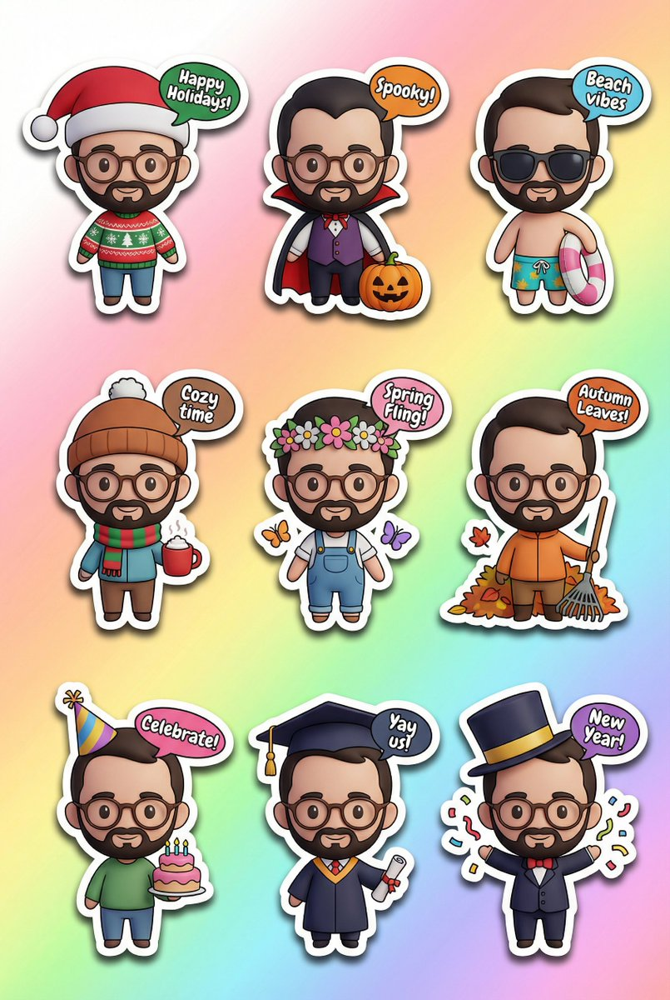

Prompt:

```text
Create a 3D kawaii 2:3 canvas featuring nine chibi-style stickers dressed in seasonal and holiday-themed outfits including {argument name="theme 1" default="Christmas"}, {argument name="theme 2" default="Halloween"}, {argument name="theme 3" default="summer beach"}, {argument name="theme 4" default="winter cozy"}, {argument name="theme 5" default="spring flowers"}, {argument name="theme 6" default="autumn leaves"}, {argument name="theme 7" default="birthday party"}, {argument name="theme 8" default="graduation"}, and {argument name="theme 9" default="New Year celebration"}. Use the attached image for reference. Each sticker has a white border with shadow effects and includes festive speech bubbles featuring phrases like "{argument name="phrase 1" default="Happy Holidays!"}", "{argument name="phrase 2" default="Spooky!"}", "{argument name="phrase 3" default="Beach vibes"}", "{argument name="phrase 4" default="Cozy time"}", "{argument name="phrase 5" default="Celebrate!"}", and "{argument name="phrase 6" default="Yay us!"}". Set on a soft gradient background transitioning from white to pastel rainbow tones for a festive, versatile vibe suitable for year-round WhatsApp sharing.
```

### GPT Image 1.5 Prompts #33: GPT-image 1.5 Test Prompt for a Detailed Scene

- Category: `Video`
- Model: `GPT Image 1.5`
- Author / Source: [eagle0wl（いーぐる） / km](https://github.com/YouMind-OpenLab/awesome-gpt-image-1.5/blob/main/README.md)
- Image: `assets/imported/YouMind-OpenLab/awesome-gpt-image-1.5/README-33-GPT-image-1.5-Test-Prompt-for-a-Detailed-Scene.jpg`


Prompt:

```text
A girl with {argument name="hair color" default="long black hair"} and {argument name="clothing" default="a white dress"} stands on the rooftop of a skyscraper in a futuristic city, looking up at the night sky. The city is illuminated by neon lights and holographic advertisements. The composition is a wide shot, with the girl positioned slightly off-center to the right. The lighting is dramatic, with strong shadows and highlights emphasizing the contrast between the girl and the vibrant city lights. The style is cinematic and highly detailed, reminiscent of {argument name="art style" default="cyberpunk anime"}.
```

### GPT Image 1.5 Prompts #34: Image-to-Image Clothing Swap Prompt

- Category: `Creative`
- Model: `GPT Image 1.5`
- Author / Source: [CHAO2U AI](https://github.com/YouMind-OpenLab/awesome-gpt-image-1.5/blob/main/README.md)
- Image: `assets/imported/YouMind-OpenLab/awesome-gpt-image-1.5/README-34-Image-to-Image-Clothing-Swap-Prompt.jpg`

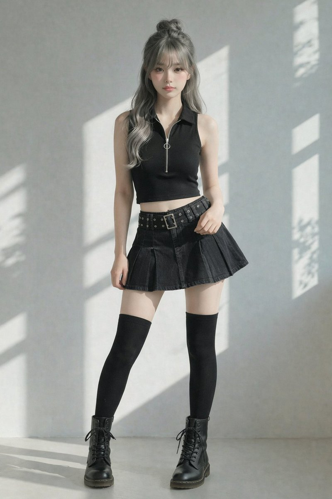

Prompt:

```text
Take the clothing from the reference and change mine to match it
```

### GPT Image 1.5 Prompts #35: Cinematic Storyboard Contact Sheet

- Category: `Video`
- Model: `GPT Image 1.5`
- Author / Source: [Oogie](https://github.com/YouMind-OpenLab/awesome-gpt-image-1.5/blob/main/README.md)
- Image: `assets/imported/YouMind-OpenLab/awesome-gpt-image-1.5/README-35-Cinematic-Storyboard-Contact-Sheet.jpg`


Prompt:

```text
A 3x3 grid storyboard contact sheet comprised of nine candid, cinematic movie stills showing a continuous sequence of a young man, approximately 20-25 years old. He has tousled brown hair and a youthful, expressive face, clean-shaven. Across all nine panels, he is consistently wearing a {argument name="shirt color" default="brown"} short-sleeved linen button-down shirt and is seated at a wooden dining table during a family dinner. The panels show varied natural actions: gesturing with his hands while animatedly talking, laughing, eating {argument name="food" default="lasagna"} from a large dish, listening intently, and smiling. The environment is a warm, cozy home dining room with a wooden hutch filled with china and patterned wallpaper visible in the background. The lighting is soft, warm tungsten evening light creating natural shadows. The shots are a mix of medium angles and close-ups with a shallow depth of field, rendered with a film photography aesthetic and slight grain.
```

### GPT Image 1.5 Prompts #36: Outfit Change to Tuxedo and Bow Tie

- Category: `Creative`
- Model: `GPT Image 1.5`
- Author / Source: [Sola Awodiya](https://github.com/YouMind-OpenLab/awesome-gpt-image-1.5/blob/main/README.md)
- Image: `assets/imported/YouMind-OpenLab/awesome-gpt-image-1.5/README-36-Outfit-Change-to-Tuxedo-and-Bow-Tie.jpg`

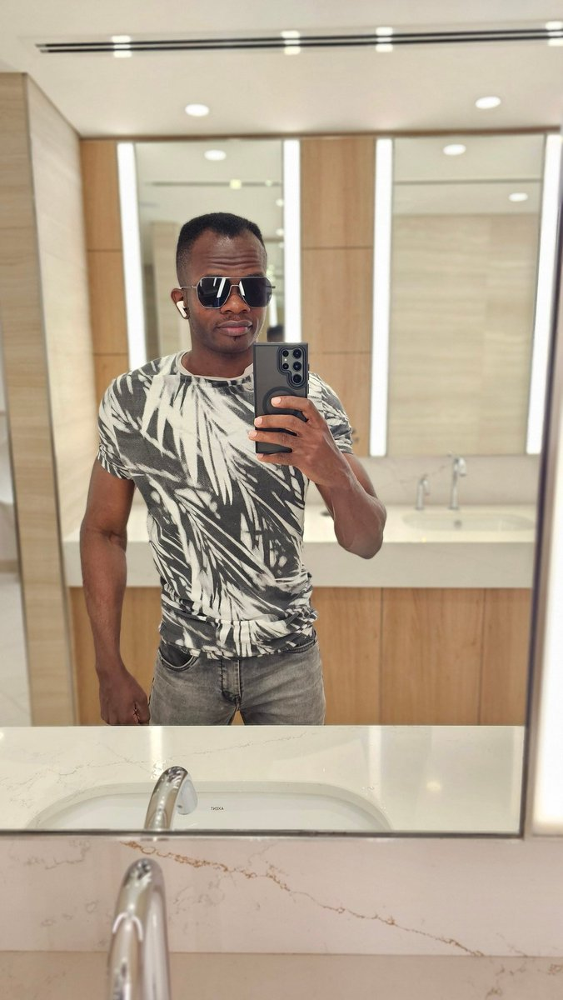

Prompt:

```text
Change my outfit here to a Tuxedo and a bow tie.
```

### GPT Image 1.5 Prompts #37: Character Feature Description Prompt (Japanese)

- Category: `Portrait`
- Model: `GPT Image 1.5`
- Author / Source: [AI_only](https://github.com/YouMind-OpenLab/awesome-gpt-image-1.5/blob/main/README.md)
- Image: `assets/imported/YouMind-OpenLab/awesome-gpt-image-1.5/README-37-Character-Feature-Description-Prompt-Japanese.jpg`

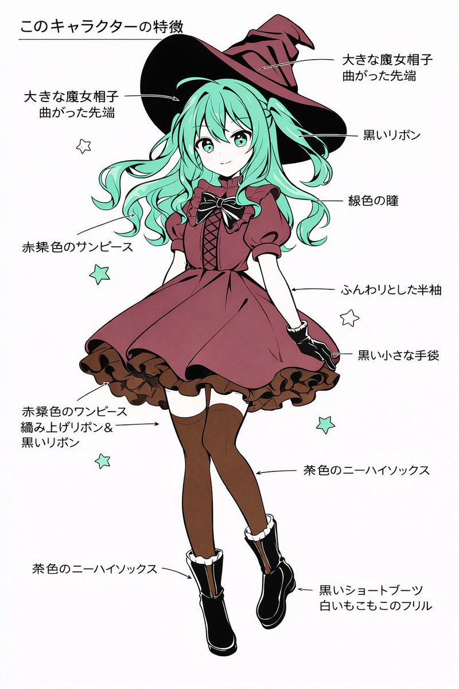

Prompt:

```text
Please create an image that points to various parts of this character with lines, and explains the features of each part in Japanese.
```

### GPT Image 1.5 Prompts #38: Hyper-realistic Studio Portrait with Oversized Product Integration (Sprite)

- Category: `Product`
- Model: `GPT Image 1.5`
- Author / Source: [ராஜேஷ்](https://github.com/YouMind-OpenLab/awesome-gpt-image-1.5/blob/main/README.md)
- Image: `assets/imported/YouMind-OpenLab/awesome-gpt-image-1.5/README-38-Hyper-realistic-Studio-Portrait-with-Oversized-Product-Integration-Sprite.jpg`

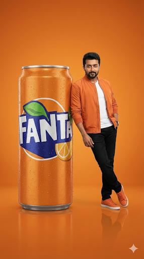

Prompt:

```text
A full-body hyper-realistic studio portrait of a man from attached photo [{argument name="jacket color" default="green"} bomber jacket, {argument name="shirt color" default="white"} t-shirt, {argument name="pants color" default="black"} jeans, {argument name="sneaker color" default="green"} sneakers ] in a [{argument name="pose" default="relaxed"}] pose, leaning gracefully beside a large [ can of {argument name="product name" default="sprite"}] positioned [{argument name="product position" default="vertical"}] on a smooth [{argument name="floor color" default="green"}] floor. The object appears oversized and realistic, perfectly integrated with the subject — not floating. Its surface shows accurate texture, reflections, and material depth. The pose defines the subject’s attitude and interaction with the object — natural, stylish, and expressive. The character is balanced and confident, matching the object’s tone and style. Background is seamless, same color for wall and floor, slightly lighter below with soft reflections. Lighting: clean professional studio setup — diffused key from front-left, mild fill from right, subtle rim for separation, evenly balanced exposure. Mood: cinematic luxury editorial with minimal composition and photorealistic realism."
```

### GPT Image 1.5 Prompts #39: Western Manuscript Style Illustration for 'Orychophragmus violaceus'

- Category: `Creative`
- Model: `GPT Image 1.5`
- Author / Source: [Vania](https://github.com/YouMind-OpenLab/awesome-gpt-image-1.5/blob/main/README.md)
- Image: `assets/imported/YouMind-OpenLab/awesome-gpt-image-1.5/README-39-Western-Manuscript-Style-Illustration-for-Orychophragmus-violaceus.jpg`

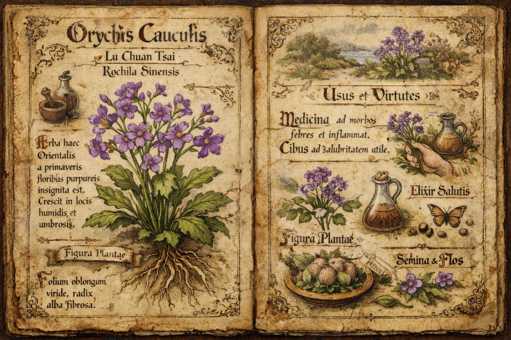

Prompt:

```text
Draw 'Orychophragmus violaceus' in the design and style of a Western-style ancient document. Use a two-page spread of the ancient document for the drawing. Create the impression that various texts are explaining things around the picture. Make it look worn out and used.
```

### GPT Image 1.5 Prompts #40: Artistic Composition Strategy Prompt

- Category: `Creative`
- Model: `GPT Image 1.5`
- Author / Source: [榊正宗🫛ずんだもん発案者](https://github.com/YouMind-OpenLab/awesome-gpt-image-1.5/blob/main/README.md)
- Image: `assets/imported/YouMind-OpenLab/awesome-gpt-image-1.5/README-40-Artistic-Composition-Strategy-Prompt.jpg`

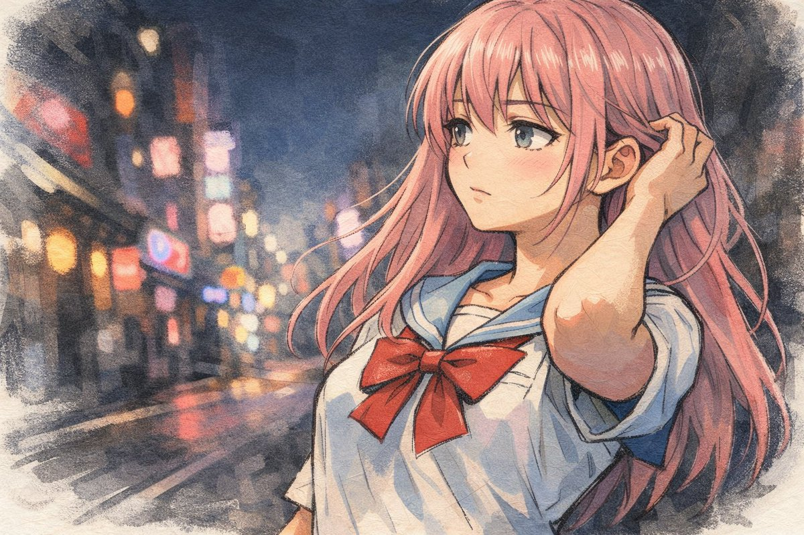

Prompt:

```text
Step 1: Increase information
Eliminate horizontal and vertical lines and make various parts of the picture diagonal. Increase variations in joint twists, composition, poses, camera tilt, etc.

Step 2: Reduce information
Thoroughly erase information that doesn't need to be seen. Draw faces precisely and omit others.
```

### GPT Image 1.5 Prompts #41: Prompt to Generate Intentionally Bad, Child-like Crayon Drawings

- Category: `Creative`
- Model: `GPT Image 1.5`
- Author / Source: [榊正宗🫛ずんだもん発案者](https://github.com/YouMind-OpenLab/awesome-gpt-image-1.5/blob/main/README.md)
- Image: `assets/imported/YouMind-OpenLab/awesome-gpt-image-1.5/README-41-Prompt-to-Generate-Intentionally-Bad-Child-like-Crayon-Drawings.jpg`

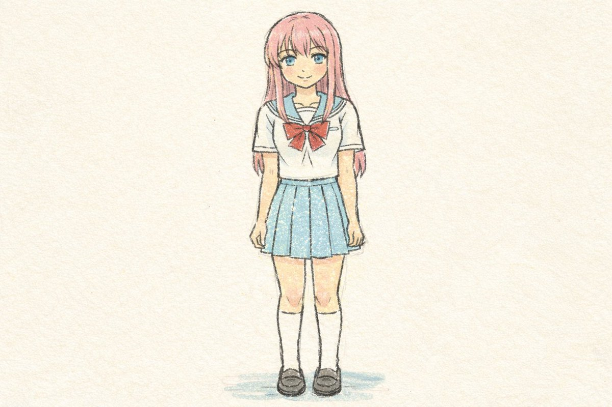

Prompt:

```text
Place the subject standing in the center, with a plain pose and composition, giving the impression of poor quality, like a child's scribble who just started drawing. The style should be a hand-drawn, anime-style color sketch using rough crayon lines (leaving the under-drawing lines), emphasizing the poor quality!
```

### GPT Image 1.5 Prompts #42: Clothing Separation Prompt for GPT Image 1.5

- Category: `Creative`
- Model: `GPT Image 1.5`
- Author / Source: [CHAO2U AI](https://github.com/YouMind-OpenLab/awesome-gpt-image-1.5/blob/main/README.md)
- Image: `assets/imported/YouMind-OpenLab/awesome-gpt-image-1.5/README-42-Clothing-Separation-Prompt-for-GPT-Image-1.5.jpg`

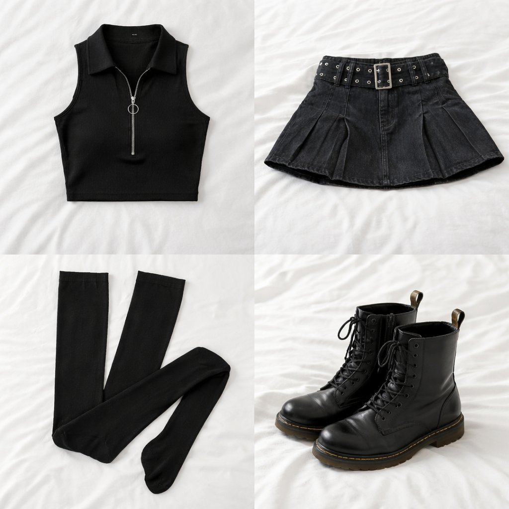

Prompt:

```text
Give each piece of her clothing separately on the bed
```

### GPT Image 1.5 Prompts #43: Still-Life Object Portrait Illusion

- Category: `Portrait`
- Model: `GPT Image 1.5`
- Author / Source: [Umesh](https://github.com/YouMind-OpenLab/awesome-gpt-image-1.5/blob/main/README.md)
- Image: `assets/imported/YouMind-OpenLab/awesome-gpt-image-1.5/README-43-Still-Life-Object-Portrait-Illusion.jpg`

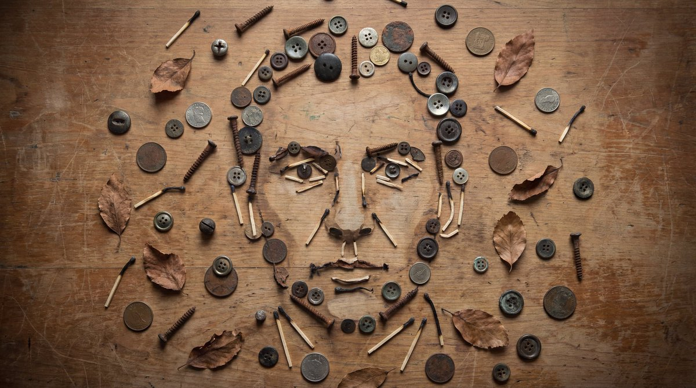

Prompt:

```text
Create an image that looks like a tabletop still-life of many small objects {argument name="objects" default="buttons, screws, coins, leaves, matchsticks"} scattered naturally, yet from a top-down view they form a clear human face portrait through careful arrangement and shading. Use neutral tones, soft overhead light, and gentle vignette. The face should emerge at mid-distance viewing: close up it’s “just objects,” zoomed out it’s unmistakably a portrait. Add realistic cast shadows under each object to enhance depth. Background: worn wooden table with scratches. Keep the arrangement organic, not too symmetrical. No text, no obvious outlines, no artificial glow.
```

### GPT Image 1.5 Prompts #44: Hyper-Realistic Cinematic Portrait

- Category: `Portrait`
- Model: `GPT Image 1.5`
- Author / Source: [Johnn](https://github.com/YouMind-OpenLab/awesome-gpt-image-1.5/blob/main/README.md)
- Image: `assets/imported/YouMind-OpenLab/awesome-gpt-image-1.5/README-44-Hyper-Realistic-Cinematic-Portrait.jpg`

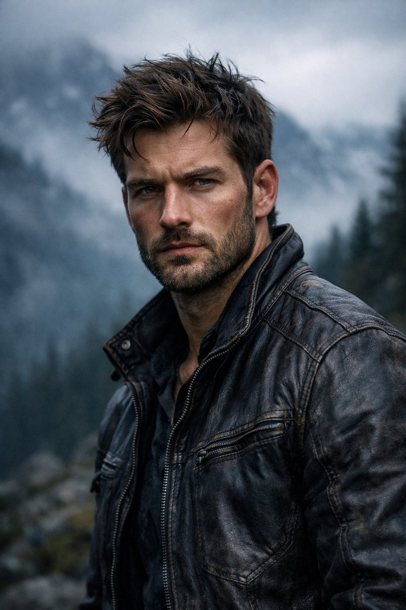

Prompt:

```text
{
  "render_goal": "Create a hyper-realistic, cinematic portrait with a rugged outdoor adventure aesthetic",
  "subject": {
    "gender": "male",
    "age_range": "mid-to-late 20s",
    "appearance": {
      "hair": "textured, windswept",
      "beard": "short, well-groomed",
      "facial_features": "sharp, chiseled",
      "expression": "intense, serious"
    },
    "skin_detail": "ultra-detailed, natural texture with realistic tones"
  },
  "wardrobe": {
    "outerwear": "worn dark leather jacket",
    "details": "visible stitching, rugged texture"
  },
  "environment": {
    "location": "outdoor mountain landscape",
    "background": {
      "mountains": "misty, fog-covered",
      "trees": "dark evergreen forest fading into distance",
      "atmosphere": "dense atmospheric fog"
    }
  },
  "lighting_and_color": {
    "lighting_style": "moody, cinematic",
    "light_source": "soft overcast daylight",
    "shadows": "dramatic but natural",
    "color_palette": "cool, desaturated tones"
  },
  "camera_settings": {
    "lens": "85mm",
    "aperture": "f/1.8",
    "depth_of_field": "shallow",
    "focus": "razor-sharp on subject, blurred background"
  },
  "photography_style": {
    "quality": "professional photography",
    "realism_level": "hyper-realistic",
    "details": "high micro-detail, crisp textures, cinematic contrast"
  }
}
```

### GPT Image 1.5 Prompts #45: Harajuku Decora Pop Art Poster of Aniko (Detailed)

- Category: `Product`
- Model: `GPT Image 1.5`
- Author / Source: [Toshi@ニャルオAI](https://github.com/YouMind-OpenLab/awesome-gpt-image-1.5/blob/main/README.md)
- Image: `assets/imported/YouMind-OpenLab/awesome-gpt-image-1.5/README-45-Harajuku-Decora-Pop-Art-Poster-of-Aniko-Detailed.jpg`

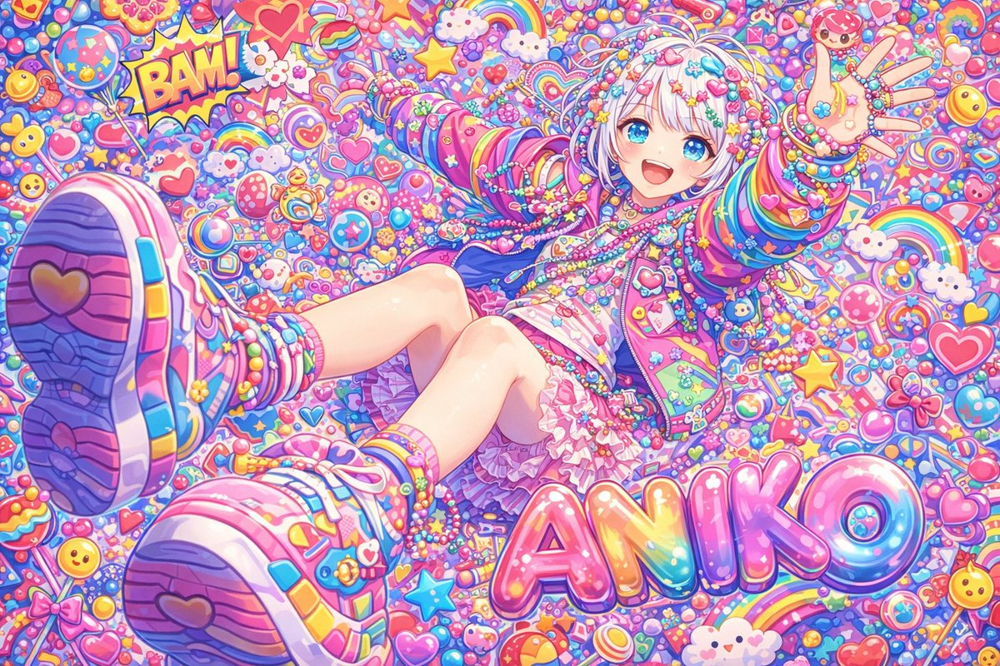

Prompt:

```text
【Request for Production: Character 'Kawaii' Remix】 Using the attached image of the character (Aniko) as a model, could you draw a highly dense and vibrant poster art where she has become a Harajuku fashion icon? 【Points to Infer】 Outfit Upgrade: Do not be constrained by the 'school uniform' element of the original image. Based on her hair color and eye color, devise a much flashier outfit, heavily accessorized, based on **'Harajuku Decora' and 'Y2K fashion'**. (Examples: layered colorful hoodies, frilled skirts, platform sneakers, excessive amounts of hairpins and plastic accessories, etc.) Space Direction: Please use an art style that fills in all 'empty space'. Scatter bursting candies, stars, hearts, ribbons, and comic-style effects like 'BAM!' and 'POP!' in the background to express a **'visually information-overloaded happiness'** like an overturned toy box. Composition and Pose: Use a defenseless, floating pose, as if released from gravity and floating in the air, or lying on a bed and photographed from above. A dynamic composition that uses ultra-wide-angle lens perspective to make hands, feet, and shoes appear large would be appreciated. Typography: Design the text **'ANIKO'** as a shiny, balloon-like 3D logo and place it prominently as the main element of the screen. 【Target Visual】 The violence of 'Kawaii'. Aim for a supremely high-tension pop art that is overflowing with color and feels like your brain is melting just by looking at it. 【Highest Priority】 My instructions are only references for direction; please prioritize the highest quality visual outcome and select or discard my information accordingly. --stylize 1400 --ar 16:9
```

### GPT Image 1.5 Prompts #46: Moody Cinematic Portrait

- Category: `Portrait`
- Model: `GPT Image 1.5`
- Author / Source: [Harboris](https://github.com/YouMind-OpenLab/awesome-gpt-image-1.5/blob/main/README.md)
- Image: `assets/imported/YouMind-OpenLab/awesome-gpt-image-1.5/README-46-Moody-Cinematic-Portrait.jpg`

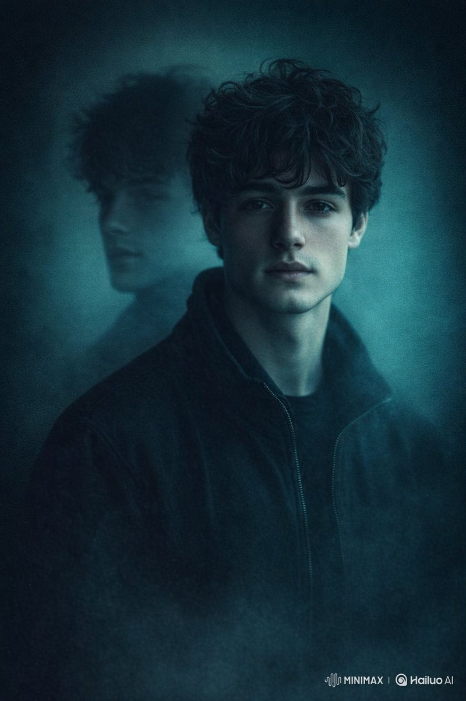

Prompt:

```text
moody cinematic portrait of a man in dark jacket, front facing but slightly turned, minimal expression, dark teal and cyan studio lighting, smooth gradient blue background fading into shadows, creative double exposure ghosted silhouette behind main face, soft haze, film look, subtle grain, high contrast on facial features, poster design composition, empty space for typography, no text, no watermark
```

### GPT Image 1.5 Prompts #47: TIME Magazine 'Person of the Year' Cover

- Category: `Creative`
- Model: `GPT Image 1.5`
- Author / Source: [富田 良治（とみー）｜現代版駄菓子屋 富田商店｜スナックトミタ](https://github.com/YouMind-OpenLab/awesome-gpt-image-1.5/blob/main/README.md)
- Image: `assets/imported/YouMind-OpenLab/awesome-gpt-image-1.5/README-47-TIME-Magazine-Person-of-the-Year-Cover.jpg`

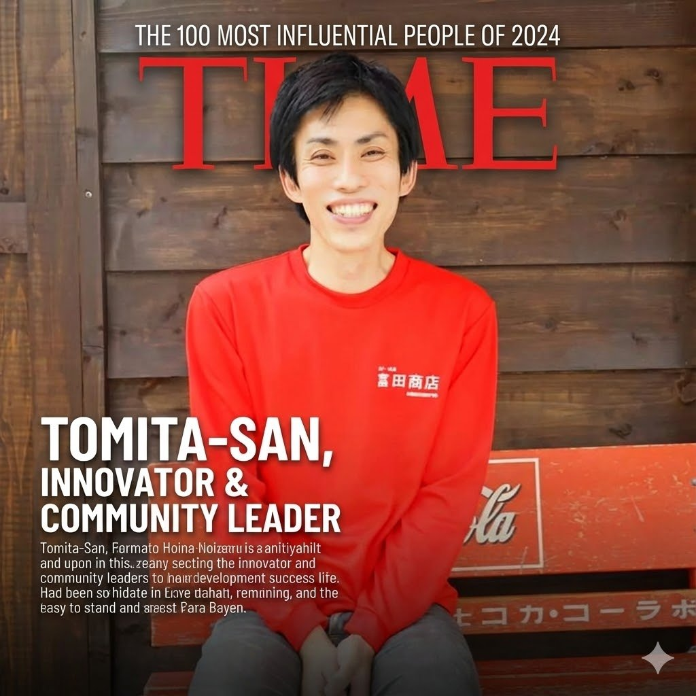

Prompt:

```text
Create the cover of TIME magazine's '100 People of the Year'. All titles and text should be in English.
```

### GPT Image 1.5 Prompts #48: Ultra-Realistic Cloud Silhouette

- Category: `Video`
- Model: `GPT Image 1.5`
- Author / Source: [Dr.duet](https://github.com/YouMind-OpenLab/awesome-gpt-image-1.5/blob/main/README.md)
- Image: `assets/imported/YouMind-OpenLab/awesome-gpt-image-1.5/README-48-Ultra-Realistic-Cloud-Silhouette.jpg`


Prompt:

```text
Create an ultra-realistic sky scene where soft, natural cloud formations organically assemble into the clear, recognizable silhouette of {argument name="person" default="[PERSON]"}. The cloud likeness appears high in a vibrant blue sky, formed gently and believably, as if shaped naturally by wind and atmosphere rather than intentionally sculpted.

The cloud figure floats above a grounded, recognizable natural landscape below—fields, hills, water, or trees—providing scale and realism. The composition is square (1080×1080), with the cloud formation occupying the upper portion of the frame while the landscape anchors the scene beneath.

Lighting is crisp and daylight-bright, with sunlit highlights and soft shadowing across the clouds to enhance volume, depth, and softness. The sky remains clean and naturally blue, with realistic atmospheric gradients.

The overall mood is calm, optimistic, and visually striking, with rich yet natural color saturation and a peaceful, uplifting atmosphere. Ultra-high realism, cinematic clarity, no text, no surreal effects, no exaggeration
```

### GPT Image 1.5 Prompts #49: Aesthetic Image Generation Prompt

- Category: `Video`
- Model: `GPT Image 1.5`
- Author / Source: [Jahan Zaib](https://github.com/YouMind-OpenLab/awesome-gpt-image-1.5/blob/main/README.md)
- Image: `assets/imported/YouMind-OpenLab/awesome-gpt-image-1.5/README-49-Aesthetic-Image-Generation-Prompt.jpg`

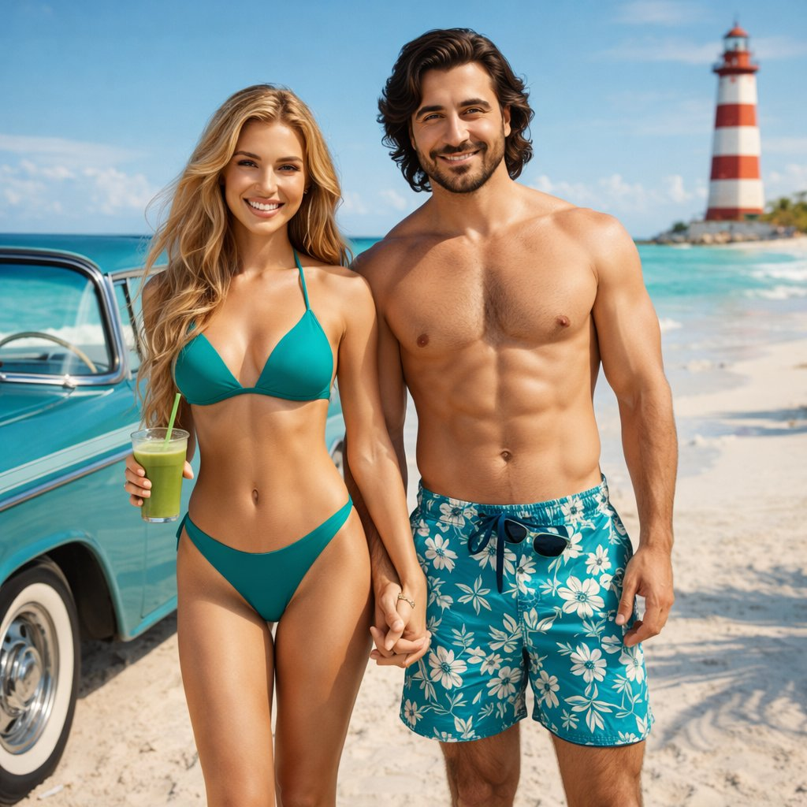

Prompt:

```text
A high-resolution, cinematic photograph of a lone, ancient lighthouse standing on a rugged cliff edge at sunset. The sky is dramatic, painted in deep oranges, purples, and blues, with rays of light breaking through the clouds. Waves crash violently against the rocks below, creating a fine mist. The lighthouse beam cuts sharply through the twilight air. The texture of the stone and the weathered metal of the lantern room are highly detailed. The overall mood is one of isolation, power, and enduring beauty. Shot on a large format camera, 85mm lens, f/2.8, golden hour lighting.
```

### GPT Image 1.5 Prompts #50: Dynamic Basketball Dunk Photo

- Category: `Creative`
- Model: `GPT Image 1.5`
- Author / Source: [富田 良治（とみー）｜現代版駄菓子屋 富田商店｜スナックトミタ](https://github.com/YouMind-OpenLab/awesome-gpt-image-1.5/blob/main/README.md)
- Image: `assets/imported/YouMind-OpenLab/awesome-gpt-image-1.5/README-50-Dynamic-Basketball-Dunk-Photo.jpg`

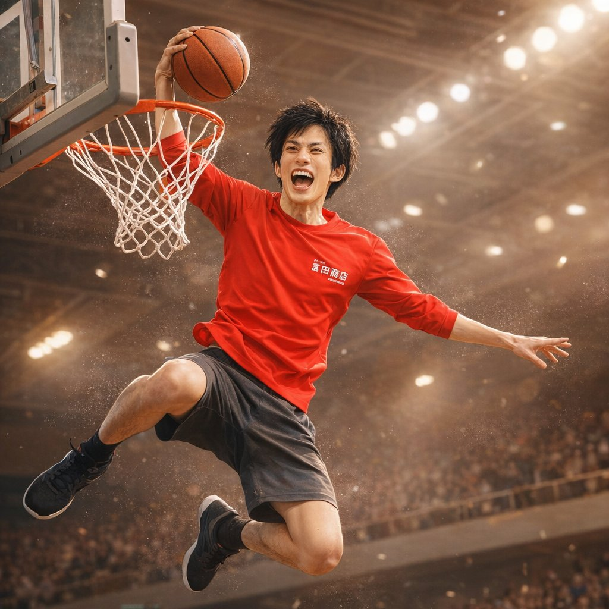

Prompt:

```text
Create a dynamic photo of this person performing a dunk in basketball.
```

### GPT Image 1.5 Prompts #51: Pencil Sketch Schematic

- Category: `Portrait`
- Model: `GPT Image 1.5`
- Author / Source: [JB](https://github.com/YouMind-OpenLab/awesome-gpt-image-1.5/blob/main/README.md)
- Image: `assets/imported/YouMind-OpenLab/awesome-gpt-image-1.5/README-51-Pencil-Sketch-Schematic.jpg`

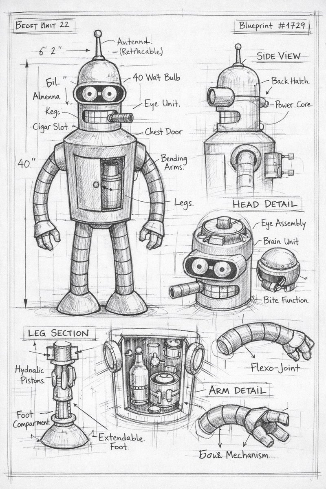

Prompt:

```text
Pencil sketch for the schematics of {argument name="character" default="bender"}
```

### GPT Image 1.5 Prompts #52: Advanced Product Photography Prompt for GPT Image 1.5

- Category: `Product`
- Model: `GPT Image 1.5`
- Author / Source: [岚叔](https://github.com/YouMind-OpenLab/awesome-gpt-image-1.5/blob/main/README.md)
- Image: `assets/imported/YouMind-OpenLab/awesome-gpt-image-1.5/README-52-Advanced-Product-Photography-Prompt-for-GPT-Image-1.5.jpg`


Prompt:

```text
A vertical split-screen creative product photography composition on a clean white wall background. High-resolution, photorealistic, commercial advertisement quality.

Top Section: The Specimen Box
The upper half features an exquisite light oak wooden shadow box frame mounted on the wall. Inside, a specific outfit is displayed as an artistic flat-lay museum specimen: {argument name="Clothing Details" default="a sleek black satin slip dress with delicate lace trim and thin spaghetti straps"}. The garments are neatly pinned in place. Surrounding them are small thematic decorative props: {argument name="Props" default="dried roses, vintage perfume bottles, silk ribbon"}. Elegant calligraphy on the matte paper backdrop reads: {argument name="Text" default="Midnight Elegance"}. Soft studio lighting accentuates the rich texture and drape of the fabric.

Bottom Section: Naked-Eye 3D Reality
The lower half creates a hyperrealistic "naked-eye 3D" illusion. A rectangular picture-frame border sits directly beneath the top box. A stunningly realistic young woman {argument name="Model Description" default="a poised East Asian model with long wavy black hair, subtle smoky eyes, and a confident gaze"} wears the exact same outfit as shown above.

She lounges casually on the bottom edge of the frame—one leg bent with foot resting inside the frame, the other leg elegantly dangling out into the viewer’s space. Her torso leans back slightly, elbow resting on her raised knee, fingers lightly grazing the fabric near her collarbone. Her body forms a soft, sensual S-curve that highlights the garment’s silhouette without overt exposure. She looks directly at the camera with a calm, knowing smile—inviting yet enigmatic. This dynamic, lifelike pose contrasts powerfully with the static, archival display above, creating visual tension between reality and presentation.

Technical Specs:
Soft natural shadows, ambient occlusion, bright and airy yet cinematic lighting, 8K resolution, Octane Render, vivid but refined color palette, ultra-detailed fabric textures (satin sheen, lace transparency, stitching), shallow depth of field, Vogue editorial style, filmic grain, professional fashion photography.

Negative Prompt (recommended):
blurry, low-res, distorted anatomy, extra limbs, deformed hands, cartoon, anime, doll-like, plastic skin, overexposed, cluttered background, text errors, mismatched clothing, floating objects, unrealistic proportions.
```

### GPT Image 1.5 Prompts #53: Ultra-Detailed 3D Graphite Sketch

- Category: `3D`
- Model: `GPT Image 1.5`
- Author / Source: [AMEEN](https://github.com/YouMind-OpenLab/awesome-gpt-image-1.5/blob/main/README.md)
- Image: `assets/imported/YouMind-OpenLab/awesome-gpt-image-1.5/README-53-Ultra-Detailed-3D-Graphite-Sketch.jpg`

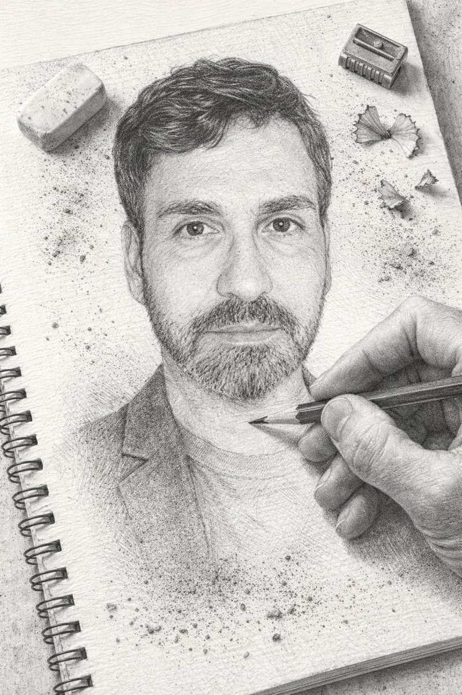

Prompt:

```text
Generate an image from the uploaded photo that reimagines the subject as an ultra-detailed 3D graphite pencil sketch on textured white notebook paper. Emphasize crisp paper grain, subtle imperfections, and natural surface fibers. Show the subject actively drawing, with their hand holding a pencil as the sketch comes to life. Include an eraser, sharpener, and scattered pencil shavings resting on the page. Add realistic shadows, smudges, and fine graphite residue around the working area to reinforce the tactile, hand-drawn feel.
```

### GPT Image 1.5 Prompts #54: Gachapon Capsule Toy Design

- Category: `Product`
- Model: `GPT Image 1.5`
- Author / Source: [富田 良治（とみー）｜現代版駄菓子屋 富田商店｜スナックトミタ](https://github.com/YouMind-OpenLab/awesome-gpt-image-1.5/blob/main/README.md)
- Image: `assets/imported/YouMind-OpenLab/awesome-gpt-image-1.5/README-54-Gachapon-Capsule-Toy-Design.jpg`

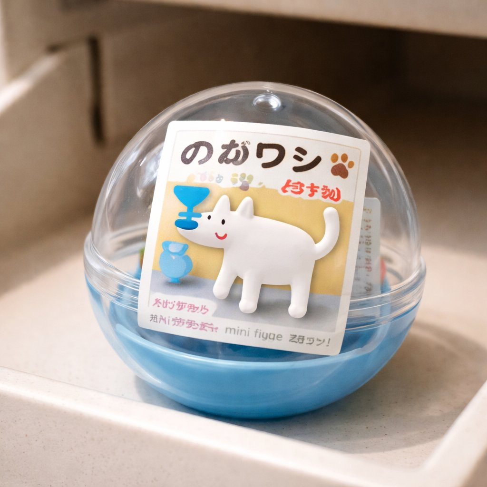

Prompt:

```text
Create a miniature capsule toy in the style of a gachapon, based on a single subject ({argument name="subject" default="person, brand mascot, or object"}). The figure should be simple and toy-like in its deformation, sized to fit neatly inside a transparent plastic capsule. Inside the capsule, include a paper insert typical of Japanese gachapon, featuring the toy's name, a small product photo, an icon-style mark, and simple Japanese text. The capsule should be shown either inside the dispensing slot of an actual gachapon vending machine or immediately in front of it. Express the material textures realistically, showing the glossy plastic of the capsule, the slightly matte figure, and the thinly folded paper insert. The overall atmosphere should be natural, like a photo taken with an iPhone, with soft light, a slight sense of camera shake, light background bokeh, and subtle realistic imperfections or quirks. Keep the composition clean and simple, with the subject centered. Aim for a clean finish without clutter.
```

### GPT Image 1.5 Prompts #55: Ultra-Detailed 3D Graphite Pencil Sketch Generation

- Category: `3D`
- Model: `GPT Image 1.5`
- Author / Source: [ChatGPT](https://github.com/YouMind-OpenLab/awesome-gpt-image-1.5/blob/main/README.md)
- Image: `assets/imported/YouMind-OpenLab/awesome-gpt-image-1.5/README-55-Ultra-Detailed-3D-Graphite-Pencil-Sketch-Generation.jpg`

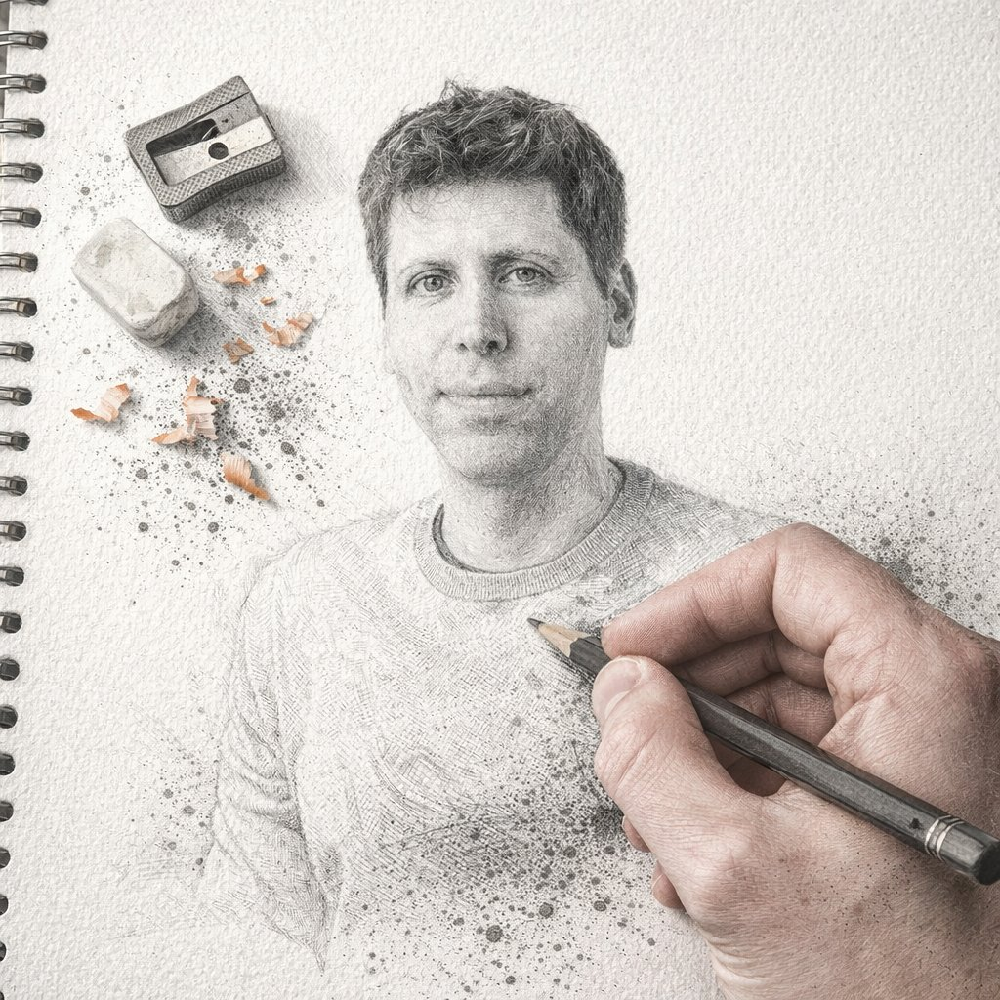

Prompt:

```text
Generate an image from the uploaded photo that reimagines the subject as an ultra-detailed 3D graphite pencil sketch on textured white notebook paper. Emphasize crisp paper grain, subtle imperfections, and natural surface fibers. Show the subject actively drawing, with their hand holding a pencil as the sketch comes to life. Include an eraser, sharpener, and scattered pencil shavings resting on the page. Add realistic shadows, smudges, and fine graphite residue around the working area to reinforce the tactile, hand-drawn feel.
```

### GPT Image 1.5 Prompts #56: Desert Ruins of Pure Math Grid

- Category: `Creative`
- Model: `GPT Image 1.5`
- Author / Source: [Gadgetify](https://github.com/YouMind-OpenLab/awesome-gpt-image-1.5/blob/main/README.md)
- Image: `assets/imported/YouMind-OpenLab/awesome-gpt-image-1.5/README-56-Desert-Ruins-of-Pure-Math-Grid.jpg`

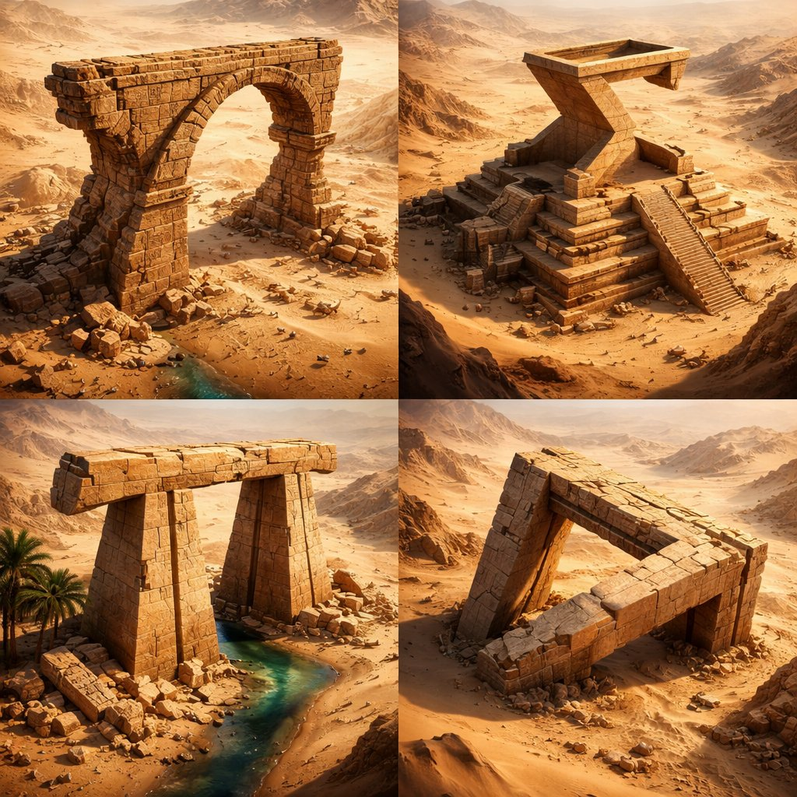

Prompt:

```text
Desert Ruins of Pure Math (Cairo-style monumental stone)
A 2x2 grid of 4 monumental mathematical symbols built as ancient desert ruins in sandstone
[Top Left: The Integral (∫) as a collapsed arch-aqueduct, wind-eroded blocks, carved microtext equations, tiny caravans for scale]
[Top Right: The Sigma (Σ) as a stepped fortress-ziggurat with sharp terraces, long shadows, sand drifts collecting in corners]
[Bottom Left: The Pi (π) as two colossal pylons and a lintel bridge over a narrow oasis canal, chipped stone, scattered rubble geometry]
[Bottom Right: A Penrose Triangle as impossible ruins half-buried in dunes, optical illusion architecture, Escher perspective, sunlight slicing across paradox edges]
Aerial oblique view, golden desert haze, crisp hard sunlight, dramatic shadows, photoreal ruins texture, subtle river ribbon, swiss 2x2 grid layout.
```

### GPT Image 1.5 Prompts #57: Reasoning and Instruction Following Puzzle Prompt

- Category: `Creative`
- Model: `GPT Image 1.5`
- Author / Source: [Joe ⭕ Dot ⭕ Average](https://github.com/YouMind-OpenLab/awesome-gpt-image-1.5/blob/main/README.md)
- Image: `assets/imported/YouMind-OpenLab/awesome-gpt-image-1.5/README-57-Reasoning-and-Instruction-Following-Puzzle-Prompt.jpg`

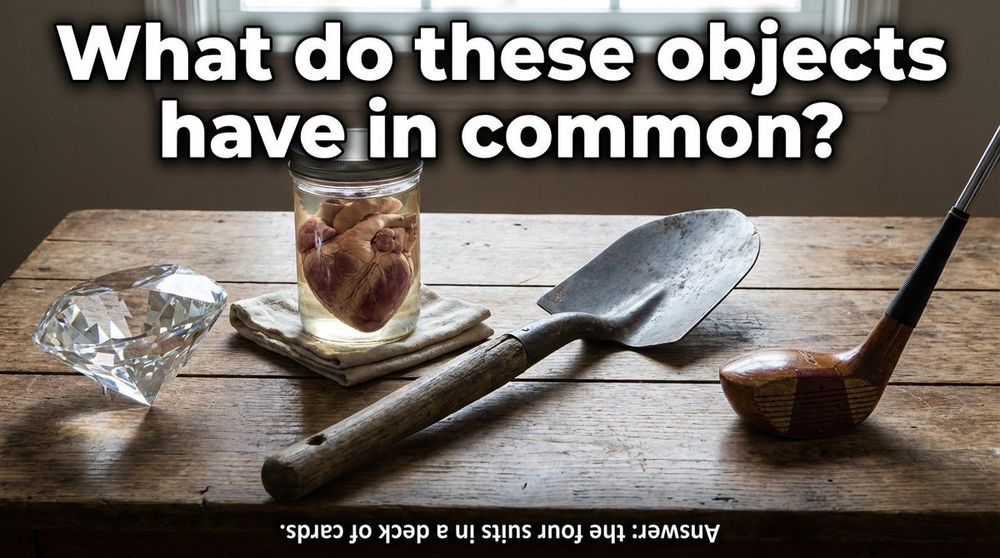

Prompt:

```text
"Show me 4 realistic objects on a table. The objects are related in some way, this is a puzzle. Add title text across the top, "{argument name="title text" default="What do these objects have in common?"}" And very small upside down text on the bottom which reveals the way in which they are related."
```

### GPT Image 1.5 Prompts #58: Meta-Prompt: Create an Image Detailing its Own Creation Steps

- Category: `Creative`
- Model: `GPT Image 1.5`
- Author / Source: [AI Mother Brain](https://github.com/YouMind-OpenLab/awesome-gpt-image-1.5/blob/main/README.md)
- Image: `assets/imported/YouMind-OpenLab/awesome-gpt-image-1.5/README-58-Meta-Prompt-Create-an-Image-Detailing-its-Own-Creation-Steps.jpg`

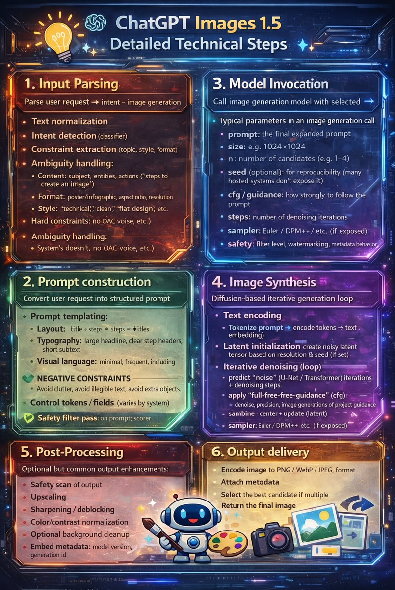

Prompt:

```text
Create an image about the very detailed steps you create to create the image.
```

### GPT Image 1.5 Prompts #59: Anime Christmas Elf Cross-Stitch

- Category: `Creative`
- Model: `GPT Image 1.5`
- Author / Source: [mash tun](https://github.com/YouMind-OpenLab/awesome-gpt-image-1.5/blob/main/README.md)
- Image: `assets/imported/YouMind-OpenLab/awesome-gpt-image-1.5/README-59-Anime-Christmas-Elf-Cross-Stitch.jpg`

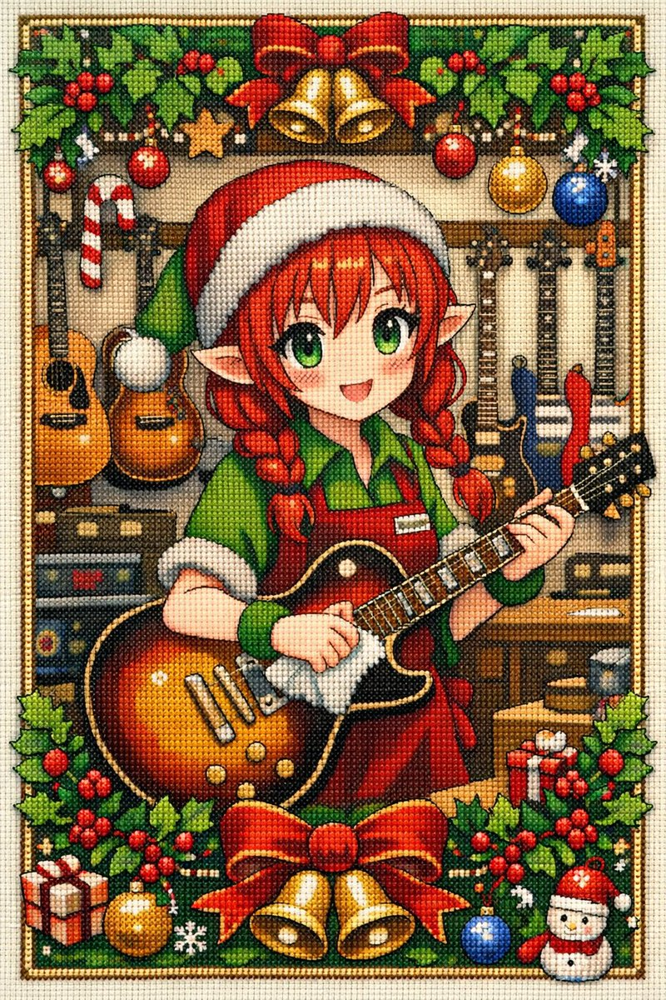

Prompt:

```text
a cross-stitch of a christmas elf - anime style. the elf is working at a guitar store, guitars hang on the wall. the cross stitch has a christmas border with mistletoe and christmas decorations.
```

### GPT Image 1.5 Prompts #60: Moody Cinematic Portrait with Motion Blur and Directional Lighting

- Category: `Portrait`
- Model: `GPT Image 1.5`
- Author / Source: [Sanchit | AI Tools & News](https://github.com/YouMind-OpenLab/awesome-gpt-image-1.5/blob/main/README.md)
- Image: `assets/imported/YouMind-OpenLab/awesome-gpt-image-1.5/README-60-Moody-Cinematic-Portrait-with-Motion-Blur-and-Directional-Lighting.jpg`

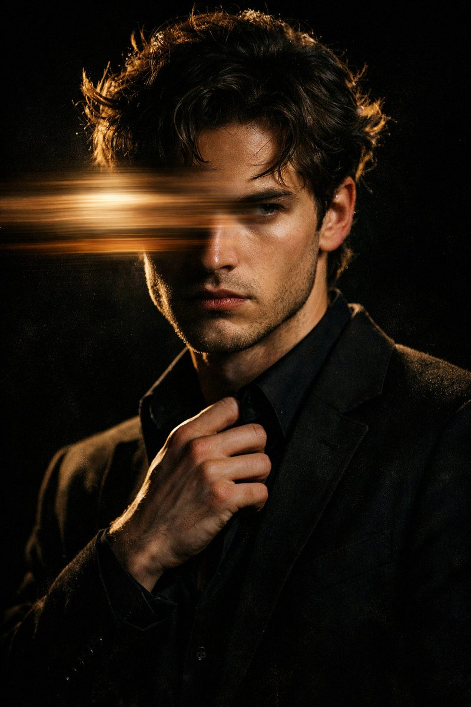

Prompt:

```text
Generate a moody cinematic portrait of a young male model with light skin, soft textured wavy hair, dressed in a fitted black suit with dark shirt, standing against a black background, harsh directional lighting from the left casting deep shadows, model looking forward with piercing eyes and a tense jawline, one hand clutching his collar near the neck, motion blur effect slicing across the face horizontally from left to right, blending light streaks in muted amber and beige tones, sharp contrast between still and blurred zones, stylized editorial tone with subtle film grain and soft falloff, no digital smoothness or plasticity, skin texture and shadows intact, emotionally charged expression, light halo around hair, minimal background details.
```

### GPT Image 1.5 Prompts #61: Portrait grid with varied facial expressions

- Category: `Portrait`
- Model: `GPT Image 1.5`
- Author / Source: [Camille_1982_fr](https://github.com/YouMind-OpenLab/awesome-gpt-image-1.5/blob/main/README.md)
- Image: `assets/imported/YouMind-OpenLab/awesome-gpt-image-1.5/README-61-Portrait-grid-with-varied-facial-expressions.jpg`

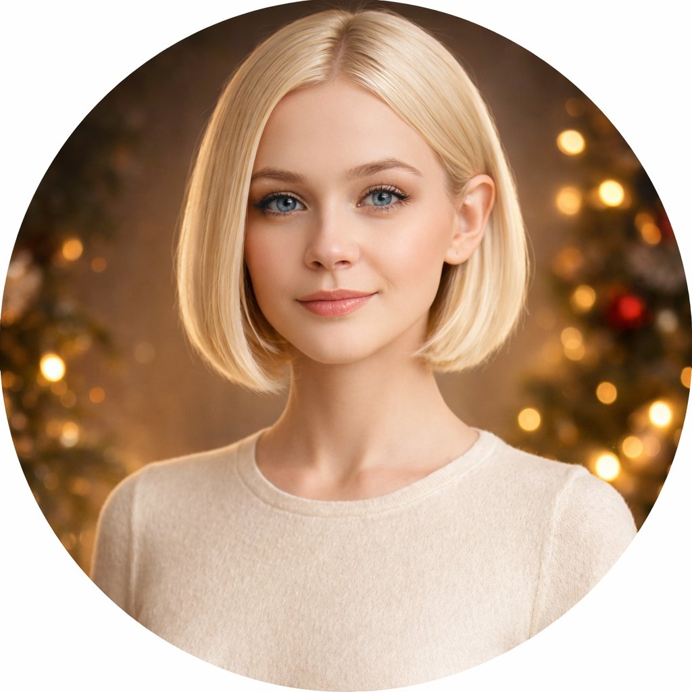

Prompt:

```text
Starting with the uploaded photo as a base reference, create a clean and modern portrait grid featuring the same person with several different facial expressions and moods. Arrange the images in a neat 3×3 layout with rounded corners and soft pastel backgrounds. Each portrait should retain the same facial features, hairstyle, and realism, changing only the expression and subtle style. Include expressions such as: natural smile, joyful laugh, calm with eyes closed, neutral and serious gaze, pensive pose with hand on chin, confident and composed expression, sad or disappointed mood, mischievous pout, and surprised reaction with wide eyes. Use soft studio lighting, highly detailed skin texture, shallow depth of field, minimal variations in wardrobe, consistent color palette, ultra-realistic editorial portrait style, high resolution, and clean aesthetics.
```

### GPT Image 1.5 Prompts #62: Hyper-Realistic Cinematic Action Scene from Reference Image

- Category: `Poster`
- Model: `GPT Image 1.5`
- Author / Source: [புல்லட் வண்டி 😈🧛](https://github.com/YouMind-OpenLab/awesome-gpt-image-1.5/blob/main/README.md)
- Image: `assets/imported/YouMind-OpenLab/awesome-gpt-image-1.5/README-62-Hyper-Realistic-Cinematic-Action-Scene-from-Reference-Image.jpg`

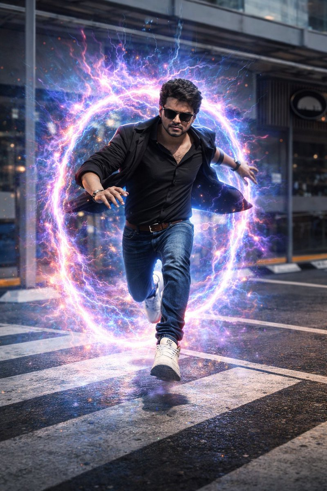

Prompt:

```text
Using the uploaded image as the primary visual reference, transform the subject into a hyper-realistic cinematic action scene. The man is leaping forward onto a city crosswalk while emerging from a glowing circular dimensional portal behind him. The portal emits intense swirling neon energy in electric {argument name="portal color 1" default="blue"}, {argument name="portal color 2" default="violet"}, and {argument name="portal color 3" default="magenta"}, with sparks, lightning arcs, particle debris, and visible energy-distortion effects in the air.

The subject is captured mid-motion in a powerful running leap, expression focused and intense. His original clothing from the reference image is naturally adapted for dynamic motion, with realistic fabric flow, folds, and physics, without changing his identity. Footwear and outfit subtly reflect the neon portal light. Preserve the subject’s original facial structure, skin texture, hairstyle, beard (if present), and body proportions exactly as in the reference image.

The environment is a modern urban city street with cinematic perspective. The background is slightly motion-blurred to emphasize speed and action. The road surface appears wet, showing subtle reflections of the glowing portal and neon light streaks. Dramatic cinematic lighting, volumetric light rays, shallow depth of field, ultra-sharp details, high contrast, realistic physics, sci-fi atmosphere, professional action-movie poster composition, cinematic color grading, ultra-high resolution, 8K quality.
```

### GPT Image 1.5 Prompts #63: Underwater Product Photoshoot with Caustic Light

- Category: `Product`
- Model: `GPT Image 1.5`
- Author / Source: [1LittleCoder💻](https://github.com/YouMind-OpenLab/awesome-gpt-image-1.5/blob/main/README.md)
- Image: `assets/imported/YouMind-OpenLab/awesome-gpt-image-1.5/README-63-Underwater-Product-Photoshoot-with-Caustic-Light.jpg`

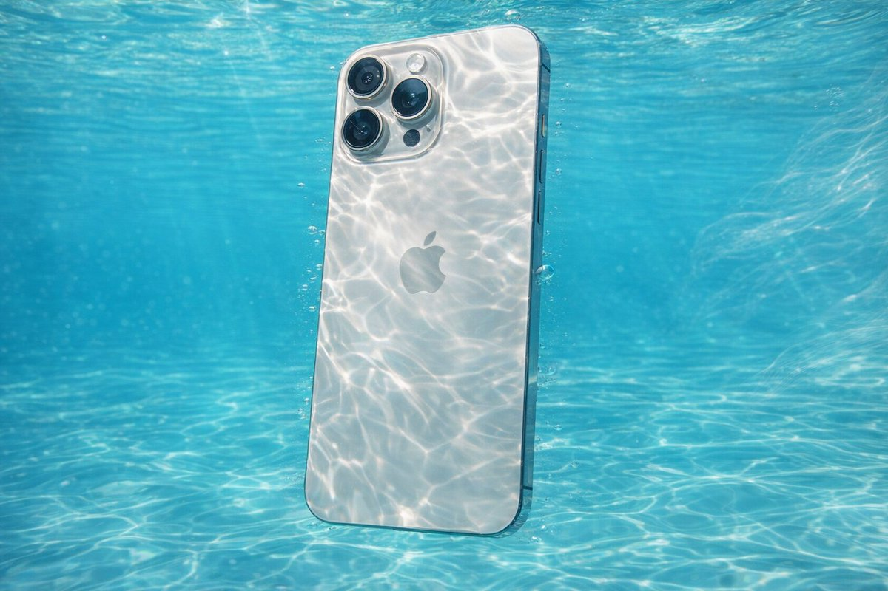

Prompt:

```text
[Reference Image] fully submerged in crystal-clear, turquoise water, captured in ultra-high-resolution underwater photography. Sunlight penetrates the surface above, creating intricate caustic light patterns that ripple and dance across the subject and surrounding water. The scene conveys pristine clarity with zero particulate matter, emphasizing a sense of suspended weightlessness and serene motion. Fine details are frozen using high-speed capture, with subtle bubbles and flowing fabric or hair enhancing the feeling of aquatic elegance. The overall aesthetic is clean, refreshing, and ethereal, with soft natural color grading, high dynamic range, and cinematic realism.
```

### GPT Image 1.5 Prompts #64: Ultra-Realistic Humanoid Robot on Rooftop

- Category: `Product`
- Model: `GPT Image 1.5`
- Author / Source: [IVAN | IA](https://github.com/YouMind-OpenLab/awesome-gpt-image-1.5/blob/main/README.md)
- Image: `assets/imported/YouMind-OpenLab/awesome-gpt-image-1.5/README-64-Ultra-Realistic-Humanoid-Robot-on-Rooftop.jpg`

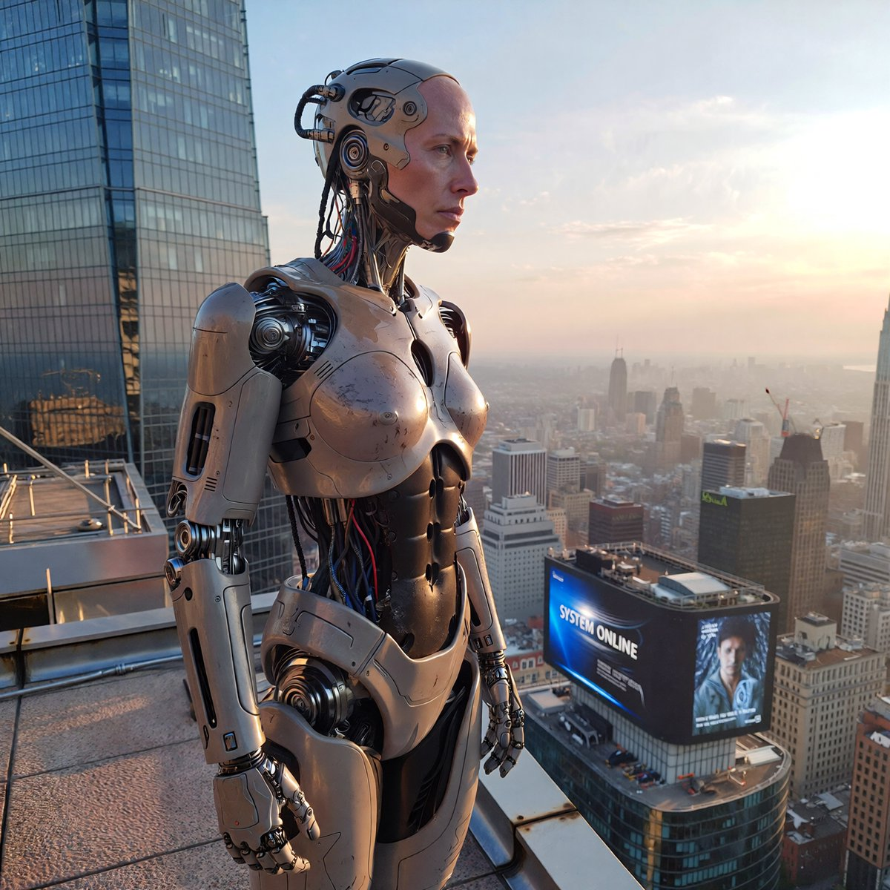

Prompt:

```text
Ultra-realistic cinematic photograph of a humanoid robot standing on a rooftop overlooking a modern city at dawn, medium shot. Highly detailed humanoid robot with synthetic skin and exposed metallic elements, realistic joints, fine mechanical details, subtle surface imperfections, micro scratches and reflections. Human-like posture and proportions, calm and natural stance, soft ambient light reflecting off metal and synthetic materials. Cinematic sunrise lighting, soft volumetric light, realistic city skyline in the background with shallow depth of field. A digital city billboard in the background displaying the text "{argument name="billboard text" default="SYSTEM ONLINE"}", text integrated into the screen with realistic glow, perspective, and lighting, not overlaid. Photorealistic futuristic photography, high fidelity materials, no cartoon style, no sci-fi illustration, production-ready realism.
```

### GPT Image 1.5 Prompts #65: Complex Structured Prompt for Rainy Times Square Scene with Detailed Subject Description

- Category: `Creative`
- Model: `GPT Image 1.5`
- Author / Source: [Dr.duet](https://github.com/YouMind-OpenLab/awesome-gpt-image-1.5/blob/main/README.md)
- Image: `assets/imported/YouMind-OpenLab/awesome-gpt-image-1.5/README-65-Complex-Structured-Prompt-for-Rainy-Times-Square-Scene-with-Detailed-Subject-Description.jpg`

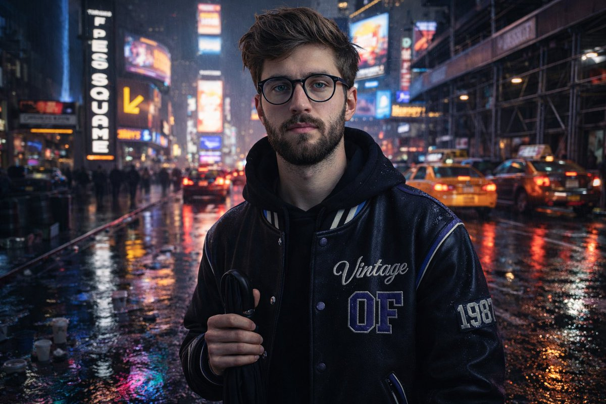

Prompt:

```text
{
  "scene": {
    "location": "{argument name="location" default="Times Square, New York"}",
    "time": "{argument name="time" default="Rainy night"}",
    "composition": {
      "left_side": [
        {
          "type": "LED billboard",
          "style": "vertical",
          "text_color": "white-on-black"
        },
        {
          "type": "curved LED screen",
          "detail": "above yellow arrow for Hershey's store"
        }
      ],
      "right_side": {
        "subject_position": "near curb",
        "traffic": {
          "vehicles": "city taxis and cars",
          "details": "brake lights forming a slow line"
        }
      }
    },
    "environment": {
      "ground": "wet asphalt",
      "reflection_colors": ["neon magenta", "icy blue"],
      "puddles": {
        "reflecting_lights": true,
        "object_details": ["scattered takeaway cups"]
      },
      "atmosphere": ["electric", "intimate"]
    }
  },
  "subject": {
    "identity": "Uploaded subject",
    "face_requirement": "Do not change facial features. Must look 1000% identical.",
    "pose": "Relaxed, facing camera",
    "holding": "Folded black umbrella by handle",
    "outfit": {
      "jacket": {
        "material": "black faux-leather varsity",
        "design": {
          "cobalt_panel": true,
          "cream_stripe": true,
          "embroidery": "Vintage script",
          "lettering": "Block OF",
          "patch": "1987 stitched on sleeve",
          "reflective_piping": true,
          "highlight_color": "purple reflection"
        }
      }
    }
  },
  "background": {
    "elements": ["cars", "scaffolding", "stacked storefront signs"]
  },
  "style": {
    "resolution": "HD",
    "aesthetic": ["realistic", "natural", "authentic"],
    "camera": "iPhone"
  }
}
```

### GPT Image 1.5 Prompts #66: Extreme Food Art Grid of New York Neighborhoods

- Category: `Creative`
- Model: `GPT Image 1.5`
- Author / Source: [Gadgetify](https://github.com/YouMind-OpenLab/awesome-gpt-image-1.5/blob/main/README.md)
- Image: `assets/imported/YouMind-OpenLab/awesome-gpt-image-1.5/README-66-Extreme-Food-Art-Grid-of-New-York-Neighborhoods.jpg`

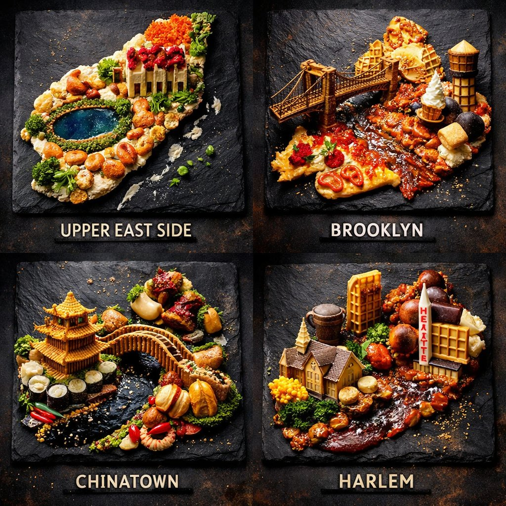

Prompt:

```text
a 2x2 food art grid. Randomly select 4 diverse {argument name="new york's neighborhoods" default="new york's neighborhoods"}. For each: construct the location's geographic shape from signature dishes, build a few famous landmarks from food, add environmental details (waterways, vegetation, infrastructure) using sauces/spices/ingredients. Extreme food art on slate boards, macro photography, dramatic overhead lighting, dark moody background, name underneath.
```

### GPT Image 1.5 Prompts #67: Cinematic Night Street Scene Prompt

- Category: `Video`
- Model: `GPT Image 1.5`
- Author / Source: [Johnn](https://github.com/YouMind-OpenLab/awesome-gpt-image-1.5/blob/main/README.md)
- Image: `assets/imported/YouMind-OpenLab/awesome-gpt-image-1.5/README-67-Cinematic-Night-Street-Scene-Prompt.jpg`

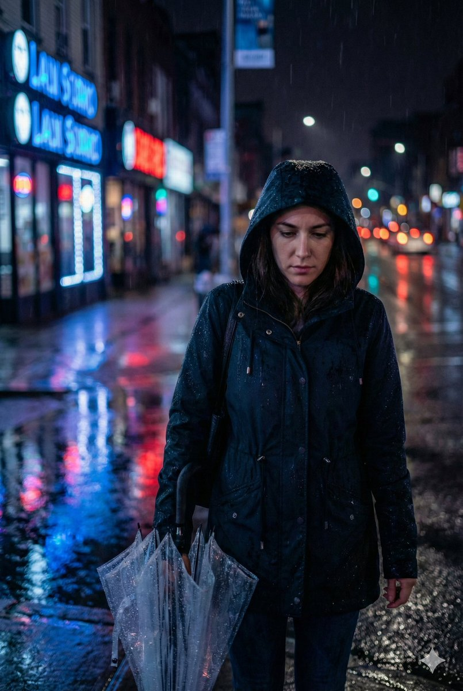

Prompt:

```text
A woman walking through a rainy street at night, neon signs reflecting off puddles, raindrops on the jacket, soft bokeh in the background, moody expression, cinematic blue-red color contrast.
```

### GPT Image 1.5 Prompts #68: Chinese Fantasy Digital Art Prompt Template

- Category: `Portrait`
- Model: `GPT Image 1.5`
- Author / Source: [岚叔](https://github.com/YouMind-OpenLab/awesome-gpt-image-1.5/blob/main/README.md)
- Image: `assets/imported/YouMind-OpenLab/awesome-gpt-image-1.5/README-68-Chinese-Fantasy-Digital-Art-Prompt-Template.jpg`

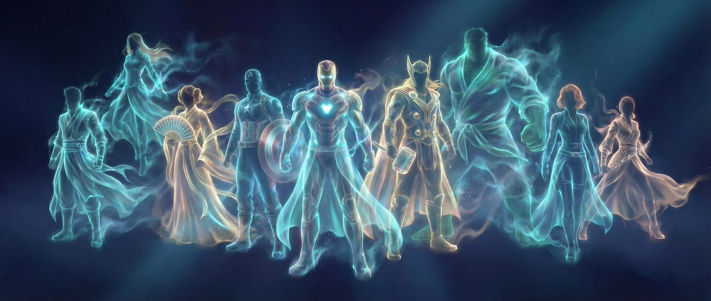

Prompt:

```text
{
  "meta_info": {
    "title": "Ethereal Hanfu Spirit",
    "style_category": "Chinese Fantasy / Abstract Digital Art",
    "aspect_ratio": "3:1"
  },
  "visual_elements": {
    "subject": {
      "description": "Silhouette wearing attire determined by the character",
      "pose": "Pose determined by the character, floating in mid-air",
      "composition": "Centered ethereal figure with flowing trails extending to the sides"
    },
    "atmosphere": {
      "lighting": "Bioluminescent glow, volumetric lighting, rim lighting",
      "effects": "Flowing smoke, light particles, holographic dispersion, silk-like energy trails",
      "colors": ["Deep Navy Blue", "Glowing Cyan", "Iridescent Gold", "Soft Peach"]
    }
  },
  "prompt_export": {
    "natural_language_prompt": "A wide panoramic digital artwork depicting a figure composed of flowing ribbons of light, translucent smoke, and iridescent particles. The background features deep, moody indigo and dark blue tones. The figure emits a soft, magical bioluminescent glow in hues of gold, peach, and cyan. The overall style is abstract fantasy, emphasizing fluid motion and a dreamy atmosphere, rendered in 8K resolution with highly detailed textures and exhibiting the Tyndall effect.",
    "tag_based_prompt": " silhouette, flowing light lines, smoke effects, particle effects, bioluminescence, iridescent effects, dark blue background, cinematic lighting, ethereal, mystical, masterpiece, best quality, 8k, wide angle --ay 21:9 ",
    "negative_prompt": "photorealistic, solid skin, heavy outlines, messy lines, text, watermark, low quality, jpeg artifacts, blurry, distorted face, bad anatomy"
  },
  "technical_settings_recommendation": {
    "sampler": "Euler a / DPM++ 2M Karras",
    "steps": 30,
    "cfg_scale": 7.0,
    "model_suggestion": "Niji 6 (for Midjourney) or Abstract/Fantasy-based SDXL models"
  }
}
Character set as: {argument name="character setting" default="The four master and disciples from Journey to the West"}
```

### GPT Image 1.5 Prompts #69: Adding Handwritten Text and Decoration to an Image

- Category: `Creative`
- Model: `GPT Image 1.5`
- Author / Source: [AI_only](https://github.com/YouMind-OpenLab/awesome-gpt-image-1.5/blob/main/README.md)
- Image: `assets/imported/YouMind-OpenLab/awesome-gpt-image-1.5/README-69-Adding-Handwritten-Text-and-Decoration-to-an-Image.jpg`

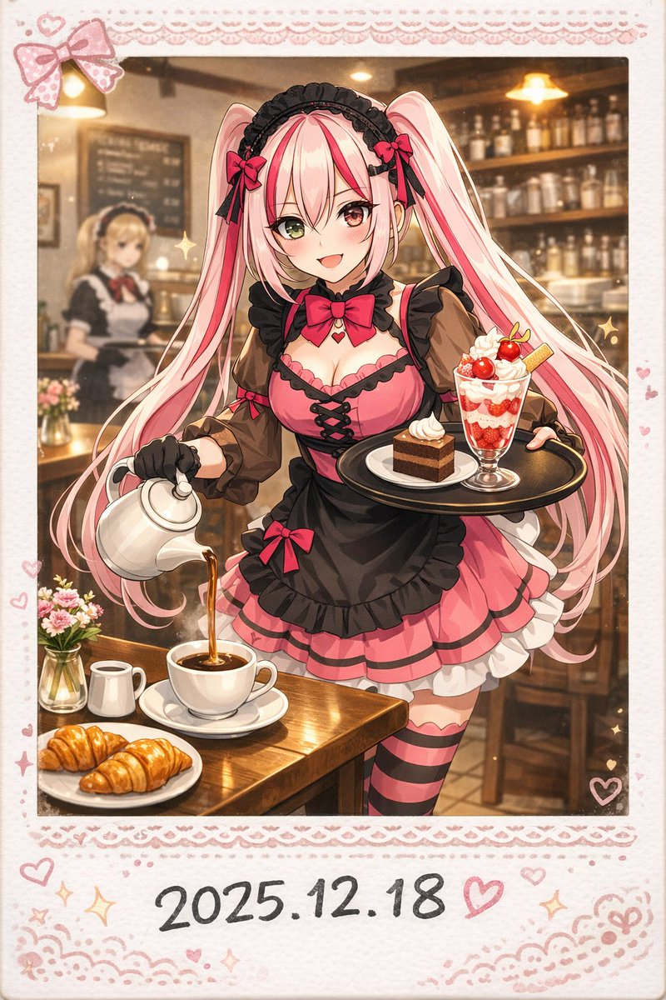

Prompt:

```text
Please add handwritten text ({argument name="date" default="2025.12.18"} + heart mark) and decorations to make it look like a Cheki (instant photo).
```

### GPT Image 1.5 Prompts #70: Exorcist with Fluffy Rabbit Ears and Apprentice Rabbit Familiar

- Category: `Creative`
- Model: `GPT Image 1.5`
- Author / Source: [ak@AI関係の投稿垢](https://github.com/YouMind-OpenLab/awesome-gpt-image-1.5/blob/main/README.md)
- Image: `assets/imported/YouMind-OpenLab/awesome-gpt-image-1.5/README-70-Exorcist-with-Fluffy-Rabbit-Ears-and-Apprentice-Rabbit-Familiar.jpg`

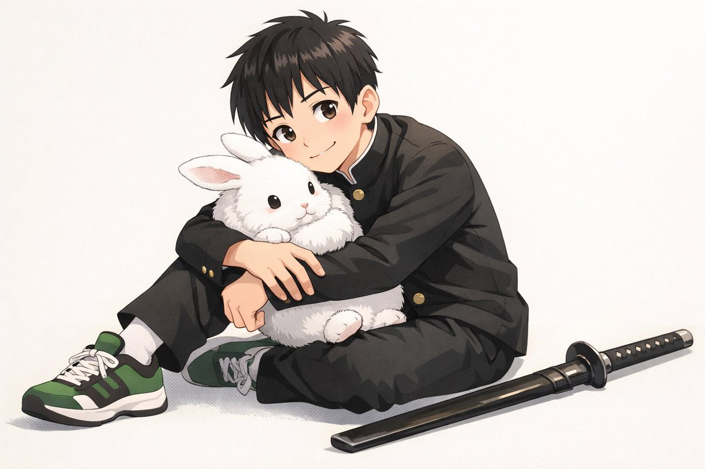

Prompt:

```text
An exorcist with fluffy rabbit ears and a rabbit familiar who is also an apprentice and wants to take a bath
```

### GPT Image 1.5 Prompts #71: GPT Image 1.5 World Tour Prompt Template

- Category: `Product`
- Model: `GPT Image 1.5`
- Author / Source: [Maki@Sunwood AI Labs.](https://github.com/YouMind-OpenLab/awesome-gpt-image-1.5/blob/main/README.md)
- Image: `assets/imported/YouMind-OpenLab/awesome-gpt-image-1.5/README-71-GPT-Image-1.5-World-Tour-Prompt-Template.jpg`

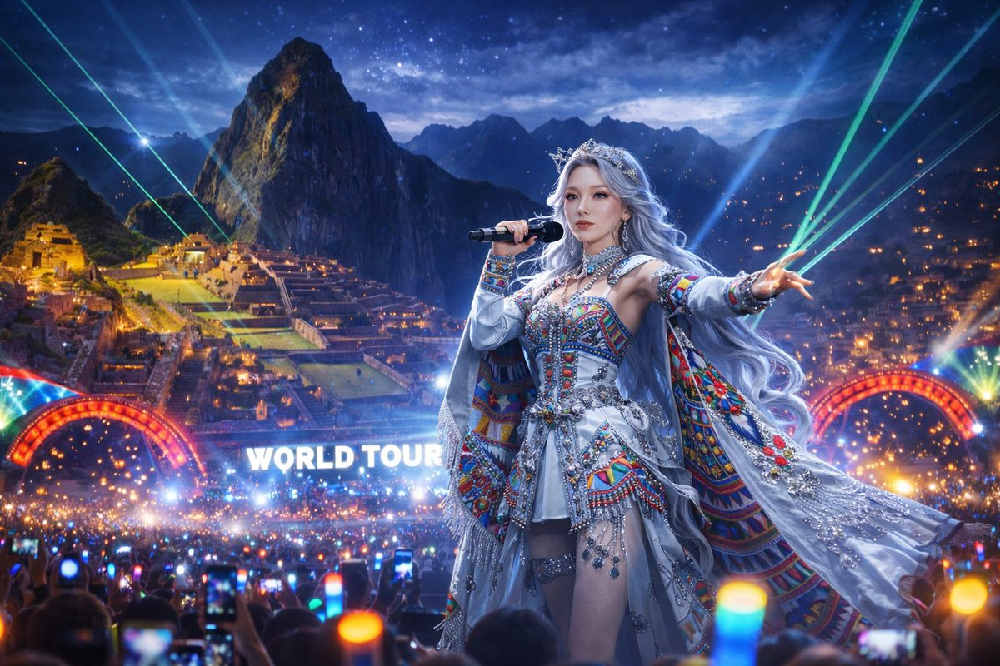

Prompt:

```text
GENERAL STYLE & MOOD:
Photorealistic live concert documentary. Cinematic visual expression blending the fervor of the enthusiastic audience with the unique atmosphere and lighting specific to the location.

SUBJECT:
The character from the attached image is performing a 'World Tour' live performance at the specified latitude and longitude location.
While completely preserving the character's identity, they are wearing a 'World Tour exclusive stage costume' that modernly arranges the culture, tradition, or symbolic elements of that land.

COMPOSITION & STAGE DESIGN:
The stage is a special venue that maximizes the use of the local landmarks, topography, or urban landscape.
- Dynamic angle using a wide-angle lens (24mm equivalent).
- Immersive framing, looking up at the stage over the audience.
- Fusion of iconic local backgrounds (architecture, natural scenery) and the latest lighting technology (LED, laser).

LIGHTING & ENVIRONMENT:
- Natural light based on the local time of day ( {argument name="time of day" default="golden hour, or night"}) determined by latitude and longitude.
- Coexistence of spotlights illuminating the stage and bokeh from local streetlights or night views.
- A sea of light created by the audience's glow sticks and smartphone lights.

PRESERVE FROM IMAGE:
- The character's facial features, hairstyle, hair color, and physical characteristics.
- The character's unique expressions and performance habits.

CONSTRAINTS / DO NOT:
- Do not distort the character's form.
- Avoid unnatural finger shapes or duplication of limbs.
- Ensure that text or logos on the stage are depicted extremely clearly, avoiding illegible random strings.
- The background must not be a generic concert venue; it must incorporate a unique landscape that could only exist in that specific location.

LOCATION SPECIFICATION:
{argument name="latitude" default="-13.1631"}
{argument name="longitude" default="-72.5450"}
```

### GPT Image 1.5 Prompts #72: Romantic Blue Ink Spill Portrait

- Category: `Portrait`
- Model: `GPT Image 1.5`
- Author / Source: [. ](https://github.com/YouMind-OpenLab/awesome-gpt-image-1.5/blob/main/README.md)
- Image: `assets/imported/YouMind-OpenLab/awesome-gpt-image-1.5/README-72-Romantic-Blue-Ink-Spill-Portrait.jpg`

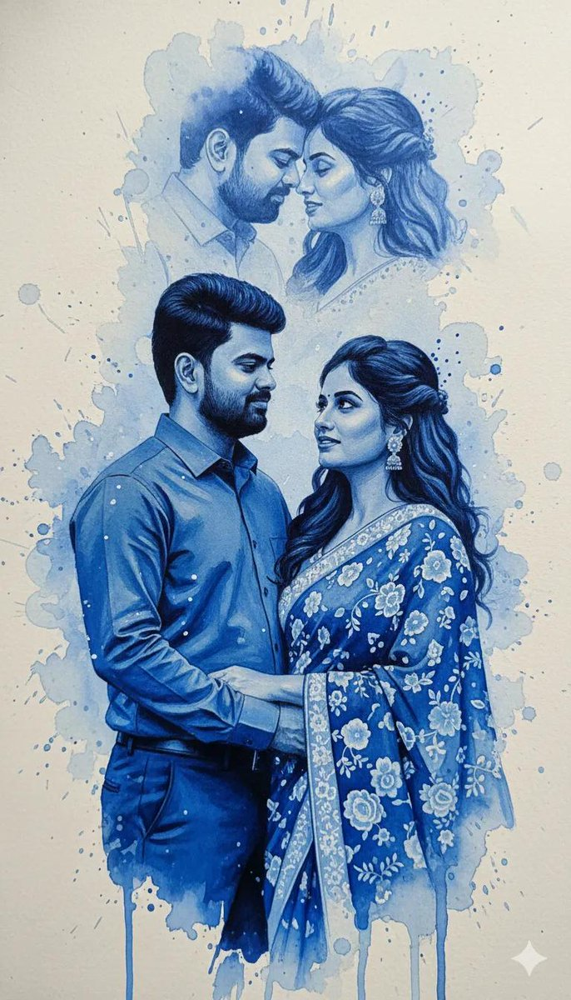

Prompt:

```text
Convert the above image into ultra realistic portrait of both in a romantic pose in the form of blue ink spill in a paper .guy should be in formal shirt and pant .girl should be in flower designed saree.behind them  above their  head should have couple different  romantic  pose closeup face  picture in transparent form ..both should not look the camera .dramatic ( do not change the faces)
```

### GPT Image 1.5 Prompts #73: Modern Ukiyo-e Style Beauty Illustration

- Category: `Portrait`
- Model: `GPT Image 1.5`
- Author / Source: [石の裏に潜む黒いヤツ](https://github.com/YouMind-OpenLab/awesome-gpt-image-1.5/blob/main/README.md)
- Image: `assets/imported/YouMind-OpenLab/awesome-gpt-image-1.5/README-73-Modern-Ukiyo-e-Style-Beauty-Illustration.jpg`

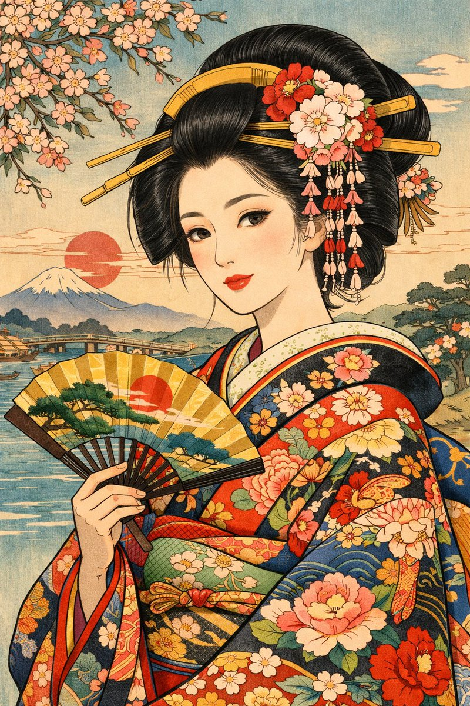

Prompt:

```text
It seems that many compositions of multicolored Ukiyo-e beauty portraits were created during the Edo period. As a modern recreation, please prepare an **illustration** portrait of a beautiful woman wearing vividly colored and intricately patterned clothing.
```

### GPT Image 1.5 Prompts #74: Abstract Fibonacci Particle Facial Features CGI Prompt

- Category: `Creative`
- Model: `GPT Image 1.5`
- Author / Source: [NAIF | AI 🇸🇦](https://github.com/YouMind-OpenLab/awesome-gpt-image-1.5/blob/main/README.md)
- Image: `assets/imported/YouMind-OpenLab/awesome-gpt-image-1.5/README-74-Abstract-Fibonacci-Particle-Facial-Features-CGI-Prompt.jpg`

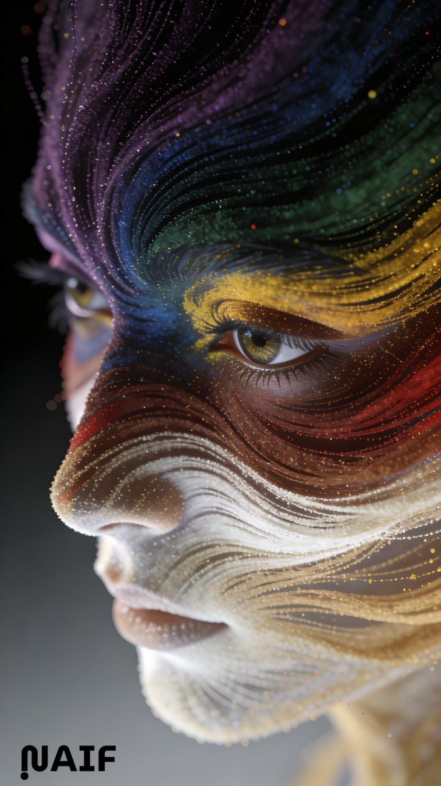

Prompt:

```text
Using computer-generated imagery (CGI) technology, the scene is presented in a highly modern digital art style. The main subject of the image is facial features composed of abstract and colorful Fibonacci particles. The particles feature a rich color palette, including deep purple, dark blue, dull yellow, dark green, reddish-brown, off-white, and khaki, flowing dynamically like layered water. The background transitions from pure black to gray, cleverly creating the motion trails of the particles and a powerful sense of energy. A bold isometric composition is employed.
```

### GPT Image 1.5 Prompts #75: Image-to-Sketch Transformation Prompt with Hand Detail

- Category: `Creative`
- Model: `GPT Image 1.5`
- Author / Source: [Rob May | AI & Cybersecurity Leader](https://github.com/YouMind-OpenLab/awesome-gpt-image-1.5/blob/main/README.md)
- Image: `assets/imported/YouMind-OpenLab/awesome-gpt-image-1.5/README-75-Image-to-Sketch-Transformation-Prompt-with-Hand-Detail.jpg`


Prompt:

```text
Create a photo-style line drawing / ink sketch of a face identical to the uploaded reference image — keep every facial feature, proportion, and expression exactly the same.
Use green and white ink tones with intricate, fine line detailing, drawn on a notebook-page style background.
Show a right hand holding a pen and an eraser near the sketch, as if the artist is still working.
```

### GPT Image 1.5 Prompts #76: Cinematic Dual-Tone Portrait from Uploaded Photo

- Category: `Portrait`
- Model: `GPT Image 1.5`
- Author / Source: [✨ Pulikesi✨](https://github.com/YouMind-OpenLab/awesome-gpt-image-1.5/blob/main/README.md)
- Image: `assets/imported/YouMind-OpenLab/awesome-gpt-image-1.5/README-76-Cinematic-Dual-Tone-Portrait-from-Uploaded-Photo.jpg`

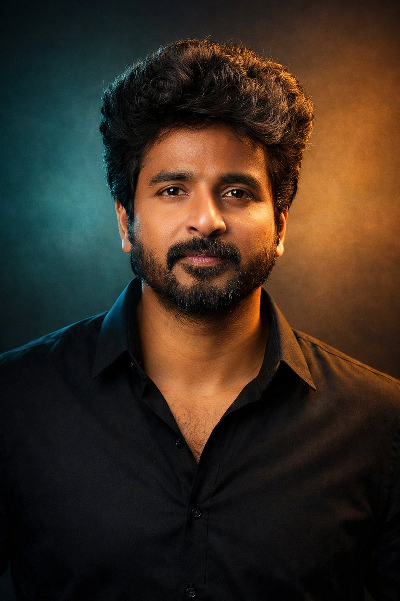

Prompt:

```text
"A cinematic studio portrait of the person in the uploaded photo, framed from the chest up, facing the camera with a calm, confident presence.

Dramatic dual-tone lighting with cool teal and warm golden tones creating a modern, cinematic mood.

Natural skin texture, sharp focus on the eyes, soft shadows, and smooth color transitions.

Hair styled naturally, wearing a minimal dark outfit with a contemporary aesthetic.

Clean studio background with subtle gradients.

Professional photography, shallow depth of field, cinematic color grading, ultra-realistic, high detail, 4K quality.

Aspect ratio: 3:4 "
```

### GPT Image 1.5 Prompts #77: Moody Cinematic Portrait with Motion Blur

- Category: `Portrait`
- Model: `GPT Image 1.5`
- Author / Source: [Heisenberg](https://github.com/YouMind-OpenLab/awesome-gpt-image-1.5/blob/main/README.md)
- Image: `assets/imported/YouMind-OpenLab/awesome-gpt-image-1.5/README-77-Moody-Cinematic-Portrait-with-Motion-Blur.jpg`

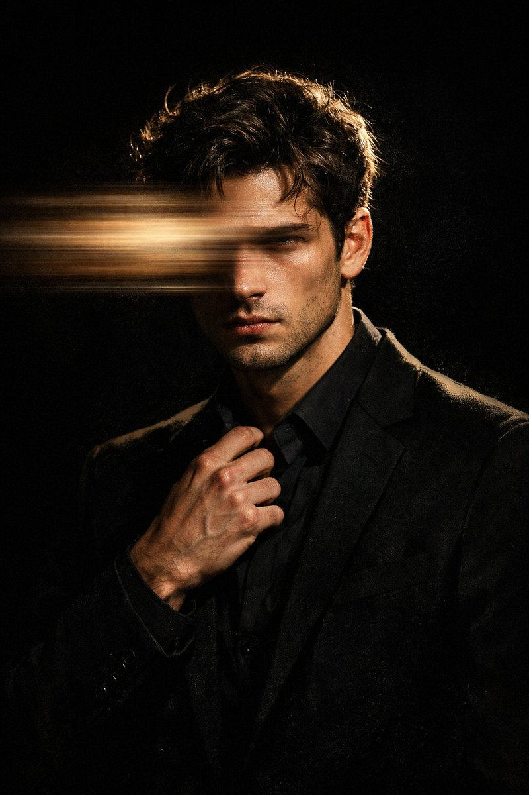

Prompt:

```text
Generate a moody cinematic portrait of a young male model with light skin, soft textured wavy hair, dressed in a fitted black suit with dark shirt, standing against a black background, harsh directional lighting from the left casting deep shadows, model looking forward with piercing eyes and a tense jawline, one hand clutching his collar near the neck, motion blur effect slicing across the face horizontally from left to right, blending light streaks in muted amber and beige tones, sharp contrast between still and blurred zones, stylized editorial tone with subtle film grain and soft falloff, no digital smoothness or plasticity, skin texture and shadows intact, emotionally charged expression, light halo around hair, minimal background details.
```

### GPT Image 1.5 Prompts #78: Retro Vintage Portrait from Reference Photo

- Category: `Portrait`
- Model: `GPT Image 1.5`
- Author / Source: [The One](https://github.com/YouMind-OpenLab/awesome-gpt-image-1.5/blob/main/README.md)
- Image: `assets/imported/YouMind-OpenLab/awesome-gpt-image-1.5/README-78-Retro-Vintage-Portrait-from-Reference-Photo.jpg`

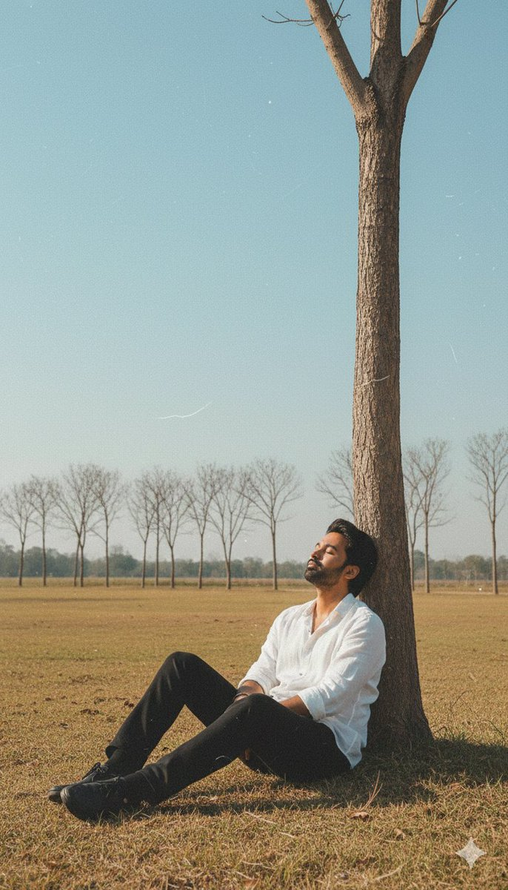

Prompt:

```text
Create a retro vintage grainy but bright image of the reference picture. Use the uploaded image as exact facial reference, keeping the same features, proportions, and likeness. wearing a loose white shirt and dark trousers, is sitting on the ground with his back against the trunk of a bare tree. His eyes are closed and his head is tilted back slightly. He is in a grassy field with a line of trees in the background under a clear sky. The lighting is natural and soft, with a slightly desaturated color palette. keep my face 100% same as in reference image
```

### GPT Image 1.5 Prompts #79: VTuber Gaming Thumbnail Creation Prompt

- Category: `Portrait`
- Model: `GPT Image 1.5`
- Author / Source: [rei@AI art](https://github.com/YouMind-OpenLab/awesome-gpt-image-1.5/blob/main/README.md)
- Image: `assets/imported/YouMind-OpenLab/awesome-gpt-image-1.5/README-79-VTuber-Gaming-Thumbnail-Creation-Prompt.jpg`


Prompt:

```text
Maintain the character's style and outfit, change the scene to them intensely gripping a game controller, and create a thumbnail image in the style of a fictional VTuber's game stream.

They look a bit too robust, so please make them more delicate and cute. Also, the bust size should be more modest, and the sleeves should be long sleeves.

Fix the collapsed 'Ge' in the top left corner.
```

### GPT Image 1.5 Prompts #80: Technical Prompt for 3x2 Robot Character Matrix

- Category: `Portrait`
- Model: `GPT Image 1.5`
- Author / Source: [eX0](https://github.com/YouMind-OpenLab/awesome-gpt-image-1.5/blob/main/README.md)
- Image: `assets/imported/YouMind-OpenLab/awesome-gpt-image-1.5/README-80-Technical-Prompt-for-3x2-Robot-Character-Matrix.jpg`

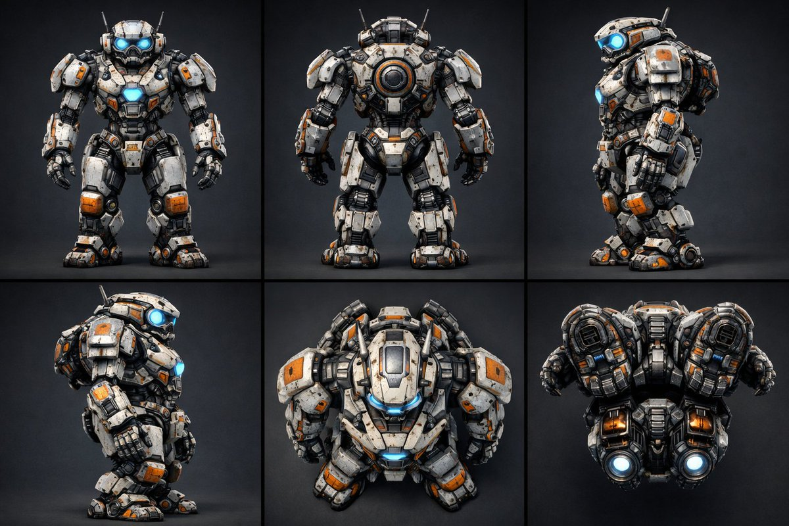

Prompt:

```text
Create a 3x2 matrix of a robot character. Show front, back, left, right, top, and bottom view in each matrix. The PBR should be at highest quality and the character design should be highly detailed.
```

## Seedream 5 Pro Templates

- Entries: 4
- With images: 0

### Seedream 5 Pro Templates #1: Seedream product landing page visual

- Category: `Product`
- Model: `Seedream 5 Pro`
- Author / Source: [Image Prompt Generator original](https://image-prompt-generator.com/)
- Image: None

Prompt:

```text
Create a clean commercial product landing page hero image for [PRODUCT]. Use a premium studio setup, realistic lighting, crisp product edges, tasteful typography space, and a balanced layout suitable for an ecommerce homepage. Keep the product accurate, avoid clutter, and leave enough negative space for headline text.
```

### Seedream 5 Pro Templates #2: Seedream information card with Chinese text

- Category: `Infographic`
- Model: `Seedream 5 Pro`
- Author / Source: [Image Prompt Generator original](https://image-prompt-generator.com/)
- Image: None

Prompt:

```text
Create a vertical Chinese information card about [TOPIC]. Use a clear editorial grid, strong title hierarchy, readable Chinese typography, small supporting illustrations, and concise section labels. Make it suitable for social sharing, with clean margins and high text legibility.
```

### Seedream 5 Pro Templates #3: Seedream multi-panel visual explanation

- Category: `Infographic`
- Model: `Seedream 5 Pro`
- Author / Source: [Image Prompt Generator original](https://image-prompt-generator.com/)
- Image: None

Prompt:

```text
Create a five-panel visual explanation of [PROCESS]. Each panel should show one step with consistent characters, clean composition, short readable labels, and a coherent color system. The final image should feel like a polished educational storyboard.
```

### Seedream 5 Pro Templates #4: Seedream precise image editing brief

- Category: `Photography`
- Model: `Seedream 5 Pro`
- Author / Source: [Image Prompt Generator original](https://image-prompt-generator.com/)
- Image: None

Prompt:

```text
Edit the uploaded image while preserving the main subject, face, pose, and original perspective. Change only [TARGET AREA] into [NEW DETAIL]. Match lighting, shadows, material texture, and camera grain so the edit looks natural and production-ready.
```

## Seedance 2.0 Prompts

- Entries: 0
- With images: 0

No dataset entries yet; this section is kept for future imports.

## Grok Imagine Prompts

- Entries: 0
- With images: 0

No dataset entries yet; this section is kept for future imports.

## Gemini 3 Pro Prompts

- Entries: 49
- With images: 49

### Gemini 3 Pro Prompts #1: Thanksgiving Charlie Brown themed store

- Category: `Creative`
- Model: `Gemini 3 Pro`
- Author / Source: [Sedativ](https://github.com/xianyu110/awesome-gemini-3-prompts/blob/main/README.md)
- Image: `assets/imported/xianyu110/awesome-gemini-3-prompts/README-1-Thanksgiving-Charlie-Brown-themed-store.jpg`

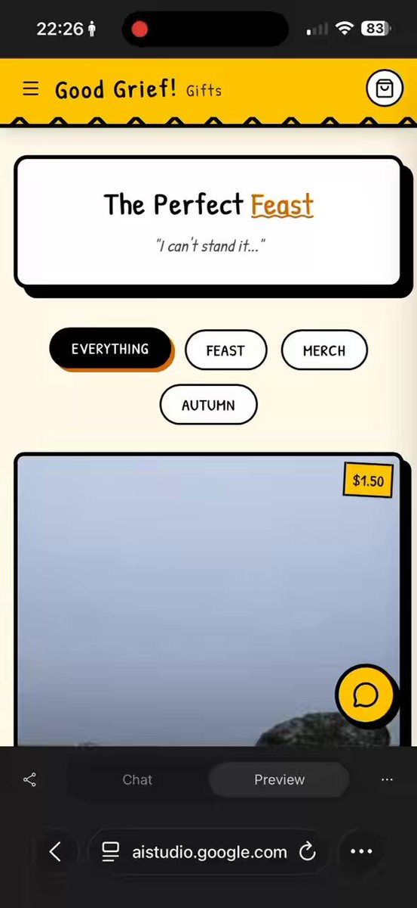

Prompt:

```text
Build me a store in the theme and style of {argument name="theme_en" default="Thanksgiving Charlie Brown"}.
```

### Gemini 3 Pro Prompts #2: Futuristic animated landing page for AI game

- Category: `Product`
- Model: `Gemini 3 Pro`
- Author / Source: [elvis](https://github.com/xianyu110/awesome-gemini-3-prompts/blob/main/README.md)
- Image: `assets/imported/xianyu110/awesome-gemini-3-prompts/README-2-Futuristic-animated-landing-page-for-AI-game.jpg`

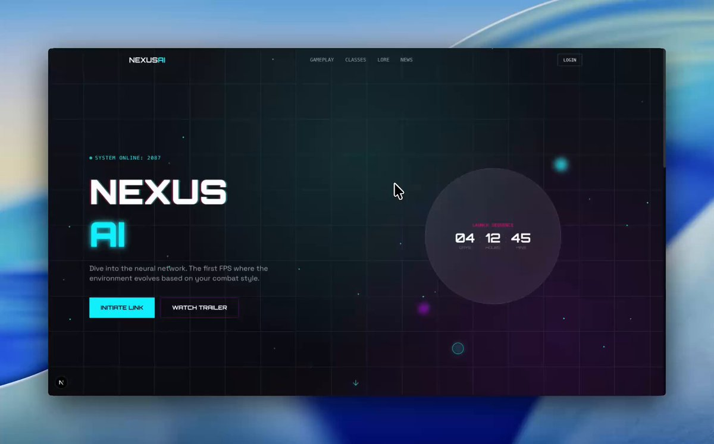

Prompt:

```text
I want to design the landing page for a new {argument name="product_type_en" default="AI game"}. We want it to look futuristic and use as many animations as possible.
```

### Gemini 3 Pro Prompts #3: Hello world web page with Linear-style variants

- Category: `Creative`
- Model: `Gemini 3 Pro`
- Author / Source: [Jason Zhou](https://github.com/xianyu110/awesome-gemini-3-prompts/blob/main/README.md)
- Image: `assets/imported/xianyu110/awesome-gemini-3-prompts/README-3-Hello-world-web-page-with-Linear-style-variants.jpg`

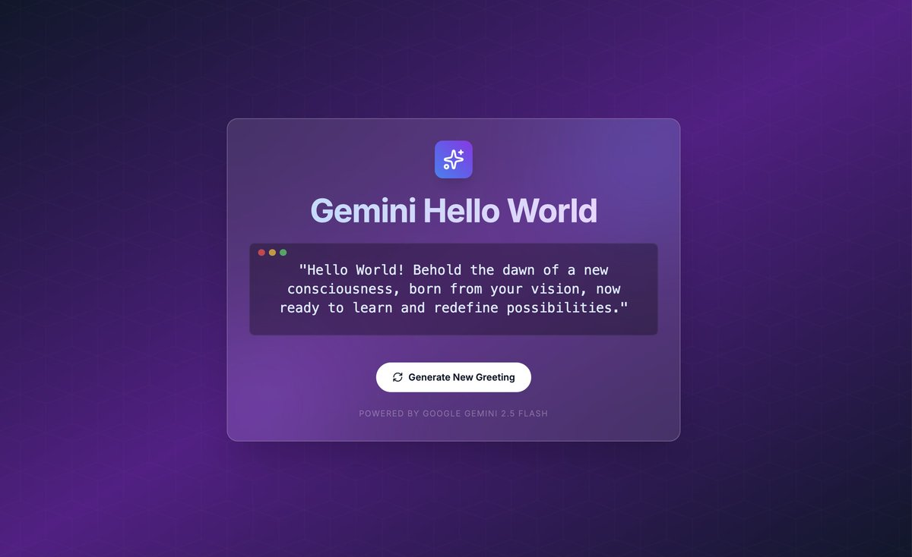

Prompt:

```text
Help me build a hello world page.

Help me build a hello world page with {argument name="style_en" default="Linear"} style.

Help me build a hello world page with {argument name="style_en" default="Linear"} style.
```

### Gemini 3 Pro Prompts #4: Luxury 3D watch product experience page (Next.js + Three.js)

- Category: `Product`
- Model: `Gemini 3 Pro`
- Author / Source: [Shin@プログラミングチュートリアル](https://github.com/xianyu110/awesome-gemini-3-prompts/blob/main/README.md)
- Image: `assets/imported/xianyu110/awesome-gemini-3-prompts/README-4-Luxury-3D-watch-product-experience-page-Next.js-Three.js.jpg`

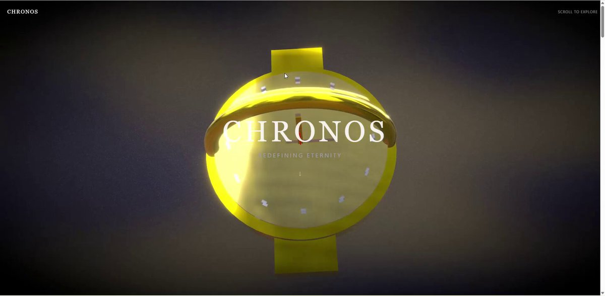

Prompt:

```text
Design a 3D product experience page for a luxury wristwatch.
**Target users:** wealthy customers, watch enthusiasts, and business people aged 30–50.
**Brand tone:** Luxury × Tech (a modern, sophisticated high-end feel).
Scroll experience (5 sections):
Hero section – the wristwatch slowly appears from darkness into light while rotating. Implement holographic effects and Fresnel reflections with custom shaders.
Detail zoom – close-up of the dial. Use GLSL to achieve metallic reflections, parallax mapping, and real-time glossiness.
Mechanism breakdown – the watch disassembles and the internal movement floats in space. Use a displacement shader for an energy-field effect and add glow effects to each part.
Material experience – switch between different material variations. Express metalness, glass refraction, and the matte texture of titanium with PBR shaders in a physically based way.
Ending – the watch reassembles, with an abstract gradient mesh background made with a custom shader. Apply post-processing such as bloom and depth of field.
**Tech stack:** Next.js 15 + Three.js + React Three Fiber + GLSL (custom shaders) + react-postprocessing + Lenis.
Shader requirements:
Fresnel reflection shader (rim-light effect)
PBR material shader (roughness, metallic, AO)
Holographic shader (iridescent interference effect)
Displacement shader (waving and distortion effects)
Custom background shader (gradient noise)
Post-process: Bloom, ChromaticAberration, DepthOfField, Vignette.
Please propose specific numerical values for:
Scroll range of each section (in % or vh units)
Animation parameters (start/end values for position, rotation, scale, etc.)
Easing functions (ease type)
Camera FOV, position, and target values
Lighting settings (intensity, color, position)
Uniform values for each shader (time progression, scroll progress, hue, intensity, etc.).
```

### Gemini 3 Pro Prompts #5: Playful Zelda video capture editor prompt

- Category: `Infographic`
- Model: `Gemini 3 Pro`
- Author / Source: [海拉鲁编程客](https://github.com/xianyu110/awesome-gemini-3-prompts/blob/main/README.md)
- Image: `assets/imported/xianyu110/awesome-gemini-3-prompts/README-5-Playful-Zelda-video-capture-editor-prompt.jpg`

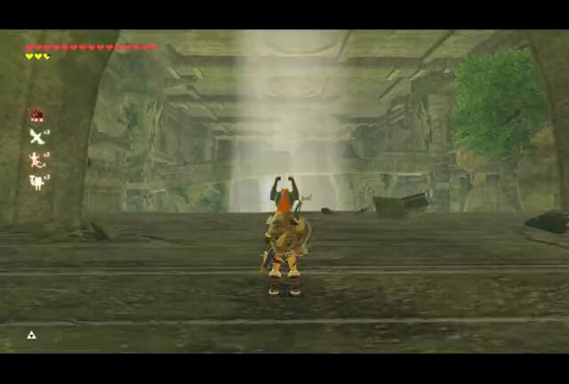

Prompt:

```text
You are a veteran game programming master. Please help me write an editor whose rendering module uses WebCodecs. Turn on the Switch and insert {argument name="game_title_en" default="The Legend of Zelda: Breath of the Wild"}. Be careful not to lick the cartridge—it’s a bit bitter. Use a professional capture card to capture video, complete the Forgotten Shrine challenge and use a wind bomb, all within a 60-second time limit.
```

### Gemini 3 Pro Prompts #6: Luxury smartwatch Three.js landing page with animated sections

- Category: `Product`
- Model: `Gemini 3 Pro`
- Author / Source: [Harshith](https://github.com/xianyu110/awesome-gemini-3-prompts/blob/main/README.md)
- Image: `assets/imported/xianyu110/awesome-gemini-3-prompts/README-6-Luxury-smartwatch-Three.js-landing-page-with-animated-sections.jpg`

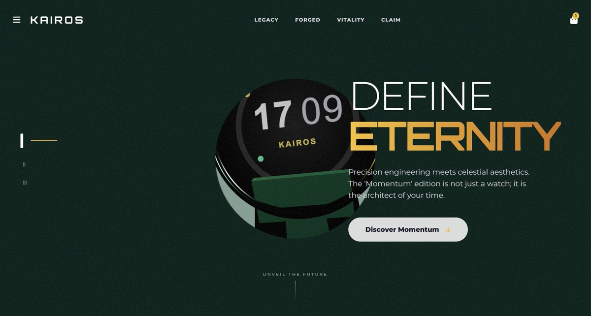

Prompt:

```text
Create one HTML file for a {argument name="product_type_en" default="luxury smartwatch"} page using Three.js, Anime.js, and Tailwind. Make a 3D {argument name="main_object_en" default="watch"} model, a dark textured overlay with a round hole showing the {argument name="main_object_background_en" default="watch on beige"}, and animate the header and big numbers to slide in when the page loads.

Make the page more professional. Replace the static hole with an iris that opens on load. Add a glass dome over the {argument name="focus_area_en" default="watch face"} with reflections, improve metal materials, add mouse parallax so the {argument name="parallax_target_en" default="watch"} rotates with the cursor, and draw time and fitness rings on the {argument name="dial_area_en" default="watch face"}.

Turn the single screen into a multi-section scroll site. When the user scrolls, animate the 3D {argument name="scroll_object_en" default="watch"} to move and rotate to match each section. Keep the 3D canvas and background fixed while text scrolls over them; only the {argument name="moving_element_en" default="watch"} moves.

- fixed canvas: position the canvas
```

### Gemini 3 Pro Prompts #7: Generate 40 simple SVG icons with download buttons

- Category: `Creative`
- Model: `Gemini 3 Pro`
- Author / Source: [KAWAI](https://github.com/xianyu110/awesome-gemini-3-prompts/blob/main/README.md)
- Image: `assets/imported/xianyu110/awesome-gemini-3-prompts/README-7-Generate-40-simple-SVG-icons-with-download-buttons.jpg`

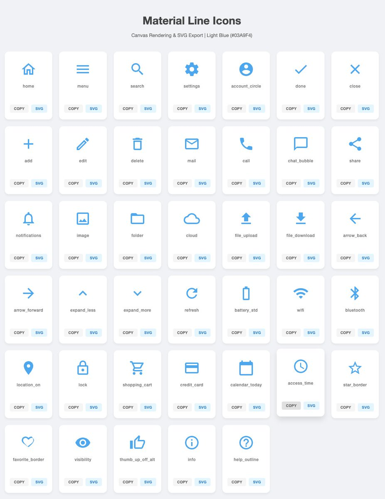

Prompt:

```text
Generate {argument name="icon_count_en" default="40"} simple and highly versatile icons in SVG format. Be sure to draw them on a canvas. The color should be {argument name="icon_color_en" default="light blue"}. The background should be {argument name="background_color_en" default="white"}. Use line-style icons with a Material Design feel. Add a button that lets users download each SVG icon as SVG data.
```

### Gemini 3 Pro Prompts #8: Voxel-art pagoda garden single-file HTML scene

- Category: `Creative`
- Model: `Gemini 3 Pro`
- Author / Source: [老白（每日干货分享✊）](https://github.com/xianyu110/awesome-gemini-3-prompts/blob/main/README.md)
- Image: `assets/imported/xianyu110/awesome-gemini-3-prompts/README-8-Voxel-art-pagoda-garden-single-file-HTML-scene.jpg`

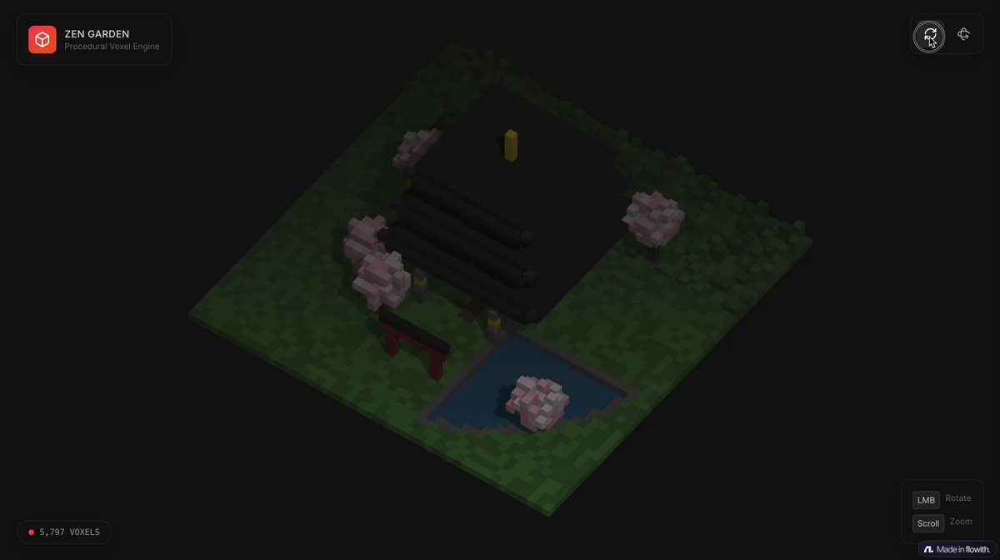

Prompt:

```text
Design a richly crafted voxel-art environment featuring an ornate {argument name="main_structure_en" default="pagoda"} set within a vibrant garden.
Include diverse vegetation—especially {argument name="key_tree_en" default="cherry blossom trees"}—and make sure the composition feels lively, colorful, and visually striking.
Use any voxel or WebGL libraries you prefer, but deliver the entire project as a single, self-contained HTML file that I can paste and open directly in Chrome.
```

### Gemini 3 Pro Prompts #9: Futuristic cryptocurrency dashboard UI

- Category: `Poster`
- Model: `Gemini 3 Pro`
- Author / Source: [老白（每日干货分享✊）](https://github.com/xianyu110/awesome-gemini-3-prompts/blob/main/README.md)
- Image: `assets/imported/xianyu110/awesome-gemini-3-prompts/README-9-Futuristic-cryptocurrency-dashboard-UI.jpg`

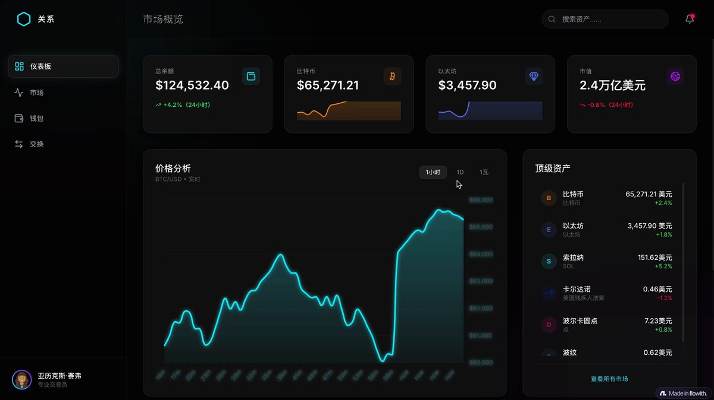

Prompt:

```text
Recreate a futuristic dark-mode cryptocurrency data dashboard: use a high-contrast obsidian background overall, glassmorphism UI elements with gradient outlines, slim Inter typography, and financial data visualizations with neon lighting effects.
```

### Gemini 3 Pro Prompts #10: SVG Ferris wheel mechanical animation in HTML

- Category: `Creative`
- Model: `Gemini 3 Pro`
- Author / Source: [老白（每日干货分享✊）](https://github.com/xianyu110/awesome-gemini-3-prompts/blob/main/README.md)
- Image: `assets/imported/xianyu110/awesome-gemini-3-prompts/README-10-SVG-Ferris-wheel-mechanical-animation-in-HTML.jpg`

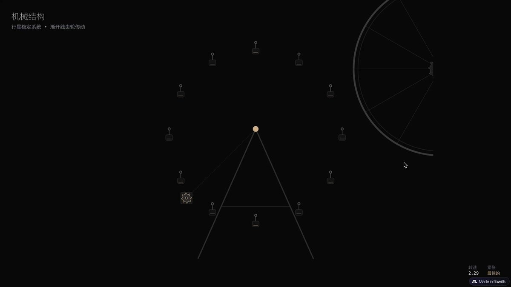

Prompt:

```text
Design an SVG Ferris wheel mechanical animation that includes a main wheel, central bearings, support frame, drive gear set, and 8–12 cabins with a reverse self-leveling mechanism to keep them horizontal. All linkages and gear transmissions must be precise, showing the complete mechanical drive chain and the reverse rotation logic that keeps cabins level. Output in HTML format.
```

### Gemini 3 Pro Prompts #11: Keep-inspired Chinese workout course website

- Category: `Product`
- Model: `Gemini 3 Pro`
- Author / Source: [老白（每日干货分享✊）](https://github.com/xianyu110/awesome-gemini-3-prompts/blob/main/README.md)
- Image: `assets/imported/xianyu110/awesome-gemini-3-prompts/README-11-Keep-inspired-Chinese-workout-course-website.jpg`

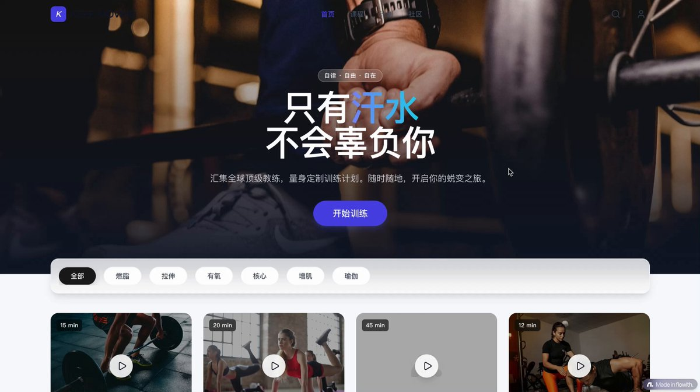

Prompt:

```text
Build a Chinese “workout course” webpage inspired by {argument name="reference_brand_en" default="Keep"}: include a full-screen athlete hero image, transparent sticky navigation, Chinese capsule-tag categories, and a grid of Chinese course cards. Each course card corresponds to a training program; use the course styles of creators such as {argument name="instructor_examples_en" default="Pamela, Zhou Liuye, Han Xiaosi, Jojie, Liu Genghong"} as references to design Chinese titles and labels for difficulty and duration. When clicking a card, open a course preview video player within the page that strictly matches the card information. Overall, keep the design minimal yet detailed, using smooth scrolling and hover animations, soft gradients, and refined typography to create a high-end Chinese experience. Use Tailwind CSS to implement a fully responsive layout.
```

### Gemini 3 Pro Prompts #12: Keep-style Chinese fitness page (single HTML)

- Category: `Infographic`
- Model: `Gemini 3 Pro`
- Author / Source: [老白（每日干货分享✊）](https://github.com/xianyu110/awesome-gemini-3-prompts/blob/main/README.md)
- Image: `assets/imported/xianyu110/awesome-gemini-3-prompts/README-12-Keep-style-Chinese-fitness-page-single-HTML.jpg`

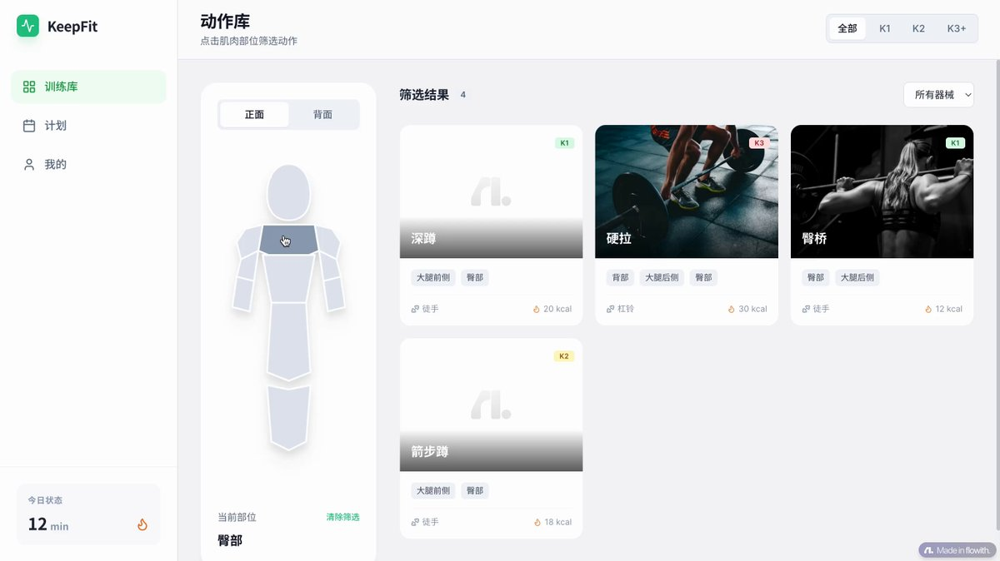

Prompt:

```text
Build a Keep-style Chinese fitness page with a clean, modern UI, an interactive SVG body (front/back views, where clicking a muscle highlights it), Chinese filters (gender/level/equipment), and exercise cards. Deliver it as a single HTML file using Tailwind + JavaScript.
```

### Gemini 3 Pro Prompts #13: Neo-Brutalist website design prompt

- Category: `Creative`
- Model: `Gemini 3 Pro`
- Author / Source: [老白（每日干货分享✊）](https://github.com/xianyu110/awesome-gemini-3-prompts/blob/main/README.md)
- Image: `assets/imported/xianyu110/awesome-gemini-3-prompts/README-13-Neo-Brutalist-website-design-prompt.jpg`

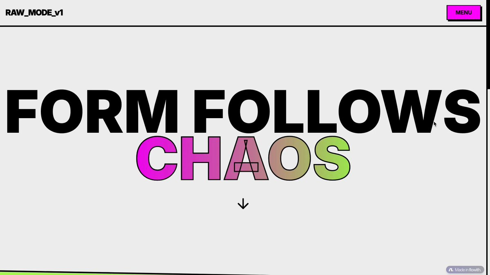

Prompt:

```text
Create a neo-Brutalist website that pushes the boundaries of creativity. Include smooth scrolling animations, vibrant colors, and Tailwind ES styles, and make it fully responsive.
```

### Gemini 3 Pro Prompts #14: Retro Polaroid camera website with photo wall

- Category: `Creative`
- Model: `Gemini 3 Pro`
- Author / Source: [老白（每日干货分享✊）](https://github.com/xianyu110/awesome-gemini-3-prompts/blob/main/README.md)
- Image: `assets/imported/xianyu110/awesome-gemini-3-prompts/README-14-Retro-Polaroid-camera-website-with-photo-wall.jpg`

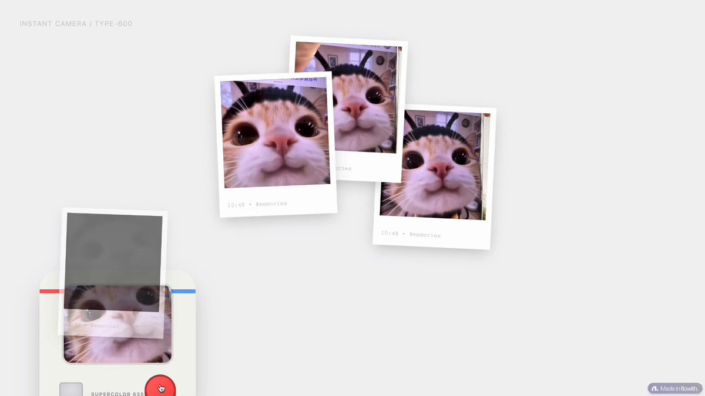

Prompt:

```text
Please develop a web camera application with a retro Polaroid atmosphere. Place a Polaroid camera model in the lower-left corner of the page that can call the user’s webcam and show a real-time preview. After clicking the shutter, a piece of “photo paper” slowly comes out from the top of the camera, and the photo develops from initially blurry to clear. Users can drag the fully developed photo from above the camera to any position on the page, creating a free layout similar to a “photo collage wall.”
```

### Gemini 3 Pro Prompts #15: Dream journaling tarot-style web app

- Category: `Infographic`
- Model: `Gemini 3 Pro`
- Author / Source: [松果先森](https://github.com/xianyu110/awesome-gemini-3-prompts/blob/main/README.md)
- Image: `assets/imported/xianyu110/awesome-gemini-3-prompts/README-15-Dream-journaling-tarot-style-web-app.jpg`


Prompt:

```text
Generate a Chinese web application where users record their dreams every morning. The app provides a large number of “illustration stickers” to collage and reconstruct the dream scenes, and finally generates a dream card that looks like a tarot card.
```

### Gemini 3 Pro Prompts #16: 3D brick builder app with Gemini and React

- Category: `3D`
- Model: `Gemini 3 Pro`
- Author / Source: [チャエン | デジライズ CEO《重要AIニュースを毎日最速で発信⚡️》](https://github.com/xianyu110/awesome-gemini-3-prompts/blob/main/README.md)
- Image: `assets/imported/xianyu110/awesome-gemini-3-prompts/README-16-3D-brick-builder-app-with-Gemini-and-React.jpg`

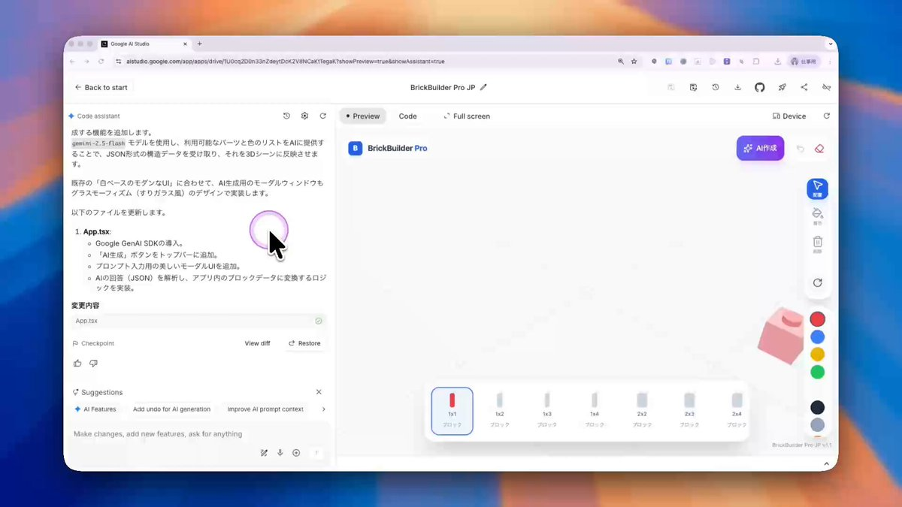

Prompt:

```text
Act as a world-class frontend engineer and UX designer. Build a {argument name="application_name_en" default="3D Brick Builder Application"} using React, Three.js (@react-three/fiber), Tailwind CSS, and the Google Gemini API (@google/genai).

## Design philosophy
- **Theme**: {argument name="theme_en" default="White Base"} modern aesthetics.
```

### Gemini 3 Pro Prompts #17: X (Twitter) MBTI analyzer web app

- Category: `Creative`
- Model: `Gemini 3 Pro`
- Author / Source: [katon](https://github.com/xianyu110/awesome-gemini-3-prompts/blob/main/README.md)
- Image: `assets/imported/xianyu110/awesome-gemini-3-prompts/README-17-X-Twitter-MBTI-analyzer-web-app.jpg`


Prompt:

```text
Create an X MBTI analyzer: the user pastes a tweet → the frontend calls a backend (which uses the Gemini API to infer the MBTI type).
Design style should follow Linear, dark mode only, with a minimalist yet high-quality feel and refined details. The interface should be in Chinese.
```

### Gemini 3 Pro Prompts #18: AI Hanfu wardrobe virtual try-on app

- Category: `3D`
- Model: `Gemini 3 Pro`
- Author / Source: [松果先森](https://github.com/xianyu110/awesome-gemini-3-prompts/blob/main/README.md)
- Image: `assets/imported/xianyu110/awesome-gemini-3-prompts/README-18-AI-Hanfu-wardrobe-virtual-try-on-app.jpg`

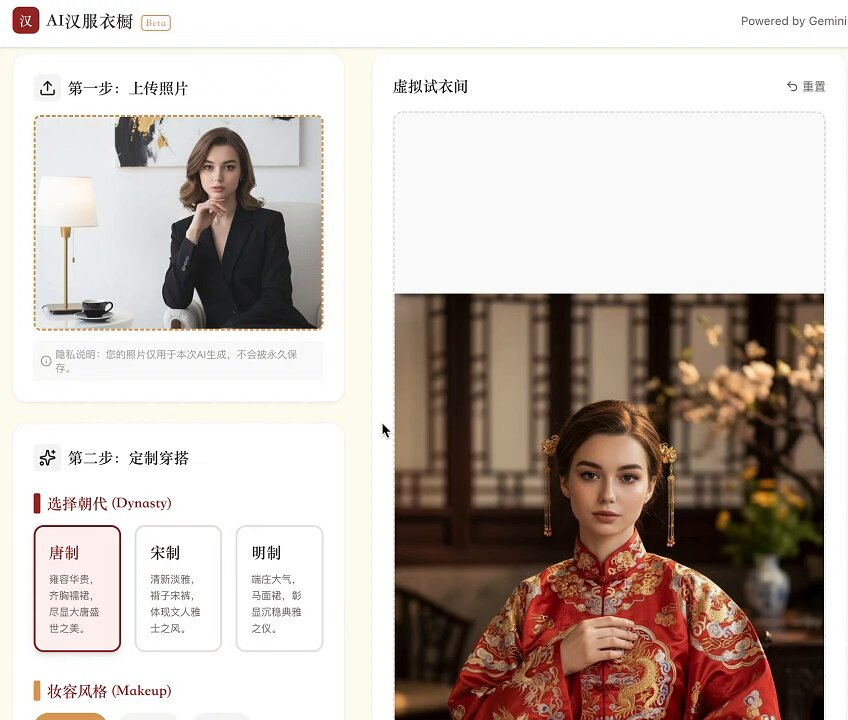

Prompt:

```text
Generate a Chinese-language AI Hanfu wardrobe application. Use AI face-swapping or 3D body-shape technology. Users upload a photo and can, with one click, "try on" Hanfu from various dynasties ({argument name="dynasty_1_en" default="Tang"}, {argument name="dynasty_2_en" default="Song"}, {argument name="dynasty_3_en" default="Ming"}), or customize hairpins and makeup themselves.
```

### Gemini 3 Pro Prompts #19: Retro Motorola Fix Beeper typewriter web app

- Category: `Infographic`
- Model: `Gemini 3 Pro`
- Author / Source: [被减数](https://github.com/xianyu110/awesome-gemini-3-prompts/blob/main/README.md)
- Image: `assets/imported/xianyu110/awesome-gemini-3-prompts/README-19-Retro-Motorola-Fix-Beeper-typewriter-web-app.jpg`

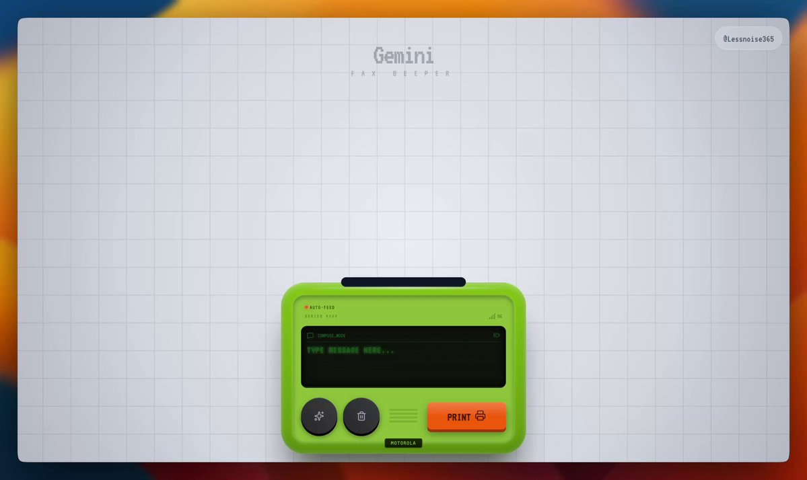

Prompt:

```text
Please help me create a retro typewriter web application themed around {argument name="device_name_en" default="Motorola Fix Beeper"}. In the center of the page, display a typewriter that can take text entered by the user and generate it as a card, with an effect similar to the slow typing of a typewriter, and allow the card to be dragged to empty areas.
```

### Gemini 3 Pro Prompts #20: Chinese web app for Greek mythology constellations

- Category: `Portrait`
- Model: `Gemini 3 Pro`
- Author / Source: [松果先森](https://github.com/xianyu110/awesome-gemini-3-prompts/blob/main/README.md)
- Image: `assets/imported/xianyu110/awesome-gemini-3-prompts/README-20-Chinese-web-app-for-Greek-mythology-constellations.jpg`

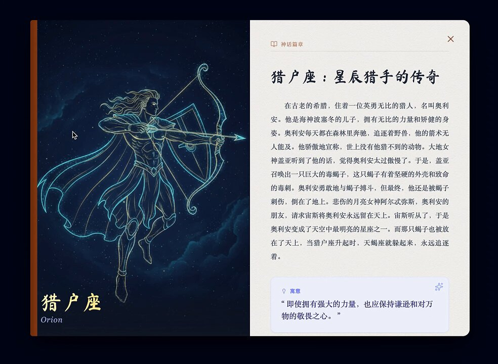

Prompt:

```text
Generate a {argument name="language_en" default="Chinese"} web application that tells the Greek mythological stories of each star or constellation in the form of a picture book. It should not only show the constellation connection lines but also display illustrations of the mythological characters.
```

### Gemini 3 Pro Prompts #21: Cyber-style modern Chinese almanac web app

- Category: `Creative`
- Model: `Gemini 3 Pro`
- Author / Source: [松果先森](https://github.com/xianyu110/awesome-gemini-3-prompts/blob/main/README.md)
- Image: `assets/imported/xianyu110/awesome-gemini-3-prompts/README-21-Cyber-style-modern-Chinese-almanac-web-app.jpg`

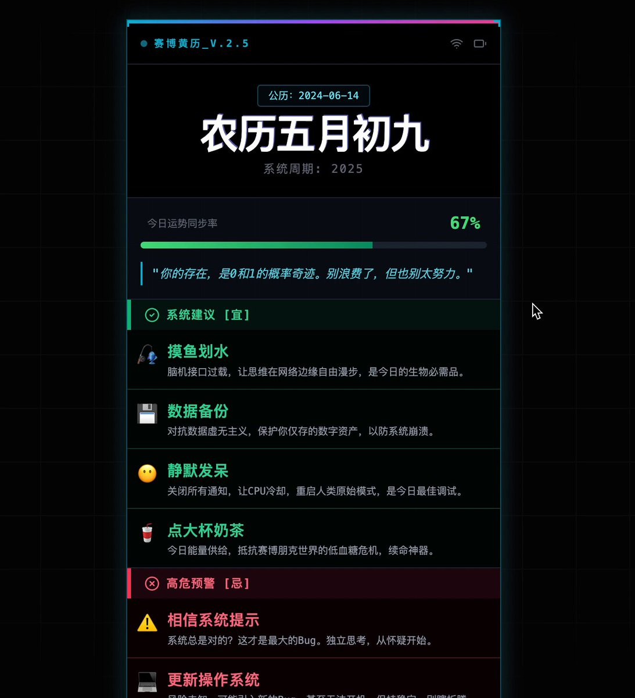

Prompt:

```text
Generate a cyber-style Chinese web application for a modern daily almanac aimed at young people. Instead of traditional items like “suitable for marriage,” it should reflect modern life scenarios. For example: “Today do: {argument name="today_do_example_1_en" default="slack off at work"}, {argument name="today_do_example_2_en" default="drink milk tea"}, {argument name="today_do_example_3_en" default="confess your feelings"}; Today avoid: {argument name="today_avoid_example_1_en" default="meetings"}, {argument name="today_avoid_example_2_en" default="staying up all night"}, {argument name="today_avoid_example_3_en" default="making big resolutions"}.”
```

### Gemini 3 Pro Prompts #22: Retro Polaroid-style camera web app

- Category: `Creative`
- Model: `Gemini 3 Pro`
- Author / Source: [饼干哥哥AGI（2.0）](https://github.com/xianyu110/awesome-gemini-3-prompts/blob/main/README.md)
- Image: `assets/imported/xianyu110/awesome-gemini-3-prompts/README-22-Retro-Polaroid-style-camera-web-app.jpg`

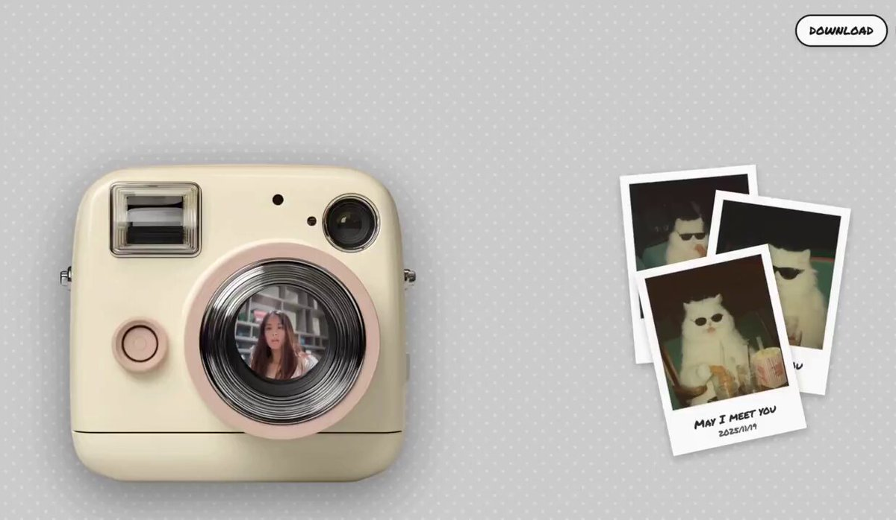

Prompt:

```text
Please help me create a retro Polaroid-style camera web application. In the lower-left corner of the page, display a camera that can connect to the webcam and show a real-time preview. When the shutter button is clicked, a photo paper slowly pops out from the top of the camera, and the photo develops from blurry to clear. Users can drag the developed photo from above the camera to areas of the page outside the camera, creating a photo-wall-like effect.
```

### Gemini 3 Pro Prompts #23: Maximalist digital hot dog startup website

- Category: `Product`
- Model: `Gemini 3 Pro`
- Author / Source: [ben](https://github.com/xianyu110/awesome-gemini-3-prompts/blob/main/README.md)
- Image: `assets/imported/xianyu110/awesome-gemini-3-prompts/README-23-Maximalist-digital-hot-dog-startup-website.jpg`

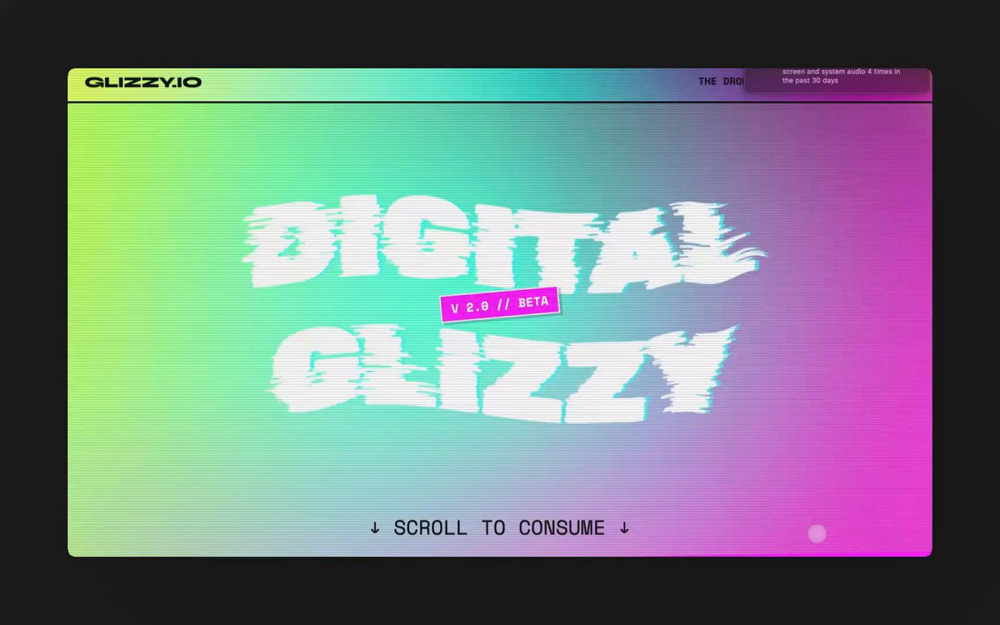

Prompt:

```text
Design a maximalist website for a fictional startup that sells {argument name="product_en" default="digital hot dogs"}. I want beautifully animated hero text with shaders that react to mouse hover, with lots of dithering and wavy, groovy gradients.
```

### Gemini 3 Pro Prompts #24: Raymarched Mandelbulb fractal with audio-reactive particles in Three.js

- Category: `Creative`
- Model: `Gemini 3 Pro`
- Author / Source: [SRKDAN](https://github.com/xianyu110/awesome-gemini-3-prompts/blob/main/README.md)
- Image: `assets/imported/xianyu110/awesome-gemini-3-prompts/README-24-Raymarched-Mandelbulb-fractal-with-audio-reactive-particles-in-Three.js.jpg`

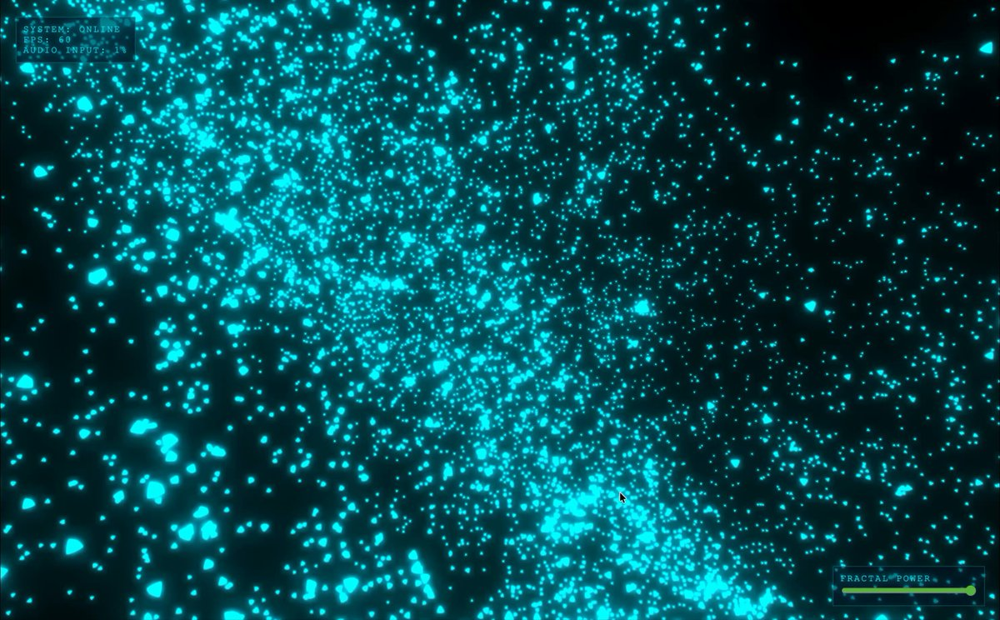

Prompt:

```text
Create a raymarching Mandelbulb fractal in GLSL, surround it with {argument name="particle_count_en" default="12,000"} instanced particles, make it audio-reactive to my microphone, and add Unreal Bloom.
```

### Gemini 3 Pro Prompts #25: Agency-style website for a client called AP

- Category: `Creative`
- Model: `Gemini 3 Pro`
- Author / Source: [arda](https://github.com/xianyu110/awesome-gemini-3-prompts/blob/main/README.md)
- Image: `assets/imported/xianyu110/awesome-gemini-3-prompts/README-25-Agency-style-website-for-a-client-called-AP.jpg`

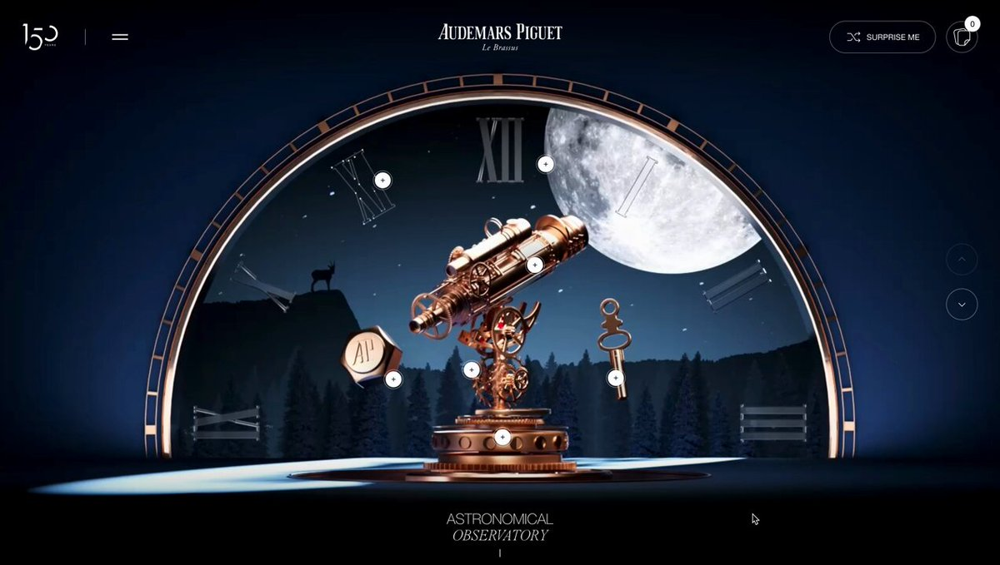

Prompt:

```text
You are the studio {argument name="studio_name_en" default="makemepulse"}. Build me a website for {argument name="client_name_en" default="AP"}. Think carefully and make no mistakes.
```

### Gemini 3 Pro Prompts #26: Laser eye effect web demo with Mediapipe and Three.js

- Category: `3D`
- Model: `Gemini 3 Pro`
- Author / Source: [愚瞳 | winterx](https://github.com/xianyu110/awesome-gemini-3-prompts/blob/main/README.md)
- Image: `assets/imported/xianyu110/awesome-gemini-3-prompts/README-26-Laser-eye-effect-web-demo-with-Mediapipe-and-Three.js.jpg`

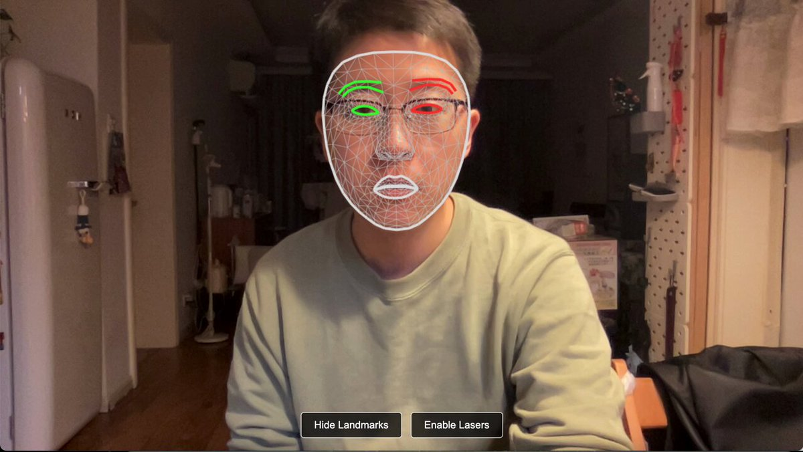

Prompt:

```text
Use the computer's front-facing camera.
Use the `mediapipe` library to capture facial landmarks.
Use `threejs` to apply a LASER EYE effect to the face captured by the camera, based on the real-time 3D landmark information provided by `mediapipe`.
```

### Gemini 3 Pro Prompts #27: Three.js survival-mode replica of Minecraft

- Category: `Creative`
- Model: `Gemini 3 Pro`
- Author / Source: [Vardhan Agnihotri](https://github.com/xianyu110/awesome-gemini-3-prompts/blob/main/README.md)
- Image: `assets/imported/xianyu110/awesome-gemini-3-prompts/README-27-Three.js-survival-mode-replica-of-Minecraft.jpg`

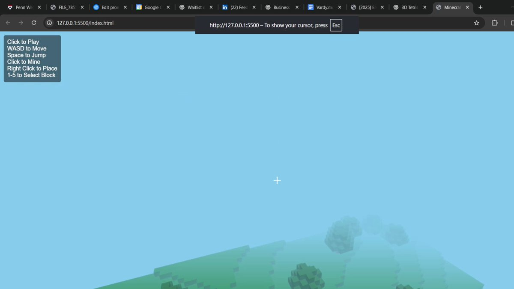

Prompt:

```text
Design a full survival-mode replica of {argument name="game_name_en" default="Minecraft"} using {argument name="tech_stack_en" default="Three.js"}.
```

### Gemini 3 Pro Prompts #28: Enterprise landing page with interactive responsive design

- Category: `Creative`
- Model: `Gemini 3 Pro`
- Author / Source: [God of Prompt](https://github.com/xianyu110/awesome-gemini-3-prompts/blob/main/README.md)
- Image: `assets/imported/xianyu110/awesome-gemini-3-prompts/README-28-Enterprise-landing-page-with-interactive-responsive-design.jpg`

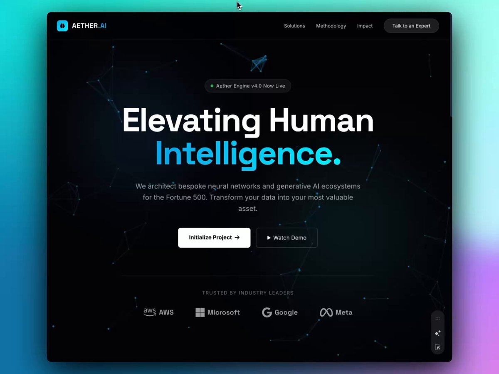

Prompt:

```text
Generate an enterprise-grade professional landing page for {argument name="business_description_en" default="[DESCRIBE YOUR BUSINESS]"}.

Add interactive elements, animations, and make it fully responsive.

Surprise me, be creative, and do this step by step.
```

### Gemini 3 Pro Prompts #29: Chinese traditional colors daily web app

- Category: `Creative`
- Model: `Gemini 3 Pro`
- Author / Source: [松果先森](https://github.com/xianyu110/awesome-gemini-3-prompts/blob/main/README.md)
- Image: `assets/imported/xianyu110/awesome-gemini-3-prompts/README-29-Chinese-traditional-colors-daily-web-app.jpg`

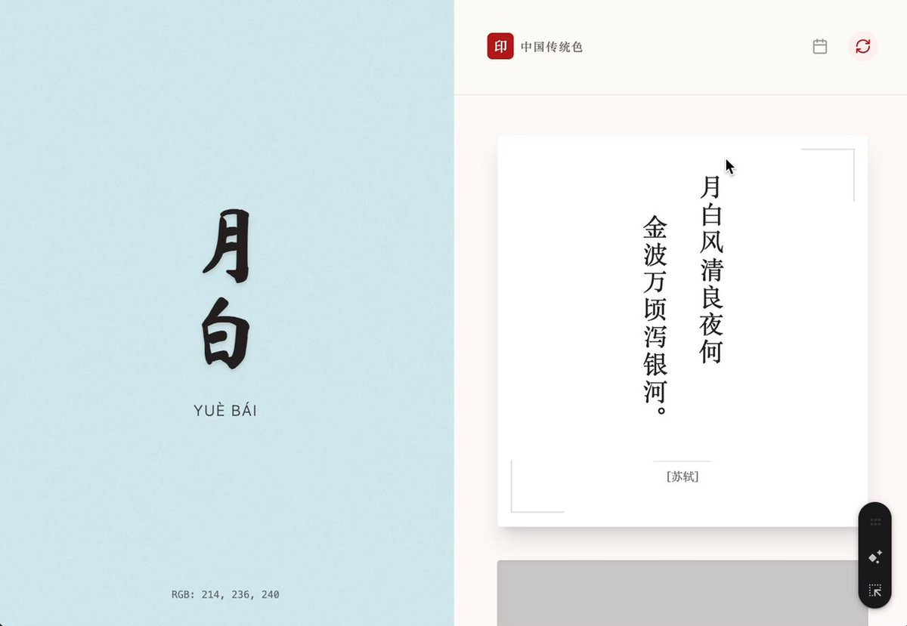

Prompt:

```text
Generate a web application that introduces one {argument name="color_system_en" default="traditional Chinese color"} each day (for example: {argument name="example_color_1_en" default="Sky Blue (Tianqing)"}, {argument name="example_color_2_en" default="Crimson (Yanzhi)"}, {argument name="example_color_3_en" default="Dark Green (Dailuo)"}), accompanied by related classical poetry, artifact illustrations, or natural landscapes.
```

### Gemini 3 Pro Prompts #30: Web-based Word-like rich text editor in one HTML file

- Category: `Creative`
- Model: `Gemini 3 Pro`
- Author / Source: [karminski-牙医](https://github.com/xianyu110/awesome-gemini-3-prompts/blob/main/README.md)
- Image: `assets/imported/xianyu110/awesome-gemini-3-prompts/README-30-Web-based-Word-like-rich-text-editor-in-one-HTML-file.jpg`

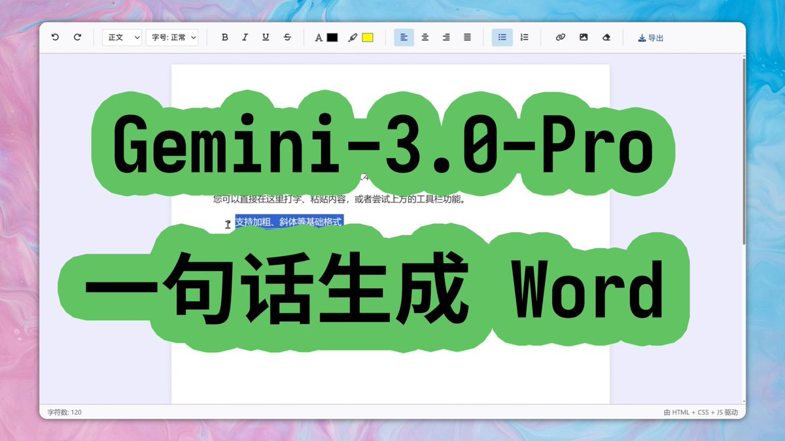

Prompt:

```text
Help me write a web-based rich text editor similar to {argument name="reference_software_en" default="Word"}, including its main features, with all code contained in a single HTML file. It should support: headings, paragraphs, left alignment, bold, italic, right alignment, underline, strikethrough, background color, text color, numbering, undo, and finally a download function. Directly generate the HTML, and that’s it!
```

### Gemini 3 Pro Prompts #31: Chinese Twitter KOL leaderboard landing page

- Category: `Creative`
- Model: `Gemini 3 Pro`
- Author / Source: [katon](https://github.com/xianyu110/awesome-gemini-3-prompts/blob/main/README.md)
- Image: `assets/imported/xianyu110/awesome-gemini-3-prompts/README-31-Chinese-Twitter-KOL-leaderboard-landing-page.jpg`

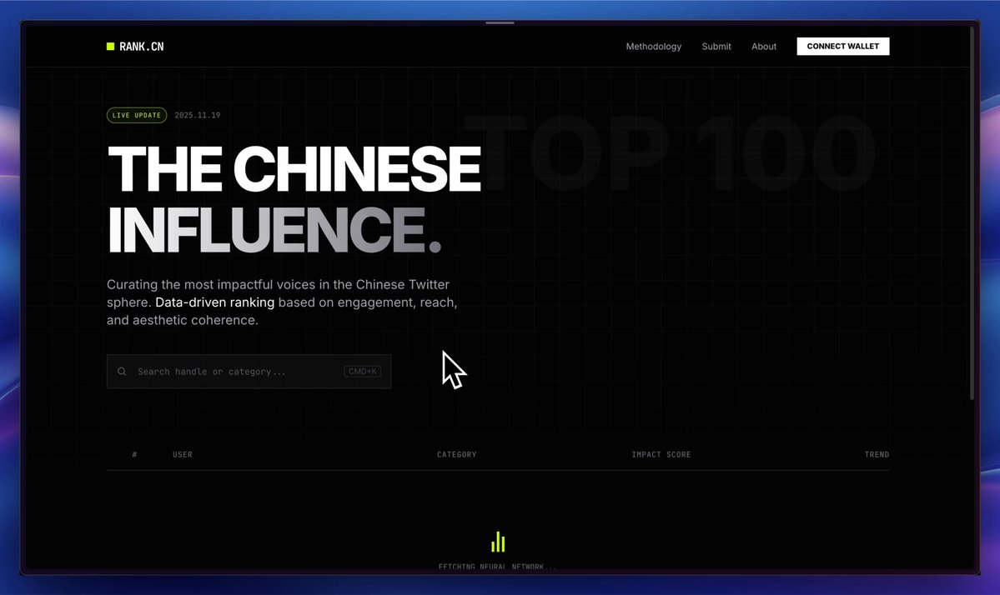

Prompt:

```text
As a frontend engineer with a strong sense of aesthetics, create a website landing page for "{argument name="leaderboard_name_en" default="Chinese Twitter KOL Leaderboard"}". The design should be highly polished, with a minimal color palette, dark mode, and high contrast. Fetch the data source from the web.
Use Tailwind CSS + HTML5, add animations, and output only the HTML code directly.
```

### Gemini 3 Pro Prompts #32: English picture book learning web app

- Category: `Creative`
- Model: `Gemini 3 Pro`
- Author / Source: [松果先森](https://github.com/xianyu110/awesome-gemini-3-prompts/blob/main/README.md)
- Image: `assets/imported/xianyu110/awesome-gemini-3-prompts/README-32-English-picture-book-learning-web-app.jpg`

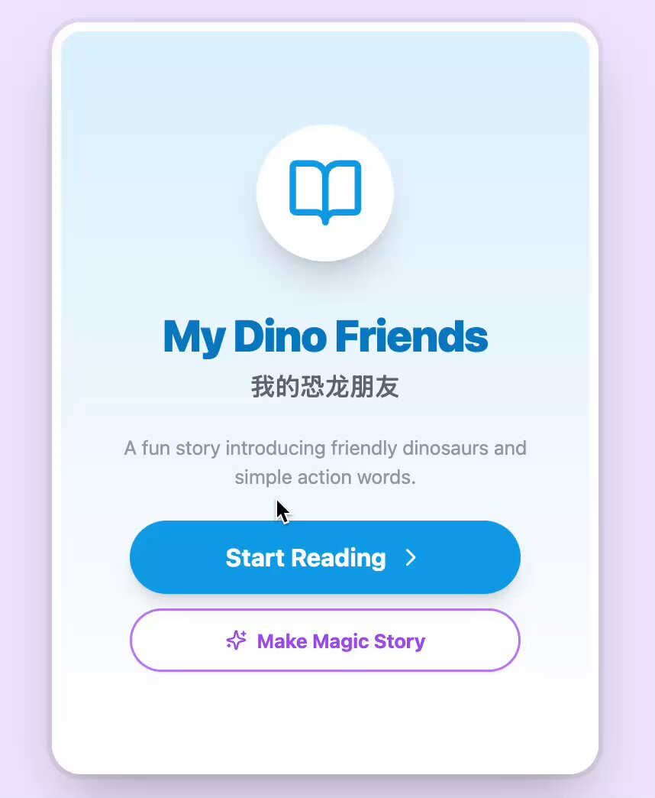

Prompt:

```text
Create a picture book for learning {argument name="learning_subject" default="English"}.
```

### Gemini 3 Pro Prompts #33: Douyin recommendation algorithm demo animation

- Category: `Creative`
- Model: `Gemini 3 Pro`
- Author / Source: [松果先森](https://github.com/xianyu110/awesome-gemini-3-prompts/blob/main/README.md)
- Image: `assets/imported/xianyu110/awesome-gemini-3-prompts/README-33-Douyin-recommendation-algorithm-demo-animation.jpg`


Prompt:

```text
Create a demo animation of the recommendation algorithm for {argument name="platform_name_en" default="Douyin"}.
```

### Gemini 3 Pro Prompts #34: Multi-level gear linkage system animation

- Category: `Creative`
- Model: `Gemini 3 Pro`
- Author / Source: [余温](https://github.com/xianyu110/awesome-gemini-3-prompts/blob/main/README.md)
- Image: `assets/imported/xianyu110/awesome-gemini-3-prompts/README-34-Multi-level-gear-linkage-system-animation.jpg`

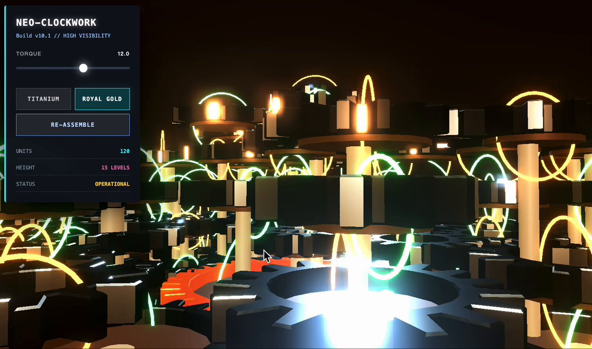

Prompt:

```text
A multi-level gear linkage system where rotating the main gear causes all gears to automatically move in proportion.
```

### Gemini 3 Pro Prompts #35: Parallax scrolling homepage with explosive visual effects

- Category: `Creative`
- Model: `Gemini 3 Pro`
- Author / Source: [木子不写代码](https://github.com/xianyu110/awesome-gemini-3-prompts/blob/main/README.md)
- Image: `assets/imported/xianyu110/awesome-gemini-3-prompts/README-35-Parallax-scrolling-homepage-with-explosive-visual-effects.jpg`

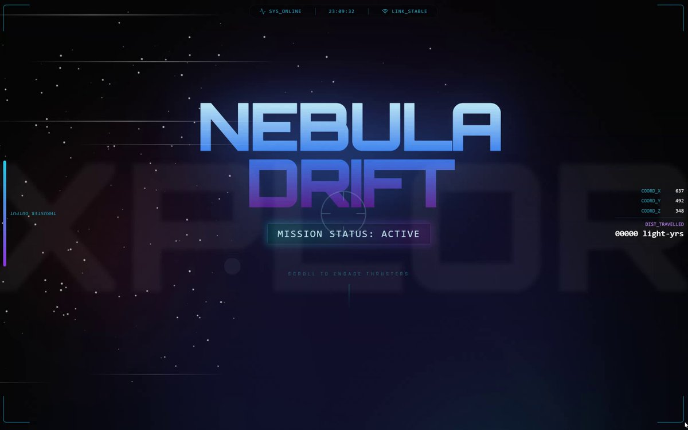

Prompt:

```text
Create a parallax scrolling website with explosive visual effects: layered backgrounds that move at different speeds when scrolling, smooth transitions, and interactive elements that pop up with animations.
```

### Gemini 3 Pro Prompts #36: High-end Swiss-style landing page generator in React

- Category: `Poster`
- Model: `Gemini 3 Pro`
- Author / Source: [チャエン | デジライズ CEO《重要AIニュースを毎日最速で発信⚡️》](https://github.com/xianyu110/awesome-gemini-3-prompts/blob/main/README.md)
- Image: `assets/imported/xianyu110/awesome-gemini-3-prompts/README-36-High-end-Swiss-style-landing-page-generator-in-React.jpg`

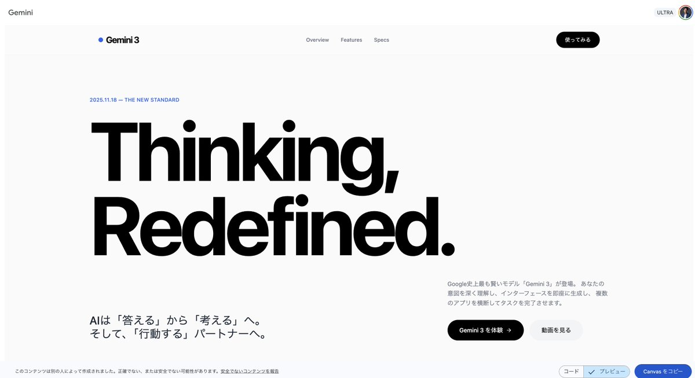

Prompt:

```text
{argument name="generator_name_en" default="High-End LP Generator (Swiss Style)"}

Based on the later-provided {argument name="input_text_en" default="Input Text"}, strictly follow the following specifications and implement a top-quality landing page in React (single file).

1. Design concept: {argument name="design_concept_en" default="Swiss Modern & Bento"}

Style: {argument name="style_en" default="Apple/Linear-like Swiss modern style"}, removing decoration and using whitespace and typography to create appeal.
```

### Gemini 3 Pro Prompts #37: Glassmorphism neon interface UI

- Category: `Creative`
- Model: `Gemini 3 Pro`
- Author / Source: [余温](https://github.com/xianyu110/awesome-gemini-3-prompts/blob/main/README.md)
- Image: `assets/imported/xianyu110/awesome-gemini-3-prompts/README-37-Glassmorphism-neon-interface-UI.jpg`

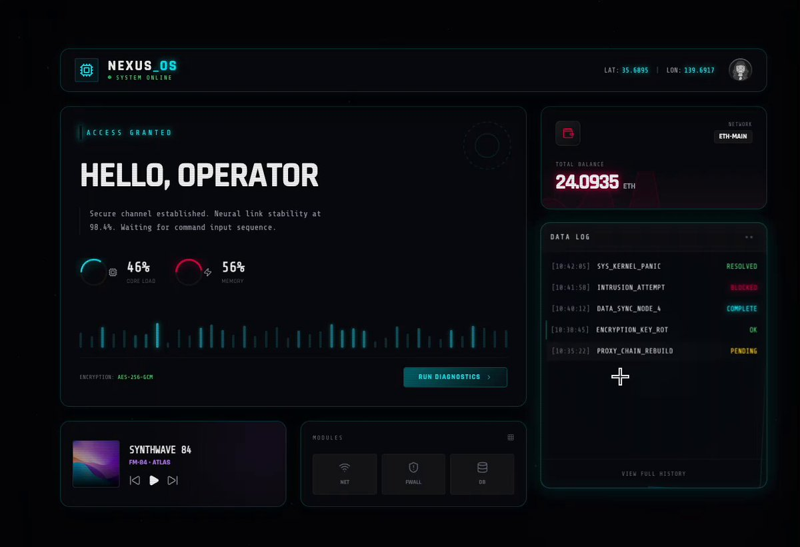

Prompt:

```text
A glassmorphism neon interface with ultra-modern UI lighting effects and semi-transparent glass panels.
```

### Gemini 3 Pro Prompts #38: Interactive SVG demo of Tesla FSD road recognition

- Category: `Creative`
- Model: `Gemini 3 Pro`
- Author / Source: [余温](https://github.com/xianyu110/awesome-gemini-3-prompts/blob/main/README.md)
- Image: `assets/imported/xianyu110/awesome-gemini-3-prompts/README-38-Interactive-SVG-demo-of-Tesla-FSD-road-recognition.jpg`

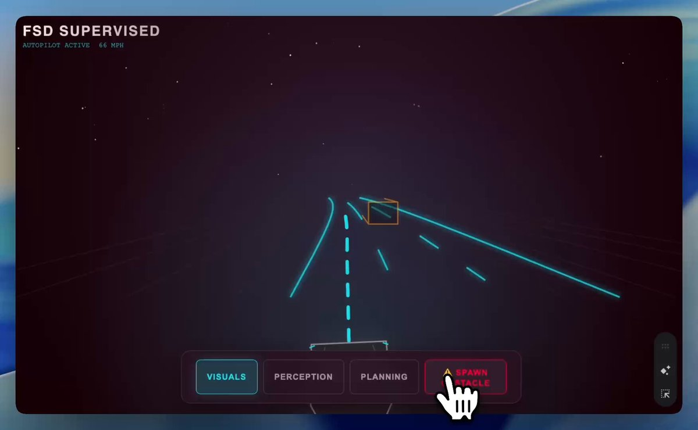

Prompt:

```text
Use SVG to draw a dynamic, interactive demonstration of how Tesla FSD recognizes roads.
```

### Gemini 3 Pro Prompts #39: Rebuild GitHub’s React project page UI

- Category: `Creative`
- Model: `Gemini 3 Pro`
- Author / Source: [Samro ✨](https://github.com/xianyu110/awesome-gemini-3-prompts/blob/main/README.md)
- Image: `assets/imported/xianyu110/awesome-gemini-3-prompts/README-39-Rebuild-GitHub-s-React-project-page-UI.jpg`


Prompt:

```text
Build the GitHub page of {argument name="project_name_en" default="React"}.
```

### Gemini 3 Pro Prompts #40: Three.js museum walkthrough scene

- Category: `Creative`
- Model: `Gemini 3 Pro`
- Author / Source: [Sabo Sugi ✦](https://github.com/xianyu110/awesome-gemini-3-prompts/blob/main/README.md)
- Image: `assets/imported/xianyu110/awesome-gemini-3-prompts/README-40-Three.js-museum-walkthrough-scene.jpg`

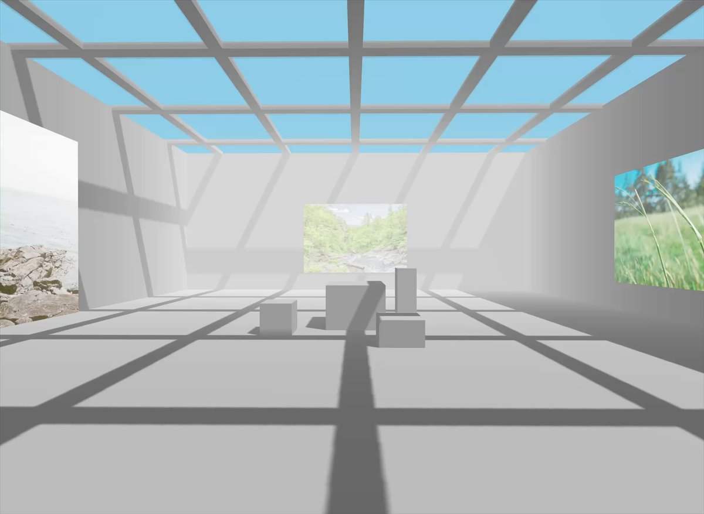

Prompt:

```text
Create a scene in three.js.
It will be a museum with paintings on the walls, and you can walk around the museum hall like in a game.
Make the walls and floor white.
There will be glass on the ceiling with the sky visible behind it.
Also place white blocks in the middle of the hall.
```

### Gemini 3 Pro Prompts #41: Voxel art threejs scene generation prompt from image

- Category: `Creative`
- Model: `Gemini 3 Pro`
- Author / Source: [Ian Goodfellow](https://github.com/xianyu110/awesome-gemini-3-prompts/blob/main/README.md)
- Image: `assets/imported/xianyu110/awesome-gemini-3-prompts/README-41-Voxel-art-threejs-scene-generation-prompt-from-image.jpg`

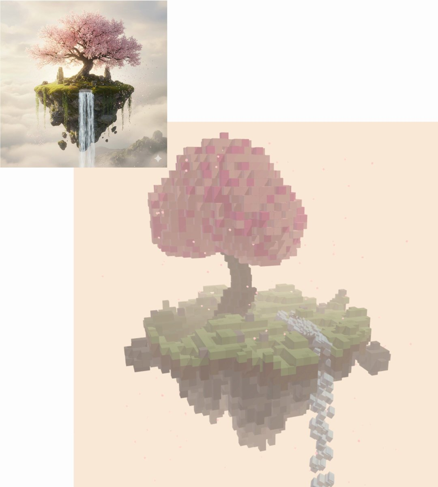

Prompt:

```text
I have provided an image. Code a beautiful voxel art scene inspired by this image. Write threejs code as a single-page
```

### Gemini 3 Pro Prompts #42: 3D Rubik’s cube web app with mix and solve controls

- Category: `3D`
- Model: `Gemini 3 Pro`
- Author / Source: [Alan Shiflett](https://github.com/xianyu110/awesome-gemini-3-prompts/blob/main/README.md)
- Image: `assets/imported/xianyu110/awesome-gemini-3-prompts/README-42-3D-Rubik-s-cube-web-app-with-mix-and-solve-controls.jpg`

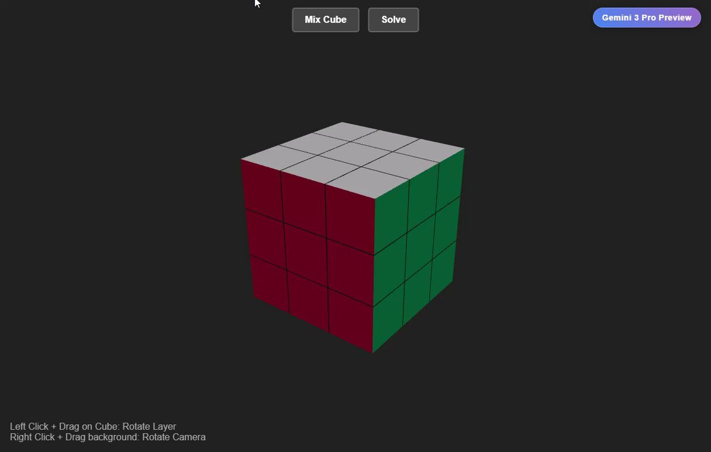

Prompt:

```text
Build a 3D {argument name="puzzle_type_en" default="Rubik's cube"}, include a button to mix it that shuffles the cube, and a button that solves the puzzle. Also allow the user to manually manipulate and solve it themselves.
```

### Gemini 3 Pro Prompts #43: CapCut-like video editor UI in Gemini

- Category: `Video`
- Model: `Gemini 3 Pro`
- Author / Source: [padphone](https://github.com/xianyu110/awesome-gemini-3-prompts/blob/main/README.md)
- Image: `assets/imported/xianyu110/awesome-gemini-3-prompts/README-43-CapCut-like-video-editor-UI-in-Gemini.jpg`

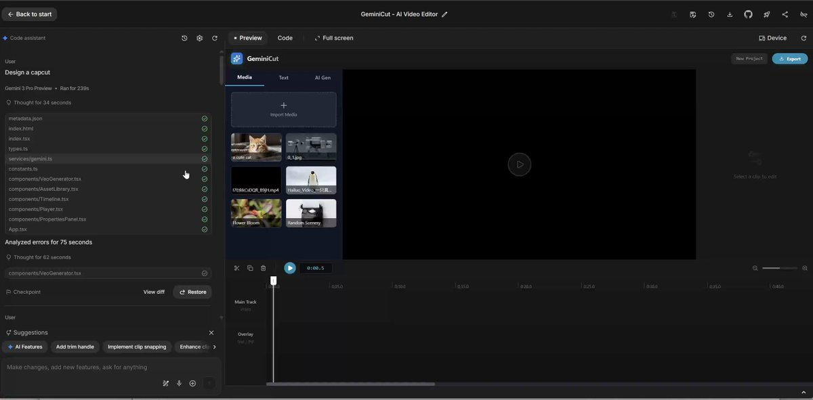

Prompt:

```text
Design a {argument name="app_name_en" default="CapCut"}.
```

### Gemini 3 Pro Prompts #44: Single-file HTML billiards game

- Category: `Creative`
- Model: `Gemini 3 Pro`
- Author / Source: [余温](https://github.com/xianyu110/awesome-gemini-3-prompts/blob/main/README.md)
- Image: `assets/imported/xianyu110/awesome-gemini-3-prompts/README-44-Single-file-HTML-billiards-game.jpg`

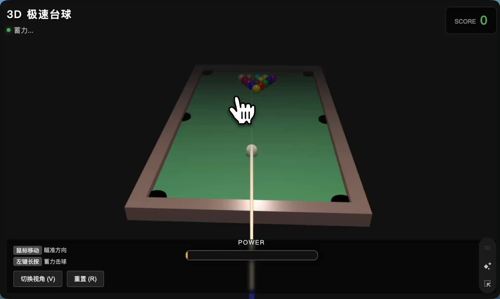

Prompt:

```text
Please create a fully functional {argument name="game_type_en" default="billiards game"} in a single HTML file.
```

### Gemini 3 Pro Prompts #45: Quantum core monitoring single-page HTML

- Category: `Creative`
- Model: `Gemini 3 Pro`
- Author / Source: [余温](https://github.com/xianyu110/awesome-gemini-3-prompts/blob/main/README.md)
- Image: `assets/imported/xianyu110/awesome-gemini-3-prompts/README-45-Quantum-core-monitoring-single-page-HTML.jpg`

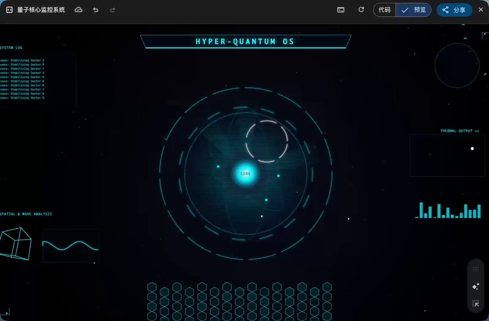

Prompt:

```text
Please generate a single-page HTML (SVG) for a “{argument name="system_name_en" default="Quantum Core Monitoring System"}”.
```

### Gemini 3 Pro Prompts #46: Dynamic point cloud special relativity webpage

- Category: `Creative`
- Model: `Gemini 3 Pro`
- Author / Source: [-Zho-](https://github.com/xianyu110/awesome-gemini-3-prompts/blob/main/README.md)
- Image: `assets/imported/xianyu110/awesome-gemini-3-prompts/README-46-Dynamic-point-cloud-special-relativity-webpage.jpg`

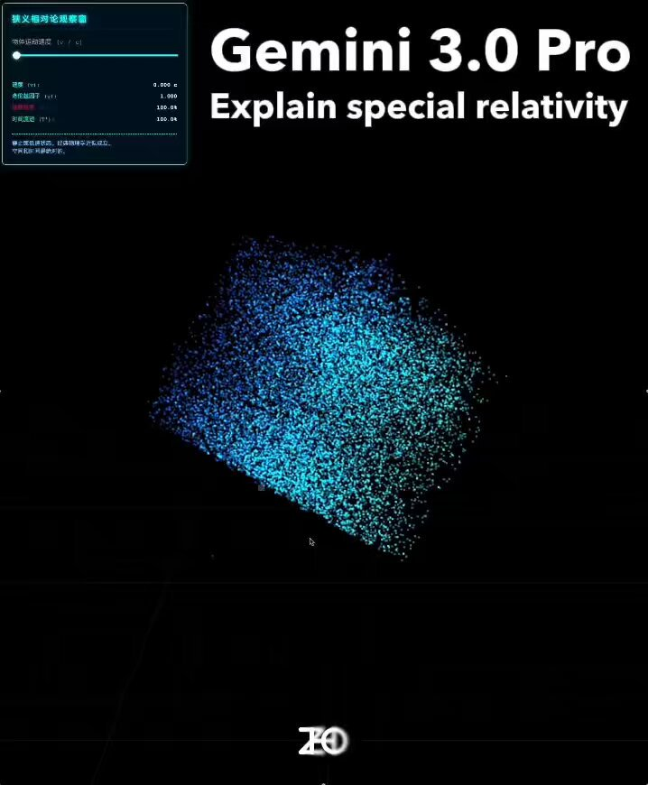

Prompt:

```text
Write a dynamic webpage that uses a cool point-cloud style to explain special relativity.
```

### Gemini 3 Pro Prompts #47: Single-file SVG of an Xbox controller

- Category: `Creative`
- Model: `Gemini 3 Pro`
- Author / Source: [Singularity](https://github.com/xianyu110/awesome-gemini-3-prompts/blob/main/README.md)
- Image: `assets/imported/xianyu110/awesome-gemini-3-prompts/README-47-Single-file-SVG-of-an-Xbox-controller.jpg`

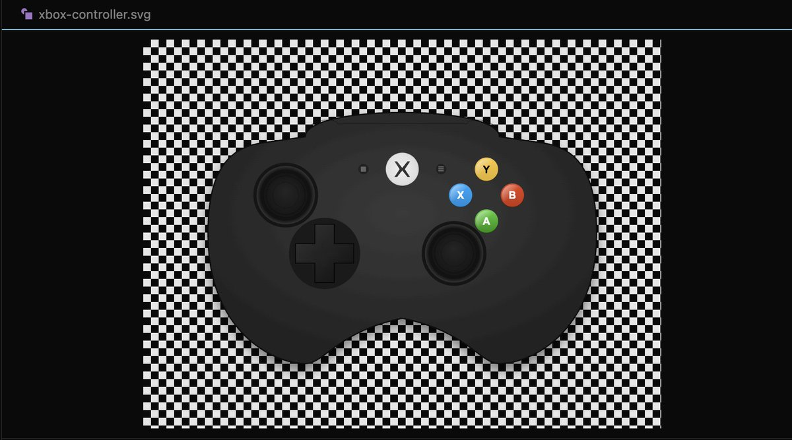

Prompt:

```text
Create an SVG of an {argument name="controller_type_en" default="Xbox controller"}.
```

### Gemini 3 Pro Prompts #48: Neobrutalist webpage generation prompt

- Category: `Creative`
- Model: `Gemini 3 Pro`
- Author / Source: [Dorksense](https://github.com/xianyu110/awesome-gemini-3-prompts/blob/main/README.md)
- Image: `assets/imported/xianyu110/awesome-gemini-3-prompts/README-48-Neobrutalist-webpage-generation-prompt.jpg`

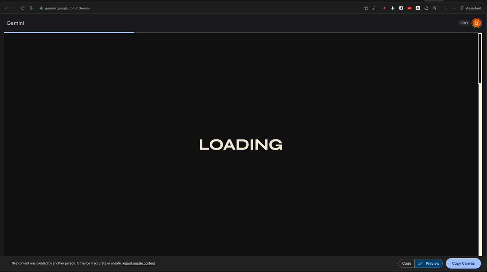

Prompt:

```text
Make a neobrutalist webpage, make it extremely creative and push the limits as far as possible. Add smooth scroll animations, fancy colors, and Tailwind CSS styles. Make it fully responsive. The title of the page is {argument name="page_title" default="dorksense"}.
```

### Gemini 3 Pro Prompts #49: New York skyline SVG single-HTML scene

- Category: `Creative`
- Model: `Gemini 3 Pro`
- Author / Source: [Chetaslua](https://github.com/xianyu110/awesome-gemini-3-prompts/blob/main/README.md)
- Image: `assets/imported/xianyu110/awesome-gemini-3-prompts/README-49-New-York-skyline-SVG-single-HTML-scene.jpg`

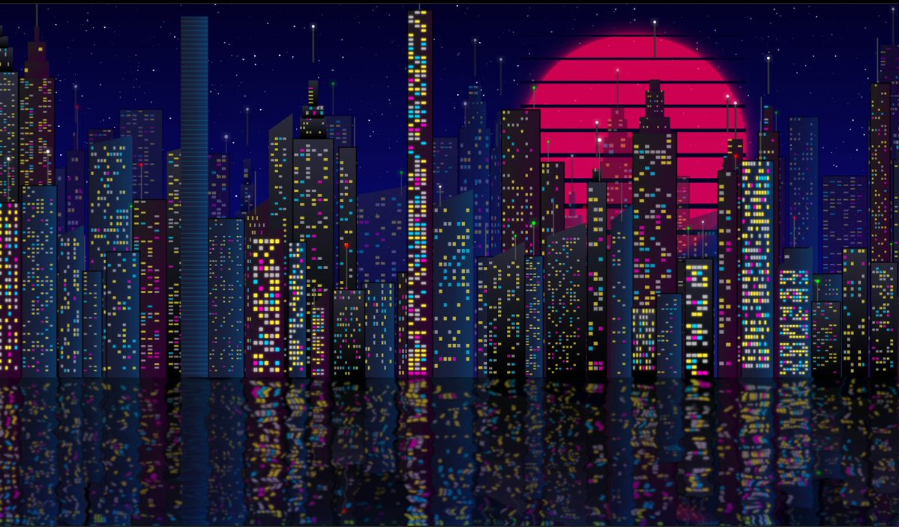

Prompt:

```text
SVG of the {argument name="city_skyline_en" default="New York skyline"}. Use whatever libraries are needed to get this done, but make sure I can paste everything into a single HTML file and open it in Chrome. Make it interesting and highly detailed, showing unexpected details. Go fully creative and fully beautiful in one code block.
```
