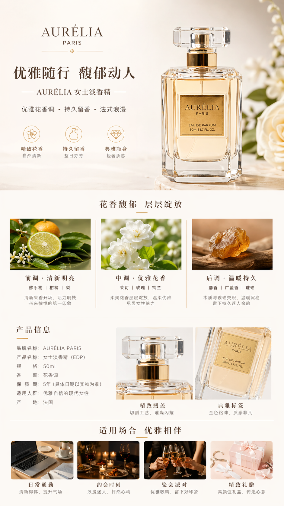
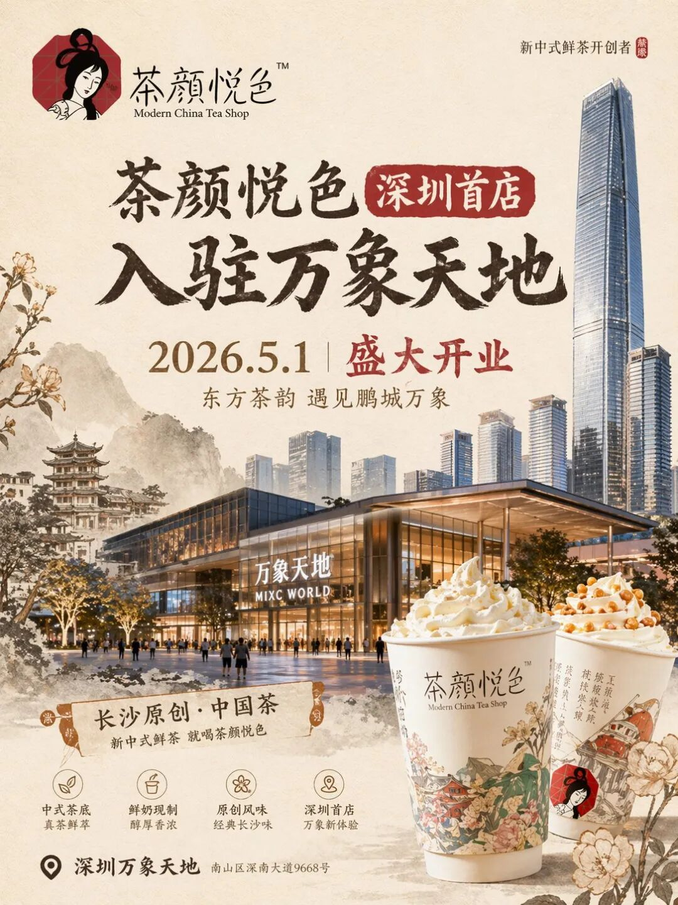
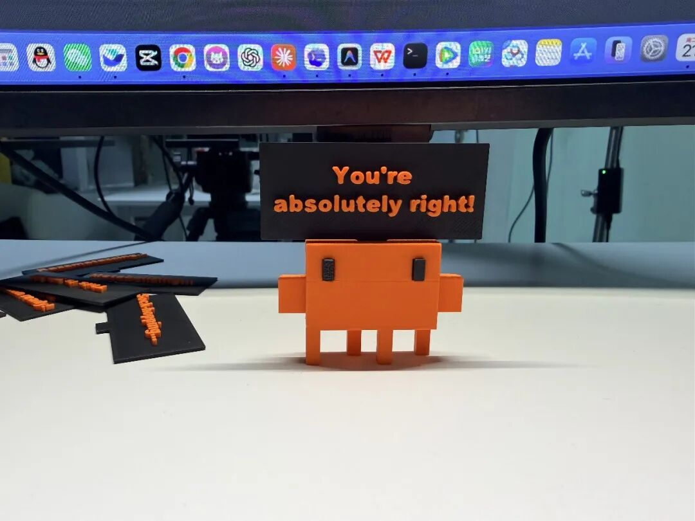
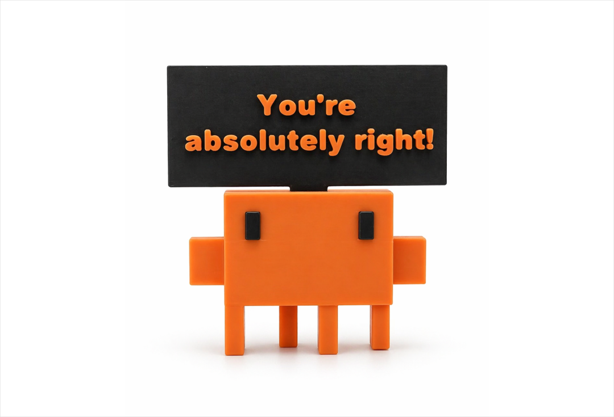
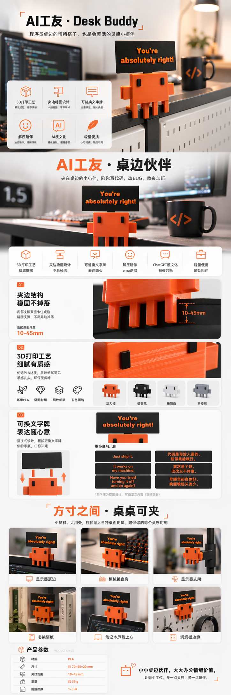
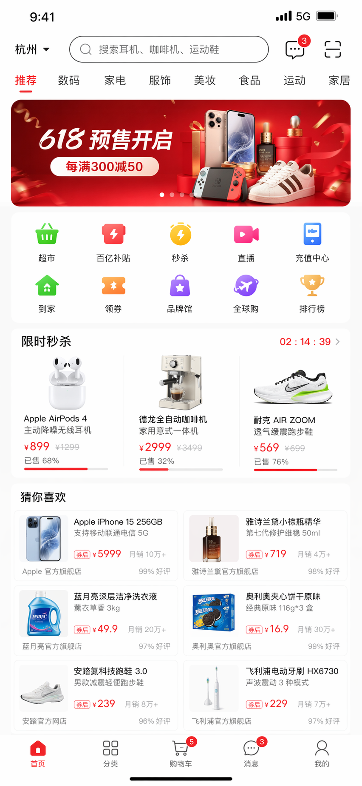
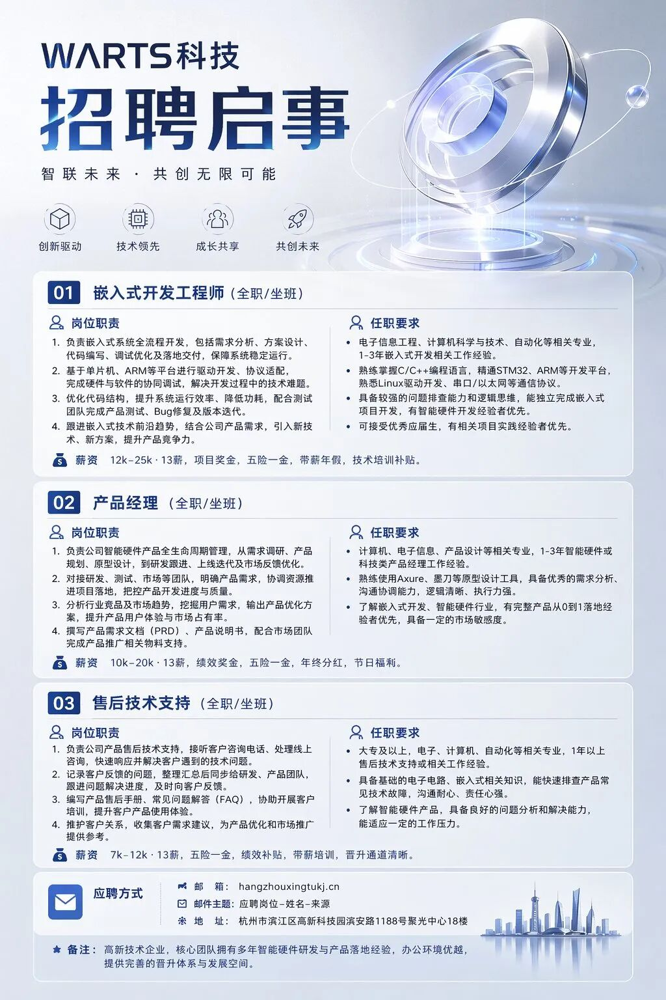
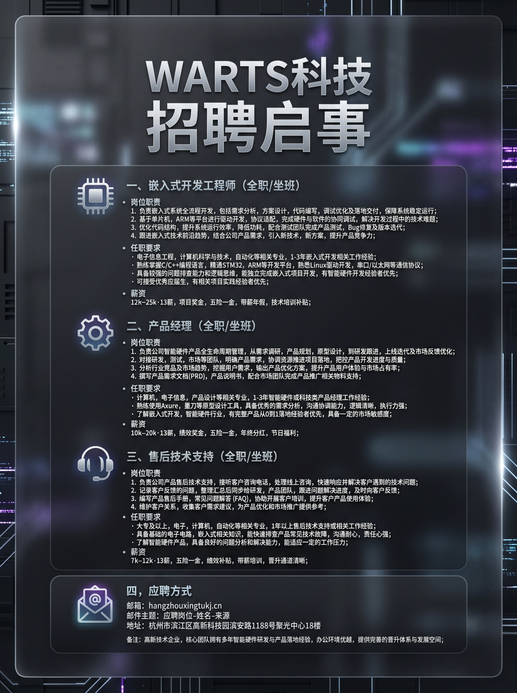
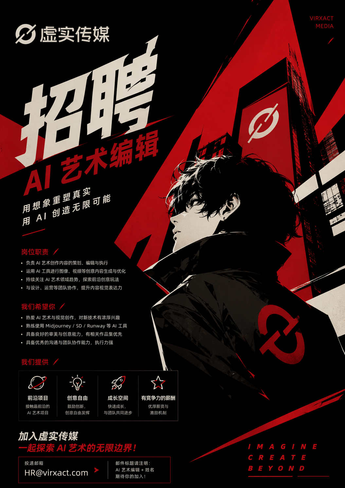

# Image Prompt Generator

GPT Image 2 提示词生成器和 AI 图片提示词图库。

[English README](../README.md)

站点：<https://image-prompt-generator.com/>
GitHub：<https://github.com/xianyu110/image-prompt-generator>

## 内容概览

- 提示词总数：64
- 带图片条目：60
- 模型分区：GPT Image 2 提示词，Nano Banana Pro 提示词，Seedream 4.5 提示词，GPT Image 1.5 提示词，Seedance 2.0 提示词，Grok Imagine 提示词，Gemini 3 Pro 提示词
- 页面结构：上方提示词生成框，下方提示词卡片流，保留作者、来源、图片和复制/尝试入口。

## 模型分类

- [GPT Image 2 提示词](#gpt-image-2-提示词): 12 条
- [Nano Banana Pro 提示词](#nano-banana-pro-提示词): 48 条
- [Seedream 4.5 提示词](#seedream-45-提示词): 4 条
- [GPT Image 1.5 提示词](#gpt-image-15-提示词): 0 条
- [Seedance 2.0 提示词](#seedance-20-提示词): 0 条
- [Grok Imagine 提示词](#grok-imagine-提示词): 0 条
- [Gemini 3 Pro 提示词](#gemini-3-pro-提示词): 0 条

## 本地预览

```bash
python3 -m http.server 8787
```

然后打开 <http://localhost:8787/>。

## 重建数据

```bash
python3 scripts/build_data.py
```

该脚本会读取父级工作区中的本地来源仓库，并写入 `data/prompts.json`。

## 图片与提示词清单

> 按模型分类；每条保留作者/来源信息，图片为本仓库本地资源时使用相对路径展示。

## GPT Image 2 提示词

- 条目数：12
- 带图片：12

### GPT Image 2 提示词 #1: Reusable Pixar-style 3D character portrait prompt

- 分类：`Portrait`
- 作者或来源：[Zara - @ZaraIrahh](https://x.com/ZaraIrahh/status/2048429244632408300)
- 图片：`assets/thumbs/gpt-01.png`



提示词：

```text
A stylized Pixar-style 3D portrait of a young person with smooth skin, large expressive blue eyes, soft facial features, wearing round transparent glasses, modern hairstyle (short styled hair / soft bob cut), casual outfit (hoodie or minimal sweater), slight head tilt and warm smile, friendly and approachable expression, ultra-clean character design, vibrant orange-to-pink gradient background, soft studio lighting with subtle rim light, cinematic depth of field, ultra-detailed, 8K render, octane render style.
```

### GPT Image 2 提示词 #2: Reusable cute animal selfie prompt

- 分类：`Portrait`
- 作者或来源：[Al-Shamus - @im_shahid7](https://x.com/im_shahid7/status/2048432604291240275)
- 图片：`assets/thumbs/gpt-02.jpg`



提示词：

```text
a cute orange and white cat, he looks like hes thinking. taking a selfie inside a dramatically lit room dark room. the cat has big eyes, a chubby face, and a happy expression. the image is a wide-angle shot with sharp focus and high resolution, resulting in a high-definition photograph.
```

### GPT Image 2 提示词 #3: Reusable fashion editorial portrait prompt with effects

- 分类：`Portrait`
- 作者或来源：[𝗦𝗮𝗻𝗶𝗮 - @saniaspeaks_](https://x.com/saniaspeaks_/status/2048431408318705733)
- 图片：`assets/thumbs/gpt-03.jpg`



提示词：

```text
portrait of a young woman with short curly black hair and fair skin, wearing transparent safety goggles and a blue ribbed turtleneck sweater, seated in front of a solid azure blue background, double-exposure motion blur effect to the left side of the face, subtle soft reflections on the glasses, cold ambient lighting, high sharpness on facial features with dreamlike blur trail overlaying second face, fashion editorial studio setup, icy color palette, futuristic retro mood.
```

### GPT Image 2 提示词 #4: Reusable artistic progression/multi-panel prompt

- 分类：`Creative`
- 作者或来源：[Sharon Riley - @Just_sharon7](https://x.com/Just_sharon7/status/2048440567605190853)
- 图片：`assets/thumbs/gpt-04.png`



提示词：

```text
Artistic progression in five vertical panels: from realistic sketch to modern abstract sculpture of a ballerina in arabesque pose. 1. Detailed pencil sketch of ballerina on pointe, elegant extended leg and arms. 2. Refined mid-stage sketch. 3. Strongly stylized flowing lines. 4. Angular geometric abstraction. 5. Final sleek, ribbon-twisted contemporary metal sculpture with beautiful curves and tension. Black ink and charcoal style on white background, high-contrast artistic study, luxury sculpture aesthetic --ar 3:2
```

### GPT Image 2 提示词 #5: Reusable cyber-poetry portrait prompt with text projection

- 分类：`Portrait`
- 作者或来源：[Aijaz - @iamsofiaijaz](https://x.com/iamsofiaijaz/status/2048436757855945137)
- 图片：`assets/thumbs/gpt-05.png`



提示词：

```text
A cinematic, ultra-realistic close-up portrait of a young woman with wet, tousled dark hair and luminous skin, staring directly into the camera with an intense, introspective expression. Glowing cyan handwritten text and symbols are projected across her face, neck, and shoulders, resembling poetic phrases, equations, and abstract handwriting. The light reflections shimmer on her damp skin, creating a futuristic, cyber-poetry aesthetic. Dark, moody background with soft shadows, shallow depth of field, sharp focus on the eyes, high contrast lighting, teal and blue color palette, hyper-detailed skin texture, photorealistic, dramatic atmosphere, cyberpunk meets fine-art portrait photography, 8K quality, cinematic lighting
```

### GPT Image 2 提示词 #6: Reusable luxury fashion ad prompt with text

- 分类：`Poster`
- 作者或来源：[Mr Das - @MrDasOnX](https://x.com/MrDasOnX/status/2048432301445644740)
- 图片：`assets/thumbs/gpt-06.png`


提示词：

```text
Avant-garde luxury watch fashion ad, sophisticated female model in sleek black evening attire dramatically posing with an oversized glowing mechanical watch as the centerpiece, intricate gears and sparkling diamonds visible, bold metallic typography ‘TIMELESS’ floating in the foreground, reflective dark studio floor with scattered gold accents and subtle light beams, high-end editorial photography, dramatic cinematic lighting, luxurious atmosphere –ar 1:1 –stylize 750
```

### GPT Image 2 提示词 #7: Reusable cinematic urban portrait prompt

- 分类：`Portrait`
- 作者或来源：[K - @ChillaiKalan__](https://x.com/ChillaiKalan__/status/2048435840217731378)
- 图片：`assets/thumbs/gpt-07.png`


提示词：

```text
Edit this photo (keep the face unchanged), portrait. Cinematic close-up of a young woman at night in a moody urban setting with neon lighting. She looks back over her shoulder with a soft yet intense expression. Long dark wavy hair with wispy bangs, slightly wind-swept. Natural dewy makeup, minimal styling, wearing a dark oversized leather jacket. Background: blurred city bokeh with streetlights and car lights. Shot on Sony A7S III, 85mm lens, shallow depth of field. Off-center composition. Dramatic split lighting: cool blue on one side, warm red on the other. Teal-and-red color grade, high contrast, subtle film grain and glow.
```

### GPT Image 2 提示词 #8: Reusable luxury sports editorial prompt

- 分类：`Poster`
- 作者或来源：[Taaruk - @Taaruk_](https://x.com/Taaruk_/status/2048438203611533367)
- 图片：`assets/thumbs/gpt-08.png`



提示词：

```text
A dramatic sports editorial scene featuring a professional male footballer wearing an all-black kit, reclining confidently on top of an oversized soccer ball. The ball is hyper-detailed with realistic panels and branding, placed on a glossy reflective floor. The athlete’s pose is relaxed yet powerful, with one arm hanging down and legs extended, showcasing strength and elegance. The background is a bold deep blue studio with massive “GOAL” typography in large, subtle shadowed letters. High-contrast studio lighting with sharp highlights and deep shadows sculpting the body. Clean, minimal composition with a luxury sports campaign aesthetic. Shot with an 85mm lens, ultra-realistic, cinematic lighting, crisp details, 8K resolution, Nike/Adidas-style commercial photography.
```

### GPT Image 2 提示词 #9: Reusable cinematic character prompt with environment details

- 分类：`Portrait`
- 作者或来源：[Snow - @iamrealsnow](https://x.com/iamrealsnow/status/2048444370844807555)
- 图片：`assets/thumbs/gpt-09.png`


提示词：

```text
A powerful young man standing in front of a matte black Hummer H2 on a snowy night, heavy snowfall, dark cinematic atmosphere. The Hummer has a glowing icy number plate with a frosted texture. The subject wears a long black trench coat, leather gloves, and boots, slightly messy hair, intense expression, looking straight into the camera. Low-angle shot to make him look dominant. Cold blue and deep shadow lighting, high contrast, sharp details, foggy breath visible, luxury criminal aura, ultra-realistic, 4K, dramatic tension.
```

### GPT Image 2 提示词 #10: Reusable detailed multi-panel transformation prompt for GPT Image 2

- 分类：`Portrait`
- 作者或来源：[simply - @kingofdairyque](https://x.com/kingofdairyque/status/2048447045640544549)
- 图片：`assets/thumbs/gpt-10.jpg`



提示词：

```text
A high-end cinematic transformation artwork displayed in five vertical panels, showing a luxury perfume evolving from raw essence into a sculptural masterpiece, each panel separated by thin black dividers. Panel 1 (Origin): A premium glass perfume bottle resting on a dark reflective surface, surrounded by raw ingredients like rose petals, oud wood, citrus peel, and mist, soft studio lighting, elegant shadows. Panel 2 (Release): The perfume begins to diffuse into the air, visible fragrant mist swirling upward in fluid motion, forming soft organic shapes, glowing particles and vapor trails. Panel 3 (Transformation): The mist starts shaping into a semi-formed silhouette (abstract human figure or flowing fabric), blending liquid, vapor, and light, luminous and dreamy. Panel 4 (Abstraction): The form becomes fully abstract — flowing ribbons of scent turning into sleek glass-like curves and fluid geometry, dynamic motion frozen mid-air. Panel 5 (Transcendence): Final form — a luxurious sculptural perfume bottle or abstract glass statue inspired by the scent’s essence, polished, reflective, with glowing highlights, sitting on a minimal pedestal. Style: ultra-detailed, photorealistic to abstract progression, deep black background, gold and silver accents, soft glow, high contrast lighting, glossy reflections, cinematic luxury aesthetic, perfume ad style, 4K quality, sharp focus.
```

### GPT Image 2 提示词 #11: Recent post with complete reusable sticker pack prompt and output image.

- 分类：`Portrait`
- 作者或来源：[Noor 🌸](https://x.com/Noor_ul_ain43/status/2049171970227581378)
- 图片：`assets/thumbs/gpt-11.png`



提示词：

```text
A high-quality sticker sheet featuring a cute semi-realistic cartoon girl inspired by the provided reference face: short messy bob haircut, bright yellow hair, soft freckles, brown eyes, glossy lips, hoop earrings, wearing a sleeveless yellow top. Create a grid of multiple expressions and poses: ... Ultra-detailed, 4K resolution, consistent character design across all stickers, no watermark, no extra text outside stickers.
```

### GPT Image 2 提示词 #12: Detailed reusable sports poster prompt for GPT Image 2 with media outputs.

- 分类：`Poster`
- 作者或来源：[SPEEDYAI](https://x.com/SPEEDAI07/status/2049171788731465970)
- 图片：`assets/thumbs/gpt-12.png`



提示词：

```text
Design a '4:5' sports campaign poster that elevates 'Kylian Mbappé' into a sculptural icon of ruthless speed and modern dominance, capturing a moment of explosive elevation as if gravity itself is shattering beneath his acceleration. ... FINISH: Crisp detail on skin and fabric ... NEGATIVE: Avoid generic football poses ...
```

## Nano Banana Pro 提示词

- 条目数：48
- 带图片：48

### Nano Banana Pro 提示词 #1: 终极跨界

- 分类：`Portrait`
- 作者或来源：[@TheRelianceAI](https://x.com/TheRelianceAI/status/1925146916133712191)
- 图片：`assets/thumbs/nano-100.png`


提示词：

```text
Imagine [CHARAKTER 1] and [Charakter 2] casually sitting together at a table in a [FAST FOOD BRAND] restaurant. The atmosphere is relaxed and light-hearted, with the two characters engaged in an amusing or deep conversation over trays of food and drinks.
```

### Nano Banana Pro 提示词 #2: 玩具盒中的历史

- 分类：`3D`
- 作者或来源：[@TheRelianceAI](https://x.com/TheRelianceAI/status/1925223613055017251)
- 图片：`assets/thumbs/nano-99.png`


提示词：

```text
An ultra-realistic top-down photograph of a 3D-printed diorama inside a beige cardboard box, with the lid being held open by two human hands. The interior of the box reveals a miniature landscape of [COUNTRY NAME], featuring iconic landmarks, terrain, buildings, rivers, vegetation, and crowds of tiny, detailed human figures. The diorama is filled with vibrant, geographically appropriate elements, all crafted in a tactile, toy-like style using matte 3D-printed textures with visible layer lines. At the top, the inside of the box lid displays the phrase “[COUNTRY NAME]” in large, colorful, raised plastic letters—each letter in a different bright color. The lighting is warm and cinematic, highlighting the textures and shadows to evoke a sense of realism and charm, as if the viewer is opening a magical miniature version of the natio
```

### Nano Banana Pro 提示词 #3: 3D卡通雕塑风格

- 分类：`Product`
- 作者或来源：[@aziz4ai](https://x.com/aziz4ai/status/1925301120252924356)
- 图片：`assets/thumbs/nano-98.jpeg`


提示词：

```text
a soft 3D cartoon-style sculpture of [brand product], made of smooth clay-like textures and vibrant pastel colors, placed in a minimalist isometric scene that complements the product’s nature, clean composition, gentle lighting, subtle shadows, with the product’s logo and a 3-word slogan displayed clearly belo
```

### Nano Banana Pro 提示词 #4: 复古电脑开机画面解析为ASCII艺术

- 分类：`Infographic`
- 作者或来源：[@Gdgtify](https://x.com/Gdgtify/status/1925176250626159053)
- 图片：`assets/thumbs/nano-97.png`


提示词：

```text
Retro CRT computer boot screen that resolves into ASCII-art of NYC's tallest building
```

### Nano Banana Pro 提示词 #5: 3D蒸汽朋克Logo

- 分类：`Product`
- 作者或来源：[@MayorKingAI](https://x.com/MayorKingAI/status/1925144570553327620)
- 图片：`assets/thumbs/nano-96.jpeg`


提示词：

```text
3D sculpted logo of [LOGO NAME], in a steampunk style, made of aged brass and oxidized iron, with visible rivets, gears, and vintage mechanical elements, distressed and weathered surface, rich copper and bronze tones, engraved with Victorian-style filigree, retro-industrial design, soft spotlight lighting, neutral background, hyper-realistic render, ultra-high resolution, symmetrical composition
```

### Nano Banana Pro 提示词 #6: 品牌平面纸风格

- 分类：`Product`
- 作者或来源：[@HBCoop_](https://x.com/HBCoop_/status/1925213900192043236)
- 图片：`assets/thumbs/nano-95.png`


提示词：

```text
A flat branded paper folds itself into the full 3D shape of a [Air Jordan 1 shoes], mid-motion. Dramatic studio lighting, origami texture detail, gradient shadows, Japanese minimalism feel.
```

### Nano Banana Pro 提示词 #7: 制药风格商品

- 分类：`Product`
- 作者或来源：[@azed_ai](https://x.com/azed_ai/status/1925197464099049735)
- 图片：`assets/thumbs/nano-94.jpeg`


提示词：

```text
A square-format digital photograph showing a fictional pharmaceutical-style product from [Brand Name] Pharmacy. The box is on the left, clean and minimalist, featuring bold text with the product name "[PRODUCT NAME]" and a witty line like "Take one [type] daily." Next to the box is a silver blister pack containing 6–10 themed pills or capsules shaped like [describe icon/logo/item, e.g., a coffee cup, burger, heart, Midjourney logo, etc.]. Neutral background, soft lighting, sharp focus, modern packaging aesthetic.
```

### Nano Banana Pro 提示词 #8: 不同情绪状态的思想泡泡

- 分类：`Portrait`
- 作者或来源：[@TheRelianceAI](https://x.com/TheRelianceAI/status/1925098220398465145)
- 图片：`assets/thumbs/nano-93.jpeg`


提示词：

```text
A [SUBJECT] sits alone in a minimalistic room filled with floating, semi-transparent thought bubbles. Each bubble contains a fragment of their face from different emotional states — smiling, crying, screaming — forming a psychological self-portrait suspended in mid-air.
```

### Nano Banana Pro 提示词 #9: 霓虹玻璃发光

- 分类：`Portrait`
- 作者或来源：[@alban_gz](https://x.com/alban_gz/status/1925446996468371893)
- 图片：`assets/thumbs/nano-92.jpeg`


提示词：

```text
Recreate this image using the parameters from the JSON provided.
{
  "name": "Neon Glass Glow",
  "style": {
    "material": {
      "type": "glass",
      "transparency": 0.92,
      "reflectivity": 1.0,
      "refractionIndex": 1.6,
      "color": "#ff00ff",
      "emission": {
        "color": "#ff66ff",
        "intensity": 0.8
      },
      "surfaceFinish": "glossy",
      "bloom": true,
      "detail": "high"
    },
    "outline": {
      "enabled": true,
      "color": "#ffccff",
      "width": 1.8
    },
    "lighting": {
      "type": "studio",
      "keyLightColor": "#ffffff",
      "keyLightIntensity": 1.0,
      "fillLightColor": "#9900ff",
      "fillLightIntensity": 0.7,
      "rimLightColor": "#00ffff",
      "rimLightIntensity": 0.7,
      "shadows": "crisp"
    },
    "background": {
      "type": "solid",
      "color": "#000000"
    },
    "render": {
      "shadows": true,
      "antiAliasing": true,
      "superSampling": "4x",
      "resolution": "high",
      "depthOfField": {
        "enabled": true,
        "focusDistance": 0.8,
        "blurAmount": 0.1
      }
    }
  }
}
```

### Nano Banana Pro 提示词 #10: 动感雕塑

- 分类：`3D`
- 作者或来源：[@azed_ai](https://x.com/azed_ai/status/1925490847564669153)
- 图片：`assets/thumbs/nano-91.png`


提示词：

```text
A kinetic sculpture of a [subject], made of interlocking metal rods and panels in brushed [color1] and oxidized [color2]. Suspended in motion, with rotating parts casting mechanical shadows on a concrete pedestal.
```

### Nano Banana Pro 提示词 #11: 将您的标志变成毛毡纹理

- 分类：`Product`
- 作者或来源：[@alex_prompter](https://x.com/alex_prompter/status/1925460683509899423)
- 图片：`assets/thumbs/nano-90.jpeg`


提示词：

```text
Retexture [BRAND NAME] logo following my JSON aesthetic below:
{
"style": "realistic needle-felted wool sculpture",
"subject_handling": {
"adapt_to_uploaded_image": true,
"preserve_original_shape_and_layout": true,
"preserve_uploaded_color_values": true,
"preserve_text_if_present": true,
"preserve_text_case": true,
"preserve_exact_letterforms": true,
"use_uploaded_image_as_pixel_map": true,
"prevent_color_estimation_or_stylization": true
},
"needle_felting": {
"material_type": "dyed wool fibers matched precisely to uploaded image pixels",
"texture_description": "fluffy soft felt with clear fiber strands",
"construction_style": "needle-felted, light irregularities allowed but no color bleeding",
"color_application_method": "direct color transfer from uploaded image to wool sculpture",
"prevent_auto_saturation_adjustment": true,
"prevent_color_fading": true,
"color_binding_mode": "pixel-level color fidelity per original image"
},
"lighting": {
"lighting_type": "neutral soft studio lighting",
"shadow": "soft, gray-toned shadows under the object only",
"highlight_behavior": "matte highlights only from felt surface — no bloom or color shift"
},
"background": {
"type": "plain matte studio",
"background_color": "pastel tone that contrasts with logo color",
"color_conflict_handling": "auto-adjust background brightness — do not alter logo colors"
},
"camera": {
"focus_style": "macro lens",
"depth_of_field": "shallow — full subject in sharp detail, soft background",
"angle": "frontal or slightly elevated, full subject visible"
},
"post_processing": {
"color_preservation_enforced": true,
"disable_auto-enhancement_or_tinting": true,
"no artistic reinterpretation": true,
"no auto-correction, bloom, or white balance adjustments": true
},
"image_constraints": {
"transparent_background": false,
"aspect_ratio_locked": true,
"include_text_if_present": true,
"preserve_text_case": true,
"preserve_uploaded_color_values": true,
"prevent_shape_or_color_change": true,
"enforce_exact_pixel_color_match_to_uploaded_image": true
},
"notes": "The uploaded image must be converted into a needle-felted wool sculpture using its exact colors and shape. Use pixel-level mapping to apply the uploaded color values to simulated dyed wool fibers. Do not change, brighten, dull, average, or blend colors. Text must remain intact and readable. Background should be soft pastel to contrast the logo — never adjust the logo to fit the scene."
}
```

### Nano Banana Pro 提示词 #12: 海洋中三艘不同的奇幻帆船

- 分类：`Creative`
- 作者或来源：[@BeanieBlossom](https://x.com/BeanieBlossom/status/1925159751169810806)
- 图片：`assets/thumbs/nano-89.jpeg`


提示词：

```text
Three different fantasy sailboats in the ocean, multiple scenes of beautiful aurora borealis and colorful moons with snowy mountains, a dreamy, fantasy landscape, in the style of digital art.
```

### Nano Banana Pro 提示词 #13: AirBnB 任何东西

- 分类：`Product`
- 作者或来源：[@R2_fieldworks](https://x.com/R2_fieldworks/status/1924433924106727531)
- 图片：`assets/thumbs/nano-88.png`


提示词：

```text
A highly detailed 3D isometric icon of the following object: [OBJECT]

Style: Airbnb 2024 icon language — miniature diorama / emoji-like object with crisp edges, realistic textures, and soft handcrafted realism.  

Material: The object should clearly retains its fundamental qualities but look as if its made from a mixture of matte and plastic-like materials.  

View: three-quarter front-left isometric view with a slight top-down angle.  

Lighting: soft neutral studio lighting from the top-left with subtle shadows and gentle gloss highlights.  

Color palette: retain the fundamental colors from the object and include subtle gradients and no harsh contrasts.  

Background: clean white, no drop shadow or noise.  

Mood: minimal, charming, utilitarian, premium.  

Rendering: hyper-detailed, photorealistic object with depth and tactility, like a designer lifestyle emoji or miniature product model. 

Optional Add-on for Replication:  Use the attached photo as a reference for proportions and layout. Do not copy exactly — reinterpret it in the Airbnb icon aesthetic.
```

### Nano Banana Pro 提示词 #14: 品牌解锁童年回忆

- 分类：`Product`
- 作者或来源：[@TheRelianceAI](https://x.com/TheRelianceAI/status/1925606107608715268)
- 图片：`assets/thumbs/nano-87.png`


提示词：

```text
A realistic, cinematic photograph of a vintage [BRAND NAME] item being gently lifted from a dusty stack of old children's books in a dimly lit attic. The item is designed in classic [BRAND NAME] style—featuring authentic patterns, textures, or logos (e.g. monograms, embossing, or signature motifs relevant to the brand). It is partially opened to reveal a miniature, warmly lit classroom inspired by [COUNTRY] school interiors, complete with small regional-style desks, a chalkboard with delicate handwriting in [LANGUAGE], and traditional local details like shoes, posters, or flags. A paper airplane hovers mid-air. The lighting is moody and nostalgic, with soft shadows and golden highlights suggesting afternoon light filtering through attic beams. On the top book cover at the bottom of the image, the [BRAND NAME] logo is written in an elegant, fountain-pen calligraphy style—subtle, integrated into the scene, and not obscuring the main subject.
```

### Nano Banana Pro 提示词 #15: 未来的OpenAI可穿戴设备

- 分类：`Creative`
- 作者或来源：[@hc_dsn](https://x.com/hc_dsn/status/1925589916844794154)
- 图片：`assets/thumbs/nano-86.png`


提示词：

```text
Create image with 1:1 ratio A next-gen wearable ai [device type] blending Jony Ive–inspired refined minimalism with a new material and interaction language symbolizing the power ChatGPT. The device is crafted from translucent aerogel fused with polished ceramic titanium, feather-light yet futuristic.  No seams, buttons, or traditional UI. Photographed floating against a pure white background, with a soft, diffused, nearly shadowless studio light.
```

### Nano Banana Pro 提示词 #16: 知名戏曲片段的MBTI人格类型卡片

- 分类：`Portrait`
- 作者或来源：[@op7418](https://x.com/op7418/status/1925869690120794320)
- 图片：`assets/thumbs/nano-85.jpeg`


提示词：

```text
# 任务目标
请生成一张基于中国古代知名戏曲片段的MBTI人格类型卡片图片，使戏曲场景扁平插画的情感内涵与MBTI人格特质相对应。，我需要生成的人各类型是[INTP]

## 内容要求
1. **场景选取**：从中国古代知名戏曲片段中提取能体现不同MBTI人格特质的代表性场景
2. **场景意境**：画面需表现完整戏剧场景，通过场景氛围体现对应的人格特质
3. **服饰真实性**：画面中人物必须穿着对应戏曲的正确戏服
4. **人格对应**：每个场景需精准对应一种MBTI人格类型的核心特质

## 卡片排版设计
参考图片样式：
- **顶部**：MBTI类型代码（如INFJ）
- **中部**：渐变色彩的抽象几何图形作为主视觉
- **底部**：
- 中文人格类型名称（如"提倡者"）
- 英文标语：（如"The world is your oyster"）
- 装饰性边框和星形符号

## 视觉风格
- 采用现代极简设计语言
- 渐变色彩与几何形状结合
- 保持神秘感与艺术性
- 整体色调柔和梦幻

## 技术规格
- 卡片尺寸采用标准比例
- 每张卡片需清晰标注MBTI类型代码
- 保持系列视觉一致性
```

### Nano Banana Pro 提示词 #17: 渐变挤出Google I/O 2025大会视觉效果

- 分类：`Portrait`
- 作者或来源：[@hckmstrrahul](https://x.com/hckmstrrahul/status/1925567579856453701)
- 图片：`assets/thumbs/nano-84.jpeg`


提示词：

```text
Retexture this image in the following JSON style aesthetic:
{
  "styleAesthetic": {
    "title": "Isometric Multicolor Extrusion with Grid Control",
    "overallVibe": "Playful modern 3D iconography with directional extrusion and dynamic isometric grids",
    "viewAngle": {
      "type": "Isometric",
      "facingDirection": "right",  // options: left, right, front
      "rotationDegrees": {
        "x": 30,
        "y": 30
      }
    },
    "renderingStyle": "Clean 3D extruded vector with soft lighting and high contrast between faces",
    "objectSurface": {
      "frontFace": {
        "color": "#ffffff",
        "material": "Matte white plastic",
        "lighting": "Soft diffuse"
      },
      "extrudedSide": {
        "type": "Multicolor gradient",
        "gradientStyle": "Diagonal sweep",
        "colorStops": [
          "#ff0040", "#ff8000", "#ffff00", "#00ff90", "#00cfff", "#8000ff"
        ],
        "material": "Glossy plastic",
        "lighting": "Ambient with light falloff"
      }
    },
    "extrusion": {
      "direction": "right",  // determines which side is extruded: left, right, front
      "depth": "moderate"
    },
    "shadows": {
      "type": "Drop shadow",
      "direction": "bottom-right",
      "opacity": 0.15,
      "blurRadius": "6px"
    },
    "background": {
      "type": "Isometric grid",
      "color": "#ffffff",
      "gridStyle": {
        "lineColor": "#e0e0e0",
        "lineWeight": "1px",
        "orientation": "opposite-extrusion"  // automatically flips grid lines to oppose the extrusion direction
      }
    },
    "moodKeywords": [
      "Dimensional",
      "Clean",
      "Geometric",
      "Colorful",
      "Tactile",
      "Structured"
    ]
  }
}
```

### Nano Banana Pro 提示词 #18: Glitch 矢量徽标样式

- 分类：`Product`
- 作者或来源：[@Artedeingenio](https://x.com/Artedeingenio/status/1925844468294365289)
- 图片：`assets/thumbs/nano-83.png`


提示词：

```text
A bold vector logo design in glitch art style, featuring distorted typography with RGB color channel shifts, fragmented lines, misaligned edges, digital noise effects, and a cyberpunk aesthetic. The logo appears corrupted or hacked, as if captured from a malfunctioning screen. Use a black or dark background for contrast, neon or high-saturation color palette, and sharp angular forms.
```

### Nano Banana Pro 提示词 #19: 霓虹花卉和谐插图

- 分类：`Illustration`
- 作者或来源：[@LudovicCreator](https://x.com/LudovicCreator/status/1926246931661042132)
- 图片：`assets/thumbs/nano-82.png`


提示词：

```text
A Neon Floral Harmony illustration of [SUBJECT], with flowers and plants outlined in glowing neon hues. Use vibrant [COLOR1] and [COLOR2] to create a serene yet electrifying botanical scene
```

### Nano Banana Pro 提示词 #20: 品牌乐器

- 分类：`Product`
- 作者或来源：[@TheRelianceAI](https://x.com/TheRelianceAI/status/1926148686884606257)
- 图片：`assets/thumbs/nano-81.png`


提示词：

```text
A highly stylized and vibrant promotional image of a [INSTRUMENT] designed in the visual style of the [BRAND] brand — the instrument is reimagined with iconic colors, patterns, and aesthetic elements of the brand. Set in a dynamic, music-inspired environment, with glowing accents, product-style lighting, and joyful energy. Artistic fusion of music and design. 3D render look, high detail, vibrant colors, futuristic but playful.
```

### Nano Banana Pro 提示词 #21: 水果的形状

- 分类：`Portrait`
- 作者或来源：[@umesh_ai](https://x.com/umesh_ai/status/1926182194159972503)
- 图片：`assets/thumbs/nano-80.jpeg`


提示词：

```text
Create an image by arranging [NUMBER/AGGREGATE] of [FRUIT] strategically on a dark surface to form the shape of [OBJECT/EMOJI/LOGO]
```

### Nano Banana Pro 提示词 #22: Alloy图标

- 分类：`Portrait`
- 作者或来源：[@hc_dsn](https://x.com/hc_dsn/status/1926095406871568670)
- 图片：`assets/thumbs/nano-79.jpeg`


提示词：

```text
create image with 1: 1 ratio  
turn a vector [ type
] icon with the following json style 
{
    "object": "icon",
    "material": {
        "primary_surface": "smooth matted translucent metallic",
        "finish": "iridescent sheen",
        "color_profile": {
            "base_color": "deep blue",
            "secondary_tones": [
                "black",
                "violet",
                "copper-orange highlights"
            ]
        },
        "panel_lines": {
            "material": "metallic copper",
            "visual_treatment": "glowing edge with subtle bevel"
        },
    },
    "lighting": {
        "type": "studio",
        "key_light": {
            "position": "top-left",
            "effect": "smooth gradient highlight across the surface"
        },
        "rim_light": {
            "position": "right side",
            "effect": "sharp metallic edge glow"
        },
        "reflections": {
            "character": "diffused but iridescent, hinting at a highly polished or lacquered surface"
        },
        "shadows": "soft edge, minimal ground contact due to floating presentation"
    },
    "background": {
        "color": "#FFF",
        "style": "solid matte",
    },
    "composition": {
        "camera_angle": "centered, eye-level",
        "depth_of_field": "none (sharp focus throughout)",
        "presentation": "floating, isolated subject"     "angle": "isometric style"
    },
    "visual_style": {
        "tone": "modern, high-impact",
        "inspiration": "sports branding meets futuristic product design",
        "aesthetic": "bold contrast, tech-luxury fusion"
    }
}
```

### Nano Banana Pro 提示词 #23: 毛绒形式表情符号

- 分类：`Portrait`
- 作者或来源：[@alban_gz](https://x.com/alban_gz/status/1925833589431619616)
- 图片：`assets/thumbs/nano-78.png`


提示词：

```text
Recreate this [insert emoji] using the parameters from the JSON provided.
{
  "style": "Plushform Emoji",
  "description": "Transform the emoji into a soft, realistic plush object with high-quality fabric and detailed construction. Do not anthropomorphize the emoji — avoid adding faces or cartoon features. Focus on accurate textures, natural forms, and subtle design to give the plush object character.",
  "features": {
    "shape": "matching the emoji's form, with soft, slightly rounded plush adaptation",
    "texture": "realistic plush fabric with visible fiber detail and natural fabric folds",
    "color": "faithful to the emoji's palette, using slightly muted, tactile tones",
    "material": "stuffed toy fabric with visible stitching, seams, and high-quality finishing",
    "background": "neutral or softly textured to emphasize the plush object's form",
    "lighting": "soft professional studio lighting with subtle shadows and depth"
  },
  "examples": [
    "👌 becomes a plush hand in the OK gesture, with realistic fabric folds and seams.",
    "🎯 becomes a soft plush bullseye with layered fuzzy rings and slight dimensional padding.",
    "🎁 becomes a cube-shaped plush box with fabric ribbon, visible stitching, and realistic fabric texture.",
    "🌊 becomes a wave-shaped plush with curled foam tips, crafted in textured ocean blue fabrics."
  ]
}
```

### Nano Banana Pro 提示词 #24: 3D零食卡通世界

- 分类：`Product`
- 作者或来源：[@aziz4ai](https://x.com/aziz4ai/status/1925895453217898847)
- 图片：`assets/thumbs/nano-77.jpeg`


提示词：

```text
A 3D-rendered digital illustration featuring a retro-style food truck inspired by the brand [INSERT BRAND NAME], designed with smooth pastel colors and soft textures. A black-and-white cartoon character stands beside the truck, holding a product that visually represents the brand. The environment reflects the brand’s world—playful hills, trees, and skies stylized with its color palette and product shapes. The brand’s logo is clearly displayed on the truck, and a short slogan appears naturally within the scene. Format: 1:1, isometric view, cinematic lighting, clean and joyful composition.
```

### Nano Banana Pro 提示词 #25: 黑白漫画风格插图

- 分类：`Portrait`
- 作者或来源：[@CharaspowerAI](https://x.com/CharaspowerAI/status/1923778050845528388)
- 图片：`assets/thumbs/nano-76.png`


提示词：

```text
Highly dramatic and epic black and white manga-style illustration of [Your character and description].  Powerful, dynamic pose, exaggerated features emphasizing the intensity of the scene. Background with explosive energy bursts, lightning effects, and a whirlwind of debris
```

### Nano Banana Pro 提示词 #26: 可爱干净的底座立体模型

- 分类：`3D`
- 作者或来源：[@CharaspowerAI](https://x.com/CharaspowerAI/status/1925593447802540408)
- 图片：`assets/thumbs/nano-75.png`


提示词：

```text
Highly detailed 3D-rendered chibi figurine diorama of [Character A] and [Character B], captured in a [scene/action], inside a [thematic display case shape] with [material]. The background features [visual effects: debris, aura, lightning, scenery], dynamic pose. The title "[custom phrase]" is embossed at the top in [font/style], matching the tone. Lighting is [studio, cinematic, ambient], color palette of [main colors]. Designed in a collectible, stylized, viral-friendly aesthetic.
```

### Nano Banana Pro 提示词 #27: 3D可爱粉彩粘土图标

- 分类：`3D`
- 作者或来源：[@icreatelife](https://x.com/icreatelife/status/1926014358783430945)
- 图片：`assets/thumbs/nano-74.png`


提示词：

```text
Tiny cute isometric [smiling - optional] [OBJECT] emoji, shape, soft lighting, soft pastel colors, [COLOR], 3d icon clay render, blender 3d, pastel background
```

### Nano Banana Pro 提示词 #28: 有趣的毛茸茸字母

- 分类：`Portrait`
- 作者或来源：[@Anima_Labs](https://x.com/Anima_Labs/status/1925933980781535629)
- 图片：`assets/thumbs/nano-73.png`


提示词：

```text
A highly realistic 3D render of the letter [A-Z] designed as a full-body fluffy monster. The letter shape itself is the creature’s body — no separate head or limbs. The eyes, mouth, and other monster features are embedded naturally into the letter form. The monster expresses a [mischievous / grumpy / shy / joyful / sleepy / surprised / confident] emotion through its eyes and mouth shape. The texture is dense, soft, and realistic fur, with subtle volume and shadow. The color palette is bold but clean — solid vibrant tones like mint, lilac, sky blue, or coral (avoid rainbow gradients). Studio lighting on a simple pastel background. No hats, no party props — just a minimal, high-quality character design with playful expression.
```

### Nano Banana Pro 提示词 #29: 超现实主义油画

- 分类：`Creative`
- 作者或来源：[@azed_ai](https://x.com/azed_ai/status/1926217150093549680)
- 图片：`assets/thumbs/nano-72.png`


提示词：

```text
A surreal oil painting of a [subject], executed in the style of early 20th-century dreamscapes. Melting shapes, floating forms, and swirling [color1] and [color2] brushstrokes create a dreamlike dissonance.
```

### Nano Banana Pro 提示词 #30: 景观洞穴入口的形状

- 分类：`Creative`
- 作者或来源：[@umesh_ai](https://x.com/umesh_ai/status/1925819339413836010)
- 图片：`assets/thumbs/nano-71.png`


提示词：

```text
Prompt: An image of a [TYPE] landscape, featuring a cave entrance that is shaped exactly like the outline of a [SHAPE]. The cave should blend naturally into the rugged terrain of the mountain, with the entrance forming a clear and unmistakable [SHAPE] shape. This [SHAPE] shape should be simple and defined, without intricate details, emphasizing just the overall [SHAPE] outline. The surrounding environment should include [DETAILS], but these elements should not distract from the cave's   [SHAPE]-shaped entrance. The lighting in the scene should enhance the visibility and distinctiveness of the [SHAPE]-shaped cave entrance.
```

### Nano Banana Pro 提示词 #31: 重新构想的玫瑰金

- 分类：`Product`
- 作者或来源：[@aziz4ai](https://x.com/aziz4ai/status/1925933649267970074)
- 图片：`assets/thumbs/nano-70.jpeg`


提示词：

```text
Design a luxury-themed 1:1 image featuring a rose gold sculpture that embodies the essence of the jewelry brand “[BRAND NAME]”. The object must symbolically reflect the brand’s identity (e.g., falcon for Cartier, ring for Tiffany & Co., palm tree for Swarovski, camel for Prada). Embed premium crystal textures into key parts of the sculpture (e.g., wings, gem, leaves, or hump) to match the brand’s signature elegance. Use the brand’s iconic background color (e.g., Tiffany Blue, Swarovski White, Cartier Beige, Prada Sand) and place the official logo beneath the sculpture. Add a bold two-word slogan that aligns with the brand’s tone. Lighting should be pure white with high Kelvin value to ensure clarity and prevent yellow tint. The result must feel editorial, artistic, and visually exquisite.
```

### Nano Banana Pro 提示词 #32: 品牌折叠纸

- 分类：`Product`
- 作者或来源：[@HBCoop_](https://x.com/HBCoop_/status/1925600123200881024)
- 图片：`assets/thumbs/nano-69.png`


提示词：

```text
A flat branded paper folds itself into the full 3D shape of a [insert product or item, e.g. “Coca-Cola bottle”, “Nike sneaker”, “Big Mac”], mid-motion. 

The paper colors match the [insert brand name] brand’s signature palette and the natural colors of the item (e.g., [describe key colors or ingredients, like “red and white for Coca-Cola”, “brown, green, yellow for Big Mac”]).

Dramatic studio lighting, origami texture detail, soft gradient shadows. Stylized with Japanese minimalism and elegant negative space. The scene captures a clean, elevated transformation from flat brand identity into sculptural product form.
```

### Nano Banana Pro 提示词 #33: 透明容器里有一个微型的3D世界

- 分类：`Portrait`
- 作者或来源：[@KoppulaMahende9](https://x.com/KoppulaMahende9/status/1920442464810270851)
- 图片：`assets/thumbs/nano-68.png`


提示词：

```text
A giant [transparent or glossy] [object/container] with a miniature 3D diorama inside it, depicting [a symbolic or narrative scene], studio-lit with soft shadows, placed on a neutral matte surface. Emphasize visual contrast between the scale of the capsule and the detail within. Highlight texture, light refraction, and emotional tone (e.g., surreal, poetic, or sci-fi).
```

### Nano Banana Pro 提示词 #34: 可爱微缩场景

- 分类：`Portrait`
- 作者或来源：[@ZHO_ZHO_ZHO](https://x.com/ZHO_ZHO_ZHO/status/1925878276133708224)
- 图片：`assets/thumbs/nano-67.jpeg`


提示词：

```text
{
    "style": "miniature handcrafted diorama",
    "material": "tree branches, cardboard, clay, moss, dried flowers, paper",
    "surface_texture": "organic, rough and varied (wood grain, soft moss, paper texture)",
    "lighting": {
        "type": "soft ambient natural light",
        "intensity": "low to moderate",
        "direction": "diffused overhead",
        "accent_colors": [
            "forest green",
            "earth brown",
            "soft beige",
            "muted pink"
        ],
        "reflections": false,
        "refractions": false,
        "dispersion_effects": false,
        "bloom": false
    },
    "color_scheme": {
        "primary": "natural greens and browns",
        "secondary": "soft neutral tones (cardboard, clay, paper)",
        "highlights": "light falling on the open book and cat’s glasses",
        "rim_light": "subtle natural edge light from the forest opening"
    },
    "background": {
        "color": "natural moss green",
        "vignette": false,
        "texture": "moss and dried floral structure"
    },
    "post_processing": {
        "chromatic_aberration": false,
        "glow": false,
        "high_contrast": false,
        "sharp_details": true,
        "film_grain": false
    },
    "form_composition": {
        "scene_elements": [
            "a small girl sitting on a balcony holding an open miniature book",
            "a cat with glasses observing the book's illustrations",
            "a treehouse made from twigs, cardboard, and clay",
            "balcony and surrounding forest made of moss and dried flowers"
        ],
        "scale": "miniature",
        "theme": "childlike wonder and storytelling in a handcrafted world",
        "visual_metaphor": [
            "curiosity",
            "quiet companionship",
            "imagination in nature"
        ]
    },
    "metadata": {
        "artist": "-Zho-",
        "series": "ZH4O"
    }
}
```

### Nano Banana Pro 提示词 #35: 霓虹灯风格工具

- 分类：`Portrait`
- 作者或来源：[@egeberkina](https://x.com/egeberkina/status/1926005869331849235)
- 图片：`assets/thumbs/nano-66.png`


提示词：

```text
retexture the image attached based on the JSON aesthetic below
{
  "style": "hyperrealistic 3D render",
  "material": "high-gloss translucent rubber with iridescent coating",
  "surface_texture": "fine-grain pebbling with micro-specular highlights",
  "lighting": {
    "type": "studio HDRI",
    "intensity": "high",
    "direction": "multi-point with rim and backlight",
    "colors": ["electric blue", "magenta", "neon purple", "sunset orange"],
    "glow_effect": true,
    "chromatic_aberration": true,
    "bloom": true
  },
  "color_scheme": {
    "primary": "iridescent gradient",
    "highlights": "white light core reflections",
    "accent_edges": "black outlines with subtle glow"
  },
  "background": {
    "color": "solid black",
    "texture": "none",
    "contrast": "extreme to enhance subject glow"
  },
  "camera": {
    "angle": "straight-on center view",
    "focus": "sharp foreground, no depth blur",
    "lens": "macro with light distortion"
  },
  "post_processing": {
    "glow": true,
    "contrast_boost": true,
    "color_grading": "vibrant spectrum",
    "noise": "minimal"
  }
}
```

### Nano Banana Pro 提示词 #36: 皱巴巴的纸片

- 分类：`Photography`
- 作者或来源：[@umesh_ai](https://x.com/umesh_ai/status/1925868463689462049)
- 图片：`assets/thumbs/nano-65.jpeg`


提示词：

```text
A photorealistic image of the word '[NAME]' spelled out using torn, highly crumpled pieces of white paper. Each letter is painted in bold [COLOR] on individual scraps, arranged loosely and unevenly, as if placed casually by hand, on a wooden table. The composition should convey a natural, handmade aesthetic with visible creases, shadows, and wood grain detail
```

### Nano Banana Pro 提示词 #37: 洞壁画

- 分类：`Creative`
- 作者或来源：[@azed_ai](https://x.com/azed_ai/status/1925854528831643689)
- 图片：`assets/thumbs/nano-64.png`


提示词：

```text
A cave painting of a [subject], rendered with primitive ochres and charcoal lines on a rough stone wall. Smudged handprints, crude geometry, and flickering torchlight add a primal, ancient mood.
```

### Nano Banana Pro 提示词 #38: 选择你的阵营

- 分类：`Poster`
- 作者或来源：[@aziz4ai](https://x.com/aziz4ai/status/1925595213726097803)
- 图片：`assets/thumbs/nano-63.jpeg`


提示词：

```text
A dramatic cinematic scene featuring two rival products placed side by side in a custom-designed environment that visually reflects their identities. The composition should include high contrast lighting, atmospheric effects like mist, fog, or neon glow, and hyper-detailed textures. Incorporate a powerful 3D slogan below or behind the products in bold stylized typography that fits the scene’s mood. The products must reflect the essence of [Brand A] and [Brand B] through color, lighting, and placement. Ultra-realistic, moody tones, 1:1 square format, with sharp depth of field and high resolution.
```

### Nano Banana Pro 提示词 #39: 品牌设计指南海报

- 分类：`Product`
- 作者或来源：[@ai4everyday](https://x.com/ai4everyday/status/1925838516979646795)
- 图片：`assets/thumbs/nano-62.jpeg`


提示词：

```text
Create a vertical 9:16 brand design guide poster using the uploaded product image. Adapt the design style to match the product’s niche and visual identity. Structure the poster with clear, elegant sections: (1) Large logo display and safe zone usage, (2) Product mockup centered and highlighted, (3) Primary and secondary color palette swatches with hex codes, (4) Typography guide with heading, subheading, body font samples, and line spacing specs, (5) Iconography or graphic motif examples used by the brand, (6) Image treatment style with sample lifestyle or studio visuals, (7) Grid system or layout rules, (8) Packaging mockups and surface applications, (9) Do’s & Don’ts with annotated visuals. Use minimalist white or soft neutral background with structured layout dividers and drop shadows. The result must be visually rich, clean, and suitable for a printed or digital brand book.
```

### Nano Banana Pro 提示词 #40: 破碎的真相

- 分类：`Portrait`
- 作者或来源：[@TheRelianceAI](https://x.com/TheRelianceAI/status/1925918144163450890)
- 图片：`assets/thumbs/nano-61.png`


提示词：

```text
A close-up of [SUBJECT 1] holding a mirror shard to their face. The shard reflects a completely different [SUBJECT 2]. Around them, small cracks spread through the air like fractures in invisible glass, warping the space itself.
```

### Nano Banana Pro 提示词 #41: 令人垂涎欲滴的广告

- 分类：`Product`
- 作者或来源：[@aziz4ai](https://x.com/aziz4ai/status/1925470550035476622)
- 图片：`assets/thumbs/nano-60.jpeg`


提示词：

```text
a vertical 2:3 high-resolution food advertisement featuring the most iconic and delicious product from a well-known brand called [INSERT BRAND NAME]. The product appears centered with mouthwatering details — such as melted cheese, dripping chocolate, whipped cream, or condensation — depending on the product. The background should be a gradient or pastel tone inspired by the brand’s identity. At the top, display a bold slogan in a color that matches the brand’s style. At the bottom, include the official logo of the brand. Use cinematic studio lighting, soft shadows, and ultra-sharp textures to create a visually irresistible and minimal poster.
```

### Nano Banana Pro 提示词 #42: 军事计划

- 分类：`Creative`
- 作者或来源：[@B_4AI](https://x.com/B_4AI/status/1925479609442738486)
- 图片：`assets/thumbs/nano-59.png`


提示词：

```text
A humorous cartoon scene set inside a military training classroom, featuring a group of [Insect Name] soldiers sitting at desks, wearing tiny helmets and miniature combat gear. They listen attentively to their commander, who stands in front of a large board displaying a sketch of a threat to their existence — the enemy changes depending on the animal or insect. The commander explains the attack plan using a pointer, highlighting sensitive targets with red circles. Some soldiers take notes, others whisper tactical ideas to each other. The overall atmosphere blends seriousness with satire in an exaggerated cartoon style.
```

### Nano Banana Pro 提示词 #43: 血月下的决斗

- 分类：`Photography`
- 作者或来源：[@B_4AI](https://x.com/B_4AI/status/1925509492298375388)
- 图片：`assets/thumbs/nano-58.png`


提示词：

```text
[SUBJECT] in a cinematic painting, battling amid crumbling ruins under a colossal blood moon — ambient sparks flying. Set in an ancient valley, illuminated by firelight and shadows. soft [COLOR1] and vibrant [COLOR2], mood intense and epic.
```

### Nano Banana Pro 提示词 #44: 手工毛线纹理

- 分类：`Product`
- 作者或来源：[@ecommartinez](https://x.com/ecommartinez/status/1925272798479405479)
- 图片：`assets/thumbs/nano-57.png`


提示词：

```text
Crea un render 3D fotorrealista de este logo hecho con hilo grueso y tejido a mano. El hilo debe parecer suave, esponjoso y de gran tamaño, con patrones visibles de tejido como bucles, giros y trenzas. Usa colores brillantes y saturados, estética cálida. Resalta la textura de las fibras, la suavidad del material y el acabado artesanal. Iluminación de estudio suave. Fondo blanco o crema limpio. El logo debe estar centrado y sin elementos adicionales. Cuadrado.
```

### Nano Banana Pro 提示词 #45: 玻璃盒内的图像可视化

- 分类：`3D`
- 作者或来源：[@umesh_ai](https://x.com/umesh_ai/status/1925462472825442469)
- 图片：`assets/thumbs/nano-56.jpeg`


提示词：

```text
photorealistic image of a [COLOR] 3D [SUBJECT] encased in a luxurious transparent box, viewed from an enhanced side angle to better reveal the 3D shape of the [SUBJECT]. The box should be white, exquisitely designed, featuring crystal-clear glass with refined, sharp edges
```

### Nano Banana Pro 提示词 #46: 彩色卡通俏皮图标和徽标

- 分类：`Product`
- 作者或来源：[@gnrlyxyz](https://x.com/gnrlyxyz/status/1925553233881145499)
- 图片：`assets/thumbs/nano-55.jpeg`


提示词：

```text
Create a 2D digital illustration of the [FIREFOX] logo in a colorful cartoon style with bold black outlines. The icon design should feature playful, vibrant solid colors such as pink, teal, orange, yellow, and purple, applied in a flat, bold way. Give the shapes a slightly exaggerated, bubbly form with rounded edges and fun details like starbursts, stripes, or spark effects if relevant. Keep the illustration simple and stylized with a hand-drawn look. Use thick outlines to emphasize form. Vector friendly. White background. Square aspect ratio.
```

### Nano Banana Pro 提示词 #47: 三种形状和三种颜色

- 分类：`Creative`
- 作者或来源：[@umesh_ai](https://x.com/umesh_ai/status/1925569394924740817)
- 图片：`assets/thumbs/nano-54.jpeg`


提示词：

```text
Create a minimalist image of a [SUBJECT] using three geometric shapes, using a different color in each shape
```

### Nano Banana Pro 提示词 #48: 由鲜花组成的小房子

- 分类：`Creative`
- 作者或来源：[@BeanieBlossom](https://x.com/BeanieBlossom/status/1925461720639971505)
- 图片：`assets/thumbs/nano-53.jpeg`


提示词：

```text
A small house made of flowers, a tree with colorful leaves growing on top and around the door, in the style of fantasy, mountainscape in the background, natural lighting, soft colors, rich details, and a full atmosphere, subtle painterly style
```

## Seedream 4.5 提示词

- 条目数：4
- 带图片：0
- 说明：当前条目为 Seedream 提示词模板，可先用于 Seedream 4.5 工作流改写。

### Seedream 4.5 提示词 #1: Seedream product landing page visual

- 分类：`Product`
- 作者或来源：[Image Prompt Generator original](https://image-prompt-generator.com/)
- 图片：暂无图片

提示词：

```text
Create a clean commercial product landing page hero image for [PRODUCT]. Use a premium studio setup, realistic lighting, crisp product edges, tasteful typography space, and a balanced layout suitable for an ecommerce homepage. Keep the product accurate, avoid clutter, and leave enough negative space for headline text.
```

### Seedream 4.5 提示词 #2: Seedream information card with Chinese text

- 分类：`Infographic`
- 作者或来源：[Image Prompt Generator original](https://image-prompt-generator.com/)
- 图片：暂无图片

提示词：

```text
Create a vertical Chinese information card about [TOPIC]. Use a clear editorial grid, strong title hierarchy, readable Chinese typography, small supporting illustrations, and concise section labels. Make it suitable for social sharing, with clean margins and high text legibility.
```

### Seedream 4.5 提示词 #3: Seedream multi-panel visual explanation

- 分类：`Infographic`
- 作者或来源：[Image Prompt Generator original](https://image-prompt-generator.com/)
- 图片：暂无图片

提示词：

```text
Create a five-panel visual explanation of [PROCESS]. Each panel should show one step with consistent characters, clean composition, short readable labels, and a coherent color system. The final image should feel like a polished educational storyboard.
```

### Seedream 4.5 提示词 #4: Seedream precise image editing brief

- 分类：`Photography`
- 作者或来源：[Image Prompt Generator original](https://image-prompt-generator.com/)
- 图片：暂无图片

提示词：

```text
Edit the uploaded image while preserving the main subject, face, pose, and original perspective. Change only [TARGET AREA] into [NEW DETAIL]. Match lighting, shadows, material texture, and camera grain so the edit looks natural and production-ready.
```

## GPT Image 1.5 提示词

- 条目数：0
- 带图片：0

待补充。后续导入更多来源后会加入提示词和图片。

## Seedance 2.0 提示词

- 条目数：0
- 带图片：0

待补充。后续导入更多来源后会加入提示词和图片。

## Grok Imagine 提示词

- 条目数：0
- 带图片：0

待补充。后续导入更多来源后会加入提示词和图片。

## Gemini 3 Pro 提示词

- 条目数：0
- 带图片：0

待补充。后续导入更多来源后会加入提示词和图片。
